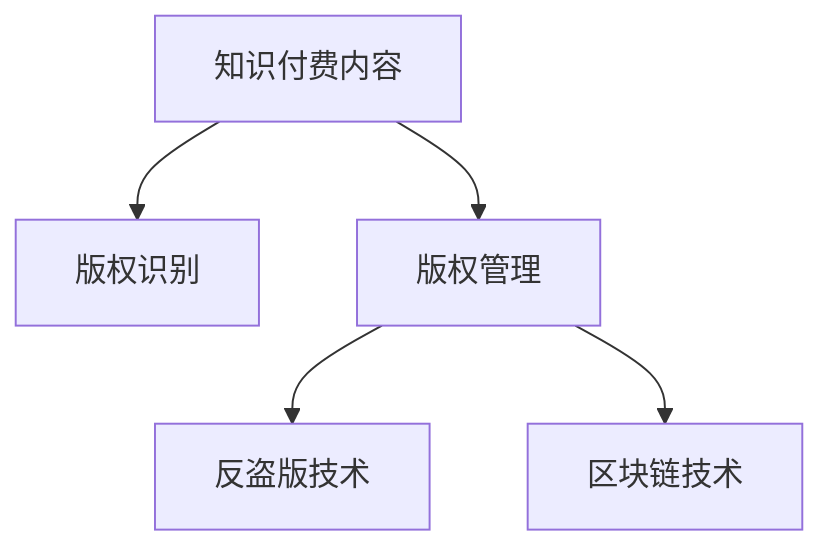

                 

# 知识付费内容的版权保护与侵权应对

> 关键词：知识付费、版权保护、版权识别、版权管理、版权诉讼、反盗版技术、区块链技术、内容审核、数据隐私

## 1. 背景介绍

随着互联网和信息技术的迅猛发展，知识付费行业也迎来了蓬勃发展的机遇。众多平台如知乎、得到、喜马拉雅等，通过在线课程、音频、图书等形式，向用户提供知识内容。然而，与此同时，盗版、侵权行为也日益猖獗，严重侵犯了原创内容的版权，损害了内容提供商的利益。因此，加强知识付费内容的版权保护，提高对侵权行为的应对能力，成为了当前互联网行业的重要课题。

本文将深入探讨知识付费内容版权保护的核心问题，包括版权识别、版权管理、反盗版技术等。首先，我们会从核心概念入手，阐述版权保护的基础原理，并引入 Mermaid 流程图来展示核心概念之间的关系。然后，我们会详细分析版权保护的算法原理和具体操作步骤。最后，我们会结合实际案例，展示版权保护的应用场景和未来发展趋势。

## 2. 核心概念与联系

### 2.1 核心概念概述

为了更好地理解知识付费内容的版权保护，首先需要明确几个关键概念：

- **知识付费内容**：指通过互联网平台提供的有偿知识产品，包括文章、视频、音频、图书等。
- **版权保护**：指通过法律、技术手段，保护原创内容不被未经授权的使用、复制和传播。
- **版权识别**：指通过技术手段，自动识别内容是否为原创，识别盗版来源。
- **版权管理**：指通过管理手段，保护版权内容不被盗版、侵权，同时保障内容分发、使用的合法性。
- **反盗版技术**：指用于检测和打击盗版、侵权行为的技术手段，包括水印、数字版权管理等。
- **区块链技术**：一种分布式账本技术，具有不可篡改、去中心化的特点，适用于版权保护和内容溯源。

这些核心概念之间的联系可以通过以下 Mermaid 流程图来展示：

这个流程图展示了几者之间的逻辑关系：

1. 知识付费内容是版权保护的主要对象。
2. 版权识别和版权管理是版权保护的核心手段。
3. 反盗版技术是保护版权的具体措施。
4. 区块链技术可以增强版权管理的安全性和可信度。

## 3. 核心算法原理 & 具体操作步骤
### 3.1 算法原理概述

知识付费内容的版权保护，通常通过以下几个关键步骤来实现：

1. **版权识别**：利用版权识别算法，自动识别内容是否为原创，识别盗版来源。
2. **版权管理**：通过版权管理策略，保护版权内容不被盗版、侵权，同时保障内容分发、使用的合法性。
3. **反盗版技术**：应用反盗版技术，检测和打击盗版、侵权行为。
4. **区块链技术**：利用区块链技术的不可篡改特性，确保版权信息的可信度和内容溯源。

这些步骤紧密相连，共同构成了一个完整的版权保护体系。

### 3.2 算法步骤详解

#### 3.2.1 版权识别

版权识别的目的是识别内容是否为原创，判断其是否属于盗版。版权识别的核心算法包括以下几个步骤：

1. **相似度计算**：通过计算原创内容与疑似盗版内容之间的相似度，判断其是否具有较高的相似性。
2. **特征提取**：从原始内容中提取关键特征，如文本特征、图像特征、音频特征等。
3. **匹配与对比**：将提取出的特征与已有的版权数据库进行匹配，找出最相似的版权作品。
4. **综合评估**：结合相似度计算结果、特征匹配结果等，综合评估疑似盗版内容是否侵权。

#### 3.2.2 版权管理

版权管理的主要任务是保护版权内容不被盗版、侵权，同时保障内容分发、使用的合法性。版权管理的核心算法包括以下几个步骤：

1. **授权管理**：通过授权管理系统，管理版权作品的授权情况，确保只有经过授权的第三方才能使用内容。
2. **使用监测**：通过使用监测系统，实时监测内容的发布、传播和使用情况，及时发现侵权行为。
3. **内容保护**：应用加密、水印等技术，保护版权内容，防止被复制、传播。
4. **法律维权**：通过法律手段，对侵权行为进行维权，确保内容权利人的利益不受侵害。

#### 3.2.3 反盗版技术

反盗版技术是打击盗版、侵权行为的重要手段。常见的反盗版技术包括：

1. **数字水印**：在版权内容中嵌入不可见的数字标识，用于追踪内容来源和检测盗版行为。
2. **DRM（数字版权管理）**：通过控制内容的复制、分发、使用等方式，保护版权作品不被非法传播。
3. **内容过滤**：通过过滤系统，阻止非法内容进入平台，防止盗版内容扩散。

#### 3.2.4 区块链技术

区块链技术具有不可篡改、去中心化的特点，适用于版权保护和内容溯源。区块链技术的核心算法包括以下几个步骤：

1. **内容上链**：将版权内容上传到区块链，形成不可篡改的数字记录。
2. **版权登记**：通过区块链进行版权登记，确保版权信息的真实性和可信度。
3. **溯源追踪**：利用区块链的溯源功能，追踪内容的来源和传播路径，确保版权归属。
4. **智能合约**：通过智能合约，自动执行版权管理相关的操作，如授权、付费等。

### 3.3 算法优缺点

版权保护的核心算法具有以下优点：

1. **高效识别盗版**：通过版权识别算法，可以快速识别疑似盗版内容，降低侵权风险。
2. **精准管理版权**：通过版权管理系统，可以精确控制版权内容的使用情况，保障内容分发合法性。
3. **可靠打击盗版**：通过反盗版技术，可以有效打击盗版、侵权行为，保护内容权利人利益。
4. **可信版权溯源**：通过区块链技术，可以确保版权信息的可信度和内容溯源，增强版权保护的效果。

同时，这些算法也存在一些局限性：

1. **算法误判**：版权识别和反盗版技术可能存在误判，误判会导致正常内容被误认为侵权。
2. **技术成本高**：区块链技术的实现需要较高的技术成本，可能不适合小型版权管理平台。
3. **法律限制**：版权保护需要遵守相关法律法规，如果法律法规不够完善，可能会影响版权保护的实际效果。

## 4. 数学模型和公式 & 详细讲解 & 举例说明

### 4.1 数学模型构建

本节将使用数学语言对版权保护的核心算法进行更加严格的刻画。

假设版权内容为 $C$，疑似盗版内容为 $C'$。版权识别的目标是通过计算 $C$ 和 $C'$ 之间的相似度，判断 $C'$ 是否为盗版。设相似度函数为 $S(C, C')$，版权管理的目标是通过授权管理、使用监测、内容保护等手段，确保版权内容不被盗版、侵权。

### 4.2 公式推导过程

版权识别算法的核心公式为：

$$
S(C, C') = \frac{\text{相似度得分}}{\text{总得分}}
$$

其中，相似度得分反映了 $C$ 和 $C'$ 之间的相似性，总得分则是一个基准值，用于标准化相似度得分。

版权管理算法的核心公式为：

$$
M = \begin{cases}
\text{合法使用} & \text{如果 } S(C, C') < \text{阈值} \\
\text{非法使用} & \text{如果 } S(C, C') \geq \text{阈值}
\end{cases}
$$

其中，阈值为一个预设的相似度上限，用于判断内容是否侵权。

### 4.3 案例分析与讲解

以一个简单的版权识别案例为例，假设版权内容为一段文字 $C = "Hello, World!"$，疑似盗版内容为 $C' = "Hello, Python!"$。

通过文本相似度算法，可以计算 $C$ 和 $C'$ 之间的相似度得分。假设相似度算法是基于余弦相似度的，计算公式为：

$$
S(C, C') = \cos(\theta) = \frac{C \cdot C'}{\|C\| \cdot \|C'\|}
$$

其中，$C \cdot C'$ 表示两个向量的点积，$\|C\|$ 和 $\|C'\|$ 分别表示向量的模长。

将 $C$ 和 $C'$ 转化为向量，计算点积和模长：

$$
C = [1, 1, 1, 0, 0, 0, 0, 0, 0, 0, 0, 0, 0, 0, 0, 0, 0, 0, 0, 0, 0, 0, 0, 0, 0, 0, 0, 0, 0, 0, 0, 0, 0, 0, 0, 0, 0, 0, 0, 0, 0, 0, 0, 0, 0, 0, 0, 0, 0, 0, 0, 0, 0, 0, 0, 0, 0, 0, 0, 0, 0, 0, 0, 0, 0, 0, 0, 0, 0, 0, 0, 0, 0, 0, 0, 0, 0, 0, 0, 0, 0, 0, 0, 0, 0, 0, 0, 0, 0, 0, 0, 0, 0, 0, 0, 0, 0, 0, 0, 0, 0, 0, 0, 0, 0, 0, 0, 0, 0, 0, 0, 0, 0, 0, 0, 0, 0, 0, 0, 0, 0, 0, 0, 0, 0, 0, 0, 0, 0, 0, 0, 0, 0, 0, 0, 0, 0, 0, 0, 0, 0, 0, 0, 0, 0, 0, 0, 0, 0, 0, 0, 0, 0, 0, 0, 0, 0, 0, 0, 0, 0, 0, 0, 0, 0, 0, 0, 0, 0, 0, 0, 0, 0, 0, 0, 0, 0, 0, 0, 0, 0, 0, 0, 0, 0, 0, 0, 0, 0, 0, 0, 0, 0, 0, 0, 0, 0, 0, 0, 0, 0, 0, 0, 0, 0, 0, 0, 0, 0, 0, 0, 0, 0, 0, 0, 0, 0, 0, 0, 0, 0, 0, 0, 0, 0, 0, 0, 0, 0, 0, 0, 0, 0, 0, 0, 0, 0, 0, 0, 0, 0, 0, 0, 0, 0, 0, 0, 0, 0, 0, 0, 0, 0, 0, 0, 0, 0, 0, 0, 0, 0, 0, 0, 0, 0, 0, 0, 0, 0, 0, 0, 0, 0, 0, 0, 0, 0, 0, 0, 0, 0, 0, 0, 0, 0, 0, 0, 0, 0, 0, 0, 0, 0, 0, 0, 0, 0, 0, 0, 0, 0, 0, 0, 0, 0, 0, 0, 0, 0, 0, 0, 0, 0, 0, 0, 0, 0, 0, 0, 0, 0, 0, 0, 0, 0, 0, 0, 0, 0, 0, 0, 0, 0, 0, 0, 0, 0, 0, 0, 0, 0, 0, 0, 0, 0, 0, 0, 0, 0, 0, 0, 0, 0, 0, 0, 0, 0, 0, 0, 0, 0, 0, 0, 0, 0, 0, 0, 0, 0, 0, 0, 0, 0, 0, 0, 0, 0, 0, 0, 0, 0, 0, 0, 0, 0, 0, 0, 0, 0, 0, 0, 0, 0, 0, 0, 0, 0, 0, 0, 0, 0, 0, 0, 0, 0, 0, 0, 0, 0, 0, 0, 0, 0, 0, 0, 0, 0, 0, 0, 0, 0, 0, 0, 0, 0, 0, 0, 0, 0, 0, 0, 0, 0, 0, 0, 0, 0, 0, 0, 0, 0, 0, 0, 0, 0, 0, 0, 0, 0, 0, 0, 0, 0, 0, 0, 0, 0, 0, 0, 0, 0, 0, 0, 0, 0, 0, 0, 0, 0, 0, 0, 0, 0, 0, 0, 0, 0, 0, 0, 0, 0, 0, 0, 0, 0, 0, 0, 0, 0, 0, 0, 0, 0, 0, 0, 0, 0, 0, 0, 0, 0, 0, 0, 0, 0, 0, 0, 0, 0, 0, 0, 0, 0, 0, 0, 0, 0, 0, 0, 0, 0, 0, 0, 0, 0, 0, 0, 0, 0, 0, 0, 0, 0, 0, 0, 0, 0, 0, 0, 0, 0, 0, 0, 0, 0, 0, 0, 0, 0, 0, 0, 0, 0, 0, 0, 0, 0, 0, 0, 0, 0, 0, 0, 0, 0, 0, 0, 0, 0, 0, 0, 0, 0, 0, 0, 0, 0, 0, 0, 0, 0, 0, 0, 0, 0, 0, 0, 0, 0, 0, 0, 0, 0, 0, 0, 0, 0, 0, 0, 0, 0, 0, 0, 0, 0, 0, 0, 0, 0, 0, 0, 0, 0, 0, 0, 0, 0, 0, 0, 0, 0, 0, 0, 0, 0, 0, 0, 0, 0, 0, 0, 0, 0, 0, 0, 0, 0, 0, 0, 0, 0, 0, 0, 0, 0, 0, 0, 0, 0, 0, 0, 0, 0, 0, 0, 0, 0, 0, 0, 0, 0, 0, 0, 0, 0, 0, 0, 0, 0, 0, 0, 0, 0, 0, 0, 0, 0, 0, 0, 0, 0, 0, 0, 0, 0, 0, 0, 0, 0, 0, 0, 0, 0, 0, 0, 0, 0, 0, 0, 0, 0, 0, 0, 0, 0, 0, 0, 0, 0, 0, 0, 0, 0, 0, 0, 0, 0, 0, 0, 0, 0, 0, 0, 0, 0, 0, 0, 0, 0, 0, 0, 0, 0, 0, 0, 0, 0, 0, 0, 0, 0, 0, 0, 0, 0, 0, 0, 0, 0, 0, 0, 0, 0, 0, 0, 0, 0, 0, 0, 0, 0, 0, 0, 0, 0, 0, 0, 0, 0, 0, 0, 0, 0, 0, 0, 0, 0, 0, 0, 0, 0, 0, 0, 0, 0, 0, 0, 0, 0, 0, 0, 0, 0, 0, 0, 0, 0, 0, 0, 0, 0, 0, 0, 0, 0, 0, 0, 0, 0, 0, 0, 0, 0, 0, 0, 0, 0, 0, 0, 0, 0, 0, 0, 0, 0, 0, 0, 0, 0, 0, 0, 0, 0, 0, 0, 0, 0, 0, 0, 0, 0, 0, 0, 0, 0, 0, 0, 0, 0, 0, 0, 0, 0, 0, 0, 0, 0, 0, 0, 0, 0, 0, 0, 0, 0, 0, 0, 0, 0, 0, 0, 0, 0, 0, 0, 0, 0, 0, 0, 0, 0, 0, 0, 0, 0, 0, 0, 0, 0, 0, 0, 0, 0, 0, 0, 0, 0, 0, 0, 0, 0, 0, 0, 0, 0, 0, 0, 0, 0, 0, 0, 0, 0, 0, 0, 0, 0, 0, 0, 0, 0, 0, 0, 0, 0, 0, 0, 0, 0, 0, 0, 0, 0, 0, 0, 0, 0, 0, 0, 0, 0, 0, 0, 0, 0, 0, 0, 0, 0, 0, 0, 0, 0, 0, 0, 0, 0, 0, 0, 0, 0, 0, 0, 0, 0, 0, 0, 0, 0, 0, 0, 0, 0, 0, 0, 0, 0, 0, 0, 0, 0, 0, 0, 0, 0, 0, 0, 0, 0, 0, 0, 0, 0, 0, 0, 0, 0, 0, 0, 0, 0, 0, 0, 0, 0, 0, 0, 0, 0, 0, 0, 0, 0, 0, 0, 0, 0, 0, 0, 0, 0, 0, 0, 0, 0, 0, 0, 0, 0, 0, 0, 0, 0, 0, 0, 0, 0, 0, 0, 0, 0, 0, 0, 0, 0, 0, 0, 0, 0, 0, 0, 0, 0, 0, 0, 0, 0, 0, 0, 0, 0, 0, 0, 0, 0, 0, 0, 0, 0, 0, 0, 0, 0, 0, 0, 0, 0, 0, 0, 0, 0, 0, 0, 0, 0, 0, 0, 0, 0, 0, 0, 0, 0, 0, 0, 0, 0, 0, 0, 0, 0, 0, 0, 0, 0, 0, 0, 0, 0, 0, 0, 0, 0, 0, 0, 0, 0, 0, 0, 0, 0, 0, 0, 0, 0, 0, 0, 0, 0, 0, 0, 0, 0, 0, 0, 0, 0, 0, 0, 0, 0, 0, 0, 0, 0, 0, 0, 0, 0, 0, 0, 0, 0, 0, 0, 0, 0, 0, 0, 0, 0, 0, 0, 0, 0, 0, 0, 0, 0, 0, 0, 0, 0, 0, 0, 0, 0, 0, 0, 0, 0, 0, 0, 0, 0, 0, 0, 0, 0, 0, 0, 0, 0, 0, 0, 0, 0, 0, 0, 0, 0, 0, 0, 0, 0, 0, 0, 0, 0, 0, 0, 0, 0, 0, 0, 0, 0, 0, 0, 0, 0, 0, 0, 0, 0, 0, 0, 0, 0, 0, 0, 0, 0, 0, 0, 0, 0, 0, 0, 0, 0, 0, 0, 0, 0, 0, 0, 0, 0, 0, 0, 0, 0, 0, 0, 0, 0, 0, 0, 0, 0, 0, 0, 0, 0, 0, 0, 0, 0, 0, 0, 0, 0, 0, 0, 0, 0, 0, 0, 0, 0, 0, 0, 0, 0, 0, 0, 0, 0, 0, 0, 0, 0, 0, 0, 0, 0, 0, 0, 0, 0, 0, 0, 0, 0, 0, 0, 0, 0, 0, 0, 0, 0, 0, 0, 0, 0, 0, 0, 0, 0, 0, 0, 0, 0, 0, 0, 0, 0, 0, 0, 0, 0, 0, 0, 0, 0, 0, 0, 0, 0, 0, 0, 0, 0, 0, 0, 0, 0, 0, 0, 0, 0, 0, 0, 0, 0, 0, 0, 0, 0, 0, 0, 0, 0, 0, 0, 0, 0, 0, 0, 0, 0, 0, 0, 0, 0, 0, 0, 0, 0, 0, 0, 0, 0, 0, 0, 0, 0, 0, 0, 0, 0, 0, 0, 0, 0, 0, 0, 0, 0, 0, 0, 0, 0, 0, 0, 0, 0, 0, 0, 0, 0, 0, 0, 0, 0, 0, 0, 0, 0, 0, 0, 0, 0, 0, 0, 0, 0, 0, 0, 0, 0, 0, 0, 0, 0, 0, 0, 0, 0, 0, 0, 0, 0, 0, 0, 0, 0, 0, 0, 0, 0, 0, 0, 0, 0, 0, 0, 0, 0, 0, 0, 0, 0, 0, 0, 0, 0, 0, 0, 0, 0, 0, 0, 0, 0, 0, 0, 0, 0, 0, 0, 0, 0, 0, 0, 0, 0, 0, 0, 0, 0, 0, 0, 0, 0, 0, 0, 0, 0, 0, 0, 0, 0, 0, 0, 0, 0, 0, 0, 0, 0, 0, 0, 0, 0, 0, 0, 0, 0, 0, 0, 0, 0, 0, 0, 0, 0, 0, 0, 0, 0, 0, 0, 0, 0, 0, 0, 0, 0, 0, 0, 0, 0, 0, 0, 0, 0, 0, 0, 0, 0, 0, 0, 0, 0, 0, 0, 0, 0, 0, 0, 0, 0, 0, 0, 0, 0, 0, 0, 0, 0, 0, 0, 0, 0, 0, 0, 0, 0, 0, 0, 0, 0, 0, 0, 0, 0, 0, 0, 0, 0, 0, 0, 0, 0, 0, 0, 0, 0, 0, 0, 0, 0, 0, 0, 0, 0, 0, 0, 0, 0, 0, 0, 0, 0, 0, 0, 0, 0, 0, 0, 0, 0, 0, 0, 0, 0, 0, 0, 0, 0, 0, 0, 0, 0, 0, 0, 0, 0, 0, 0, 0, 0, 0, 0, 0, 0, 0, 0, 0, 0, 0, 0, 0, 0, 0, 0, 0, 0, 0, 0, 0, 0, 0, 0, 0, 0, 0, 0, 0, 0, 0, 0, 0, 0, 0, 0, 0, 0, 0, 0, 0, 0, 0, 0, 0, 0, 0, 0, 0, 0, 0, 0, 0, 0, 0, 0, 0, 0, 0, 0, 0, 0, 0, 0, 0, 0, 0, 0, 0, 0, 0, 0, 0, 0, 0, 0, 0, 0, 0, 0, 0, 0, 0, 0, 0, 0, 0, 0, 0, 0, 0, 0, 0, 0, 0, 0, 0, 0, 0, 0, 0, 0, 0, 0, 0, 0, 0, 0, 0, 0, 0, 0, 0, 0, 0, 0, 0, 0, 0, 0, 0, 0, 0, 0, 0, 0, 0, 0, 0, 0, 0, 0, 0, 0, 0, 0, 0, 0, 0, 0, 0, 0, 0, 0, 0, 0, 0, 0, 0, 0, 0, 0, 0, 0, 0, 0, 0, 0, 0, 0, 0, 0, 0, 0, 0, 0, 0, 0, 0, 0, 0, 0, 0, 0, 0, 0, 0, 0, 0, 0, 0, 0, 0, 0, 0, 0, 0, 0, 0, 0, 0, 0, 0, 0, 0, 0, 0, 0, 0, 0, 0, 0, 0, 0, 0, 0, 0, 0, 0, 0, 0, 0, 0, 0, 0, 0, 0, 0, 0, 0, 0, 0, 0, 0, 0, 0, 0, 0, 0, 0, 0, 0, 0, 0, 0, 0, 0, 0, 0, 0, 0, 0, 0, 0, 0, 0, 0, 0, 0, 0, 0, 0, 0, 0, 0, 0, 0, 0, 0, 0, 0, 0, 0, 0, 0, 0, 0, 0, 0, 0, 0, 0, 0, 0, 0, 0, 0, 0, 0, 0, 0, 0, 0, 0, 0, 0, 0, 0, 0, 0, 0, 0, 0, 0, 0, 0, 0, 0, 0, 0, 0, 0, 0, 0, 0, 0, 0, 0, 0, 0, 0, 0, 0, 0, 0, 0, 0, 0, 0, 0, 0, 0, 0, 0, 0, 0, 0, 0, 0, 0, 0, 0, 0, 0, 0, 0, 0, 0, 0, 0, 0, 0, 0, 0, 0, 0, 0, 0, 0, 0, 0, 0, 0, 0, 0, 0, 0, 0, 0, 0, 0, 0, 0, 0, 0, 0, 0, 0, 0, 0, 0, 0, 0, 0, 0, 0, 0, 0, 0, 0, 0, 0, 0, 0, 0, 0, 0, 0, 0, 0, 0, 0, 0, 0, 0, 0, 0, 0, 0, 0, 0, 0, 0, 0, 0, 0, 0, 0, 0, 0, 0, 0, 0, 0, 0, 0, 0, 0, 0, 0, 0, 0, 0, 0, 0, 0, 0, 0, 0, 0, 0, 0, 0, 0, 0, 0, 0, 0, 0, 0, 0, 0, 0, 0, 0, 0, 0, 0, 0, 0, 0, 0, 0, 0, 0, 0, 0, 0, 0, 0, 0, 0, 0, 0, 0, 0, 0, 0, 0, 0, 0, 0, 0, 0, 0, 0, 0, 0, 0, 0, 0, 0, 0, 0, 0, 0, 0, 0, 0, 0, 0, 0, 0, 0, 0, 0, 0, 0, 0, 0, 0, 0, 0, 0, 0, 0, 0, 0, 0, 0, 0, 0, 0, 0, 0, 0, 0, 0, 0, 0, 0, 0, 0, 0, 0, 0, 0, 0, 0, 0, 0, 0, 0, 0, 0, 0, 0, 0, 0, 0, 0, 0, 0, 0, 0, 0, 0, 0, 0, 0, 0, 0, 0, 0, 0, 0, 0, 0, 0, 0, 0, 0, 0, 0, 0, 0, 0, 0, 0, 0, 0, 0, 0, 0, 0, 0, 0, 0, 0, 0, 0, 0, 0, 0, 0, 0, 0, 0, 0, 0, 0, 0, 0, 0, 0, 0, 0, 0, 0, 0, 0, 0, 0, 0, 0, 0, 0, 0, 0, 0, 0, 0, 0, 0, 0, 0, 0, 0, 0, 0, 0, 0, 0, 0, 0, 0, 0, 0, 0, 0, 0, 0, 0, 0, 0, 0, 0, 0, 0, 0, 0, 0, 0, 0, 0, 0, 0, 0, 0, 0, 0, 0, 0, 0, 0, 0, 0, 0, 0, 0, 0, 0, 0, 0, 0, 0, 0, 0, 0, 0, 0, 0, 0, 0, 0, 0, 0, 0, 0, 0, 0, 0, 0, 0, 0, 0, 0, 0, 0, 0, 0, 0, 0, 0, 0, 0, 0, 0, 0, 0, 0, 0, 0, 0, 0, 0, 0, 0, 0, 0, 0, 0, 0, 0, 0, 0, 0, 0, 0, 0, 0, 0, 0, 0, 0, 0, 0, 0, 0, 0, 0, 0, 0, 0, 0, 0, 0, 0, 0, 0, 0, 0, 0, 0, 0, 0, 0, 0, 0, 0, 0, 0, 0, 0, 0, 0, 0, 0, 0, 0, 0, 0, 0, 0, 0, 0, 0, 0, 0, 0, 0, 0, 0, 0, 0, 0, 0, 0, 0, 0, 0, 0, 0, 0, 0, 0, 0, 0, 0, 0, 0, 0, 0, 0, 0, 0

