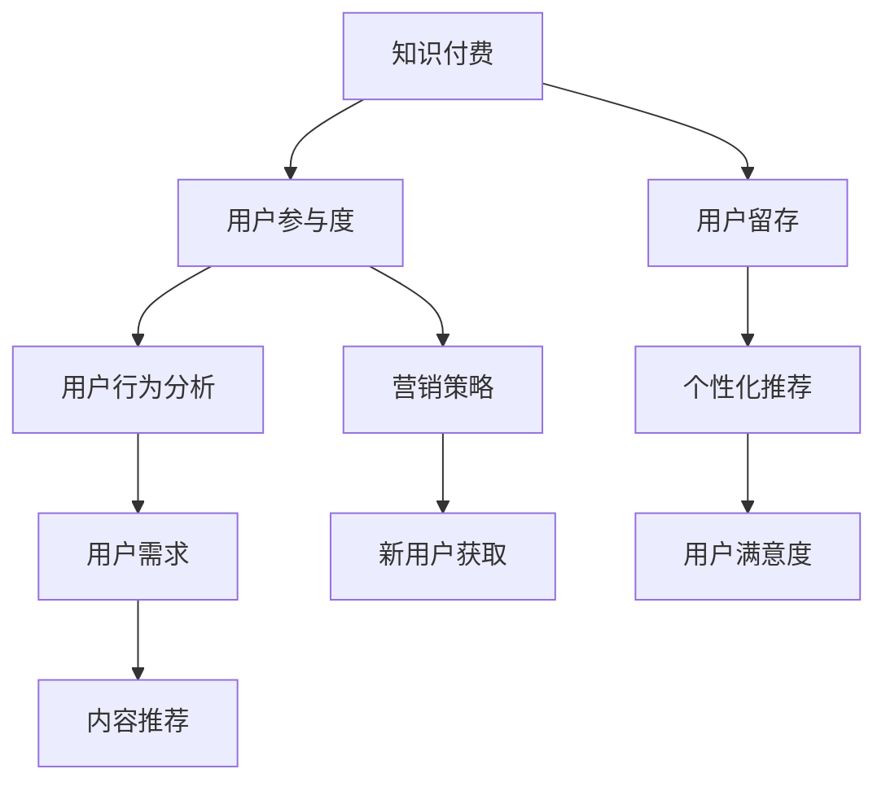

                 

# 知识付费创业中的用户参与度提升策略

> 关键词：知识付费,用户参与度,用户留存,用户行为分析,个性化推荐,营销策略

## 1. 背景介绍

在知识付费领域，随着内容创作者和平台数量的激增，用户选择变得日趋多元。平台如何通过有效策略提升用户参与度，确保用户留存与转化，成为平台发展的关键问题。本文将从用户行为分析、个性化推荐与营销策略三个维度，探讨知识付费创业中的用户参与度提升策略。

## 2. 核心概念与联系

### 2.1 核心概念概述

- **知识付费**：通过在线平台购买或订阅知识内容，以付费形式获取专业知识和技能的学习方式。

- **用户参与度**：用户与知识内容互动的频率和深度，包括浏览、阅读、点赞、评论、付费订阅等行为。

- **用户留存**：用户在平台上活跃的持续时间，反映平台内容的吸引力和用户粘性。

- **用户行为分析**：通过对用户行为数据的挖掘，了解用户需求和偏好，从而制定针对性的运营策略。

- **个性化推荐**：根据用户行为和偏好，推荐适合用户兴趣和需求的内容，提升用户满意度和参与度。

- **营销策略**：结合用户行为分析与个性化推荐，制定精准、有效的营销活动，吸引新用户并转化已有用户。

这些概念之间的逻辑关系可以通过以下Mermaid流程图来展示：



这个流程图展示了几大关键概念之间的相互影响和作用关系：

1. 知识付费业务的开展离不开高用户参与度和用户留存。
2. 通过用户行为分析，平台可以了解用户需求和偏好，制定个性化推荐策略。
3. 个性化推荐提升用户满意度和参与度，进而促进用户留存和转化。
4. 精准营销策略则能更有效地吸引新用户，提升整体用户规模。

## 3. 核心算法原理 & 具体操作步骤
### 3.1 算法原理概述

提升知识付费平台的用户参与度，需要从数据驱动和用户个性化两个层面进行优化。通过用户行为数据的分析，识别用户兴趣和需求，进而制定个性化推荐策略，最终通过针对性的营销活动吸引和转化用户。

### 3.2 算法步骤详解

1. **数据收集**：收集用户行为数据，包括浏览、阅读、点赞、评论、付费订阅等。这些数据是分析用户需求和偏好的基础。

2. **用户行为分析**：通过机器学习算法，对用户行为数据进行分析，挖掘用户的兴趣和需求。常用的分析算法包括协同过滤、基于内容的推荐、聚类分析等。

3. **个性化推荐**：根据用户行为分析结果，推荐适合用户兴趣和需求的内容。常用的推荐算法包括基于矩阵分解的推荐、深度学习推荐系统、多臂老虎机算法等。

4. **营销策略制定**：结合用户行为分析与个性化推荐，制定精准、有效的营销活动。常用的策略包括针对性广告投放、折扣优惠、免费试用等。

5. **效果评估与迭代**：通过用户反馈和行为数据，评估营销活动的效果，并进行持续优化和迭代。

### 3.3 算法优缺点

**优点**：
- 数据驱动：通过用户行为数据进行分析，确保推荐和营销活动更具针对性。
- 个性化推荐：提高用户满意度和参与度，提升用户留存和转化。
- 灵活性高：结合机器学习和算法技术，可以持续优化和迭代，不断提升用户参与度。

**缺点**：
- 算法复杂：需要掌握机器学习、推荐系统等复杂算法，对技术要求较高。
- 数据隐私：收集和分析用户行为数据，可能面临隐私和数据安全问题。
- 用户多样性：用户兴趣和需求多样，单一推荐策略难以满足所有用户。

### 3.4 算法应用领域

个性化推荐和营销策略不仅限于知识付费领域，在电商、新闻、社交媒体等多个领域都有广泛应用。其核心思想是通过用户行为数据分析，实现精准推荐和营销，提升用户参与度和平台活跃度。

## 4. 数学模型和公式 & 详细讲解 & 举例说明

### 4.1 数学模型构建

在知识付费平台中，用户行为分析与个性化推荐可以通过以下数学模型进行建模：

- **协同过滤模型**：基于用户和物品的协同矩阵，找到与目标用户兴趣相似的用户，推荐其喜欢的物品。
- **基于内容的推荐模型**：通过分析用户行为和物品属性，构建用户兴趣和物品属性矩阵，进行匹配推荐。

### 4.2 公式推导过程

以协同过滤模型为例，其核心思想是通过用户-物品的协同矩阵 $P$ 进行推荐。假设用户集为 $U$，物品集为 $I$，用户对物品的评分矩阵为 $P$。推荐系统通过寻找与目标用户 $u$ 兴趣相似的用户 $v$，计算其对物品 $i$ 的评分 $p_{vi}$，然后利用这些评分进行推荐。

设 $N(u)$ 表示与用户 $u$ 兴趣相似的用户集，则推荐系统对物品 $i$ 的评分 $p_{ui}$ 可以表示为：

$$
p_{ui} = \frac{1}{|N(u)|} \sum_{v \in N(u)} p_{vi}
$$

### 4.3 案例分析与讲解

假设有一个知识付费平台，收集了用户对课程的评分数据。平台希望通过协同过滤推荐系统，为用户推荐感兴趣的课程。

首先，平台需要构建用户-课程评分矩阵 $P$，例如：

| 用户 | 课程A | 课程B | 课程C |
| --- | --- | --- | --- |
| 用户1 | 4 | 3 | 2 |
| 用户2 | 3 | 4 | 5 |
| 用户3 | 5 | 2 | 4 |

根据上述评分矩阵，可以计算用户1对课程B的推荐评分：

$$
p_{B1} = \frac{1}{|N(1)|} \times (p_{B1} + p_{B2})
$$

其中 $N(1)$ 表示与用户1兴趣相似的用户集。例如，假设 $N(1)$ 包含用户2和用户3，则：

$$
p_{B1} = \frac{1}{2} \times (p_{B2} + p_{B3}) = \frac{1}{2} \times (3 + 5) = 4
$$

因此，推荐系统推荐课程B给用户1。

## 5. 项目实践：代码实例和详细解释说明

### 5.1 开发环境搭建

为了进行知识付费平台的个性化推荐系统开发，需要以下开发环境：

1. 安装Python和相关依赖包：
```bash
pip install pandas numpy scikit-learn scipy joblib lightgbm
```

2. 安装Flask框架：
```bash
pip install flask
```

3. 安装推荐系统算法库：
```bash
pip install surprise
```

### 5.2 源代码详细实现

以下是一个基于协同过滤模型的推荐系统实现示例：

```python
import pandas as pd
from surprise import Dataset, Reader, KNNBasic, accuracy
from surprise.model_selection import cross_validate

# 读取用户评分数据
data = pd.read_csv('ratings.csv')

# 构建用户-物品评分矩阵
reader = Reader(rating_scale=(1, 5))
data = reader.load_dataframe(data)
trainset = Dataset.load_from_df(data, reader)

# 选择协同过滤算法
algo = KNNBasic(k=5, sim_options={'name': 'pearson_baseline', 'user_based': False})

# 交叉验证和评估
cross_validate(algo, trainset, measures=['RMSE'], cv=5, verbose=True)
```

### 5.3 代码解读与分析

在上述代码中，首先使用Pandas读取用户评分数据，构建用户-物品评分矩阵。然后，选择KNN算法作为推荐系统的核心算法，设置协同过滤参数，并进行交叉验证评估。

## 6. 实际应用场景

### 6.1 智能课程推荐

知识付费平台可以利用个性化推荐系统，根据用户的学习历史和偏好，推荐适合的课程。例如，当用户学习完某门课程后，平台可以推荐与该课程相关联的其他课程，提升用户的学习体验和满意度。

### 6.2 个性化内容推送

平台可以根据用户的历史行为，推送个性化文章、视频等内容。例如，用户浏览过科技类文章，平台可以推送更多科技类文章，提升用户粘性和参与度。

### 6.3 针对性广告投放

平台可以通过个性化推荐和营销策略，进行精准广告投放。例如，针对有购买意向的用户，推送相关课程广告，提高广告点击率和转化率。

### 6.4 未来应用展望

未来，知识付费平台将更加注重用户行为分析和个性化推荐，提升用户参与度和满意度。例如，利用自然语言处理技术，分析用户评论和反馈，从中挖掘出用户需求和建议，进一步优化推荐系统。

## 7. 工具和资源推荐

### 7.1 学习资源推荐

1. 《推荐系统实战》书籍：介绍了推荐系统的基础知识、算法实现和工程实践，适合初学者和进阶读者。

2. Kaggle竞赛平台：通过参与推荐系统竞赛，学习推荐算法和工程实现，提升实战能力。

3. Coursera《机器学习》课程：斯坦福大学开设的机器学习课程，涵盖推荐系统等内容，适合深度学习领域的进阶学习。

### 7.2 开发工具推荐

1. Python：推荐系统开发的首选语言，简单易学，生态丰富。

2. Flask：轻量级Web框架，适合开发推荐系统API接口。

3. Kaggle平台：提供了丰富的数据集和开源工具，方便数据探索和算法验证。

### 7.3 相关论文推荐

1. "Collaborative Filtering for Implicit Feedback Datasets"：Huimin Zhao和Binsong Zhou，介绍了协同过滤算法的原理和应用。

2. "A Survey on Deep Learning for Recommender Systems"：Hengyi Yin和Dingkang Qian，总结了深度学习在推荐系统中的应用。

3. "Feature Engineering for Recommender Systems"：Lech Wójcik，介绍了推荐系统中的特征工程方法。

## 8. 总结：未来发展趋势与挑战

### 8.1 研究成果总结

本文介绍了基于用户行为分析和个性化推荐的知识付费平台用户参与度提升策略，通过协同过滤算法和推荐系统技术，提升了平台的用户留存和转化。

### 8.2 未来发展趋势

未来，知识付费平台将继续深化用户行为分析，提升个性化推荐系统的精准度和效率。结合自然语言处理和深度学习技术，推荐系统将能够更全面地理解用户需求和偏好，提供更加个性化的内容和推荐。

### 8.3 面临的挑战

虽然个性化推荐和营销策略取得了显著效果，但也面临以下挑战：

- 数据隐私：收集和分析用户行为数据，可能面临隐私和数据安全问题。
- 算法复杂：推荐系统算法复杂，需要持续优化和改进。
- 用户多样性：用户兴趣和需求多样，单一推荐策略难以满足所有用户。

### 8.4 研究展望

未来的研究将更加注重推荐系统的可解释性、隐私保护和多样性问题。同时，结合更多先进技术，如因果推断、图神经网络等，提升推荐系统的质量和效果。

## 9. 附录：常见问题与解答

**Q1：个性化推荐算法的准确率如何提升？**

A: 提升个性化推荐算法的准确率，可以从以下方面进行优化：

- 数据质量：确保用户行为数据的完整性和准确性，减少噪声数据对推荐效果的影响。
- 算法模型：选择适合的推荐算法，如深度学习推荐系统、基于矩阵分解的推荐等，根据数据特点进行优化。
- 特征工程：提取更多高质量的特征，如用户属性、物品属性、时间特征等，提升推荐系统的表现。
- 模型优化：通过超参数调优、模型集成等方法，提高推荐系统的精度和泛化能力。

**Q2：如何处理数据隐私问题？**

A: 处理数据隐私问题，可以采用以下策略：

- 数据匿名化：对用户行为数据进行匿名化处理，确保用户隐私不泄露。
- 数据脱敏：对敏感数据进行脱敏处理，降低隐私风险。
- 数据加密：对用户数据进行加密存储，确保数据安全。
- 合规遵守：遵守相关法律法规，如GDPR、CCPA等，确保数据处理合法合规。

**Q3：如何提升用户留存率？**

A: 提升用户留存率，可以从以下方面进行优化：

- 提升内容质量：提供高质量、有价值的内容，满足用户需求和兴趣。
- 优化用户体验：简化注册和付费流程，提供良好的使用体验，提升用户满意度。
- 增强互动性：增加用户互动渠道，如社区、讨论组等，提升用户粘性。
- 定期活动：定期举办各类活动，如课程折扣、会员优惠等，吸引用户回访和消费。

**Q4：如何评估个性化推荐系统的效果？**

A: 评估个性化推荐系统的效果，可以从以下方面进行：

- 推荐准确率：通过交叉验证和测试集评估推荐系统的准确率。
- 用户满意度：通过用户反馈和行为数据，评估推荐系统对用户满意度的提升效果。
- 用户留存率：通过用户行为数据，评估推荐系统对用户留存率的影响。
- 推荐覆盖率：评估推荐系统对用户兴趣的覆盖范围和推荐多样性。

**Q5：个性化推荐系统面临的挑战有哪些？**

A: 个性化推荐系统面临的挑战包括：

- 数据质量：用户行为数据不完整、不准确，影响推荐效果。
- 算法复杂：推荐算法复杂，需要大量计算资源和专业知识。
- 用户多样性：用户兴趣和需求多样，单一推荐策略难以满足所有用户。
- 数据隐私：收集和分析用户行为数据，可能面临隐私和数据安全问题。

---

作者：禅与计算机程序设计艺术 / Zen and the Art of Computer Programming

