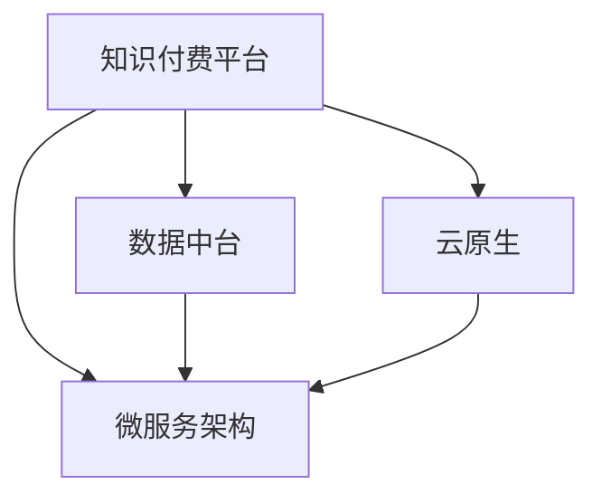

                 

# 知识付费平台搭建技术栈详解

> 关键词：知识付费平台,技术栈,微服务架构,数据中台,云原生

## 1. 背景介绍

### 1.1 问题由来
随着在线教育的兴起，知识付费逐渐成为互联网教育的重要组成部分。知识付费平台通过提供高价值课程和知识内容，满足用户获取专业知识的刚需。然而，如何构建一个高性能、高可用、易于扩展的知识付费平台，成为了业界面临的共同挑战。

### 1.2 问题核心关键点
知识付费平台的核心关键点在于：

- **高性能**：平台需要保证高并发、低延迟，确保课程播放流畅，用户体验良好。
- **高可用**：平台需要具备良好的容灾和恢复能力，防止服务中断，影响用户体验。
- **易于扩展**：平台需要支持快速、灵活的扩展，满足不同规模、不同形式的知识内容需求。
- **数据驱动**：平台需要依赖数据中台，提供精准的用户画像、行为分析，支撑个性化推荐和精准营销。

### 1.3 问题研究意义
构建高性能、高可用、易于扩展的知识付费平台，不仅能够提升用户体验，还能帮助平台运营者实现用户增长、收入提升等商业目标。

## 2. 核心概念与联系

### 2.1 核心概念概述

为了更好地理解知识付费平台搭建的技术栈，本节将介绍几个密切相关的核心概念：

- **知识付费平台**：基于互联网，为知识创作者提供变现渠道，为知识消费者提供获取知识内容的服务平台。
- **微服务架构**：将一个大系统拆分为多个小的、功能独立的服务，通过轻量级的通信协议进行通信，支持系统快速迭代和扩展。
- **数据中台**：通过数据集成、数据治理、数据分析等手段，将分散的数据源统一管理，形成统一的、高质量的数据资产，支撑业务决策和智能化应用。
- **云原生**：基于云平台的技术体系，包括容器化、微服务、持续交付等理念，实现应用程序的弹性扩展、高性能和高可用。

这些核心概念之间的逻辑关系可以通过以下Mermaid流程图来展示：



这个流程图展示了这个知识付费平台的各个核心概念及其之间的关系：

1. 知识付费平台通过微服务架构、数据中台和云原生技术，构建高性能、高可用、易于扩展的系统。
2. 微服务架构和数据中台支持知识的存储、处理和分发。
3. 云原生技术提供弹性扩展、高性能和高可用性保障。

## 3. 核心算法原理 & 具体操作步骤
### 3.1 算法原理概述

知识付费平台的搭建，涉及多个核心模块和组件的集成与协同。这些模块包括用户管理、课程管理、推荐系统、支付系统、内容分发等。以下是这些模块的算法原理概述：

- **用户管理**：通过用户注册、登录、信息管理等操作，实现用户身份验证和个性化设置。
- **课程管理**：包括课程上架、下架、课程更新、课程推荐等，实现知识内容的组织和管理。
- **推荐系统**：根据用户行为数据、课程元数据等，通过机器学习算法进行用户画像和课程推荐。
- **支付系统**：实现课程支付、订单管理、发票生成等功能，保障交易安全。
- **内容分发**：通过CDN、负载均衡等技术，实现课程内容的快速、高效分发。

### 3.2 算法步骤详解

以推荐系统为例，介绍基于协同过滤的推荐算法流程：

1. **数据准备**：收集用户行为数据、课程元数据等，构建用户画像和课程特征矩阵。
2. **相似度计算**：计算用户之间的相似度和课程之间的相似度，构建相似矩阵。
3. **协同过滤算法**：根据用户画像和课程特征，计算用户对课程的预测评分。
4. **推荐排序**：根据预测评分对课程进行排序，生成推荐列表。
5. **反馈迭代**：根据用户实际反馈（如点击、购买等），更新用户画像和课程特征，优化推荐算法。

### 3.3 算法优缺点

基于协同过滤的推荐算法优点：

- **高效**：不需要显式地利用用户兴趣特征，计算复杂度较低。
- **可解释**：用户画像和相似度计算过程直观，容易理解和解释。

缺点：

- **数据稀疏性**：用户行为数据和课程特征矩阵可能存在大量缺失值。
- **冷启动问题**：新用户和课程的推荐效果较差。

### 3.4 算法应用领域

推荐算法在知识付费平台中的应用非常广泛，例如：

- **个性化推荐**：根据用户行为和课程特征，推荐个性化的课程和资源。
- **内容优化**：通过用户反馈，调整课程内容，优化用户体验。
- **新课推荐**：根据用户画像，推荐新上架的课程，提升平台活跃度。

## 4. 数学模型和公式 & 详细讲解  
### 4.1 数学模型构建

推荐系统常用的数学模型包括协同过滤和基于内容的推荐算法。以协同过滤算法为例，构建用户-课程评分矩阵 $U$，用户特征矩阵 $P$，课程特征矩阵 $I$：

$$
U = \begin{bmatrix}
u_1 & u_2 & \cdots & u_n
\end{bmatrix}, \quad P = \begin{bmatrix}
p_{11} & p_{12} & \cdots & p_{1n} \\
p_{21} & p_{22} & \cdots & p_{2n} \\
\vdots & \vdots & \ddots & \vdots \\
p_{N1} & p_{N2} & \cdots & p_{Nn}
\end{bmatrix}, \quad I = \begin{bmatrix}
i_1 & i_2 & \cdots & i_n
\end{bmatrix}
$$

其中 $u_i$ 为用户 $i$ 对课程的评分，$p_{ij}$ 为用户 $i$ 的特征值，$i_j$ 为课程 $j$ 的特征值。

### 4.2 公式推导过程

以用户-课程评分矩阵 $U$ 为例，协同过滤算法的核心公式为：

$$
\hat{U} = P \times I^T
$$

其中 $\hat{U}$ 为预测的用户-课程评分矩阵。在实际应用中，通常使用余弦相似度、皮尔逊相关系数等相似度计算方法，计算用户之间的相似度：

$$
similarity(u_i, u_j) = \cos \theta(u_i, u_j) = \frac{u_i \cdot u_j}{\|u_i\|\|u_j\|}
$$

通过相似度矩阵计算用户对课程的预测评分：

$$
\hat{U} = \sum_{k=1}^N \alpha_k(similarity(u_i, u_k) \times I_k)
$$

其中 $\alpha_k$ 为相似度加权系数，$I_k$ 为课程 $k$ 的特征向量。

### 4.3 案例分析与讲解

以在线教育平台Coursera为例，分析其推荐系统的构建：

1. **数据准备**：收集用户注册信息、课程浏览历史、课程评分等数据，构建用户画像和课程特征矩阵。
2. **相似度计算**：基于用户行为数据和课程特征，计算用户之间的相似度和课程之间的相似度。
3. **协同过滤算法**：使用余弦相似度计算用户对课程的预测评分，生成推荐列表。
4. **推荐排序**：根据预测评分和用户行为，对推荐列表进行排序，提供个性化推荐。
5. **反馈迭代**：根据用户实际点击、购买等行为，更新用户画像和课程特征，优化推荐算法。

通过Coursera的推荐系统案例，可以看到协同过滤算法的实际应用效果和优化策略。

## 5. 项目实践：代码实例和详细解释说明
### 5.1 开发环境搭建

以下是使用Python进行Flask开发的环境配置流程：

1. 安装Python：从官网下载并安装Python 3.7+，用于开发和运行Flask应用。

2. 安装Flask：使用pip安装Flask：

```bash
pip install Flask
```

3. 安装SQLAlchemy：用于数据库访问：

```bash
pip install SQLAlchemy
```

4. 安装Redis：用于缓存和分布式锁：

```bash
pip install redis
```

5. 安装FastAPI：用于快速搭建API：

```bash
pip install fastapi
```

6. 安装PyJWT：用于生成和解析JSON Web Token（JWT）：

```bash
pip install pyjwt
```

完成上述步骤后，即可在本地搭建Flask应用。

### 5.2 源代码详细实现

以下是使用Flask和SQLAlchemy构建知识付费平台用户管理模块的代码实现：

```python
from flask import Flask, jsonify, request
from flask_sqlalchemy import SQLAlchemy
from werkzeug.security import generate_password_hash, check_password_hash

app = Flask(__name__)
app.config['SQLALCHEMY_DATABASE_URI'] = 'sqlite:///users.db'
db = SQLAlchemy(app)

class User(db.Model):
    id = db.Column(db.Integer, primary_key=True)
    username = db.Column(db.String(100), unique=True, nullable=False)
    password_hash = db.Column(db.String(100), nullable=False)
    email = db.Column(db.String(100), unique=True, nullable=False)
    balance = db.Column(db.Float, default=0.0)

@app.route('/users', methods=['POST'])
def add_user():
    data = request.json
    username = data['username']
    password = data['password']
    email = data['email']
    hashed_password = generate_password_hash(password)
    new_user = User(username=username, password_hash=hashed_password, email=email)
    db.session.add(new_user)
    db.session.commit()
    return jsonify({'message': 'User added successfully'}), 200

@app.route('/users/<int:id>', methods=['GET'])
def get_user(id):
    user = User.query.get(id)
    if not user:
        return jsonify({'message': 'User not found'}), 404
    return jsonify({'username': user.username, 'email': user.email, 'balance': user.balance}), 200

if __name__ == '__main__':
    app.run(debug=True)
```

上述代码实现了用户管理模块的基本功能，包括用户注册、获取用户信息等。

### 5.3 代码解读与分析

让我们再详细解读一下关键代码的实现细节：

**User模型**：
- `id`：用户ID，自增主键。
- `username`：用户名，唯一且不能为空。
- `password_hash`：用户密码的哈希值，用于存储用户密码。
- `email`：用户邮箱，唯一且不能为空。
- `balance`：用户账户余额，默认为0。

**add_user函数**：
- 接收用户注册请求，解析JSON数据，获取用户名、密码、邮箱等信息。
- 使用werkzeug.security模块生成密码的哈希值，并将其存储在数据库中。
- 将新用户对象添加到数据库，并提交更改。

**get_user函数**：
- 根据用户ID查询用户信息。
- 如果用户不存在，返回404错误。
- 如果用户存在，返回JSON格式的个人信息。

通过Flask和SQLAlchemy，可以轻松实现知识付费平台的用户管理模块。当然，这只是一个基础框架，实际应用中还需要考虑更多的安全性和性能优化。

### 5.4 运行结果展示

在本地运行上述代码，可以通过以下命令启动Flask应用：

```bash
flask run
```

访问`http://localhost:5000/users`，可以通过POST请求提交用户注册信息，GET请求获取用户信息。

## 6. 实际应用场景
### 6.1 在线教育平台

知识付费平台在在线教育领域具有广泛的应用。例如，Coursera、Udacity等在线教育平台，通过推荐系统为学习者提供个性化的课程推荐，提升学习体验和效果。

**推荐系统应用**：
- **个性化推荐**：根据学习者的学习历史、课程评价等数据，推荐适合的学习内容和课程。
- **课程优化**：通过学习者的学习效果反馈，调整课程内容，优化教学质量。
- **新课推荐**：根据学习者的学习偏好，推荐新上架的课程，提升平台活跃度。

### 6.2 企业培训

企业内部知识付费平台，可以为员工提供在线学习资源，提升其专业技能。推荐系统可以在企业培训场景中，帮助员工发现最适合自身的培训课程，实现员工成长和企业发展的双赢。

**推荐系统应用**：
- **个性化推荐**：根据员工的培训历史、技能需求等数据，推荐个性化的培训课程。
- **课程优化**：通过员工培训效果的反馈，调整课程内容和培训方式，优化培训效果。
- **新课推荐**：根据员工的培训需求，推荐新开发的课程，提升培训资源的丰富性。

### 6.3 健康管理

健康管理平台通过推荐系统，帮助用户获取科学的健康知识和管理建议。推荐系统可以分析用户的健康数据，提供个性化的健康管理方案，提升用户的健康水平和生活质量。

**推荐系统应用**：
- **个性化推荐**：根据用户的健康数据，推荐适合的健康知识和管理建议。
- **健康优化**：通过用户的健康反馈，调整健康管理方案，优化健康效果。
- **新知识推荐**：根据用户的健康需求，推荐最新的健康研究成果，提升知识更新速度。

### 6.4 未来应用展望

随着知识付费平台的不断发展，推荐系统将会在更多场景中发挥重要作用：

1. **智能客服**：知识付费平台可以集成智能客服系统，通过推荐系统为客服提供最佳回复方案，提升客服效率和用户满意度。
2. **社交平台**：知识付费平台可以与社交平台结合，通过推荐系统为社交用户推荐适合的内容和课程，提升社交体验。
3. **内容创作**：知识付费平台可以提供内容创作支持，通过推荐系统为创作者推荐热点话题和用户需求，提升创作效率和用户关注度。

## 7. 工具和资源推荐
### 7.1 学习资源推荐

为了帮助开发者系统掌握知识付费平台搭建的理论基础和实践技巧，这里推荐一些优质的学习资源：

1. **《知识付费平台搭建实战指南》**：深入浅出地介绍知识付费平台的核心技术栈、开发流程和最佳实践。
2. **《在线教育平台技术栈》**：系统讲解在线教育平台的核心技术栈、推荐系统和用户管理模块。
3. **《知识付费平台架构设计》**：探讨知识付费平台架构设计、微服务架构和数据中台技术。
4. **《云原生架构实践》**：介绍云原生技术在知识付费平台中的应用，涵盖容器化、微服务、持续交付等理念。
5. **《推荐系统实战》**：详细讲解协同过滤、基于内容的推荐算法，并结合实际案例进行分析。

通过对这些资源的学习实践，相信你一定能够快速掌握知识付费平台搭建的精髓，并用于解决实际的NLP问题。

### 7.2 开发工具推荐

高效的开发离不开优秀的工具支持。以下是几款用于知识付费平台开发的常用工具：

1. **Flask**：基于Python的开源Web框架，简单易用，适合快速迭代开发。
2. **FastAPI**：基于Python的现代Web框架，适合快速搭建高性能API。
3. **SQLAlchemy**：基于Python的对象关系映射（ORM）框架，支持多种数据库，易于操作。
4. **Redis**：高性能的内存数据存储系统，支持缓存、分布式锁等功能。
5. **Gunicorn**：基于Python的Web服务器，支持异步处理，适合高并发场景。

合理利用这些工具，可以显著提升知识付费平台开发的效率，加快创新迭代的步伐。

### 7.3 相关论文推荐

知识付费平台和推荐系统的发展源于学界的持续研究。以下是几篇奠基性的相关论文，推荐阅读：

1. **《推荐系统》**：介绍推荐系统的基本原理、算法和应用场景。
2. **《在线教育平台的推荐系统》**：探讨在线教育平台推荐系统的构建和优化方法。
3. **《知识付费平台的个性化推荐》**：分析知识付费平台个性化推荐算法的设计和实现。
4. **《云原生架构在知识付费平台中的应用》**：讨论云原生技术在知识付费平台中的应用和挑战。

这些论文代表了大规模知识付费平台和推荐系统的发展脉络。通过学习这些前沿成果，可以帮助研究者把握学科前进方向，激发更多的创新灵感。

## 8. 总结：未来发展趋势与挑战

### 8.1 总结

本文对知识付费平台搭建的技术栈进行了全面系统的介绍。首先阐述了知识付费平台的背景和核心关键点，明确了微服务架构、数据中台和云原生技术在平台构建中的重要作用。其次，从原理到实践，详细讲解了推荐系统的算法原理和具体操作步骤，给出了推荐系统代码实现的完整示例。同时，本文还广泛探讨了推荐系统在在线教育、企业培训、健康管理等多个行业领域的应用前景，展示了推荐系统的广阔应用空间。最后，本文精选了推荐系统的学习资源和开发工具，力求为读者提供全方位的技术指引。

通过本文的系统梳理，可以看到，知识付费平台和推荐系统技术正在成为互联网教育的重要支撑，其背后的微服务架构、数据中台和云原生技术也日益成熟。未来，伴随这些技术的不断发展和完善，知识付费平台将能够更好地满足用户需求，提升教育效果，推动社会的持续进步。

### 8.2 未来发展趋势

展望未来，知识付费平台和推荐系统的发展趋势如下：

1. **算法优化**：推荐算法将进一步优化，引入更多深度学习、强化学习等技术，提升推荐效果和用户体验。
2. **数据融合**：数据中台技术将更加成熟，实现跨平台、跨系统数据的融合和共享，提供更加全面、精准的用户画像。
3. **智能化提升**：知识付费平台将进一步引入AI技术，实现自动化内容生成、个性化推荐等智能化功能。
4. **用户交互优化**：推荐系统将更加注重用户交互体验，引入自然语言处理、情感分析等技术，提升用户粘性和满意度。
5. **个性化定制**：知识付费平台将更加注重个性化定制，提供定制化课程、专属服务等，满足不同用户的多样化需求。
6. **多模态融合**：推荐系统将实现多模态数据的融合，提升对复杂场景的理解和推荐效果。

以上趋势凸显了知识付费平台和推荐系统技术的广阔前景。这些方向的探索发展，必将进一步提升平台的用户体验和商业价值，推动教育、培训、健康等领域的技术革新。

### 8.3 面临的挑战

尽管知识付费平台和推荐系统技术已经取得了瞩目成就，但在迈向更加智能化、普适化应用的过程中，它仍面临着诸多挑战：

1. **数据隐私和安全**：知识付费平台需要处理大量的用户数据，如何保护用户隐私和数据安全，是一个重要的挑战。
2. **算法透明性和可解释性**：推荐算法通常被视为"黑盒"系统，如何提升算法的透明性和可解释性，是提升用户信任的关键。
3. **跨平台集成**：知识付费平台需要与多平台、多系统集成，如何实现无缝对接和数据互通，是一个重要的技术挑战。
4. **用户体验优化**：推荐系统需要平衡个性化推荐和用户体验，如何提升推荐效果，避免推荐过多无用内容，是一个重要的研究方向。
5. **平台扩展性**：知识付费平台需要支持大规模的课程内容分发，如何实现高效、可靠的内容分发，是一个重要的技术挑战。
6. **成本控制**：知识付费平台需要保证低成本运营，如何优化资源利用，降低平台运营成本，是一个重要的研究方向。

这些挑战凸显了知识付费平台和推荐系统技术的复杂性，需要从多个维度进行协同攻关。

### 8.4 研究展望

面向未来，知识付费平台和推荐系统的研究需要在以下几个方面寻求新的突破：

1. **跨平台推荐**：研究如何跨平台、跨系统进行推荐，实现多平台的用户画像和推荐效果统一。
2. **隐私保护**：研究如何保护用户隐私和数据安全，在推荐过程中避免数据泄露和滥用。
3. **算法透明性**：研究如何提升算法的透明性和可解释性，让用户理解推荐系统的决策过程。
4. **多模态融合**：研究如何实现多模态数据的融合，提升推荐系统对复杂场景的理解和推荐效果。
5. **个性化定制**：研究如何实现个性化定制，提供定制化课程、专属服务等，满足不同用户的多样化需求。
6. **实时推荐**：研究如何实现实时推荐，提升推荐系统对用户行为的即时响应能力。
7. **社交网络**：研究如何利用社交网络数据，提升推荐系统的精准性和用户粘性。

这些研究方向的探索，必将引领知识付费平台和推荐系统技术迈向更高的台阶，为知识传播和教育进步提供更强大、更智能的支撑。

## 9. 附录：常见问题与解答

**Q1：知识付费平台需要考虑哪些安全性问题？**

A: 知识付费平台需要考虑以下安全性问题：

1. **数据安全**：保护用户数据，防止数据泄露和滥用。
2. **访问控制**：控制用户访问权限，防止非法用户访问和操作。
3. **支付安全**：保护用户支付信息，防止支付信息被盗用。
4. **内容安全**：防止发布违法、有害内容，维护平台健康环境。
5. **系统安全**：防止系统漏洞和攻击，保障平台稳定运行。

**Q2：推荐系统如何应对冷启动问题？**

A: 推荐系统可以采用以下策略应对冷启动问题：

1. **基于内容的推荐**：利用课程元数据进行推荐，无需用户行为数据。
2. **协同过滤**：通过用户画像和课程特征，计算用户对课程的预测评分。
3. **混合推荐**：结合基于内容和协同过滤的推荐方法，提升推荐效果。
4. **新用户引导**：通过引导用户填写兴趣偏好，快速建立用户画像。

**Q3：如何优化推荐系统的性能？**

A: 推荐系统可以采用以下策略优化性能：

1. **缓存机制**：使用缓存技术，减少数据库访问，提升推荐速度。
2. **分布式计算**：使用分布式计算技术，提升推荐算法的并行性和计算效率。
3. **异步处理**：使用异步处理技术，减少系统延迟，提升用户体验。
4. **数据压缩**：使用数据压缩技术，减少数据传输和存储开销。
5. **算法优化**：优化推荐算法，减少计算复杂度，提升推荐效果。

这些策略需要根据具体应用场景进行灵活组合，以达到最优的效果。

**Q4：知识付费平台如何实现多平台集成？**

A: 知识付费平台可以通过以下步骤实现多平台集成：

1. **统一接口**：设计统一的API接口，实现跨平台调用。
2. **中间件**：使用中间件技术，实现跨平台数据共享和业务协同。
3. **API网关**：使用API网关技术，实现跨平台流量管理和负载均衡。
4. **分布式架构**：使用分布式架构，实现跨平台数据的分布式存储和处理。
5. **微服务架构**：使用微服务架构，实现跨平台业务的模块化和松耦合。

这些策略需要根据具体应用需求进行灵活选择，以达到最佳的效果。

**Q5：推荐系统如何实现实时推荐？**

A: 推荐系统可以采用以下策略实现实时推荐：

1. **实时数据处理**：使用实时数据处理技术，如消息队列、流式计算等，对用户行为进行实时分析。
2. **缓存机制**：使用缓存技术，对热门数据进行缓存，提升推荐速度。
3. **异步处理**：使用异步处理技术，对实时数据进行异步计算。
4. **流式计算**：使用流式计算技术，对实时数据进行实时分析和处理。

这些策略需要根据具体应用场景进行灵活组合，以达到最优的效果。

**Q6：推荐系统如何实现跨平台推荐？**

A: 推荐系统可以采用以下策略实现跨平台推荐：

1. **统一数据模型**：使用统一的数据模型，实现跨平台数据共享和业务协同。
2. **API接口统一**：设计统一的API接口，实现跨平台调用。
3. **分布式架构**：使用分布式架构，实现跨平台数据的分布式存储和处理。
4. **微服务架构**：使用微服务架构，实现跨平台业务的模块化和松耦合。
5. **推荐算法统一**：使用统一的推荐算法，实现跨平台的推荐效果统一。

这些策略需要根据具体应用需求进行灵活选择，以达到最佳的效果。

**Q7：推荐系统如何实现个性化推荐？**

A: 推荐系统可以采用以下策略实现个性化推荐：

1. **用户画像**：通过用户行为数据、课程元数据等，构建用户画像，了解用户需求和兴趣。
2. **协同过滤**：通过相似用户和课程的推荐，实现个性化推荐。
3. **内容推荐**：通过课程元数据、标签等，实现个性化推荐。
4. **混合推荐**：结合基于内容和协同过滤的推荐方法，提升推荐效果。

这些策略需要根据具体应用场景进行灵活组合，以达到最优的效果。

通过上述常见问题的解答，相信你对知识付费平台的搭建有了更深入的理解和实践能力。掌握这些关键技术和方法，一定能够构建高性能、高可用、易于扩展的知识付费平台，实现知识传播和教育进步的双重目标。

