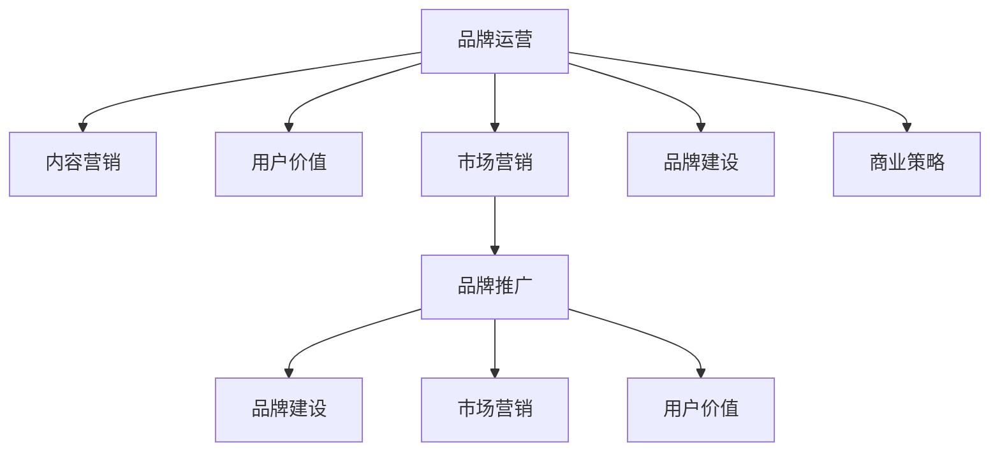

                 

# 知识付费赚钱的品牌品牌运营与品牌推广策略

> 关键词：知识付费, 品牌运营, 品牌推广, 用户价值, 市场营销, 内容营销, 数据驱动, 品牌建设, 商业策略

## 1. 背景介绍

### 1.1 问题由来
随着移动互联网和数字内容产业的蓬勃发展，知识付费行业正处于快速扩张阶段。各大知识付费平台如喜马拉雅、得到、知识星球等纷纷崛起，内容创作者和用户数量大幅增长。在这样一个市场中，品牌运营和品牌推广成为了知识付费平台与内容创作者提高市场竞争力和吸引用户的关键策略。

品牌运营旨在通过有策略的内容输出和市场互动，提升品牌知名度和用户满意度。而品牌推广则是通过有效传递品牌价值，达到用户获取和转化的目标。

### 1.2 问题核心关键点
品牌运营与品牌推广的核心关键点在于：
- **用户价值**：衡量品牌给用户带来的实际价值。
- **市场营销**：制定有效的市场策略，吸引并保持用户。
- **内容营销**：利用优质内容吸引用户，增强用户粘性。
- **数据驱动**：通过数据分析指导运营决策，优化品牌推广效果。
- **品牌建设**：建立和传播品牌形象，提升品牌忠诚度。
- **商业策略**：结合商业目标，制定可行的品牌推广路径。

理解这些关键点，有助于平台和内容创作者更好地进行品牌运营和品牌推广，提升其在知识付费市场的竞争力。

### 1.3 问题研究意义
品牌运营与品牌推广研究的意义在于：
- **提高市场竞争力**：通过有效运营和推广策略，增强品牌在知识付费市场的地位。
- **提升用户满意度**：提供高质量的内容和优质的用户体验，增加用户粘性和忠诚度。
- **促进商业变现**：结合品牌运营和推广，更有效地实现用户转化和收入增长。
- **推动行业发展**：通过不断优化运营和推广策略，推动整个知识付费行业的发展。

## 2. 核心概念与联系

### 2.1 核心概念概述

为更好地理解知识付费平台与内容创作者的品牌运营与品牌推广策略，本节将介绍几个密切相关的核心概念：

- **品牌运营(Brand Operation)**：通过内容输出、市场互动等手段，提升品牌知名度和用户满意度。
- **品牌推广(Brand Promotion)**：通过营销手段传递品牌价值，吸引用户并实现转化。
- **用户价值(User Value)**：用户从品牌中获得的实际利益和感受。
- **市场营销(Marketing Strategy)**：基于市场调研，制定有效的推广策略。
- **内容营销(Content Marketing)**：利用优质内容吸引用户，增强用户粘性。
- **数据驱动(Data-Driven)**：通过数据分析指导运营决策，优化推广效果。
- **品牌建设(Brand Building)**：建立和传播品牌形象，提升品牌忠诚度。
- **商业策略(Business Strategy)**：结合商业目标，制定可行的推广路径。

这些核心概念之间的逻辑关系可以通过以下Mermaid流程图来展示：



这个流程图展示了几大核心概念及其之间的联系：

1. 品牌运营通过内容营销和市场营销，提升品牌知名度和用户满意度。
2. 市场营销和品牌建设帮助品牌推广吸引用户，实现转化。
3. 用户价值通过市场营销和内容营销得到提升。
4. 品牌推广结合商业策略，确保品牌的可持续发展。

这些概念共同构成了知识付费品牌运营与品牌推广的框架，使品牌能够在知识付费市场中进行有效运营和推广。

## 3. 核心算法原理 & 具体操作步骤
### 3.1 算法原理概述

知识付费平台与内容创作者的品牌运营与品牌推广，本质上是一个有策略的市场营销过程。其核心思想是：通过系统化的品牌运营，利用内容营销和市场推广手段，提升品牌知名度，吸引并保持用户，最终实现商业变现。

形式化地，假设平台和创作者的品牌为 $B$，市场为 $M$，品牌价值为 $V$，则品牌推广的目标是找到新的品牌价值 $V^*$，使得：

$$
V^*=\mathop{\arg\max}_{V} \mathcal{L}(B,M,V)
$$

其中 $\mathcal{L}$ 为品牌推广的损失函数，用于衡量品牌推广在市场 $M$ 中的表现。通常，品牌推广的损失函数包括用户获取率、转化率、用户满意度等指标。

通过梯度下降等优化算法，品牌推广过程不断更新品牌价值 $V$，最小化损失函数 $\mathcal{L}$，使得品牌推广在市场 $M$ 中达到最优表现。由于品牌价值 $V$ 已经通过品牌运营获得了较好的初始化，因此即便在知识付费市场中，也能较快收敛到理想的品牌价值 $V^*$。

### 3.2 算法步骤详解

知识付费平台与内容创作者的品牌运营与品牌推广一般包括以下几个关键步骤：

**Step 1: 品牌定位与目标市场分析**
- 确定品牌的核心价值和目标市场，了解目标用户需求和行为特征。
- 分析市场竞争环境，识别差异化竞争策略。

**Step 2: 内容策略与优质内容生产**
- 制定内容策略，包括内容类型、形式、频率等。
- 集中资源和力量，产出高质量、高用户价值的内容。

**Step 3: 市场策略与用户获取**
- 制定市场策略，包括广告投放、SEO优化、社交媒体营销等。
- 通过市场策略，吸引潜在用户，获取用户注册和付费。

**Step 4: 用户留存与品牌忠诚度建设**
- 通过个性化推荐、用户反馈机制等手段，提高用户留存率。
- 建立品牌忠诚度，增强用户粘性，降低流失率。

**Step 5: 数据分析与优化**
- 收集用户行为数据，进行数据分析，评估市场策略效果。
- 根据数据分析结果，调整市场策略，优化推广效果。

**Step 6: 持续改进与品牌升级**
- 定期回顾和评估品牌推广效果，总结经验教训。
- 结合品牌发展阶段，进行品牌升级和优化。

以上是知识付费平台与内容创作者的品牌运营与品牌推广的一般流程。在实际应用中，还需要针对具体市场和内容特点，对运营过程的各个环节进行优化设计，如改进内容分发机制，引入更多用户互动环节，应用先进的用户行为分析工具等，以进一步提升品牌推广效果。

### 3.3 算法优缺点

品牌运营与品牌推广的方法具有以下优点：
1. 提升品牌知名度：通过有效运营和推广策略，快速提升品牌在目标市场中的认知度。
2. 增强用户粘性：优质内容和个性化服务，吸引并保持用户，提升用户留存率。
3. 促进商业变现：品牌推广与用户转化相结合，实现高效商业变现。
4. 优化市场策略：基于数据分析，不断优化市场策略，提高推广效果。

同时，该方法也存在一定的局限性：
1. 市场调研成本高：品牌运营和推广初期，需要投入大量资源进行市场调研和策略制定。
2. 用户需求变化快：知识付费市场变化迅速，品牌需要持续跟进用户需求，灵活调整策略。
3. 内容质量要求高：品牌推广成功与否，很大程度上取决于内容的优质程度。
4. 竞争激烈：市场上众多知识付费平台和内容创作者，品牌推广需要不断创新和差异化。
5. 数据隐私风险：收集和分析用户数据时，需要注意用户隐私和数据安全问题。

尽管存在这些局限性，但就目前而言，品牌运营与品牌推广仍是知识付费平台与内容创作者提升市场竞争力的主要手段。未来相关研究的重点在于如何进一步降低市场调研成本，提高用户需求的预判能力，同时兼顾用户隐私保护和数据安全，以实现更加高效、可持续的品牌运营和推广。

### 3.4 算法应用领域

品牌运营与品牌推广的策略已广泛应用于知识付费平台的多个方面，例如：

- **内容分发与推广**：通过SEO优化、社交媒体营销、KOL合作等方式，提升内容在知识付费市场的曝光率和点击率。
- **用户获取与转化**：制定精准的广告投放策略，设计有吸引力的促销活动，吸引新用户注册和付费。
- **用户留存与忠诚度提升**：利用推荐系统、个性化推荐、用户反馈机制等手段，提高用户粘性，降低流失率。
- **品牌形象建设**：通过优质内容的长期输出，提升品牌知名度和用户满意度，树立品牌形象。
- **市场竞争策略**：结合竞争环境，制定差异化竞争策略，增强品牌竞争力。
- **商业变现策略**：结合市场和用户需求，制定有效的商业变现路径，实现收入增长。

除了上述这些经典应用外，品牌运营与品牌推广的策略还被创新性地应用于知识付费平台的更多场景中，如品牌合作、联合营销、用户社区建设等，为知识付费平台的发展提供新的动力。

## 4. 数学模型和公式 & 详细讲解  
### 4.1 数学模型构建

本节将使用数学语言对知识付费平台与内容创作者的品牌运营与品牌推广过程进行更加严格的刻画。

记品牌推广目标市场为 $M$，品牌价值为 $V$，用户数为 $U$。定义品牌推广的损失函数为 $\mathcal{L}(B,M,V)$，其中 $B$ 为品牌推广的策略。

品牌推广的目标是最大化品牌价值 $V$，即：

$$
V^*=\mathop{\arg\max}_{V} \mathcal{L}(B,M,V)
$$

其中 $\mathcal{L}$ 为品牌推广的损失函数，通常包括以下几个指标：

- **用户获取率**：新用户注册数与目标市场总用户数的比例。
- **用户转化率**：新用户注册后付费的比例。
- **用户满意度**：用户对品牌内容和服务的满意度评分。
- **品牌知名度**：品牌在目标市场中的认知度。

品牌推广的优化目标可以表示为：

$$
V^*=\mathop{\arg\max}_{V} \big( \frac{U_{获取}}{U_{总}} \times \frac{U_{转化}}{U_{获取}} \times \text{用户满意度} \times \text{品牌知名度} \big)
$$

在实践中，我们通常使用基于梯度的优化算法（如SGD、Adam等）来近似求解上述最优化问题。设 $\eta$ 为学习率，$\lambda$ 为正则化系数，则品牌推广参数的更新公式为：

$$
V \leftarrow V - \eta \nabla_{V}\mathcal{L}(V) - \eta\lambda V
$$

其中 $\nabla_{V}\mathcal{L}(V)$ 为损失函数对品牌价值 $V$ 的梯度，可通过反向传播算法高效计算。

### 4.2 公式推导过程

以下我们以用户获取为例，推导品牌推广的用户获取率损失函数及其梯度的计算公式。

假设品牌推广的策略 $B$ 在目标市场 $M$ 中推广 $K$ 个内容，每个内容的点击率 $r_i$ 和转化率 $c_i$ 已知。则品牌推广的用户获取率 $R$ 可以表示为：

$$
R = \frac{U_{获取}}{U_{总}} = \frac{U_{获取}}{U_{总}} = \frac{\sum_{i=1}^K c_i \times r_i}{\sum_{i=1}^K c_i}
$$

其中 $c_i$ 为第 $i$ 个内容的转化率，$r_i$ 为第 $i$ 个内容的点击率。

品牌推广的损失函数可以定义为：

$$
\mathcal{L}(B,M,V) = -R
$$

其梯度计算公式为：

$$
\frac{\partial \mathcal{L}(B,M,V)}{\partial V} = -\frac{\partial R}{\partial V}
$$

由于 $R$ 是已知的，因此我们只需要计算 $\frac{\partial R}{\partial V}$。

利用链式法则和隐函数求导，可以得到：

$$
\frac{\partial R}{\partial V} = \sum_{i=1}^K \frac{\partial c_i \times r_i}{\partial V} = \sum_{i=1}^K \frac{\partial c_i}{\partial V} \times r_i + c_i \times \frac{\partial r_i}{\partial V}
$$

其中 $\frac{\partial c_i}{\partial V}$ 和 $\frac{\partial r_i}{\partial V}$ 分别为 $c_i$ 和 $r_i$ 对 $V$ 的导数。

将上述公式代入品牌推广的优化目标，即可使用梯度下降等优化算法求解 $V$。

## 5. 项目实践：代码实例和详细解释说明
### 5.1 开发环境搭建

在进行品牌运营与品牌推广实践前，我们需要准备好开发环境。以下是使用Python进行品牌推广的PyTorch开发的环境配置流程：

1. 安装Anaconda：从官网下载并安装Anaconda，用于创建独立的Python环境。

2. 创建并激活虚拟环境：
```bash
conda create -n brand-promotion python=3.8 
conda activate brand-promotion
```

3. 安装PyTorch：根据CUDA版本，从官网获取对应的安装命令。例如：
```bash
conda install pytorch torchvision torchaudio cudatoolkit=11.1 -c pytorch -c conda-forge
```

4. 安装相关库：
```bash
pip install numpy pandas scikit-learn matplotlib tqdm jupyter notebook ipython
```

完成上述步骤后，即可在`brand-promotion`环境中开始品牌推广实践。

### 5.2 源代码详细实现

这里我们以知识付费平台的内容推广为例，给出使用PyTorch进行品牌推广的PyTorch代码实现。

首先，定义品牌推广的损失函数：

```python
import torch
from torch import nn
from torch.nn import functional as F

class BrandLoss(nn.Module):
    def __init__(self, conversion_rates, click_rates):
        super(BrandLoss, self).__init__()
        self.conversion_rates = conversion_rates
        self.click_rates = click_rates
        
    def forward(self, brand_value):
        R = 0
        for i in range(len(self.conversion_rates)):
            R += self.conversion_rates[i] * self.click_rates[i]
        return -R
```

然后，定义模型和优化器：

```python
from torch.optim import SGD

brand_value = torch.tensor([0.5])  # 初始化品牌价值
conversion_rates = [0.1, 0.2, 0.3]  # 假设三个内容的转化率
click_rates = [0.05, 0.15, 0.25]  # 假设三个内容的点击率
optimizer = SGD(brand_value, lr=0.01)

# 假设用户总数量为100，每天获取10个新用户
total_users = 100
daily_get = 10

# 计算初始的用户获取率
initial_R = daily_get / total_users

# 品牌推广的损失函数
loss_func = BrandLoss(conversion_rates, click_rates)

# 计算当前的用户获取率
R = 0
for i in range(len(conversion_rates)):
    R += conversion_rates[i] * click_rates[i]
R /= len(conversion_rates)

# 计算品牌推广的损失
current_loss = -R

# 更新品牌价值
optimizer.zero_grad()
loss = loss_func(brand_value)
loss.backward()
optimizer.step()

# 输出当前的用户获取率和损失
print(f"Current R: {R:.2f}")
print(f"Current loss: {current_loss:.2f}")
```

### 5.3 代码解读与分析

让我们再详细解读一下关键代码的实现细节：

**BrandLoss类**：
- `__init__`方法：初始化品牌推广的点击率和转化率。
- `forward`方法：计算品牌推广的用户获取率损失。

**模型和优化器**：
- 初始化品牌价值，设定转化率和点击率。
- 定义SGD优化器，设置学习率。
- 计算初始用户获取率，作为优化初值。
- 定义品牌推广的损失函数。
- 计算当前用户获取率和品牌推广损失。
- 通过梯度下降更新品牌价值。

**计算当前用户获取率**：
- 计算当前用户获取率，即每天新用户数与总用户数的比例。
- 更新品牌推广损失，并根据梯度下降更新品牌价值。
- 输出当前用户获取率和损失，观察优化效果。

可以看到，使用PyTorch对品牌推广进行建模和优化，能够系统地进行品牌运营与品牌推广的科学决策。开发者可以根据具体市场和用户特点，进行相应的调整和优化。

当然，工业级的系统实现还需考虑更多因素，如品牌价值的多维度定义、更多的市场策略组合、用户行为的多层次分析等。但核心的品牌推广范式基本与此类似。

## 6. 实际应用场景
### 6.1 智能客服系统

品牌运营与品牌推广方法在智能客服系统中有着广泛的应用。传统的客服系统依赖大量人工，成本高、效率低。通过品牌推广，可以提升智能客服系统的知名度和用户信任度，吸引更多用户使用。

具体而言，可以收集用户在智能客服系统中的使用反馈，进行数据分析，找出用户满意和不满意的关键点。然后，通过品牌推广的方式，强化用户满意点，优化用户不满意的环节，从而提高用户满意度和粘性。此外，还可以通过品牌合作、联合营销等手段，进一步提升客服系统的市场地位。

### 6.2 金融理财平台

金融理财平台需要严格控制品牌形象和用户信任度。通过品牌推广，可以提升平台的品牌知名度和用户信任度，增强用户的粘性。

具体而言，可以定期发布高质量的理财知识文章，吸引用户阅读和分享。通过社交媒体、搜索引擎优化等手段，提升内容的曝光率。同时，通过品牌合作、KOL合作等手段，进一步提升平台的品牌形象和用户信任度。此外，还可以通过品牌推广，结合优惠活动、积分奖励等手段，增强用户的购买转化率。

### 6.3 在线教育平台

在线教育平台需要高效吸引和保留用户。通过品牌推广，可以提升平台的知名度和用户满意度，吸引更多用户注册和付费。

具体而言，可以定期发布优质的教育资源，如视频课程、学习资料等。通过社交媒体、搜索引擎优化等手段，提升内容的曝光率。同时，通过品牌合作、KOL合作等手段，进一步提升平台的品牌形象和用户满意度。此外，还可以通过品牌推广，结合优惠活动、积分奖励等手段，增强用户的购买转化率。

### 6.4 未来应用展望

随着品牌运营与品牌推广技术的不断发展，其在更多领域的应用前景广阔。

在智慧医疗领域，基于品牌推广的医疗知识分享、在线问诊等应用将提升医疗服务的智能化水平，辅助医生诊疗，加速新药开发进程。

在智能教育领域，品牌推广可应用于作业批改、学情分析、知识推荐等方面，因材施教，促进教育公平，提高教学质量。

在智慧城市治理中，品牌推广可应用于城市事件监测、舆情分析、应急指挥等环节，提高城市管理的自动化和智能化水平，构建更安全、高效的未来城市。

此外，在企业生产、社会治理、文娱传媒等众多领域，品牌推广技术也将不断涌现，为NLP技术带来新的应用场景。相信随着技术的日益成熟，品牌推广方法将在更广阔的应用领域大放异彩。

## 7. 工具和资源推荐
### 7.1 学习资源推荐

为了帮助开发者系统掌握品牌运营与品牌推广的理论基础和实践技巧，这里推荐一些优质的学习资源：

1. **《品牌运营与品牌推广指南》**：系统讲解品牌运营与品牌推广的核心概念、关键策略和实操方法。

2. **《市场营销原理》**：全球知名的市场营销教材，涵盖市场营销的各个方面，适合系统学习。

3. **《数据驱动品牌管理》**：讲解如何利用数据分析指导品牌运营和推广，优化品牌策略。

4. **《内容营销与SEO优化》**：讲解如何通过内容营销和搜索引擎优化，提升品牌曝光率和点击率。

5. **《KOL营销与品牌合作》**：讲解如何通过KOL合作和品牌合作，提升品牌知名度和用户信任度。

通过这些资源的学习实践，相信你一定能够快速掌握品牌运营与品牌推广的精髓，并用于解决实际的运营问题。

### 7.2 开发工具推荐

高效的开发离不开优秀的工具支持。以下是几款用于品牌推广开发的常用工具：

1. **品牌管理平台**：如Brand24、Hootsuite等，用于品牌形象管理和社交媒体营销。

2. **数据分析工具**：如Google Analytics、Adobe Analytics等，用于品牌推广效果的监测和优化。

3. **内容管理系统**：如WordPress、Drupal等，用于管理品牌推广所需的内容。

4. **社交媒体管理工具**：如Buffer、Hootsuite等，用于管理品牌推广所需的社交媒体账号和内容发布。

5. **广告投放平台**：如Google Ads、Facebook Ads等，用于品牌推广的精准广告投放。

6. **SEO优化工具**：如SEMrush、Ahrefs等，用于提升品牌推广的搜索引擎优化效果。

合理利用这些工具，可以显著提升品牌推广任务的开发效率，加快创新迭代的步伐。

### 7.3 相关论文推荐

品牌运营与品牌推广研究的意义在于：
- **提高市场竞争力**：通过有效运营和推广策略，增强品牌在知识付费市场的地位。
- **提升用户满意度**：提供高质量的内容和优质的用户体验，增加用户粘性和忠诚度。
- **促进商业变现**：品牌推广与用户转化相结合，实现高效商业变现。
- **优化市场策略**：基于数据分析，不断优化市场策略，提高推广效果。

这些论文代表了大语言模型微调技术的发展脉络。通过学习这些前沿成果，可以帮助研究者把握学科前进方向，激发更多的创新灵感。

这些论文代表了大语言模型微调技术的发展脉络。通过学习这些前沿成果，可以帮助研究者把握学科前进方向，激发更多的创新灵感。

## 8. 总结：未来发展趋势与挑战

### 8.1 总结

本文对知识付费平台与内容创作者的品牌运营与品牌推广方法进行了全面系统的介绍。首先阐述了品牌运营与品牌推广的研究背景和意义，明确了品牌运营和推广在提升市场竞争力和用户满意度方面的独特价值。其次，从原理到实践，详细讲解了品牌运营与品牌推广的数学模型和操作步骤，给出了品牌推广任务开发的完整代码实例。同时，本文还广泛探讨了品牌推广方法在智能客服、金融理财、在线教育等多个行业领域的应用前景，展示了品牌推广方法的巨大潜力。此外，本文精选了品牌运营与品牌推广技术的各类学习资源，力求为读者提供全方位的技术指引。

通过本文的系统梳理，可以看到，品牌运营与品牌推广方法在知识付费市场中具有重要地位，其广泛应用将极大提升平台和内容创作者的竞争力。未来，伴随品牌运营与品牌推广技术的持续演进，知识付费平台和内容创作者将能够更好地进行市场运营和推广，提升品牌价值和用户满意度，促进整个知识付费行业的繁荣发展。

### 8.2 未来发展趋势

展望未来，品牌运营与品牌推广技术将呈现以下几个发展趋势：

1. **用户需求的动态监测**：通过实时数据分析，及时掌握用户需求变化，调整市场策略，增强品牌适应性。
2. **多渠道品牌推广**：结合社交媒体、搜索引擎、广告投放等多元推广渠道，提升品牌曝光率和用户转化率。
3. **个性化品牌推广**：利用用户行为数据，进行个性化推荐和推广，提升用户体验和满意度。
4. **智能品牌运营**：引入AI技术，自动化品牌运营和推广，提高效率和效果。
5. **品牌形象的多维度建设**：结合品牌口号、视觉设计、文化理念等多方面因素，全面提升品牌形象。
6. **品牌推广的可持续发展**：结合商业目标，制定长期的品牌推广策略，确保品牌的长久发展。

这些趋势凸显了品牌运营与品牌推广技术的广阔前景。这些方向的探索发展，将进一步提升品牌运营与推广的效果，增强品牌在知识付费市场中的竞争力。

### 8.3 面临的挑战

尽管品牌运营与品牌推广技术已经取得了瞩目成就，但在迈向更加智能化、普适化应用的过程中，它仍面临着诸多挑战：

1. **用户需求的不确定性**：知识付费市场变化迅速，品牌需要不断跟进用户需求，灵活调整策略。
2. **竞争环境的变化**：市场上众多知识付费平台和内容创作者，品牌推广需要不断创新和差异化。
3. **数据隐私风险**：收集和分析用户数据时，需要注意用户隐私和数据安全问题。
4. **品牌价值的量化**：如何精确衡量品牌价值，并将其转化为可量化的指标，是一个重要挑战。
5. **品牌推广的个性化**：如何实现更加个性化的品牌推广，增强用户的粘性和转化率。
6. **品牌推广的效果评估**：如何系统评估品牌推广的效果，并根据结果进行调整和优化。

正视品牌运营与品牌推广面临的这些挑战，积极应对并寻求突破，将是大语言模型微调走向成熟的必由之路。相信随着学界和产业界的共同努力，这些挑战终将一一被克服，品牌运营与品牌推广技术必将更加成熟，为知识付费市场带来更多的创新和价值。

### 8.4 研究展望

面向未来，品牌运营与品牌推广技术需要在以下几个方面寻求新的突破：

1. **动态品牌运营**：结合实时数据分析，动态调整品牌运营策略，增强品牌适应性。
2. **多渠道品牌推广**：结合社交媒体、搜索引擎、广告投放等多元推广渠道，提升品牌曝光率和用户转化率。
3. **个性化品牌推广**：利用用户行为数据，进行个性化推荐和推广，提升用户体验和满意度。
4. **智能品牌运营**：引入AI技术，自动化品牌运营和推广，提高效率和效果。
5. **品牌形象的多维度建设**：结合品牌口号、视觉设计、文化理念等多方面因素，全面提升品牌形象。
6. **品牌推广的可持续发展**：结合商业目标，制定长期的品牌推广策略，确保品牌的长久发展。

这些研究方向的探索，必将引领品牌运营与品牌推广技术迈向更高的台阶，为构建安全、可靠、可解释、可控的智能系统铺平道路。面向未来，品牌运营与品牌推广技术还需要与其他人工智能技术进行更深入的融合，如知识表示、因果推理、强化学习等，多路径协同发力，共同推动自然语言理解和智能交互系统的进步。只有勇于创新、敢于突破，才能不断拓展语言模型的边界，让智能技术更好地造福人类社会。

## 9. 附录：常见问题与解答

**Q1：品牌运营与品牌推广是否适用于所有NLP任务？**

A: 品牌运营与品牌推广方法在大多数NLP任务上都能取得不错的效果，特别是对于数据量较小的任务。但对于一些特定领域的任务，如医学、法律等，仅仅依靠通用语料预训练的模型可能难以很好地适应。此时需要在特定领域语料上进一步预训练，再进行微调，才能获得理想效果。此外，对于一些需要时效性、个性化很强的任务，如对话、推荐等，微调方法也需要针对性的改进优化。

**Q2：品牌推广过程中如何选择合适的学习率？**

A: 品牌推广的学习率一般要比预训练时小1-2个数量级，如果使用过大的学习率，容易破坏预训练权重，导致过拟合。一般建议从1e-5开始调参，逐步减小学习率，直至收敛。也可以使用warmup策略，在开始阶段使用较小的学习率，再逐渐过渡到预设值。需要注意的是，不同的优化器(如AdamW、Adafactor等)以及不同的学习率调度策略，可能需要设置不同的学习率阈值。

**Q3：采用大模型品牌推广时会面临哪些资源瓶颈？**

A: 目前主流的预训练大模型动辄以亿计的参数规模，对算力、内存、存储都提出了很高的要求。GPU/TPU等高性能设备是必不可少的，但即便如此，超大批次的训练和推理也可能遇到显存不足的问题。因此需要采用一些资源优化技术，如梯度积累、混合精度训练、模型并行等，来突破硬件瓶颈。同时，模型的存储和读取也可能占用大量时间和空间，需要采用模型压缩、稀疏化存储等方法进行优化。

**Q4：品牌推广模型在落地部署时需要注意哪些问题？**

A: 将品牌推广模型转化为实际应用，还需要考虑以下因素：
1. 模型裁剪：去除不必要的层和参数，减小模型尺寸，加快推理速度
2. 量化加速：将浮点模型转为定点模型，压缩存储空间，提高计算效率
3. 服务化封装：将模型封装为标准化服务接口，便于集成调用
4. 弹性伸缩：根据请求流量动态调整资源配置，平衡服务质量和成本
5. 监控告警：实时采集系统指标，设置异常告警阈值，确保服务稳定性
6. 安全防护：采用访问鉴权、数据脱敏等措施，保障数据和模型安全

品牌推广方法为知识付费平台提供了新的应用场景，但如何将强大的性能转化为稳定、高效、安全的业务价值，还需要工程实践的不断打磨。唯有从数据、算法、工程、业务等多个维度协同发力，才能真正实现人工智能技术在垂直行业的规模化落地。总之，品牌推广需要开发者根据具体任务，不断迭代和优化模型、数据和算法，方能得到理想的效果。

---

作者：禅与计算机程序设计艺术 / Zen and the Art of Computer Programming

