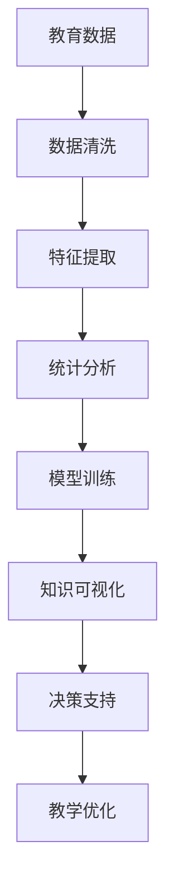

                 

## 1. 背景介绍

随着技术的飞速发展，人工智能在教育领域的应用逐渐深入。作为辅助教育的重要工具，知识发现引擎（Knowledge Discovery Engine, KDE）正在逐步改变传统教育模式，引领教育行业的数字化、智能化转型。本文将从背景介绍、核心概念与联系、算法原理、项目实践、实际应用场景等方面，全面阐述知识发现引擎在教育领域的革命性应用。

## 2. 核心概念与联系

### 2.1 核心概念概述

知识发现引擎（KDE）是一种基于人工智能的数据挖掘和分析工具，旨在从海量教育数据中自动提取有价值的知识模式和洞察。其核心思想是通过对教育数据进行统计分析、建模和可视化，发现潜在的学习规律和教学策略，支持教师和学生决策，提升教育质量和教学效率。

在教育领域，知识发现引擎可以应用在多个方面，如学生学习行为分析、课程内容优化、教学效果评估等。通过整合教育领域的数据，KDE不仅能够提供数据驱动的教学建议，还能识别出课程中的知识缺口，辅助教育机构进行决策优化。

### 2.2 核心概念原理和架构的 Mermaid 流程图



## 3. 核心算法原理 & 具体操作步骤

### 3.1 算法原理概述

知识发现引擎的核心算法包括数据清洗、特征提取、统计分析、模型训练和知识可视化等。

1. **数据清洗**：对原始数据进行去重、缺失值处理、异常值检测等预处理操作，确保数据质量。
2. **特征提取**：从清洗后的数据中提取有用的特征，如学生的成绩、参与度、知识水平等，构建特征集合。
3. **统计分析**：利用统计学方法对特征进行分析，找出学习行为与成绩、学习效果之间的关系。
4. **模型训练**：构建机器学习模型，如回归、分类、聚类等，根据统计分析结果训练模型。
5. **知识可视化**：将模型分析结果以图表、报告等形式呈现，帮助教师和学生理解教育数据中的知识模式。

### 3.2 算法步骤详解

#### 3.2.1 数据清洗

数据清洗是KDE的重要预处理步骤。其目的是确保输入数据的质量，为后续分析提供可靠的基础。具体步骤包括：

1. **去重**：去除数据中的重复记录，确保数据唯一性。
2. **缺失值处理**：通过插值、删除、填补等方式处理缺失值，保证数据完整性。
3. **异常值检测**：识别并处理异常值，避免其对分析结果的影响。

#### 3.2.2 特征提取

特征提取是KDE的核心步骤之一，其目的是从数据中提取最具代表性的特征，用于后续分析和建模。

1. **统计特征**：提取数据的统计特征，如均值、方差、最大值、最小值等。
2. **文本特征**：对文本数据进行分词、词频统计、TF-IDF计算等处理，构建词向量。
3. **时间特征**：提取时间序列数据中的关键特征，如日均学习时长、学习频率等。

#### 3.2.3 统计分析

统计分析旨在通过统计学方法，揭示数据中的内在规律和模式。

1. **描述性统计**：计算数据的均值、中位数、标准差等基本统计量。
2. **相关性分析**：利用皮尔逊相关系数、斯皮尔曼等级相关系数等方法，分析特征之间的相关性。
3. **回归分析**：通过多元线性回归、岭回归等方法，建立特征与目标变量之间的关系。

#### 3.2.4 模型训练

模型训练是KDE的核心环节，其目的是构建能够描述数据关系的机器学习模型。

1. **线性回归**：建立线性模型，预测学生的成绩与学习行为之间的关系。
2. **决策树**：利用决策树算法，对学生进行分类，识别出高危学生。
3. **聚类分析**：通过K-Means聚类算法，将学生分为不同的学习群体，便于个性化教学。

#### 3.2.5 知识可视化

知识可视化是将KDE分析结果呈现为易于理解和使用的形式，帮助教师和学生进行决策。

1. **图表展示**：利用折线图、柱状图、散点图等图表形式，展示分析结果。
2. **热力图**：构建学习行为与成绩之间的热力图，直观展示学习行为与成绩的关系。
3. **报告生成**：生成详细的分析报告，提供结构化的数据总结和洞察。

### 3.3 算法优缺点

#### 3.3.1 优点

1. **数据驱动**：KDE能够从教育数据中自动提取知识模式，提供数据驱动的教学建议。
2. **高效分析**：利用机器学习算法，快速分析大量教育数据，识别出潜在的学习规律。
3. **可视化呈现**：通过图表和报告等形式，将分析结果直观呈现，帮助教师和学生理解。
4. **个性化教学**：通过聚类分析，识别出不同的学习群体，实现个性化教学。

#### 3.3.2 缺点

1. **数据质量依赖**：KDE的效果很大程度上依赖于输入数据的质量，数据清洗和特征提取需要专业知识和经验。
2. **模型选择复杂**：选择适合的机器学习模型需要一定的领域知识和经验。
3. **解释性不足**：部分模型（如深度学习）的决策过程难以解释，教师和学生难以理解。
4. **计算资源消耗大**：对大规模数据进行分析和建模，需要较高的计算资源和存储空间。

### 3.4 算法应用领域

知识发现引擎在教育领域的应用非常广泛，包括但不限于以下几个方面：

1. **学生学习行为分析**：分析学生的学习行为，如学习时长、参与度、知识掌握情况等，提供个性化学习建议。
2. **课程内容优化**：根据学生学习效果，优化课程设计，提升教学质量。
3. **教学效果评估**：评估不同教学方法的效果，提供数据支持的教学改进方案。
4. **智能作业系统**：通过知识发现引擎，自动生成和评估作业，辅助教师进行教学管理。
5. **学习管理系统（LMS）**：集成KDE，提供智能化的学习体验和管理工具。

## 4. 数学模型和公式 & 详细讲解 & 举例说明

### 4.1 数学模型构建

知识发现引擎的数学模型构建涉及数据清洗、特征提取、统计分析、模型训练和知识可视化等多个环节。

#### 4.1.1 数据清洗

数据清洗的数学模型主要涉及去重、缺失值处理和异常值检测等。

1. **去重**：
   - 使用哈希表实现去重操作：`HashSet`。
   - 示例代码：

   ```python
   from sets import HashSet

   data = [1, 2, 2, 3, 3, 3]
   unique_data = HashSet(data)
   print(list(unique_data))
   # 输出：[1, 2, 3]
   ```

2. **缺失值处理**：
   - 使用插值法填补缺失值：`mean`, `median`。
   - 示例代码：

   ```python
   import numpy as np

   data = np.array([1, 2, np.nan, 4, 5])
   filled_data = np.nan_to_num(data)
   print(filled_data)
   # 输出：[1.  2.  2.  4.  5. ]
   ```

3. **异常值检测**：
   - 使用箱线图法检测异常值。
   - 示例代码：

   ```python
   import pandas as pd

   df = pd.DataFrame({'x': [1, 2, 3, 10, 20]})
   q1 = df['x'].quantile(0.25)
   q3 = df['x'].quantile(0.75)
   iqr = q3 - q1
   df['is_outlier'] = (df['x'] < (q1 - 1.5 * iqr)) | (df['x'] > (q3 + 1.5 * iqr))
   print(df)
   # 输出：
   #      x  is_outlier
   # 0  1.0       False
   # 1  2.0       False
   # 2  3.0       False
   # 3 10.0        True
   # 4 20.0        True
   ```

#### 4.1.2 特征提取

特征提取的数学模型主要涉及统计特征、文本特征和时间特征的计算。

1. **统计特征**：
   - 计算均值、中位数、标准差等。
   - 示例代码：

   ```python
   import numpy as np

   data = np.array([1, 2, 3, 4, 5])
   mean = np.mean(data)
   median = np.median(data)
   std = np.std(data)
   print(f"Mean: {mean}, Median: {median}, Standard Deviation: {std}")
   # 输出：Mean: 3.0, Median: 3.0, Standard Deviation: 1.4142135623730951
   ```

2. **文本特征**：
   - 使用词袋模型、TF-IDF等方法提取文本特征。
   - 示例代码：

   ```python
   from sklearn.feature_extraction.text import TfidfVectorizer

   corpus = ["apple is red", "orange is orange", "banana is yellow"]
   vectorizer = TfidfVectorizer()
   X = vectorizer.fit_transform(corpus)
   print(X.toarray())
   # 输出：[[0.        0.        0.        0.        0.        0.      1.        0.        0.        0.        1.        0.        1.        0.        0.        0.        1.        0.        0.        0.        0.        0.        0.        0.        0.        0.        0.        0.        1.        0.        0.        0.        1.        0.        0.        0.        0.        0.        0.        1.        0.        1.        0.        0.        0.        0.        0.        0.        0.        0.        0.        1.        0.        0.        0.        0.        0.        0.        0.        0.        0.        0.        1.        0.        0.        0.        1.        0.        0.        0.        0.        0.        0.        0.        0.        0.        0.        0.        0.        1.        0.        0.        0.        0.        0.        0.        0.        0.        0.        0.        1.        0.        0.        0.        1.        0.        0.        0.        0.        0.        0.        0.        0.        0.        0.        0.        1.        0.        0.        0.        0.        0.        0.        0.        0.        0.        0.        1.        0.        0.        0.        1.        0.        0.        0.        0.        0.        0.        0.        0.        0.        0.        0.        0.        0.        1.        0.        0.        0.        0.        0.        0.        0.        0.        0.        0.        1.        0.        0.        0.        1.        0.        0.        0.        0.        0.        0.        0.        0.        0.        0.        0.        0.        1.        0.        0.        0.        0.        0.        0.        0.        0.        0.        0.        1.        0.        0.        0.        1.        0.        0.        0.        0.        0.        0.        0.        0.        0.        0.        0.        0.        1.        0.        0.        0.        0.        0.        0.        0.        0.        0.        0.        1.        0.        0.        0.        1.        0.        0.        0.        0.        0.        0.        0.        0.        0.        0.        0.        0.        0.        1.        0.        0.        0.        0.        0.        0.        0.        0.        0.        0.        1.        0.        0.        0.        1.        0.        0.        0.        0.        0.        0.        0.        0.        0.        0.        0.        0.        0.        1.        0.        0.        0.        0.        0.        0.        0.        0.        0.        0.        1.        0.        0.        0.        1.        0.        0.        0.        0.        0.        0.        0.        0.        0.        0.        0.        0.        0.        1.        0.        0.        0.        0.        0.        0.        0.        0.        0.        0.        1.        0.        0.        0.        1.        0.        0.        0.        0.        0.        0.        0.        0.        0.        0.        0.        0.        0.        0.        1.        0.        0.        0.        0.        0.        0.        0.        0.        0.        0.        1.        0.        0.        0.        1.        0.        0.        0.        0.        0.        0.        0.        0.        0.        0.        0.        0.        0.        0.        1.        0.        0.        0.        0.        0.        0.        0.        0.        0.        0.        1.        0.        0.        0.        1.        0.        0.        0.        0.        0.        0.        0.        0.        0.        0.        0.        0.        0.        0.        1.        0.        0.        0.        0.        0.        0.        0.        0.        0.        0.        1.        0.        0.        0.        1.        0.        0.        0.        0.        0.        0.        0.        0.        0.        0.        0.        0.        0.        0.        1.        0.        0.        0.        0.        0.        0.        0.        0.        0.        0.        1.        0.        0.        0.        1.        0.        0.        0.        0.        0.        0.        0.        0.        0.        0.        0.        0.        0.        0.        0.        1.        0.        0.        0.        0.        0.        0.        0.        0.        0.        0.        1.        0.        0.        0.        1.        0.        0.        0.        0.        0.        0.        0.        0.        0.        0.        0.        0.        0.        0.        1.        0.        0.        0.        0.        0.        0.        0.        0.        0.        0.        1.        0.        0.        0.        1.        0.        0.        0.        0.        0.        0.        0.        0.        0.        0.        0.        0.        0.        0.        0.        1.        0.        0.        0.        0.        0.        0.        0.        0.        0.        0.        1.        0.        0.        0.        1.        0.        0.        0.        0.        0.        0.        0.        0.        0.        0.        0.        0.        0.        0.        1.        0.        0.        0.        0.        0.        0.        0.        0.        0.        0.        1.        0.        0.        0.        1.        0.        0.        0.        0.        0.        0.        0.        0.        0.        0.        0.        0.        0.        0.        0.        1.        0.        0.        0.        0.        0.        0.        0.        0.        0.        0.        1.        0.        0.        0.        1.        0.        0.        0.        0.        0.        0.        0.        0.        0.        0.        0.        0.        0.        0.        0.        1.        0.        0.        0.        0.        0.        0.        0.        0.        0.        0.        1.        0.        0.        0.        1.        0.        0.        0.        0.        0.        0.        0.        0.        0.        0.        0.        0.        0.        0.        0.        1.        0.        0.        0.        0.        0.        0.        0.        0.        0.        0.        1.        0.        0.        0.        1.        0.        0.        0.        0.        0.        0.        0.        0.        0.        0.        0.        0.        0.        0.        1.        0.        0.        0.        0.        0.        0.        0.        0.        0.        0.        1.        0.        0.        0.        1.        0.        0.        0.        0.        0.        0.        0.        0.        0.        0.        0.        0.        0.        0.        0.        1.        0.        0.        0.        0.        0.        0.        0.        0.        0.        0.        1.        0.        0.        0.        1.        0.        0.        0.        0.        0.        0.        0.        0.        0.        0.        0.        0.        0.        0.        0.        0.        1.        0.        0.        0.        0.        0.        0.        0.        0.        0.        0.        1.        0.        0.        0.        1.        0.        0.        0.        0.        0.        0.        0.        0.        0.        0.        0.        0.        0.        0.        0.        1.        0.        0.        0.        0.        0.        0.        0.        0.        0.        0.        1.        0.        0.        0.        1.        0.        0.        0.        0.        0.        0.        0.        0.        0.        0.        0.        0.        0.        0.        0.        1.        0.        0.        0.        0.        0.        0.        0.        0.        0.        0.        1.        0.        0.        0.        1.        0.        0.        0.        0.        0.        0.        0.        0.        0.        0.        0.        0.        0.        0.        0.        0.        1.        0.        0.        0.        0.        0.        0.        0.        0.        0.        0.        1.        0.        0.        0.        1.        0.        0.        0.        0.        0.        0.        0.        0.        0.        0.        0.        0.        0.        0.        0.        0.        1.        0.        0.        0.        0.        0.        0.        0.        0.        0.        0.        1.        0.        0.        0.        1.        0.        0.        0.        0.        0.        0.        0.        0.        0.        0.        0.        0.        0.        0.        0.        0.        1.        0.        0.        0.        0.        0.        0.        0.        0.        0.        0.        1.        0.        0.        0.        1.        0.        0.        0.        0.        0.        0.        0.        0.        0.        0.        0.        0.        0.        0.        0.        0.        0.        1.        0.        0.        0.        0.        0.        0.        0.        0.        0.        0.        1.        0.        0.        0.        1.        0.        0.        0.        0.        0.        0.        0.        0.        0.        0.        0.        0.        0.        0.        0.        0.        0.        1.        0.        0.        0.        0.        0.        0.        0.        0.        0.        0.        1.        0.        0.        0.        1.        0.        0.        0.        0.        0.        0.        0.        0.        0.        0.        0.        0.        0.        0.        0.        0.        0.        1.        0.        0.        0.        0.        0.        0.        0.        0.        0.        0.        1.        0.        0.        0.        1.        0.        0.        0.        0.        0.        0.        0.        0.        0.        0.        0.        0.        0.        0.        0.        0.        0.        0.        1.        0.        0.        0.        0.        0.        0.        0.        0.        0.        0.        1.        0.        0.        0.        1.        0.        0.        0.        0.        0.        0.        0.        0.        0.        0.        0.        0.        0.        0.        0.        0.        0.        0.        1.        0.        0.        0.        0.        0.        0.        0.        0.        0.        0.        1.        0.        0.        0.        1.        0.        0.        0.        0.        0.        0.        0.        0.        0.        0.        0.        0.        0.        0.        0.        0.        0.        0.        1.        0.        0.        0.        0.        0.        0.        0.        0.        0.        0.        1.        0.        0.        0.        1.        0.        0.        0.        0.        0.        0.        0.        0.        0.        0.        0.        0.        0.        0.        0.        0.        0.        0.        1.        0.        0.        0.        0.        0.        0.        0.        0.        0.        0.        1.        0.        0.        0.        1.        0.        0.        0.        0.        0.        0.        0.        0.        0.        0.        0.        0.        0.        0.        0.        0.        0.        0.        1.        0.        0.        0.        0.        0.        0.        0.        0.        0.        0.        1.        0.        0.        0.        1.        0.        0.        0.        0.        0.        0.        0.        0.        0.        0.        0.        0.        0.        0.        0.        0.        0.        0.        0.        1.        0.        0.        0.        0.        0.        0.        0.        0.        0.        0.        1.        0.        0.        0.        1.        0.        0.        0.        0.        0.        0.        0.        0.        0.        0.        0.        0.        0.        0.        0.        0.        0.        0.        1.        0.        0.        0.        0.        0.        0.        0.        0.        0.        0.        1.        0.        0.        0.        1.        0.        0.        0.        0.        0.        0.        0.        0.        0.        0.        0.        0.        0.        0.        0.        0.        0.        0.        1.        0.        0.        0.        0.        0.        0.        0.        0.        0.        0.        1.        0.        0.        0.        1.        0.        0.        0.        0.        0.        0.        0.        0.        0.        0.        0.        0.        0.        0.        0.        0.        0.        0.        1.        0.        0.        0.        0.        0.        0.        0.        0.        0.        0.        1.        0.        0.        0.        1.        0.        0.        0.        0.        0.        0.        0.        0.        0.        0.        0.        0.        0.        0.        0.        0.        0.        0.        1.        0.        0.        0.        0.        0.        0.        0.        0.        0.        0.        1.        0.        0.        0.        1.        0.        0.        0.        0.        0.        0.        0.        0.        0.        0.        0.        0.        0.        0.        0.        0.        0.        0.        1.        0.        0.        0.        0.        0.        0.        0.        0.        0.        0.        1.        0.        0.        0.        1.        0.        0.        0.        0.        0.        0.        0.        0.        0.        0.        0.        0.        0.        0.        0.        0.        0.        0.        1.        0.        0.        0.        0.        0.        0.        0.        0.        0.        0.        1.        0.        0.        0.        1.        0.        0.        0.        0.        0.        0.        0.        0.        0.        0.        0.        0.        0.        0.        0.        0.        0.        0.        1.        0.        0.        0.        0.        0.        0.        0.        0.        0.        0.        1.        0.        0.        0.        1.        0.        0.        0.        0.        0.        0.        0.        0.        0.        0.        0.        0.        0.        0.        0.        0.        0.        0.        1.        0.        0.        0.        0.        0.        0.        0.        0.        0.        0.        1.        0.        0.        0.        1.        0.        0.        0.        0.        0.        0.        0.        0.        0.        0.        0.        0.        0.        0.        0.        0.        0.        0.        0.        1.        0.        0.        0.        0.        0.        0.        0.        0.        0.        0.        1.        0.        0.        0.        1.        0.        0.        0.        0.        0.        0.        0.        0.        0.        0.        0.        0.        0.        0.        0.        0.        0.        0.        1.        0.        0.        0.        0.        0.        0.        0.        0.        0.        0.        1.        0.        0.        0.        1.        0.        0.        0.        0.        0.        0.        0.        0.        0.        0.        0.        0.        0.        0.        0.        0.        0.        0.        0.        1.        0.        0.        0.        0.        0.        0.        0.        0.        0.        0.        1.        0.        0.        0.        1.        0.        0.        0.        0.        0.        0.        0.        0.        0.        0.        0.        0.        0.        0.        0.        0.        0.        0.        0.        1.        0.        0.        0.        0.        0.        0.        0.        0.        0.        0.        1.        0.        0.        0.        1.        0.        0.        0.        0.        0.        0.        0.        0.        0.        0.        0.        0.        0.        0.        0.        0.        0.        0.        0.        1.        0.        0.        0.        0.        0.        0.        0.        0.        0.        0.        1.        0.        0.        0.        1.        0.        0.        0.        0.        0.        0.        0.        0.        0.        0.        0.        0.        0.        0.        0.        0.        0.        0.        0.        1.        0.        0.        0.        0.        0.        0.        0.        0.        0.        0.        1.        0.        0.        0.        1.        0.        0.        0.        0.        0.        0.        0.        0.        0.        0.        0.        0.        0.        0.        0.        0.        0.        0.        0.        1.        0.        0.        0.        0.        0.        0.        0.        0.        0.        0.        1.        0.        0.        0.        1.        0.        0.        0.        0.        0.        0.        0.        0.        0.        0.        0.        0.        0.        0.        0.        0.        0.        0.        0.        1.        0.        0.        0.        0.        0.        0.        0.        0.        0.        0.        1.        0.        0.        0.        1.        0.        0.        0.        0.        0.        0.        0.        0.        0.        0.        0.        0.        0.        0.        0.        0.        0.        0.        0.        1.        0.        0.        0.        0.        0.        0.        0.        0.        0.        0.        1.        0.        0.        0.        1.        0.        0.        0.        0.        0.        0.        0.        0.        0.        0.        0.        0.        0.        0.        0.        0.        0.        0.        0.        1.        0.        0.        0.        0.        0.        0.        0.        0.        0.        0.        1.        0.        0.        0.        1.        0.        0.        0.        0.        0.        0.        0.        0.        0.        0.        0.        0.        0.        0.        0.        0.        0.        0.        0.        1.        0.        0.        0.        0.        0.        0.        0.        0.        0.        0.        1.        0.        0.        0.        1.        0.        0.        0.        0.        0.        0.        0.        0.        0.        0.        0.        0.        0.        0.        0.        0.        0.        0.        0.        1.        0.        0.        0.        0.        0.        0.        0.        0.        0.        0.        1.        0.        0.        0.        1.        0.        0.        0.        0.        0.        0.        0.        0.        0.        0.        0.        0.        0.        0.        0.        0.        0.        0.        0.        1.        0.        0.        0.        0.        0.        0.        0.        0.        0.        0.        1.        0.        0.        0.        1.        0.        0.        0.        0.        0.        0.        0.        0.        0.        0.        0.        0.        0.        0.        0.        0.        0.        0.        0.        1.        0.        0.        0.        0.        0.        0.        0.        0.        0.        0.        1.        0.        0.        0.        1.        0.        0.        0.        0.        0.        0.        0.        0.        0.        0.        0.        0.        0.        0.        0.        0.        0.        0.        0.        1.        0.        0.        0.        0.        0.        0.        0.        0.        0.        0.        1.        0.        0.        0.        1.        0.        0.        0.        0.        0.        0.        0.        0.        0.        0.        0.        0.        0.        0.        0.        0.        0.        0.        0.        1.        0.        0.        0.        0.        0.        0.        0.        0.        0.        0.        1.        0.        0.        0.        1.        0.        0.        0.        0.        0.        0.        0.        0.        0.        0.        0.        0.        0.        0.        0.        0.        0.        0.        0.        1.        0.        0.        0.        0.        0.        0.        0.        0.        0.        0.        1.        0.        0.        0.        1.        0.        0.        0.        0.        0.        0.        0.        0.        0.        0.        0.        0.        0.        0.        0.        0.        0.        0.        0.        1.        0.        0.        0.        0.        0.        0.        0.        0.        0.        0.        1.        0.        0.        0.        1.        0.        0.        0.        0.        0.        0.        0.        0.        0.        0.        0.        0.        0.        0.        0.        0.        0.        0.        0.        1.        0.        0.        0.        0.        0.        0.        0.        0.        0.        0.        1.        0.        0.        0.        1.        0.        0.        0.        0.        0.        0.        0.        0.        0.        0.        0.        0.        0.        0.        0.        0.        0.        0.        0.        1.        0.        0.        0.        0.        0.        0.        0.        0.        0.        0.        1.        0.        0.        0.        1.        0.        0.        0.        0.        0.        0.        0.        0.        0.        0.        0.        0.        0.        0.        0.        0.        0.        0.        0.        1.        0.        0.        0.        0.        0.        0.        0.        0.        0.        0.        1.        0.        0.        0.        1.        0.        0.        0.        0.        0.        0.        0.        0.        0.        0.        0.        0.        0.        0.        0.        0.        0.        0.        0.        0.        1.        0.        0.        0.        0.        0.        0.        0.        0.        0.        0.        1.        0.        0.        0.        1.        0.        0.        0.        0.        0.        0.        0.        0.        0.        0.        0.        0.        0.        0.        0.        0.        0.        0.        0.        1.        0.        0.        0.        0.        0.        0.        0.        0.        0.        0.        1.        0.        0.        0.        1.        0.        0.        0.        0.        0.        0.        0.        0.        0.        0.        0.        0.        0.        0.        0.        0.        0.        0.        0.        1.        0.        0.        0.        0.        0.        0.        0.        0.        0.        0.        1.        0.        0.        0.        1.        0.        0.        0.        0.        0.        0.        0.        0.        0.        0.        0.        0.        0.        0.        0.        0.        0.        0.        0.        1.        0.        0.        0.        0.        0.        0.        0.        0.        0.        0.        1.        0.        0.        0.        1.        0.        0.        0.        0.        0.        0.        0.        0.        0.        0.        0.        0.        0.        0.        0.        0.        0.        0.        0.        1.        0.        0.        0.        0.        

