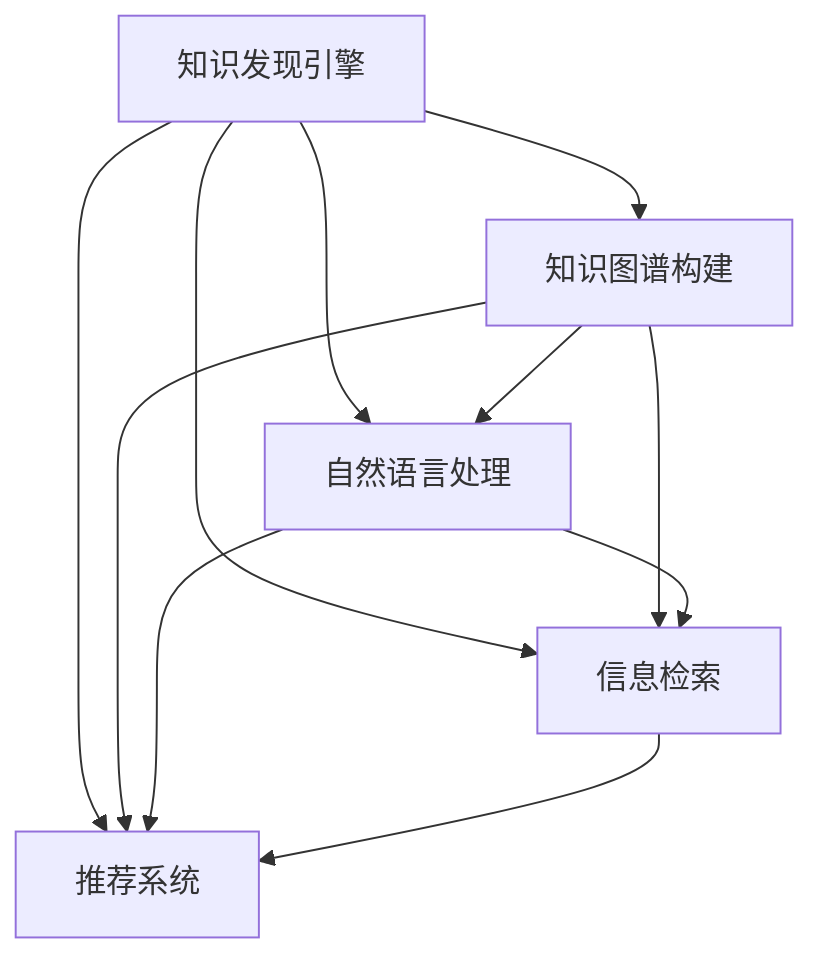

                 

# 知识发现引擎如何帮助程序员快速成长

> 关键词：知识发现引擎, 程序员, 快速成长, 技术积累, 知识图谱

## 1. 背景介绍

### 1.1 问题由来

在当今技术日新月异的互联网时代，程序员需要不断学习和掌握新的技术，以应对复杂多变的业务需求。然而，技术的深度和广度都达到了前所未有的程度，学习和实践的有效性亟需提升。在这种背景下，知识发现引擎（Knowledge Discovery Engine, KDE）应运而生，通过智能化的知识组织和检索，帮助程序员快速发现和掌握关键技术，加速其成长。

### 1.2 问题核心关键点

知识发现引擎的核心在于通过自然语言处理（NLP）和信息检索（IR）技术，构建一个覆盖广泛技术领域的知识图谱，帮助程序员快速找到所需的技术信息、解决方案和案例实践。其关键点包括：
- 自动化构建知识图谱：通过爬虫技术收集和标注技术文档、代码示例和实践案例，构建知识图谱。
- 智能化的信息检索：利用NLP技术理解程序员的查询意图，匹配相关知识图谱中的信息。
- 多维度的推荐系统：根据程序员的技术背景、学习习惯和关注领域，推荐合适的学习资源。

### 1.3 问题研究意义

知识发现引擎在程序员快速成长中的作用不容小觑。它能够：
- 减少技术学习和实践的时间成本，使程序员能更专注于核心业务。
- 提高学习效率，加速技术积累，促进职业发展。
- 提供结构化的知识体系，帮助程序员构建系统的技术框架。
- 通过个性化推荐，满足程序员的学习需求，提供定制化的学习路径。

## 2. 核心概念与联系

### 2.1 核心概念概述

为更好地理解知识发现引擎的机制和优势，本节将介绍几个关键概念：

- 知识发现引擎（KDE）：利用自然语言处理和信息检索技术，构建一个包含广泛技术领域知识的图谱，帮助程序员快速获取所需信息。
- 知识图谱（Knowledge Graph）：将知识组织成节点和边的形式，形成一个结构化的知识网络，用于知识检索和推荐。
- 自然语言处理（NLP）：通过计算机处理和理解人类语言，实现文本的自动标注、信息抽取和智能检索。
- 信息检索（IR）：通过搜索引擎技术，从大量数据中快速检索出与查询最相关的信息。
- 推荐系统（Recommendation System）：利用算法为用户推荐个性化信息，满足其特定的需求和兴趣。

这些概念通过以下Mermaid流程图展现其联系和操作流程：



这个流程图展示了知识发现引擎的主要组成部分及其相互关系：

1. 知识图谱构建模块：通过爬虫和NLP技术，构建知识图谱。
2. 自然语言处理模块：利用NLP技术，理解用户查询意图。
3. 信息检索模块：从知识图谱中检索出最相关的信息。
4. 推荐系统模块：根据用户偏好，推荐合适的学习资源。

## 3. 核心算法原理 & 具体操作步骤
### 3.1 算法原理概述

知识发现引擎的核心算法主要包括知识图谱构建、自然语言处理、信息检索和推荐系统。每个模块都依赖于其他模块的输出，共同构成一个高效的闭环系统。

### 3.2 算法步骤详解

#### 3.2.1 知识图谱构建

1. **爬虫技术**：利用网络爬虫技术从技术文档、代码仓库、博客等平台收集技术相关的文本信息。
2. **文本预处理**：对收集到的文本进行分词、去停用词、命名实体识别等预处理，提取出关键信息。
3. **知识抽取**：利用NLP技术从处理后的文本中抽取出技术术语、代码片段、实践案例等信息，构建知识图谱。
4. **知识融合**：将抽取出的知识进行融合，去除冗余和冲突信息，构建一个结构化的知识图谱。

#### 3.2.2 自然语言处理

1. **查询意图理解**：利用NLP技术对用户查询进行语义分析，理解其意图。
2. **实体识别**：识别出用户查询中的关键实体（如技术名称、概念等）。
3. **意图映射**：将用户查询的语义意图映射到知识图谱中的实体或关系。

#### 3.2.3 信息检索

1. **知识图谱查询**：从构建好的知识图谱中，根据用户查询的实体和意图，检索出最相关的信息。
2. **信息排名**：对检索结果进行排序，优先推荐与用户查询意图最相关的信息。

#### 3.2.4 推荐系统

1. **用户画像构建**：根据用户的历史查询记录和学习行为，构建用户画像，了解其技术背景和兴趣。
2. **推荐算法应用**：利用协同过滤、内容过滤等推荐算法，为用户推荐个性化的学习资源。

### 3.3 算法优缺点

知识发现引擎在帮助程序员快速成长方面具有以下优点：
- 高效的信息检索：能够快速找到所需的技术信息，节省时间和精力。
- 结构化的知识体系：提供系统化的技术框架，帮助程序员构建完整的技术知识。
- 个性化推荐：根据用户需求和兴趣，推荐合适的学习资源。

同时，该算法也存在一些局限性：
- 依赖数据质量：知识图谱的构建依赖于高质量的技术文档和爬虫技术。
- 算法复杂性：构建和维护知识图谱、进行信息检索和推荐需要复杂的算法支持。
- 实时性问题：在大规模数据和复杂算法下，可能存在响应延迟。

### 3.4 算法应用领域

知识发现引擎主要应用于以下领域：

- 开发者社区：帮助开发者快速找到所需的技术文档和代码示例，加速学习和实践。
- 技术博客和论坛：推荐相关的技术文章和讨论，帮助用户深入理解技术细节。
- 在线教育平台：提供个性化的课程推荐，满足用户的学习需求。
- 企业内训系统：构建企业内部的技术知识图谱，帮助员工掌握核心技术。

## 4. 数学模型和公式 & 详细讲解 & 举例说明
### 4.1 数学模型构建

知识发现引擎的数学模型主要分为知识图谱构建、自然语言处理、信息检索和推荐系统四个部分。下面以知识图谱构建为例，展示其数学模型和公式推导。

知识图谱构建的数学模型主要基于图论和语义网络，将技术领域中的概念、实体和关系抽象为节点和边，构建一个结构化的知识网络。

### 4.2 公式推导过程

1. **节点和边的定义**：
   - 节点：表示技术领域中的概念和实体，如编程语言、算法、框架等。
   - 边：表示概念和实体之间的关系，如“Python 是 一种 编程语言”，“深度学习 与 机器学习 相关”。

2. **节点权重计算**：
   - 使用 PageRank 算法计算节点权重，表示节点在知识图谱中的重要程度。

3. **边权重计算**：
   - 使用图论中的可达性算法计算边权重，表示概念和实体之间的相关度。

4. **知识融合算法**：
   - 使用拓扑排序或深度优先搜索算法，对知识图谱进行融合，去除冗余和冲突信息。

### 4.3 案例分析与讲解

以机器学习领域的知识图谱构建为例，分析其数学模型和推导过程：

1. **节点定义**：
   - 节点1：深度学习
   - 节点2：机器学习
   - 节点3：神经网络
   - 节点4：监督学习

2. **边定义**：
   - 边1：深度学习 - 与 - 神经网络
   - 边2：深度学习 - 是 - 机器学习的一种
   - 边3：监督学习 - 与 - 机器学习相关

3. **节点权重计算**：
   - 使用 PageRank 算法计算节点权重，假设深度学习的重要性为0.8，机器学习的重要性为0.5。

4. **边权重计算**：
   - 使用可达性算法计算边权重，假设深度学习到神经网络的可达性为0.9，深度学习到机器学习的可达性为0.7。

5. **知识融合**：
   - 通过深度优先搜索算法，对知识图谱进行融合，去除冗余和冲突信息，得到最终的知识图谱。

## 5. 项目实践：代码实例和详细解释说明
### 5.1 开发环境搭建

知识发现引擎的开发环境主要包括Python、网络爬虫工具（如Scrapy）、NLP库（如NLTK、spaCy）、信息检索库（如Elasticsearch）和推荐系统库（如Surprise）。以下展示环境搭建的步骤：

1. 安装Python：从官网下载并安装Python，安装PyCharm等IDE。
2. 安装网络爬虫工具：使用pip安装Scrapy。
3. 安装NLP库：使用pip安装NLTK、spaCy等。
4. 安装信息检索库：安装Elasticsearch并配置索引。
5. 安装推荐系统库：安装Surprise并配置推荐算法。

### 5.2 源代码详细实现

以下展示知识发现引擎的代码实现，包括知识图谱构建、自然语言处理、信息检索和推荐系统的主要模块：

```python
# 知识图谱构建模块
class KnowledgeGraph:
    def __init__(self):
        self.graph = {}
    
    def add_node(self, node):
        if node not in self.graph:
            self.graph[node] = []
    
    def add_edge(self, from_node, to_node, weight):
        if from_node not in self.graph:
            self.add_node(from_node)
        if to_node not in self.graph:
            self.add_node(to_node)
        self.graph[from_node].append((to_node, weight))
    
    def fuse_graph(self):
        # 拓扑排序或深度优先搜索算法，对知识图谱进行融合
        pass

# 自然语言处理模块
class NLP:
    def __init__(self):
        self.entitiy_recognizer = None
    
    def entity_recognition(self, text):
        # 使用命名实体识别技术，提取关键实体
        pass
    
    def intent_mapping(self, intent):
        # 将意图映射到知识图谱中的实体或关系
        pass

# 信息检索模块
class IR:
    def __init__(self):
        self.index = None
    
    def index_documents(self, documents):
        # 构建索引
        pass
    
    def query(self, query):
        # 从索引中检索文档
        pass

# 推荐系统模块
class Recommendation:
    def __init__(self):
        self.algorithm = None
    
    def user_profile(self, user):
        # 构建用户画像
        pass
    
    def recommend(self, user):
        # 推荐学习资源
        pass
```

### 5.3 代码解读与分析

**KnowledgeGraph类**：
- `add_node`方法：向知识图谱中添加节点。
- `add_edge`方法：向知识图谱中添加边，并计算边权重。
- `fuse_graph`方法：通过拓扑排序或深度优先搜索算法，对知识图谱进行融合，去除冗余和冲突信息。

**NLP类**：
- `entity_recognition`方法：使用命名实体识别技术，提取关键实体。
- `intent_mapping`方法：将意图映射到知识图谱中的实体或关系。

**IR类**：
- `index_documents`方法：构建索引。
- `query`方法：从索引中检索文档。

**Recommendation类**：
- `user_profile`方法：构建用户画像。
- `recommend`方法：推荐学习资源。

## 6. 实际应用场景
### 6.1 开发者社区

知识发现引擎在开发者社区中的应用非常广泛。开发者可以利用该系统快速找到所需的技术文档和代码示例，加速学习和实践。例如，在GitHub上搜索相关代码时，知识发现引擎可以推荐出最相关的项目、文件和问题，帮助开发者更快地理解和应用新技术。

### 6.2 技术博客和论坛

在技术博客和论坛上，知识发现引擎可以推荐相关的技术文章和讨论，帮助用户深入理解技术细节。例如，在Stack Overflow上，用户输入问题时，知识发现引擎可以推荐最相关的问答、代码片段和讨论，帮助用户快速解决问题。

### 6.3 在线教育平台

在线教育平台可以利用知识发现引擎，提供个性化的课程推荐，满足用户的学习需求。例如，在Coursera上，知识发现引擎可以根据用户的历史学习记录和兴趣，推荐相关的课程和资料，提高学习效果。

### 6.4 企业内训系统

企业内训系统可以利用知识发现引擎，构建企业内部的技术知识图谱，帮助员工掌握核心技术。例如，在腾讯内部，知识发现引擎可以收集和整理技术文档、代码示例和实践案例，构建企业内部的知识图谱，供员工学习和参考。

## 7. 工具和资源推荐
### 7.1 学习资源推荐

为了帮助开发者系统掌握知识发现引擎的理论基础和实践技巧，这里推荐一些优质的学习资源：

1. 《Python网络爬虫实战》：介绍了网络爬虫的基本原理和Python爬虫的实现方法。
2. 《自然语言处理入门》：讲解了自然语言处理的基本概念和常见算法。
3. 《信息检索导论》：介绍了信息检索的基本原理和常用算法。
4. 《推荐系统实战》：介绍了推荐系统的主要算法和实现方法。
5. 《知识图谱与语义网络》：介绍了知识图谱的基本概念和构建方法。

通过对这些资源的学习实践，相信你一定能够快速掌握知识发现引擎的精髓，并用于解决实际的开发问题。

### 7.2 开发工具推荐

高效的开发离不开优秀的工具支持。以下是几款用于知识发现引擎开发的常用工具：

1. PyCharm：Python开发环境，支持调试、测试、版本控制等功能。
2. Scrapy：Python爬虫框架，可以快速爬取网页内容。
3. NLTK：自然语言处理库，支持文本预处理、分词、命名实体识别等功能。
4. Elasticsearch：搜索引擎，支持文本检索、分析和存储。
5. Surprise：推荐系统库，支持协同过滤、内容过滤等推荐算法。

合理利用这些工具，可以显著提升知识发现引擎的开发效率，加快创新迭代的步伐。

### 7.3 相关论文推荐

知识发现引擎在学术界和工业界得到了广泛的研究和应用，以下是几篇奠基性的相关论文，推荐阅读：

1. J. Karatzoglou等《Scalable Semantic Search for Technical Vocabulary Learning》：提出了基于语义网络的知识发现引擎，用于技术词汇的学习和检索。
2. C.D. Manning等《Introduction to Information Retrieval》：介绍了信息检索的基本原理和算法。
3. B.H. Liu等《Recommendation Systems in E-Commerce》：介绍了推荐系统在电子商务中的应用，包括协同过滤和内容过滤算法。
4. T.M. Khoshgoftaar等《A Systematic Review of Survey Papers on Software Engineering' Data Mining and Statistical Learning》：系统回顾了软件工程中数据挖掘和统计学习的研究现状和应用。
5. D.E. Boylan等《Using Ontologies to Support Software Documentation and Navigation》：介绍了使用本体论来支持软件文档和导航的方法，可用于构建知识图谱。

这些论文代表了大数据和人工智能技术的发展脉络。通过学习这些前沿成果，可以帮助研究者把握学科前进方向，激发更多的创新灵感。

## 8. 总结：未来发展趋势与挑战
### 8.1 总结

本文对知识发现引擎在程序员快速成长中的作用进行了全面系统的介绍。首先阐述了知识发现引擎的背景和意义，明确了其在帮助程序员快速发现和掌握关键技术方面的独特价值。其次，从原理到实践，详细讲解了知识发现引擎的核心算法和操作步骤，给出了完整的代码实例。同时，本文还广泛探讨了知识发现引擎在开发者社区、技术博客、在线教育平台和企业内训系统中的应用前景，展示了其广泛的应用场景。此外，本文精选了知识发现引擎的各类学习资源，力求为读者提供全方位的技术指引。

通过本文的系统梳理，可以看到，知识发现引擎在程序员快速成长中的重要作用。它通过构建知识图谱、进行智能检索和个性化推荐，帮助程序员快速获取所需信息，加速学习进程。未来，伴随技术的不断进步，知识发现引擎必将发挥更大的作用，助力程序员在技术领域持续成长。

### 8.2 未来发展趋势

展望未来，知识发现引擎在程序员快速成长中的应用将呈现以下几个发展趋势：

1. **自适应学习**：知识发现引擎将具备自适应学习的能力，根据程序员的学习行为和反馈，动态调整推荐算法和内容，提供更加个性化的学习路径。
2. **多语言支持**：知识发现引擎将支持多语言技术文档和代码的检索，帮助程序员跨越语言障碍，快速掌握新技术。
3. **实时反馈**：知识发现引擎将实时监控程序员的学习进度和效果，提供实时反馈和建议，优化学习过程。
4. **知识增强**：知识发现引擎将结合外部知识库、专家系统和推理引擎，增强知识图谱的丰富性和准确性，提供更全面的技术支持。
5. **人机协同**：知识发现引擎将与人机交互技术结合，构建智能化的学习助手，提升学习效率和用户体验。

这些趋势将使得知识发现引擎更加智能和高效，成为程序员学习和成长的重要辅助工具。

### 8.3 面临的挑战

尽管知识发现引擎在程序员快速成长中发挥了重要作用，但在其发展过程中仍面临一些挑战：

1. **数据质量问题**：知识图谱的构建依赖于高质量的技术文档和代码数据，而高质量数据的获取和标注成本较高。
2. **算法复杂性**：知识发现引擎涉及自然语言处理、信息检索和推荐系统等多个领域的算法，实现和维护复杂。
3. **实时性问题**：在大规模数据和复杂算法下，知识发现引擎可能存在响应延迟，影响用户体验。
4. **可扩展性问题**：知识图谱的构建和维护需要处理大规模数据，如何确保系统可扩展性和稳定性是一大挑战。
5. **安全性问题**：知识发现引擎需要处理和存储大量敏感的技术信息，如何保障数据和系统的安全是一大难题。

### 8.4 研究展望

面对知识发现引擎面临的挑战，未来的研究需要在以下几个方面寻求新的突破：

1. **数据增强技术**：开发更高效、自动化的数据标注和获取方法，降低知识图谱构建的成本。
2. **分布式算法**：开发高效、可扩展的分布式算法，处理大规模数据和复杂算法，提升知识发现引擎的实时性。
3. **模型融合技术**：结合符号化知识和神经网络模型，增强知识图谱的准确性和推理能力。
4. **隐私保护技术**：开发隐私保护算法和技术，确保知识发现引擎处理和存储数据的安全性。
5. **人机交互技术**：结合自然语言理解和生成技术，提升知识发现引擎的人机交互体验，增强其智能化水平。

这些研究方向的探索，必将推动知识发现引擎技术的发展，为程序员快速成长提供更强大的支持。

## 9. 附录：常见问题与解答
**Q1：知识发现引擎是如何帮助程序员快速掌握新技术的？**

A: 知识发现引擎通过构建知识图谱、进行智能检索和个性化推荐，帮助程序员快速获取所需的技术信息、解决方案和案例实践，加速学习进程。具体步骤如下：
1. 构建知识图谱：通过网络爬虫和自然语言处理技术，收集和标注技术文档、代码示例和实践案例，构建知识图谱。
2. 智能检索：利用自然语言处理技术，理解程序员的查询意图，匹配相关知识图谱中的信息。
3. 个性化推荐：根据程序员的技术背景、学习习惯和关注领域，推荐合适的学习资源。

**Q2：知识发现引擎在实际应用中需要注意哪些问题？**

A: 知识发现引擎在实际应用中需要注意以下问题：
1. 数据质量：知识图谱的构建依赖于高质量的技术文档和代码数据，获取和标注成本较高。
2. 算法复杂性：知识发现引擎涉及自然语言处理、信息检索和推荐系统等多个领域的算法，实现和维护复杂。
3. 实时性：在大规模数据和复杂算法下，知识发现引擎可能存在响应延迟，影响用户体验。
4. 可扩展性：知识图谱的构建和维护需要处理大规模数据，如何确保系统可扩展性和稳定性是一大挑战。
5. 安全性：知识发现引擎需要处理和存储大量敏感的技术信息，如何保障数据和系统的安全是一大难题。

**Q3：知识发现引擎的推荐算法有哪些？**

A: 知识发现引擎的推荐算法主要有以下几种：
1. 协同过滤（Collaborative Filtering）：通过分析用户的历史行为数据，找到相似的用户，推荐其喜欢的资源。
2. 内容过滤（Content-Based Filtering）：根据资源的特征（如关键词、标签等），推荐与用户兴趣相关的资源。
3. 基于规则的推荐（Rule-Based Recommendation）：结合专家知识，设计推荐规则，指导推荐系统。
4. 基于模型的推荐（Model-Based Recommendation）：使用机器学习模型，预测用户对资源的兴趣。

这些推荐算法可以根据具体应用场景进行灵活选择和组合，以达到最优的推荐效果。

---

作者：禅与计算机程序设计艺术 / Zen and the Art of Computer Programming

