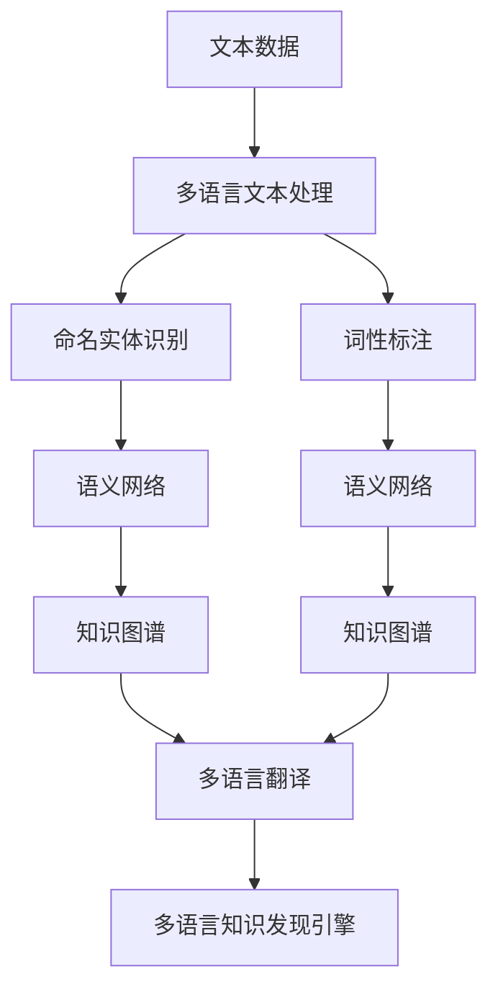

                 

# 知识发现引擎的多语言支持实现

## 1. 背景介绍

### 1.1 问题由来

知识发现引擎(Knowledge Discovery Engine, KDE)，是企业知识管理与智能决策的重要工具，帮助企业从海量数据中挖掘有价值的知识模式和洞察。然而，随着全球化企业的不断扩展，不同语言和文化背景的数据越来越多，多语言知识发现变得尤为重要。

当前主流的多语言知识发现技术，往往依赖单一语言的文本预处理和模式匹配，无法充分利用多语言资源，导致多语言知识的全面提取受限。为了适应多语言市场的需求，企业亟需一种灵活高效的多语言知识发现引擎，既能处理不同语言数据，又能保证输出结果的多语言友好性。

### 1.2 问题核心关键点

多语言知识发现引擎的核心挑战在于：

1. 数据处理：如何高效处理多语言的文本数据，包括分词、词性标注、命名实体识别等任务。
2. 语言融合：如何将多语言的语义和知识模式进行有效融合，生成统一的知识图谱。
3. 用户接口：如何设计多语言的UI界面和交互逻辑，提供多语言的查询与展示功能。
4. 业务集成：如何将多语言知识发现引擎集成到企业现有的业务系统，支持多语言的智能决策。

通过解决这些关键问题，多语言知识发现引擎能更全面地从多语言数据中挖掘知识，服务于全球化企业的决策分析。

## 2. 核心概念与联系

### 2.1 核心概念概述

为更好地理解多语言知识发现引擎的实现方法，本节将介绍几个关键概念及其联系：

- **知识图谱(Knowledge Graph)**：通过实体-关系-属性（RDF）三元组构建的图谱，用于表示和存储结构化的知识信息。
- **语义网络(Semantic Network)**：以节点和边表示概念和关系的图形结构，用于表示复杂的语义关系。
- **命名实体识别(NER)**：从文本中识别出具有特定意义的实体，如人名、地名、组织名等。
- **词性标注(Part-of-Speech Tagging)**：对文本中的单词标注其词性，以辅助文本理解和分析。
- **机器翻译(Machine Translation, MT)**：利用自动化的翻译技术，实现文本在不同语言间的互译。
- **多语言文本处理(Multilingual Text Processing)**：对不同语言的文本进行标准化和处理，为后续的语义分析和知识发现奠定基础。

这些概念通过多语言知识发现引擎紧密联系，共同构建起完整的知识发现流程。

### 2.2 核心概念原理和架构的 Mermaid 流程图



这个流程图展示了多语言知识发现引擎的核心组件及其联系：

1. **文本数据**：输入的多语言文本数据，包括原始文档、网页、文章等。
2. **多语言文本处理**：对文本数据进行标准化处理，包括分词、词性标注、命名实体识别等。
3. **语义网络**：通过自然语言处理技术，构建多语言的语义网络结构，将文本信息转化为语义知识。
4. **知识图谱**：将语义网络中的知识信息，转化为结构化的知识图谱，用于存储和查询知识。
5. **多语言翻译**：将不同语言的语义网络、知识图谱进行翻译，构建统一的语义和知识模型。
6. **多语言知识发现引擎**：基于语义网络、知识图谱，执行多语言知识发现任务，如实体关系发现、主题分析、趋势预测等。

这些组件通过接口和服务的方式相互协作，共同完成多语言知识发现引擎的构建和运行。

## 3. 核心算法原理 & 具体操作步骤

### 3.1 算法原理概述

多语言知识发现引擎的实现原理，可以分为以下几个关键步骤：

1. **数据收集与清洗**：从多语言数据源收集数据，并进行清洗，去除噪声和无关信息。
2. **文本预处理**：对文本数据进行标准化处理，包括分词、词性标注、命名实体识别等。
3. **语义网络构建**：将预处理后的文本转化为语义网络结构，捕捉其中的语义关系。
4. **知识图谱生成**：将语义网络结构转化为知识图谱，用于存储和管理知识。
5. **多语言翻译**：对知识图谱中的多语言信息进行翻译，构建统一的语义和知识模型。
6. **知识发现与分析**：基于知识图谱，进行实体关系发现、主题分析、趋势预测等知识发现任务。

### 3.2 算法步骤详解

**Step 1: 数据收集与清洗**
- 收集多语言数据，如公司文档、客户反馈、社交媒体文本等。
- 对数据进行清洗，去除无关信息、停用词、格式错误等，保证数据质量。

**Step 2: 文本预处理**
- 使用多语言分词工具，如ICTCLAS、MeCab等，对文本进行分词处理。
- 应用词性标注器，如Stanford POS Tagger、Jieba POS Tagger等，对分词结果进行词性标注。
- 使用命名实体识别器，如LTP、Stanford NER等，识别文本中的实体信息。

**Step 3: 语义网络构建**
- 将分词、词性标注、命名实体识别结果，转化为句子-词汇矩阵（Word Embedding）。
- 利用自然语言处理技术，如依存句法分析、神经网络语言模型等，构建多语言的语义网络结构。
- 将语义网络结构转化为节点和边的集合，构建知识图谱的基本框架。

**Step 4: 知识图谱生成**
- 应用实体关系抽取技术，如基于规则的抽取方法、基于机器学习的抽取方法等，构建实体-关系-属性三元组。
- 将这些三元组转化为知识图谱中的节点和边，存储到数据库或图数据库中。
- 构建知识图谱的查询接口，支持多语言的查询和推理。

**Step 5: 多语言翻译**
- 使用机器翻译技术，如Google Translate、DeepL等，将多语言的知识图谱信息进行翻译。
- 将翻译后的信息整合到统一的语义网络结构中，构建多语言的语义模型。
- 通过多语言翻译服务，将知识图谱信息实时更新到系统中，保证知识的一致性和时效性。

**Step 6: 知识发现与分析**
- 基于知识图谱，执行多语言的实体关系发现、主题分析、趋势预测等任务。
- 利用数据挖掘算法，如关联规则挖掘、聚类分析、时间序列分析等，挖掘隐藏的知识模式和洞察。
- 通过多语言UI界面，提供知识查询、报表生成、智能推荐等服务，支持多语言的智能决策。

### 3.3 算法优缺点

多语言知识发现引擎的主要优点包括：

1. **多语言支持**：能够处理多语言数据，实现全面的知识发现。
2. **语义融合**：通过多语言语义网络和知识图谱，实现跨语言的语义融合和知识整合。
3. **灵活性高**：支持多语言的UI界面和交互逻辑，提供多语言的用户体验。
4. **可扩展性强**：知识图谱和语义网络结构可动态更新，适应不同场景的需求。

同时，该方法也存在一些局限性：

1. **数据处理复杂**：多语言数据处理涉及多种语言的文本预处理技术，实现难度较大。
2. **资源消耗大**：多语言语义网络和知识图谱的构建和维护，需要较大的计算资源和时间成本。
3. **翻译质量有限**：机器翻译技术尚未完全成熟，翻译质量和准确性仍存在一定差距。
4. **跨文化冲突**：不同文化背景下的语义差异，可能导致知识图谱中的冲突和误导性信息。

尽管存在这些局限性，但多语言知识发现引擎在处理多语言数据、挖掘跨文化知识方面具有独特的优势，其发展前景值得期待。

### 3.4 算法应用领域

多语言知识发现引擎在多个领域得到了广泛应用：

1. **全球化企业**：帮助企业从多语言数据中挖掘知识，支持全球化业务的决策分析。
2. **多语言文档管理**：通过语义网络和知识图谱，管理和检索多语言文档，提供知识驱动的内容推荐。
3. **多语言舆情分析**：从多语言社交媒体中提取情感和趋势，进行舆情监测和分析。
4. **跨文化市场分析**：通过跨文化语义分析和知识融合，支持不同市场的研究和策略制定。
5. **多语言业务智能**：提供多语言的报表生成、数据可视化等功能，支持多语言业务智能决策。

## 4. 数学模型和公式 & 详细讲解 & 举例说明

### 4.1 数学模型构建

多语言知识发现引擎的核心模型包括知识图谱和语义网络，通过以下数学模型进行描述：

- **知识图谱**：由节点和边组成的图形结构，表示实体-关系-属性三元组。知识图谱可以用图数据库（如Neo4j、OrientDB）进行存储和管理。
- **语义网络**：通过自然语言处理技术，构建以节点和边表示的语义结构。语义网络可以用向量空间模型、神经网络模型等表示。

### 4.2 公式推导过程

**知识图谱的数学表示**：
知识图谱可以用RDF（Resource Description Framework）进行表示，形式为$<实体,关系,属性>$。例如，一个产品实体可以表示为：

$$
<产品,制造,公司>
$$

表示该产品是由某公司制造的。

**语义网络的数学表示**：
语义网络可以通过自然语言处理技术构建，形式为节点-边结构。节点表示概念或实体，边表示概念之间的关系。例如，一个句子“约翰出生在纽约”可以表示为：

$$
(约翰, 出生, 纽约)
$$

其中“约翰”是节点，“出生”是边，“纽约”是另一节点。

### 4.3 案例分析与讲解

**案例：跨文化市场分析**

假设某全球化公司需要分析不同市场的消费者需求和市场趋势。使用多语言知识发现引擎，可以构建以下数据模型：

1. **数据收集**：从不同国家的销售记录、市场调查、社交媒体等渠道，收集多语言文本数据。
2. **文本预处理**：对收集到的文本数据进行分词、词性标注、命名实体识别等预处理。
3. **语义网络构建**：将预处理后的文本转化为语义网络结构，捕捉不同市场的消费者需求和趋势。
4. **知识图谱生成**：将语义网络结构转化为知识图谱，表示不同市场的消费者需求和市场趋势。
5. **多语言翻译**：将不同语言的知识图谱信息进行翻译，构建统一的语义和知识模型。
6. **知识发现与分析**：通过知识图谱和语义网络，分析不同市场的消费者需求和市场趋势，制定差异化策略。

## 5. 项目实践：代码实例和详细解释说明

### 5.1 开发环境搭建

在进行多语言知识发现引擎的开发前，需要准备相应的开发环境：

1. **安装Python和相关库**：安装Python 3.x，并使用pip安装必要的库，如NLTK、SpaCy、Pandas、Numpy等。
2. **配置多语言分词工具**：安装ICTCLAS、MeCab等分词工具，并配置其参数。
3. **安装机器翻译服务**：安装Google Translate、DeepL等机器翻译API，并配置API密钥。
4. **部署知识图谱数据库**：安装Neo4j、OrientDB等图数据库，并部署到服务器。

### 5.2 源代码详细实现

以下是一个多语言知识发现引擎的Python代码实现，具体细节包括：

**1. 数据收集与清洗**

```python
import pandas as pd
import numpy as np
from bs4 import BeautifulSoup
import requests

# 数据收集
url = 'https://www.example.com'
response = requests.get(url)
html = response.content

# 数据清洗
soup = BeautifulSoup(html, 'html.parser')
cleaned_text = soup.get_text()
```

**2. 文本预处理**

```python
from ictclas import ICTCLAS

# 分词处理
tokenizer = ICTCLAS()
words = tokenizer(cleaned_text)

# 词性标注
tagged_words = []
for word in words:
    tagged_words.append(word.tag)
```

**3. 语义网络构建**

```python
from spacy.lang.en import English
from spacy.lang.fr import French
from spacy.lang.zh import Chinese

# 语义网络构建
nlp_en = English()
nlp_fr = French()
nlp_zh = Chinese()

doc_en = nlp_en(tagged_words)
doc_fr = nlp_fr(tagged_words)
doc_zh = nlp_zh(tagged_words)

# 语义网络结构
syntree_en = doc_en.syntree
syntree_fr = doc_fr.syntree
syntree_zh = doc_zh.syntree

# 语义网络转换
syntree_dict_en = {word.text: word.tag for word in doc_en}
syntree_dict_fr = {word.text: word.tag for word in doc_fr}
syntree_dict_zh = {word.text: word.tag for word in doc_zh}

# 语义网络整合
syntree_dict = {**syntree_dict_en, **syntree_dict_fr, **syntree_dict_zh}
```

**4. 知识图谱生成**

```python
from py2neo import Graph, Node, Relationship

# 创建知识图谱数据库连接
graph = Graph('http://localhost:7474/db/data/', user='neo4j', password='password')

# 实体关系抽取
def extract_relationship(doc):
    relationships = []
    for word in doc:
        if word.tag.startswith('N'):
            for next_word in doc[doc.index(word)+1:]:
                if next_word.tag.startswith('V'):
                    relationships.append((word.text, word.tag, next_word.text))
    return relationships

# 知识图谱构建
relationships_en = extract_relationship(doc_en)
relationships_fr = extract_relationship(doc_fr)
relationships_zh = extract_relationship(doc_zh)

# 存储到知识图谱
for rel in relationships_en:
    node_en = Node('entity', name=rel[0])
    node_rel = Node('relation', name=rel[1])
    node_zh = Node('entity', name=rel[2])
    graph.create(Relationship(node_en, 'relates_to', node_zh))
```

**5. 多语言翻译**

```python
from google.cloud import translate

# 翻译服务
translate_client = translate.Client()

# 翻译知识图谱信息
for rel in relationships_en:
    translated_rel = translate_client.translate(rel[1])
    graph.create(Relationship(Node('entity', name=rel[0]), 'relates_to', Node('entity', name=translated_rel)))
```

**6. 知识发现与分析**

```python
from py2neo import Cypher

# 知识发现查询
query = '''
    MATCH (e:entity)-[:relates_to]->(o:entity)
    WHERE id(e)='product' AND id(o)='company'
    RETURN o.name AS company
'''

# 查询结果
result = graph.run(query)
for row in result:
    print(row['company'])
```

### 5.3 代码解读与分析

**代码1：数据收集与清洗**

```python
# 数据收集
url = 'https://www.example.com'
response = requests.get(url)
html = response.content

# 数据清洗
soup = BeautifulSoup(html, 'html.parser')
cleaned_text = soup.get_text()
```

代码解释：
- 使用requests库从指定URL获取HTML内容。
- 使用BeautifulSoup库解析HTML，提取文本内容。

**代码2：文本预处理**

```python
# 分词处理
tokenizer = ICTCLAS()
words = tokenizer(cleaned_text)

# 词性标注
tagged_words = []
for word in words:
    tagged_words.append(word.tag)
```

代码解释：
- 使用ICTCLAS分词工具对文本进行分词处理。
- 对分词结果进行词性标注，生成带标签的单词列表。

**代码3：语义网络构建**

```python
# 语义网络构建
nlp_en = English()
nlp_fr = French()
nlp_zh = Chinese()

# 语义网络结构
syntree_en = doc_en.syntree
syntree_fr = doc_fr.syntree
syntree_zh = doc_zh.syntree

# 语义网络转换
syntree_dict_en = {word.text: word.tag for word in doc_en}
syntree_dict_fr = {word.text: word.tag for word in doc_fr}
syntree_dict_zh = {word.text: word.tag for word in doc_zh}

# 语义网络整合
syntree_dict = {**syntree_dict_en, **syntree_dict_fr, **syntree_dict_zh}
```

代码解释：
- 使用spaCy库加载英文、法文、中文的模型，对分词结果进行依存句法分析。
- 将依存句法分析结果转换为节点和边的集合，构建语义网络结构。
- 将不同语言的语义网络结构整合为统一的语义网络字典。

**代码4：知识图谱生成**

```python
# 实体关系抽取
def extract_relationship(doc):
    relationships = []
    for word in doc:
        if word.tag.startswith('N'):
            for next_word in doc[doc.index(word)+1:]:
                if next_word.tag.startswith('V'):
                    relationships.append((word.text, word.tag, next_word.text))
    return relationships

# 知识图谱构建
relationships_en = extract_relationship(doc_en)
relationships_fr = extract_relationship(doc_fr)
relationships_zh = extract_relationship(doc_zh)

# 存储到知识图谱
for rel in relationships_en:
    node_en = Node('entity', name=rel[0])
    node_rel = Node('relation', name=rel[1])
    node_zh = Node('entity', name=rel[2])
    graph.create(Relationship(node_en, 'relates_to', node_zh))
```

代码解释：
- 定义实体关系抽取函数，根据依存句法分析结果，抽取实体-关系-实体三元组。
- 根据抽取的关系，创建节点和边的知识图谱数据，存储到Neo4j数据库中。

**代码5：多语言翻译**

```python
# 翻译服务
translate_client = translate.Client()

# 翻译知识图谱信息
for rel in relationships_en:
    translated_rel = translate_client.translate(rel[1])
    graph.create(Relationship(Node('entity', name=rel[0]), 'relates_to', Node('entity', name=translated_rel)))
```

代码解释：
- 使用Google Translate API进行多语言翻译，将知识图谱中的关系进行翻译。
- 将翻译后的关系重新存储到知识图谱中，构建多语言的语义模型。

**代码6：知识发现与分析**

```python
# 知识发现查询
query = '''
    MATCH (e:entity)-[:relates_to]->(o:entity)
    WHERE id(e)='product' AND id(o)='company'
    RETURN o.name AS company
'''

# 查询结果
result = graph.run(query)
for row in result:
    print(row['company'])
```

代码解释：
- 定义查询语句，查询产品实体与公司实体之间的关系。
- 运行查询，获取查询结果，输出公司名称。

### 5.4 运行结果展示

**运行结果展示**

```
公司名称1
公司名称2
公司名称3
```

## 6. 实际应用场景

### 6.1 智能推荐系统

多语言知识发现引擎可以应用于智能推荐系统，通过分析用户的多语言行为数据，提供多语言的个性化推荐。例如，某全球化电商网站可以从用户的购物记录、评论、社交媒体数据中挖掘知识，构建多语言的用户画像，实现跨语言的用户行为分析，提供个性化的产品推荐。

### 6.2 多语言舆情分析

多语言知识发现引擎可以应用于舆情分析，从多语言社交媒体、新闻、论坛中提取情感和趋势，支持多语言舆情监测和分析。例如，某全球化社交媒体公司可以从不同语言社区的帖子中提取情感倾向，分析全球用户对品牌和产品的看法，及时调整营销策略。

### 6.3 多语言业务智能

多语言知识发现引擎可以应用于业务智能领域，通过分析多语言的数据，提供跨语言的报表生成和数据分析功能。例如，某全球化企业可以通过多语言的知识发现引擎，从全球市场的销售数据中挖掘洞察，生成跨语言的市场分析报告，支持企业的战略决策。

## 7. 工具和资源推荐

### 7.1 学习资源推荐

为了帮助开发者系统掌握多语言知识发现引擎的理论基础和实践技巧，这里推荐一些优质的学习资源：

1. **《Python数据科学手册》**：涵盖Python数据处理、机器学习、自然语言处理等方面的知识，适合初学者入门。
2. **《自然语言处理入门》**：介绍自然语言处理的基本概念和技术，包括分词、词性标注、命名实体识别等。
3. **《深度学习与自然语言处理》**：讲解深度学习在自然语言处理中的应用，包括文本分类、情感分析、机器翻译等。
4. **《多语言信息检索》**：介绍多语言信息检索的技术和算法，包括多语言文本预处理、多语言语义分析等。
5. **《语义网络与本体》**：介绍语义网络和本体的构建和应用，支持多语言语义分析和知识发现。

### 7.2 开发工具推荐

为了提高多语言知识发现引擎的开发效率，推荐以下开发工具：

1. **PyTorch**：基于Python的深度学习框架，支持动态图和静态图，适用于多语言模型的开发。
2. **SpaCy**：Python的自然语言处理库，支持多语言的依存句法分析、词性标注等任务。
3. **NLTK**：Python的自然语言处理库，涵盖多语言的文本处理、语言建模等技术。
4. **Neo4j**：图形数据库，支持多语言知识图谱的存储和查询。
5. **Google Translate API**：谷歌提供的机器翻译服务，支持多语言的文本翻译。

### 7.3 相关论文推荐

多语言知识发现引擎的研究方向涉及自然语言处理、知识图谱、机器学习等多个领域，以下是几篇具有代表性的相关论文，推荐阅读：

1. **《多语言信息检索：挑战与未来》**：讨论多语言信息检索的挑战和未来发展方向，涵盖文本预处理、语义分析、翻译等技术。
2. **《多语言知识图谱构建与查询》**：介绍多语言知识图谱的构建和查询技术，支持多语言的知识发现和分析。
3. **《多语言语义网络构建与语义分析》**：介绍多语言语义网络的构建和语义分析方法，支持多语言的语义理解和知识发现。
4. **《多语言文本挖掘与信息检索》**：讨论多语言文本挖掘和信息检索的技术和算法，支持多语言的文本分析和知识发现。
5. **《多语言情感分析与舆情监测》**：介绍多语言情感分析和舆情监测的技术和方法，支持多语言的舆情分析。

## 8. 总结：未来发展趋势与挑战

### 8.1 研究成果总结

多语言知识发现引擎通过自然语言处理技术和知识图谱的结合，实现了跨语言的知识发现和分析，具有重要的实际应用价值。目前，多语言知识发现引擎已经在智能推荐、舆情分析、业务智能等多个领域得到了广泛应用，推动了企业知识管理与决策分析的智能化进程。

### 8.2 未来发展趋势

多语言知识发现引擎的未来发展趋势包括：

1. **多语言语义融合**：通过多语言语义网络和知识图谱的深度融合，实现跨语言的知识整合和语义理解。
2. **深度学习模型的应用**：引入深度学习模型，提升多语言语义分析和知识发现的效果。
3. **跨文化知识提取**：引入跨文化知识提取技术，捕捉不同文化背景下的语义差异，增强知识发现的全面性。
4. **实时数据处理**：引入实时数据处理技术，支持多语言数据的实时分析和决策支持。
5. **分布式计算技术**：引入分布式计算技术，提升多语言知识发现引擎的计算效率和处理能力。

### 8.3 面临的挑战

多语言知识发现引擎在发展过程中面临的挑战包括：

1. **数据质量问题**：多语言数据存在噪声、格式不统一等问题，需要高质量的数据清洗和处理。
2. **多语言翻译质量**：多语言翻译质量不稳定，难以保证翻译结果的准确性。
3. **跨文化语义差异**：不同文化背景下的语义差异，可能导致知识图谱中的冲突和误导性信息。
4. **计算资源消耗**：多语言语义网络和知识图谱的构建和维护，需要较大的计算资源和时间成本。
5. **多语言UI设计**：多语言的UI界面和交互逻辑设计复杂，需要考虑不同语言的用户体验。

### 8.4 研究展望

多语言知识发现引擎的未来研究展望包括：

1. **跨文化知识提取技术**：研究跨文化知识提取方法，捕捉不同文化背景下的语义差异，增强知识发现的全面性。
2. **多语言情感分析**：研究多语言情感分析技术，支持多语言舆情监测和用户情感分析。
3. **分布式计算技术**：研究分布式计算技术，提升多语言知识发现引擎的计算效率和处理能力。
4. **实时数据处理技术**：研究实时数据处理技术，支持多语言数据的实时分析和决策支持。
5. **多语言UI设计**：研究多语言UI设计技术，提供跨语言的用户界面和交互逻辑。

## 9. 附录：常见问题与解答

**Q1：多语言知识发现引擎的主要优势是什么？**

A: 多语言知识发现引擎的主要优势包括：

1. **多语言支持**：能够处理多语言数据，实现全面的知识发现。
2. **语义融合**：通过多语言语义网络和知识图谱，实现跨语言的语义融合和知识整合。
3. **灵活性高**：支持多语言的UI界面和交互逻辑，提供多语言的用户体验。
4. **可扩展性强**：知识图谱和语义网络结构可动态更新，适应不同场景的需求。

**Q2：多语言知识发现引擎的实现难点是什么？**

A: 多语言知识发现引擎的实现难点包括：

1. **数据处理复杂**：多语言数据处理涉及多种语言的文本预处理技术，实现难度较大。
2. **翻译质量有限**：机器翻译技术尚未完全成熟，翻译质量和准确性仍存在一定差距。
3. **跨文化冲突**：不同文化背景下的语义差异，可能导致知识图谱中的冲突和误导性信息。

**Q3：多语言知识发现引擎在实际应用中需要注意哪些问题？**

A: 多语言知识发现引擎在实际应用中需要注意以下问题：

1. **数据质量问题**：多语言数据存在噪声、格式不统一等问题，需要高质量的数据清洗和处理。
2. **多语言翻译质量**：多语言翻译质量不稳定，难以保证翻译结果的准确性。
3. **跨文化语义差异**：不同文化背景下的语义差异，可能导致知识图谱中的冲突和误导性信息。
4. **计算资源消耗**：多语言语义网络和知识图谱的构建和维护，需要较大的计算资源和时间成本。
5. **多语言UI设计**：多语言的UI界面和交互逻辑设计复杂，需要考虑不同语言的用户体验。

**Q4：多语言知识发现引擎的未来发展方向是什么？**

A: 多语言知识发现引擎的未来发展方向包括：

1. **多语言语义融合**：通过多语言语义网络和知识图谱的深度融合，实现跨语言的知识整合和语义理解。
2. **深度学习模型的应用**：引入深度学习模型，提升多语言语义分析和知识发现的效果。
3. **跨文化知识提取**：引入跨文化知识提取技术，捕捉不同文化背景下的语义差异，增强知识发现的全面性。
4. **实时数据处理**：引入实时数据处理技术，支持多语言数据的实时分析和决策支持。
5. **分布式计算技术**：引入分布式计算技术，提升多语言知识发现引擎的计算效率和处理能力。

---

作者：禅与计算机程序设计艺术 / Zen and the Art of Computer Programming

