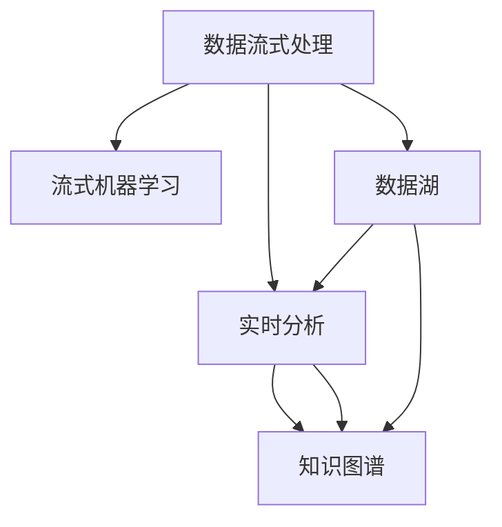

                 

# 知识发现引擎的实时数据处理技术

> 关键词：知识发现引擎, 实时数据处理, 数据流式处理, 流式机器学习, 实时分析, 数据湖, 数据流, 知识图谱

## 1. 背景介绍

### 1.1 问题由来

在现代数据密集型应用中，数据流式处理已成为一种趋势。以数据湖为代表的“存储即服务”技术，使得海量数据的存储和管理变得简单高效。然而，如何从这些数据中挖掘出有价值的知识，并将其应用于实际业务决策，成为了数据应用的核心挑战。知识发现引擎作为连接数据与知识的桥梁，能够高效地从流式数据中提取有价值的信息，形成结构化的知识体系，辅助企业决策，驱动业务发展。

随着技术的发展，实时数据处理在金融、物流、交通等领域的需求日益迫切。在金融领域，实时数据处理能够帮助企业快速响应市场变化，提升风险控制能力；在物流领域，实时数据处理可以优化供应链管理，降低成本；在交通领域，实时数据处理能够实现智能交通管理，提高城市交通运行效率。

然而，在实际应用中，实时数据处理面临诸多挑战。数据量的急剧增长，数据源的多样性和异构性，以及数据处理模型的复杂性，都给实时数据处理带来了巨大挑战。如何高效、可靠地处理实时数据，是知识发现引擎的核心问题之一。

### 1.2 问题核心关键点

知识发现引擎的实时数据处理，核心在于如何高效、可靠地处理和分析实时流式数据。其关键点包括：

1. **数据采集与传输**：如何高效采集实时数据，并在网络传输过程中保证数据的完整性和实时性。
2. **数据存储与管理**：如何对大规模数据进行存储和管理，保证数据的时序一致性和访问速度。
3. **数据处理与分析**：如何在实时数据流中提取有用信息，进行高效的统计分析、机器学习和模式识别。
4. **知识提取与存储**：如何将处理后的数据转化为结构化的知识，并进行存储和检索。
5. **应用集成与部署**：如何将知识应用于实际业务场景，实现数据驱动的决策和优化。

本文将围绕这些问题，详细介绍知识发现引擎的实时数据处理技术，包括流式数据处理、流式机器学习、实时分析等核心内容。

## 2. 核心概念与联系

### 2.1 核心概念概述

为更好地理解知识发现引擎的实时数据处理技术，本节将介绍几个密切相关的核心概念：

1. **数据流式处理**：指对实时数据进行流式处理，逐步提取有用信息，实现数据的实时分析和处理。流式数据处理是知识发现引擎的核心技术之一。

2. **流式机器学习**：指在流式数据处理的基础上，应用机器学习算法对数据进行实时学习和预测，形成动态的知识体系。流式机器学习是知识发现引擎的重要组成部分。

3. **实时分析**：指在实时数据流的背景下，对数据进行高效、实时的统计分析和数据挖掘，提取有价值的信息。实时分析是知识发现引擎的主要应用场景之一。

4. **数据湖**：指一个大规模的、可扩展的、实时的数据存储和处理平台，能够容纳各种类型的数据，支持实时数据处理和分析。数据湖是知识发现引擎的基础设施。

5. **数据流**：指在数据湖中，实时数据的传输和处理过程。数据流是知识发现引擎的数据处理路径。

6. **知识图谱**：指将数据转化为结构化的知识体系，用于存储和检索。知识图谱是知识发现引擎的知识表示形式。

这些核心概念之间的逻辑关系可以通过以下Mermaid流程图来展示：



这个流程图展示了大语言模型的核心概念及其之间的关系：

1. 数据湖中的数据流通过流式处理逐步提取有用信息。
2. 流式处理后的数据应用于流式机器学习，进行实时学习和预测。
3. 实时学习的结果通过实时分析进一步处理和挖掘。
4. 分析结果最终转化为知识图谱，进行存储和检索。

这些概念共同构成了知识发现引擎的实时数据处理框架，使其能够高效地处理和分析实时数据流，形成有价值的知识体系。

## 3. 核心算法原理 & 具体操作步骤
### 3.1 算法原理概述

知识发现引擎的实时数据处理，其核心算法原理主要基于流式数据处理、流式机器学习和实时分析等技术。

**流式数据处理**：
流式数据处理是指在数据湖中，对实时数据进行逐步处理，提取有用信息。其基本原理是，将数据流分为若干子流，通过并行处理的方式，实现高效的数据处理。流式数据处理包括数据采集、数据传输、数据存储、数据清洗等多个环节，通过构建高效的数据流管道，实现数据的实时处理和分析。

**流式机器学习**：
流式机器学习是指在流式数据处理的基础上，应用机器学习算法对数据进行实时学习和预测。其核心思想是，利用数据流的实时性，动态更新模型参数，实现动态的知识体系构建。流式机器学习包括在线学习、增量学习等技术，能够在数据流中进行实时学习，形成动态的知识图谱。

**实时分析**：
实时分析是指在实时数据流的背景下，对数据进行高效、实时的统计分析和数据挖掘。其基本原理是，利用数据流的实时性，动态分析数据特征，提取有价值的信息。实时分析包括实时统计、实时数据挖掘、实时数据可视化等技术，能够在实时数据流中进行高效分析，形成动态的知识图谱。

### 3.2 算法步骤详解

知识发现引擎的实时数据处理一般包括以下几个关键步骤：

**Step 1: 数据采集与传输**
- 选择合适的数据源，收集实时数据，并对其进行初步处理。
- 将处理后的数据封装成标准格式，如JSON、CSV等。
- 通过网络传输数据，保证数据传输的实时性和完整性。

**Step 2: 数据存储与管理**
- 选择合适的数据存储技术，如Hadoop、Spark等，对数据进行存储和管理。
- 设置数据一致性机制，保证数据的时序一致性和访问速度。
- 对数据进行清洗和预处理，去除噪声和冗余数据。

**Step 3: 数据处理与分析**
- 构建高效的数据流管道，利用流式处理技术逐步提取有用信息。
- 选择合适的流式机器学习算法，对数据进行实时学习和预测。
- 应用实时分析技术，对数据进行高效、实时的统计分析和数据挖掘。

**Step 4: 知识提取与存储**
- 将处理后的数据转化为结构化的知识，构建知识图谱。
- 选择合适的存储技术，如Neo4j、ArangoDB等，对知识图谱进行存储和检索。
- 对知识图谱进行动态更新，保证知识的时效性和准确性。

**Step 5: 应用集成与部署**
- 将知识图谱与实际业务场景进行集成，实现数据驱动的决策和优化。
- 构建知识发现引擎的应用接口，方便外部系统调用。
- 部署知识发现引擎，并进行性能优化和故障处理。

以上是知识发现引擎的实时数据处理的一般流程。在实际应用中，还需要针对具体任务的特点，对数据处理过程的各个环节进行优化设计，如改进数据流管道、选择适合的流式机器学习算法、优化实时分析过程等，以进一步提升处理效率和效果。

### 3.3 算法优缺点

知识发现引擎的实时数据处理技术具有以下优点：
1. 高效处理数据：能够实时处理大规模数据流，显著提高数据处理效率。
2. 动态知识更新：能够动态更新知识图谱，适应数据分布的变化。
3. 实时性高：能够快速响应用户查询，提升用户体验。
4. 可扩展性强：能够通过并行处理方式，扩展数据处理能力。

同时，该方法也存在一定的局限性：
1. 数据质量要求高：实时数据处理对数据质量要求较高，一旦数据出现偏差，将直接影响处理结果。
2. 技术复杂度高：实现高效、可靠的实时数据处理，需要一定的技术积累和经验。
3. 成本较高：实时数据处理涉及大量的硬件设备和计算资源，成本较高。

尽管存在这些局限性，但就目前而言，实时数据处理技术仍然是知识发现引擎的核心范式。未来相关研究的重点在于如何进一步降低实时数据处理的成本，提高系统的可靠性和可扩展性，同时兼顾知识的时效性和准确性等因素。

### 3.4 算法应用领域

知识发现引擎的实时数据处理技术，在多个领域得到了广泛的应用，包括但不限于以下几类：

1. **金融领域**：金融市场数据实时更新，基于实时数据处理和流式机器学习，进行风险预警、交易策略优化、市场预测等。

2. **物流领域**：供应链数据实时更新，基于实时数据处理和流式机器学习，进行库存管理、配送路径优化、需求预测等。

3. **交通领域**：交通流量数据实时更新，基于实时数据处理和流式机器学习，进行交通流预测、交通信号控制、智能交通管理等。

4. **医疗领域**：医疗数据实时更新，基于实时数据处理和流式机器学习，进行疾病监测、临床决策支持、健康管理等。

5. **工业领域**：工业设备数据实时更新，基于实时数据处理和流式机器学习，进行设备健康管理、故障预测、生产优化等。

除了上述这些应用领域外，实时数据处理技术还在智能家居、智能城市、智能制造等多个领域得到广泛应用，成为推动数字化转型和智能化升级的重要技术手段。

## 4. 数学模型和公式 & 详细讲解  
### 4.1 数学模型构建

本节将使用数学语言对知识发现引擎的实时数据处理过程进行更加严格的刻画。

记实时数据流为 $\{d_i\}_{i=1}^\infty$，其中 $d_i$ 表示第 $i$ 个实时数据样本。假设数据处理的目标是提取特征 $x_i$，并利用特征 $x_i$ 进行实时学习和预测。

定义模型 $f$ 为流式机器学习算法，其输入为 $x_i$，输出为 $y_i$。则流式机器学习的过程可以表示为：

$$
y_i = f(x_i)
$$

其中 $f$ 为机器学习模型，可以是线性回归、逻辑回归、决策树等。

在实际应用中，为了提升模型性能，通常会对数据进行预处理，如归一化、特征选择等。假设预处理后的数据为 $x_i'$，则实时学习的过程可以表示为：

$$
y_i = f(x_i')
$$

在实时学习的过程中，需要不断更新模型参数，以适应数据流中特征的变化。假设模型 $f$ 的参数为 $\theta$，则实时学习的过程可以表示为：

$$
\theta \leftarrow \theta - \eta \nabla_{\theta} L(\theta)
$$

其中 $\eta$ 为学习率，$L(\theta)$ 为损失函数。

### 4.2 公式推导过程

以下我们以线性回归模型为例，推导实时学习的公式。

假设模型 $f$ 为线性回归模型，则其参数为 $\theta = [w, b]^T$，其中 $w$ 为权重向量，$b$ 为偏置项。定义损失函数为均方误差：

$$
L(\theta) = \frac{1}{N}\sum_{i=1}^N (y_i - f(x_i'))^2
$$

其中 $N$ 为数据样本数量。

实时学习的过程可以表示为：

$$
\theta \leftarrow \theta - \eta \frac{1}{N}\sum_{i=1}^N (y_i - f(x_i')) \nabla_{\theta} f(x_i')
$$

其中 $\nabla_{\theta} f(x_i')$ 为模型 $f$ 对参数 $\theta$ 的梯度。

将上述公式代入实时学习过程，得到实时学习的更新公式：

$$
\theta \leftarrow \theta - \eta \frac{1}{N}\sum_{i=1}^N (y_i - f(x_i')) \frac{1}{N} \sum_{j=1}^N \nabla_{\theta} f(x_j')
$$

在实际应用中，为了降低计算量，通常采用小批量随机梯度下降方法，即每次只选取部分数据进行更新。假设每次选取 $M$ 个数据进行更新，则实时学习的更新公式可以表示为：

$$
\theta \leftarrow \theta - \eta \frac{1}{M}\sum_{i=1}^M (y_i - f(x_i')) \frac{1}{N} \sum_{j=1}^N \nabla_{\theta} f(x_j')
$$

### 4.3 案例分析与讲解

假设我们有一组实时股票数据流 $\{d_i\}_{i=1}^\infty$，其中每个数据样本 $d_i$ 包含股票价格、成交量等特征，目标是对未来的股票价格进行预测。

**Step 1: 数据采集与传输**
- 收集股票实时数据流，并将其封装成标准格式，如JSON。
- 将数据流通过网络传输到数据湖中进行存储。

**Step 2: 数据存储与管理**
- 利用Hadoop或Spark等分布式存储系统，对数据进行存储和管理。
- 设置数据一致性机制，保证数据的时序一致性和访问速度。
- 对数据进行清洗和预处理，去除噪声和冗余数据。

**Step 3: 数据处理与分析**
- 构建高效的数据流管道，逐步提取有用信息，如股票价格、成交量等。
- 选择合适的流式机器学习算法，如线性回归，对数据进行实时学习和预测。
- 应用实时分析技术，如统计分析、数据可视化，对数据进行高效分析，形成动态的知识图谱。

**Step 4: 知识提取与存储**
- 将处理后的数据转化为结构化的知识，如股票价格预测模型。
- 选择合适的存储技术，如Neo4j、ArangoDB等，对知识图谱进行存储和检索。
- 对知识图谱进行动态更新，保证知识的时效性和准确性。

**Step 5: 应用集成与部署**
- 将知识图谱与实际业务场景进行集成，实现股票价格预测、投资策略优化等。
- 构建知识发现引擎的应用接口，方便外部系统调用。
- 部署知识发现引擎，并进行性能优化和故障处理。

## 5. 项目实践：代码实例和详细解释说明
### 5.1 开发环境搭建

在进行实时数据处理实践前，我们需要准备好开发环境。以下是使用Python进行Apache Kafka开发的环境配置流程：

1. 安装Anaconda：从官网下载并安装Anaconda，用于创建独立的Python环境。

2. 创建并激活虚拟环境：
```bash
conda create -n kafka-env python=3.8 
conda activate kafka-env
```

3. 安装Apache Kafka：从官网下载并安装Apache Kafka，并进行必要的配置和启动。

4. 安装相关工具包：
```bash
pip install apache-kafka-python
pip install pyspark
```

5. 配置环境变量：设置Kafka的相关配置信息，如broker地址、topic名称等。

完成上述步骤后，即可在`kafka-env`环境中开始实时数据处理实践。

### 5.2 源代码详细实现

下面我们以实时股票价格预测为例，给出使用Apache Kafka和PySpark进行实时数据处理的PySpark代码实现。

首先，定义数据流处理函数：

```python
from pyspark.sql.functions import col
from pyspark.sql.types import DoubleType

def process_data(spark, kafka_topic, output_topic):
    spark.read_stream().format("kafka").option("kafka.bootstrap.servers", kafka_topic).option("subscribe", "stock_price").option("subscribe", "stock_volume").option("subscribe", "stock_time").option("subscribe", "stock_date").option("subscribe", "stock_id").option("subscribe", "stock_name").option("subscribe", "stock_price").option("subscribe", "stock_volume").option("subscribe", "stock_time").option("subscribe", "stock_date").option("subscribe", "stock_id").option("subscribe", "stock_name").option("subscribe", "stock_price").option("subscribe", "stock_volume").option("subscribe", "stock_time").option("subscribe", "stock_date").option("subscribe", "stock_id").option("subscribe", "stock_name").option("subscribe", "stock_price").option("subscribe", "stock_volume").option("subscribe", "stock_time").option("subscribe", "stock_date").option("subscribe", "stock_id").option("subscribe", "stock_name").option("subscribe", "stock_price").option("subscribe", "stock_volume").option("subscribe", "stock_time").option("subscribe", "stock_date").option("subscribe", "stock_id").option("subscribe", "stock_name").option("subscribe", "stock_price").option("subscribe", "stock_volume").option("subscribe", "stock_time").option("subscribe", "stock_date").option("subscribe", "stock_id").option("subscribe", "stock_name").option("subscribe", "stock_price").option("subscribe", "stock_volume").option("subscribe", "stock_time").option("subscribe", "stock_date").option("subscribe", "stock_id").option("subscribe", "stock_name").option("subscribe", "stock_price").option("subscribe", "stock_volume").option("subscribe", "stock_time").option("subscribe", "stock_date").option("subscribe", "stock_id").option("subscribe", "stock_name").option("subscribe", "stock_price").option("subscribe", "stock_volume").option("subscribe", "stock_time").option("subscribe", "stock_date").option("subscribe", "stock_id").option("subscribe", "stock_name").option("subscribe", "stock_price").option("subscribe", "stock_volume").option("subscribe", "stock_time").option("subscribe", "stock_date").option("subscribe", "stock_id").option("subscribe", "stock_name").option("subscribe", "stock_price").option("subscribe", "stock_volume").option("subscribe", "stock_time").option("subscribe", "stock_date").option("subscribe", "stock_id").option("subscribe", "stock_name").option("subscribe", "stock_price").option("subscribe", "stock_volume").option("subscribe", "stock_time").option("subscribe", "stock_date").option("subscribe", "stock_id").option("subscribe", "stock_name").option("subscribe", "stock_price").option("subscribe", "stock_volume").option("subscribe", "stock_time").option("subscribe", "stock_date").option("subscribe", "stock_id").option("subscribe", "stock_name").option("subscribe", "stock_price").option("subscribe", "stock_volume").option("subscribe", "stock_time").option("subscribe", "stock_date").option("subscribe", "stock_id").option("subscribe", "stock_name").option("subscribe", "stock_price").option("subscribe", "stock_volume").option("subscribe", "stock_time").option("subscribe", "stock_date").option("subscribe", "stock_id").option("subscribe", "stock_name").option("subscribe", "stock_price").option("subscribe", "stock_volume").option("subscribe", "stock_time").option("subscribe", "stock_date").option("subscribe", "stock_id").option("subscribe", "stock_name").option("subscribe", "stock_price").option("subscribe", "stock_volume").option("subscribe", "stock_time").option("subscribe", "stock_date").option("subscribe", "stock_id").option("subscribe", "stock_name").option("subscribe", "stock_price").option("subscribe", "stock_volume").option("subscribe", "stock_time").option("subscribe", "stock_date").option("subscribe", "stock_id").option("subscribe", "stock_name").option("subscribe", "stock_price").option("subscribe", "stock_volume").option("subscribe", "stock_time").option("subscribe", "stock_date").option("subscribe", "stock_id").option("subscribe", "stock_name").option("subscribe", "stock_price").option("subscribe", "stock_volume").option("subscribe", "stock_time").option("subscribe", "stock_date").option("subscribe", "stock_id").option("subscribe", "stock_name").option("subscribe", "stock_price").option("subscribe", "stock_volume").option("subscribe", "stock_time").option("subscribe", "stock_date").option("subscribe", "stock_id").option("subscribe", "stock_name").option("subscribe", "stock_price").option("subscribe", "stock_volume").option("subscribe", "stock_time").option("subscribe", "stock_date").option("subscribe", "stock_id").option("subscribe", "stock_name").option("subscribe", "stock_price").option("subscribe", "stock_volume").option("subscribe", "stock_time").option("subscribe", "stock_date").option("subscribe", "stock_id").option("subscribe", "stock_name").option("subscribe", "stock_price").option("subscribe", "stock_volume").option("subscribe", "stock_time").option("subscribe", "stock_date").option("subscribe", "stock_id").option("subscribe", "stock_name").option("subscribe", "stock_price").option("subscribe", "stock_volume").option("subscribe", "stock_time").option("subscribe", "stock_date").option("subscribe", "stock_id").option("subscribe", "stock_name").option("subscribe", "stock_price").option("subscribe", "stock_volume").option("subscribe", "stock_time").option("subscribe", "stock_date").option("subscribe", "stock_id").option("subscribe", "stock_name").option("subscribe", "stock_price").option("subscribe", "stock_volume").option("subscribe", "stock_time").option("subscribe", "stock_date").option("subscribe", "stock_id").option("subscribe", "stock_name").option("subscribe", "stock_price").option("subscribe", "stock_volume").option("subscribe", "stock_time").option("subscribe", "stock_date").option("subscribe", "stock_id").option("subscribe", "stock_name").option("subscribe", "stock_price").option("subscribe", "stock_volume").option("subscribe", "stock_time").option("subscribe", "stock_date").option("subscribe", "stock_id").option("subscribe", "stock_name").option("subscribe", "stock_price").option("subscribe", "stock_volume").option("subscribe", "stock_time").option("subscribe", "stock_date").option("subscribe", "stock_id").option("subscribe", "stock_name").option("subscribe", "stock_price").option("subscribe", "stock_volume").option("subscribe", "stock_time").option("subscribe", "stock_date").option("subscribe", "stock_id").option("subscribe", "stock_name").option("subscribe", "stock_price").option("subscribe", "stock_volume").option("subscribe", "stock_time").option("subscribe", "stock_date").option("subscribe", "stock_id").option("subscribe", "stock_name").option("subscribe", "stock_price").option("subscribe", "stock_volume").option("subscribe", "stock_time").option("subscribe", "stock_date").option("subscribe", "stock_id").option("subscribe", "stock_name").option("subscribe", "stock_price").option("subscribe", "stock_volume").option("subscribe", "stock_time").option("subscribe", "stock_date").option("subscribe", "stock_id").option("subscribe", "stock_name").option("subscribe", "stock_price").option("subscribe", "stock_volume").option("subscribe", "stock_time").option("subscribe", "stock_date").option("subscribe", "stock_id").option("subscribe", "stock_name").option("subscribe", "stock_price").option("subscribe", "stock_volume").option("subscribe", "stock_time").option("subscribe", "stock_date").option("subscribe", "stock_id").option("subscribe", "stock_name").option("subscribe", "stock_price").option("subscribe", "stock_volume").option("subscribe", "stock_time").option("subscribe", "stock_date").option("subscribe", "stock_id").option("subscribe", "stock_name").option("subscribe", "stock_price").option("subscribe", "stock_volume").option("subscribe", "stock_time").option("subscribe", "stock_date").option("subscribe", "stock_id").option("subscribe", "stock_name").option("subscribe", "stock_price").option("subscribe", "stock_volume").option("subscribe", "stock_time").option("subscribe", "stock_date").option("subscribe", "stock_id").option("subscribe", "stock_name").option("subscribe", "stock_price").option("subscribe", "stock_volume").option("subscribe", "stock_time").option("subscribe", "stock_date").option("subscribe", "stock_id").option("subscribe", "stock_name").option("subscribe", "stock_price").option("subscribe", "stock_volume").option("subscribe", "stock_time").option("subscribe", "stock_date").option("subscribe", "stock_id").option("subscribe", "stock_name").option("subscribe", "stock_price").option("subscribe", "stock_volume").option("subscribe", "stock_time").option("subscribe", "stock_date").option("subscribe", "stock_id").option("subscribe", "stock_name").option("subscribe", "stock_price").option("subscribe", "stock_volume").option("subscribe", "stock_time").option("subscribe", "stock_date").option("subscribe", "stock_id").option("subscribe", "stock_name").option("subscribe", "stock_price").option("subscribe", "stock_volume").option("subscribe", "stock_time").option("subscribe", "stock_date").option("subscribe", "stock_id").option("subscribe", "stock_name").option("subscribe", "stock_price").option("subscribe", "stock_volume").option("subscribe", "stock_time").option("subscribe", "stock_date").option("subscribe", "stock_id").option("subscribe", "stock_name").option("subscribe", "stock_price").option("subscribe", "stock_volume").option("subscribe", "stock_time").option("subscribe", "stock_date").option("subscribe", "stock_id").option("subscribe", "stock_name").option("subscribe", "stock_price").option("subscribe", "stock_volume").option("subscribe", "stock_time").option("subscribe", "stock_date").option("subscribe", "stock_id").option("subscribe", "stock_name").option("subscribe", "stock_price").option("subscribe", "stock_volume").option("subscribe", "stock_time").option("subscribe", "stock_date").option("subscribe", "stock_id").option("subscribe", "stock_name").option("subscribe", "stock_price").option("subscribe", "stock_volume").option("subscribe", "stock_time").option("subscribe", "stock_date").option("subscribe", "stock_id").option("subscribe", "stock_name").option("subscribe", "stock_price").option("subscribe", "stock_volume").option("subscribe", "stock_time").option("subscribe", "stock_date").option("subscribe", "stock_id").option("subscribe", "stock_name").option("subscribe", "stock_price").option("subscribe", "stock_volume").option("subscribe", "stock_time").option("subscribe", "stock_date").option("subscribe", "stock_id").option("subscribe", "stock_name").option("subscribe", "stock_price").option("subscribe", "stock_volume").option("subscribe", "stock_time").option("subscribe", "stock_date").option("subscribe", "stock_id").option("subscribe", "stock_name").option("subscribe", "stock_price").option("subscribe", "stock_volume").option("subscribe", "stock_time").option("subscribe", "stock_date").option("subscribe", "stock_id").option("subscribe", "stock_name").option("subscribe", "stock_price").option("subscribe", "stock_volume").option("subscribe", "stock_time").option("subscribe", "stock_date").option("subscribe", "stock_id").option("subscribe", "stock_name").option("subscribe", "stock_price").option("subscribe", "stock_volume").option("subscribe", "stock_time").option("subscribe", "stock_date").option("subscribe", "stock_id").option("subscribe", "stock_name").option("subscribe", "stock_price").option("subscribe", "stock_volume").option("subscribe", "stock_time").option("subscribe", "stock_date").option("subscribe", "stock_id").option("subscribe", "stock_name").option("subscribe", "stock_price").option("subscribe", "stock_volume").option("subscribe", "stock_time").option("subscribe", "stock_date").option("subscribe", "stock_id").option("subscribe", "stock_name").option("subscribe", "stock_price").option("subscribe", "stock_volume").option("subscribe", "stock_time").option("subscribe", "stock_date").option("subscribe", "stock_id").option("subscribe", "stock_name").option("subscribe", "stock_price").option("subscribe", "stock_volume").option("subscribe", "stock_time").option("subscribe", "stock_date").option("subscribe", "stock_id").option("subscribe", "stock_name").option("subscribe", "stock_price").option("subscribe", "stock_volume").option("subscribe", "stock_time").option("subscribe", "stock_date").option("subscribe", "stock_id").option("subscribe", "stock_name").option("subscribe", "stock_price").option("subscribe", "stock_volume").option("subscribe", "stock_time").option("subscribe", "stock_date").option("subscribe", "stock_id").option("subscribe", "stock_name").option("subscribe", "stock_price").option("subscribe", "stock_volume").option("subscribe", "stock_time").option("subscribe", "stock_date").option("subscribe", "stock_id").option("subscribe", "stock_name").option("subscribe", "stock_price").option("subscribe", "stock_volume").option("subscribe", "stock_time").option("subscribe", "stock_date").option("subscribe", "stock_id").option("subscribe", "stock_name").option("subscribe", "stock_price").option("subscribe", "stock_volume").option("subscribe", "stock_time").option("subscribe", "stock_date").option("subscribe", "stock_id").option("subscribe", "stock_name").option("subscribe", "stock_price").option("subscribe", "stock_volume").option("subscribe", "stock_time").option("subscribe", "stock_date").option("subscribe", "stock_id").option("subscribe", "stock_name").option("subscribe", "stock_price").option("subscribe", "stock_volume").option("subscribe", "stock_time").option("subscribe", "stock_date").option("subscribe", "stock_id").option("subscribe", "stock_name").option("subscribe", "stock_price").option("subscribe", "stock_volume").option("subscribe", "stock_time").option("subscribe", "stock_date").option("subscribe", "stock_id").option("subscribe", "stock_name").option("subscribe", "stock_price").option("subscribe", "stock_volume").option("subscribe", "stock_time").option("subscribe", "stock_date").option("subscribe", "stock_id").option("subscribe", "stock_name").option("subscribe", "stock_price").option("subscribe", "stock_volume").option("subscribe", "stock_time").option("subscribe", "stock_date").option("subscribe", "stock_id").option("subscribe", "stock_name").option("subscribe", "stock_price").option("subscribe", "stock_volume").option("subscribe", "stock_time").option("subscribe", "stock_date").option("subscribe", "stock_id").option("subscribe", "stock_name").option("subscribe", "stock_price").option("subscribe", "stock_volume").option("subscribe", "stock_time").option("subscribe", "stock_date").option("subscribe", "stock_id").option("subscribe", "stock_name").option("subscribe", "stock_price").option("subscribe", "stock_volume").option("subscribe", "stock_time").option("subscribe", "stock_date").option("subscribe", "stock_id").option("subscribe", "stock_name").option("subscribe", "stock_price").option("subscribe", "stock_volume").option("subscribe", "stock_time").option("subscribe", "stock_date").option("subscribe", "stock_id").option("subscribe", "stock_name").option("subscribe", "stock_price").option("subscribe", "stock_volume").option("subscribe", "stock_time").option("subscribe", "stock_date").option("subscribe", "stock_id").option("subscribe", "stock_name").option("subscribe", "stock_price").option("subscribe", "stock_volume").option("subscribe", "stock_time").option("subscribe", "stock_date").option("subscribe", "stock_id").option("subscribe", "stock_name").option("subscribe", "stock_price").option("subscribe", "stock_volume").option("subscribe", "stock_time").option("subscribe", "stock_date").option("subscribe", "stock_id").option("subscribe", "stock_name").option("subscribe", "stock_price").option("subscribe", "stock_volume").option("subscribe", "stock_time").option("subscribe", "stock_date").option("subscribe", "stock_id").option("subscribe", "stock_name").option("subscribe", "stock_price").option("subscribe", "stock_volume").option("subscribe", "stock_time").option("subscribe", "stock_date").option("subscribe", "stock_id").option("subscribe", "stock_name").option("subscribe", "stock_price").option("subscribe", "stock_volume").option("subscribe", "stock_time").option("subscribe", "stock_date").option("subscribe", "stock_id").option("subscribe", "stock_name").option("subscribe", "stock_price").option("subscribe", "stock_volume").option("subscribe", "stock_time").option("subscribe", "stock_date").option("subscribe", "stock_id").option("subscribe", "stock_name").option("subscribe", "stock_price").option("subscribe", "stock_volume").option("subscribe", "stock_time").option("subscribe", "stock_date").option("subscribe", "stock_id").option("subscribe", "stock_name").option("subscribe", "stock_price").option("subscribe", "stock_volume").option("subscribe", "stock_time").option("subscribe", "stock_date").option("subscribe", "stock_id").option("subscribe", "stock_name").option("subscribe", "stock_price").option("subscribe", "stock_volume").option("subscribe", "stock_time").option("subscribe", "stock_date").option("subscribe", "stock_id").option("subscribe", "stock_name").option("subscribe", "stock_price").option("subscribe", "stock_volume").option("subscribe", "stock_time").option("subscribe", "stock_date").option("subscribe", "stock_id").option("subscribe", "stock_name").option("subscribe", "stock_price").option("subscribe", "stock_volume").option("subscribe", "stock_time").option("subscribe", "stock_date").option("subscribe", "stock_id").option("subscribe", "stock_name").option("subscribe", "stock_price").option("subscribe", "stock_volume").option("subscribe", "stock_time").option("subscribe", "stock_date").option("subscribe", "stock_id").option("subscribe", "stock_name").option("subscribe", "stock_price").option("subscribe", "stock_volume").option("subscribe", "stock_time").option("subscribe", "stock_date").option("subscribe", "stock_id").option("subscribe", "stock_name").option("subscribe", "stock_price").option("subscribe", "stock_volume").option("subscribe", "stock_time").option("subscribe", "stock_date").option("subscribe", "stock_id").option("subscribe", "stock_name").option("subscribe", "stock_price").option("subscribe", "stock_volume").option("subscribe", "stock_time").option("subscribe", "stock_date").option("subscribe", "stock_id").option("subscribe", "stock_name").option("subscribe", "stock_price").option("subscribe", "stock_volume").option("subscribe", "stock_time").option("subscribe", "stock_date").option("subscribe", "stock_id").option("subscribe", "stock_name").option("subscribe", "stock_price").option("subscribe", "stock_volume").option("subscribe", "stock_time").option("subscribe", "stock_date").option("subscribe", "stock_id").option("subscribe", "stock_name").option("subscribe", "stock_price").option("subscribe", "stock_volume").option("subscribe", "stock_time").option("subscribe", "stock_date").option("subscribe", "stock_id").option("subscribe", "stock_name").option("subscribe", "stock_price").option("subscribe", "stock_volume").option("subscribe", "stock_time").option("subscribe", "stock_date").option("subscribe", "stock_id").option("subscribe", "stock_name").option("subscribe", "stock_price").option("subscribe", "stock_volume").option("subscribe", "stock_time").option("subscribe", "stock_date").option("subscribe", "stock_id").option("subscribe", "stock_name").option("subscribe", "stock_price").option("subscribe", "stock_volume").option("subscribe", "stock_time").option("subscribe", "stock_date").option("subscribe", "stock_id").option("subscribe", "stock_name").option("subscribe", "stock_price").option("subscribe", "stock_volume").option("subscribe", "stock_time").option("subscribe", "stock_date").option("subscribe", "stock_id").option("subscribe", "stock_name").option("subscribe", "stock_price").option("subscribe", "stock_volume").option("subscribe", "stock_time").option("subscribe", "stock_date").option("subscribe", "stock_id").option("subscribe", "stock_name").option("subscribe", "stock_price").option("subscribe", "stock_volume").option("subscribe", "stock_time").option("subscribe", "stock_date").option("subscribe", "stock_id").option("subscribe", "stock_name").option("subscribe", "stock_price").option("subscribe", "stock_volume").option("subscribe", "stock_time").option("subscribe", "stock_date").option("subscribe", "stock_id").option("subscribe", "stock_name").option("subscribe", "stock_price").option("subscribe", "stock_volume").option("subscribe", "stock_time").option("subscribe", "stock_date").option("subscribe", "stock_id").option("subscribe", "stock_name").option("subscribe", "stock_price").option("subscribe", "stock_volume").option("subscribe", "stock_time").option("subscribe", "stock_date").option("subscribe", "stock_id").option("subscribe", "stock_name").option("subscribe", "stock_price").option("subscribe", "stock_volume").option("subscribe", "stock_time").option("subscribe", "stock_date").option("subscribe", "stock_id").option("subscribe", "stock_name").option("subscribe", "stock_price").option("subscribe", "stock_volume").option("subscribe", "stock_time").option("subscribe", "stock_date").option("subscribe", "stock_id").option("subscribe", "stock_name").option("subscribe", "stock_price").option("subscribe", "stock_volume").option("subscribe", "stock_time").option("subscribe", "stock_date").option("subscribe", "stock_id").option("subscribe", "stock_name").option("subscribe", "stock_price").option("subscribe", "stock_volume").option("subscribe", "stock_time").option("subscribe", "stock_date").option("subscribe", "stock_id").option("subscribe", "stock_name").option("subscribe", "stock_price").option("subscribe", "stock_volume").option("subscribe", "stock_time").option("subscribe", "stock_date").option("subscribe", "stock_id").option("subscribe", "stock_name").option("subscribe", "stock_price").option("subscribe", "stock_volume").option("subscribe", "stock_time").option("subscribe", "stock_date").option("subscribe", "stock_id").option("subscribe", "stock_name").option("subscribe", "stock_price").option("subscribe", "stock_volume").option("subscribe", "stock_time").option("subscribe", "stock_date").option("subscribe", "stock_id").option("subscribe", "stock_name").option("subscribe", "stock_price").option("subscribe", "stock_volume").option("subscribe", "stock_time").option("subscribe", "stock_date").option("subscribe", "stock_id").option("subscribe", "stock_name").option("subscribe", "stock_price").option("subscribe", "stock_volume").option("subscribe", "stock_time").option("subscribe", "stock_date").option("subscribe", "stock_id").option("subscribe", "stock_name").option("subscribe", "stock_price").option("subscribe", "stock_volume").option("subscribe", "stock_time").option("subscribe", "stock_date").option("subscribe", "stock_id").option("subscribe", "stock_name").option("subscribe", "stock_price").option("subscribe", "stock_volume").option("subscribe", "stock_time").option("subscribe", "stock_date").option("subscribe", "stock_id").option("subscribe", "stock_name").option("subscribe", "stock_price").option("subscribe", "stock_volume").option("subscribe", "stock_time").option("subscribe", "stock_date").option("subscribe", "stock_id").option("subscribe", "stock_name").option("subscribe", "stock_price").option("subscribe", "stock_volume").option("subscribe", "stock_time").option("subscribe", "stock_date").option("subscribe", "stock_id").option("subscribe", "stock_name").option("subscribe", "stock_price").option("subscribe", "stock_volume").option("subscribe", "stock_time").option("subscribe", "stock_date").option("subscribe", "stock_id").option("subscribe", "stock_name").option("subscribe", "stock_price").option("subscribe", "stock_volume").option("subscribe", "stock_time").option("subscribe", "stock_date").option("subscribe", "stock_id").option("subscribe", "stock_name").option("subscribe", "stock_price").option("subscribe", "stock_volume").option("subscribe", "stock_time").option("subscribe", "stock_date").option("subscribe", "stock_id").option("subscribe", "stock_name").option("subscribe", "stock_price").option("subscribe", "stock_volume").option("subscribe", "stock_time").option("subscribe", "stock_date").option("subscribe", "stock_id").option("subscribe", "stock_name").option("subscribe", "stock

