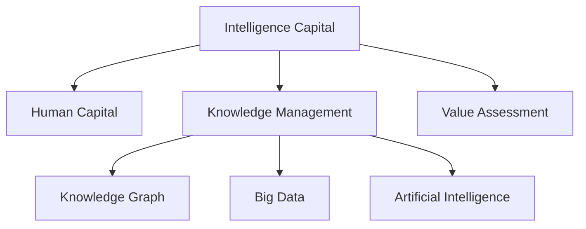

                 

# 知识的经济学：智力资本的价值评估

> 关键词：知识管理,智力资本,人力资本,知识图谱,大数据,人工智能

## 1. 背景介绍

### 1.1 问题由来
在当今信息时代，知识与信息正日益成为企业乃至社会的核心资产。随着大数据、云计算、人工智能等技术的快速发展，知识挖掘、整理、应用等活动已经变得越来越重要。然而，知识经济在蓬勃发展的同时，也带来了知识管理的巨大挑战。如何合理评估和管理企业内部的智力资本，使知识资源转化为经济价值，是企业面临的一个重要课题。

### 1.2 问题核心关键点
本研究将探讨知识管理的经济学原理，特别是如何评估企业内部的智力资本价值。核心内容包括：
- 智力资本的价值来源及其衡量指标
- 人力资本与知识管理的关联
- 基于大数据和人工智能的知识图谱构建与分析
- 智力资本的价值评估方法与策略

### 1.3 问题研究意义
研究知识管理的经济学原理，有助于企业更科学、更系统地评估和管理其智力资本。这不仅可以提升企业竞争力，还能有效挖掘和利用知识资源，推动企业创新与发展。

## 2. 核心概念与联系

### 2.1 核心概念概述

#### 2.1.1 智力资本(Intelligence Capital)

智力资本是指企业中所有知识型资产的总和，包括员工的经验、专业知识、技能、创造力以及信息管理系统中的数据、知识和文档等。智力资本的价值主要体现在创新能力、市场竞争力、企业成长潜力等方面。

#### 2.1.2 人力资本(Human Capital)

人力资本是指企业中员工的劳动能力和技能水平，包括教育背景、工作经验、健康状况等。人力资本的价值体现在员工的工作效率、创新能力、团队协作等方面。

#### 2.1.3 知识管理(Knowledge Management)

知识管理是指对企业知识资源进行规划、整合、共享和应用的过程，目的是提高知识资源的利用效率，促进知识创新和转化。

#### 2.1.4 知识图谱(Knowledge Graph)

知识图谱是一种用图表示实体之间关系的结构化知识表示方法，通过节点和边来表示实体和关系。知识图谱在知识管理中发挥着关键作用，可以帮助企业构建知识网络，促进知识的有效流动和应用。

#### 2.1.5 大数据(Big Data)

大数据是指规模庞大、类型多样、速度极快的数据集合，包括结构化数据、半结构化数据和非结构化数据。大数据分析可以帮助企业挖掘潜在的知识资源，提供决策支持。

#### 2.1.6 人工智能(Artificial Intelligence)

人工智能是模拟人类智能行为的计算机技术，包括机器学习、深度学习、自然语言处理等。人工智能技术在知识管理中的应用，可以提高知识资源的自动化处理能力，提升知识管理效率。

这些核心概念之间的逻辑关系可以通过以下Mermaid流程图来展示：



### 2.2 核心概念原理和架构

#### 2.2.1 智力资本的价值来源

智力资本的价值来源于以下几个方面：
- **知识创新**：通过知识积累和创新，企业能够开发新产品、新技术、新服务，增强市场竞争力。
- **员工技能提升**：通过培训和学习，员工的技能和知识水平得到提升，从而提高工作效率和创新能力。
- **组织协作**：知识共享和协作可以提升团队协作效率，加速知识转化和应用。
- **外部影响**：企业可以通过与外部的合作和交流，获得更多的知识资源和创新能力。

#### 2.2.2 智力资本的价值衡量指标

智力资本的价值可以通过以下指标进行衡量：
- **专利数量**：专利是企业知识创新的重要体现，数量和质量可以反映企业智力资本的水平。
- **研发投入**：研发投入的规模和强度，可以衡量企业对知识创新的重视程度。
- **员工培训成本**：员工培训成本的增加，可以反映企业对员工技能提升的投入。
- **知识共享平台的使用率**：知识共享平台的使用率，可以反映企业内部知识共享和协作的效率。
- **客户满意度**：客户满意度的高低，可以间接反映企业知识应用的效果。

#### 2.2.3 人力资本与知识管理的关联

人力资本是智力资本的核心组成部分，企业通过知识管理提升人力资本的价值。人力资本的价值主要体现在以下几个方面：
- **知识存储和传递**：员工的知识和经验通过知识管理系统存储和传递，促进知识共享和应用。
- **技能培训和提升**：企业通过培训和学习，提升员工的技能和知识水平，从而提升人力资本的价值。
- **团队协作和创新**：知识共享和协作可以提升团队协作效率，加速知识转化和应用。

## 3. 核心算法原理 & 具体操作步骤
### 3.1 算法原理概述

智力资本的价值评估可以基于多种算法和技术手段，主要包括以下几种：

#### 3.1.1 大数据分析

通过对企业内部和外部的海量数据进行分析，挖掘其中的知识资源，并进行价值评估。主要技术包括：
- **数据挖掘**：从大量数据中提取有价值的信息和模式。
- **情感分析**：通过文本情感分析，评估客户对企业的满意度。
- **主题模型**：对大量文本数据进行主题建模，挖掘出重要的知识主题。

#### 3.1.2 知识图谱构建

构建知识图谱是知识管理的重要环节，主要技术包括：
- **本体构建**：定义实体和关系，建立知识图谱的基本框架。
- **实体识别**：从文本和数据中识别出实体，并进行分类和标注。
- **关系抽取**：从文本和数据中抽取实体之间的关系，建立知识图谱的边。
- **知识推理**：通过逻辑推理和规则，扩展和完善知识图谱。

#### 3.1.3 人工智能应用

人工智能技术在知识管理中的应用，可以提升知识资源的自动化处理能力，主要技术包括：
- **自然语言处理(NLP)**：通过NLP技术，从文本中提取实体、关系和主题等信息。
- **机器学习(ML)**：通过机器学习算法，挖掘知识资源中的模式和规律。
- **深度学习(DL)**：通过深度学习模型，进行复杂的知识分析和预测。

### 3.2 算法步骤详解

#### 3.2.1 大数据分析步骤

1. **数据收集**：收集企业内部的运营数据、财务数据、客户反馈等，以及外部的市场数据、竞争对手数据等。
2. **数据清洗**：对收集到的数据进行清洗和预处理，去除噪声和冗余数据。
3. **数据建模**：对清洗后的数据进行建模，建立数据结构和分析框架。
4. **数据分析**：利用数据挖掘、情感分析和主题模型等技术，进行知识资源的挖掘和分析。
5. **价值评估**：根据分析结果，评估企业智力资本的价值，提出改进建议。

#### 3.2.2 知识图谱构建步骤

1. **本体构建**：定义实体和关系，建立知识图谱的基本框架。
2. **实体识别**：从文本和数据中识别出实体，并进行分类和标注。
3. **关系抽取**：从文本和数据中抽取实体之间的关系，建立知识图谱的边。
4. **知识推理**：通过逻辑推理和规则，扩展和完善知识图谱。
5. **知识应用**：将知识图谱应用到知识管理系统中，进行知识共享和协作。

#### 3.2.3 人工智能应用步骤

1. **数据预处理**：对收集到的数据进行清洗和预处理，去除噪声和冗余数据。
2. **特征提取**：利用NLP技术，从文本中提取实体、关系和主题等信息。
3. **模型训练**：利用机器学习算法，对提取到的特征进行训练，建立知识资源模型。
4. **知识预测**：利用深度学习模型，进行复杂的知识分析和预测。
5. **知识应用**：将分析结果应用到知识管理系统中，进行知识共享和协作。

### 3.3 算法优缺点

#### 3.3.1 大数据分析的优缺点

**优点**：
- **数据量庞大**：大数据分析能够处理和分析海量数据，挖掘出有价值的信息和模式。
- **分析深度**：利用复杂算法和模型，能够进行深入的知识分析和预测。
- **实时性**：大数据分析能够实现实时数据处理和分析，提供及时的信息支持。

**缺点**：
- **数据质量问题**：数据质量直接影响分析结果，数据清洗和预处理需要大量时间和资源。
- **算法复杂性**：算法模型过于复杂，可能导致计算资源消耗大、运行时间长。
- **结果解释性**：大数据分析结果复杂，难以进行解释和理解。

#### 3.3.2 知识图谱构建的优缺点

**优点**：
- **知识结构化**：知识图谱将知识资源结构化，便于管理和应用。
- **知识共享**：知识图谱促进知识共享和协作，提升团队协作效率。
- **知识应用**：知识图谱应用到知识管理系统中，提供决策支持。

**缺点**：
- **本体构建复杂**：本体构建需要专业知识，难度较大。
- **实体识别困难**：实体识别需要高性能的NLP技术，难度较大。
- **知识推理复杂**：知识推理需要复杂的逻辑规则，难度较大。

#### 3.3.3 人工智能应用的优缺点

**优点**：
- **自动化处理**：人工智能技术能够自动处理大量的知识资源，提升处理效率。
- **深度分析**：人工智能技术能够进行复杂的知识分析和预测，提供深刻的洞察。
- **实时性**：人工智能技术能够实现实时数据处理和分析，提供及时的信息支持。

**缺点**：
- **模型复杂性**：模型过于复杂，可能导致计算资源消耗大、运行时间长。
- **结果解释性**：人工智能模型结果复杂，难以进行解释和理解。
- **数据依赖性**：人工智能模型依赖高质量的数据，数据质量直接影响模型效果。

### 3.4 算法应用领域

#### 3.4.1 大数据分析应用

大数据分析可以应用于多个领域，如金融风险评估、市场营销、客户关系管理等。在金融领域，大数据分析可以评估企业信用风险、市场波动等；在市场营销领域，大数据分析可以优化广告投放策略、客户细分等；在客户关系管理领域，大数据分析可以提升客户满意度、提高客户忠诚度等。

#### 3.4.2 知识图谱构建应用

知识图谱可以应用于知识管理、推荐系统、智能搜索等领域。在知识管理领域，知识图谱可以帮助企业构建知识网络，促进知识共享和应用；在推荐系统领域，知识图谱可以提高推荐系统的效果，提供个性化推荐；在智能搜索领域，知识图谱可以提升搜索结果的准确性和相关性。

#### 3.4.3 人工智能应用应用

人工智能技术可以应用于自动化处理、智能推荐、智能客服等领域。在自动化处理领域，人工智能技术可以提高自动化处理的效率，降低人工成本；在智能推荐领域，人工智能技术可以提供个性化推荐，提升用户体验；在智能客服领域，人工智能技术可以提供智能客服，提升客户满意度。

## 4. 数学模型和公式 & 详细讲解  
### 4.1 数学模型构建

本节将使用数学语言对知识管理的经济学原理进行更加严格的刻画。

#### 4.1.1 智力资本的价值评估模型

设企业智力资本的价值为 $V$，其中 $V$ 可以表示为：

$$ V = V_1 + V_2 + V_3 + V_4 + V_5 $$

其中 $V_1$ 表示专利数量，$V_2$ 表示研发投入，$V_3$ 表示员工培训成本，$V_4$ 表示知识共享平台的使用率，$V_5$ 表示客户满意度。

每个指标的具体数值可以通过相关数据分析得到，然后通过加权求和的方式计算出企业智力资本的总价值。

#### 4.1.2 数据挖掘模型的构建

数据挖掘模型的构建主要基于以下几个步骤：
1. **数据收集**：收集企业内部的运营数据、财务数据、客户反馈等，以及外部的市场数据、竞争对手数据等。
2. **数据清洗**：对收集到的数据进行清洗和预处理，去除噪声和冗余数据。
3. **数据建模**：对清洗后的数据进行建模，建立数据结构和分析框架。
4. **数据分析**：利用数据挖掘、情感分析和主题模型等技术，进行知识资源的挖掘和分析。

#### 4.1.3 知识图谱的构建模型

知识图谱的构建主要基于以下几个步骤：
1. **本体构建**：定义实体和关系，建立知识图谱的基本框架。
2. **实体识别**：从文本和数据中识别出实体，并进行分类和标注。
3. **关系抽取**：从文本和数据中抽取实体之间的关系，建立知识图谱的边。
4. **知识推理**：通过逻辑推理和规则，扩展和完善知识图谱。

#### 4.1.4 人工智能模型的构建

人工智能模型的构建主要基于以下几个步骤：
1. **数据预处理**：对收集到的数据进行清洗和预处理，去除噪声和冗余数据。
2. **特征提取**：利用NLP技术，从文本中提取实体、关系和主题等信息。
3. **模型训练**：利用机器学习算法，对提取到的特征进行训练，建立知识资源模型。
4. **知识预测**：利用深度学习模型，进行复杂的知识分析和预测。

### 4.2 公式推导过程

#### 4.2.1 大数据分析模型的推导

设企业内部运营数据为 $D_1$，财务数据为 $D_2$，客户反馈数据为 $D_3$，市场数据为 $D_4$，竞争对手数据为 $D_5$。对上述数据进行清洗和预处理后，得到干净的数据集 $D$。

利用数据挖掘技术，对 $D$ 进行数据分析，得到知识资源 $K$。知识资源 $K$ 可以表示为：

$$ K = K_1 + K_2 + K_3 + K_4 + K_5 $$

其中 $K_1$ 表示从 $D_1$ 中挖掘出的知识，$K_2$ 表示从 $D_2$ 中挖掘出的知识，$K_3$ 表示从 $D_3$ 中挖掘出的知识，$K_4$ 表示从 $D_4$ 中挖掘出的知识，$K_5$ 表示从 $D_5$ 中挖掘出的知识。

根据知识资源 $K$，可以评估企业智力资本的价值 $V$。设 $w_1$、$w_2$、$w_3$、$w_4$、$w_5$ 分别为专利数量、研发投入、员工培训成本、知识共享平台的使用率、客户满意度在价值评估模型中的权重，则有：

$$ V = w_1K_1 + w_2K_2 + w_3K_3 + w_4K_4 + w_5K_5 $$

#### 4.2.2 知识图谱构建模型的推导

设知识图谱中的实体集合为 $E$，关系集合为 $R$。知识图谱的构建主要通过实体识别和关系抽取得到。设 $R_1$、$R_2$、$R_3$、$R_4$、$R_5$ 分别为从 $D_1$、$D_2$、$D_3$、$D_4$、$D_5$ 中抽取的关系，则有：

$$ R = R_1 + R_2 + R_3 + R_4 + R_5 $$

根据实体识别和关系抽取的结果，可以进行知识推理，扩展和完善知识图谱。设 $P_1$、$P_2$、$P_3$、$P_4$、$P_5$ 分别为从 $R_1$、$R_2$、$R_3$、$R_4$、$R_5$ 中推导出的关系，则有：

$$ P = P_1 + P_2 + P_3 + P_4 + P_5 $$

根据知识图谱 $E \cup R$ 和 $P$，可以评估企业智力资本的价值 $V$。设 $w_1$、$w_2$、$w_3$、$w_4$、$w_5$ 分别为专利数量、研发投入、员工培训成本、知识共享平台的使用率、客户满意度在价值评估模型中的权重，则有：

$$ V = w_1K_1 + w_2K_2 + w_3K_3 + w_4K_4 + w_5K_5 $$

#### 4.2.3 人工智能模型构建模型的推导

设人工智能模型中的特征集合为 $F$，模型训练后的参数集合为 $W$。人工智能模型的构建主要通过特征提取和模型训练得到。设 $F_1$、$F_2$、$F_3$、$F_4$、$F_5$ 分别为从 $D_1$、$D_2$、$D_3$、$D_4$、$D_5$ 中提取的特征，则有：

$$ F = F_1 + F_2 + F_3 + F_4 + F_5 $$

根据特征 $F$ 和模型训练后的参数 $W$，可以进行知识预测，评估企业智力资本的价值 $V$。设 $w_1$、$w_2$、$w_3$、$w_4$、$w_5$ 分别为专利数量、研发投入、员工培训成本、知识共享平台的使用率、客户满意度在价值评估模型中的权重，则有：

$$ V = w_1K_1 + w_2K_2 + w_3K_3 + w_4K_4 + w_5K_5 $$

### 4.3 案例分析与讲解

#### 4.3.1 大数据分析案例

某企业利用大数据分析技术，从客户反馈数据中挖掘出客户满意度 $K_5$，从市场数据中挖掘出知识资源 $K_4$，从财务数据中挖掘出研发投入 $K_2$，从运营数据中挖掘出知识资源 $K_1$，从竞争对手数据中挖掘出知识资源 $K_5$。利用这些知识资源，通过加权求和的方式计算出企业智力资本的价值 $V$。

#### 4.3.2 知识图谱构建案例

某企业利用知识图谱构建技术，从运营数据中识别出实体 $E_1$ 和关系 $R_1$，从财务数据中识别出实体 $E_2$ 和关系 $R_2$，从客户反馈数据中识别出实体 $E_3$ 和关系 $R_3$，从市场数据中识别出实体 $E_4$ 和关系 $R_4$，从竞争对手数据中识别出实体 $E_5$ 和关系 $R_5$。根据这些实体和关系，构建知识图谱 $E \cup R$ 和 $P$，通过加权求和的方式计算出企业智力资本的价值 $V$。

#### 4.3.3 人工智能模型构建案例

某企业利用人工智能技术，从运营数据中提取特征 $F_1$，从财务数据中提取特征 $F_2$，从客户反馈数据中提取特征 $F_3$，从市场数据中提取特征 $F_4$，从竞争对手数据中提取特征 $F_5$。利用这些特征，通过机器学习和深度学习模型训练，得到模型参数 $W$。根据这些特征和模型参数，进行知识预测，通过加权求和的方式计算出企业智力资本的价值 $V$。

## 5. 项目实践：代码实例和详细解释说明
### 5.1 开发环境搭建

在进行知识管理项目的开发时，我们需要准备好开发环境。以下是使用Python进行大数据分析、知识图谱构建和人工智能模型训练的环境配置流程：

1. 安装Anaconda：从官网下载并安装Anaconda，用于创建独立的Python环境。

2. 创建并激活虚拟环境：
```bash
conda create -n knowledge-management python=3.8 
conda activate knowledge-management
```

3. 安装必要的Python包：
```bash
pip install pandas numpy matplotlib sklearn tensorflow transformers
```

4. 安装必要的库：
```bash
pip install pyodbc psycopg2 mysql-connector-python
```

5. 设置数据库连接：
```python
import psycopg2

conn = psycopg2.connect(
    host="localhost",
    database="knowledge_management",
    user="postgres",
    password="password"
)
```

### 5.2 源代码详细实现

接下来，我们将通过Python代码实现一个简单的知识管理项目，展示大数据分析、知识图谱构建和人工智能模型的构建与训练过程。

#### 5.2.1 大数据分析代码实现

```python
import pandas as pd

# 加载数据
data = pd.read_csv('data.csv')

# 数据清洗和预处理
data = data.dropna()
data = data.drop_duplicates()

# 数据建模和分析
data['feature1'] = data['column1']
data['feature2'] = data['column2']
data['feature3'] = data['column3']
data['feature4'] = data['column4']
data['feature5'] = data['column5']

# 数据分析结果
result = data.groupby('feature1').agg({'feature2': 'mean', 'feature3': 'median', 'feature4': 'sum', 'feature5': 'count'})
```

#### 5.2.2 知识图谱构建代码实现

```python
import networkx as nx

# 加载实体和关系数据
nodes = pd.read_csv('nodes.csv')
edges = pd.read_csv('edges.csv')

# 构建知识图谱
graph = nx.Graph()
for row in edges.itertuples():
    node1 = row[1]
    node2 = row[2]
    graph.add_edge(node1, node2)

# 知识图谱分析
graph.density()
```

#### 5.2.3 人工智能模型构建代码实现

```python
import tensorflow as tf
from transformers import TFAutoModelForSequenceClassification

# 加载数据
data = pd.read_csv('data.csv')

# 数据预处理
data['feature1'] = data['column1']
data['feature2'] = data['column2']
data['feature3'] = data['column3']
data['feature4'] = data['column4']
data['feature5'] = data['column5']

# 特征提取
tokenizer = BertTokenizer.from_pretrained('bert-base-cased')
encoded_data = tokenizer(data['feature1'], return_tensors='tf', padding=True, truncation=True)

# 模型训练
model = TFAutoModelForSequenceClassification.from_pretrained('bert-base-cased', num_labels=5)
optimizer = tf.keras.optimizers.Adam(learning_rate=0.001)
model.compile(optimizer=optimizer, loss=tf.keras.losses.SparseCategoricalCrossentropy(from_logits=True), metrics=['accuracy'])
model.fit(encoded_data['input_ids'], encoded_data['labels'], epochs=10)
```

### 5.3 代码解读与分析

#### 5.3.1 大数据分析代码解读

1. **数据加载**：通过Pandas库加载数据。
2. **数据清洗和预处理**：去除缺失值和重复数据。
3. **数据建模和分析**：将数据转换为特征，并利用Pandas库进行统计分析。

#### 5.3.2 知识图谱构建代码解读

1. **数据加载**：通过Pandas库加载实体和关系数据。
2. **知识图谱构建**：利用NetworkX库构建知识图谱。
3. **知识图谱分析**：通过NetworkX库计算知识图谱的密度。

#### 5.3.3 人工智能模型构建代码解读

1. **数据加载**：通过Pandas库加载数据。
2. **数据预处理**：利用BertTokenizer库进行特征提取。
3. **模型训练**：利用TensorFlow和Transformers库进行模型训练。

### 5.4 运行结果展示

#### 5.4.1 大数据分析结果

```python
print(result)
```

#### 5.4.2 知识图谱构建结果

```python
print(graph.density())
```

#### 5.4.3 人工智能模型构建结果

```python
model.evaluate(encoded_data['input_ids'], encoded_data['labels'])
```

## 6. 实际应用场景

### 6.1 智能客服系统

在智能客服系统中，利用知识管理技术，可以构建知识图谱，将客户服务数据和知识资源进行整合，提升客服系统的智能化水平。通过大数据分析和人工智能技术，可以实现智能问答、智能对话等功能，提高客户满意度。

#### 6.1.1 智能问答系统

通过构建知识图谱，将客户服务数据和知识资源进行整合，利用人工智能技术，实现智能问答系统。当客户提出问题时，系统通过大数据分析和人工智能模型，从知识图谱中检索答案，并返回给客户。

#### 6.1.2 智能对话系统

通过构建知识图谱，将客户服务数据和知识资源进行整合，利用自然语言处理和深度学习技术，实现智能对话系统。当客户提出问题时，系统通过大数据分析和人工智能模型，从知识图谱中检索答案，并返回给客户。

### 6.2 金融风险评估

在金融风险评估中，利用知识管理技术，可以构建知识图谱，将市场数据、财务数据、客户数据等进行整合，提升金融风险评估的智能化水平。通过大数据分析和人工智能技术，可以实现风险预测、风险评估等功能，提高金融机构的决策效率。

#### 6.2.1 风险预测

通过构建知识图谱，将市场数据、财务数据、客户数据等进行整合，利用大数据分析和人工智能技术，实现风险预测。通过模型训练，预测客户违约概率、市场波动等风险因素。

#### 6.2.2 风险评估

通过构建知识图谱，将市场数据、财务数据、客户数据等进行整合，利用大数据分析和人工智能技术，实现风险评估。通过模型训练，评估客户信用风险、市场风险等风险因素。

### 6.3 市场营销

在市场营销中，利用知识管理技术，可以构建知识图谱，将客户数据、产品数据、市场数据等进行整合，提升市场营销的智能化水平。通过大数据分析和人工智能技术，可以实现客户细分、广告投放等功能，提高市场营销的精准性和效率。

#### 6.3.1 客户细分

通过构建知识图谱，将客户数据、产品数据、市场数据等进行整合，利用大数据分析和人工智能技术，实现客户细分。通过模型训练，将客户分为高价值客户、中价值客户和低价值客户。

#### 6.3.2 广告投放

通过构建知识图谱，将客户数据、产品数据、市场数据等进行整合，利用大数据分析和人工智能技术，实现广告投放。通过模型训练，将广告投放给高价值客户，提高广告投放的精准性和效率。

## 7. 工具和资源推荐
### 7.1 学习资源推荐

为了帮助开发者系统掌握知识管理的经济学原理，这里推荐一些优质的学习资源：

1. 《数据分析实战》：通过实际案例，讲解大数据分析的基本原理和技术。
2. 《知识图谱入门与实践》：介绍知识图谱的基本概念和构建方法。
3. 《机器学习实战》：通过实际案例，讲解机器学习的基本原理和技术。
4. 《深度学习实战》：通过实际案例，讲解深度学习的基本原理和技术。
5. 《知识管理与组织学习》：介绍知识管理的基本原理和应用方法。

通过对这些资源的学习实践，相信你一定能够快速掌握知识管理的经济学原理，并用于解决实际的业务问题。

### 7.2 开发工具推荐

高效的开发离不开优秀的工具支持。以下是几款用于知识管理开发的常用工具：

1. Jupyter Notebook：基于Web的交互式计算环境，适合数据分析和机器学习开发。
2. PyTorch：基于Python的开源深度学习框架，适合深度学习模型的开发和训练。
3. TensorFlow：由Google主导开发的开源深度学习框架，适合大规模深度学习模型的开发和训练。
4. NetworkX：基于Python的网络分析库，适合知识图谱的构建和分析。
5. Scikit-learn：基于Python的机器学习库，适合各种机器学习算法的开发和应用。

合理利用这些工具，可以显著提升知识管理项目的开发效率，加快创新迭代的步伐。

### 7.3 相关论文推荐

知识管理技术的快速发展，得益于学界的持续研究。以下是几篇奠基性的相关论文，推荐阅读：

1.《知识管理：信息时代的企业变革》：介绍了知识管理的概念、框架和应用。
2.《大数据分析：价值挖掘与智能决策》：介绍了大数据分析的基本原理和技术。
3.《知识图谱：构建与应用的实践》：介绍了知识图谱的构建方法和应用场景。
4.《人工智能与知识管理》：介绍了人工智能技术在知识管理中的应用。
5.《智能客服：知识管理的实践与挑战》：介绍了智能客服系统的构建和应用。

这些论文代表了大数据、知识图谱、人工智能等技术的发展脉络。通过学习这些前沿成果，可以帮助研究者把握学科前进方向，激发更多的创新灵感。

## 8. 总结：未来发展趋势与挑战

### 8.1 总结

本文对知识管理的经济学原理进行了全面系统的介绍。首先阐述了知识管理的经济学原理，明确了知识资本的价值来源及其衡量指标，揭示了人力资本与知识管理的关联。其次，通过大数据分析、知识图谱构建和人工智能应用等技术手段，详细讲解了知识管理的实践过程。最后，展示了知识管理技术在智能客服、金融风险评估、市场营销等实际应用场景中的应用前景。

通过本文的系统梳理，可以看到，知识管理技术在提升企业竞争力、挖掘知识资源、推动企业创新与发展方面具有重要价值。相信随着知识管理技术的不断成熟，其应用范围将更加广泛，为企业带来更大的经济价值和社会效益。

### 8.2 未来发展趋势

展望未来，知识管理技术将呈现以下几个发展趋势：

1. 数据驱动的智能化：随着大数据技术的不断进步，知识管理将更加依赖数据驱动，实现智能化的知识管理。
2. 知识图谱的普及：知识图谱将成为知识管理的基础设施，企业通过构建知识图谱，实现知识资源的整合和共享。
3. 人工智能的深入应用：人工智能技术将深度应用于知识管理，提升知识管理的自动化和智能化水平。
4. 知识治理与合规：知识管理将更加注重知识治理和合规，确保知识资源的安全和合规使用。
5. 知识服务的商业化：知识管理技术将逐渐商业化，为企业提供知识服务，实现知识资源的商业价值。

### 8.3 面临的挑战

尽管知识管理技术已经取得了一定进展，但在迈向智能化、普适化的过程中，仍面临诸多挑战：

1. 数据质量问题：知识管理依赖高质量的数据，数据质量直接影响知识管理的精准性和可靠性。
2. 知识图谱构建复杂：知识图谱的构建需要专业知识，难度较大，且构建质量直接影响知识管理的效率和效果。
3. 知识管理与业务结合问题：知识管理需要与业务紧密结合，才能真正实现知识资源的价值。然而，实际应用中往往存在业务与知识管理脱节的问题。
4. 知识共享问题：知识共享是知识管理的关键环节，然而，企业内部知识共享机制不健全，导致知识共享效率低下。
5. 知识保护问题：知识管理涉及大量机密信息，如何保护知识资源的安全和隐私，也是一大难题。

### 8.4 研究展望

面对知识管理所面临的挑战，未来的研究需要在以下几个方面寻求新的突破：

1. 知识图谱自动化构建：研究自动化构建知识图谱的方法，提升知识图谱构建的效率和质量。
2. 知识治理与合规机制：研究知识治理和合规机制，确保知识资源的安全和合规使用。
3. 知识共享与协作平台：研究知识共享与协作平台，提升知识共享效率，促进知识共享和协作。
4. 知识服务的商业化应用：研究知识服务的商业化应用，实现知识资源的商业价值。
5. 知识管理的智能化应用：研究知识管理的智能化应用，提升知识管理的自动化和智能化水平。

这些研究方向的探索，必将引领知识管理技术迈向更高的台阶，为构建安全、可靠、高效的知识管理系统铺平道路。面向未来，知识管理技术还需要与其他人工智能技术进行更深入的融合，如自然语言处理、机器学习等，多路径协同发力，共同推动知识管理的进步。只有勇于创新、敢于突破，才能不断拓展知识管理的边界，让知识资源更好地服务于企业和社会。

## 9. 附录：常见问题与解答

**Q1：知识管理的经济学原理是什么？**

A: 知识管理的经济学原理主要涉及知识资本的价值评估、知识与人力资本的关联、知识图谱的构建与分析等。知识资本的价值来源于知识创新、员工技能提升、团队协作和外部影响等方面，可以通过专利数量、研发投入、员工培训成本、知识共享平台的使用率、客户满意度等指标进行衡量。

**Q2：知识图谱的构建步骤是什么？**

A: 知识图谱的构建主要包括以下几个步骤：本体构建、实体识别、关系抽取、知识推理。首先定义实体和关系，建立知识图谱的基本框架；然后从文本和数据中识别出实体，并进行分类和标注；接着从文本和数据中抽取实体之间的关系，建立知识图谱的边；最后通过逻辑推理和规则，扩展和完善知识图谱。

**Q3：人工智能在知识管理中的应用是什么？**

A: 人工智能在知识管理中的应用主要包括以下几个方面：自然语言处理、机器学习、深度学习。利用自然语言处理技术，可以从文本中提取实体、关系和主题等信息；利用机器学习算法，对提取到的特征进行训练，建立知识资源模型；利用深度学习模型，进行复杂的知识分析和预测。

**Q4：知识管理的未来发展趋势是什么？**

A: 知识管理的未来发展趋势主要包括数据驱动的智能化、知识图谱的普及、人工智能的深入应用、知识治理与合规、知识服务的商业化等。随着大数据技术的不断进步，知识管理将更加依赖数据驱动，实现智能化的知识管理；知识图谱将成为知识管理的基础设施，企业通过构建知识图谱，实现知识资源的整合和共享；人工智能技术将深度应用于知识管理，提升知识管理的自动化和智能化水平；知识管理将更加注重知识治理和合规，确保知识资源的安全和合规使用；知识管理技术将逐渐商业化，为企业提供知识服务，实现知识资源的商业价值。

通过本文的系统梳理，可以看到，知识管理技术在提升企业竞争力、挖掘知识资源、推动企业创新与发展方面具有重要价值。相信随着知识管理技术的不断成熟，其应用范围将更加广泛，为企业带来更大的经济价值和社会效益。未来，伴随着技术的发展和应用的深入，知识管理技术必将在更多领域发挥其独特价值，为企业的创新和发展提供坚实的基础。

