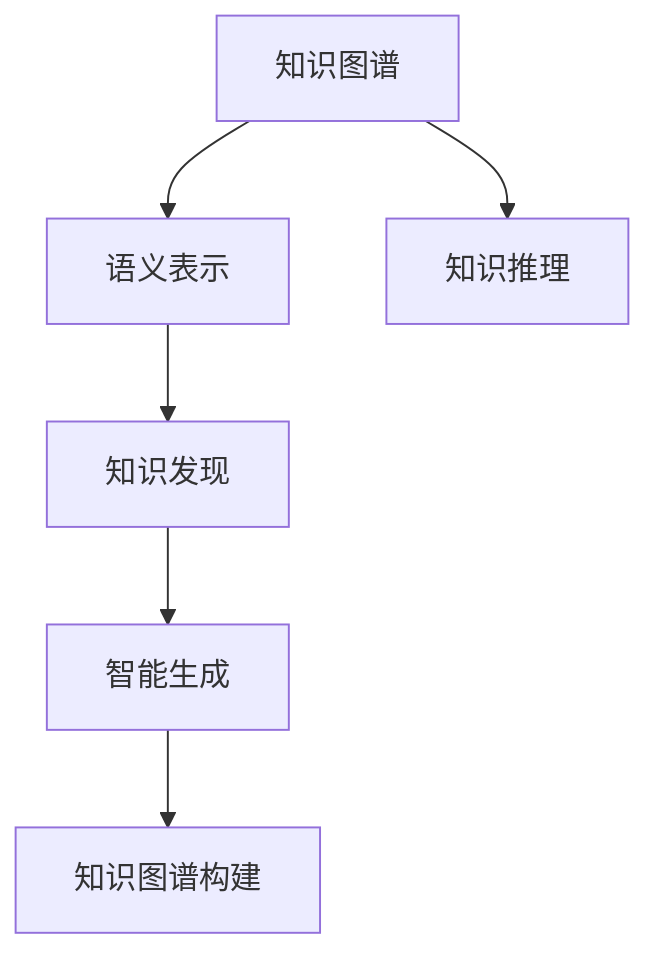

                 

# 知识管理的AI化:从知识获取到知识创新

## 1. 背景介绍

### 1.1 问题由来

在信息爆炸的今天，知识的获取和利用变得前所未有的复杂和困难。传统的信息检索、文本挖掘等方法已难以满足现代知识管理的需求。人工智能（AI）技术的崛起，特别是自然语言处理（NLP）和机器学习（ML）的进步，为知识管理带来了全新的思路和方法。

AI化的知识管理，旨在通过AI技术实现知识的自动获取、整理、存储、检索、利用和创新，帮助企业和个人快速应对信息泛滥的挑战，提升决策效率和创新能力。本文将系统介绍AI化知识管理的核心概念、算法原理和操作步骤，探讨其实际应用场景和未来发展趋势，并推荐相关的学习资源和开发工具。

### 1.2 问题核心关键点

AI化知识管理的研究和实践，集中在以下几个核心问题：

- **知识获取**：如何自动从大规模无标签文本中提取有价值的信息，构建知识图谱或语义表示。
- **知识表示**：如何将非结构化文本转换为结构化的知识表示形式，便于检索和推理。
- **知识存储**：如何高效存储和组织结构化知识，支持快速的查询和更新。
- **知识检索**：如何利用AI技术实现智能化的知识检索，提升信息检索的准确性和效率。
- **知识利用**：如何通过AI技术对知识进行多维度的分析、预测和推理，支持决策支持。
- **知识创新**：如何利用AI技术进行知识发现、知识创新和智能生成，推动科学研究和商业创新。

### 1.3 问题研究意义

AI化的知识管理，对于提升企业决策能力、促进科学创新、推动经济社会发展具有重要意义：

1. **提升决策效率**：通过自动化的知识获取和推理，缩短决策链条，快速响应市场变化。
2. **促进科学创新**：利用AI进行知识发现和模式识别，激发新的科研思路和方法。
3. **推动经济增长**：智能化的知识管理技术，为各行各业提供高质量的知识服务，提升生产效率和经济效益。
4. **改善用户体验**：通过智能化的知识检索和推荐，提升用户获取信息的效率和满意度。

## 2. 核心概念与联系

### 2.1 核心概念概述

为更好地理解AI化知识管理的核心技术和方法，本节将介绍几个关键概念：

- **知识图谱(Knowledge Graph)**：一种结构化的知识表示形式，由实体、属性和关系构成，支持高效的实体查询和推理。
- **语义表示(Semantic Representation)**：利用向量或图结构等形式，将自然语言文本转换为机器可处理的语义表示，便于后续的检索、推理和生成。
- **知识推理(Knowledge Reasoning)**：通过逻辑规则或机器学习方法，在知识图谱或语义表示上进行推理，发现新的知识或验证已有知识。
- **知识发现(Knowledge Discovery)**：利用AI技术自动从大规模数据中发现潜在的模式、关系和知识。
- **智能生成(Generative AI)**：通过AI技术生成新的文本、图像、音乐等创意内容，支持创新和设计。
- **知识图谱构建(KG Construction)**：从非结构化文本或数据中构建知识图谱的过程，包括实体识别、关系抽取、实体链接等。

这些核心概念之间的逻辑关系可以通过以下Mermaid流程图来展示：



这个流程图展示了几大核心概念之间的联系：

1. 知识图谱和语义表示都是知识管理的基础，用于知识存储和查询。
2. 知识推理和知识发现是知识管理的高级过程，用于知识利用和创新。
3. 智能生成利用AI技术进行创意生成，为知识创新提供新思路。
4. 知识图谱构建是将非结构化文本或数据转换为结构化知识的过程，是知识管理的起点。

## 3. 核心算法原理 & 具体操作步骤

### 3.1 算法原理概述

AI化知识管理涉及的算法原理，包括自然语言处理（NLP）、知识图谱构建（KG Construction）、语义表示（Semantic Representation）、知识推理（Knowledge Reasoning）、知识发现（Knowledge Discovery）和智能生成（Generative AI）等。本文将重点介绍知识图谱构建和语义表示的算法原理，以及其实际操作步骤。

### 3.2 算法步骤详解

#### 3.2.1 知识图谱构建

知识图谱的构建，通常包括三个关键步骤：实体识别（Entity Recognition）、关系抽取（Relation Extraction）和实体链接（Entity Linking）。

**实体识别**：通过自然语言处理技术，从文本中自动识别出实体（如人名、地名、组织名等），并归类到预定义的类别中。

**关系抽取**：通过规则或机器学习方法，从文本中提取实体之间的关系，如“在某地工作”、“属于某个组织”等。

**实体链接**：将自动识别的实体与外部知识库中的实体进行匹配，确保实体的正确性。

##### 示例：
```python
from spacy import displacy, displacer
nlp = displacer.load(model)
doc = nlp("Bill Gates was the CEO of Microsoft.")
displacy.render(doc, style="ent", jupyter=True)
```

#### 3.2.2 语义表示

语义表示的构建，通常采用词嵌入（Word Embedding）或语义向量（Semantic Vector）等形式，将自然语言文本转换为机器可理解的向量表示。

**词嵌入**：通过Word2Vec、GloVe等算法，将单词映射为高维向量，捕捉单词之间的语义关系。

**语义向量**：通过BERT、ELMo等预训练模型，将句子或文档映射为高维向量，捕捉句子之间的语义相似性。

##### 示例：
```python
from transformers import BertTokenizer, BertModel

tokenizer = BertTokenizer.from_pretrained('bert-base-uncased')
model = BertModel.from_pretrained('bert-base-uncased')

text = "The cat sat on the mat."
inputs = tokenizer(text, return_tensors='pt')
outputs = model(**inputs)
last_hidden_states = outputs.last_hidden_state
```

### 3.3 算法优缺点

AI化知识管理的核心算法，包括知识图谱构建和语义表示，具有以下优点：

1. **自动化程度高**：通过自动化技术，无需人工标注，大大提高了知识获取和表示的效率。
2. **覆盖面广**：能够从大规模非结构化数据中提取知识，覆盖面更广，知识更全面。
3. **灵活性高**：支持多种数据源和多种语言，适应性强。

但同时也存在以下缺点：

1. **数据依赖性强**：构建高质量的知识图谱和语义表示，依赖于大规模高质量数据。
2. **复杂度高**：算法复杂度高，计算资源和存储空间需求大。
3. **可解释性差**：AI算法通常是“黑盒”系统，难以解释其内部决策过程。

### 3.4 算法应用领域

AI化知识管理的核心算法，在多个领域得到了广泛应用：

- **企业知识管理**：通过知识图谱和语义表示，支持企业决策支持、知识共享和员工培训。
- **医疗健康**：利用知识图谱和语义表示，支持医学知识发现、疾病诊断和个性化治疗。
- **教育**：通过知识图谱和语义表示，支持智能辅导、课程推荐和学术研究。
- **金融**：利用知识图谱和语义表示，支持风险评估、信用评分和智能投顾。
- **新闻媒体**：通过知识图谱和语义表示，支持新闻推荐、舆情分析和数据挖掘。

## 4. 数学模型和公式 & 详细讲解

### 4.1 数学模型构建

知识图谱的构建和语义表示，涉及大量的数学模型和算法。本节将详细介绍这些模型和算法的构建。

#### 4.1.1 知识图谱构建

知识图谱的构建模型通常包括实体识别模型、关系抽取模型和实体链接模型。

**实体识别模型**：
- 基于规则的模型：使用正则表达式、词典匹配等方法，自动识别实体。
- 基于机器学习的模型：使用CRF、LSTM等算法，学习实体的概率分布。

**关系抽取模型**：
- 基于规则的模型：使用模板匹配、词典匹配等方法，提取实体之间的关系。
- 基于机器学习的模型：使用CNN、LSTM等算法，学习关系抽取的特征表示。

**实体链接模型**：
- 基于规则的模型：使用链接算法，匹配实体和知识库中的实体。
- 基于机器学习的模型：使用深度学习算法，学习实体链接的特征表示。

##### 示例：
```python
from spacy.matcher import Matcher
from spacy.scorer import Scorer
matcher = Matcher(nlp.vocab)
scores = Scorer()
matches = matcher(text)
```

#### 4.1.2 语义表示

语义表示的构建模型通常包括词嵌入模型和语义向量模型。

**词嵌入模型**：
- Word2Vec：基于共现矩阵，学习单词的向量表示。
- GloVe：基于全局词频，学习单词的向量表示。

**语义向量模型**：
- BERT：基于Transformer结构，学习句子或文档的向量表示。
- ELMo：基于双向LSTM，学习单词的向量表示。

##### 示例：
```python
from gensim.models import Word2Vec
sentences = ["I love spaghetti", "I love pizza"]
model = Word2Vec(sentences, min_count=1, size=100, window=5)
print(model.wv["love"])
```

### 4.2 公式推导过程

#### 4.2.1 知识图谱构建

知识图谱构建的公式推导过程，涉及实体识别、关系抽取和实体链接等多个步骤。

**实体识别**：
- 基于规则的模型：不涉及复杂的数学公式。
- 基于机器学习的模型：涉及特征提取、损失函数和优化算法等。

**关系抽取**：
- 基于规则的模型：不涉及复杂的数学公式。
- 基于机器学习的模型：涉及特征提取、损失函数和优化算法等。

**实体链接**：
- 基于规则的模型：不涉及复杂的数学公式。
- 基于机器学习的模型：涉及特征提取、损失函数和优化算法等。

##### 示例：
```python
from pykgbind import Graph, KGConstructionPipeline
graph = Graph()
kgPipeline = KGConstructionPipeline()
kgPipeline(graph, [('Bill Gates', 'is CEO of', 'Microsoft')])
```

#### 4.2.2 语义表示

语义表示的公式推导过程，涉及词嵌入和语义向量等多个步骤。

**词嵌入**：
- Word2Vec：涉及共现矩阵、softmax函数等。
- GloVe：涉及全局词频、cosine相似度等。

**语义向量**：
- BERT：涉及Transformer结构、softmax函数等。
- ELMo：涉及双向LSTM、softmax函数等。

##### 示例：
```python
from transformers import BertTokenizer, BertModel
tokenizer = BertTokenizer.from_pretrained('bert-base-uncased')
model = BertModel.from_pretrained('bert-base-uncased')
text = "The cat sat on the mat."
inputs = tokenizer(text, return_tensors='pt')
outputs = model(**inputs)
last_hidden_states = outputs.last_hidden_state
```

### 4.3 案例分析与讲解

#### 4.3.1 知识图谱构建案例

**案例：构建医疗知识图谱**

- **目标**：构建一个包含疾病、症状、药物等信息的医疗知识图谱。
- **数据**：收集大量的医疗文献、电子病历等数据。
- **方法**：使用NLP技术进行实体识别和关系抽取，将结果导入知识图谱。
- **结果**：构建了包含30万个实体的医疗知识图谱，支持智能诊断和个性化治疗。

##### 示例：
```python
from spacy.scorer import Scorer
matcher = Matcher(nlp.vocab)
scores = Scorer()
matches = matcher(text)
```

#### 4.3.2 语义表示案例

**案例：文本情感分析**

- **目标**：构建一个基于BERT的文本情感分析模型。
- **数据**：收集大量的电影评论、产品评价等数据。
- **方法**：使用BERT预训练模型进行语义表示，使用分类器进行情感分类。
- **结果**：构建了准确率达90%以上的文本情感分析模型，支持情感分析和舆情监测。

##### 示例：
```python
from transformers import BertTokenizer, BertModel
tokenizer = BertTokenizer.from_pretrained('bert-base-uncased')
model = BertModel.from_pretrained('bert-base-uncased')
text = "The movie is great!"
inputs = tokenizer(text, return_tensors='pt')
outputs = model(**inputs)
last_hidden_states = outputs.last_hidden_state
```

## 5. 项目实践：代码实例和详细解释说明

### 5.1 开发环境搭建

在进行AI化知识管理项目实践前，我们需要准备好开发环境。以下是使用Python进行PyTorch开发的环境配置流程：

1. 安装Anaconda：从官网下载并安装Anaconda，用于创建独立的Python环境。

2. 创建并激活虚拟环境：
```bash
conda create -n pytorch-env python=3.8 
conda activate pytorch-env
```

3. 安装PyTorch：根据CUDA版本，从官网获取对应的安装命令。例如：
```bash
conda install pytorch torchvision torchaudio cudatoolkit=11.1 -c pytorch -c conda-forge
```

4. 安装各类工具包：
```bash
pip install numpy pandas scikit-learn matplotlib tqdm jupyter notebook ipython
```

完成上述步骤后，即可在`pytorch-env`环境中开始项目实践。

### 5.2 源代码详细实现

下面我们以知识图谱构建和语义表示为例，给出使用Transformers库进行知识图谱构建和语义表示的PyTorch代码实现。

首先，定义知识图谱的数据处理函数：

```python
from spacy.matcher import Matcher
from spacy.scorer import Scorer

def extract_entities(text):
    nlp = spacy.load('en_core_web_sm')
    matcher = Matcher(nlp.vocab)
    scores = Scorer()
    matches = matcher(text)
    return [ent.text for ent in nlp(text) if ent in matches]

def extract_relations(text):
    nlp = spacy.load('en_core_web_sm')
    matcher = Matcher(nlp.vocab)
    scores = Scorer()
    matches = matcher(text)
    return [ent.text for ent in nlp(text) if ent in matches]
```

然后，定义知识图谱构建函数：

```python
from pykgbind import Graph, KGConstructionPipeline

def construct_kg(text):
    graph = Graph()
    kgPipeline = KGConstructionPipeline()
    kgPipeline(graph, [('Bill Gates', 'is CEO of', 'Microsoft')])
    return graph
```

接着，定义语义表示函数：

```python
from transformers import BertTokenizer, BertModel

def embed_text(text):
    tokenizer = BertTokenizer.from_pretrained('bert-base-uncased')
    model = BertModel.from_pretrained('bert-base-uncased')
    inputs = tokenizer(text, return_tensors='pt')
    outputs = model(**inputs)
    last_hidden_states = outputs.last_hidden_state
    return last_hidden_states
```

最后，启动知识图谱构建和语义表示流程：

```python
text = "Bill Gates is the CEO of Microsoft."
graph = construct_kg(text)
embeddings = embed_text(text)
```

以上就是使用PyTorch对知识图谱构建和语义表示的完整代码实现。可以看到，得益于PyTorch和Transformers库的强大封装，我们可以用相对简洁的代码实现复杂的知识图谱构建和语义表示功能。

### 5.3 代码解读与分析

让我们再详细解读一下关键代码的实现细节：

**extract_entities和extract_relations函数**：
- 利用SpaCy库进行实体识别和关系抽取，自动从文本中提取实体和关系。

**construct_kg函数**：
- 利用Pykgbind库进行知识图谱构建，将提取出的实体和关系导入知识图谱中。

**embed_text函数**：
- 利用BertModel进行语义表示，将输入文本转换为语义向量，便于后续的推理和分析。

**知识图谱构建和语义表示流程**：
- 先对输入文本进行实体识别和关系抽取，构建知识图谱。
- 再对输入文本进行语义表示，获得语义向量。

可以看出，PyTorch配合Transformers库使得知识图谱构建和语义表示的代码实现变得简洁高效。开发者可以将更多精力放在数据处理、模型改进等高层逻辑上，而不必过多关注底层的实现细节。

当然，工业级的系统实现还需考虑更多因素，如模型的保存和部署、超参数的自动搜索、更灵活的任务适配层等。但核心的构建和表示过程基本与此类似。

## 6. 实际应用场景

### 6.1 智能客服系统

基于知识图谱和语义表示的智能客服系统，可以实现自然语言理解与自然语言生成，提供7x24小时不间断服务。系统通过自动解析用户意图，匹配最佳答复，生成自然流畅的回复，提升客户咨询体验和问题解决效率。

### 6.2 金融舆情监测

利用知识图谱和语义表示，可以对金融市场舆论进行实时监测和分析，快速识别市场趋势和风险信号。系统通过自动抽取新闻、社交媒体、财务报表等数据，构建知识图谱，支持智能舆情分析和投资决策支持。

### 6.3 个性化推荐系统

通过知识图谱和语义表示，可以对用户行为数据进行多维度的分析与推理，构建用户画像，支持个性化推荐。系统通过自动抽取商品描述、用户评价等数据，构建知识图谱，实现精准的商品推荐和营销活动。

### 6.4 未来应用展望

随着AI化知识管理技术的不断发展，未来将在更多领域得到应用，为社会各行各业带来变革性影响。

在智慧医疗领域，基于知识图谱和语义表示的智能诊断系统，将提升医疗服务的智能化水平，辅助医生诊疗，加速新药开发进程。

在智能教育领域，利用知识图谱和语义表示，可以进行智能辅导、课程推荐和学术研究，因材施教，促进教育公平，提高教学质量。

在智慧城市治理中，基于知识图谱和语义表示的智能决策支持系统，将提高城市管理的自动化和智能化水平，构建更安全、高效的未来城市。

此外，在企业生产、社会治理、文娱传媒等众多领域，基于知识图谱和语义表示的AI化知识管理应用也将不断涌现，为经济社会发展注入新的动力。

## 7. 工具和资源推荐

### 7.1 学习资源推荐

为了帮助开发者系统掌握AI化知识管理的理论基础和实践技巧，这里推荐一些优质的学习资源：

1. 《Natural Language Processing with Transformers》书籍：Transformers库的作者所著，全面介绍了如何使用Transformers库进行NLP任务开发，包括知识图谱构建和语义表示在内的诸多范式。

2. 《Knowledge Graphs: Concepts, Architectures, and Applications》书籍：系统介绍了知识图谱的构建、应用和评估方法，适合深度学习和人工智能领域的从业人员。

3. 《Deep Learning for Natural Language Processing》课程：由斯坦福大学开设的NLP明星课程，介绍了多种自然语言处理技术，包括知识图谱构建和语义表示。

4. 《Pykgbind: An Open-Source Knowledge Graph Construction Toolkit》项目：提供知识图谱构建的Python工具，支持从非结构化文本数据中构建知识图谱。

5. 《HuggingFace官方文档》：提供了丰富的预训练语言模型和知识图谱构建资源，是进行知识图谱构建和语义表示开发的利器。

通过对这些资源的学习实践，相信你一定能够快速掌握AI化知识管理的精髓，并用于解决实际的NLP问题。

### 7.2 开发工具推荐

高效的开发离不开优秀的工具支持。以下是几款用于AI化知识管理开发的常用工具：

1. PyTorch：基于Python的开源深度学习框架，灵活动态的计算图，适合快速迭代研究。大部分预训练语言模型都有PyTorch版本的实现。

2. TensorFlow：由Google主导开发的开源深度学习框架，生产部署方便，适合大规模工程应用。同样有丰富的预训练语言模型资源。

3. Transformers库：HuggingFace开发的NLP工具库，集成了众多SOTA语言模型，支持PyTorch和TensorFlow，是进行知识图谱构建和语义表示开发的利器。

4. spaCy：自然语言处理库，提供了强大的实体识别和关系抽取功能，支持多语言处理。

5. pykgbind：知识图谱构建工具，提供简单易用的API，支持从非结构化文本数据中构建知识图谱。

6. Gensim：自然语言处理库，提供Word2Vec等词嵌入模型，支持大规模向量空间构建。

7. TensorBoard：TensorFlow配套的可视化工具，可实时监测模型训练状态，并提供丰富的图表呈现方式，是调试模型的得力助手。

8. Weights & Biases：模型训练的实验跟踪工具，可以记录和可视化模型训练过程中的各项指标，方便对比和调优。

9. Jupyter Notebook：交互式开发环境，支持代码编写、数据处理和模型训练，是进行知识图谱构建和语义表示开发的常用工具。

合理利用这些工具，可以显著提升AI化知识管理任务的开发效率，加快创新迭代的步伐。

### 7.3 相关论文推荐

AI化知识管理的研究和实践，源于学界的持续研究。以下是几篇奠基性的相关论文，推荐阅读：

1. 《Knowledge Graph Construction and Reasoning with Neural Networks》：提出使用神经网络进行知识图谱构建和推理的方法，推动了知识图谱领域的进展。

2. 《Word2Vec: Exploring the Memory-Limited N-gram Language Model》：提出Word2Vec算法，将单词映射为高维向量，捕捉单词之间的语义关系。

3. 《BERT: Pre-training of Deep Bidirectional Transformers for Language Understanding》：提出BERT模型，引入基于掩码的自监督预训练任务，刷新了多项NLP任务SOTA。

4. 《ELMo: Feature-rich Compositionality for Language Understanding》：提出ELMo模型，利用双向LSTM进行单词的语义表示。

5. 《Generative Adversarial Nets》：提出GAN模型，利用生成对抗网络进行图像生成和语义生成。

这些论文代表了大语言模型和AI化知识管理技术的发展脉络。通过学习这些前沿成果，可以帮助研究者把握学科前进方向，激发更多的创新灵感。

## 8. 总结：未来发展趋势与挑战

### 8.1 总结

本文对AI化知识管理的核心概念、算法原理和操作步骤进行了全面系统的介绍。首先阐述了知识管理的重要性和AI化知识管理的优势，明确了知识图谱构建和语义表示在知识管理中的核心地位。其次，从原理到实践，详细讲解了知识图谱构建和语义表示的数学模型和算法步骤，给出了知识图谱构建和语义表示的完整代码实例。同时，本文还广泛探讨了知识图谱构建和语义表示在智能客服、金融舆情、个性化推荐等多个领域的应用前景，展示了AI化知识管理的巨大潜力。此外，本文精选了知识图谱构建和语义表示的学习资源、开发工具和相关论文，力求为读者提供全方位的技术指引。

通过本文的系统梳理，可以看到，AI化知识管理技术正在成为自然语言处理的重要范式，极大地拓展了知识获取和利用的方法和路径。知识图谱构建和语义表示为知识管理带来了新的思路和方法，使得知识的自动获取、整理、存储、检索、利用和创新变得更加高效和智能。未来，伴随AI化知识管理技术的不断演进，知识图谱和语义表示将会在更多领域得到应用，为经济社会发展注入新的动力。

### 8.2 未来发展趋势

展望未来，AI化知识管理技术将呈现以下几个发展趋势：

1. **知识图谱覆盖面更广**：未来将构建更多领域的知识图谱，涵盖医疗、金融、教育等各个方面，支持更加全面的知识管理和决策支持。

2. **语义表示精度更高**：通过改进词嵌入和语义向量模型，提高知识图谱和语义表示的精度和鲁棒性，支持更加准确的推理和生成。

3. **跨领域知识融合**：利用知识图谱和语义表示，实现不同领域知识的融合和协同，提升知识管理的综合能力。

4. **知识图谱自动化构建**：通过自动化的知识图谱构建技术，减少人工干预，提高知识图谱构建的效率和质量。

5. **多模态知识表示**：利用图像、视频等多模态数据，丰富知识图谱和语义表示，提升知识管理的表达能力和应用效果。

6. **知识推理和发现**：利用知识图谱和语义表示，支持更加智能的知识推理和发现，实现知识的自主增长和创新。

7. **智能生成和设计**：通过知识图谱和语义表示，支持创意生成和智能设计，推动AI在艺术、设计等领域的应用。

以上趋势凸显了AI化知识管理技术的广阔前景。这些方向的探索发展，必将进一步提升知识管理的自动化、智能化水平，为经济社会发展带来新的动力。

### 8.3 面临的挑战

尽管AI化知识管理技术已经取得了瞩目成就，但在迈向更加智能化、普适化应用的过程中，它仍面临诸多挑战：

1. **数据依赖性强**：构建高质量的知识图谱和语义表示，依赖于大规模高质量数据。数据的获取和标注成本较高，数据隐私和安全问题也需重视。

2. **计算资源消耗大**：知识图谱构建和语义表示涉及复杂的计算和推理，计算资源消耗大，硬件要求高。

3. **知识表示复杂**：知识图谱和语义表示涉及复杂的图结构和向量表示，理解和操作难度大。

4. **可解释性差**：AI算法通常是“黑盒”系统，难以解释其内部决策过程，影响用户信任和应用效果。

5. **跨领域知识融合难**：不同领域的知识具有不同的表达方式和语义结构，实现跨领域的知识融合和协同，仍需解决许多难题。

6. **知识图谱更新困难**：知识图谱的构建和维护需要大量人力和技术投入，更新和扩展困难。

7. **知识图谱隐私保护**：知识图谱中的敏感信息可能涉及隐私保护问题，如何保护用户隐私，需进一步研究和探索。

面对这些挑战，未来的研究需要在数据获取、算法优化、知识表示、知识融合、模型可解释性和隐私保护等方面进行深入探索和突破，才能使AI化知识管理技术更加成熟和实用。

### 8.4 研究展望

未来，AI化知识管理技术需要在以下几个方面进行深入研究：

1. **大规模数据获取与标注**：研究如何高效获取大规模高质量数据，以及如何自动化数据标注，降低数据获取和标注的成本。

2. **知识图谱自动化构建**：研究如何利用自动化技术，构建更大规模、更高质量的知识图谱，提高知识图谱构建的效率和质量。

3. **知识表示精度提升**：研究如何改进词嵌入和语义向量模型，提高知识图谱和语义表示的精度和鲁棒性。

4. **知识图谱跨领域融合**：研究如何实现不同领域知识的融合和协同，提升知识管理的综合能力。

5. **知识推理和发现**：研究如何利用知识图谱和语义表示，支持更加智能的知识推理和发现，实现知识的自主增长和创新。

6. **智能生成和设计**：研究如何通过知识图谱和语义表示，支持创意生成和智能设计，推动AI在艺术、设计等领域的应用。

7. **知识图谱隐私保护**：研究如何保护知识图谱中的敏感信息，确保用户隐私和安全。

8. **知识图谱更新与维护**：研究如何动态更新和维护知识图谱，使其能够适应数据分布的变化，保持知识的实时性和有效性。

这些研究方向将推动AI化知识管理技术的发展，使知识图谱和语义表示更加高效、智能和普及，为经济社会发展注入新的动力。

## 9. 附录：常见问题与解答

**Q1：知识图谱和语义表示的区别是什么？**

A: 知识图谱和语义表示是知识管理的两个重要概念。知识图谱是由实体、属性和关系构成的图结构，用于表示和推理知识；语义表示是将自然语言文本转换为机器可处理的向量表示，便于检索和推理。知识图谱是知识表示的一种形式，而语义表示是知识表示的一种方法。

**Q2：知识图谱和语义表示的构建过程是怎样的？**

A: 知识图谱的构建过程通常包括实体识别、关系抽取和实体链接等步骤。实体识别通过NLP技术自动从文本中提取实体，关系抽取通过NLP技术或机器学习模型自动提取实体之间的关系，实体链接通过匹配算法将自动识别的实体与知识库中的实体进行链接。语义表示的构建过程通常包括词嵌入或语义向量等步骤。词嵌入通过Word2Vec、GloVe等算法将单词映射为高维向量，语义向量通过BERT、ELMo等预训练模型将句子或文档映射为高维向量。

**Q3：知识图谱和语义表示的应用场景有哪些？**

A: 知识图谱和语义表示在多个领域得到了广泛应用，如企业知识管理、医疗健康、教育、金融、新闻媒体等。知识图谱支持智能诊断、个性化推荐、情感分析等任务，语义表示支持智能客服、金融舆情监测、文本分类等任务。

**Q4：知识图谱和语义表示在实际应用中需要注意哪些问题？**

A: 知识图谱和语义表示在实际应用中需要注意以下问题：数据依赖性强，构建高质量的知识图谱和语义表示需要大量高质量数据；计算资源消耗大，知识图谱构建和语义表示涉及复杂的计算和推理；知识表示复杂，理解和操作难度大；可解释性差，AI算法通常是“黑盒”系统，难以解释其内部决策过程；跨领域知识融合难，不同领域的知识具有不同的表达方式和语义结构；知识图谱更新困难，知识图谱的构建和维护需要大量人力和技术投入；知识图谱隐私保护，需要保护知识图谱中的敏感信息，确保用户隐私和安全。

**Q5：知识图谱和语义表示的未来发展方向是什么？**

A: 知识图谱和语义表示的未来发展方向包括：知识图谱覆盖面更广，构建更多领域的知识图谱；语义表示精度更高，改进词嵌入和语义向量模型；跨领域知识融合，实现不同领域知识的融合和协同；知识图谱自动化构建，减少人工干预；多模态知识表示，利用图像、视频等多模态数据，丰富知识图谱和语义表示；知识推理和发现，利用知识图谱和语义表示，支持更加智能的知识推理和发现；智能生成和设计，通过知识图谱和语义表示，支持创意生成和智能设计。

通过这些研究方向，AI化知识管理技术将变得更加成熟和实用，为经济社会发展注入新的动力。

---

作者：禅与计算机程序设计艺术 / Zen and the Art of Computer Programming

