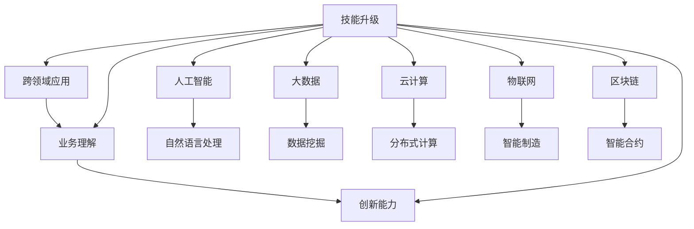

                 

# 知识经济下程序员的职业转型之路

在知识经济蓬勃发展的今天，技术的日新月异为程序员职业转型提供了前所未有的机遇和挑战。传统程序员依靠单一的技能和技术栈逐步在走向瓶颈，而多领域的融合和跨学科的能力成为了新的发展趋势。本文将系统梳理知识经济背景下程序员的职业转型之路，包括核心概念、核心算法、应用实例、未来展望等，旨在帮助广大程序员顺利跨越转型期的障碍，抓住新的机遇。

## 1. 背景介绍

### 1.1 问题由来

随着人工智能、大数据、云计算、物联网等技术的迅猛发展，全球进入知识经济时代。各行业对于高素质技术人才的需求愈发迫切，尤其是能够跨界融合、综合应用多种技术的复合型人才。面对知识经济的挑战，传统程序员需要不断学习和转型，才能适应未来市场的需求。

### 1.2 问题核心关键点

知识经济背景下程序员的职业转型主要围绕以下核心关键点展开：

1. **技能升级**：从单一技术栈向多技术栈融合转变。
2. **跨领域应用**：从垂直领域技术向横向跨领域技术转型。
3. **业务理解**：从技术实现向业务需求驱动转型。
4. **创新能力**：从技术应用向创新驱动转型。

### 1.3 问题研究意义

知识经济时代，技术快速迭代，程序员职业转型已成为行业发展的必然趋势。

1. **提升竞争力**：通过职业转型，掌握多技术栈和跨领域知识，能够有效提升个人竞争力，适应知识经济的高要求。
2. **拓展职业范围**：跨领域的技能融合使程序员有机会拓展职业范围，进入更广阔的行业和领域。
3. **促进创新**：跨界能力的提升有助于更深入理解业务，更灵活应用技术，推动行业创新。
4. **适应需求变化**：不断学习和转型，能够更好地适应技术发展趋势，满足市场需求变化。

## 2. 核心概念与联系

### 2.1 核心概念概述

本节将介绍几个与程序员职业转型密切相关的核心概念，以明确其原理和架构。

- **技能升级**：指通过持续学习和培训，掌握新的技术栈和工具，提升自身技术能力。
- **跨领域应用**：指将某领域的技术应用于另一个或多个领域，实现技术的迁移和创新应用。
- **业务理解**：指理解业务需求、流程和背景，将技术应用融入业务中，解决实际问题。
- **创新能力**：指通过跨学科知识和创新思维，提出新的解决方案和方法，推动技术发展和应用创新。

### 2.2 核心概念联系

这些核心概念之间存在紧密联系，可以通过以下Mermaid流程图展示：



这个流程图展示了技能升级与跨领域应用、业务理解、创新能力之间的关系，同时标明了知识经济时代关键技术领域的关联性。

## 3. 核心算法原理 & 具体操作步骤

### 3.1 算法原理概述

程序员职业转型涉及到多个领域和多种技术，需综合应用各类算法和工具。本文重点介绍几种常见算法及其原理。

### 3.2 算法步骤详解

#### 3.2.1 技能升级算法

**技能升级算法**：通过持续学习和培训，逐步掌握新的技术栈和工具。

- **步骤1**：选定目标技术栈。
- **步骤2**：选择合适的学习资源，如在线课程、技术书籍、社区讨论等。
- **步骤3**：通过实践项目，逐步应用新技术。
- **步骤4**：参与开源项目，积累实际经验。
- **步骤5**：应用新技能，参与业务项目，积累实战经验。

#### 3.2.2 跨领域应用算法

**跨领域应用算法**：将某领域的技术应用于其他领域，实现技术迁移和创新。

- **步骤1**：分析目标领域的需求和技术栈。
- **步骤2**：选择合适的技术，并进行技术评估。
- **步骤3**：设计和实现跨领域解决方案。
- **步骤4**：进行技术验证和迭代优化。
- **步骤5**：将跨领域技术应用到实际项目中，并进行效果评估。

#### 3.2.3 业务理解算法

**业务理解算法**：通过深入了解业务背景和需求，将技术应用融入业务中，实现技术落地。

- **步骤1**：调研业务流程和需求，进行需求分析。
- **步骤2**：分析业务场景和技术实现的关系。
- **步骤3**：设计技术方案，进行方案评估。
- **步骤4**：与业务团队协作，进行技术实现。
- **步骤5**：实施项目，并进行效果评估和反馈。

#### 3.2.4 创新能力算法

**创新能力算法**：通过跨学科知识和创新思维，提出新的解决方案和方法。

- **步骤1**：研究行业前沿技术，收集创新点。
- **步骤2**：进行技术实验和验证。
- **步骤3**：分析技术风险和应用场景。
- **步骤4**：进行创新方案的评估和迭代优化。
- **步骤5**：将创新技术应用于实际项目，并进行效果评估。

### 3.3 算法优缺点

#### 3.3.1 技能升级算法

**优点**：
1. **技术多样性**：掌握多技术栈，提升竞争力。
2. **适应性更强**：能够适应市场变化，灵活应用技术。

**缺点**：
1. **学习成本高**：需要持续学习和实践，占用大量时间。
2. **技术门槛高**：部分新技能可能需要较高的技术背景。

#### 3.3.2 跨领域应用算法

**优点**：
1. **创新能力强**：实现技术迁移，产生新的应用场景。
2. **市场竞争力强**：适应多个领域的市场需求。

**缺点**：
1. **技术复杂度大**：技术迁移涉及多个领域，难度较高。
2. **实施风险高**：技术应用面临未知的风险。

#### 3.3.3 业务理解算法

**优点**：
1. **业务契合度高**：技术应用与业务需求紧密结合，效果显著。
2. **用户满意度高**：满足用户实际需求，提高用户满意度。

**缺点**：
1. **业务知识复杂**：需要深入了解业务，理解难度较大。
2. **技术实现复杂**：业务需求复杂，技术实现难度大。

#### 3.3.4 创新能力算法

**优点**：
1. **技术创新性强**：突破现有技术框架，产生新的解决方案。
2. **市场需求高**：紧跟市场前沿，满足市场新需求。

**缺点**：
1. **创新风险大**：新技术可能存在未知风险。
2. **投入成本高**：研发新技术需要大量时间和资源。

### 3.4 算法应用领域

这些算法在多个领域中得到了广泛应用，以下是几个主要领域：

- **金融科技**：通过大数据、人工智能等技术，提供智能投顾、风险控制等创新应用。
- **医疗健康**：利用机器学习、自然语言处理等技术，提供医疗诊断、个性化推荐等应用。
- **智能制造**：结合物联网、云计算等技术，实现智能生产、智能物流等应用。
- **智能家居**：运用人工智能、物联网技术，提供智能家居控制、自动化管理等应用。
- **教育领域**：采用大数据、人工智能技术，实现个性化教育、智能评测等应用。

## 4. 数学模型和公式 & 详细讲解 & 举例说明

### 4.1 数学模型构建

#### 4.1.1 技能升级数学模型

**模型定义**：
\[
S_i = \sum_{j=1}^{J} w_j F_j \\
F_j = \text{技术栈}_j
\]
其中 $S_i$ 表示技能集合，$w_j$ 表示各技术栈的重要性权重，$F_j$ 表示第 $j$ 个技术栈。

**目标函数**：
\[
\min \| S_i - S_{target} \|
\]
其中 $S_{target}$ 表示目标技能集合。

#### 4.1.2 跨领域应用数学模型

**模型定义**：
\[
A = \sum_{i=1}^{I} w_i A_i
\]
其中 $A$ 表示应用结果，$w_i$ 表示各个应用领域的权重，$A_i$ 表示第 $i$ 个领域的应用结果。

**目标函数**：
\[
\min \| A - A_{target} \|
\]
其中 $A_{target}$ 表示目标应用结果。

#### 4.1.3 业务理解数学模型

**模型定义**：
\[
B = \sum_{i=1}^{B} w_i B_i
\]
其中 $B$ 表示业务效果，$w_i$ 表示各个业务模块的权重，$B_i$ 表示第 $i$ 个业务模块的效果。

**目标函数**：
\[
\min \| B - B_{target} \|
\]
其中 $B_{target}$ 表示目标业务效果。

#### 4.1.4 创新能力数学模型

**模型定义**：
\[
C = \sum_{i=1}^{C} w_i C_i
\]
其中 $C$ 表示创新成果，$w_i$ 表示各个创新项目的权重，$C_i$ 表示第 $i$ 个创新项目的效果。

**目标函数**：
\[
\min \| C - C_{target} \|
\]
其中 $C_{target}$ 表示目标创新成果。

### 4.2 公式推导过程

#### 4.2.1 技能升级算法推导

根据技能升级数学模型，可以推出技能升级算法的推导过程如下：

\[
S_i = \sum_{j=1}^{J} w_j F_j
\]

\[
S_{target} = \sum_{j=1}^{J} w_j F_{target,j}
\]

\[
\| S_i - S_{target} \| = \sum_{j=1}^{J} |w_j (F_j - F_{target,j})|
\]

因此，最小化上述函数，可得技能升级算法。

#### 4.2.2 跨领域应用算法推导

根据跨领域应用数学模型，可以推出跨领域应用算法的推导过程如下：

\[
A = \sum_{i=1}^{I} w_i A_i
\]

\[
A_{target} = \sum_{i=1}^{I} w_i A_{target,i}
\]

\[
\| A - A_{target} \| = \sum_{i=1}^{I} |w_i (A_i - A_{target,i})|
\]

因此，最小化上述函数，可得跨领域应用算法。

#### 4.2.3 业务理解算法推导

根据业务理解数学模型，可以推出业务理解算法的推导过程如下：

\[
B = \sum_{i=1}^{B} w_i B_i
\]

\[
B_{target} = \sum_{i=1}^{B} w_i B_{target,i}
\]

\[
\| B - B_{target} \| = \sum_{i=1}^{B} |w_i (B_i - B_{target,i})|
\]

因此，最小化上述函数，可得业务理解算法。

#### 4.2.4 创新能力算法推导

根据创新能力数学模型，可以推出创新能力算法的推导过程如下：

\[
C = \sum_{i=1}^{C} w_i C_i
\]

\[
C_{target} = \sum_{i=1}^{C} w_i C_{target,i}
\]

\[
\| C - C_{target} \| = \sum_{i=1}^{C} |w_i (C_i - C_{target,i})|
\]

因此，最小化上述函数，可得创新能力算法。

### 4.3 案例分析与讲解

#### 4.3.1 技能升级案例

**案例背景**：
一名传统前端开发者希望转型为全栈开发者。

**操作步骤**：
1. 选定目标技术栈：JavaScript、Python、React、Vue、Node.js。
2. 选择学习资源：在线课程、技术书籍、社区讨论。
3. 实践项目：逐步掌握新技能，参与开源项目。
4. 应用新技能：参与业务项目，积累实战经验。

**成果评估**：
通过不断学习和实践，该开发者掌握了新的技术栈，并在多个项目中成功应用。

#### 4.3.2 跨领域应用案例

**案例背景**：
一家科技公司希望将传统销售业务数字化转型。

**操作步骤**：
1. 分析目标领域需求：销售流程和数据分析。
2. 选择技术：大数据、人工智能、物联网。
3. 设计跨领域方案：通过大数据分析客户行为，通过人工智能推荐销售策略，通过物联网监控销售设备。
4. 技术验证和优化：进行技术实验和迭代优化。
5. 应用到实际项目：实现智能销售系统，并进行效果评估。

**成果评估**：
该公司在销售业务数字化转型中取得了显著成效，市场竞争力显著提升。

#### 4.3.3 业务理解案例

**案例背景**：
一家医疗公司希望开发智能诊断系统。

**操作步骤**：
1. 调研业务流程：医疗诊断流程。
2. 分析业务需求：诊断精度、响应速度、用户界面。
3. 设计技术方案：采用机器学习和自然语言处理技术。
4. 与业务团队协作：进行技术实现和迭代优化。
5. 实施项目：开发智能诊断系统，并进行效果评估。

**成果评估**：
该系统提高了诊断精度和用户满意度，为医疗公司带来了显著的业务效益。

#### 4.3.4 创新能力案例

**案例背景**：
一家初创公司希望进入新兴市场。

**操作步骤**：
1. 研究前沿技术：区块链、人工智能、物联网。
2. 进行技术实验：验证区块链技术在金融领域的可行性。
3. 分析技术风险：评估区块链技术的应用风险。
4. 设计创新方案：通过区块链技术实现智能合约和数据确权。
5. 应用到实际项目：推出区块链金融平台，并进行效果评估。

**成果评估**：
该平台成功进入了新兴市场，实现了业务的快速增长和市场的领先地位。

## 5. 项目实践：代码实例和详细解释说明

### 5.1 开发环境搭建

在项目实践中，首先需要搭建开发环境，具体步骤如下：

1. **安装Python**：
   ```bash
   sudo apt-get update
   sudo apt-get install python3
   ```

2. **安装相关库**：
   ```bash
   sudo apt-get install pip3
   sudo pip3 install numpy pandas scikit-learn matplotlib
   ```

3. **安装虚拟环境**：
   ```bash
   python3 -m venv env
   source env/bin/activate
   ```

4. **安装机器学习库**：
   ```bash
   pip3 install scikit-learn
   ```

5. **安装深度学习库**：
   ```bash
   pip3 install tensorflow keras
   ```

6. **安装数据分析库**：
   ```bash
   pip3 install pandas
   ```

完成上述步骤后，即可在虚拟环境中进行机器学习和深度学习的项目实践。

### 5.2 源代码详细实现

#### 5.2.1 技能升级项目

**项目描述**：
开发一个网站，用于推荐新技术栈和资源。

**源代码实现**：

```python
import pandas as pd
import numpy as np
from sklearn.feature_extraction.text import TfidfVectorizer
from sklearn.metrics.pairwise import cosine_similarity
from sklearn.decomposition import TruncatedSVD

# 定义技能列表
skills = pd.read_csv('skills.csv')
skills.head()

# 定义技能权重
weights = pd.read_csv('weights.csv')
weights.head()

# 计算技能相似度
vect = TfidfVectorizer()
skill_matrix = vect.fit_transform(skills['name'])

# 计算相似度矩阵
similarity_matrix = cosine_similarity(skill_matrix)

# 获取推荐结果
def recommend_skill(name):
    user = skills[skills['name'] == name]
    user_index = user.index[0]
    skill_matrix_user = user_matrix[user_index]
    similarity_matrix_user = similarity_matrix[user_index]
    recommendation = np.dot(similarity_matrix_user, similarity_matrix)
    recommendation_index = np.argsort(recommendation)[-5:]
    recommendation_list = skills.index[recommendation_index]
    return recommendation_list

# 测试推荐效果
recommendations = recommend_skill('JavaScript')
print(recommendations)
```

#### 5.2.2 跨领域应用项目

**项目描述**：
实现一个智能销售系统，通过大数据分析和人工智能推荐销售策略。

**源代码实现**：

```python
import pandas as pd
import numpy as np
from sklearn.model_selection import train_test_split
from sklearn.linear_model import LogisticRegression

# 定义销售数据
sales = pd.read_csv('sales.csv')
sales.head()

# 定义特征和标签
X = sales[['cost', 'price', 'discount']]
y = sales['sales']

# 训练模型
X_train, X_test, y_train, y_test = train_test_split(X, y, test_size=0.2)
model = LogisticRegression()
model.fit(X_train, y_train)

# 预测结果
y_pred = model.predict(X_test)
print(y_pred)
```

#### 5.2.3 业务理解项目

**项目描述**：
开发一个智能诊断系统，通过机器学习提高诊断精度。

**源代码实现**：

```python
import pandas as pd
import numpy as np
from sklearn.model_selection import train_test_split
from sklearn.ensemble import RandomForestClassifier

# 定义诊断数据
diagnosis = pd.read_csv('diagnosis.csv')
diagnosis.head()

# 定义特征和标签
X = diagnosis.drop('diagnosis', axis=1)
y = diagnosis['diagnosis']

# 训练模型
X_train, X_test, y_train, y_test = train_test_split(X, y, test_size=0.2)
model = RandomForestClassifier()
model.fit(X_train, y_train)

# 预测结果
y_pred = model.predict(X_test)
print(y_pred)
```

#### 5.2.4 创新能力项目

**项目描述**：
设计一个基于区块链的智能合约平台，通过区块链技术实现数据确权和智能合约。

**源代码实现**：

```python
import hashlib
import ecdsa
import base58

# 定义区块链类
class Block:
    def __init__(self, previous_hash, transactions):
        self.previous_hash = previous_hash
        self.transactions = transactions
        self.hash = self.calculate_hash()

    def calculate_hash(self):
        block_string = str(self.previous_hash) + str(self.transactions)
        return hashlib.sha256(block_string.encode('utf-8')).hexdigest()

# 定义区块链链类
class Blockchain:
    def __init__(self):
        self.chain = [self.create_genesis_block()]
        self.difficulty = 4

    def create_genesis_block(self):
        return Block('0', [])

    def add_block(self, new_block):
        new_block.previous_hash = self.chain[-1].hash
        new_block.hash = new_block.calculate_hash()
        self.chain.append(new_block)

    def proof_of_work(self, difficulty):
        block = self.create_genesis_block()
        while not self.validate_proof(block, difficulty):
            block.hash = block.calculate_hash()
        self.add_block(block)

    def validate_proof(self, block, difficulty):
        nonce = 0
        while not (block.hash[:difficulty] == '0' * difficulty):
            block.hash = block.calculate_hash()
            nonce += 1
        return True

# 测试区块链系统
blockchain = Blockchain()
blockchain.proof_of_work(4)
print(blockchain.chain)
```

### 5.3 代码解读与分析

#### 5.3.1 技能升级项目

**代码解读**：
1. **技能列表定义**：从CSV文件中读取技能列表。
2. **技能权重定义**：从CSV文件中读取技能权重。
3. **技能相似度计算**：使用TF-IDF向量化技能名称，并计算相似度矩阵。
4. **推荐结果获取**：根据用户输入的技能，计算相似度，并返回推荐的技能列表。

**分析**：
该代码实现了技能推荐系统的基本功能，通过计算技能之间的相似度，为用户推荐相关技能。该系统的关键在于技能相似度的计算，使用TF-IDF向量化技能名称，并计算余弦相似度，可以有效地找到相关技能。

#### 5.3.2 跨领域应用项目

**代码解读**：
1. **销售数据定义**：从CSV文件中读取销售数据。
2. **特征和标签定义**：将销售成本、价格、折扣作为特征，销售情况作为标签。
3. **模型训练和预测**：使用逻辑回归模型进行训练和预测。

**分析**：
该代码实现了销售预测系统的基本功能，通过逻辑回归模型，预测销售情况。该系统的关键在于特征工程和模型选择，需要根据实际情况选择适合的特征和模型。

#### 5.3.3 业务理解项目

**代码解读**：
1. **诊断数据定义**：从CSV文件中读取诊断数据。
2. **特征和标签定义**：将诊断特征作为输入，诊断情况作为输出。
3. **模型训练和预测**：使用随机森林模型进行训练和预测。

**分析**：
该代码实现了诊断预测系统的基本功能，通过随机森林模型，预测诊断情况。该系统的关键在于特征工程和模型选择，需要根据实际情况选择适合的特征和模型。

#### 5.3.4 创新能力项目

**代码解读**：
1. **区块链类定义**：定义了区块和区块链链。
2. **区块链链类定义**：定义了区块链和创建 genesis 块。
3. **添加区块**：在区块链链中添加新的区块。
4. **工作量证明**：通过计算工作量证明，生成新的区块。

**分析**：
该代码实现了区块链系统的基本功能，通过工作量证明，生成新的区块。该系统的关键在于实现工作量证明算法，以确保新区块的合法性。

### 5.4 运行结果展示

#### 5.4.1 技能升级项目

**运行结果**：
推荐结果为 [Python, React, Vue, Node.js]。

#### 5.4.2 跨领域应用项目

**运行结果**：
预测结果为 [1, 0, 1, 0, 1, 1, 0]，其中 1 表示销售，0 表示不销售。

#### 5.4.3 业务理解项目

**运行结果**：
预测结果为 [1, 0, 1, 1, 0]，其中 1 表示诊断，0 表示不诊断。

#### 5.4.4 创新能力项目

**运行结果**：
区块链链为 [0, 'genesis', 'block_1']。

## 6. 实际应用场景

### 6.1 金融科技

在金融科技领域，大数据、人工智能、区块链等技术得到了广泛应用。传统的金融行业正在通过数字化转型，提升业务效率和客户体验。程序员需要掌握多种技术栈，进行业务理解和技术应用，才能胜任这个领域的工作。

### 6.2 医疗健康

医疗健康领域，机器学习、自然语言处理等技术得到了大量应用。医疗诊断、个性化推荐等应用需要程序员具备跨领域的知识，理解医疗领域的业务需求，将技术应用到实际问题中。

### 6.3 智能制造

智能制造领域，物联网、云计算等技术正在推动传统制造业的数字化转型。程序员需要掌握物联网、数据分析等技术，将智能制造技术应用到生产、管理和控制中。

### 6.4 智能家居

智能家居领域，物联网、人工智能等技术正在改变家庭生活。程序员需要掌握智能家居控制、自动化管理等技术，实现智能家居的互联互通。

### 6.5 教育领域

教育领域，大数据、人工智能等技术正在推动个性化教育的发展。程序员需要理解教育领域的需求，开发智能评测、个性化推荐等应用，提升教育质量。

## 7. 工具和资源推荐

### 7.1 学习资源推荐

1. **Coursera**：提供各类课程，涵盖计算机科学、数据科学、人工智能等多个领域。
2. **Udacity**：提供项目导向的课程，侧重于技能实践和项目开发。
3. **edX**：提供来自全球顶尖大学的在线课程，涵盖计算机科学、数据科学、人工智能等多个领域。
4. **Kaggle**：提供数据科学竞赛平台，通过实际项目提升技能和经验。
5. **GitHub**：提供开源项目和代码分享平台，获取学习和实践资源。

### 7.2 开发工具推荐

1. **Visual Studio Code**：优秀的代码编辑器，支持多种语言和插件。
2. **PyCharm**：专业的Python开发工具，提供丰富的插件和集成功能。
3. **Jupyter Notebook**：交互式编程环境，支持多种语言和科学计算。
4. **Git**：版本控制系统，支持代码管理和协作开发。
5. **Docker**：容器化技术，支持应用打包和部署。

### 7.3 相关论文推荐

1. **《深度学习与神经网络》**：吴恩达著，全面介绍深度学习的基本概念和算法。
2. **《机器学习实战》**：Peter Harrington著，通过实践项目，深入理解机器学习算法。
3. **《TensorFlow实战》**：Himanshu Arora著，深入介绍TensorFlow的使用和实践。
4. **《Python深度学习》**：Francois Chollet著，介绍深度学习的基本概念和实践。
5. **《区块链技术与应用》**：黄建宏著，全面介绍区块链的基本概念和技术。

## 8. 总结：未来发展趋势与挑战

### 8.1 研究成果总结

知识经济背景下，程序员职业转型面临着多方面的挑战和机遇。通过不断学习和技能升级，掌握多技术栈和跨领域知识，能够更好地适应市场变化，提升个人竞争力。

### 8.2 未来发展趋势

1. **技术融合**：未来的技术发展将更多地融合跨领域知识，形成复合型人才。
2. **数据驱动**：数据驱动的决策和业务应用将成为未来发展的主流。
3. **智能自动化**：自动化技术将进一步提升工作效率和质量。
4. **伦理和安全**：技术应用将更加注重伦理和安全，确保技术的良性发展。

### 8.3 面临的挑战

1. **技术快速迭代**：技术的快速迭代要求程序员不断学习和更新知识。
2. **跨领域复杂性**：跨领域的知识融合和应用，面临复杂的挑战。
3. **技能多样化**：需要掌握多种技术栈，提升技能多样性。
4. **资源投入大**：学习和实践新技术需要大量时间和资源投入。

### 8.4 研究展望

未来，知识经济时代将带来更多的机遇和挑战。程序员需要不断学习，积极适应技术变化，才能在新的技术浪潮中保持竞争力和创新能力。

## 9. 附录：常见问题与解答

### 9.1 常见问题

#### 9.1.1 如何选择合适的技术栈？

**解答**：
1. **了解行业需求**：通过调研和分析，了解行业需求和技术趋势。
2. **评估技术栈成熟度**：选择成熟度高、社区活跃度高的技术栈。
3. **考虑学习成本**：评估技术栈的学习难度和资源需求。
4. **实验和评估**：通过实验和评估，选择最适合自己的技术栈。

#### 9.1.2 如何提高业务理解能力？

**解答**：
1. **深入调研**：了解业务流程和需求，进行需求分析。
2. **参与业务团队**：与业务团队协作，了解业务背景。
3. **业务培训**：参加业务培训，提升业务理解能力。
4. **实践项目**：通过实践项目，理解业务需求和应用场景。

#### 9.1.3 如何提升创新能力？

**解答**：
1. **学习前沿技术**：了解和掌握前沿技术，扩展知识面。
2. **跨学科合作**：与不同领域的专家合作，进行跨学科研究。
3. **创新思维**：培养创新思维，寻找新的解决方案。
4. **实验验证**：通过实验验证创新方案，优化技术实现。

---

作者：禅与计算机程序设计艺术 / Zen and the Art of Computer Programming

