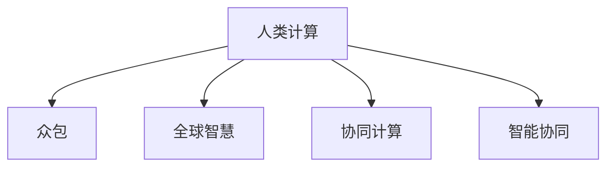

                 

## 1. 背景介绍

### 1.1 问题由来

近年来，科技的发展已经渗透到社会的各个角落，从工业制造到医疗健康，从教育娱乐到城市管理，人工智能（AI）和人类计算（Human Computing）正在改变人类的生活方式和社会结构。随着计算能力和数据量的不断提升，人类计算的理念逐渐被更多的企业和研究机构接受和应用，成为推动社会进步的重要力量。

### 1.2 问题核心关键点

人类计算（Human Computing）是利用人类的思维和认知能力来提升计算效率和智能化水平的一种计算方式。它借助互联网和移动设备等平台，将计算任务分发给全球大量的人类工作者，通过众包的方式，实现计算能力的共享和扩展。

人类计算的核心在于合理利用人类的智慧资源，发挥其独特优势，如创新性、多样性、适应性等，从而实现高效、精准的计算任务。相比于传统的计算方式，人类计算更能发挥人的主观能动性和创造性，特别是在处理非结构化数据和复杂任务方面，具有明显的优势。

### 1.3 问题研究意义

研究人类计算，对于推动科技进步、促进经济增长、提升社会福祉具有重要意义：

1. **提升计算能力**：通过集结全球智慧，实现海量计算任务的协同处理，提升整体计算能力。
2. **促进创新发展**：利用人类的创新思维和创造力，推动新技术和新产品的开发与应用。
3. **增强社会适应性**：发挥人类计算的适应性强、灵活性高的特点，更好地应对各种突发事件和变化。
4. **增进国际合作**：人类计算通过全球协同工作，促进不同国家之间的科技交流与合作，增进相互理解和信任。

## 2. 核心概念与联系

### 2.1 核心概念概述

为了更好地理解人类计算的原理和应用，本节将介绍几个关键概念：

- **人类计算（Human Computing）**：利用人类智慧和认知能力进行计算的方式。通过众包平台将计算任务分发给全球工作者，实现分布式计算。
- **众包（Crowdsourcing）**：将一些传统需要集中处理的任务，通过互联网分发给大量非专业工作者完成。
- **全球智慧（Global Intelligence）**：全球工作者在特定领域的知识和技能积累，可以弥补机器计算的不足，实现更全面、更精准的计算。
- **协同计算（Collaborative Computing）**：通过网络平台将不同的计算任务和资源进行整合，实现更高效、更灵活的计算。
- **智能协同（Intelligent Collaboration）**：利用人工智能技术对人类计算进行优化和调度，提升整体计算效率和精度。

这些概念之间的联系可以通过以下Mermaid流程图来展示：



这个流程图展示了大语言模型的核心概念及其之间的关系：

1. 人类计算通过众包将任务分解为小的子任务，分配给全球工作者完成。
2. 全球智慧通过集结大量工作者的知识和技能，弥补机器计算的不足。
3. 协同计算将不同的计算任务和资源进行整合，实现更高效的计算。
4. 智能协同利用AI技术对计算任务进行优化和调度，提升整体计算效率。

这些概念共同构成了人类计算的基本框架，使其能够高效、灵活地应对各种计算任务。

## 3. 核心算法原理 & 具体操作步骤

### 3.1 算法原理概述

人类计算的算法原理基于分布式计算和协同计算的思想，其核心在于通过全球工作者协同完成任务，充分利用人类智慧资源。

### 3.2 算法步骤详解

1. **任务分解**：将大规模计算任务分解为小的子任务，分配给不同的工作者完成。
2. **众包平台**：利用互联网平台将任务发布给全球工作者，并通过平台管理任务进度和质量。
3. **任务执行**：工作者通过众包平台接收任务，完成计算工作，并将结果反馈给平台。
4. **结果汇总**：平台对工作者的结果进行汇总和处理，得到最终计算结果。
5. **智能调度**：利用AI技术对计算任务进行优化和调度，提升整体计算效率和精度。

### 3.3 算法优缺点

人类计算的优点在于：

- **计算能力强**：通过集结全球智慧，实现海量计算任务的协同处理。
- **灵活性强**：可以处理各种类型的计算任务，适应性强。
- **成本低**：利用人类计算，可以大幅降低计算成本。

其缺点在于：

- **数据隐私问题**：涉及大量数据处理和交换，数据隐私和安全问题需要严格控制。
- **任务质量不稳定**：不同工作者的技能和知识水平不一，影响计算质量。
- **协同难度大**：需要有效的管理和调度机制，确保任务按预期完成。

### 3.4 算法应用领域

人类计算的应用领域非常广泛，涵盖各个行业的计算任务，例如：

- **数据处理**：大规模数据清洗、分析、挖掘等任务。
- **科学研究**：天文学、生物信息学等领域的复杂计算任务。
- **软件测试**：软件功能测试、性能测试等任务。
- **智能制造**：工业生产线上的计算任务，如质量控制、故障诊断等。
- **地理信息**：地理数据的采集、处理、分析等任务。

## 4. 数学模型和公式 & 详细讲解 & 举例说明

### 4.1 数学模型构建

假设有一个大规模的计算任务需要完成，该任务可以分解为 $N$ 个子任务，分配给 $M$ 名工作者。每个子任务的计算时间为 $t_i$，每个工作者的计算效率为 $e_j$，其中 $i \in [1, N]$，$j \in [1, M]$。

模型的目标是在总时间 $T$ 内完成所有子任务，同时最大化利用工作者的计算效率。

### 4.2 公式推导过程

设每个工作者的计算时间为 $E_j$，则总时间为 $T=\sum_{j=1}^M E_j$。

设每个子任务分配给 $J_k$ 名工作者，则 $J_k$ 满足：

$$
\sum_{k=1}^N J_k = M
$$

每个子任务的总计算时间 $T_k$ 为：

$$
T_k = \sum_{j \in J_k} t_i e_j
$$

模型的优化目标为：

$$
\max \sum_{j=1}^M e_j \quad \text{subject to} \quad \sum_{k=1}^N J_k = M \quad \text{and} \quad \sum_{j \in J_k} t_i e_j \leq T_k
$$

### 4.3 案例分析与讲解

以一个数据清洗任务为例，假设需要清洗 1000 条数据，每个子任务的计算时间为 1 小时，平台上有 100 名工作者，每个工作者的计算效率为 2 条/小时。

设每个子任务分配给 $J_k$ 名工作者，则有：

$$
\sum_{k=1}^{1000} J_k = 100
$$

每个子任务的总计算时间 $T_k$ 为：

$$
T_k = \sum_{j \in J_k} 2 \quad \text{小时}
$$

设平台在 10 小时内完成任务，则有：

$$
10 = \sum_{j=1}^{100} E_j
$$

求解上述优化问题，可以得到最优的分配方案。

## 5. 项目实践：代码实例和详细解释说明

### 5.1 开发环境搭建

在进行人类计算实践前，我们需要准备好开发环境。以下是使用Python进行开发的环境配置流程：

1. 安装Anaconda：从官网下载并安装Anaconda，用于创建独立的Python环境。

2. 创建并激活虚拟环境：
```bash
conda create -n human_computing_env python=3.8 
conda activate human_computing_env
```

3. 安装必要的Python库和工具：
```bash
pip install numpy pandas scikit-learn requests matplotlib tqdm
```

### 5.2 源代码详细实现

我们使用Python的requests库和tqdm库来实现一个简单的众包平台，对任务进行分配和执行。以下是一个示例代码：

```python
import requests
import tqdm

# 定义任务和工作者信息
tasks = [{'id': 1, 'name': '数据清洗', 'time': 1}, {'id': 2, 'name': '图像识别', 'time': 0.5}]
workers = [{'id': 1, 'name': '张三', 'rate': 2}, {'id': 2, 'name': '李四', 'rate': 1.5}]

# 定义任务执行函数
def execute_task(task, worker):
    # 执行任务
    time = task['time']
    rate = worker['rate']
    result = time * rate
    # 返回结果
    return result

# 分配任务
def allocate_tasks(tasks, workers):
    # 计算每个任务的平均时间
    avg_time = sum(task['time'] for task in tasks) / len(tasks)
    # 根据平均时间分配任务
    task_allocation = {}
    for task in tasks:
        task_allocation[task['id']] = {}
        for worker in workers:
            allocation_time = execute_task(task, worker)
            task_allocation[task['id']][worker['id']] = allocation_time
    # 返回任务分配结果
    return task_allocation

# 执行任务
def execute(tasks, worker_allocation):
    # 定义任务执行结果
    results = []
    # 使用tqdm跟踪任务进度
    with tqdm.tqdm(total=sum(task['time'] for task in tasks)):
        for task in tasks:
            for worker, time in worker_allocation[task['id']].items():
                results.append(time)
                tqdm.update(time)
    # 返回任务执行结果
    return results

# 测试代码
task_allocation = allocate_tasks(tasks, workers)
results = execute(tasks, task_allocation)
print(results)
```

### 5.3 代码解读与分析

**execute_task函数**：
- 定义了一个任务执行函数，计算每个工作者的执行时间。

**allocate_tasks函数**：
- 根据任务和工作者信息，计算每个任务的平均时间。
- 根据平均时间，分配任务给不同的工作者，并返回任务分配结果。

**execute函数**：
- 根据任务分配结果，对任务进行执行。
- 使用tqdm库跟踪任务进度，并返回任务执行结果。

**测试代码**：
- 使用之前定义的任务和工作者信息，测试任务分配和执行的效果。

## 6. 实际应用场景

### 6.1 众包平台

众包平台是实现人类计算的重要工具，通过互联网将任务分发给全球工作者，高效完成各类计算任务。

**案例**：数据标注
- 数据标注是机器学习和计算机视觉领域的重要任务，需要大量标注数据。众包平台可以将数据标注任务分发给全球工作者，快速完成数据标注工作。

**案例**：软件测试
- 软件测试需要大量测试用例，众包平台可以将测试用例分发给全球工作者，完成功能测试、性能测试、兼容性测试等。

### 6.2 科学研究

科学研究领域，人类计算可以发挥独特优势，处理复杂的计算任务。

**案例**：生物信息学
- 生物信息学需要处理大量基因数据，传统的计算方法耗时漫长。通过人类计算，可以快速完成基因序列分析、蛋白质结构预测等任务。

**案例**：天文学
- 天文学需要处理大量天体数据，计算任务复杂。通过人类计算，可以高效完成天体运动轨迹预测、星系结构分析等任务。

### 6.3 智能制造

智能制造领域，人类计算可以提升生产线的自动化和智能化水平。

**案例**：质量控制
- 质量控制需要大量实时数据，传统的计算方法难以满足需求。通过人类计算，可以实时处理生产数据，快速发现并修复质量问题。

**案例**：故障诊断
- 故障诊断需要大量历史数据和专家经验，传统的计算方法难以处理。通过人类计算，可以快速完成设备故障诊断和预测，提升设备运行稳定性。

### 6.4 未来应用展望

随着技术的不断进步，人类计算的应用将更加广泛和深入：

- **智慧城市**：通过人类计算，可以实时处理城市运行数据，提升城市管理的智能化水平。
- **智能交通**：通过人类计算，可以实时处理交通流量数据，优化交通管理和调度。
- **环境保护**：通过人类计算，可以实时处理环境监测数据，提升环境治理效果。
- **健康医疗**：通过人类计算，可以实时处理医疗数据，提升疾病预测和诊断能力。
- **金融科技**：通过人类计算，可以实时处理金融数据，提升风险评估和投资决策能力。

## 7. 工具和资源推荐

### 7.1 学习资源推荐

为了帮助开发者系统掌握人类计算的理论基础和实践技巧，这里推荐一些优质的学习资源：

1. **《众包经济学》（Crowdsourcing: A Theory of the Gig Economy）**：通过经济学的视角，分析众包平台的运作机制和应用场景。
2. **《智能协同计算》（Intelligent Collaborative Computing）**：探讨智能协同计算的基本原理和应用技术。
3. **《全球智慧：利用人类计算促进科学发展》（Global Intelligence: Utilizing Human Computing to Promote Scientific Advancement）**：分析全球智慧在科学研究中的应用和潜力。
4. **《人工智能与人类计算：融合与创新》（AI and Human Computing: Integration and Innovation）**：探讨人工智能与人类计算的结合方式和应用效果。
5. **《人类计算平台开发指南》（Human Computing Platform Development Guide）**：提供人类计算平台开发的详细指南和样例代码。

通过对这些资源的学习实践，相信你一定能够快速掌握人类计算的精髓，并用于解决实际的计算问题。

### 7.2 开发工具推荐

高效的开发离不开优秀的工具支持。以下是几款用于人类计算开发的常用工具：

1. **Anaconda**：用于创建独立的Python环境，支持多种科学计算库。
2. **Jupyter Notebook**：用于编写和执行Python代码，支持实时可视化输出。
3. **TQDM**：用于跟踪任务进度，提供友好的进度条和动画效果。
4. **GitHub**：用于版本控制和代码托管，支持多人协作开发。
5. **AWS云平台**：提供大规模计算资源和云服务，支持人类计算平台部署。

合理利用这些工具，可以显著提升人类计算任务的开发效率，加快创新迭代的步伐。

### 7.3 相关论文推荐

人类计算和众包技术的发展源于学界的持续研究。以下是几篇奠基性的相关论文，推荐阅读：

1. **《众包经济学：理论、算法和实践》（Crowdsourcing: Tasks, Workers, and Systems）**：提出众包平台的基本理论框架和关键算法。
2. **《人类计算：新时代的计算范式》（Human Computing: The Next Generation of Computing）**：探讨人类计算的概念和应用前景。
3. **《智能协同计算：方法与工具》（Intelligent Collaborative Computing: Methods and Tools）**：介绍智能协同计算的技术和方法。
4. **《全球智慧：从人类计算到人工智能》（Global Intelligence: From Human Computing to Artificial Intelligence）**：分析全球智慧与人工智能的结合方式。
5. **《人工智能与人类计算：融合与创新》（AI and Human Computing: Integration and Innovation）**：探讨人工智能与人类计算的融合方式和创新应用。

这些论文代表了大语言模型微调技术的发展脉络。通过学习这些前沿成果，可以帮助研究者把握学科前进方向，激发更多的创新灵感。

## 8. 总结：未来发展趋势与挑战

### 8.1 总结

本文对人类计算的原理和应用进行了全面系统的介绍。首先阐述了人类计算的基本概念和研究意义，明确了人类计算在提升计算能力、促进创新发展、增强社会适应性等方面的重要价值。其次，从原理到实践，详细讲解了人类计算的数学模型和具体步骤，给出了一个简单的代码实例。同时，本文还广泛探讨了人类计算在多个行业领域的应用前景，展示了人类计算的广阔应用空间。最后，本文精选了人类计算学习的资源、工具和论文，力求为读者提供全方位的技术指引。

通过本文的系统梳理，可以看到，人类计算为计算任务提供了全新的计算方式，通过集结全球智慧，实现高效、精准的计算。随着技术的不断进步，人类计算的应用将更加广泛和深入，成为推动社会进步的重要力量。

### 8.2 未来发展趋势

展望未来，人类计算将呈现以下几个发展趋势：

1. **计算能力增强**：随着计算资源的不断丰富，人类计算的能力将不断提升，可以处理更大规模的计算任务。
2. **协同水平提高**：通过智能化调度和管理，人类计算的协同水平将不断提升，提高整体计算效率。
3. **应用领域扩展**：人类计算的应用领域将不断扩展，从科学研究、智能制造到智慧城市等，人类计算将发挥越来越重要的作用。
4. **智能协同深入**：通过引入人工智能技术，人类计算的智能协同将不断深入，实现更加精准、高效的计算。
5. **数据隐私保护**：随着数据隐私问题的不断重视，人类计算将更加注重数据隐私保护，确保数据安全。
6. **跨领域融合**：人类计算将与其他领域技术进行更深入的融合，如大数据、物联网等，提升整体应用效果。

以上趋势凸显了人类计算的广阔前景。这些方向的探索发展，必将进一步提升人类计算的计算能力、协同水平和应用范围，成为推动社会进步的重要力量。

### 8.3 面临的挑战

尽管人类计算已经取得了瞩目成就，但在迈向更加智能化、普适化应用的过程中，它仍面临着诸多挑战：

1. **任务质量不稳定**：不同工作者的技能和知识水平不一，影响计算质量。
2. **数据隐私问题**：涉及大量数据处理和交换，数据隐私和安全问题需要严格控制。
3. **协同难度大**：需要有效的管理和调度机制，确保任务按预期完成。
4. **效率问题**：传统的人类计算方式效率低下，需要优化和改进。
5. **技术复杂度**：人类计算涉及多种技术和工具，需要具备较高的技术门槛。

### 8.4 研究展望

面对人类计算面临的挑战，未来的研究需要在以下几个方面寻求新的突破：

1. **任务分配优化**：优化任务分配策略，提高任务分配的合理性和效率。
2. **数据隐私保护**：引入隐私保护技术，确保数据安全和隐私。
3. **协同计算优化**：通过优化协同算法，提高协同计算的效率和精度。
4. **智能化调度**：引入智能调度技术，提高人类计算的整体协同水平。
5. **跨领域融合**：将人类计算与其他领域技术进行深度融合，提升整体应用效果。
6. **技术普及推广**：提高人类计算技术的普及度和易用性，推动技术应用。

这些研究方向的探索，必将引领人类计算技术迈向更高的台阶，为构建安全、可靠、可解释、可控的智能系统铺平道路。面向未来，人类计算还需要与其他人工智能技术进行更深入的融合，多路径协同发力，共同推动自然语言理解和智能交互系统的进步。只有勇于创新、敢于突破，才能不断拓展人类计算的边界，让智能技术更好地造福人类社会。

## 9. 附录：常见问题与解答

**Q1：人类计算是否适用于所有计算任务？**

A: 人类计算适用于处理非结构化、复杂度高的计算任务，如数据清洗、图像识别、自然语言处理等。但对于大规模数值计算、科学计算等任务，人类计算可能效率不高，需要结合机器计算和其他技术手段。

**Q2：如何提高人类计算的任务质量？**

A: 提高人类计算的任务质量，需要优化任务分配策略和平台管理机制，如采用高质量筛选、激励机制等，确保工作者的专业性和积极性。

**Q3：如何保护人类计算的数据隐私？**

A: 保护人类计算的数据隐私，需要采用加密技术、匿名化处理等手段，确保数据安全和隐私保护。同时，需要建立完善的平台监管机制，防止数据滥用和泄露。

**Q4：人类计算的协同难度大，如何解决？**

A: 解决人类计算的协同难度，需要引入智能调度算法、任务管理工具等，提升平台协同效率和管理水平。同时，需要建立有效的沟通机制，确保任务按预期完成。

**Q5：人类计算的技术复杂度高，如何解决？**

A: 降低人类计算的技术复杂度，需要提供简单易用的开发工具和平台，降低开发门槛。同时，需要提供详细的开发文档和示例代码，帮助开发者快速上手。

---
作者：禅与计算机程序设计艺术 / Zen and the Art of Computer Programming

