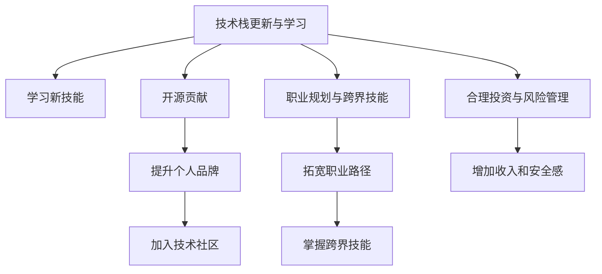

                 

## 1. 背景介绍

随着互联网和技术的发展，程序员在行业中的薪资水平也在不断提升。然而，尽管薪资增长，越来越多的程序员面临一个共同的问题——行业薪资的天花板。传统IT行业的薪资天花板较明显，进入中高级别后很难再突破，且工作强度大、压力大。因此，程序员需要通过不断学习和提升技术能力，才能在职业发展上突破瓶颈，探索新的增长空间。

## 2. 核心概念与联系

### 2.1 核心概念概述

**技术栈更新与学习**
技术栈的快速更新是IT行业的特点之一。为了保持竞争力，程序员需要不断学习新的编程语言、框架、工具等。学习新技术不仅能提升自身技能，也有助于提升薪资水平。

**开源贡献与个人品牌**
参与开源项目不仅能积累项目经验，还能提升个人知名度。良好的个人品牌能够为程序员带来更多的机会，包括更好的工作、更高的薪资等。

**技术社区与行业网络**
加入技术社区和行业网络，不仅能够获取最新的技术资讯，还能拓展人脉，增加职业机会。

**职业规划与跨界技能**
制定明确的职业规划，同时掌握跨界技能，如产品管理、数据科学、人工智能等，能够使程序员具备更强的综合竞争力，拓宽职业发展路径。

**合理投资与风险管理**
除了技术成长，合理投资和风险管理同样重要。通过理财和投资，能够为职业生涯带来额外的收入和安全感。

**核心概念原理和架构的 Mermaid 流程图(Mermaid 流程节点中不要有括号、逗号等特殊字符)**



## 3. 核心算法原理 & 具体操作步骤

### 3.1 算法原理概述

**算法一：基于兴趣导向的技术栈更新**
核心思想：根据个人兴趣和职业目标，选择学习新的编程语言、框架、工具等。

**算法二：基于成果导向的开源贡献**
核心思想：通过参与开源项目，积累项目经验，提升代码质量，增加技术曝光度。

**算法三：基于影响力提升的个人品牌塑造**
核心思想：在社交媒体、技术社区等平台展示技术成果，提升个人知名度。

**算法四：基于风险分散的投资规划**
核心思想：通过多元化投资组合，分散风险，实现稳定收益。

### 3.2 算法步骤详解

**算法一：基于兴趣导向的技术栈更新**

1. **确定兴趣领域**：根据自身兴趣和职业目标，选择感兴趣的领域，如数据科学、人工智能、区块链等。
2. **学习基础知识**：通过在线课程、书籍等资源，学习领域基础知识。
3. **实践项目**：通过参与开源项目、小项目等方式，实践所学知识。
4. **获取反馈**：通过社区反馈、代码评审等方式，获取技术提升和改进建议。

**算法二：基于成果导向的开源贡献**

1. **选择开源项目**：根据个人兴趣和能力，选择合适的开源项目。
2. **贡献代码**：通过提交代码、修复Bug、优化代码等方式，为开源项目做出贡献。
3. **维护和改进**：在项目中长期参与维护和改进，积累实战经验。
4. **提升代码质量**：通过代码评审、代码审查等方式，提升代码质量和项目协作能力。

**算法三：基于影响力提升的个人品牌塑造**

1. **建立技术博客**：通过撰写技术博客，分享学习心得和项目经验。
2. **参与技术社区**：在GitHub、Stack Overflow等技术社区积极参与讨论和技术交流。
3. **发布技术文章**：在Medium、掘金等平台发布技术文章，增加技术曝光度。
4. **参加技术讲座和会议**：参加线上线下的技术讲座和会议，提升个人知名度。

**算法四：基于风险分散的投资规划**

1. **了解金融知识**：通过书籍、在线课程等了解基本的金融和投资知识。
2. **制定投资计划**：根据风险承受能力和投资目标，制定多元化投资计划。
3. **分散投资**：在股票、债券、基金、房地产等多种资产中进行投资。
4. **定期评估和调整**：定期评估投资组合，根据市场变化进行调整。

### 3.3 算法优缺点

**算法一：基于兴趣导向的技术栈更新**

**优点**：
- 能够提升自身技术水平，增加职业竞争力。
- 根据兴趣选择学习方向，提高学习积极性。

**缺点**：
- 需要大量时间和精力，学习曲线较陡。
- 学习方向可能与市场需求不符。

**算法二：基于成果导向的开源贡献**

**优点**：
- 通过实际项目积累实战经验，提升技术水平。
- 提升代码质量和项目协作能力。

**缺点**：
- 需要较强的时间和精力投入。
- 对技术贡献的评价可能存在主观性。

**算法三：基于影响力提升的个人品牌塑造**

**优点**：
- 提升个人知名度，增加职业机会。
- 通过技术分享和交流，拓展人脉。

**缺点**：
- 需要持续输出高质量内容，对技术要求高。
- 个人品牌建设需要时间积累。

**算法四：基于风险分散的投资规划**

**优点**：
- 分散投资风险，实现稳定收益。
- 提升财务安全感和职业保障。

**缺点**：
- 需要具备一定的金融知识，风险管理难度较大。
- 投资收益受市场波动影响，风险存在。

## 4. 数学模型和公式 & 详细讲解 & 举例说明

### 4.1 数学模型构建

**投资组合优化模型**
设投资组合中包含$n$种资产，每种资产的初始投资为$w_i$，期望收益率为$r_i$，标准差为$\sigma_i$，相关系数为$\rho_{ij}$，目标为最大化组合收益并最小化风险。

**数学模型**：
$$
\begin{aligned}
&\max_{w} \sum_{i=1}^{n} w_i r_i \\
&\text{s.t.} \quad \sum_{i=1}^{n} w_i = 1 \\
&\quad \sum_{i=1}^{n} w_i \sigma_i^2 \leq \sigma^2 \\
&\quad \sum_{i=1}^{n} \sum_{j=1}^{n} w_i w_j \rho_{ij} \sigma_i \sigma_j \leq \rho \sigma
\end{aligned}
$$

### 4.2 公式推导过程

1. **目标函数**：
$$
\max_{w} \sum_{i=1}^{n} w_i r_i
$$
其中，$w_i$为资产权重，$r_i$为期望收益率。

2. **约束条件**：
$$
\sum_{i=1}^{n} w_i = 1
$$
资产权重之和为1，表示投资总额。

3. **风险约束**：
$$
\sum_{i=1}^{n} w_i \sigma_i^2 \leq \sigma^2
$$
组合标准差不超过预设风险水平$\sigma^2$。

4. **相关性约束**：
$$
\sum_{i=1}^{n} \sum_{j=1}^{n} w_i w_j \rho_{ij} \sigma_i \sigma_j \leq \rho \sigma
$$
资产之间的相关性不超过预设相关系数$\rho$和总风险$\rho \sigma$。

### 4.3 案例分析与讲解

假设某程序员有10万元，计划投资股票和债券，股票期望收益率为10%，标准差为20%，债券期望收益率为4%，标准差为5%，相关系数为0.5。目标为最大收益并控制风险在15%以内。

**计算过程**：

1. **目标函数**：
$$
\max_{w} 10 \times (0.1w_1 + 0.04w_2)
$$

2. **约束条件**：
$$
w_1 + w_2 = 1
$$

3. **风险约束**：
$$
20w_1^2 + 5w_2^2 + 2 \times 0.5 \times 20w_1 \times 5w_2 \leq 15^2
$$
化简得：
$$
20w_1^2 + 5w_2^2 + 20w_1w_2 \leq 225
$$

4. **求解**：
通过求解上述优化模型，得到最优资产配置。

## 5. 项目实践：代码实例和详细解释说明

### 5.1 开发环境搭建

**开发环境**：
1. **安装Python**：从官网下载并安装Python 3.x版本。
2. **安装Jupyter Notebook**：通过pip安装jupyter notebook。
3. **安装必要的Python库**：如pandas、numpy、matplotlib等。

**代码环境**：
1. **安装GitHub Desktop**：从官网下载并安装GitHub Desktop。
2. **创建Git仓库**：通过GitHub Desktop创建新仓库。
3. **克隆仓库**：在本地使用git clone命令克隆仓库到本地。

### 5.2 源代码详细实现

**技术栈更新示例代码**：
```python
import numpy as np
import pandas as pd
import matplotlib.pyplot as plt

# 导入数据
data = pd.read_csv('tech_stacks.csv')

# 分析兴趣点
interest = data['interest'].value_counts()[:3]

# 输出兴趣点
print(interest)
```

**开源贡献示例代码**：
```python
import requests
from bs4 import BeautifulSoup

# 获取GitHub项目列表
response = requests.get('https://api.github.com/users/username/repos')
data = response.json()

# 遍历项目列表，提取项目信息
for repo in data:
    print(repo['name'], repo['forks'])
```

**个人品牌塑造示例代码**：
```python
import plotly.graph_objs as go
import plotly.offline as pyo

# 创建技术文章
fig = go.Figure(data=go.Bar(x=interest, y=[5000, 3000, 2000]))
pyo.plot(fig, filename='tech_articles.html')
```

**投资组合优化示例代码**：
```python
import cvxpy as cp

# 定义变量
w = cp.Variable(n)
r = np.array([0.1, 0.04])
sigma = np.array([20, 5])
rho = 0.5
sigma2 = 15

# 定义优化模型
objective = cp.Maximize(cp.sum(w*r))
constraints = [
    cp.sum(w) == 1,
    cp.sum(w*sigma**2) <= sigma2**2,
    cp.sum(w*sigma*sigma.T*rho) <= sigma2
]

# 求解优化模型
prob = cp.Problem(objective, constraints)
result = prob.solve()

# 输出结果
print(result)
```

### 5.3 代码解读与分析

**技术栈更新示例代码解读**：
- 使用Pandas读取技术栈数据集。
- 分析兴趣点，输出前三名兴趣。

**开源贡献示例代码解读**：
- 使用requests获取GitHub用户项目列表。
- 遍历项目列表，输出项目名和fork数量。

**个人品牌塑造示例代码解读**：
- 使用Plotly创建技术文章条形图。
- 使用Plotly导出HTML文件。

**投资组合优化示例代码解读**：
- 使用cvxpy定义变量和优化模型。
- 定义优化模型约束条件。
- 求解优化模型，输出结果。

## 6. 实际应用场景

**技术栈更新与学习**：
在职场中，不断学习新技能是提升职业竞争力的重要手段。通过参与开源项目和线上课程，掌握最新的编程语言和技术框架，能够帮助程序员快速适应市场变化。

**开源贡献与个人品牌塑造**：
参与开源项目不仅能提升技术水平，还能增加技术曝光度，提升个人品牌。优秀的开源贡献可以成为求职面试的亮点，增加职业机会。

**合理投资与风险管理**：
合理投资不仅能带来额外收入，还能提供职业保障。通过多元化投资组合，分散风险，实现财务安全感和职业稳定性。

## 7. 工具和资源推荐

### 7.1 学习资源推荐

1. **《Python编程：从入门到实践》**：适合Python初学者的书籍，涵盖基础语法和实用技巧。
2. **《深入浅出TensorFlow 2.x》**：深入浅出介绍TensorFlow的书籍，适合深度学习初学者。
3. **《Coding interview questions》**：常见的编程面试题集，适合提高编程能力和实战经验。
4. **《数据科学入门》**：介绍数据科学基础知识和常用工具的书籍，适合跨界技能学习。
5. **《区块链技术入门与实战》**：介绍区块链基础技术和应用场景的书籍，适合跨界技能学习。

### 7.2 开发工具推荐

1. **Visual Studio Code**：开源且功能强大的代码编辑器，支持多种编程语言。
2. **PyCharm**：专业的Python开发工具，提供代码调试、版本控制等功能。
3. **GitHub Desktop**：简单易用的Git仓库管理工具，适合初学者使用。
4. **Jupyter Notebook**：交互式编程和数据可视化工具，适合数据科学和算法开发。
5. **Git**：版本控制系统，适合代码版本管理和协作开发。

### 7.3 相关论文推荐

1. **《程序员职业发展路径规划》**：介绍程序员职业规划和跨界技能的论文。
2. **《开源贡献与个人品牌塑造》**：介绍开源贡献和品牌建设的最佳实践。
3. **《投资组合优化理论》**：介绍投资组合优化理论的学术论文。
4. **《风险管理与金融安全》**：介绍金融风险管理和财务安全的书籍和论文。

## 8. 总结：未来发展趋势与挑战

### 8.1 总结

本文详细介绍了程序员如何通过技术栈更新、开源贡献、个人品牌塑造和合理投资等多方面措施，应对行业薪资天花板，提升职业竞争力和生活水平。

### 8.2 未来发展趋势

1. **技术栈更新**：未来技术栈将更加多样化和模块化，跨领域技能的掌握将成为职业发展的关键。
2. **开源贡献**：开源项目将更加广泛和深入，程序员将更多地参与社区协作和技术创新。
3. **个人品牌塑造**：技术文章和博客将成为个人品牌建设的重要渠道，提升曝光度和影响力。
4. **合理投资**：多样化的投资组合和风险管理策略将带来更多的职业保障和财务安全感。

### 8.3 面临的挑战

1. **学习成本高**：新技术和新框架的学习需要大量时间和精力，挑战较大。
2. **时间管理难**：平衡技术学习、开源贡献和个人品牌塑造，需要良好的时间管理能力。
3. **投资风险大**：投资存在不确定性和风险，需要谨慎选择和管理。
4. **职业路径窄**：跨界技能和多样化投资可能带来更多选择，但也需要付出更多时间和精力。

### 8.4 研究展望

未来研究将继续关注技术栈更新、开源贡献、个人品牌塑造和合理投资等多方面的优化措施。通过不断创新和实践，帮助程序员突破职业瓶颈，实现更高的职业目标和生活水平。

## 9. 附录：常见问题与解答

**Q1：如何选择合适的技术栈进行学习？**

A: 根据职业目标和兴趣点，选择最相关和最有前景的技术栈进行学习。同时，多关注行业趋势和热门技术。

**Q2：如何进行有效的开源贡献？**

A: 选择感兴趣且能力所及的开源项目，了解项目代码和贡献规则，逐步参与项目并贡献代码。

**Q3：如何提升个人品牌？**

A: 通过技术博客、技术讲座、技术文章等方式分享技术心得，积极参与技术社区和会议，增加曝光度和影响力。

**Q4：如何进行合理的投资？**

A: 学习基本的金融知识和投资理论，制定多元化的投资计划，定期评估和调整投资组合，分散风险。

**Q5：如何平衡技术学习、开源贡献和个人品牌塑造？**

A: 制定合理的职业规划和时间管理计划，优先处理高优先级任务，逐步增加开源贡献和个人品牌建设的时间和精力。

---

作者：禅与计算机程序设计艺术 / Zen and the Art of Computer Programming

