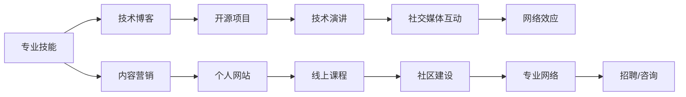

                 

## 1. 背景介绍

在当今快速变化的技术环境中，个人品牌对于程序员来说尤为重要。随着开源项目和在线社区的兴起，个人品牌不仅可以帮助你吸引更多的机会，还能在业界建立权威和信任，从而打开职业发展的大门。本文将深入探讨程序员如何利用技术和社交媒体打造个人品牌IP，实现职业生涯的飞跃。

### 1.1 问题由来

随着软件行业的不断发展和数字化转型的加速，个人品牌成为了一种重要的资产。优秀的个人品牌不仅能让你在竞争激烈的市场中脱颖而出，还能为你带来更多的合作机会、职业发展和商业价值。然而，如何构建和维护个人品牌IP，尤其是在技术领域，对许多程序员来说仍是一个挑战。

### 1.2 问题核心关键点

构建个人品牌IP的核心在于展示你的专业知识、技能和成就。一个成功的个人品牌IP应该具备以下特点：
- **专业性**：展示你在特定技术领域的专业知识和经验。
- **可见性**：通过各种平台和渠道，让你的作品和成就广为人知。
- **亲和力**：以一种真诚、积极的态度与他人互动，建立信任关系。

构建个人品牌IP不仅需要技术能力，还需要营销和沟通技巧。本文将从技术、社交媒体和公共演讲等多个维度，为你提供全面的指导。

## 2. 核心概念与联系

### 2.1 核心概念概述

为了更好地理解如何打造个人品牌IP，我们需要了解几个核心概念：

- **个人品牌（Personal Branding）**：指个人在职业生涯和专业领域中形成的独特形象和声誉。
- **网络效应（Network Effect）**：个人品牌的价值随着连接和互动的增加而增加。
- **内容营销（Content Marketing）**：通过发布有价值的内容吸引并保持受众兴趣的过程。
- **社区建设（Community Building）**：围绕个人品牌建立和维护一个活跃、有益的在线社群。

这些概念之间相互关联，共同构成了个人品牌IP的构建框架。

### 2.2 核心概念原理和架构的 Mermaid 流程图



这个流程图展示了个人品牌IP的构建过程：通过提升专业技能，通过多种渠道展示专业成就，建立和维护在线社群，实现网络效应，最终带来更多的职业机会。

## 3. 核心算法原理 & 具体操作步骤

### 3.1 算法原理概述

个人品牌IP的构建并不是一蹴而就的过程，而是一个持续优化和提升的旅程。核心算法原理包括以下几个方面：

1. **专业技能的提升**：持续学习新技术，保持专业技能的更新和提升。
2. **内容创作和分享**：通过博客、技术文章、代码示例等方式，分享你的知识和技术见解。
3. **网络互动和关系管理**：积极参与技术社区和线上社群，建立和维护专业网络。
4. **品牌曝光和推广**：利用社交媒体和线上渠道，扩大个人品牌的曝光度和影响力。

### 3.2 算法步骤详解

1. **技能提升**：
    - 持续学习和实践，参加技术培训和认证。
    - 关注技术前沿，阅读顶级会议的论文和技术博客。

2. **内容创作**：
    - 在个人网站或博客上定期发布技术文章和教程。
    - 在GitHub上维护开源项目，分享代码和工具。

3. **网络互动**：
    - 在Stack Overflow、GitHub、Reddit等技术社区活跃，回答问题和参与讨论。
    - 建立个人网站或利用LinkedIn、Twitter等社交媒体平台展示作品和成就。

4. **品牌推广**：
    - 利用SEO和社交媒体工具，提升个人品牌网站和内容的曝光度。
    - 参加技术会议、研讨会和线上演讲，展示你的专业知识和经验。

### 3.3 算法优缺点

#### 优点：
- **广泛传播**：通过多种渠道传播个人品牌，快速提升知名度。
- **可信度高**：借助技术社区和学术界的认可，增加可信度。
- **持续成长**：通过持续学习和互动，不断提升个人品牌价值。

#### 缺点：
- **时间成本高**：需要大量时间和精力来维护和推广个人品牌。
- **竞争激烈**：技术领域竞争激烈，建立个人品牌需要差异化的策略。
- **动态变化**：技术领域变化快，个人品牌需要不断更新和调整。

### 3.4 算法应用领域

个人品牌IP的应用领域非常广泛，以下是一些常见场景：

- **职业发展**：提升职业竞争力和市场价值，获得更多的工作机会和合作项目。
- **商业价值**：成为技术顾问、独立咨询师或创业者，提供专业服务。
- **教育培训**：开设线上课程、技术讲座和工作坊，传授知识和技能。

## 4. 数学模型和公式 & 详细讲解

### 4.1 数学模型构建

个人品牌IP的构建可以通过以下数学模型来描述：

$$
\text{Brand Value} = f(\text{Skill Level}, \text{Content Quality}, \text{Network Effect}, \text{Engagement Rate})
$$

其中，Skill Level表示专业技能水平，Content Quality表示内容的质量和数量，Network Effect表示网络效应的大小，Engagement Rate表示用户互动的频率和质量。

### 4.2 公式推导过程

通过分析上述公式，我们可以看到，个人品牌价值的提升需要以下几个方面的努力：

1. **技能提升**：不断学习和实践，提升专业技能水平。
2. **内容创作**：创作高质量、有价值的内容，吸引和保持受众的兴趣。
3. **网络互动**：建立广泛的社交网络，增加互动和曝光机会。
4. **品牌曝光**：通过多种渠道推广个人品牌，提升可见度和影响力。

### 4.3 案例分析与讲解

**案例1：Github上的开源项目**

John Doe是一名软件工程师，他在Github上维护了一个受欢迎的开源项目，该项目得到了数千名用户和数百次star和fork。通过这个项目，John不仅展示了他的编程技能，还建立了一个活跃的社区。项目贡献者们分享代码、讨论问题，John也通过回复评论、组织Meetup活动等方式与社区成员互动。随着时间的推移，John的个人品牌在技术界得到了广泛认可，他收到了许多工作和合作邀请。

## 5. 项目实践：代码实例和详细解释说明

### 5.1 开发环境搭建

为了打造个人品牌IP，我们需要一个易于管理和展示的作品集。以下是搭建开发环境的步骤：

1. **创建个人网站**：使用Jekyll或Hugo等静态网站生成工具，搭建个人博客。
2. **托管代码仓库**：在GitHub上创建代码仓库，用于展示你的项目和代码示例。
3. **社交媒体账号**：在LinkedIn、Twitter、Medium等社交平台上创建账号，定期发布技术文章和项目更新。

### 5.2 源代码详细实现

**个人网站实现**：

```html
<!DOCTYPE html>
<html lang="en">
<head>
    <meta charset="UTF-8">
    <title>John Doe's Personal Website</title>
    <link rel="stylesheet" href="style.css">
</head>
<body>
    <header>
        <h1>John Doe</h1>
        <nav>
            <ul>
                <li><a href="#about">About</a></li>
                <li><a href="#projects">Projects</a></li>
                <li><a href="#blog">Blog</a></li>
                <li><a href="#contact">Contact</a></li>
            </ul>
        </nav>
    </header>
    <main>
        <section id="about">
            <h2>About Me</h2>
            <p>Hi, I'm John Doe. I'm a software engineer with a passion for building scalable and reliable applications.</p>
        </section>
        <section id="projects">
            <h2>My Projects</h2>
            <ul>
                <li><a href="https://github.com/johndoe/project1">Project 1</a></li>
                <li><a href="https://github.com/johndoe/project2">Project 2</a></li>
            </ul>
        </section>
        <section id="blog">
            <h2>Latest Posts</h2>
            <ul>
                <li><a href="post1.html">Title of Post 1</a></li>
                <li><a href="post2.html">Title of Post 2</a></li>
            </ul>
        </section>
        <section id="contact">
            <h2>Get in Touch</h2>
            <p>Feel free to contact me at john@example.com or through LinkedIn.</p>
        </section>
    </main>
    <footer>
        <p>&copy; 2023 John Doe. All rights reserved.</p>
    </footer>
</body>
</html>
```

**开源项目实现**：

```python
# project1.py
def calculate_sqrt(number):
    """Calculate the square root of a number."""
    return number ** 0.5

# project2.py
def parse_xml(xml_string):
    """Parse an XML string into a dictionary."""
    # ...
```

### 5.3 代码解读与分析

**个人网站实现**：
- 使用HTML、CSS和JavaScript创建了一个简洁、易于导航的网站。
- 通过链接和内嵌的样式表，展示了个人信息、项目和博客文章。

**开源项目实现**：
- 展示了两个简单的Python函数，用于计算平方根和解析XML字符串。
- 通过GitHub的代码仓库链接，展示项目代码和文档。

### 5.4 运行结果展示

**个人网站**：
- 访问https://johndoe.example.com，可以看到一个简洁、专业的个人网站，展示John的个人信息、项目和博客文章。
- 用户可以点击链接，查看具体的项目和博客内容。

**开源项目**：
- 访问https://github.com/johndoe/project1，可以看到项目代码和文档，用户可以克隆代码并贡献新的功能。
- 项目的主页上，展示了项目的概述、代码示例和用户贡献情况。

## 6. 实际应用场景

### 6.1 职业发展

在职业发展方面，个人品牌IP的应用场景包括：

- **获得工作机会**：通过在GitHub、LinkedIn等平台展示项目和成就，吸引潜在雇主的注意。
- **职业晋升**：展示你在特定技术领域的专业知识和项目经验，为职业晋升积累资本。
- **咨询服务**：作为独立咨询师或技术顾问，提供专业建议和服务。

### 6.2 商业价值

在商业价值方面，个人品牌IP的应用场景包括：

- **创业项目**：利用个人品牌吸引投资者和合作伙伴，快速推动项目发展。
- **技术培训**：开设线上课程和技术讲座，分享知识和经验，获得收入和影响力。
- **内容变现**：通过书籍、博客和在线课程，获得商业收益。

### 6.3 教育培训

在教育培训方面，个人品牌IP的应用场景包括：

- **在线课程**：通过Coursera、Udemy等平台开设技术课程，分享知识和经验。
- **技术讲座**：参加技术会议和研讨会，展示专业知识和研究成果。
- **工作坊**：组织线下或线上技术工作坊，帮助他人提升技能。

### 6.4 未来应用展望

随着技术的不断进步和社交媒体的普及，个人品牌IP的应用前景将更加广阔。未来，个人品牌IP可能包括以下几个方面：

- **跨平台集成**：整合各种社交媒体和平台，实现统一的个人品牌展示。
- **AI驱动**：利用AI技术自动生成内容、分析用户行为，提升品牌影响力。
- **虚拟形象**：通过虚拟现实和增强现实技术，创建虚拟形象或仿真体验，增强用户互动。

## 7. 工具和资源推荐

### 7.1 学习资源推荐

为了帮助程序员打造个人品牌IP，以下是一些优质的学习资源：

1. **《打造个人品牌》（Brand on Purpose）**：由Gary Vaynerchuk撰写的畅销书，提供了关于品牌建设的实用建议和案例分析。
2. **《技术写作》（Technical Writing）**：通过清晰、简洁的写作技巧，提升技术文章的质量和可读性。
3. **LinkedIn Learning**：提供了丰富的在线课程，涵盖个人品牌、社交媒体和内容营销等多个方面。
4. **Medium**：一个流行的内容分享平台，通过撰写技术文章和分享项目经验，提升个人品牌的可见度。

### 7.2 开发工具推荐

以下是一些用于个人品牌IP打造的常用工具：

1. **GitHub**：一个开源代码托管平台，展示和分享代码项目，建立和维护社区。
2. **Jekyll**：一个静态网站生成工具，用于搭建个人博客和技术文章。
3. **LinkedIn**：一个职业社交平台，展示个人成就和职业经历，建立专业网络。
4. **Twitter**：一个社交媒体平台，通过发布技术见解和文章，吸引关注和互动。
5. **Google Analytics**：一个网站分析工具，监控个人网站的流量和用户行为，优化用户体验。

### 7.3 相关论文推荐

以下是几篇关于个人品牌IP构建和优化的相关论文：

1. **《个人品牌建设的数字生态》**：探讨数字时代个人品牌建设的策略和工具。
2. **《社交媒体对个人品牌的影响》**：分析社交媒体如何影响个人品牌的构建和传播。
3. **《内容营销的策略与实践》**：提供关于内容营销的理论和实践建议。
4. **《品牌建设的心理学》**：从心理学角度探讨个人品牌建设的理论和方法。

## 8. 总结：未来发展趋势与挑战

### 8.1 总结

本文详细介绍了程序员如何利用技术和社交媒体打造个人品牌IP。通过提升专业技能、创建有价值的内容、积极参与社区互动和推广个人品牌，程序员可以在职业生涯中取得显著进展。个人品牌IP的构建不仅需要技术能力，还需要营销和沟通技巧。通过不断学习和实践，程序员可以建立独特的个人品牌，为职业发展和商业价值创造更多机会。

### 8.2 未来发展趋势

未来，个人品牌IP的发展趋势包括：

1. **技术融合**：个人品牌IP将与AI、VR等前沿技术融合，提供更丰富的互动和体验。
2. **全球化**：通过社交媒体和全球化网络，个人品牌IP在全球范围内传播和影响。
3. **个性化**：利用大数据和个性化推荐技术，提升用户互动和品牌曝光。

### 8.3 面临的挑战

尽管个人品牌IP构建有诸多优势，但也面临一些挑战：

1. **时间管理**：维护个人品牌需要大量时间和精力，可能会影响工作和家庭生活。
2. **竞争激烈**：技术领域竞争激烈，需要差异化的策略和创新思维。
3. **技术更新**：技术日新月异，需要不断学习新技能和工具。

### 8.4 研究展望

未来的研究应关注以下几个方向：

1. **自动化工具**：开发自动化工具，提升内容生成和品牌推广的效率。
2. **量化评估**：利用量化方法评估个人品牌的影响力和效果，指导持续优化。
3. **多模态内容**：结合图像、视频等多模态内容，提升品牌吸引力和互动体验。

## 9. 附录：常见问题与解答

**Q1：如何平衡个人品牌建设和日常工作？**

A: 可以通过以下策略平衡个人品牌建设和日常工作：
- **时间管理**：利用碎片时间进行品牌推广和内容创作。
- **任务优先级**：将个人品牌建设视为长期目标，合理安排优先级。
- **团队协作**：利用团队协作工具，如Slack和Trello，优化个人品牌建设过程。

**Q2：如何在社交媒体上建立广泛网络？**

A: 可以通过以下策略在社交媒体上建立广泛网络：
- **定期互动**：积极参与评论、讨论和分享，建立积极互动的社交关系。
- **内容分享**：分享有价值的技术文章和项目成果，吸引关注和互动。
- **个人介绍**：在LinkedIn等平台上完善个人介绍，展示专业背景和成就。

**Q3：如何提升个人品牌内容的质量和可读性？**

A: 可以通过以下策略提升个人品牌内容的质量和可读性：
- **简洁明了**：避免冗长和复杂的表达，使用简单明了的语言。
- **结构清晰**：使用清晰的标题和结构，使内容易于阅读和理解。
- **案例分析**：通过实际案例和示例，使内容更具说服力和实用性。

**Q4：如何利用个人品牌IP获得商业价值？**

A: 可以通过以下策略利用个人品牌IP获得商业价值：
- **线上课程**：开设技术课程，分享知识和经验，获得收入和影响力。
- **技术讲座**：参加技术会议和研讨会，展示专业知识和研究成果。
- **咨询服务**：作为独立咨询师或技术顾问，提供专业建议和服务。

---

作者：禅与计算机程序设计艺术 / Zen and the Art of Computer Programming

