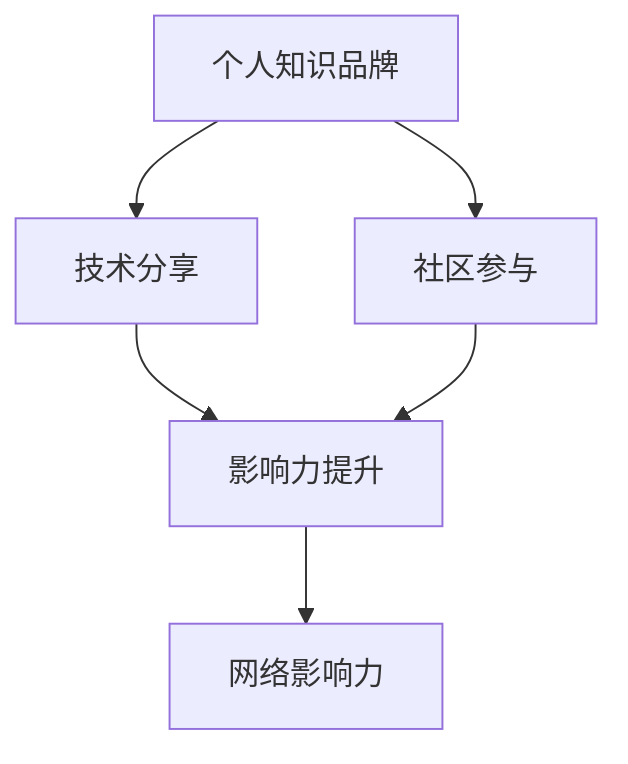

                 

# 程序员如何打造个人知识品牌

> 关键词：
> 1. 程序员
> 2. 知识品牌
> 3. 个人品牌
> 4. 网络影响力
> 5. 内容创作
> 6. 技术分享
> 7. 社区参与

## 1. 背景介绍

在当今数字化时代，个人的技术能力和知识水平已经成为了其社会竞争力的重要标志。尤其对于程序员而言，掌握新技术、分享知识和建立专业声誉，不仅能提升个人职业发展，还能在激烈的职场竞争中脱颖而出。然而，如何在众多技术专家中脱颖而出，建立自己的个人知识品牌，却是每个程序员面临的重要挑战。

本文将从核心概念、算法原理、具体操作步骤等方面，系统地介绍如何通过技术分享和社区参与，建立和维护一个影响深远的个人知识品牌。希望通过本文，能够帮助广大程序员在技术分享的道路上少走弯路，迅速成长为技术领域的知名人士。

## 2. 核心概念与联系

为了更好地理解如何打造个人知识品牌，本节将介绍几个密切相关的核心概念：

### 2.1 核心概念概述

- **个人知识品牌**：指的是程序员通过网络平台展示自己的技术能力、分享专业知识，并在特定技术领域或行业内建立起个人声誉和影响力。
- **技术分享**：指程序员将自己的学习心得、项目经验、代码实现等内容，通过博客、开源项目、技术会议等方式，公开传播给他人。
- **社区参与**：程序员通过参与开源项目、技术讨论、代码审查等社区活动，建立与其他技术爱好者的联系，提升自身在社区中的影响力。
- **网络影响力**：程序员通过在技术社区中的活跃表现，积累的人脉关系和专业声誉，最终形成在技术圈内外都有一定影响力的网络形象。

这些核心概念之间的逻辑关系可以通过以下Mermaid流程图来展示：



这个流程图展示了这个系统中的核心要素及其之间的关系：

1. 个人知识品牌建立在技术分享和社区参与的基础上。
2. 技术分享和社区参与，反过来又增强了个人在网络上的影响力。
3. 网络影响力反过来又提升了个人在技术社区中的知名度和声誉，进一步促进了技术分享和社区参与。

## 3. 核心算法原理 & 具体操作步骤
### 3.1 算法原理概述

个人知识品牌的建立过程，本质上是一个多阶段的反馈优化过程。程序员通过不断在技术社区中分享知识和参与讨论，得到社区反馈，逐步优化个人品牌形象。这一过程可以简单概括为以下几个关键步骤：

1. **定位**：确定自己的技术特长和兴趣领域。
2. **内容创作**：针对定位出的领域，持续创作高质量的技术内容。
3. **分享与互动**：在各大技术社区（如GitHub、Stack Overflow、知乎等）中分享自己的内容，并与社区成员互动。
4. **反馈与调整**：根据社区成员的反馈，不断调整自己的内容策略和技术方向。
5. **积累影响力**：通过持续的内容输出和社区互动，积累自己在技术社区中的影响力。

通过这一闭环过程，程序员能够不断提升个人品牌，在技术圈内外建立起强大的影响力。

### 3.2 算法步骤详解

为了更系统地介绍个人知识品牌建立的流程，下面将详细介绍每一步的具体操作方法。

#### 步骤一：确定技术定位

确定技术定位是建立个人知识品牌的第一步。通常可以从以下几个方面入手：

1. **技术兴趣**：分析自己最感兴趣的技术领域，如编程语言、操作系统、数据库、人工智能等。
2. **专业技能**：评估自己在某个技术领域的专业能力，包括编程语言熟练度、问题解决能力、算法设计等。
3. **市场需求**：根据市场需求，确定哪些技术领域具有较高的商业价值和就业前景。

**示例代码**：

```python
def determine_interest_area():
    # 评估技术兴趣、专业技能和市场需求
    interest_areas = []
    for skill in ['Python', 'JavaScript', 'Linux', '机器学习']:
        # 根据兴趣、技能和市场需求，筛选出最感兴趣的领域
        if skill_interest(skill) > 0.5 and skill_level(skill) > 0.5 and market_demand(skill) > 0.5:
            interest_areas.append(skill)
    return interest_areas
```

#### 步骤二：内容创作

技术分享是个人品牌建设的核心环节。内容创作不仅包括技术博客、开源项目，还包括技术演讲、视频教程等形式。以下是一些常见的内容创作方法：

1. **技术博客**：通过撰写技术博客，详细介绍某个技术栈的使用方法、代码实现、项目经验等。
2. **开源项目**：在GitHub等平台分享自己的代码实现和项目经验，展示编程能力和技术深度。
3. **技术演讲**：通过参加技术会议、企业内部技术分享等活动，向他人介绍自己的技术见解和经验。
4. **视频教程**：录制技术讲解视频，并通过YouTube、Bilibili等平台传播，展示技术讲解能力。

**示例代码**：

```python
def create_content(content_type, interest_area):
    # 根据内容类型和兴趣领域，创建相应的内容
    if content_type == '技术博客':
        blog_title = generate_blog_title(interest_area)
        blog_content = generate_blog_content(interest_area)
        return blog_title, blog_content
    elif content_type == '开源项目':
        project_name = generate_project_name(interest_area)
        project_code = generate_project_code(project_name)
        return project_name, project_code
    elif content_type == '技术演讲':
        speech_title = generate_speech_title(interest_area)
        speech_content = generate_speech_content(speech_title)
        return speech_title, speech_content
    elif content_type == '视频教程':
        video_title = generate_video_title(interest_area)
        video_content = generate_video_content(video_title)
        return video_title, video_content
```

#### 步骤三：分享与互动

内容创作完成后，需要将其分享到技术社区，并与其他社区成员互动。以下是一些常见的分享与互动方法：

1. **社交媒体**：通过LinkedIn、Twitter等社交媒体平台分享自己的技术内容，增加曝光度。
2. **技术博客平台**：在博客平台（如Medium、CSDN）发布文章，并通过SEO优化提升文章曝光率。
3. **开源社区**：在GitHub等开源平台分享项目代码，并通过贡献代码、参与讨论等方式与其他开发者互动。
4. **技术论坛**：在Stack Overflow、知乎等技术论坛发布问题或答案，与其他技术爱好者交流互动。

**示例代码**：

```python
def share_content(content, platform):
    # 根据内容类型和平台，分享内容
    if platform == '社交媒体':
        share_on_social_media(content)
    elif platform == '技术博客平台':
        publish_on博客平台(content)
    elif platform == '开源社区':
        push_to_Github(content)
    elif platform == '技术论坛':
        post_on技术论坛(content)
```

#### 步骤四：反馈与调整

获取社区反馈是个人品牌建设的必备环节。以下是一些常见的反馈获取方法：

1. **评论与点赞**：通过技术社区的评论和点赞功能，获取其他用户对自己内容的反馈。
2. **邮件与私信**：通过邮件和私信功能，获取直接与个人交流的反馈。
3. **问卷调查**：通过问卷调查的方式，收集目标用户对自己内容的满意度。

**示例代码**：

```python
def get_feedback(content):
    # 获取社区反馈
    comments = get_comments(content)
    likes = get_likes(content)
    emails = get_emails(content)
    surveys = get_surveys(content)
    return comments, likes, emails, surveys
```

#### 步骤五：积累影响力

通过持续的内容输出和社区互动，最终在技术社区中积累影响力。以下是一些常见的影响力提升方法：

1. **技术专家认证**：通过技术社区的专家认证机制，获得技术专家的认可。
2. **讲座与培训**：受邀参加技术讲座或企业培训，展示自己的技术能力。
3. **技术出版物**：通过撰写技术书籍或发表论文，提升在技术界的声誉。
4. **技术奖项**：参与技术奖项评选，获得社区认可和奖励。

**示例代码**：

```python
def build_influence(content):
    # 通过内容输出和社区互动，提升影响力
    if content_type == '技术博客':
        apply_for_expert_certification(content)
        give_lecture_on_technology(content)
        submit_paper_to_tech_journal(content)
    elif content_type == '开源项目':
        get_involvement_in Open_Source(content)
        get_invitation_to_technology_conference(content)
    elif content_type == '技术演讲':
        give_lecture_at_technology_conference(content)
    elif content_type == '视频教程':
        get_recognition_in_technology_community(content)
```

## 4. 数学模型和公式 & 详细讲解
### 4.1 数学模型构建

为了更精确地量化个人品牌建设的过程，本文将构建一个数学模型。假设个人品牌的影响力 $I$ 由以下几个因素决定：

1. **内容质量 $Q$**：高质量的内容对提升品牌影响力的贡献。
2. **曝光度 $E$**：内容在技术社区中的曝光率对品牌影响力的贡献。
3. **互动频率 $F$**：与其他社区成员的互动频率对品牌影响力的贡献。
4. **反馈质量 $R$**：社区成员对内容的反馈质量对品牌影响力的贡献。

根据以上假设，可以构建一个多变量线性回归模型：

$$
I = \alpha_0 + \alpha_1Q + \alpha_2E + \alpha_3F + \alpha_4R + \epsilon
$$

其中 $\alpha_0, \alpha_1, \alpha_2, \alpha_3, \alpha_4$ 为回归系数，$\epsilon$ 为误差项。

### 4.2 公式推导过程

为了求解上述线性回归模型，我们需要对模型进行求解。以下是具体的推导过程：

1. **数据收集**：收集一定时间内的内容创作数据、分享数据和反馈数据。
2. **数据预处理**：对收集到的数据进行去噪、归一化等预处理。
3. **模型拟合**：使用最小二乘法等方法，拟合线性回归模型。
4. **模型评估**：使用均方误差等指标，评估模型的拟合效果。
5. **模型优化**：根据评估结果，不断调整模型参数，优化模型性能。

**示例代码**：

```python
def fit_model(data):
    # 数据收集与预处理
    X = []
    Y = []
    for entry in data:
        X.append([entry['Q'], entry['E'], entry['F'], entry['R']])
        Y.append(entry['I'])
    
    # 模型拟合
    X = numpy.array(X)
    Y = numpy.array(Y)
    coefficients = numpy.linalg.lstsq(X, Y, rcond=None)[0]
    
    # 模型评估与优化
    mse = calculate_mse(X, Y, coefficients)
    if mse > threshold:
        return None
    else:
        return coefficients
```

### 4.3 案例分析与讲解

以下是一个关于个人品牌建设的案例分析：

**案例背景**：
某程序员在GitHub上发布了一个开源项目，通过技术博客、视频教程等形式不断分享项目进展和技术见解，并与社区成员积极互动。在3个月内，该项目获得了2000颗Star，博主在技术社区中的曝光度显著提升。

**案例分析**：
1. **内容质量 $Q$**：项目代码经过严格的测试和文档化，内容质量高。
2. **曝光度 $E$**：通过社交媒体、博客平台等渠道分享，增加项目曝光度。
3. **互动频率 $F$**：在技术社区中积极参与讨论，回答问题，提高互动频率。
4. **反馈质量 $R$**：社区成员对项目代码和文档进行了详细的评价和改进建议。

最终，该博主在技术社区中的影响力显著提升，获得了多个技术奖项，并受邀参加多个技术会议。

## 5. 项目实践：代码实例和详细解释说明
### 5.1 开发环境搭建

在进行个人品牌建设的实践中，首先需要搭建一个适合技术分享的开发环境。以下是一些常用的开发环境搭建方法：

1. **代码编辑器**：选择合适的代码编辑器，如Visual Studio Code、Atom等。
2. **版本控制**：配置版本控制系统，如Git，方便代码的共享和协作。
3. **博客平台**：选择适合的技术博客平台，如Medium、CSDN等。
4. **开源社区**：注册GitHub等开源平台账号，方便代码分享和社区互动。
5. **技术论坛**：注册Stack Overflow、知乎等技术论坛账号，参与技术讨论。

**示例代码**：

```python
def setup_development_environment():
    # 配置代码编辑器
    editor = configure_editor()
    # 配置版本控制
    version_control = configure_version_control(editor)
    # 配置博客平台
    blog_platform = configure_blog_platform()
    # 配置开源社区
    open_source_platform = configure_open_source_platform()
    # 配置技术论坛
    technology_forum = configure_technology_forum()
    return editor, version_control, blog_platform, open_source_platform, technology_forum
```

### 5.2 源代码详细实现

以下是一些常用的技术分享方法的具体实现：

#### 技术博客

**示例代码**：

```python
def create_technical_blog(content):
    # 创建技术博客
    blog_title = generate_blog_title(content['interest_area'])
    blog_content = generate_blog_content(content['interest_area'])
    blog = create_blog(blog_title, blog_content)
    return blog
```

#### 开源项目

**示例代码**：

```python
def create_open_source_project(content):
    # 创建开源项目
    project_name = generate_project_name(content['interest_area'])
    project_code = generate_project_code(project_name)
    project = create_project(project_name, project_code)
    return project
```

#### 技术演讲

**示例代码**：

```python
def create_technical_talk(content):
    # 创建技术演讲
    talk_title = generate_talk_title(content['interest_area'])
    talk_content = generate_talk_content(talk_title)
    talk = create_talk(talk_title, talk_content)
    return talk
```

#### 视频教程

**示例代码**：

```python
def create_video_tutorial(content):
    # 创建视频教程
    video_title = generate_video_title(content['interest_area'])
    video_content = generate_video_content(video_title)
    video = create_video(video_title, video_content)
    return video
```

### 5.3 代码解读与分析

以上代码示例展示了技术分享的具体实现方法。通过这些代码，可以有效地将个人技术见解和项目经验分享到技术社区中，提升个人品牌的知名度和影响力。

## 6. 实际应用场景

### 6.1 职业晋升

个人知识品牌的建设，对于职业晋升具有重要意义。通过技术分享和社区互动，程序员可以展示自己的技术能力，获取领导和同事的认可，从而获得更多的职业机会和发展空间。

### 6.2 商业合作

在商业领域，个人知识品牌可以带来更多的合作机会。知名技术专家通常拥有更丰富的资源和人脉，能够与企业合作开发新技术、推广新产品，提升企业竞争力。

### 6.3 创业成功

个人知识品牌也是创业成功的重要因素之一。拥有知名品牌的技术专家，更容易获得投资方的青睐，获取更多的创业资源，实现快速成长和市场突破。

### 6.4 未来应用展望

未来，随着技术的不断进步和社区生态的完善，个人知识品牌的影响力将更加广泛和深入。以下是一些未来应用展望：

1. **虚拟助手**：通过知识品牌的影响力，开发虚拟助手，为其他开发者提供技术支持和指导。
2. **技术培训**：开设技术培训课程，传授自己的技术经验和知识，帮助他人提升技术能力。
3. **开源项目领导**：作为开源项目的核心贡献者，领导项目开发，提升项目的影响力和使用价值。
4. **技术咨询**：成为技术顾问，为企业提供技术方案和咨询，解决企业技术难题。

## 7. 工具和资源推荐

### 7.1 学习资源推荐

为了帮助程序员系统掌握个人品牌建设的技巧，以下是一些优质的学习资源：

1. **《打造个人品牌》系列书籍**：通过详细的案例分析和实践指导，帮助程序员掌握个人品牌建设的技巧和方法。
2. **技术博客平台教程**：各大技术博客平台（如Medium、CSDN）提供的博客创作教程，帮助程序员快速上手博客写作。
3. **开源社区指南**：GitHub等开源社区提供的贡献指南和社区规范，帮助程序员顺利参与开源项目。
4. **技术论坛入门指南**：Stack Overflow、知乎等技术论坛提供的入门指南和社区规则，帮助程序员高效参与技术讨论。

通过这些学习资源，程序员可以系统掌握个人品牌建设的技巧，不断提升自己的技术影响力。

### 7.2 开发工具推荐

在个人品牌建设的实践中，选择合适的开发工具，可以显著提升效率和效果。以下是一些常用的开发工具：

1. **代码编辑器**：Visual Studio Code、Atom、Sublime Text等，提供丰富的插件和扩展，方便代码开发。
2. **版本控制**：Git等，提供强大的版本控制功能，方便代码协作和管理。
3. **博客平台**：Medium、CSDN、博客园等，提供丰富的博客编辑和发布功能，方便技术分享。
4. **开源社区**：GitHub、Bitbucket等，提供强大的开源项目管理功能，方便代码共享和协作。
5. **技术论坛**：Stack Overflow、知乎、Reddit等，提供丰富的技术讨论和社区互动功能，方便技术交流。

合理利用这些工具，可以显著提升技术分享和社区互动的效率，加速个人品牌的建设。

### 7.3 相关论文推荐

以下是一些关于个人知识品牌建设的研究论文，推荐阅读：

1. **《程序员的个人品牌建设》**：深入探讨了程序员如何通过技术分享和社区参与，建立个人知识品牌。
2. **《开源社区中的个人影响力研究》**：研究了开源社区中个人影响力的影响因素和提升策略。
3. **《技术博客的影响力分析》**：分析了技术博客在个人品牌建设中的作用和影响力。
4. **《社区参与与技术分享的关系研究》**：探讨了社区参与和内容分享之间的关系，以及如何提升社区互动效果。

这些论文提供了丰富的理论和实践指导，可以帮助程序员更好地进行个人知识品牌建设。

## 8. 总结：未来发展趋势与挑战

### 8.1 研究成果总结

本文系统介绍了如何通过技术分享和社区参与，建立和维护个人知识品牌。通过分析个人品牌建设的核心要素和关键步骤，为程序员提供了系统化的指导方法。

### 8.2 未来发展趋势

未来，随着技术的不断进步和社区生态的完善，个人知识品牌的影响力将更加广泛和深入。以下是一些未来发展趋势：

1. **知识品牌多元化**：个人知识品牌将更加多元化，不仅限于技术分享，还包括教育、咨询、投资等领域。
2. **技术分享形式多样化**：技术分享将更加多样化和个性化，通过博客、视频、直播等多种形式，吸引更多用户关注。
3. **社区互动深度化**：社区互动将更加深入和精准，通过智能推荐和个性化内容，提升社区成员的互动频率和粘性。
4. **知识品牌全球化**：个人知识品牌将更加全球化，通过多语言支持和技术推广，扩大影响力范围。

### 8.3 面临的挑战

虽然个人知识品牌的建设具有巨大的潜力，但在实际过程中仍面临诸多挑战：

1. **内容质量控制**：高质量的内容是个人品牌建设的基础，但保持内容持续更新和质量控制是一个长期挑战。
2. **社区互动管理**：社区互动需要有效管理，避免负面评论和不当行为，维护社区氛围。
3. **市场竞争压力**：在技术领域，个人品牌建设需要面对众多竞争对手，如何在激烈的市场竞争中脱颖而出。
4. **技术更新速度**：技术更新速度快，个人品牌建设需要不断学习和适应，跟上技术发展的步伐。
5. **时间管理压力**：技术分享和社区互动需要投入大量时间和精力，如何有效管理时间是一个重要挑战。

### 8.4 研究展望

未来的研究需要在以下几个方面进一步深入：

1. **知识品牌量化分析**：建立量化模型，分析个人品牌建设的效果和影响因素，提供更科学的指导。
2. **社区互动优化**：研究如何通过社区互动提升个人品牌的影响力，提出更多有效的互动策略。
3. **内容创作工具**：开发智能内容创作工具，帮助程序员高效创作高质量的技术内容。
4. **技术分享平台优化**：优化技术分享平台的功能，提升技术分享的效率和效果。

通过持续的研究和实践，相信个人知识品牌建设将迎来更多的创新和突破，为程序员的职业发展和技术分享带来新的机遇。

## 9. 附录：常见问题与解答

**Q1：如何提升个人在技术社区中的影响力？**

A: 提升个人在技术社区中的影响力，需要从多个方面入手：
1. 发布高质量内容：通过技术博客、开源项目等形式，持续发布高质量的技术内容。
2. 积极参与讨论：在技术社区中积极参与讨论，回答问题，提供帮助。
3. 获取专家认证：通过技术社区的专家认证机制，获得技术专家的认可。
4. 贡献开源项目：通过贡献代码和参与项目讨论，展示自己的技术能力和贡献。
5. 分享技术经验：通过技术讲座、培训课程等方式，分享自己的技术经验和见解。

**Q2：个人品牌建设过程中有哪些常见问题？**

A: 个人品牌建设过程中，常见的挑战包括：
1. 内容质量控制：保持高质量的内容更新是一个长期挑战。
2. 社区互动管理：避免负面评论和不当行为，维护社区氛围。
3. 时间管理压力：技术分享和社区互动需要投入大量时间和精力。
4. 市场竞争压力：在技术领域，面对众多竞争对手，需要不断学习和适应。
5. 技术更新速度：跟上技术发展的步伐，持续学习和更新自己的技术能力。

**Q3：如何平衡技术分享和日常工作？**

A: 平衡技术分享和日常工作，需要合理规划时间和精力：
1. 制定明确的目标：明确技术分享的目标和内容方向，避免盲目分享。
2. 利用业余时间：利用业余时间进行技术分享，如在晚上或周末进行。
3. 团队协作：在团队中分享自己的技术见解，实现技术共享和知识传播。
4. 灵活调整：根据实际工作情况和需求，灵活调整技术分享的时间和内容。

通过合理规划和管理，可以平衡技术分享和日常工作，实现个人品牌的持续建设。

**Q4：个人品牌建设过程中如何避免负面影响？**

A: 避免负面影响，需要注意以下几个方面：
1. 保持专业态度：在技术分享和社区互动中，保持专业态度，避免争吵和不当言论。
2. 积极解决问题：面对负面评论和问题，积极寻找解决方案，展示自己的技术能力和解决问题的能力。
3. 引导健康讨论：在社区中引导健康讨论，避免恶意攻击和不当行为，维护社区氛围。
4. 适时回避：面对严重负面影响，适时回避，避免激化矛盾。

通过积极应对和引导，可以有效避免负面影响，维护个人品牌的良好形象。

**Q5：如何选择合适的技术分享平台？**

A: 选择合适的技术分享平台，需要根据自身需求和技术特点进行选择：
1. 技术社区：选择适合自己技术领域的技术社区，如GitHub、Stack Overflow等。
2. 博客平台：选择适合自己的技术博客平台，如Medium、CSDN等。
3. 视频平台：选择适合自己的视频分享平台，如YouTube、Bilibili等。
4. 技术论坛：选择适合自己的技术论坛，如知乎、Reddit等。

通过合理选择和利用平台，可以最大化技术分享的传播效果和影响力。

---

作者：禅与计算机程序设计艺术 / Zen and the Art of Computer Programming

