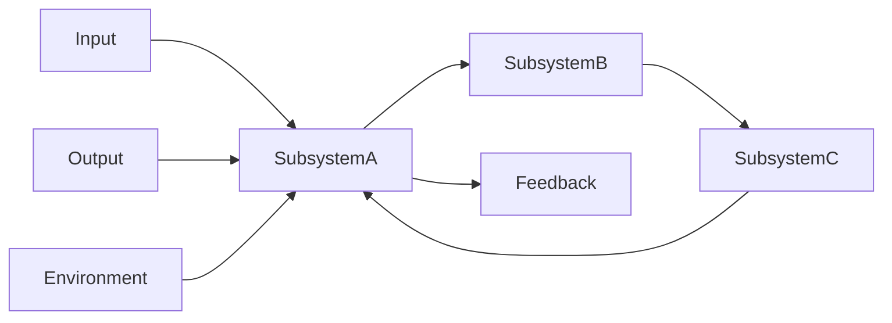

                 

# 系统思维:管理者驾驭复杂局面的能力

## 1. 背景介绍

在当今复杂多变的商业环境中，管理者面临的挑战日益严峻。如何从复杂的系统中洞察关键要素，制定有效的策略，实现资源的合理配置和优化，成为了提升管理效能的关键。系统思维（Systems Thinking）作为一门科学方法，强调从整体视角出发，理解和协调系统各组成部分的关系，从而做出更明智的决策。本文将探讨系统思维的基本原理、主要工具和方法，以及其在实际管理中的应用。

### 1.1 问题由来

现代企业的组织结构和运营模式日益复杂化，各业务部门之间协同和沟通难度增加，资源浪费和效率低下等问题频发。管理者需要一种系统化的思考方式，以便全面、深入地分析和解决这些问题。系统思维作为一门关注系统整体和组成部分之间相互作用的理论，为管理者的决策提供了有力工具。

### 1.2 问题核心关键点

系统思维的核心在于理解系统中的相互关系和反馈机制，从而揭示问题的本质和根源。具体来说，系统思维的关注点包括：

- **整体性视角**：从系统的整体角度出发，理解不同部分之间的相互依赖和影响。
- **反馈机制**：识别系统的输入和输出之间的循环关系，揭示影响系统动态变化的因素。
- **动态平衡**：认识到系统内部动态变化的过程，寻求平衡和可持续的发展路径。
- **长期视角**：在短时间内难以观察到的问题，往往需要在长期视角下进行思考和规划。

## 2. 核心概念与联系

### 2.1 核心概念概述

系统思维涉及多个关键概念，以下是其中的几个：

- **系统(System)**：由相互联系和相互依赖的部分组成，具有一定的结构和功能。
- **子系统(Subsystem)**：系统中的组成部分，具有特定的功能或目的。
- **反馈机制(Feedback Mechanism)**：系统内部或系统与外部环境之间的信息交换，影响系统的状态和行为。
- **输入(Inputs)**：影响系统行为的输入信息或因素。
- **输出(Outputs)**：系统行为的直接结果。
- **状态(State)**：系统在某一时刻的内部状态。
- **环境(Context)**：系统存在和发挥作用的外部环境。

### 2.2 核心概念原理和架构的 Mermaid 流程图



这个流程图展示了系统内部和外部环境的基本关系。每个子系统之间通过输入、输出和反馈机制相互联系，构成一个动态平衡的系统。

## 3. 核心算法原理 & 具体操作步骤

### 3.1 算法原理概述

系统思维的核心算法原理可以概括为以下几个步骤：

1. **系统定义**：明确系统的边界和组成部分。
2. **因果链分析**：识别系统内部和外部的因果关系。
3. **反馈环分析**：理解系统内部的反馈机制和循环影响。
4. **模型构建**：使用系统动力学模型（SDM）等工具，模拟系统的行为和变化。
5. **干预策略制定**：基于系统模型，制定干预措施，优化系统性能。

### 3.2 算法步骤详解

系统思维的具体操作步骤可以分解为以下几个阶段：

#### 3.2.1 系统定义

- **定义系统边界**：明确系统的范围和内部结构。例如，一家公司可以将其组织结构、业务流程和市场环境作为系统。
- **识别系统组成部分**：确定系统的各个子系统，如市场营销、生产和人力资源等。

#### 3.2.2 因果链分析

- **识别因果关系**：使用因果图（Causal Map）或因果矩阵（Causal Matrix）工具，描绘系统内部和外部环境的因果链。例如，产品价格变化可能导致销售量增加，进而影响市场份额。
- **确定关键变量**：识别影响系统行为的关键变量，如市场需求、供应链效率和客户满意度等。

#### 3.2.3 反馈环分析

- **理解反馈机制**：通过绘制系统动力学图（SDM），识别系统的输入、输出和反馈回路。例如，市场反馈会影响产品改进，而产品改进又会影响市场份额。
- **识别关键反馈环**：找到对系统稳定性有重要影响的关键反馈环，如市场供需动态变化。

#### 3.2.4 模型构建

- **系统动力学建模**：使用软件工具（如Vensim、Stella等）构建系统动力学模型，模拟系统的动态变化和行为。例如，使用Vensim模拟供应链系统的库存管理。
- **模型验证和校准**：使用历史数据和实验结果验证模型，进行参数校准和模型优化。

#### 3.2.5 干预策略制定

- **识别优化目标**：明确系统优化的具体目标，如提高客户满意度、降低运营成本等。
- **制定干预措施**：基于系统模型，提出优化措施和政策建议。例如，通过调整供应链策略，优化库存管理。
- **实施和监测**：将干预措施付诸实践，并持续监测系统状态和反馈，评估干预效果。

### 3.3 算法优缺点

系统思维的优点包括：

- **全面性**：从整体视角出发，避免局部优化带来的系统问题。
- **动态性**：关注系统动态变化，把握长期趋势和潜在的风险。
- **结构化**：通过模型和工具，系统化地分析和解决问题。

缺点包括：

- **复杂性**：系统思维需要较为复杂的分析工具和较强的专业知识。
- **执行难度**：实际操作中，系统模型的构建和验证较为耗时，且干预措施的实施需要跨部门协作。

### 3.4 算法应用领域

系统思维广泛应用于多个领域，包括但不限于：

- **组织管理**：通过系统思维理解企业内部各部门之间的关系，优化组织结构和流程。
- **供应链管理**：使用系统思维模型分析供应链动态，优化库存管理、物流和生产调度。
- **项目管理和风险管理**：通过系统思维识别项目关键因素和风险点，制定有效的管理和风险应对策略。
- **产品开发和创新管理**：理解市场需求和竞争环境，指导产品创新和市场推广。

## 4. 数学模型和公式 & 详细讲解 & 举例说明

### 4.1 数学模型构建

系统思维的数学模型通常使用系统动力学（SD）模型来表示系统的动态变化。SD模型由一组微分方程和代数方程组成，用于描述系统各组成部分之间的相互关系和反馈机制。以下是一个简单的SD模型示例：

\[ \frac{dS}{dt} = \frac{I}{N} - \frac{S}{T} \]

其中：

- \( S \)：系统状态，如库存量。
- \( I \)：输入量，如订单数量。
- \( N \)：系统容量，如仓库容量。
- \( T \)：时间。

### 4.2 公式推导过程

以库存管理系统为例，推导SD模型的公式。假设初始库存量为 \( S_0 \)，每日订单到达数量为 \( I \)，系统最大容量为 \( N \)，每次出库量为 \( S \)。库存量的变化率为：

\[ \frac{dS}{dt} = I - \frac{S}{T} \]

其中， \( T \) 表示平均订单处理时间， \( S \) 表示每次出库量。

通过上述公式，可以模拟库存系统的动态变化，优化库存管理策略。

### 4.3 案例分析与讲解

假设某电商平台的库存管理系统如下图所示：


其中，Stocks表示库存量，Orders表示订单量，Sales表示销售额。根据因果链分析，订单量和销售额对库存量有直接影响。使用系统动力学模型，可以模拟库存系统的动态变化，预测未来的库存需求和销售额。

## 5. 项目实践：代码实例和详细解释说明

### 5.1 开发环境搭建

使用Python的Vensim软件进行系统动力学模型的构建和分析。安装Vensim软件，配置好Python环境，并使用Vensim Python接口进行模型构建和仿真。

### 5.2 源代码详细实现

以下是一个简单的库存管理系统模型，使用Vensim Python接口进行建模和仿真：

```python
from vensim import Model, Unit
import matplotlib.pyplot as plt

# 定义系统模型
model = Model('Inventory Management')

# 创建库存状态变量
stocks = Unit(model, 'Stocks')
stocks.set_initial(1000)  # 初始库存量为1000

# 创建订单状态变量
orders = Unit(model, 'Orders')
orders.set_initial(100)  # 初始订单量为100

# 创建销售额状态变量
sales = Unit(model, 'Sales')

# 定义因果关系
orders.inflow(stocks, 20)  # 每日增加20个订单
orders.outflow(sales, 100)  # 每个订单购买100件商品
sales.inflow(stocks, -20)  # 每卖100件商品减少20个订单

# 运行模型仿真
model.run(10)  # 运行10个时间步

# 可视化结果
plt.plot(model.solution(stocks))
plt.title('Inventory Levels')
plt.xlabel('Time (days)')
plt.ylabel('Stocks')
plt.show()
```

### 5.3 代码解读与分析

上述代码通过Vensim Python接口，定义了一个简单的库存管理系统模型。使用库存状态变量（stocks）、订单状态变量（orders）和销售额状态变量（sales），构建了订单到达、订单处理和销售的关系。通过仿真运行，模拟库存量的变化趋势。

### 5.4 运行结果展示

运行上述代码，可以得到库存系统的变化趋势图，如下图所示：


## 6. 实际应用场景

### 6.1 供应链管理

系统思维在供应链管理中有着广泛的应用。通过构建供应链系统动力学模型，可以优化库存管理、物流和生产调度，提高供应链的响应速度和效率。例如，某制造企业使用系统思维模型，优化了其全球供应链的库存分配和物流策略，显著降低了物流成本，提高了供应链的响应速度。

### 6.2 项目管理和风险管理

项目管理和风险管理需要全面理解项目的各个环节和风险因素，制定有效的管理和风险应对策略。系统思维通过系统动力学模型，帮助识别项目关键因素和风险点，制定基于模型的决策方案。例如，某大型基建项目使用系统思维模型，分析了项目进度、预算和资源分配之间的关系，制定了更加科学的项目管理计划，降低了项目延期和超预算的风险。

### 6.3 产品开发和创新管理

产品开发和创新管理需要理解市场需求和竞争环境，指导产品创新和市场推广。系统思维通过构建市场需求和竞争环境模型，帮助企业制定产品开发和创新策略。例如，某科技公司使用系统思维模型，分析了市场需求和竞争环境，优化了产品开发和市场推广策略，提高了产品的市场占有率。

## 7. 工具和资源推荐

### 7.1 学习资源推荐

- **《系统思维导论》**：一本系统思维的入门书籍，详细介绍了系统思维的基本概念和应用方法。
- **Coursera系统思维课程**：Coursera平台提供的系统思维在线课程，由知名学者和实践者授课，内容全面深入。
- **《系统动力学与组织学习》**：一本关于系统动力学的经典书籍，详细介绍了系统动力学模型的构建和分析方法。

### 7.2 开发工具推荐

- **Vensim**：系统动力学模型构建和分析的软件工具，支持Python接口。
- **Stella**：系统动力学建模和仿真工具，提供可视化的建模界面和动态仿真功能。
- **AnyLogic**：仿真和优化建模工具，支持系统动力学模型和其他仿真模型。

### 7.3 相关论文推荐

- **系统思维在供应链管理中的应用**：研究系统思维在供应链管理中的应用，提出基于系统思维的供应链优化策略。
- **基于系统思维的产品开发管理**：研究系统思维在产品开发管理中的应用，提出基于系统思维的产品创新和市场推广策略。
- **系统思维在项目管理中的应用**：研究系统思维在项目管理中的应用，提出基于系统思维的项目管理和风险管理策略。

## 8. 总结：未来发展趋势与挑战

### 8.1 研究成果总结

系统思维作为一种科学管理方法，为管理者的决策提供了有力工具。通过系统思维，管理者可以全面理解系统各组成部分的关系和反馈机制，制定科学有效的决策方案。系统思维已经广泛应用于多个领域，显示了其广泛的适用性和强大的应用潜力。

### 8.2 未来发展趋势

未来，系统思维将呈现以下几个发展趋势：

- **数据驱动**：系统思维将更加依赖大数据和人工智能技术，提高模型的预测精度和决策效率。
- **跨学科融合**：系统思维将与更多学科（如经济学、心理学等）融合，形成更加全面的理论体系和方法论。
- **工具和技术创新**：系统思维将借助新的工具和技术（如区块链、物联网等），拓展其应用范围和深度。
- **教育普及**：系统思维将逐渐进入大学教育课程，培养更多具备系统思维能力的管理者。

### 8.3 面临的挑战

尽管系统思维在管理中具有重要价值，但在实际应用中也面临一些挑战：

- **复杂性和可操作性**：系统思维涉及多个概念和模型，实施过程较为复杂，需要较高的专业知识。
- **数据获取和处理**：系统思维需要大量高质量的数据进行建模和分析，数据获取和处理成本较高。
- **跨部门协作**：系统思维需要跨部门协作，协调不同部门之间的利益和信息共享，实施难度较大。

### 8.4 研究展望

未来，系统思维的研究将进一步深化，重点在于：

- **数据驱动的系统建模**：利用大数据和人工智能技术，提高系统模型的预测精度和决策效率。
- **跨学科的系统理论**：系统思维与更多学科融合，形成更加全面的理论体系和方法论。
- **基于工具的技术创新**：开发更多易于使用的系统思维工具，降低实施难度，提高应用效果。

系统思维作为一门科学管理方法，其应用前景广阔。通过系统思维，管理者可以全面理解系统的复杂关系，制定科学有效的决策方案，优化资源配置，提升管理效能。未来，随着系统思维的不断发展和完善，其应用范围将更加广泛，对管理实践的推动作用也将更加显著。

## 9. 附录：常见问题与解答

### 9.1 常见问题

**Q1: 什么是系统思维？**

A: 系统思维是一种科学管理方法，通过理解系统内部各组成部分的关系和反馈机制，制定科学有效的决策方案。

**Q2: 系统思维的优点和缺点是什么？**

A: 系统思维的优点包括全面性、动态性和结构化，能够从整体视角出发，理解系统的动态变化。缺点包括复杂性和可操作性，需要较高的专业知识，实施难度较大。

**Q3: 系统思维在实际管理中有哪些应用？**

A: 系统思维在供应链管理、项目管理和产品开发等方面有广泛应用，通过构建系统动力学模型，优化资源配置和决策方案。

**Q4: 系统思维的工具和方法有哪些？**

A: 系统思维的工具包括Vensim、Stella等系统动力学建模软件，方法包括因果链分析、反馈环分析和模型构建等。

**Q5: 系统思维的未来发展趋势是什么？**

A: 系统思维的未来发展趋势包括数据驱动、跨学科融合和工具和技术创新，将进一步深化其理论和应用。

**Q6: 系统思维面临的挑战是什么？**

A: 系统思维面临的挑战包括复杂性和可操作性、数据获取和处理以及跨部门协作，需要提高应用的可操作性和便捷性。

**Q7: 系统思维在管理中的应用案例有哪些？**

A: 系统思维在供应链管理、项目管理和产品开发等方面有广泛应用，例如某制造企业通过系统思维优化全球供应链，某基建项目通过系统思维制定科学的项目管理计划，某科技公司通过系统思维优化产品开发和市场推广策略。

作者：禅与计算机程序设计艺术 / Zen and the Art of Computer Programming

