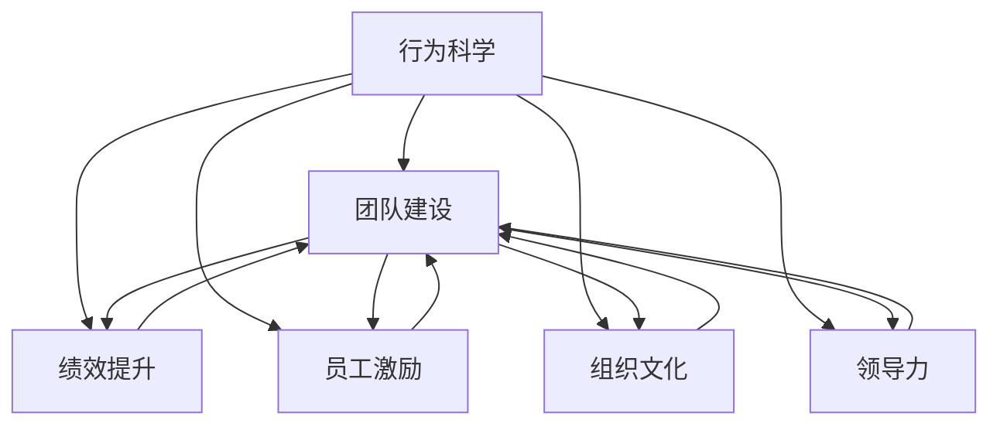

                 

# 行为科学在团队建设中的应用

> 关键词：行为科学,团队建设,绩效提升,员工激励,组织文化,领导力

## 1. 背景介绍

在现代企业中，团队建设被视为推动组织目标实现的核心力量之一。然而，如何高效构建和管理团队，一直是管理者和组织面临的重大挑战。行为科学作为一门研究人类行为及其影响因素的学科，提供了大量实证数据和理论框架，为团队建设提供了科学依据。本文将从行为科学的视角出发，系统探讨其在团队建设中的应用，为管理者和组织提供有价值的参考。

## 2. 核心概念与联系

### 2.1 核心概念概述

为理解行为科学在团队建设中的应用，我们需要首先掌握一些核心概念：

- **行为科学**：研究人类行为及其影响因素的科学，旨在解释和预测个体和群体的行为模式，提供改进行为和决策的理论和方法。
- **团队建设**：通过组织各种活动和策略，提高团队的凝聚力、合作性和工作效率，以实现组织目标的过程。
- **绩效提升**：通过各种措施提升团队成员的工作质量和效率，实现组织绩效最大化。
- **员工激励**：通过奖励和认可等手段，激发员工的内在动机，提高其工作积极性。
- **组织文化**：组织的共同价值观、信仰、态度和行为规范，影响着员工的工作态度和行为。
- **领导力**：领导者运用自身影响力，通过言行示范、决策制定、团队管理等方式，引导团队实现目标的能力。

这些概念之间相互作用，共同构成了团队建设的复杂网络。本文将探讨如何利用行为科学的理论和方法，在这些关键维度上发挥作用。

### 2.2 核心概念原理和架构的 Mermaid 流程图



该图展示了行为科学在团队建设中的应用架构。行为科学通过理解个体和群体的行为模式，影响团队建设中的各个方面，最终实现组织的绩效提升。

## 3. 核心算法原理 & 具体操作步骤

### 3.1 算法原理概述

行为科学在团队建设中的应用，本质上是基于对个体和群体行为的深入理解，设计和实施有效的干预措施。这一过程可以概括为以下几步：

1. **行为分析**：通过问卷调查、访谈、观察等方法，收集团队成员的行为数据，分析其行为模式和影响因素。
2. **行为干预**：根据分析结果，设计和实施有针对性的干预措施，包括培训、激励、文化塑造等。
3. **绩效评估**：通过定量和定性的方法，评估干预措施的效果，调整和优化策略。

这一过程需要管理者和组织具备行为科学的基本知识和技能，能够科学地分析行为数据，制定有效的干预措施，并持续监控和优化团队表现。

### 3.2 算法步骤详解

#### 3.2.1 行为分析

**步骤一：数据收集**
- **问卷调查**：设计针对性的问卷，收集团队成员的行为数据，如工作态度、团队合作、冲突处理等。
- **访谈**：通过一对一的访谈，深入了解团队成员的个人动机、团队关系等。
- **观察**：通过现场观察，记录团队成员在实际工作中的行为表现。

**步骤二：数据分析**
- **行为模式识别**：使用统计分析方法，识别团队成员的行为模式和共性特征。
- **影响因素分析**：通过相关分析、回归分析等方法，分析影响行为的关键因素，如个人特质、组织环境等。

**步骤三：结果解读**
- **行为驱动因素**：识别影响团队行为的主要因素，如领导的支持度、团队内部的信任度等。
- **行为障碍**：分析阻碍团队高效运作的因素，如沟通不畅、目标不一致等。

#### 3.2.2 行为干预

**步骤四：干预措施设计**
- **培训与学习**：设计针对性的培训课程，提升团队成员的专业技能和团队合作能力。
- **激励机制**：建立合理的激励机制，如奖励计划、晋升机会等，激发团队成员的工作积极性。
- **组织文化塑造**：通过文化活动、团队建设活动等方式，强化组织的共同价值观和行为规范。

**步骤五：实施与监控**
- **实施步骤**：逐步实施设计好的干预措施，根据团队反馈进行调整。
- **监控与评估**：定期收集反馈，评估干预措施的效果，记录团队表现的变化。

#### 3.2.3 绩效评估

**步骤六：绩效评估**
- **定量评估**：通过关键绩效指标(KPI)，如工作效率、质量、客户满意度等，量化团队绩效。
- **定性评估**：通过360度反馈、行为观察等方式，获得对团队表现的全面理解。

**步骤七：结果应用**
- **持续改进**：根据评估结果，调整和优化干预措施，持续提升团队绩效。
- **知识共享**：将评估和干预经验分享给其他团队，促进整个组织的成长。

### 3.3 算法优缺点

**优点**：

- **科学依据**：行为科学提供了系统的理论和方法，指导团队建设中的干预措施，避免了盲目决策。
- **实证支持**：大量的实证研究证明了行为科学的有效性，为团队建设提供了可靠的数据支持。
- **灵活性**：行为科学的方法和工具多样，可以根据团队的具体情况灵活应用。

**缺点**：

- **复杂性**：行为科学的方法和工具较为复杂，需要较高的专业知识和技能。
- **数据依赖**：行为分析依赖于高质量的数据，数据收集和分析过程可能较为耗时。
- **成本高**：高质量的行为分析通常需要投入较多的人力和时间，成本较高。

### 3.4 算法应用领域

行为科学在团队建设中的应用领域广泛，涵盖组织管理、人力资源、领导力培养等多个方面。以下是一些典型的应用场景：

- **组织变革**：在组织进行重大变革时，通过行为科学分析员工的适应行为和心理变化，提供有效的变革管理策略。
- **人才招聘与发展**：通过行为科学评估候选人的行为特征和潜力，设计针对性的培养和发展计划。
- **团队合作**：分析团队合作中的行为障碍和驱动因素，设计团队协作策略，提升团队整体绩效。
- **领导力培养**：评估领导者的行为模式和领导风格，提供个性化的领导力提升方案。
- **组织文化塑造**：通过行为科学手段，强化组织的共同价值观和行为规范，营造积极的组织氛围。

## 4. 数学模型和公式 & 详细讲解 & 举例说明

### 4.1 数学模型构建

行为科学在团队建设中的应用，通常需要通过数学模型来描述和分析行为数据。以下是一个简化的行为科学模型：

$$
\text{Team Performance} = f(\text{Individual Behavior}, \text{Team Dynamics}, \text{Organizational Culture}, \text{Leadership Style})
$$

其中，Team Performance表示团队绩效，Individual Behavior表示个体行为，Team Dynamics表示团队动态，Organizational Culture表示组织文化，Leadership Style表示领导风格。

### 4.2 公式推导过程

在上述模型中，每个因素对团队绩效的影响可以表示为：

$$
\text{Team Performance}_{i} = \alpha_i + \beta_i \text{Individual Behavior}_{i} + \gamma_i \text{Team Dynamics}_{i} + \delta_i \text{Organizational Culture}_{i} + \epsilon_i
$$

其中，$\alpha_i$表示截距，$\beta_i$、$\gamma_i$、$\delta_i$表示各个因素的系数，$\epsilon_i$表示随机误差。

通过对实际数据进行回归分析，可以估计出各个系数的值，从而预测团队绩效的变化。例如，通过问卷调查收集到的员工合作度的数据，可以用于解释和预测团队绩效。

### 4.3 案例分析与讲解

假设某科技公司进行团队建设活动，使用行为科学的方法进行分析和干预。首先，公司通过问卷调查和访谈，收集了员工的行为数据和反馈。通过分析发现，员工之间的信任度低、合作度差是影响团队绩效的主要原因。

根据分析结果，公司设计了以下干预措施：

- **培训**：组织团队合作培训，提升员工之间的信任和合作能力。
- **激励**：建立团队奖励机制，对合作良好的团队给予奖励和认可。
- **文化活动**：定期举行团队建设活动，增强团队凝聚力。

通过一段时间的实施，公司通过问卷调查和观察，发现团队绩效显著提升，合作度明显增强。

## 5. 项目实践：代码实例和详细解释说明

### 5.1 开发环境搭建

要使用行为科学的方法进行团队建设，首先需要准备好开发环境。以下是一个基于Python的开发环境搭建流程：

1. **安装Python**：从官网下载并安装Python，推荐使用Python 3.x版本。
2. **安装相关库**：安装必要的Python库，如NumPy、Pandas、SciPy等。
3. **数据收集工具**：安装问卷调查工具，如SurveyMonkey、Google Forms等。
4. **数据分析工具**：安装数据分析工具，如Jupyter Notebook、RStudio等。
5. **数据可视化工具**：安装数据可视化工具，如Matplotlib、Seaborn等。

### 5.2 源代码详细实现

以下是一个简单的行为科学数据分析和干预措施设计流程的Python代码实现：

```python
import pandas as pd
import numpy as np
import seaborn as sns
import matplotlib.pyplot as plt
from sklearn.linear_model import LinearRegression

# 1. 数据收集
data = pd.read_csv('team_data.csv')

# 2. 数据分析
# 使用Pandas进行数据清洗和分析
data_cleaned = data.dropna()  # 删除缺失数据

# 使用NumPy和SciPy进行数据分析
np_mean = np.mean(data_cleaned['individual_behavior'])  # 计算个体行为均值
sns.boxplot(x='team_dynamics', y='team_performance', data=data_cleaned)  # 绘制箱线图

# 3. 行为干预
# 使用Scikit-learn进行回归分析
X = data_cleaned[['individual_behavior', 'team_dynamics', 'organizational_culture', 'leadership_style']]
y = data_cleaned['team_performance']
model = LinearRegression()
model.fit(X, y)

# 4. 绩效评估
# 使用Pandas进行绩效评估
performance_stats = pd.DataFrame(model.predict(X), columns=['team_performance'])
performance_stats.describe()  # 输出绩效统计摘要
```

### 5.3 代码解读与分析

上述代码实现了行为科学在团队建设中的应用流程，具体步骤如下：

1. **数据收集**：使用Pandas读取团队数据，去除缺失数据。
2. **数据分析**：使用NumPy计算个体行为均值，使用Seaborn绘制箱线图，展示团队动态与绩效的关系。
3. **行为干预**：使用Scikit-learn进行线性回归分析，预测团队绩效。
4. **绩效评估**：使用Pandas输出绩效统计摘要。

这些步骤展示了如何利用Python进行行为科学的分析和干预，为团队建设提供了数据支持和干预策略。

### 5.4 运行结果展示

运行上述代码，可以得到以下结果：

1. 个体行为的均值。
2. 箱线图展示团队动态与绩效的关系。
3. 线性回归模型预测的绩效分布。
4. 绩效统计摘要。

这些结果为团队建设提供了有力的数据支持和决策依据。

## 6. 实际应用场景

行为科学在团队建设中的应用场景非常广泛，以下是几个典型的应用案例：

### 6.1 企业变革管理

某大型制造企业进行数字化转型，需要进行大规模的组织变革。公司通过行为科学分析员工对变革的接受程度和心理变化，发现部分员工对变革持抵制态度。

根据分析结果，公司设计了以下干预措施：

- **培训**：提供变革管理培训，提升员工对变革的理解和接受度。
- **激励**：建立变革奖励机制，对积极参与变革的员工给予奖励。
- **文化活动**：通过团队建设活动，增强员工之间的信任和合作。

通过这些措施，公司成功推动了数字化转型，员工对变革的接受度显著提升。

### 6.2 人才招聘与发展

某科技公司新设立一个研发团队，需要进行人才招聘和发展规划。公司通过行为科学评估候选人的行为特征和潜力，设计了以下招聘和培养方案：

- **行为评估**：设计行为评估问卷，评估候选人的行为特征和团队适应性。
- **培养计划**：根据评估结果，设计个性化的培养和发展计划，提升候选人的技能和团队合作能力。
- **团队协作**：通过团队建设活动，增强新员工与现有团队的协作和融合。

通过这些措施，公司成功组建了高效的研发团队，提升了团队的整体绩效。

### 6.3 团队合作提升

某咨询公司发现团队合作中的沟通不畅和目标不一致是影响绩效的主要原因。公司通过行为科学分析团队合作中的行为障碍，设计了以下干预措施：

- **沟通培训**：提供团队沟通培训，提升团队成员的沟通技巧和效率。
- **目标对齐**：通过目标设定和绩效评估，确保团队成员的工作目标一致。
- **文化建设**：通过团队建设活动，增强团队的凝聚力和合作精神。

通过这些措施，公司成功提升了团队合作效率，提高了团队整体绩效。

## 7. 工具和资源推荐

### 7.1 学习资源推荐

为了帮助开发者掌握行为科学在团队建设中的应用，推荐以下学习资源：

1. **《组织行为学》**：经典的管理学教材，系统介绍了行为科学的基本理论和应用。
2. **《团队建设的科学与艺术》**：讲解如何应用行为科学理论，构建高效的团队。
3. **Coursera《行为科学与管理》课程**：由斯坦福大学开设的在线课程，介绍行为科学在管理中的应用。
4. **Harvard Business Review《行为科学在管理中的应用》文章**：哈佛商学院的精选文章，提供实用的行为科学应用案例。
5. **SurveyMonkey《行为数据收集与分析》教程**：提供问卷调查和数据分析的实战教程。

通过这些学习资源，可以全面掌握行为科学在团队建设中的应用方法。

### 7.2 开发工具推荐

行为科学在团队建设中的应用，通常需要使用一些数据分析和可视化工具。以下是几个推荐的开发工具：

1. **Jupyter Notebook**：用于编写和执行Python代码，支持数据可视化。
2. **RStudio**：用于编写和执行R语言代码，支持数据可视化和统计分析。
3. **Excel**：用于数据整理和基本分析，支持数据可视化和统计功能。
4. **Tableau**：用于数据可视化，支持交互式图表和仪表板。
5. **Google Forms**：用于问卷调查和数据收集，支持多平台使用和数据导出。

这些工具可以满足不同场景下的行为科学数据分析需求，提高团队建设的效果。

### 7.3 相关论文推荐

行为科学在团队建设中的应用，可以通过阅读相关论文获取更多理论和实践经验。以下是几篇推荐的论文：

1. **《行为科学在团队管理中的应用》**：介绍行为科学理论在团队管理中的应用，提供实证研究结果。
2. **《团队合作的科学与艺术》**：通过案例分析，探讨如何通过行为科学提升团队合作效率。
3. **《行为数据驱动的团队建设》**：通过实证研究，分析行为数据对团队建设的影响。
4. **《行为科学在组织变革中的应用》**：介绍行为科学在组织变革中的作用和实施方法。
5. **《领导风格与团队绩效的关系》**：研究不同领导风格对团队绩效的影响，提供实证数据支持。

这些论文为行为科学在团队建设中的应用提供了理论支持和实证数据。

## 8. 总结：未来发展趋势与挑战

### 8.1 研究成果总结

行为科学在团队建设中的应用，已经取得了丰硕的研究成果。主要包括以下几个方面：

1. **行为数据的重要性**：行为数据是行为科学分析的基础，能够揭示个体和团队的隐性行为特征。
2. **干预措施的有效性**：通过科学的行为干预，提升团队成员的合作能力和工作效率。
3. **实证研究的支持**：大量的实证研究证明了行为科学在团队建设中的有效性和可靠性。

### 8.2 未来发展趋势

未来，行为科学在团队建设中的应用将继续深化和发展，主要趋势如下：

1. **数据驱动**：随着数据收集和分析技术的进步，行为科学将更多地依赖数据驱动的方法，提高分析和干预的准确性。
2. **个性化**：通过数据分析和机器学习，行为科学将实现更加个性化的干预策略，满足不同团队的需求。
3. **跨领域应用**：行为科学将与其他学科，如心理学、经济学等结合，拓展应用领域，提升团队建设的效果。
4. **人工智能辅助**：利用人工智能技术，如自然语言处理、图像识别等，提高行为分析的效率和准确性。
5. **实时监测**：通过物联网和传感器技术，实时监测团队成员的行为数据，及时调整干预措施。

### 8.3 面临的挑战

尽管行为科学在团队建设中发挥了重要作用，但仍面临一些挑战：

1. **数据质量**：行为数据的质量和完整性直接影响分析结果的准确性。数据缺失和不一致可能影响干预效果。
2. **成本高昂**：高质量的行为分析通常需要投入较多的人力和时间，成本较高。
3. **技术复杂**：行为科学涉及复杂的数据分析和干预措施设计，需要较高的专业知识和技能。
4. **文化差异**：不同组织和团队的价值观、行为规范差异较大，行为科学方法可能需要进行适应性调整。
5. **隐私问题**：行为数据的收集和分析可能涉及隐私问题，需要制定相应的数据保护措施。

### 8.4 研究展望

未来，行为科学在团队建设中的应用将继续扩展和深化，研究展望如下：

1. **数据驱动的干预**：通过机器学习和人工智能技术，实现更加数据驱动的行为干预策略。
2. **实证研究的多样化**：引入多样化的研究方法和数据来源，提高行为科学研究的科学性和普适性。
3. **跨领域融合**：将行为科学与其他学科进行融合，形成更加综合的团队建设方法。
4. **自动化与智能化**：利用自动化和智能化技术，提高行为分析和干预的效率和准确性。
5. **国际化和本地化**：研究不同文化背景下的行为特征和干预策略，实现全球化和本地化的统一。

## 9. 附录：常见问题与解答

### Q1: 行为科学在团队建设中的应用有哪些关键步骤？

**A**: 行为科学在团队建设中的应用主要包括以下几个关键步骤：

1. **数据收集**：通过问卷调查、访谈、观察等方法，收集团队成员的行为数据。
2. **数据分析**：对收集到的数据进行清洗、分析和解读，识别影响行为的主要因素和障碍。
3. **干预措施设计**：根据分析结果，设计有针对性的干预措施，如培训、激励、文化活动等。
4. **实施与监控**：逐步实施干预措施，并定期收集反馈，监控干预效果。
5. **绩效评估**：通过定量和定性的方法，评估干预措施的效果，调整和优化策略。

### Q2: 行为科学在团队建设中如何避免数据质量问题？

**A**: 为避免数据质量问题，行为科学在团队建设中需要采取以下措施：

1. **数据预处理**：对数据进行清洗、去除异常值和重复值，提高数据质量。
2. **多渠道收集数据**：通过多种渠道收集数据，提高数据的可靠性和多样性。
3. **数据验证**：对收集到的数据进行验证和校对，确保数据的准确性和一致性。
4. **样本选择**：选择代表性样本进行数据收集，避免数据偏差。
5. **数据可视化**：通过数据可视化工具，直观展示数据的分布和特征，发现潜在问题。

### Q3: 行为科学在团队建设中如何实现个性化干预？

**A**: 行为科学在团队建设中实现个性化干预的方法包括：

1. **个性化问卷设计**：根据团队的具体情况，设计个性化的问卷，收集详细的行为数据。
2. **数据分析与聚类**：通过数据分析和聚类，识别不同团队和个体的行为特征和需求。
3. **定制化干预措施**：根据不同团队和个体的行为特征，设计定制化的干预措施，如个性化的培训计划、激励方案等。
4. **动态调整**：根据干预效果和反馈，动态调整干预措施，实现个性化管理。
5. **模型预测**：利用机器学习和数据挖掘技术，预测个体和团队的行为特征，实现动态调整和个性化干预。

### Q4: 行为科学在团队建设中如何处理文化差异问题？

**A**: 行为科学在团队建设中处理文化差异问题的方法包括：

1. **跨文化培训**：提供跨文化培训，增强团队成员对不同文化背景的理解和尊重。
2. **文化适应性分析**：通过跨文化分析，了解不同文化背景下行为特征和需求。
3. **文化融合策略**：设计文化融合策略，促进不同文化背景的团队成员的协作和沟通。
4. **本地化干预措施**：根据不同文化背景，设计本地化的干预措施，确保干预措施的有效性。
5. **文化敏感性评估**：通过文化敏感性评估，识别文化差异对行为干预的影响，调整干预策略。

### Q5: 行为科学在团队建设中如何利用人工智能技术？

**A**: 行为科学在团队建设中可以利用人工智能技术的方法包括：

1. **自然语言处理**：利用自然语言处理技术，自动分析和处理行为数据。
2. **图像识别**：利用图像识别技术，分析团队成员的行为特征和表情。
3. **数据分析和建模**：利用机器学习和数据挖掘技术，构建行为预测模型，优化干预措施。
4. **实时监测和反馈**：利用物联网和传感器技术，实时监测团队成员的行为数据，提供即时反馈和调整。
5. **自动化流程**：利用自动化工具和平台，提高行为分析和干预的效率和准确性。

---

作者：禅与计算机程序设计艺术 / Zen and the Art of Computer Programming

