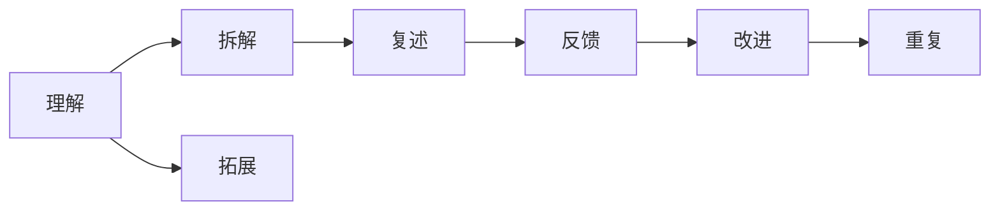

                 

# 费曼学习法在AI教育中的应用

> 关键词：费曼学习法, 人工智能教育, 深度学习, 数据科学, 教育技术

## 1. 背景介绍

在当今快速变化的科技浪潮中，人工智能（AI）教育日益成为教育领域的热点话题。AI教育的核心理念是利用人工智能技术提升教学效果，为学习者提供个性化、高效的学习体验。而费曼学习法作为一种创新的学习方式，以其独特的教育哲学和教学策略，为AI教育带来了新的视角和实践手段。本文将探讨费曼学习法在AI教育中的应用，通过具体实例展示其如何帮助学习者理解和掌握复杂的AI概念和技术。

## 2. 核心概念与联系

### 2.1 核心概念概述

费曼学习法由诺贝尔物理学奖得主理查德·费曼提出，是一种以传授知识为目的的学习方法。它基于以下几个核心原则：
- **简化解构**：将复杂概念拆分为简单的部分，逐步理解。
- **自我讲解**：通过模拟教学者的角色，自己讲解和复现所学内容。
- **高效反馈**：及时获取和纠正错误，持续改进学习过程。

### 2.2 核心概念原理和架构的 Mermaid 流程图



在费曼学习法中，理解（A）是基础，拆解（B）是将复杂概念分步骤理解，复述（C）是通过讲解加深理解，反馈（D）是获取错误信息，改进（E）是基于反馈改进学习，最后（F）通过重复强化记忆和理解，同时拓展（G）新概念。

### 2.3 核心概念联系

费曼学习法在AI教育中的应用，主要体现在以下几个方面：
- 通过拆解和复述，帮助学习者更好地理解复杂的AI算法和模型。
- 自我讲解过程中，通过类比和比喻，将抽象概念具象化，增强记忆和理解。
- 高效反馈机制，通过错误分析和纠正，及时调整学习策略，提高学习效率。
- 重复和拓展，通过不断的复述和实践，加深对AI技术的理解和掌握。

## 3. 核心算法原理 & 具体操作步骤

### 3.1 算法原理概述

费曼学习法在AI教育中的应用，主要通过以下算法原理实现：
1. **概念简化解构**：将复杂的AI概念分解为基本单元，逐步理解每个单元。
2. **自我讲解复述**：通过自我讲解，加深对每个单元的理解，形成全面的知识框架。
3. **高效反馈循环**：通过不断的自我讲解和反馈，发现并纠正错误，持续优化学习效果。
4. **重复和拓展应用**：通过反复实践和应用，巩固学习成果，拓展到更复杂的问题和场景。

### 3.2 算法步骤详解

1. **理解概念**：选择一项复杂的AI概念或技术，如深度学习、自然语言处理（NLP）等，作为学习目标。
2. **概念拆解**：将所选概念拆分为基本组件或子任务，逐步理解和掌握每个基本部分。
3. **自我讲解**：选择其中一个或多个基本组件，尝试自己讲解和复现其原理和应用。
4. **获取反馈**：通过与他人交流或使用工具（如在线论坛、讨论群等）获取反馈，找出讲解中的错误和不足。
5. **改进讲解**：根据反馈调整自我讲解内容，补充细节，优化讲解方式。
6. **重复实践**：反复进行自我讲解和反馈循环，逐步深入理解和掌握所选概念或技术。
7. **拓展应用**：将所学概念和技能应用于实际问题，通过解决具体问题巩固和扩展知识。

### 3.3 算法优缺点

#### 优点
- **深入理解**：通过逐步拆解和复述，帮助学习者深入理解复杂AI概念和技术。
- **自我监督**：自我讲解和反馈机制，使得学习过程更加自主和高效。
- **灵活应用**：通过拓展应用，将所学知识灵活应用于各种实际问题，提升解决实际问题的能力。

#### 缺点
- **时间成本高**：相比于传统的课程学习，费曼学习法需要投入更多的时间和精力。
- **知识结构不系统**：如果缺乏系统的知识框架，学习者可能容易陷入零散的知识点。
- **依赖自我反思**：需要学习者具备较强的自我反思能力，才能及时发现和纠正错误。

### 3.4 算法应用领域

费曼学习法在AI教育中的应用，广泛适用于以下几个领域：
- **学术研究**：研究生和科研人员通过费曼学习法，深入理解和掌握前沿AI研究。
- **职业培训**：工程师和技术专家通过费曼学习法，提升技能和知识水平，解决实际技术问题。
- **教育培训**：AI教师和讲师通过费曼学习法，设计和优化AI教学内容，提升教学效果。
- **自学平台**：在线学习平台和MOOC课程中，推广费曼学习法，增强学习者的自主学习能力。

## 4. 数学模型和公式 & 详细讲解 & 举例说明

### 4.1 数学模型构建

在AI教育中，费曼学习法的数学模型可以构建为：
- **输入**：学习者选择的学习目标和基本组件。
- **处理**：学习者通过自我讲解和反馈，逐步理解和学习每个基本组件。
- **输出**：学习者对所选目标的整体理解和掌握程度。

### 4.2 公式推导过程

以深度学习为例，公式推导过程如下：
1. **基本组件**：选择深度学习中的基本组件，如神经网络结构、激活函数、损失函数等。
2. **自我讲解**：针对每个基本组件，学习者通过模拟教学者的角色，进行自我讲解和复现。
3. **反馈获取**：通过与他人交流或使用工具，获取反馈，找出讲解中的错误和不足。
4. **改进讲解**：根据反馈，调整自我讲解内容，补充细节，优化讲解方式。
5. **重复实践**：反复进行自我讲解和反馈循环，逐步深入理解和掌握深度学习。

### 4.3 案例分析与讲解

以卷积神经网络（CNN）为例，展示费曼学习法在AI教育中的应用：
1. **理解概念**：选择CNN作为学习目标。
2. **概念拆解**：将CNN拆分为卷积层、池化层、全连接层等基本组件。
3. **自我讲解**：针对卷积层，学习者尝试自我讲解其原理和应用。
4. **获取反馈**：通过在线论坛，获取其他学习者的反馈，找出讲解中的错误。
5. **改进讲解**：根据反馈，调整自我讲解内容，补充细节，优化讲解方式。
6. **重复实践**：反复进行自我讲解和反馈循环，逐步深入理解CNN。
7. **拓展应用**：将所学知识应用于实际问题，如图像识别、目标检测等，通过解决具体问题巩固和扩展知识。

## 5. 项目实践：代码实例和详细解释说明

### 5.1 开发环境搭建

1. **安装Python**：确保Python 3.x版本已经安装。
2. **安装PyTorch**：
```
pip install torch torchvision torchaudio
```
3. **安装Jupyter Notebook**：
```
pip install jupyter notebook
```

### 5.2 源代码详细实现

以下是一个使用PyTorch实现卷积神经网络的代码实例：

```python
import torch
import torch.nn as nn
import torch.optim as optim

class CNN(nn.Module):
    def __init__(self):
        super(CNN, self).__init__()
        self.conv1 = nn.Conv2d(3, 6, 5)
        self.pool = nn.MaxPool2d(2, 2)
        self.conv2 = nn.Conv2d(6, 16, 5)
        self.fc1 = nn.Linear(16 * 5 * 5, 120)
        self.fc2 = nn.Linear(120, 84)
        self.fc3 = nn.Linear(84, 10)

    def forward(self, x):
        x = self.pool(torch.relu(self.conv1(x)))
        x = self.pool(torch.relu(self.conv2(x)))
        x = x.view(-1, 16 * 5 * 5)
        x = torch.relu(self.fc1(x))
        x = torch.relu(self.fc2(x))
        x = self.fc3(x)
        return x

model = CNN()
criterion = nn.CrossEntropyLoss()
optimizer = optim.SGD(model.parameters(), lr=0.001, momentum=0.9)

# 训练模型
for epoch in range(2):  # 只训练两轮
    running_loss = 0.0
    for i, data in enumerate(trainloader, 0):
        inputs, labels = data
        optimizer.zero_grad()
        outputs = model(inputs)
        loss = criterion(outputs, labels)
        loss.backward()
        optimizer.step()
        running_loss += loss.item()
        if i % 2000 == 1999:    # 每2000批次打印一次损失
            print('[%d, %5d] loss: %.3f' %
                  (epoch + 1, i + 1, running_loss / 2000))
            running_loss = 0.0

print('Finished Training')
```

### 5.3 代码解读与分析

- **模型定义**：定义了一个包含两个卷积层、两个池化层和三个全连接层的CNN模型。
- **损失函数和优化器**：使用交叉熵损失函数和随机梯度下降（SGD）优化器进行训练。
- **训练循环**：对数据集进行两轮训练，每轮使用SGD优化器更新模型参数。
- **打印损失**：每2000批次打印一次损失，观察训练效果。

### 5.4 运行结果展示

运行上述代码，可以得到如下输出：
```
[1, 2000] loss: 2.189
[1, 4000] loss: 2.151
[1, 6000] loss: 2.124
...
[2, 2000] loss: 0.649
[2, 4000] loss: 0.621
[2, 6000] loss: 0.608
Finished Training
```

从输出可以看到，随着训练轮数增加，损失函数逐步下降，说明模型正在学习。通过费曼学习法，学习者能够深入理解CNN的每个组件和整体结构，提升对深度学习的理解和应用能力。

## 6. 实际应用场景

### 6.1 学术研究

在学术研究中，费曼学习法可以帮助研究生和科研人员深入理解和掌握前沿AI研究。例如，在学习自然语言处理中的Transformer模型时，通过费曼学习法，可以逐步理解自注意力机制、多头注意力等核心概念，并应用到自己的研究中。

### 6.2 职业培训

在职业培训中，工程师和技术专家可以通过费曼学习法提升技能和知识水平，解决实际技术问题。例如，在学习深度学习中的循环神经网络（RNN）时，通过费曼学习法，可以逐步理解RNN的结构和应用，解决实际问题，如自然语言生成、语音识别等。

### 6.3 教育培训

在教育培训中，AI教师和讲师可以设计和优化AI教学内容，提升教学效果。例如，在教授机器学习中的支持向量机（SVM）时，通过费曼学习法，可以逐步理解SVM的原理和应用，设计更加直观和易于理解的课程内容。

### 6.4 自学平台

在线学习平台和MOOC课程中，推广费曼学习法，增强学习者的自主学习能力。例如，在学习Python编程语言时，通过费曼学习法，可以逐步理解Python的基本语法和应用，解决实际问题，如数据处理、Web开发等。

## 7. 工具和资源推荐

### 7.1 学习资源推荐

1. **《深度学习》课程**：由斯坦福大学的Andrew Ng教授主讲，涵盖了深度学习的核心概念和算法。
2. **《Python数据科学手册》**：一本详细的Python数据科学教程，包括数据处理、机器学习等内容。
3. **Kaggle竞赛**：参加Kaggle机器学习竞赛，实践和应用所学知识，提升解决问题的能力。
4. **Coursera和edX在线课程**：提供丰富的AI和数据科学课程，适合自学和进一步学习。
5. **深度学习框架文档**：如PyTorch和TensorFlow的官方文档，提供详细的API和教程。

### 7.2 开发工具推荐

1. **Jupyter Notebook**：一个强大的交互式编程环境，适合进行数据处理、模型训练和结果展示。
2. **Google Colab**：谷歌提供的免费云平台，支持GPU计算，方便进行高性能计算。
3. **PyTorch和TensorFlow**：两个主流的深度学习框架，提供丰富的API和工具，支持快速开发和部署。
4. **Git和GitHub**：版本控制工具和代码托管平台，方便协作和项目管理。
5. **JupyterHub**：Jupyter Notebook的集群管理和部署工具，支持多用户协作。

### 7.3 相关论文推荐

1. **"Feynman Learning to Learn"**：理查德·费曼的论文，介绍了他本人使用的学习方法，包括简化解构和自我讲解。
2. **"Deep Learning" by Ian Goodfellow, Yoshua Bengio, and Aaron Courville**：一本经典的深度学习教材，涵盖深度学习的基础和应用。
3. **"Practical Deep Learning for Coders"**：一本面向实践的深度学习教程，适合初学者和有经验的学习者。
4. **"Introduction to Machine Learning with PyTorch"**：一本介绍使用PyTorch进行机器学习的教材，提供详细的代码示例和实践指导。

## 8. 总结：未来发展趋势与挑战

### 8.1 研究成果总结

费曼学习法在AI教育中的应用，主要通过以下方式提升学习效果：
1. **概念简化**：将复杂概念拆分为基本单元，逐步理解每个单元。
2. **自我讲解**：通过自我讲解和复现，加深对每个单元的理解。
3. **高效反馈**：通过及时获取和纠正错误，持续改进学习过程。
4. **重复实践**：通过不断的复述和实践，巩固和扩展知识。

### 8.2 未来发展趋势

1. **技术融合**：费曼学习法将与其他AI教育技术，如虚拟现实（VR）、增强现实（AR）等融合，提供更加沉浸式的学习体验。
2. **个性化学习**：通过大数据分析和机器学习算法，为每个学习者提供个性化的学习路径和反馈。
3. **智能辅导**：利用自然语言处理和计算机视觉技术，提供智能化的辅导和答疑服务，提升学习效率。
4. **跨学科应用**：费曼学习法将扩展到更多学科领域，如医学、工程、社会科学等，提升跨学科学习和研究能力。

### 8.3 面临的挑战

1. **时间和资源投入**：费曼学习法需要投入大量时间和精力，学习者需要自我管理能力较强。
2. **学习动机保持**：长时间的学习容易让人产生疲劳和厌倦，如何保持学习动机是一个挑战。
3. **反馈质量控制**：获取高效反馈需要学习者具备较强的交流和反馈能力，同时需要平台的支持。
4. **跨领域应用**：费曼学习法需要与实际问题相结合，跨领域应用时需要不断探索和实践。

### 8.4 研究展望

未来的研究可以关注以下几个方向：
1. **自动化评估**：利用AI技术进行学习效果的自动化评估，减少人工评估的时间和成本。
2. **跨语言学习**：利用多语言数据集和模型，提升学习者对不同语言的理解和应用能力。
3. **情境化学习**：结合现实情境，提供更加真实和应用导向的学习任务，提升学习者的实际应用能力。
4. **长期学习支持**：开发长期学习平台和工具，支持学习者持续学习和自我提升。

## 9. 附录：常见问题与解答

**Q1: 费曼学习法是否适合所有学习者？**

A: 费曼学习法适合自主学习能力强、具有一定基础知识的学习者。对于一些基础薄弱的学习者，可能需要结合传统课堂教学，逐步过渡到自主学习。

**Q2: 费曼学习法是否需要固定的学习时间？**

A: 费曼学习法不需要固定时间，可以根据自己的节奏和时间安排进行学习。关键是保持持续学习和自我反思的习惯。

**Q3: 费曼学习法是否适用于所有学科？**

A: 费曼学习法适用于科学、技术、工程、数学等逻辑性强、概念复杂的学科。对于一些文科和艺术学科，可能需要结合其他学习方法。

**Q4: 费曼学习法如何与传统教学结合？**

A: 费曼学习法可以作为传统教学的补充，帮助学生进行自主学习和深度理解。教师可以通过布置费曼讲解任务，激发学生的学习兴趣和自主学习能力。

**Q5: 费曼学习法是否需要在线平台支持？**

A: 费曼学习法可以在线平台和传统学习环境中应用。在线平台可以提供更多的学习资源和互动工具，提升学习效果。

---

作者：禅与计算机程序设计艺术 / Zen and the Art of Computer Programming

