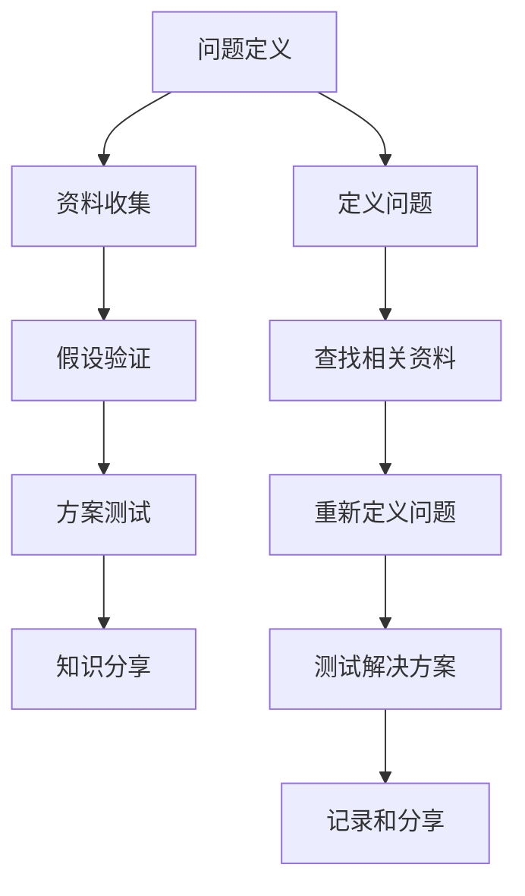

                 

# 费曼提问法在管理问题诊断中的应用

在管理实践中，问题诊断是一项关键活动，能够帮助我们识别问题的根源，找到有效的解决方案。然而，问题诊断通常是一个复杂的过程，需要敏锐的洞察力和系统的方法。费曼提问法（Feynman Technique），源自著名物理学家理查德·费曼，是一种高效的知识内化和问题解决的思维方式。本文将探讨费曼提问法在管理问题诊断中的应用，帮助管理者提升问题诊断的深度和广度。

## 1. 背景介绍

### 1.1 问题由来
在快速变化的市场环境中，企业面临着来自技术、市场、供应链等多方面的挑战。有效的问题诊断不仅能够帮助企业迅速定位问题，还能够为企业提供切实可行的解决方案。然而，问题诊断通常涉及复杂的信息处理和逻辑推理，如何在短时间内找到问题的本质，是管理者必须面对的挑战。费曼提问法通过提问的方式，帮助个体深度理解问题，理清思路，是一种非常适合管理问题诊断的方法。

### 1.2 问题核心关键点
费曼提问法主要包括以下几个步骤：
- 定义问题
- 查找相关资料
- 重新定义问题
- 测试解决方案
- 记录和分享

这些步骤简洁明了，易于实施，但能够有效提升问题诊断的准确性和效率。通过反复提问和回答，费曼提问法帮助人们从多角度、深层次地理解问题，找到根本原因。

## 2. 核心概念与联系

### 2.1 核心概念概述

费曼提问法是一种通过连续提问和回答来深化理解，进而解决复杂问题的思维工具。其核心思想是通过不断的提问和回答，逐步接近问题的本质，找到可行的解决方案。费曼提问法在管理问题诊断中的应用，可以总结为以下几个关键概念：

- **问题定义**：明确问题的本质和背景，确保问题定义的准确性和可操作性。
- **资料收集**：通过多种渠道收集与问题相关的信息，为问题分析提供支持。
- **假设验证**：基于收集到的资料，提出假设并进行验证，逐步接近问题的真相。
- **方案测试**：通过小规模的试点测试，评估方案的有效性，为大规模实施提供依据。
- **知识分享**：将问题诊断和解决方案记录下来，与团队成员分享，提升团队的集体智慧。

这些概念共同构成了费曼提问法的应用框架，帮助管理者系统、高效地解决管理问题。

### 2.2 核心概念原理和架构的 Mermaid 流程图

这个流程图展示了费曼提问法在管理问题诊断中的应用流程。通过定义问题、查找资料、重新定义问题、测试解决方案、记录和分享，形成一个完整的闭环，帮助管理者系统、高效地解决管理问题。

## 3. 核心算法原理 & 具体操作步骤

### 3.1 算法原理概述

费曼提问法通过反复提问和回答的方式，帮助个体深入理解问题，找到根本原因。其核心原理包括以下几个方面：

1. **问题定义**：明确问题的边界和背景，确保问题定义的准确性和可操作性。
2. **资料收集**：通过多种渠道收集与问题相关的信息，为问题分析提供支持。
3. **假设验证**：基于收集到的资料，提出假设并进行验证，逐步接近问题的真相。
4. **方案测试**：通过小规模的试点测试，评估方案的有效性，为大规模实施提供依据。
5. **知识分享**：将问题诊断和解决方案记录下来，与团队成员分享，提升团队的集体智慧。

### 3.2 算法步骤详解

以下详细阐述费曼提问法在管理问题诊断中的应用步骤：

**Step 1: 定义问题**
- 确定问题的范围和背景。使用Who, What, When, Where, Why, How等提问方式，确保问题定义的准确性和可操作性。
- 记录问题定义，以便后续反复验证和修改。

**Step 2: 查找相关资料**
- 通过多种渠道收集与问题相关的信息，如历史数据、案例分析、专家意见等。
- 整理和分析资料，提取关键信息和模式。

**Step 3: 重新定义问题**
- 基于收集到的资料，重新审视问题，提出新的疑问和假设。
- 与团队成员讨论，通过提问和回答，深化理解，调整问题定义。

**Step 4: 测试解决方案**
- 设计小规模的试点测试，验证假设的可行性。
- 记录测试结果，评估方案的有效性。

**Step 5: 记录和分享**
- 将问题诊断和解决方案记录下来，形成文档。
- 与团队成员分享，通过讨论和反馈，进一步优化解决方案。

### 3.3 算法优缺点

费曼提问法在管理问题诊断中的应用具有以下优点：

- **深度理解**：通过反复提问和回答，帮助个体深入理解问题的本质，找到根本原因。
- **系统性**：步骤清晰，易于实施，能够系统、高效地解决问题。
- **团队协作**：促进团队成员之间的讨论和反馈，提升团队的集体智慧。

同时，该方法也存在一定的局限性：

- **时间成本高**：费曼提问法涉及多个步骤，每个步骤都需要花费时间进行分析和讨论。
- **依赖个体**：费曼提问法的效果很大程度上依赖于提问者的洞察力和知识水平。

尽管存在这些局限性，但就目前而言，费曼提问法仍是一种非常有效的管理问题诊断工具。未来相关研究的重点在于如何进一步降低时间成本，提高团队协作效率。

### 3.4 算法应用领域

费曼提问法在管理问题诊断中的应用领域非常广泛，包括但不限于：

- 企业战略规划：通过费曼提问法，明确企业战略目标，评估战略可行性和效果。
- 项目风险管理：识别项目中的风险因素，制定风险应对措施。
- 组织变革：分析组织结构和文化，制定变革策略，推动组织转型。
- 供应链优化：通过费曼提问法，识别供应链中的瓶颈和问题，提升供应链效率。
- 产品开发：分析市场需求和技术趋势，优化产品设计和功能。

以上领域只是费曼提问法应用的一部分，随着其在实际管理实践中的不断推广，相信费曼提问法将在更多场景中得到应用，推动管理水平的提升。

## 4. 数学模型和公式 & 详细讲解 & 举例说明

费曼提问法在管理问题诊断中的应用，虽然不涉及复杂的数学模型和公式，但可以通过以下步骤来帮助理解：

1. **问题定义**：使用Who, What, When, Where, Why, How等提问方式，确保问题定义的准确性和可操作性。
2. **资料收集**：通过多种渠道收集与问题相关的信息，如历史数据、案例分析、专家意见等。
3. **重新定义问题**：基于收集到的资料，重新审视问题，提出新的疑问和假设。
4. **测试解决方案**：设计小规模的试点测试，验证假设的可行性。
5. **记录和分享**：将问题诊断和解决方案记录下来，与团队成员分享，通过讨论和反馈，进一步优化解决方案。

## 5. 项目实践：代码实例和详细解释说明

费曼提问法在管理问题诊断中的应用，虽然不需要编写代码，但可以通过项目管理工具来辅助实施。以下是一个基于项目管理工具（如JIRA、Trello等）的费曼提问法应用示例：

**Step 1: 定义问题**
- 在项目管理工具中创建一个问题（Issue），描述问题的背景和目标。
- 在问题描述中，使用Who, What, When, Where, Why, How等提问方式，确保问题定义的准确性和可操作性。

**Step 2: 查找相关资料**
- 在问题描述中，记录收集到的相关资料，如历史数据、案例分析、专家意见等。
- 在项目计划中，安排收集资料的任务，分配给相关人员。

**Step 3: 重新定义问题**
- 在项目管理工具中，创建一个新的问题（Issue），记录重新定义的问题。
- 在问题描述中，使用提问方式，提出新的疑问和假设。

**Step 4: 测试解决方案**
- 在项目管理工具中，创建一个新的任务（Task），描述测试方案。
- 安排试点测试的任务，分配给相关人员。
- 在任务完成后，记录测试结果。

**Step 5: 记录和分享**
- 在项目管理工具中，创建一个新的问题（Issue），记录问题和解决方案。
- 在问题描述中，详细记录问题和解决方案。
- 在项目计划中，安排知识分享的任务，分配给团队成员。

通过项目管理工具，费曼提问法的应用变得更加系统和规范，能够更好地指导团队进行问题诊断和解决方案的实施。

## 6. 实际应用场景

### 6.1 企业战略规划

在企业战略规划中，费曼提问法可以帮助管理者明确战略目标，评估战略可行性和效果。具体步骤如下：

**Step 1: 定义问题**
- 明确企业的战略目标，使用Who, What, When, Where, Why, How等提问方式，确保问题定义的准确性和可操作性。
- 记录问题定义，以便后续反复验证和修改。

**Step 2: 查找相关资料**
- 收集与战略目标相关的历史数据、市场分析、专家意见等。
- 整理和分析资料，提取关键信息和模式。

**Step 3: 重新定义问题**
- 基于收集到的资料，重新审视战略目标，提出新的疑问和假设。
- 与团队成员讨论，通过提问和回答，深化理解，调整战略目标。

**Step 4: 测试解决方案**
- 设计小规模的试点测试，验证假设的可行性。
- 记录测试结果，评估战略效果的有效性。

**Step 5: 记录和分享**
- 将战略规划和解决方案记录下来，形成文档。
- 与团队成员分享，通过讨论和反馈，进一步优化战略规划。

通过费曼提问法，企业可以系统、高效地进行战略规划，确保战略目标的准确性和可行性。

### 6.2 项目风险管理

在项目风险管理中，费曼提问法可以帮助识别项目中的风险因素，制定风险应对措施。具体步骤如下：

**Step 1: 定义问题**
- 明确项目的风险因素，使用Who, What, When, Where, Why, How等提问方式，确保问题定义的准确性和可操作性。
- 记录问题定义，以便后续反复验证和修改。

**Step 2: 查找相关资料**
- 收集与风险因素相关的历史数据、案例分析、专家意见等。
- 整理和分析资料，提取关键信息和模式。

**Step 3: 重新定义问题**
- 基于收集到的资料，重新审视风险因素，提出新的疑问和假设。
- 与团队成员讨论，通过提问和回答，深化理解，调整风险因素。

**Step 4: 测试解决方案**
- 设计小规模的试点测试，验证假设的可行性。
- 记录测试结果，评估风险应对措施的有效性。

**Step 5: 记录和分享**
- 将风险管理方案记录下来，形成文档。
- 与团队成员分享，通过讨论和反馈，进一步优化风险管理方案。

通过费曼提问法，项目团队可以系统、高效地进行风险管理，确保项目顺利进行。

## 7. 工具和资源推荐

### 7.1 学习资源推荐

为了帮助管理者系统掌握费曼提问法在管理问题诊断中的应用，这里推荐一些优质的学习资源：

1. 《费曼学习法》系列博文：由费曼学习法专家撰写，深入浅出地介绍了费曼学习法的原理、方法和应用案例。

2. 《高效能人士的七个习惯》：史蒂芬·柯维所著，介绍了高效能人士的七个习惯，包括积极主动、以终为始、要事第一等，能够帮助管理者提升问题诊断能力。

3. 《深度思考》系列书籍：由多位思考力专家合著，系统介绍了深度思考的方法和技巧，提升管理者的思维深度和广度。

4. 《管理者的五个问题》：霍华德·斯特恩顿所著，通过五个关键问题，帮助管理者进行系统、高效的问题诊断。

通过对这些资源的学习实践，相信你一定能够快速掌握费曼提问法的精髓，并用于解决实际的业务问题。

### 7.2 开发工具推荐

费曼提问法在管理问题诊断中的应用，不需要编写代码，但可以通过一些项目管理工具来辅助实施。以下是几款常用的项目管理工具：

1. JIRA：功能强大的项目管理工具，支持问题定义、任务安排、进度跟踪等，适合团队协作。

2. Trello：简单易用的项目管理工具，通过看板方式，帮助团队进行任务管理和进度跟踪。

3. Asana：灵活的项目管理工具，支持任务分配、进度跟踪、团队协作等功能。

通过这些工具，费曼提问法的应用变得更加系统和规范，能够更好地指导团队进行问题诊断和解决方案的实施。

### 7.3 相关论文推荐

费曼提问法在管理问题诊断中的应用，虽然涉及的主要是管理实践，但也有一系列相关的研究和论文，以下是几篇代表性的论文，推荐阅读：

1. "Feynman Technique: A Learning Method to Enhance Problem-Solving Skills"（费曼学习法：提升问题解决能力的学习方法）
2. "Deep Thinking: A Guide to Becoming a Better Thinker"（深度思考：成为更好思考者的指南）
3. "The Art of Problem Solving: Strategies for Systematic Problem Diagnosis and Solutions"（问题解决的艺术：系统性问题诊断和解决方案策略）

这些论文代表了费曼提问法在管理问题诊断领域的最新研究成果，通过阅读这些论文，可以进一步加深对费曼提问法的理解和应用。

## 8. 总结：未来发展趋势与挑战

### 8.1 总结

本文对费曼提问法在管理问题诊断中的应用进行了全面系统的介绍。首先阐述了费曼提问法的基本原理和应用步骤，明确了其在管理问题诊断中的独特价值。其次，通过具体案例，展示了费曼提问法在企业战略规划、项目风险管理中的应用效果，验证了该方法的实用性和有效性。最后，本文精选了费曼提问法的学习资源和开发工具，力求为管理者提供全方位的技术指引。

通过本文的系统梳理，可以看到，费曼提问法作为一种高效的问题解决工具，在管理问题诊断中具有广泛的应用前景。其系统、高效的方法论，能够帮助管理者深入理解问题，找到切实可行的解决方案，提升管理水平。

### 8.2 未来发展趋势

展望未来，费曼提问法在管理问题诊断中的应用将呈现以下几个发展趋势：

1. **系统化应用**：随着企业信息化程度的提升，项目管理工具将越来越成熟，费曼提问法在项目管理中的应用将更加系统和规范。

2. **数据驱动**：通过大数据和人工智能技术，费曼提问法将能够更高效地收集、分析和利用数据，提升问题诊断的准确性和效率。

3. **多模态融合**：结合多种数据源和分析方法，费曼提问法将能够更好地理解和解决复杂问题。

4. **实时反馈**：通过实时数据反馈和调整，费曼提问法将能够更灵活地适应变化的环境和问题。

5. **跨领域应用**：费曼提问法不仅适用于管理领域，还将在更多领域（如医疗、教育、金融等）得到应用，提升各个领域的决策能力和管理水平。

### 8.3 面临的挑战

尽管费曼提问法在管理问题诊断中具有诸多优势，但在推广应用过程中，仍面临以下挑战：

1. **时间成本高**：费曼提问法涉及多个步骤，每个步骤都需要花费时间进行分析和讨论，这对于时间紧张的管理者来说是一大挑战。

2. **依赖个体**：费曼提问法的效果很大程度上依赖于提问者的洞察力和知识水平，如何提升提问者的素质和能力，是关键问题。

3. **数据管理**：在应用费曼提问法的过程中，需要收集和分析大量的数据，如何有效管理数据，避免信息过载，是一大挑战。

4. **团队协作**：费曼提问法需要团队成员的协作和讨论，如何提升团队协作效率，激发团队成员的创新思维，是一大挑战。

5. **技术融合**：如何将费曼提问法与大数据、人工智能等技术进行深度融合，提升问题诊断的效率和效果，是一大挑战。

### 8.4 研究展望

面对费曼提问法面临的挑战，未来的研究需要在以下几个方面寻求新的突破：

1. **自动化工具**：开发自动化工具，辅助管理者进行问题定义、资料收集、假设验证等步骤，降低时间成本。

2. **培训和提升**：通过培训和提升提问者的素质和能力，确保费曼提问法的有效应用。

3. **数据管理技术**：研究高效的数据管理技术，提升数据收集、分析和利用的效率。

4. **团队协作机制**：建立高效的团队协作机制，提升团队成员的协作效率和创新能力。

5. **技术融合**：结合大数据、人工智能等技术，提升问题诊断的效率和效果。

这些研究方向的探索，必将引领费曼提问法在管理问题诊断领域的发展，提升问题诊断的深度和广度，推动管理水平的提升。

## 9. 附录：常见问题与解答

**Q1：费曼提问法是否适用于所有管理问题？**

A: 费曼提问法适用于大多数管理问题，尤其是那些需要系统分析和深度理解的问题。但对于一些简单或紧急的问题，费曼提问法可能显得过于复杂。

**Q2：如何提升费曼提问法的应用效果？**

A: 提升费曼提问法的应用效果，可以通过以下方式：
1. 选择适当的提问方式，确保问题定义的准确性和可操作性。
2. 收集和分析多渠道的资料，确保假设的全面性和有效性。
3. 与团队成员进行深入讨论和反馈，通过提问和回答，深化理解。

**Q3：费曼提问法是否需要耗费大量时间？**

A: 费曼提问法涉及多个步骤，每个步骤都需要花费时间进行分析和讨论，对于时间紧张的管理者来说是一大挑战。但通过自动化工具和高效协作机制，可以显著降低时间成本。

**Q4：费曼提问法是否需要高超的提问技巧？**

A: 费曼提问法的应用效果很大程度上依赖于提问者的洞察力和知识水平。通过培训和提升提问者的素质和能力，可以提升费曼提问法的应用效果。

**Q5：费曼提问法是否可以与其他方法结合使用？**

A: 费曼提问法可以与其他问题解决方法和工具（如SWOT分析、鱼骨图等）结合使用，提升问题诊断的效率和效果。

通过这些问题的解答，希望读者能够更好地理解和应用费曼提问法，提升管理问题诊断的能力。

---

作者：禅与计算机程序设计艺术 / Zen and the Art of Computer Programming

