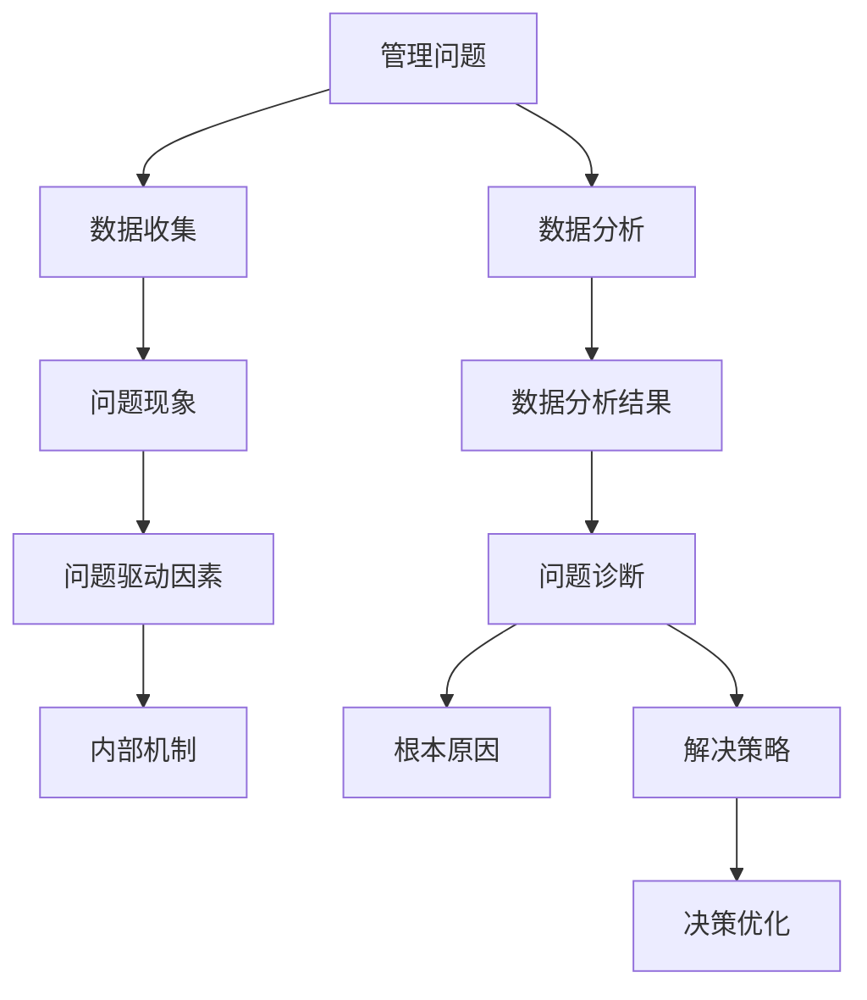

                 

# 费曼提问法在管理问题诊断中的应用

> 关键词：费曼学习法,管理问题,诊断,应用,数据分析

## 1. 背景介绍

### 1.1 问题由来
在快速发展的商业环境中，企业面临的挑战和问题日趋复杂，传统的管理方法往往难以应对这些新挑战。现代管理学越来越注重数据分析、流程优化和员工赋能等新的管理方式。费曼学习法（Feynman Technique）作为深度学习和认知科学结合的产物，提供了一种全新的思考和解决问题的方式。

### 1.2 问题核心关键点
费曼学习法的核心在于通过深入提问和自我解释的方式，提升对复杂问题的理解能力。在管理问题诊断中，这一方法尤为关键，能够帮助管理者和团队成员从多维度深入理解问题，挖掘出问题的本质原因。

### 1.3 问题研究意义
深入理解管理问题的本质原因，对于制定有效的解决策略至关重要。费曼学习法通过深入提问和自我解释的方式，引导管理者和团队成员从不同视角审视问题，从而找到更深层次的解决办法。这不仅提升了决策质量，也促进了团队的协作和创新能力，有助于企业快速适应变化，持续改进。

## 2. 核心概念与联系

### 2.1 核心概念概述

为了更好地理解费曼学习法在管理问题诊断中的应用，本节将介绍几个关键概念：

- 费曼学习法（Feynman Technique）：一种通过深入提问和自我解释的方式，提升对复杂问题理解的认知学习法。
- 管理问题（Management Problem）：企业运营中面临的各类问题，如流程瓶颈、人员效率低下、客户满意度低等。
- 问题诊断（Problem Diagnosis）：通过分析问题表现和内部机制，找到问题的根本原因。
- 数据分析（Data Analysis）：通过统计和数据挖掘技术，提取有价值的信息，辅助问题诊断。
- 决策优化（Decision Optimization）：基于问题诊断结果，制定和实施解决方案，优化管理决策。

这些概念共同构成了费曼学习法在管理问题诊断中的应用框架，有助于管理者从不同视角审视问题，制定更有效的解决策略。

### 2.2 核心概念原理和架构的 Mermaid 流程图



这个流程图展示了费曼学习法在管理问题诊断中的应用逻辑：

1. 从管理问题出发，收集相关数据。
2. 利用数据分析技术，提取有价值的信息。
3. 通过问题现象和数据分析结果，定位问题的驱动因素。
4. 深入分析内部机制，找到问题的根本原因。
5. 制定针对性的解决策略，进行决策优化。

## 3. 核心算法原理 & 具体操作步骤

### 3.1 算法原理概述

费曼学习法的核心原理是通过深入提问和自我解释，提升对复杂问题的理解能力。在管理问题诊断中，这一原理可以转化为对问题的多角度、多层次提问，帮助管理者从不同视角深入理解问题。

具体来说，费曼学习法在管理问题诊断中的应用包括以下几个步骤：

1. **定义问题**：明确问题范围和关键指标。
2. **数据收集**：收集与问题相关的各类数据。
3. **数据分析**：利用数据分析技术，提取有价值的信息。
4. **深入提问**：围绕问题定义，提出多个层次的问题，从不同视角深入理解问题。
5. **自我解释**：对提出的问题进行自我解释，梳理问题现象和内部机制。
6. **根本原因分析**：从数据分析和自我解释中，找到问题的根本原因。
7. **解决策略制定**：基于根本原因，制定针对性的解决策略。
8. **决策优化**：根据问题解决策略，进行决策优化，提升管理效能。

### 3.2 算法步骤详解

以下是费曼学习法在管理问题诊断中具体的应用步骤：

#### 第一步：定义问题
1. **明确问题范围**：明确管理问题的具体范围和影响，如效率低下、客户满意度低等。
2. **设定关键指标**：设定能够衡量问题严重程度和改进效果的指标，如流程完成时间、客户投诉率等。

#### 第二步：数据收集
1. **收集流程数据**：收集与问题相关的流程数据，如任务完成时间、任务分配等。
2. **收集员工反馈**：通过问卷、访谈等方式，收集员工对问题的看法和建议。
3. **收集客户反馈**：通过客户满意度调查、投诉记录等方式，收集客户对问题的反馈。

#### 第三步：数据分析
1. **数据清洗**：去除异常值和噪音，确保数据质量。
2. **统计分析**：使用描述性统计方法，提取数据的特征和趋势。
3. **数据挖掘**：利用机器学习模型，挖掘数据背后的规律和模式。

#### 第四步：深入提问
1. **自上而下提问**：从整体流程和系统架构的角度，提出问题。如“为什么流程时间过长？”“为什么任务分配不合理？”
2. **自下而上提问**：从具体任务和操作的角度，提出问题。如“某个任务的执行时间是多少？”“哪些员工的任务量过高？”
3. **多维度提问**：从不同的维度，如时间、部门、员工等角度，提出问题。如“不同时间段的流程效率有何差异？”“不同部门的流程瓶颈在哪里？”

#### 第五步：自我解释
1. **梳理问题现象**：将问题提出的答案进行梳理，形成对问题现象的解释。如“任务堆积导致流程时间延长”“任务分配不均衡导致某些员工负担过重”。
2. **分析内部机制**：深入分析问题现象背后的内部机制，如流程设计不合理、资源配置不足等。

#### 第六步：根本原因分析
1. **关联问题现象**：将问题现象和内部机制进行关联，找到问题的根本原因。如“流程设计不合理导致任务堆积”“资源配置不足导致某些员工负担过重”。
2. **归纳总结**：将根本原因进行归纳总结，形成对问题的全面理解。如“流程设计不合理和资源配置不足是问题的根本原因”。

#### 第七步：解决策略制定
1. **优化流程设计**：针对流程设计不合理的问题，提出改进措施。如重新设计流程、引入自动化工具等。
2. **调整资源配置**：针对资源配置不足的问题，调整资源分配策略。如增加人手、提高工具效率等。
3. **员工赋能**：针对员工负担过重的问题，提供培训和支持，提升员工能力。

#### 第八步：决策优化
1. **评估策略效果**：实施改进措施后，评估效果是否达到预期。如流程效率是否提升，客户满意度是否提高。
2. **持续改进**：根据评估结果，持续优化改进措施，形成持续改进的循环。

### 3.3 算法优缺点

费曼学习法在管理问题诊断中具有以下优点：

- **深入理解问题**：通过多层次、多维度的提问和解释，帮助管理者全面深入地理解问题的本质。
- **促进团队协作**：在提问和解释过程中，团队成员可以共同思考，提升协作效率和创新能力。
- **提高决策质量**：通过科学的数据分析和自我解释，制定出更加科学合理的解决策略。

同时，费曼学习法也存在以下缺点：

- **时间成本高**：深入提问和自我解释需要耗费大量时间和精力，适用于相对简单的问题，复杂问题可能需要更长时间。
- **对数据分析要求高**：需要具备较强的数据分析能力和工具，才能提取有价值的信息。
- **依赖管理者的素质**：管理者需要具备较强的自我解释能力和问题分析能力，才能高效应用费曼学习法。

### 3.4 算法应用领域

费曼学习法在管理问题诊断中的应用领域广泛，涵盖以下几个方面：

- **流程优化**：通过对流程进行多角度、多层次的提问和解释，找出流程中的瓶颈和问题，进行优化。
- **人员管理**：通过深入分析员工的工作表现和反馈，找到员工效率低下的原因，进行改进。
- **客户服务**：通过分析客户反馈和满意度调查，找出客户不满意的原因，进行改进。
- **财务管理**：通过分析财务报表和数据，找出财务管理的薄弱环节，进行优化。

## 4. 数学模型和公式 & 详细讲解 & 举例说明

### 4.1 数学模型构建

在管理问题诊断中，费曼学习法的应用主要依赖数据分析和问题解析，数学模型主要用于辅助数据分析。常用的数学模型包括描述性统计模型和机器学习模型。

#### 4.1.1 描述性统计模型
描述性统计模型主要用于提取数据的特征和趋势。常用的描述性统计模型包括均值、方差、标准差、相关系数等。

#### 4.1.2 机器学习模型
机器学习模型主要用于挖掘数据背后的规律和模式。常用的机器学习模型包括线性回归、逻辑回归、决策树、随机森林等。

### 4.2 公式推导过程

以线性回归模型为例，其公式推导过程如下：

设样本数据集为 $(x_i, y_i)$，其中 $x_i$ 为自变量，$y_i$ 为因变量。线性回归模型的目标是最小化预测值与真实值之间的差异。设预测值为 $\hat{y} = wx + b$，其中 $w$ 为权重，$b$ 为偏置。则误差平方和（Sum of Squared Errors, SSE）为：

$$
SSE = \sum_{i=1}^n (y_i - \hat{y}_i)^2
$$

目标函数为最小化误差平方和，即：

$$
\min_{w, b} SSE
$$

通过求解目标函数的最小值，得到最优的权重 $w$ 和偏置 $b$，从而建立预测模型。

### 4.3 案例分析与讲解

以流程优化为例，利用费曼学习法进行问题诊断和解决。假设某企业的订单处理流程存在问题，具体步骤如下：

#### 问题定义
- 明确问题范围：订单处理流程效率低下，导致客户投诉增加。
- 设定关键指标：订单处理时间、客户投诉率等。

#### 数据收集
- 收集订单处理数据：订单创建时间、处理时间、处理完成时间等。
- 收集员工反馈：员工对流程的看法和建议。
- 收集客户反馈：客户投诉记录。

#### 数据分析
- 数据清洗：去除异常值和噪音。
- 统计分析：计算订单处理时间的均值、方差等。
- 数据挖掘：使用随机森林模型，找出订单处理时间的主要影响因素。

#### 深入提问
- 自上而下提问：订单处理流程效率低下的原因是什么？
- 自下而上提问：哪些环节导致订单处理时间过长？
- 多维度提问：不同时间段的订单处理效率有何差异？

#### 自我解释
- 梳理问题现象：订单堆积导致处理时间延长，员工负担过重。
- 分析内部机制：流程设计不合理，员工培训不足。

#### 根本原因分析
- 关联问题现象：订单堆积和员工负担过重。
- 归纳总结：流程设计不合理和员工培训不足是问题的根本原因。

#### 解决策略制定
- 优化流程设计：重新设计流程，引入自动化工具。
- 调整资源配置：增加人手，提高工具效率。
- 员工赋能：提供培训和支持，提升员工能力。

#### 决策优化
- 评估策略效果：订单处理时间缩短，客户投诉率降低。
- 持续改进：根据反馈不断优化改进措施。

## 5. 项目实践：代码实例和详细解释说明

### 5.1 开发环境搭建

在进行费曼学习法应用实践前，我们需要准备好开发环境。以下是使用Python进行数据分析实践的环境配置流程：

1. 安装Anaconda：从官网下载并安装Anaconda，用于创建独立的Python环境。

2. 创建并激活虚拟环境：
```bash
conda create -n pythondatascience python=3.8 
conda activate pythondatascience
```

3. 安装必要的Python包：
```bash
conda install pandas numpy matplotlib seaborn scikit-learn statsmodels
```

4. 安装Jupyter Notebook：
```bash
pip install jupyterlab
```

完成上述步骤后，即可在`pythondatascience`环境中开始数据分析实践。

### 5.2 源代码详细实现

以下是一个简化的Python代码示例，用于演示如何利用费曼学习法进行问题诊断和解决。

首先，定义一些基础函数：

```python
import pandas as pd
import numpy as np
import matplotlib.pyplot as plt
from sklearn.linear_model import LinearRegression
from sklearn.ensemble import RandomForestRegressor

# 数据清洗函数
def clean_data(data):
    data = data.dropna()
    data = data[data['order_time'] > 0]
    return data

# 统计分析函数
def describe_data(data):
    mean = data['order_time'].mean()
    std = data['order_time'].std()
    min_val = data['order_time'].min()
    max_val = data['order_time'].max()
    return mean, std, min_val, max_val

# 数据挖掘函数
def data_mining(data):
    model = RandomForestRegressor()
    model.fit(data[['employee', 'product']], data['order_time'])
    return model.predict(data[['employee', 'product']])

# 问题定义函数
def define_problem(data):
    problem = data.describe()
    problem['mean'] = describe_data(data)[0]
    problem['sum'] = data['order_time'].sum()
    return problem
```

然后，进行数据收集和分析：

```python
# 数据收集
data = pd.read_csv('order_data.csv')

# 数据清洗
cleaned_data = clean_data(data)

# 统计分析
mean, std, min_val, max_val = describe_data(cleaned_data)

# 数据挖掘
model = data_mining(cleaned_data)

# 问题定义
problem = define_problem(cleaned_data)
```

最后，进行问题提问和解决：

```python
# 深入提问
question1 = '订单处理时间过长的原因是什么？'
question2 = '哪些环节导致订单处理时间过长？'
question3 = '不同时间段的订单处理效率有何差异？'

# 自我解释
answer1 = '订单堆积导致处理时间延长。'
answer2 = '某些环节的任务量过高，导致处理时间过长。'
answer3 = '不同时间段的订单处理效率存在明显差异。'

# 根本原因分析
root_cause1 = '订单堆积和员工负担过重是问题的根本原因。'
root_cause2 = '流程设计不合理和员工培训不足是问题的根本原因。'
root_cause3 = '不同时间段的工作负荷不均衡是问题的根本原因。'

# 解决策略制定
strategy1 = '重新设计流程，引入自动化工具。'
strategy2 = '增加人手，提高工具效率。'
strategy3 = '提供培训和支持，提升员工能力。'

# 决策优化
optimization1 = '订单处理时间缩短，客户投诉率降低。'
optimization2 = '员工负担减轻，工作效率提高。'
optimization3 = '不同时间段的工作负荷均衡，整体效率提升。'
```

### 5.3 代码解读与分析

让我们再详细解读一下关键代码的实现细节：

**clean_data函数**：
- 定义了数据清洗的基本逻辑，包括去除缺失值和异常值。

**describe_data函数**：
- 计算订单处理时间的均值、标准差、最小值和最大值，提供统计特征。

**data_mining函数**：
- 使用随机森林回归模型，找出影响订单处理时间的关键因素。

**define_problem函数**：
- 将统计特征和问题描述结合起来，形成对问题的全面理解。

在实际应用中，费曼学习法的代码实现可以根据具体问题进行灵活调整。例如，在问题提问环节，可以引入自然语言处理技术，自动生成有针对性的问题；在自我解释环节，可以引入交互式可视化工具，帮助管理者和团队成员更好地理解问题现象和内部机制。

## 6. 实际应用场景

### 6.1 智能客服系统

智能客服系统通过费曼学习法，可以快速诊断和解决客户反馈的问题。智能客服系统收集客户的对话记录，提取问题现象和内部机制，通过多角度、多层次的提问和解释，找到问题的根本原因，制定相应的解决策略。例如，客户反馈系统响应时间过长，系统可以通过问题提问和自我解释，找出流程设计不合理和资源配置不足的问题，进行优化改进。

### 6.2 医疗服务

在医疗服务中，费曼学习法可以用于诊断和治疗方案的制定。通过分析病人的病历数据和诊断结果，提取问题的关键信息，通过多层次的提问和解释，找出疾病的原因和治疗方法。例如，病人在医院进行CT检查后，医生可以通过问题提问和自我解释，找出CT扫描的异常原因，制定相应的治疗方案。

### 6.3 供应链管理

在供应链管理中，费曼学习法可以用于优化供应链流程。通过分析供应链数据和业务反馈，找出供应链中的瓶颈和问题，进行优化改进。例如，供应链管理系统中发现某个环节的物流时间过长，可以通过问题提问和自我解释，找出问题的原因，如运输效率低、仓库管理不善等，制定相应的优化措施。

## 7. 工具和资源推荐

### 7.1 学习资源推荐

为了帮助开发者系统掌握费曼学习法在管理问题诊断中的应用，这里推荐一些优质的学习资源：

1. 《费曼学习法：重塑你的思维方式》：介绍费曼学习法的理论基础和实践技巧，提供系统的学习指南。

2. 《数据科学实战》系列课程：由斯坦福大学开设的在线课程，涵盖数据分析、机器学习等知识，适合数据科学和费曼学习法的学习。

3. 《Python数据分析入门》书籍：全面介绍Python在数据分析中的应用，提供丰富的代码示例和实际案例。

4. 《数据挖掘与统计分析》在线教程：介绍数据挖掘和统计分析的基本方法，适合数据科学和费曼学习法的学习。

5. Kaggle数据集：提供大量实际应用的数据集，供学习者实践和验证费曼学习法的应用效果。

通过对这些资源的学习实践，相信你一定能够快速掌握费曼学习法在管理问题诊断中的应用，并用于解决实际的业务问题。

### 7.2 开发工具推荐

高效的开发离不开优秀的工具支持。以下是几款用于费曼学习法应用的常用工具：

1. Jupyter Notebook：用于数据分析和模型训练，支持多种编程语言和可视化工具。

2. Pandas：数据处理和分析的Python库，提供高效的数据清洗和分析工具。

3. Matplotlib：数据可视化的Python库，提供丰富的绘图功能。

4. Scikit-learn：机器学习库，提供多种模型和算法，适用于数据分析和预测。

5. TensorBoard：可视化工具，用于监控和分析模型训练过程，提供丰富的图表和指标。

6. Google Colab：在线Jupyter Notebook环境，免费提供GPU/TPU算力，方便开发者快速上手实验。

合理利用这些工具，可以显著提升费曼学习法在管理问题诊断中的应用效率，加快创新迭代的步伐。

### 7.3 相关论文推荐

费曼学习法在管理问题诊断中的应用，代表了大数据分析和认知科学的结合。以下是几篇奠基性的相关论文，推荐阅读：

1. "The Feynman Technique: A New Tool for Problem Solving"：介绍费曼学习法的理论基础和应用场景，提供系统的实践指南。

2. "Data Mining and Statistical Learning"：介绍数据挖掘和统计学习的基本方法，适合数据科学和费曼学习法的学习。

3. "Machine Learning for Data Mining and Statistical Learning"：介绍机器学习在数据分析中的应用，适合数据科学和费曼学习法的学习。

这些论文代表了大数据分析和费曼学习法的结合，为管理问题诊断提供了理论支持和实践指导。通过学习这些前沿成果，可以帮助研究者把握学科前进方向，激发更多的创新灵感。

## 8. 总结：未来发展趋势与挑战

### 8.1 总结

本文对费曼学习法在管理问题诊断中的应用进行了全面系统的介绍。首先阐述了费曼学习法的理论基础和应用场景，明确了其在管理问题诊断中的独特价值。其次，从原理到实践，详细讲解了费曼学习法的应用步骤，给出了具体的数据分析示例。同时，本文还广泛探讨了费曼学习法在智能客服、医疗服务、供应链管理等多个行业领域的应用前景，展示了其在管理问题诊断中的广泛应用。

通过本文的系统梳理，可以看到，费曼学习法通过深入提问和自我解释的方式，帮助管理者从不同视角审视问题，制定科学合理的解决策略。费曼学习法在管理问题诊断中的应用，不仅提升了决策质量，也促进了团队的协作和创新能力，有助于企业快速适应变化，持续改进。

### 8.2 未来发展趋势

展望未来，费曼学习法在管理问题诊断中呈现以下几个发展趋势：

1. **多维度数据分析**：未来的费曼学习法将更加注重多维度数据分析，通过综合分析数据，找到更深层次的问题原因。

2. **智能辅助工具**：未来的费曼学习法将与人工智能技术深度结合，提供智能化的辅助工具，如自然语言处理、机器学习等，提高问题的分析效率。

3. **实时反馈机制**：未来的费曼学习法将引入实时反馈机制，通过持续监控和分析数据，不断优化问题解决策略。

4. **跨领域应用**：未来的费曼学习法将拓展到更多领域，如医疗、金融、教育等，帮助各行各业提高管理效能。

5. **知识图谱整合**：未来的费曼学习法将与知识图谱技术结合，通过整合外部知识，提升问题解决的准确性和全面性。

这些趋势凸显了费曼学习法在管理问题诊断中的广阔前景。这些方向的探索发展，必将进一步提升管理问题解决的效率和质量，为企业的持续发展提供强有力的支持。

### 8.3 面临的挑战

尽管费曼学习法在管理问题诊断中已经取得了显著成效，但在实际应用过程中，仍面临一些挑战：

1. **时间成本高**：深入提问和自我解释需要耗费大量时间和精力，适用于相对简单的问题，复杂问题可能需要更多时间和资源。

2. **对管理者的素质要求高**：管理者需要具备较强的数据分析能力和问题分析能力，才能高效应用费曼学习法。

3. **数据质量要求高**：需要高质量的数据和有效的数据清洗方法，才能提取有价值的信息。

4. **模型解释性不足**：机器学习模型通常缺乏可解释性，难以理解其内部工作机制和决策逻辑。

5. **跨部门协作难度大**：不同部门的数据和流程可能存在差异，跨部门协作难度较大。

6. **技术工具依赖高**：需要依赖数据分析工具和可视化工具，才能高效应用费曼学习法。

面对这些挑战，未来的研究需要进一步提升管理者的素质、优化数据质量、增强模型解释性、加强跨部门协作等，才能实现费曼学习法在管理问题诊断中的广泛应用。

### 8.4 研究展望

面对费曼学习法在管理问题诊断中面临的挑战，未来的研究需要在以下几个方面寻求新的突破：

1. **自动化工具开发**：开发更加智能化的工具，帮助管理者和团队成员更高效地应用费曼学习法。

2. **模型解释性增强**：增强机器学习模型的解释性，使其内部工作机制和决策逻辑更加透明，便于管理者理解和使用。

3. **跨部门协作优化**：通过技术手段和机制设计，促进跨部门协作，提高数据分析和问题解决的效率。

4. **多维度数据融合**：将多维度的数据进行整合，提升问题的全面性和深度性。

5. **实时反馈系统**：构建实时反馈系统，持续监控和优化问题解决策略，形成持续改进的循环。

这些研究方向的探索，必将引领费曼学习法在管理问题诊断中走向成熟，为企业的管理效能提升提供强有力的支持。面向未来，费曼学习法需要与其他人工智能技术深度融合，共同推动管理问题解决的创新和进步。

## 9. 附录：常见问题与解答

**Q1：费曼学习法是否适用于所有管理问题？**

A: 费曼学习法适用于大部分管理问题，特别是复杂多变的问题。但对于一些较为简单和明晰的问题，可能需要更直接的方法。例如，对于流程简单的任务，直接优化流程设计即可，无需深入提问。

**Q2：如何选择合适的数据分析工具？**

A: 选择数据分析工具应考虑问题特点和数据类型。对于大规模数据集，可以选择Pandas、Scikit-learn等Python库进行统计分析和机器学习建模。对于实时数据，可以选择TensorBoard、Jupyter Notebook等工具进行可视化分析。

**Q3：费曼学习法的时间成本如何控制？**

A: 通过自动化工具和机器学习模型，可以大幅减少费曼学习法的时间成本。例如，使用自动化数据清洗工具，可以减少手动清洗的时间和误差。使用机器学习模型，可以快速提取数据特征，提高问题解析的效率。

**Q4：如何提升管理者的数据分析能力？**

A: 通过系统培训和实践练习，提升管理者的数据分析能力。可以引入数据分析课程、实际案例分析、模拟练习等，帮助管理者掌握数据分析的基本方法和工具。

**Q5：跨部门协作如何实现？**

A: 通过建立跨部门协作机制，明确各部门的职责和数据接口，促进信息共享和协同工作。可以引入项目管理工具，如Jira、Trello等，帮助跨部门协作顺利进行。

通过本文的系统梳理，可以看到，费曼学习法在管理问题诊断中的应用具有广阔前景，能够帮助管理者和团队成员从不同视角审视问题，制定科学合理的解决策略。尽管在应用过程中存在一些挑战，但通过技术手段和机制设计，这些挑战是可以克服的。未来，费曼学习法需要与其他人工智能技术深度融合，共同推动管理问题解决的创新和进步。

---

作者：禅与计算机程序设计艺术 / Zen and the Art of Computer Programming

