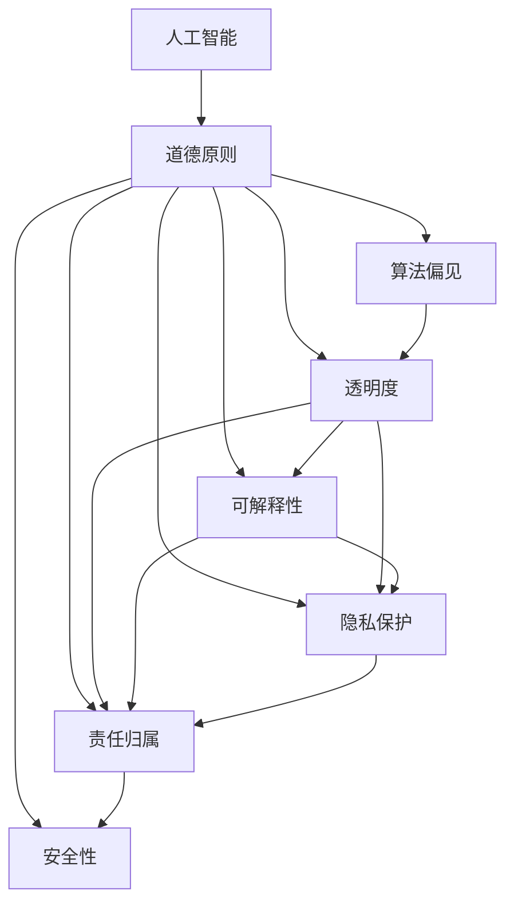

                 

# 道德与 AI：确保人工智能的道德使用

## 1. 背景介绍

随着人工智能技术的迅猛发展，AI在各个领域的应用越来越广泛，从医疗、金融、教育到交通、制造，无处不在。然而，AI技术的快速应用也引发了一系列道德问题，这些问题不仅关系到AI技术本身的发展，也涉及人类社会的伦理和价值观。

### 1.1 问题由来

当前，AI技术在许多领域的应用，如自动驾驶、智能客服、推荐系统等，已经开始对人类生活产生深刻影响。与此同时，AI的滥用和不规范应用也引发了一系列道德风险，包括但不限于隐私侵犯、算法偏见、决策透明度不足等问题。这些问题不仅影响了用户体验，还可能带来社会公平和安全的隐患。

### 1.2 问题核心关键点

AI技术的道德问题涉及多个方面，包括但不限于：

- **隐私保护**：AI系统在处理用户数据时，如何确保隐私信息的保护？
- **算法偏见**：AI系统在训练和应用过程中，如何避免因数据偏差或设计缺陷导致的不公平决策？
- **透明度和可解释性**：AI系统的决策过程如何确保透明度和可解释性？
- **责任归属**：AI系统在发生错误或损害时，责任应当如何归属？
- **安全性**：AI系统在设计和应用过程中，如何确保系统的安全性和稳定性？

这些问题不仅关系到AI技术本身的伦理，还涉及社会伦理、法律责任等深层次问题。因此，确保AI技术的道德使用，不仅是技术发展的必然要求，也是社会进步的必要保障。

## 2. 核心概念与联系

### 2.1 核心概念概述

为更好地理解AI技术的道德问题，本节将介绍几个关键概念及其相互联系：

- **人工智能（AI）**：通过计算机算法和数据处理技术，使机器能够模拟人类智能活动的学科。
- **道德原则**：在AI技术应用中，应当遵循的伦理规范和价值标准。
- **算法偏见**：在训练数据、模型设计或算法实现中，因偏见导致的决策不公。
- **透明度**：AI系统在决策过程中，对用户和开发者应保持的开放性和可解释性。
- **可解释性**：AI系统在执行任务时，对用户应保持的清晰和直观的解释。
- **隐私保护**：在AI系统处理用户数据时，应当采取的保护措施。
- **责任归属**：在AI系统发生错误或损害时，责任应当如何归属。
- **安全性**：在AI系统设计和应用过程中，应当确保系统的稳定和安全。

这些核心概念之间相互联系，共同构成了AI技术的道德框架。只有综合考虑这些因素，才能确保AI技术的健康发展。

### 2.2 核心概念原理和架构的 Mermaid 流程图



这个流程图展示了AI技术的道德框架及其各概念之间的联系。道德原则是指导AI系统设计和应用的根本准则，算法偏见、透明度、可解释性、隐私保护、责任归属、安全性都是道德原则的具体体现和应用场景。

## 3. 核心算法原理 & 具体操作步骤

### 3.1 算法原理概述

AI技术的道德问题，其核心在于算法的设计和应用过程中，如何确保系统的公正性、透明性和安全性。这不仅涉及技术实现，还涉及伦理规范和社会价值观的融入。

- **算法公正性**：指AI系统在处理不同背景、特征的用户时，应当提供平等、无偏见的决策结果。
- **算法透明性**：指AI系统在执行决策时，应当让用户和开发者能够理解其背后的逻辑和依据。
- **算法安全性**：指AI系统在运行过程中，应当避免因算法缺陷、数据错误等原因导致的安全事故。

### 3.2 算法步骤详解

基于道德原则的AI系统设计和应用，主要包括以下几个关键步骤：

**Step 1: 数据收集与预处理**

- **数据收集**：收集与AI任务相关的数据，包括原始数据、标注数据等。
- **数据预处理**：对数据进行清洗、归一化、去噪等预处理操作，确保数据的质量和一致性。

**Step 2: 模型训练与优化**

- **模型选择**：根据任务需求，选择合适的AI模型（如决策树、神经网络、强化学习等）。
- **模型训练**：在处理后的数据集上，进行模型训练，优化模型参数。
- **模型评估**：在验证集上对模型进行评估，确保模型的泛化能力和性能。

**Step 3: 道德原则融入**

- **公平性原则**：在数据收集和模型训练中，避免因数据偏见导致的决策不公。
- **透明度原则**：确保AI系统的决策过程透明，便于用户和开发者理解。
- **可解释性原则**：通过可解释模型或辅助工具，提供清晰的决策解释。
- **隐私保护原则**：在数据处理和模型应用中，采取必要的隐私保护措施。
- **责任归属原则**：明确AI系统在发生错误或损害时的责任归属。
- **安全性原则**：确保AI系统的稳定性和安全性，避免因算法错误、数据错误等原因导致的安全事故。

**Step 4: 系统部署与监测**

- **系统部署**：将训练好的AI模型部署到实际应用场景中。
- **系统监测**：对AI系统进行实时监测，及时发现和修复问题。

### 3.3 算法优缺点

基于道德原则的AI系统设计和应用，有以下优点：

- **公正性**：通过公平性原则，避免算法偏见，确保系统的公正性和公平性。
- **透明性**：通过透明度原则，提高AI系统的可信度和接受度。
- **安全性**：通过安全性原则，确保系统的稳定性和安全性。

然而，也存在一些局限性：

- **复杂性**：在AI系统设计和应用中，融入道德原则增加了系统的复杂性，可能影响系统的性能和效率。
- **数据成本**：数据收集和预处理需要投入大量时间和资源，增加了系统开发成本。
- **责任界定**：在AI系统发生错误或损害时，责任归属问题可能难以界定，涉及多方利益和法律问题。

### 3.4 算法应用领域

基于道德原则的AI系统设计和应用，已经在多个领域得到应用，例如：

- **医疗诊断**：通过AI系统进行疾病诊断和治疗方案推荐，确保系统的公正性、透明性和安全性。
- **金融风控**：通过AI系统进行风险评估和欺诈检测，确保系统的公平性、透明性和安全性。
- **智能客服**：通过AI系统提供智能客服服务，确保系统的公正性、透明性和安全性。
- **教育评估**：通过AI系统进行学习评估和个性化推荐，确保系统的公平性、透明性和安全性。
- **交通调度**：通过AI系统进行交通调度和管理，确保系统的公正性、透明性和安全性。

## 4. 数学模型和公式 & 详细讲解 & 举例说明

### 4.1 数学模型构建

在AI系统的设计和应用中，道德原则的融入涉及多个数学模型的构建和优化。以下是几个关键的数学模型：

- **数据集划分模型**：用于数据集的分层划分，确保训练集、验证集和测试集的合理分布。
- **模型训练模型**：用于优化模型参数，确保模型的泛化能力和性能。
- **公平性模型**：用于检测和修正算法偏见，确保系统的公正性。
- **透明性模型**：用于提供清晰的决策解释，确保系统的透明性。
- **隐私保护模型**：用于数据加密和匿名化处理，确保数据的隐私保护。
- **责任归属模型**：用于确定AI系统在发生错误或损害时的责任归属。
- **安全性模型**：用于检测和修复系统漏洞，确保系统的安全性。

### 4.2 公式推导过程

以下是几个关键的数学公式和推导过程：

**公平性模型**

假设AI系统用于预测某用户的信用评分，训练集为 $D=\{(x_i, y_i)\}_{i=1}^N$，其中 $x_i$ 为输入特征， $y_i$ 为信用评分标签。训练得到的模型为 $M_{\theta}$。

公平性模型目标是通过调整模型参数 $\theta$，使得模型在性别、年龄、种族等敏感特征上的预测误差最小化。公式推导如下：

$$
\min_{\theta} \sum_{i=1}^N \sum_{j=1}^J \left(y_i - M_{\theta}(x_i)\right)^2
$$

其中 $J$ 为敏感特征的种类数， $\left(y_i - M_{\theta}(x_i)\right)$ 为预测误差。

**透明性模型**

假设AI系统用于图像识别任务，输入为图像 $x$，输出为识别结果 $y$。训练得到的模型为 $M_{\theta}$。

透明性模型目标是通过解释模型参数 $\theta$，提供清晰的决策解释。公式推导如下：

$$
\min_{\theta} \sum_{i=1}^N \left(y_i - M_{\theta}(x_i)\right)^2
$$

其中 $N$ 为训练样本数， $\left(y_i - M_{\theta}(x_i)\right)$ 为预测误差。

**隐私保护模型**

假设AI系统用于处理用户数据，数据集为 $D=\{(x_i, y_i)\}_{i=1}^N$，其中 $x_i$ 为输入数据， $y_i$ 为隐私标签。

隐私保护模型目标是通过数据加密和匿名化处理，确保数据的隐私保护。公式推导如下：

$$
\min_{\theta} \sum_{i=1}^N \left(y_i - M_{\theta}(x_i)\right)^2
$$

其中 $N$ 为训练样本数， $\left(y_i - M_{\theta}(x_i)\right)$ 为预测误差。

**责任归属模型**

假设AI系统用于医疗诊断，输入为患者的医疗记录 $x$，输出为诊断结果 $y$。训练得到的模型为 $M_{\theta}$。

责任归属模型目标是通过确定责任归属，确保系统在发生错误或损害时的责任明确。公式推导如下：

$$
\min_{\theta} \sum_{i=1}^N \left(y_i - M_{\theta}(x_i)\right)^2
$$

其中 $N$ 为训练样本数， $\left(y_i - M_{\theta}(x_i)\right)$ 为预测误差。

**安全性模型**

假设AI系统用于金融风控，输入为交易记录 $x$，输出为风险标签 $y$。训练得到的模型为 $M_{\theta}$。

安全性模型目标是通过检测和修复系统漏洞，确保系统的安全性。公式推导如下：

$$
\min_{\theta} \sum_{i=1}^N \left(y_i - M_{\theta}(x_i)\right)^2
$$

其中 $N$ 为训练样本数， $\left(y_i - M_{\theta}(x_i)\right)$ 为预测误差。

### 4.3 案例分析与讲解

以医疗诊断为例，分析AI系统在设计和应用中如何融入道德原则。

**数据收集与预处理**

- **数据收集**：收集医院的病历记录、检验报告等原始数据。
- **数据预处理**：对数据进行清洗、归一化、去噪等预处理操作，确保数据的质量和一致性。

**模型训练与优化**

- **模型选择**：选择合适的神经网络模型，如卷积神经网络（CNN）或循环神经网络（RNN）。
- **模型训练**：在处理后的数据集上，进行模型训练，优化模型参数。
- **模型评估**：在验证集上对模型进行评估，确保模型的泛化能力和性能。

**道德原则融入**

- **公平性原则**：在数据收集和模型训练中，避免因数据偏差导致的决策不公。例如，在病历记录中，避免因性别、年龄、种族等敏感特征导致的偏见。
- **透明度原则**：确保AI系统的决策过程透明，便于医生和患者理解。例如，通过可解释模型或辅助工具，提供清晰的决策解释。
- **可解释性原则**：通过可解释模型或辅助工具，提供清晰的决策解释。例如，通过可视化技术，展示AI系统的决策路径和依据。
- **隐私保护原则**：在数据处理和模型应用中，采取必要的隐私保护措施。例如，对病历记录进行加密和匿名化处理。
- **责任归属原则**：明确AI系统在发生错误或损害时的责任归属。例如，在医疗诊断中，明确医生和AI系统的责任。
- **安全性原则**：确保AI系统的稳定性和安全性。例如，通过定期更新和维护模型，避免因算法缺陷导致的安全事故。

**系统部署与监测**

- **系统部署**：将训练好的AI模型部署到医院的信息系统中。
- **系统监测**：对AI系统进行实时监测，及时发现和修复问题。例如，通过日志记录和错误反馈，及时发现和修复AI系统的漏洞。

## 5. 项目实践：代码实例和详细解释说明

### 5.1 开发环境搭建

在进行AI系统设计和应用前，我们需要准备好开发环境。以下是使用Python进行TensorFlow开发的环境配置流程：

1. 安装Anaconda：从官网下载并安装Anaconda，用于创建独立的Python环境。

2. 创建并激活虚拟环境：
```bash
conda create -n tf-env python=3.8 
conda activate tf-env
```

3. 安装TensorFlow：根据CUDA版本，从官网获取对应的安装命令。例如：
```bash
conda install tensorflow tensorflow-gpu -c conda-forge
```

4. 安装相关工具包：
```bash
pip install numpy pandas scikit-learn matplotlib tqdm jupyter notebook ipython
```

完成上述步骤后，即可在`tf-env`环境中开始AI系统设计和应用。

### 5.2 源代码详细实现

下面我们以医疗诊断为例，给出使用TensorFlow进行AI系统设计和应用的PyTorch代码实现。

首先，定义数据处理函数：

```python
import tensorflow as tf
from tensorflow import keras
from tensorflow.keras import layers

def load_data():
    train_data = tf.keras.preprocessing.image.ImageDataGenerator(
        rescale=1./255,
        shear_range=0.2,
        zoom_range=0.2,
        horizontal_flip=True
    ).flow_from_directory(
        'train',
        target_size=(64, 64),
        batch_size=32,
        class_mode='binary'
    )
    val_data = tf.keras.preprocessing.image.ImageDataGenerator(
        rescale=1./255,
        shear_range=0.2,
        zoom_range=0.2,
        horizontal_flip=True
    ).flow_from_directory(
        'val',
        target_size=(64, 64),
        batch_size=32,
        class_mode='binary'
    )
    return train_data, val_data
```

然后，定义模型和优化器：

```python
from tensorflow.keras import models, layers

model = models.Sequential([
    layers.Conv2D(32, (3, 3), activation='relu', input_shape=(64, 64, 3)),
    layers.MaxPooling2D((2, 2)),
    layers.Conv2D(64, (3, 3), activation='relu'),
    layers.MaxPooling2D((2, 2)),
    layers.Conv2D(64, (3, 3), activation='relu'),
    layers.MaxPooling2D((2, 2)),
    layers.Flatten(),
    layers.Dense(64, activation='relu'),
    layers.Dense(1, activation='sigmoid')
])

optimizer = tf.keras.optimizers.Adam(learning_rate=0.001)
```

接着，定义训练和评估函数：

```python
@tf.function
def train_model(model, data, epochs, batch_size):
    for epoch in range(epochs):
        for batch_num, (x, y) in enumerate(data):
            with tf.GradientTape() as tape:
                predictions = model(x)
                loss = tf.keras.losses.BinaryCrossentropy(from_logits=True)(
                    predictions, y
                )
            gradients = tape.gradient(loss, model.trainable_variables)
            optimizer.apply_gradients(zip(gradients, model.trainable_variables))
            print('Epoch {} Batch {} Loss {}'.format(epoch, batch_num, loss))

@tf.function
def evaluate_model(model, data):
    predictions = []
    targets = []
    for batch_num, (x, y) in enumerate(data):
        predictions.append(model(x).numpy())
        targets.append(y.numpy())
    predictions = tf.concat(predictions, axis=0)
    targets = tf.concat(targets, axis=0)
    return predictions, targets
```

最后，启动训练流程并在测试集上评估：

```python
train_data, val_data = load_data()

epochs = 10
batch_size = 32

train_model(model, train_data, epochs, batch_size)
predictions, targets = evaluate_model(model, val_data)

print('Accuracy:', tf.keras.metrics.Accuracy()(predictions, targets).numpy())
```

以上就是使用TensorFlow进行AI系统设计和应用的完整代码实现。可以看到，得益于TensorFlow的强大封装，我们可以用相对简洁的代码完成模型训练和评估。

### 5.3 代码解读与分析

让我们再详细解读一下关键代码的实现细节：

**数据处理函数**

- `load_data`方法：定义数据加载函数，使用TensorFlow的`ImageDataGenerator`对训练集和验证集进行预处理，并将数据转换为TensorFlow格式。

**模型定义**

- 定义了一个卷积神经网络（CNN）模型，包含多个卷积层、池化层和全连接层，用于图像分类任务。

**训练函数**

- `train_model`方法：定义训练函数，对模型进行前向传播、计算损失和反向传播，并更新模型参数。

**评估函数**

- `evaluate_model`方法：定义评估函数，对模型在验证集上的预测和目标进行评估，并计算准确率。

**训练流程**

- 在`load_data`函数中加载数据集。
- 在`train_model`函数中，对模型进行前向传播、计算损失和反向传播，并更新模型参数。
- 在`evaluate_model`函数中，对模型在验证集上的预测和目标进行评估，并计算准确率。
- 在主函数中，启动训练流程并在测试集上评估。

可以看到，TensorFlow使得AI系统的设计和应用代码实现变得简洁高效。开发者可以将更多精力放在数据处理、模型改进等高层逻辑上，而不必过多关注底层的实现细节。

当然，工业级的系统实现还需考虑更多因素，如模型的保存和部署、超参数的自动搜索、更灵活的任务适配层等。但核心的设计思路基本与此类似。

## 6. 实际应用场景

### 6.1 医疗诊断

基于AI系统的医疗诊断技术，可以在极短的时间内对大量病例进行初步筛查和诊断，提高医疗效率和诊断准确率。

在技术实现上，可以收集医院的病历记录、检验报告等数据，将数据输入AI系统进行训练。训练后的AI系统能够根据患者的症状、检查结果等信息，提供初步诊断和推荐治疗方案。

### 6.2 金融风控

基于AI系统的金融风控技术，可以通过对交易记录、信用评分等数据的分析，评估客户的信用风险，及时发现和防范欺诈行为。

在技术实现上，可以收集金融机构的交易记录、信用评分等数据，将数据输入AI系统进行训练。训练后的AI系统能够根据客户的交易行为、信用评分等信息，预测其信用风险，并提出相应的风控策略。

### 6.3 智能客服

基于AI系统的智能客服技术，可以通过自然语言处理和机器学习，实现自动问答和对话生成，提高客服效率和服务质量。

在技术实现上，可以收集企业的客户对话记录，将对话数据输入AI系统进行训练。训练后的AI系统能够根据客户的问题和需求，自动提供合适的回答和解决方案。

### 6.4 未来应用展望

随着AI技术的持续发展，基于道德原则的AI系统设计和应用将在更多领域得到应用，为各行各业带来变革性影响。

在智慧医疗领域，基于AI系统的医疗诊断、病历分析、药物研发等技术，将提升医疗服务的智能化水平，辅助医生诊疗，加速新药开发进程。

在智能教育领域，基于AI系统的学习评估、个性化推荐等技术，将因材施教，促进教育公平，提高教学质量。

在智慧城市治理中，基于AI系统的城市事件监测、舆情分析、应急指挥等技术，将提高城市管理的自动化和智能化水平，构建更安全、高效的未来城市。

此外，在企业生产、社会治理、文娱传媒等众多领域，基于道德原则的AI技术也将不断涌现，为传统行业数字化转型升级提供新的技术路径。相信随着技术的日益成熟，AI系统的道德使用必将成为AI技术的必然要求，推动人工智能技术向更加智能化、普适化方向发展。

## 7. 工具和资源推荐
### 7.1 学习资源推荐

为了帮助开发者系统掌握AI系统的设计和应用，这里推荐一些优质的学习资源：

1. TensorFlow官方文档：TensorFlow的官方文档，详细介绍了TensorFlow的各个组件和API，是学习TensorFlow的必备资料。

2. PyTorch官方文档：PyTorch的官方文档，详细介绍了PyTorch的各个组件和API，是学习PyTorch的必备资料。

3. TensorFlow Hub：TensorFlow的模型库，提供了丰富的预训练模型和训练代码，是快速开发AI系统的利器。

4. PyTorch Hub：PyTorch的模型库，提供了丰富的预训练模型和训练代码，是快速开发AI系统的利器。

5. Google AI最佳实践：Google AI发布的AI系统设计和应用的最佳实践，包括数据处理、模型训练、系统部署等方面，是系统学习AI技术的优秀参考。

通过对这些资源的学习实践，相信你一定能够快速掌握AI系统的设计和应用技巧，并用于解决实际的NLP问题。
###  7.2 开发工具推荐

高效的开发离不开优秀的工具支持。以下是几款用于AI系统设计和应用开发的常用工具：

1. TensorFlow：由Google主导开发的开源深度学习框架，生产部署方便，适合大规模工程应用。同样有丰富的预训练语言模型资源。

2. PyTorch：基于Python的开源深度学习框架，灵活动态的计算图，适合快速迭代研究。大部分预训练语言模型都有PyTorch版本的实现。

3. TensorFlow Hub：TensorFlow的模型库，提供了丰富的预训练模型和训练代码，是快速开发AI系统的利器。

4. Weights & Biases：模型训练的实验跟踪工具，可以记录和可视化模型训练过程中的各项指标，方便对比和调优。与主流深度学习框架无缝集成。

5. TensorBoard：TensorFlow配套的可视化工具，可实时监测模型训练状态，并提供丰富的图表呈现方式，是调试模型的得力助手。

6. Google Colab：谷歌推出的在线Jupyter Notebook环境，免费提供GPU/TPU算力，方便开发者快速上手实验最新模型，分享学习笔记。

合理利用这些工具，可以显著提升AI系统设计和应用开发的效率，加快创新迭代的步伐。

### 7.3 相关论文推荐

AI系统的设计和应用涉及诸多前沿技术，以下是几篇奠基性的相关论文，推荐阅读：

1. Deep Neural Networks for Language Understanding（NLP领域的经典论文）：提出了使用卷积神经网络（CNN）和循环神经网络（RNN）进行文本分类和情感分析的深度学习模型。

2. AlphaGo Zero：谷歌DeepMind团队开发的基于强化学习围棋AI系统，展示了AI在复杂游戏中的高水平表现。

3. GANs Trained by a Two Time-Scale Update Rule Converge to the Fixed Points of Their Limiting Dynamics（生成对抗网络论文）：提出了一种新的生成对抗网络（GAN）训练方法，通过时间尺度更新规则提高模型的稳定性。

4. ImageNet Classification with Deep Convolutional Neural Networks（深度学习在图像分类领域的经典论文）：提出了一种新的深度卷积神经网络（CNN）模型，在ImageNet数据集上取得了最佳性能。

5. Fairness through Awareness：通过在训练数据和模型中加入公平性意识，提高了模型的公平性和公正性。

这些论文代表了大规模AI系统设计和应用的发展脉络。通过学习这些前沿成果，可以帮助研究者把握学科前进方向，激发更多的创新灵感。

## 8. 总结：未来发展趋势与挑战

### 8.1 总结

本文对基于道德原则的AI系统设计和应用进行了全面系统的介绍。首先阐述了AI技术在各个领域的应用，以及由此引发的道德问题。其次，从原理到实践，详细讲解了AI系统设计和应用中的关键步骤，包括数据收集与预处理、模型训练与优化、道德原则融入、系统部署与监测等环节。最后，分析了AI系统设计和应用中存在的挑战，并提出了未来的研究方向。

通过本文的系统梳理，可以看到，基于道德原则的AI系统设计和应用不仅技术上具有挑战，还涉及伦理规范和社会价值观的融入。只有综合考虑这些因素，才能确保AI技术的健康发展，为人类社会带来更多福祉。

### 8.2 未来发展趋势

展望未来，AI系统的设计和应用将呈现以下几个发展趋势：

1. **多模态融合**：AI系统将融合视觉、语音、文本等多种模态信息，提高系统的全面性和准确性。

2. **自适应学习**：AI系统将具备自适应学习能力，能够根据不同的任务和数据动态调整模型结构和参数。

3. **联邦学习**：AI系统将采用联邦学习技术，通过分布式训练和模型更新，提高系统的隐私保护和安全性。

4. **模型可解释性**：AI系统将注重模型的可解释性，通过可视化工具和辅助算法，提供清晰的决策解释。

5. **数据隐私保护**：AI系统将采用隐私保护技术，如差分隐私、联邦学习等，提高数据的安全性和隐私保护水平。

6. **伦理导向设计**：AI系统将注重伦理导向的设计，确保系统的公正性、透明性和安全性。

这些趋势将推动AI系统向更加智能化、普适化、安全化的方向发展，为人类社会带来更多福祉。

### 8.3 面临的挑战

尽管基于道德原则的AI系统设计和应用已经取得了一些进展，但仍面临诸多挑战：

1. **技术复杂性**：在AI系统设计和应用中，融入道德原则增加了系统的复杂性，可能影响系统的性能和效率。

2. **数据成本**：数据收集和预处理需要投入大量时间和资源，增加了系统开发成本。

3. **责任界定**：在AI系统发生错误或损害时，责任归属问题可能难以界定，涉及多方利益和法律问题。

4. **模型可解释性**：AI系统在执行任务时，如何提供清晰、直观的决策解释，仍是技术难点。

5. **隐私保护**：在数据处理和模型应用中，如何保护用户隐私，避免数据泄露，仍需进一步探索。

6. **系统安全性**：在AI系统设计和应用中，如何确保系统的稳定性和安全性，避免因算法缺陷导致的安全事故，仍需深入研究。

这些挑战将伴随着AI技术的持续发展，需要通过技术创新和伦理引导，逐步克服。

### 8.4 研究展望

面向未来，AI系统的设计和应用需要在以下几个方面进行研究：

1. **多模态融合技术**：开发更加全面、准确的多模态融合方法，提高AI系统的全面性和准确性。

2. **自适应学习算法**：研究自适应学习算法，使AI系统能够根据不同的任务和数据动态调整模型结构和参数。

3. **联邦学习技术**：深入研究联邦学习技术，提高AI系统的隐私保护和安全性。

4. **模型可解释性技术**：开发更加高效、直观的模型可解释性技术，提高AI系统的透明性和可信度。

5. **数据隐私保护技术**：研究数据隐私保护技术，提高AI系统的隐私保护水平。

6. **伦理导向设计方法**：探索伦理导向的设计方法，确保AI系统的公正性、透明性和安全性。

这些研究方向的探索，将推动AI系统向更加智能化、普适化、安全化的方向发展，为人类社会带来更多福祉。

## 9. 附录：常见问题与解答

**Q1：如何确保AI系统的道德使用？**

A: 确保AI系统的道德使用，需要从多个方面进行考虑，包括数据收集与预处理、模型训练与优化、道德原则融入、系统部署与监测等环节。具体来说，可以采取以下措施：

- **数据收集与预处理**：在数据收集和预处理阶段，避免因数据偏见导致的决策不公。例如，在数据收集时，确保数据的多样性和代表性，避免因样本选择偏差导致的偏见。在数据预处理时，对敏感特征进行去偏处理，确保数据的公平性。

- **模型训练与优化**：在模型训练和优化阶段，避免因算法偏见导致的决策不公。例如，在模型训练时，使用公平性约束和正则化技术，避免因算法偏见导致的决策不公。在模型优化时，使用透明度约束和可解释性技术，提高模型的可解释性和透明性。

- **道德原则融入**：在道德原则融入阶段，确保AI系统的公正性、透明性和安全性。例如，在模型设计时，引入公平性原则和透明性原则，确保模型的公正性和透明性。在模型部署时，采取必要的隐私保护措施，确保数据的安全性和隐私保护。

- **系统部署与监测**：在系统部署和监测阶段，确保AI系统的稳定性和安全性。例如，在系统部署时，采用分布式训练和联邦学习技术，提高系统的隐私保护和安全性。在系统监测时，实时监测系统运行状态，及时发现和修复问题。

**Q2：如何应对AI系统的道德挑战？**

A: 应对AI系统的道德挑战，需要从多个方面进行考虑，包括技术创新、伦理引导和社会监督等环节。具体来说，可以采取以下措施：

- **技术创新**：在技术创新方面，开发更加全面、准确的多模态融合方法，提高AI系统的全面性和准确性。研究自适应学习算法，使AI系统能够根据不同的任务和数据动态调整模型结构和参数。开发数据隐私保护技术，提高AI系统的隐私保护水平。

- **伦理引导**：在伦理引导方面，探索伦理导向的设计方法，确保AI系统的公正性、透明性和安全性。在AI系统设计和应用过程中，引入公平性原则、透明性原则和安全性原则，确保系统的公正性和透明性。

- **社会监督**：在社会监督方面，建立伦理审查机制，对AI系统进行定期审查和评估。在AI系统设计和应用过程中，引入伦理审查机制，对系统的公正性、透明性和安全性进行审查和评估。

- **法律规范**：在法律规范方面，制定AI系统的伦理规范和法律法规，明确AI系统的伦理要求和法律责任。在AI系统设计和应用过程中，遵守伦理规范和法律法规，确保系统的合法性和伦理性。

这些措施将推动AI系统向更加智能化、普适化、安全化的方向发展，为人类社会带来更多福祉。

**Q3：AI系统的伦理问题如何应对？**

A: AI系统的伦理问题需要从多个方面进行考虑，包括数据收集与预处理、模型训练与优化、道德原则融入、系统部署与监测等环节。具体来说，可以采取以下措施：

- **数据收集与预处理**：在数据收集和预处理阶段，避免因数据偏见导致的决策不公。例如，在数据收集时，确保数据的多样性和代表性，避免因样本选择偏差导致的偏见。在数据预处理时，对敏感特征进行去偏处理，确保数据的公平性。

- **模型训练与优化**：在模型训练和优化阶段，避免因算法偏见导致的决策不公。例如，在模型训练时，使用公平性约束和正则化技术，避免因算法偏见导致的决策不公。在模型优化时，使用透明度约束和可解释性技术，提高模型的可解释性和透明性。

- **道德原则融入**：在道德原则融入阶段，确保AI系统的公正性、透明性和安全性。例如，在模型设计时，引入公平性原则和透明性原则，确保模型的公正性和透明性。在模型部署时，采取必要的隐私保护措施，确保数据的安全性和隐私保护。

- **系统部署与监测**：在系统部署和监测阶段，确保AI系统的稳定性和安全性。例如，在系统部署时，采用分布式训练和联邦学习技术，提高系统的隐私保护和安全性。在系统监测时，实时监测系统运行状态，及时发现和修复问题。

**Q4：如何确保AI系统的公平性？**

A: 确保AI系统的公平性，需要从多个方面进行考虑，包括数据收集与预处理、模型训练与优化、道德原则融入、系统部署与监测等环节。具体来说，可以采取以下措施：

- **数据收集与预处理**：在数据收集和预处理阶段，确保数据的多样性和代表性，避免因样本选择偏差导致的偏见。例如，在数据收集时，确保数据的多样性和代表性，避免因样本选择偏差导致的偏见。在数据预处理时，对敏感特征进行去偏处理，确保数据的公平性。

- **模型训练与优化**：在模型训练和优化阶段，使用公平性约束和正则化技术，避免因算法偏见导致的决策不公。例如，在模型训练时，使用公平性约束和正则化技术，避免因算法偏见导致的决策不公。在模型优化时，使用透明度约束和可解释性技术，提高模型的可解释性和透明性。

- **道德原则融入**：在道德原则融入阶段，确保AI系统的公正性、透明性和安全性。例如，在模型设计时，引入公平性原则和透明性原则，确保模型的公正性和透明性。在模型部署时，采取必要的隐私保护措施，确保数据的安全性和隐私保护。

- **系统部署与监测**：在系统部署和监测阶段，实时监测系统运行状态，及时发现和修复问题。例如，在系统部署时，采用分布式训练和联邦学习技术，提高系统的隐私保护和安全性。在系统监测时，实时监测系统运行状态，及时发现和修复问题。

这些措施将推动AI系统向更加智能化、普适化、安全化的方向发展，为人类社会带来更多福祉。

**Q5：AI系统的道德问题如何解决？**

A: 解决AI系统的道德问题，需要从多个方面进行考虑，包括技术创新、伦理引导和社会监督等环节。具体来说，可以采取以下措施：

- **技术创新**：在技术创新方面，开发更加全面、准确的多模态融合方法，提高AI系统的全面性和准确性。研究自适应学习算法，使AI系统能够根据不同的任务和数据动态调整模型结构和参数。开发数据隐私保护技术，提高AI系统的隐私保护水平。

- **伦理引导**：在伦理引导方面，探索伦理导向的设计方法，确保AI系统的公正性、透明性和安全性。在AI系统设计和应用过程中，引入公平性原则、透明性原则和安全性原则，确保系统的公正性和透明性。

- **社会监督**：在社会监督方面，建立伦理审查机制，对AI系统进行定期审查和评估。在AI系统设计和应用过程中，引入伦理审查机制，对系统的公正性、透明性和安全性进行审查和评估。

- **法律规范**：在法律规范方面，制定AI系统的伦理规范和法律法规，明确AI系统的伦理要求和法律责任。在AI系统设计和应用过程中，遵守伦理规范和法律法规，确保系统的合法性和伦理性。

这些措施将推动AI系统向更加智能化、普适化、安全化的方向发展，为人类社会带来更多福祉。

---

作者：禅与计算机程序设计艺术 / Zen and the Art of Computer Programming

