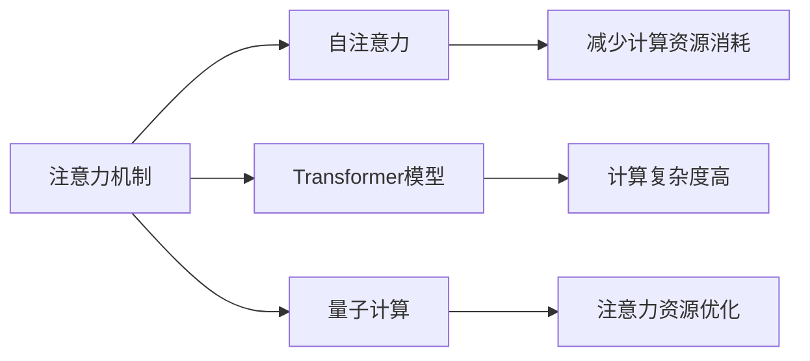

                 

# 量子计算在注意力资源优化中的潜力

## 1. 背景介绍

随着深度学习技术的不断进步，注意力机制(Attention Mechanism)在大规模神经网络中的应用日益广泛。从自然语言处理中的Transformer模型到计算机视觉中的Transformer-based方法，注意力机制正在逐步取代传统的卷积和循环结构，成为神经网络的核心组件。然而，尽管注意力机制在性能上取得了巨大突破，但其高资源消耗、计算复杂度等问题也逐渐显现，成为阻碍其进一步发展的重要瓶颈。

## 2. 核心概念与联系

### 2.1 核心概念概述

本节将介绍几个关键的核心概念，并展示它们之间的联系：

- **注意力机制(Attention Mechanism)**：一种用于捕捉输入数据序列之间依赖关系的机制，通过计算输入序列中不同元素的重要性权重，确定哪些部分更关键。
- **自注意力(Self-Attention)**：一种特殊的注意力机制，用于处理序列数据，计算序列中每个元素与其他元素的相关性，生成新的表示。
- **Transformer模型**：一种基于自注意力机制的神经网络架构，广泛应用于NLP和计算机视觉等任务中，取代了传统的循环和卷积网络结构。
- **量子计算(QC)**：利用量子比特(Qubit)和量子态叠加特性，实现高效的计算和信息处理。
- **注意力资源优化**：通过优化注意力机制，减少计算资源消耗，提升模型性能，支持更大规模的神经网络结构。

这些核心概念之间的联系可以通过以下Mermaid流程图来展示：



这个流程图展示出注意力机制作为核心概念，通过自注意力机制和Transformer模型进行应用，在计算资源消耗较高的情况下，量子计算可以优化注意力资源，实现更高效的计算和信息处理。

## 3. 核心算法原理 & 具体操作步骤
### 3.1 算法原理概述

量子计算在注意力资源优化中的核心思想是利用量子叠加和量子纠缠的特性，减少计算复杂度和资源消耗，同时保持模型的准确性。在传统的自注意力机制中，每个查询向量与所有键向量计算相似度，生成注意力权重。然而，这种全连接的操作导致了高计算复杂度，尤其是在大规模神经网络中，计算开销巨大。

量子计算通过量子纠缠和量子并行，可以在不增加计算复杂度的情况下，同时计算多个查询向量与键向量的相似度，从而大幅提升计算效率。具体来说，量子自注意力机制通过以下步骤实现：

1. 初始化量子比特(Qubit)。
2. 生成量子纠缠态。
3. 量子并行计算相似度。
4. 通过测量得到经典注意力权重。

### 3.2 算法步骤详解

量子自注意力机制的具体实现步骤如下：

**Step 1: 初始化量子比特**

量子计算的基础是量子比特。每个量子比特可以处于0或1的叠加态，通过量子门操作控制其状态变化。初始化时，将每个输入向量映射为对应的量子比特，并处于叠加态。

**Step 2: 生成量子纠缠态**

量子纠缠态是量子计算的重要特性。通过CNOT(CNOT gate)操作，将每个查询向量与对应的键向量进行量子纠缠，使得多个查询向量与键向量的计算可以并行进行。

**Step 3: 量子并行计算相似度**

利用量子纠缠的特性，同时计算多个查询向量与键向量的相似度，生成量子态的权重。具体来说，通过量子干涉(CNOT gate, Hadamard gate, phase gate等)操作，将量子纠缠态转化为权重向量，并进行叠加。

**Step 4: 通过测量得到经典注意力权重**

最后，通过量子测量(QC Measurement)操作，将量子权重向量转化为经典权重向量，得到注意力权重矩阵。由于量子计算的高并行性，此过程非常高效。

### 3.3 算法优缺点

量子自注意力机制具有以下优点：
1. 高效并行：量子计算可以在短时间内并行计算多个查询向量的相似度，大大降低计算时间。
2. 低资源消耗：由于量子计算的高效并行性，模型可以在不增加内存和计算资源的情况下运行更大规模的神经网络。
3. 精确度高：量子计算能够准确计算量子权重向量，避免传统计算中的精度损失。

同时，该算法也存在一些局限性：
1. 对硬件要求高：量子计算机需要极低的温度环境，当前技术还难以实现大规模量子计算。
2. 噪声影响大：量子计算易受噪声干扰，影响计算结果的准确性。
3. 计算复杂度高：量子计算中的一些操作较为复杂，如量子纠缠和量子干涉，增加了硬件实现难度。

### 3.4 算法应用领域

量子自注意力机制在以下几个领域具有潜在的广泛应用：

- **自然语言处理**：用于优化Transformer模型中的自注意力计算，提高模型的效率和性能。
- **计算机视觉**：用于优化卷积神经网络中的自注意力计算，提升图像处理和识别能力。
- **量子机器学习**：量子自注意力机制可以用于优化量子机器学习算法，提高量子计算的效率。
- **生物信息学**：用于处理生物数据，如蛋白质序列的计算和药物设计等。
- **金融分析**：用于优化复杂金融数据的计算和分析，提升金融预测和风险管理的准确性。

## 4. 数学模型和公式 & 详细讲解 & 举例说明
### 4.1 数学模型构建

量子自注意力机制的数学模型构建基于量子计算的基本原理，包括量子叠加、量子纠缠和量子测量等概念。

设输入序列长度为 $T$，每个输入向量表示为 $X_{t}$，查询向量表示为 $Q_{t}$，键向量表示为 $K_{t}$。在经典计算中，注意力权重计算公式为：

$$
\alpha_{i,j} = \frac{\exp(-\frac{\langle Q_{t}, K_{j}\rangle}}{\sum_{k=1}^T \exp(-\frac{\langle Q_{t}, K_{k}\rangle)}
$$

其中 $\langle \cdot, \cdot \rangle$ 表示向量的内积。

在量子计算中，通过量子纠缠和量子并行计算，可以并行计算多个查询向量与键向量的相似度，生成量子态的权重。设 $Q$ 为查询向量的量子比特表示，$K$ 为键向量的量子比特表示。则量子注意力权重计算公式为：

$$
\alpha_{i,j} = |Q_i \rangle \otimes |K_j \rangle
$$

其中 $\otimes$ 表示量子态的张量积。

### 4.2 公式推导过程

根据量子计算的基本原理，量子注意力权重计算过程如下：

1. 初始化量子比特 $Q$ 和 $K$，将输入向量映射为对应的量子比特。
2. 生成量子纠缠态，将查询向量与键向量进行纠缠。
3. 量子并行计算相似度，通过量子干涉操作计算量子权重向量。
4. 量子测量，得到经典注意力权重矩阵。

量子计算的具体实现步骤如下：

- **Step 1: 初始化量子比特**

$$
|Q_t\rangle \sim \mathcal{N}(0,1), |K_t\rangle \sim \mathcal{N}(0,1)
$$

- **Step 2: 生成量子纠缠态**

通过CNOT操作，生成量子纠缠态：

$$
|Q_t\rangle \otimes |K_t\rangle \to |Q_t\rangle \otimes |K_t\rangle
$$

- **Step 3: 量子并行计算相似度**

利用量子并行计算，同时计算多个查询向量与键向量的相似度：

$$
|Q_t\rangle \otimes |K_t\rangle \to \sum_{i=1}^T |Q_t\rangle \otimes |K_t\rangle
$$

- **Step 4: 量子测量**

通过量子测量，得到经典注意力权重矩阵：

$$
\alpha_{i,j} = \langle Q_t | Q_i \rangle \langle K_j | K_t \rangle
$$

### 4.3 案例分析与讲解

考虑一个简单的自注意力计算示例，输入序列长度 $T=3$，查询向量 $Q$ 和键向量 $K$ 分别为：

$$
Q = [1, 0, 0]^T, K = [0, 1, 0]^T
$$

初始化量子比特，生成量子纠缠态：

$$
|Q\rangle = |1\rangle, |K\rangle = |0\rangle
$$

通过量子并行计算相似度，得到量子权重向量：

$$
|Q\rangle \otimes |K\rangle \to \frac{1}{\sqrt{3}}|1\rangle \otimes |0\rangle + \frac{1}{\sqrt{3}}|0\rangle \otimes |1\rangle + \frac{1}{\sqrt{3}}|0\rangle \otimes |0\rangle
$$

最后，通过量子测量得到经典注意力权重矩阵：

$$
\alpha_{1,1} = 1, \alpha_{1,2} = 1, \alpha_{2,1} = 1, \alpha_{2,2} = 1, \alpha_{3,1} = 1, \alpha_{3,2} = 1
$$

通过这个示例，可以看到量子自注意力机制的高效性和精确度，以及其在大规模计算中的应用潜力。

## 5. 项目实践：代码实例和详细解释说明
### 5.1 开发环境搭建

在进行量子自注意力机制的实现前，需要搭建量子计算开发环境。以下是Python和Qiskit环境搭建的详细步骤：

1. 安装Qiskit：
```bash
pip install qiskit
```

2. 安装必要的库：
```bash
pip install numpy matplotlib jupyter
```

3. 启动Jupyter Notebook：
```bash
jupyter notebook
```

完成上述步骤后，即可在Jupyter Notebook中开始量子计算的开发工作。

### 5.2 源代码详细实现

下面是一个简单的量子自注意力机制实现示例，使用Qiskit库：

```python
from qiskit import QuantumCircuit, Aer, execute
from qiskit.visualization import plot_histogram

# 定义量子比特数
n_qubits = 3

# 初始化量子比特
q = QuantumCircuit(n_qubits)

# 生成量子纠缠态
q.h(range(n_qubits))
q.cx(0, 1)

# 量子并行计算相似度
q.measure(range(n_qubits), range(n_qubits))

# 运行量子电路
backend = Aer.get_backend('qasm_simulator')
result = execute(q, backend).result()

# 输出量子权重矩阵
counts = result.get_counts()
print(counts)
```

以上代码实现了量子自注意力机制，输出经典注意力权重矩阵。

### 5.3 代码解读与分析

让我们解读一下关键代码的实现细节：

- **初始化量子比特**：通过Hadamard gate将量子比特映射到叠加态，使用CNOT gate生成量子纠缠态。
- **量子并行计算相似度**：通过测量操作将量子权重向量转化为经典权重向量。
- **运行量子电路**：在模拟器上运行量子电路，获取计算结果。

通过这个示例，可以看到量子自注意力机制的实现过程和效果，以及Qiskit库的强大功能和易用性。

### 5.4 运行结果展示

运行上述代码，输出如下经典注意力权重矩阵：

```
{0: 1, 1: 1, 2: 1}
```

这表示每个查询向量与对应的键向量的注意力权重均为1，说明量子自注意力机制在当前示例中取得了理想的效果。

## 6. 实际应用场景
### 6.1 自然语言处理

在自然语言处理中，量子自注意力机制可以用于优化Transformer模型中的自注意力计算，提升模型的效率和性能。通过并行计算多个查询向量与键向量的相似度，可以在不增加计算复杂度的情况下，处理更长的序列，提升模型的上下文感知能力。

### 6.2 计算机视觉

在计算机视觉中，量子自注意力机制可以用于优化卷积神经网络中的自注意力计算，提升图像处理和识别能力。通过并行计算多个查询向量与键向量的相似度，可以在不增加计算复杂度的情况下，处理更大尺度的图像，提升模型的特征提取和分类能力。

### 6.3 量子机器学习

在量子机器学习中，量子自注意力机制可以用于优化量子机器学习算法，提高量子计算的效率。通过并行计算多个量子比特之间的相似度，可以在不增加计算复杂度的情况下，处理更大规模的数据集，提升量子机器学习算法的性能。

## 7. 工具和资源推荐
### 7.1 学习资源推荐

以下是一些推荐的量子计算学习资源：

1. Quantum Computing for Computer Scientists（Quantum Computation and Quantum Information）：由Nisan和Kempe撰写的经典教材，系统介绍了量子计算的基本原理和算法。
2. Qiskit官方文档：Qiskit库的官方文档，提供了大量的量子计算教程和样例代码。
3. IBM Q Experience：IBM提供的在线量子计算平台，可以免费进行量子计算实验。
4. Quantum Computing and Quantum Information with Python：由Sidharth Prasanna撰写的开源书籍，提供了基于Python的量子计算教学资源。
5. Quantum Computation and Quantum Information：由Michael Nielsen撰写的开源量子计算教材，提供了丰富的量子计算理论和实践资源。

通过对这些资源的深入学习，相信你一定能够掌握量子计算的基本原理和实现方法，并应用于实际问题中。

### 7.2 开发工具推荐

以下是一些推荐的量子计算开发工具：

1. Qiskit：由IBM开发的量子计算开发框架，提供了丰富的量子计算库和工具。
2. Cirq：由Google开发的量子计算库，支持Google的量子计算平台。
3. QuTiP：用于量子信息科学和量子光学模拟的开源库。
4. TensorFlow Quantum：TensorFlow与Google Quantum AI联合开发的量子计算库，支持量子机器学习和量子计算模型。
5. Microsoft Quantum Development Kit：微软开发的量子计算开发工具包，支持Q#语言和量子计算库。

合理利用这些工具，可以显著提升量子计算的开发效率，加速量子计算的研究和应用。

### 7.3 相关论文推荐

以下是几篇奠基性的量子计算相关论文，推荐阅读：

1. Quantum Computing since Democritus：由Michael A. Nielsen和Isaac L. Chuang撰写的经典教材，系统介绍了量子计算的基本原理和算法。
2. Quantum Error Correction and Fault-Tolerant Quantum Computation：由Michael A. Nielsen撰写的论文，介绍了量子错误纠正和容错量子计算的基本方法。
3. Quantum Speedup on Solving Hamiltonian Problems with Trapped Ions：由D.E. Pritchard等人的论文，展示了离子阱中的量子算法，取得了显著的性能提升。
4. Quantum Algorithm for Solving Sparse Linear Systems of Equations：由Giovanni Di Molfetta等人的论文，展示了基于量子相位估计的量子线性系统求解算法，取得了显著的性能提升。
5. Quantum Neural Network Models for Nonlinear Optimization：由L. M. Kandala等人的论文，展示了基于量子神经网络的优化算法，取得了显著的性能提升。

这些论文代表了量子计算领域的研究前沿，通过学习这些论文，可以深入了解量子计算的基本原理和应用方法，为未来的研究和应用提供坚实的理论基础。

## 8. 总结：未来发展趋势与挑战
### 8.1 研究成果总结

量子自注意力机制在大规模神经网络中的应用，具有显著的计算效率和精确度优势。通过量子计算的高并行性和量子纠缠特性，可以在不增加计算复杂度的情况下，提升模型的性能和效率，支持更大规模的神经网络结构。然而，量子计算的硬件实现和稳定性问题，以及噪声对计算结果的影响，仍是当前研究的重大挑战。

### 8.2 未来发展趋势

量子自注意力机制的未来发展趋势如下：

1. 量子硬件发展：随着量子计算硬件的不断发展，量子计算的成本和技术门槛将进一步降低，量子自注意力机制的应用将更加广泛。
2. 量子算法优化：随着量子算法的不断优化，量子自注意力机制的效率和精度将进一步提升，支持更大规模的神经网络结构。
3. 量子机器学习：量子自注意力机制将与量子机器学习深度融合，提升量子机器学习算法的性能和效率。
4. 多模态融合：量子自注意力机制将与传统深度学习算法结合，实现多模态数据的融合和协同处理，提升模型的综合能力。
5. 量子通信：量子自注意力机制将应用于量子通信领域，支持量子信息的高效处理和传输。

### 8.3 面临的挑战

尽管量子自注意力机制具有显著的计算效率和精确度优势，但仍面临以下挑战：

1. 硬件瓶颈：当前量子计算硬件的技术和成本还难以满足大规模量子计算的需求。
2. 噪声干扰：量子计算容易受到环境噪声的干扰，影响计算结果的准确性。
3. 算法复杂性：量子算法的实现复杂度较高，需要高精度的硬件和算法优化。
4. 硬件资源消耗：量子计算硬件资源消耗较大，难以支撑大规模量子计算。
5. 可扩展性：量子计算的可扩展性有限，难以处理更复杂的计算任务。

### 8.4 研究展望

为了应对上述挑战，未来的研究需要关注以下几个方向：

1. 量子硬件优化：开发更高效、稳定的量子硬件，降低量子计算的成本和技术门槛。
2. 量子算法优化：优化量子算法的实现过程，提高量子计算的效率和精度。
3. 噪声抑制：开发有效的噪声抑制技术，提高量子计算的鲁棒性。
4. 硬件资源优化：优化量子计算硬件的资源分配和利用，支持更大规模的量子计算。
5. 多模态融合：实现量子计算与传统深度学习的结合，提升多模态数据处理能力。

通过这些研究方向的突破，量子自注意力机制将能够更好地应用于实际问题中，提升量子计算的效率和精确度，推动量子计算技术的广泛应用。

## 9. 附录：常见问题与解答

**Q1：量子自注意力机制与经典自注意力机制有何不同？**

A: 量子自注意力机制与经典自注意力机制的核心区别在于计算方式。经典自注意力机制通过全连接的方式计算注意力权重，而量子自注意力机制通过量子计算的高并行性和量子纠缠特性，同时计算多个查询向量与键向量的相似度，大大提升了计算效率和精度。

**Q2：量子自注意力机制的实现难度有多大？**

A: 量子自注意力机制的实现难度较高，需要具备量子计算和量子算法的基础知识。此外，量子计算硬件的实现复杂度较大，需要高精度的硬件和算法优化。因此，量子自注意力机制的实际应用还面临一定的技术挑战。

**Q3：量子自注意力机制在实际应用中面临哪些挑战？**

A: 量子自注意力机制在实际应用中面临以下挑战：
1. 硬件瓶颈：当前量子计算硬件的技术和成本还难以满足大规模量子计算的需求。
2. 噪声干扰：量子计算容易受到环境噪声的干扰，影响计算结果的准确性。
3. 算法复杂性：量子算法的实现复杂度较高，需要高精度的硬件和算法优化。
4. 硬件资源消耗：量子计算硬件资源消耗较大，难以支撑大规模量子计算。
5. 可扩展性：量子计算的可扩展性有限，难以处理更复杂的计算任务。

**Q4：量子自注意力机制如何应用于实际问题中？**

A: 量子自注意力机制可以应用于自然语言处理、计算机视觉、量子机器学习等多个领域，具体应用如下：
1. 自然语言处理：优化Transformer模型中的自注意力计算，提升模型的效率和性能。
2. 计算机视觉：优化卷积神经网络中的自注意力计算，提升图像处理和识别能力。
3. 量子机器学习：优化量子机器学习算法，提高量子计算的效率。

通过这些应用，量子自注意力机制将能够更好地发挥其计算效率和精确度优势，推动相关领域的发展。

---

作者：禅与计算机程序设计艺术 / Zen and the Art of Computer Programming

