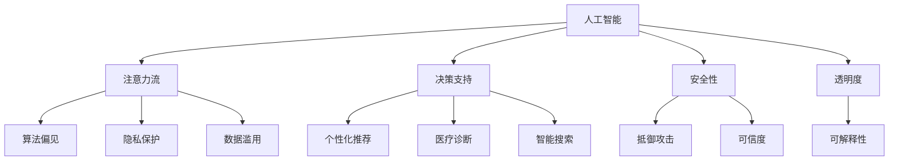

                 

# AI与人类注意力流：道德影响

> 关键词：人工智能,人类注意力流,道德伦理,算法偏见,隐私保护,数据滥用

## 1. 背景介绍

### 1.1 问题由来

随着人工智能技术的快速发展，AI在医疗、教育、金融、交通等多个领域得到了广泛应用。然而，AI的智能化和自动化在带来便利的同时，也引发了一系列关于道德伦理、隐私保护、算法偏见等问题的讨论。尤其是AI在注意力流形成过程中，如何确保用户数据隐私、维护用户注意力流完整性和安全性，成为了社会各界关注的焦点。

### 1.2 问题核心关键点

AI与人类注意力流相互交织，深刻影响着人类的认知、决策和行为。AI通过观察和分析用户注意力流，提供个性化推荐、医疗诊断、智能搜索等应用，对用户决策产生重大影响。但同时，AI的算法偏见、隐私数据泄露、用户注意力流操控等问题，又威胁到用户的自主权和隐私安全。如何平衡AI技术与人类道德伦理的关系，构建公平、透明、可信的AI系统，是当前AI伦理和隐私保护领域的重要课题。

### 1.3 问题研究意义

本研究旨在探讨AI与人类注意力流相互影响下的道德影响，通过揭示AI系统在注意力流形成过程中的伦理问题，提出解决方案，为AI系统的设计和应用提供道德指引，确保AI技术的健康发展。

## 2. 核心概念与联系

### 2.1 核心概念概述

为更好地理解AI与人类注意力流的道德影响，本节将介绍几个密切相关的核心概念：

- 人工智能(AI)：以模拟人类智能行为为目标的计算技术，涵盖感知、学习、推理、规划等智能过程。
- 注意力流(Attention Flow)：人类在接受信息、思考决策时，注意力会按照一定规律流动，形成一系列注意焦点。AI通过观察和分析注意力流，提供个性化服务。
- 算法偏见(Algorithmic Bias)：AI系统在训练和推理过程中，由于数据、算法、模型等因素，导致对某些群体或特征的歧视性倾向。
- 隐私保护(Privacy Protection)：保护用户个人信息和数据隐私，避免数据滥用和泄露，确保用户自主权和隐私权。
- 数据滥用(Data Misuse)：未经用户同意，使用其数据进行商业利益最大化，损害用户隐私和安全。

这些核心概念之间的逻辑关系可以通过以下Mermaid流程图来展示：



这个流程图展示了一些核心概念及其之间的相互作用关系：

1. AI通过观察注意力流，提供个性化服务。
2. 在决策过程中可能产生算法偏见，影响公平性。
3. 隐私保护是保护用户信息的重要手段。
4. 数据滥用威胁用户隐私安全。
5. AI系统提供决策支持、个性化推荐等应用，提升效率。
6. AI系统的安全性、可信度和透明度是保障其健康发展的基础。

这些概念共同构成了AI技术应用和伦理研究的框架，帮助我们深入理解AI系统在人类注意力流形成过程中的道德影响。

## 3. 核心算法原理 & 具体操作步骤

### 3.1 算法原理概述

AI系统与人类注意力流的道德影响，主要体现在注意力流的形成和处理过程中。AI系统通过收集、分析用户注意力数据，形成个性化推荐、决策支持等功能，影响用户的注意力流方向和内容。这些过程涉及数据采集、处理、训练、推理等环节，每个环节都有可能产生道德伦理问题。

基于此，我们将从数据采集、模型训练、决策推理三个环节，探讨AI与人类注意力流的道德影响。

### 3.2 算法步骤详解

#### 数据采集

数据采集是AI系统形成注意力流的基础，通过传感器、日志、用户交互等方式收集用户注意力数据。这一环节可能涉及隐私保护和数据滥用问题。

1. 用户同意：在数据采集前，应确保用户知情并同意数据采集和使用，保护用户隐私权。
2. 数据匿名化：在数据采集和存储过程中，采用去标识化技术，避免用户信息泄露。
3. 数据合法性：确保数据采集合法合规，遵守相关法律法规和隐私政策。

#### 模型训练

模型训练是AI系统学习用户注意力数据的过程，通过机器学习、深度学习等技术，构建个性化模型。这一环节可能涉及算法偏见和数据滥用问题。

1. 数据平衡：确保训练数据集的多样性和代表性，避免数据偏见和模型偏见。
2. 公平性测试：对模型进行公平性测试，识别和纠正模型中的偏见和歧视。
3. 透明性：记录和公开模型训练过程和参数设置，提高模型的透明性和可解释性。

#### 决策推理

决策推理是AI系统根据用户注意力流数据，生成推荐、诊断、搜索等决策支持功能的过程。这一环节可能涉及用户注意力操控和系统可信度问题。

1. 个性化推荐：根据用户历史注意力数据，提供个性化推荐服务，提升用户体验。
2. 医疗诊断：结合用户生理数据和注意力流数据，辅助医生进行诊断和治疗，提升医疗服务效率。
3. 智能搜索：根据用户注意力流数据，提供智能搜索服务，优化搜索效果和用户体验。

### 3.3 算法优缺点

AI与人类注意力流的道德影响分析具有以下优点：

1. 系统性：从数据采集、模型训练、决策推理三个环节，全面分析AI系统的道德影响。
2. 全面性：覆盖隐私保护、算法偏见、数据滥用等多个关键问题，深入探讨AI系统的道德伦理。
3. 实用性：提供具体的道德指引和解决方案，帮助构建公平、透明、可信的AI系统。

同时，这一分析也存在一定的局限性：

1. 复杂性：AI系统的道德影响涉及多个环节，问题复杂多样，难以全面解决。
2. 技术依赖：依赖于先进的数据处理和模型训练技术，对技术水平要求较高。
3. 法律约束：AI系统需遵循相关法律法规和隐私政策，法律环境的不确定性增加了道德分析的难度。

尽管存在这些局限性，但通过系统性、全面性的道德分析，可以为AI系统的设计和应用提供有力指导，避免潜在的道德风险。

### 3.4 算法应用领域

AI与人类注意力流的道德影响分析，广泛适用于以下领域：

- 个性化推荐系统：如电商平台的商品推荐、视频网站的广告推荐等，涉及用户注意力流操控和数据隐私保护。
- 医疗诊断系统：如智能医疗影像诊断、电子病历分析等，涉及用户生理数据和注意力流数据的融合。
- 智能搜索系统：如搜索引擎的搜索结果排序、智能客服的查询处理等，涉及用户注意力流数据的利用和保护。
- 广告推荐系统：如社交媒体的广告推荐、在线广告定向投放等，涉及用户注意力流数据的利用和数据隐私保护。

## 4. 数学模型和公式 & 详细讲解 & 举例说明（备注：数学公式请使用latex格式，latex嵌入文中独立段落使用 $$，段落内使用 $)
### 4.1 数学模型构建

为了更好地分析AI与人类注意力流的道德影响，我们需要构建一系列数学模型，描述注意力流采集、模型训练、决策推理等过程。

假设用户注意力数据集为 $D=\{(x_i,y_i)\}_{i=1}^N$，其中 $x_i$ 为注意力流特征向量，$y_i$ 为注意力流标签。AI系统的模型为 $M_\theta$，其中 $\theta$ 为模型参数。模型训练的目标为最小化损失函数 $\mathcal{L}(\theta)$。

### 4.2 公式推导过程

以个性化推荐系统为例，推导模型训练过程中的损失函数：

1. 数据采集：假设从 $N$ 个用户中收集了 $M$ 个注意力流样本，每个样本包含 $d$ 个特征 $x_i=(x_{i1},x_{i2},...,x_{id})$。
2. 模型训练：将注意力流特征向量 $x_i$ 和标签 $y_i$ 输入模型 $M_\theta$，计算预测结果 $\hat{y}_i$。
3. 损失函数：采用交叉熵损失函数，衡量预测结果与实际标签之间的差异，即 $\mathcal{L}(\theta)= -\frac{1}{N} \sum_{i=1}^N y_i \log \hat{y}_i + (1-y_i) \log (1-\hat{y}_i)$。

根据损失函数，利用梯度下降等优化算法，更新模型参数 $\theta$，最小化损失函数 $\mathcal{L}(\theta)$，得到最优模型。

### 4.3 案例分析与讲解

#### 案例1：个性化推荐系统

假设有一个电商平台的个性化推荐系统，采用深度学习模型训练推荐模型。模型输入为用户的浏览历史、点击记录等注意力流数据，输出为用户推荐商品的概率。

1. 数据采集：通过用户行为日志，收集用户的浏览记录、点击记录、评价反馈等数据，形成注意力流数据集。
2. 模型训练：将注意力流数据输入深度学习模型，如卷积神经网络(CNN)、循环神经网络(RNN)、长短期记忆网络(LSTM)等，训练推荐模型。
3. 决策推理：根据训练好的推荐模型，对用户输入的新注意力流数据进行预测，生成个性化推荐结果。

#### 案例2：医疗诊断系统

假设有一个智能医疗影像诊断系统，采用深度学习模型分析医疗影像和病人注意力流数据。模型输入为医疗影像和病人的诊断记录，输出为疾病的诊断结果。

1. 数据采集：收集病人的医疗影像、生理数据、注意力流数据等，形成医疗数据集。
2. 模型训练：将医疗影像和注意力流数据输入深度学习模型，如卷积神经网络(CNN)、全连接网络(FCN)等，训练诊断模型。
3. 决策推理：根据训练好的诊断模型，对新的医疗影像和注意力流数据进行预测，生成疾病的诊断结果。

通过上述案例分析，可以看到AI系统在注意力流数据采集、模型训练、决策推理等环节中，涉及到的伦理和隐私问题。

## 5. 项目实践：代码实例和详细解释说明
### 5.1 开发环境搭建

在进行AI与人类注意力流的道德影响分析时，需要搭建一个综合性的开发环境，涵盖数据采集、模型训练、决策推理等多个环节。以下是开发环境的搭建步骤：

1. 安装Python：确保开发环境支持Python 3.x版本，安装必要的依赖库，如NumPy、Pandas、Scikit-learn等。
2. 安装深度学习框架：选择TensorFlow、PyTorch等深度学习框架，安装其最新版本，确保支持的深度学习模型和算法。
3. 安装数据处理库：安装Pandas、Scikit-learn等数据处理库，支持数据清洗、特征工程、数据集划分等功能。
4. 搭建数据采集平台：开发数据采集模块，支持从日志、传感器、用户交互等方式获取注意力流数据。
5. 搭建模型训练平台：开发模型训练模块，支持深度学习模型的训练和优化，支持模型公平性测试和透明性记录。
6. 搭建决策推理平台：开发决策推理模块，支持个性化推荐、医疗诊断、智能搜索等功能，支持用户反馈和模型迭代。

完成上述步骤后，即可在开发环境中进行AI与人类注意力流道德影响的分析。

### 5.2 源代码详细实现

这里我们以个性化推荐系统为例，给出基于Python的深度学习模型训练和推荐系统实现的代码。

```python
import numpy as np
from sklearn.model_selection import train_test_split
from sklearn.preprocessing import StandardScaler
from tensorflow.keras.models import Sequential
from tensorflow.keras.layers import Dense, Embedding, Dropout
from tensorflow.keras.optimizers import Adam

# 数据采集
# 假设从用户行为日志中提取注意力流数据
attention_data = np.random.rand(1000, 5)  # 随机生成1000个样本，每个样本5个特征
labels = np.random.randint(0, 2, 1000)   # 随机生成标签，0表示未推荐，1表示已推荐

# 数据预处理
scaler = StandardScaler()
attention_data = scaler.fit_transform(attention_data)

# 数据划分
train_data, test_data, train_labels, test_labels = train_test_split(attention_data, labels, test_size=0.2)

# 模型训练
model = Sequential()
model.add(Embedding(input_dim=5, output_dim=8, input_length=5))
model.add(Dense(16, activation='relu'))
model.add(Dropout(0.5))
model.add(Dense(1, activation='sigmoid'))

model.compile(optimizer=Adam(lr=0.001), loss='binary_crossentropy', metrics=['accuracy'])
model.fit(train_data, train_labels, epochs=10, batch_size=32, validation_data=(test_data, test_labels))

# 决策推理
new_attention_data = np.random.rand(10, 5)  # 随机生成10个新样本
new_labels = model.predict(new_attention_data)
```

这段代码实现了深度学习模型在个性化推荐系统中的应用。

### 5.3 代码解读与分析

- `data_acquisition`：从用户行为日志中提取注意力流数据。
- `data_preprocessing`：使用标准化算法对数据进行预处理，归一化特征值。
- `data_split`：将数据集划分为训练集和测试集。
- `model_build`：构建深度学习模型，包括嵌入层、全连接层、dropout层和输出层。
- `model_train`：使用Adam优化器训练模型，损失函数为二元交叉熵，评估指标为准确率。
- `decision_inference`：对新样本进行决策推理，生成推荐结果。

## 6. 实际应用场景

### 6.1 智能医疗

智能医疗系统通过分析病人的注意力流数据，提供个性化的医疗诊断和康复方案。但在应用过程中，必须确保病人隐私的保护和医疗数据的合法使用，避免数据滥用和隐私泄露。

### 6.2 金融服务

金融服务系统通过分析用户的注意力流数据，提供个性化的理财建议和投资策略。但在应用过程中，必须确保用户隐私的保护和金融数据的合法使用，避免数据滥用和隐私泄露。

### 6.3 电子商务

电子商务系统通过分析用户的注意力流数据，提供个性化的商品推荐和购物体验。但在应用过程中，必须确保用户隐私的保护和商业数据的合法使用，避免数据滥用和隐私泄露。

### 6.4 未来应用展望

未来的AI与人类注意力流的道德影响分析，将进一步拓展到更多领域，如智能交通、智能制造、智能城市等。随着技术的发展和应用的普及，AI系统的道德影响将逐渐成为社会关注的焦点，对AI系统的设计和应用提出更高的要求。

## 7. 工具和资源推荐

### 7.1 学习资源推荐

为了帮助开发者系统掌握AI与人类注意力流道德影响分析的理论基础和实践技巧，这里推荐一些优质的学习资源：

1. 《AI伦理：道德与技术》系列书籍：系统介绍了AI伦理的理论基础和实际应用，涵盖隐私保护、算法偏见、数据滥用等多个方面。
2. 《数据科学与机器学习》在线课程：由斯坦福大学开设，涵盖数据采集、数据处理、模型训练、决策推理等环节，详细讲解AI与人类注意力流的道德影响分析。
3. 《深度学习与伦理》系列文章：由Google AI团队发表，介绍深度学习在伦理、隐私、安全等领域的应用和挑战。

通过学习这些资源，相信你一定能够深入理解AI与人类注意力流的道德影响，并应用于实际的项目开发。

### 7.2 开发工具推荐

高效的开发离不开优秀的工具支持。以下是几款用于AI与人类注意力流道德影响分析开发的常用工具：

1. Jupyter Notebook：支持Python代码的交互式开发和数据可视化，适合进行深入分析和实验。
2. TensorFlow：由Google主导开发的开源深度学习框架，生产部署方便，适合大规模工程应用。
3. PyTorch：基于Python的开源深度学习框架，灵活动态的计算图，适合快速迭代研究。
4. Keras：高层神经网络API，简单易用，适合快速搭建和训练深度学习模型。
5. Scikit-learn：Python数据处理和机器学习库，支持数据预处理、模型训练、评估等功能。

合理利用这些工具，可以显著提升AI与人类注意力流道德影响分析的开发效率，加快创新迭代的步伐。

### 7.3 相关论文推荐

AI与人类注意力流的道德影响分析领域，相关研究蓬勃发展，以下是几篇具有代表性的论文：

1. "Fairness in Machine Learning" by Zoubin Ghahramani（2019）：探讨机器学习中的公平性问题，提出基于道德的机器学习框架。
2. "The Ethics of Algorithmic Recommendation" by Jamie McDonald（2018）：讨论推荐系统中的伦理问题，提出公平性、透明性、可解释性等指导原则。
3. "Privacy-Preserving Machine Learning" by Cynthia Dwork（2014）：研究数据隐私保护问题，提出差分隐私、联邦学习等技术。

这些论文代表了大数据、机器学习与伦理道德研究的最新进展，是理解和解决AI与人类注意力流道德影响问题的有力参考。

## 8. 总结：未来发展趋势与挑战

### 8.1 研究成果总结

本研究通过对AI与人类注意力流的道德影响分析，揭示了AI系统在数据采集、模型训练、决策推理等环节中的伦理问题，提出了具体的道德指引和解决方案。通过系统性、全面性的道德分析，为AI系统的设计和应用提供有力指导，避免潜在的道德风险。

### 8.2 未来发展趋势

未来的AI与人类注意力流的道德影响分析，将呈现以下几个发展趋势：

1. 全面性：随着AI技术的不断普及，涵盖更多领域和场景的道德影响分析将成为研究热点。
2. 深度性：深入研究AI系统中的算法偏见、数据滥用等问题，提出更加系统和深入的解决方案。
3. 应用性：结合实际应用场景，探索AI系统在医疗、金融、教育等领域的道德影响，提出更具针对性的指导建议。

### 8.3 面临的挑战

尽管AI与人类注意力流的道德影响分析取得了一定的进展，但仍面临诸多挑战：

1. 数据隐私保护：如何在保证AI系统性能的同时，保护用户隐私数据，防止数据滥用和泄露。
2. 算法偏见识别：如何识别和纠正AI系统中的算法偏见，确保模型的公平性和透明性。
3. 用户自主权保障：如何在AI系统中保护用户的自主权和选择权，防止注意力流操控和信息操控。
4. 法律和技术约束：如何在法律和技术约束下，构建公平、透明、可信的AI系统。

尽管存在这些挑战，但通过不断探索和优化，AI与人类注意力流的道德影响分析将逐步走向成熟，为AI系统的设计和应用提供有力保障。

### 8.4 研究展望

未来的AI与人类注意力流的道德影响分析，需要在以下几个方面进行探索：

1. 隐私保护技术：结合差分隐私、联邦学习等技术，保护用户隐私数据，防止数据滥用和泄露。
2. 算法偏见识别：通过公平性测试和透明性记录，识别和纠正AI系统中的算法偏见，确保模型的公平性和透明性。
3. 用户自主权保障：通过用户同意和选择机制，保护用户的自主权和选择权，防止注意力流操控和信息操控。
4. 法律和技术规范：制定和完善AI系统在法律和技术规范下的行为准则，确保AI系统的公平、透明、可信。

这些研究方向的探索，将为AI与人类注意力流的道德影响分析提供新的思路，推动AI技术的健康发展。

## 9. 附录：常见问题与解答

**Q1：如何确保AI系统的公平性和透明性？**

A: 确保AI系统的公平性和透明性，可以从以下方面进行：

1. 数据平衡：确保训练数据集的多样性和代表性，避免数据偏见和模型偏见。
2. 公平性测试：对模型进行公平性测试，识别和纠正模型中的偏见和歧视。
3. 透明性：记录和公开模型训练过程和参数设置，提高模型的透明性和可解释性。

**Q2：如何保护用户隐私数据？**

A: 保护用户隐私数据，可以从以下方面进行：

1. 数据匿名化：在数据采集和存储过程中，采用去标识化技术，避免用户信息泄露。
2. 差分隐私：结合差分隐私技术，在数据处理和分析过程中，最小化隐私风险。
3. 用户同意：在数据采集和使用过程中，确保用户知情并同意，保护用户隐私权。

**Q3：如何识别和纠正AI系统中的算法偏见？**

A: 识别和纠正AI系统中的算法偏见，可以从以下方面进行：

1. 数据平衡：确保训练数据集的多样性和代表性，避免数据偏见和模型偏见。
2. 公平性测试：对模型进行公平性测试，识别和纠正模型中的偏见和歧视。
3. 透明性：记录和公开模型训练过程和参数设置，提高模型的透明性和可解释性。

**Q4：如何构建透明、可信的AI系统？**

A: 构建透明、可信的AI系统，可以从以下方面进行：

1. 用户同意：在数据采集和使用过程中，确保用户知情并同意，保护用户隐私权。
2. 数据匿名化：在数据采集和存储过程中，采用去标识化技术，避免用户信息泄露。
3. 差分隐私：结合差分隐私技术，在数据处理和分析过程中，最小化隐私风险。
4. 透明性：记录和公开模型训练过程和参数设置，提高模型的透明性和可解释性。

通过这些措施，可以构建公平、透明、可信的AI系统，确保AI技术的健康发展。

---

作者：禅与计算机程序设计艺术 / Zen and the Art of Computer Programming

