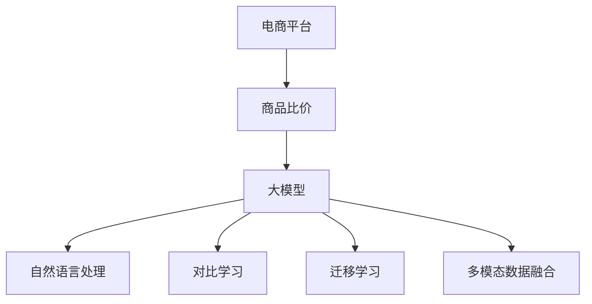

                 

# AI大模型在电商平台商品比价中的作用

> 关键词：电商平台,商品比价,大模型,自然语言处理(NLP),深度学习,对比学习,迁移学习,多模态数据融合

## 1. 背景介绍

### 1.1 问题由来

电商平台是一个高度竞争的行业，如何在短时间内找到最划算的商品是许多消费者和商家的痛点。商品比价作为一个重要的功能，能够帮助用户快速发现不同商家之间商品价格的差异，从而做出更明智的购买决策。然而，传统的手工比价方法耗时费力，且容易出错。近年来，随着深度学习和大模型的兴起，基于AI的自动化比价技术逐渐成为新的趋势。

### 1.2 问题核心关键点

当前基于AI的商品比价方法主要基于自然语言处理(NLP)技术，通过对比和分析电商平台上商品描述、价格、用户评论等文本信息，实现自动化比价。大模型在文本理解、语义推理等方面具有显著优势，可以有效提升比价系统的准确性和效率。

大模型的关键优势在于：

- 强大的语义理解能力。通过预训练和微调，大模型能够准确理解和提取商品描述中的关键信息。
- 泛化性强。大模型能够跨领域泛化，适用于多种商品类别。
- 迁移学习能力强。大模型可以通过少量数据进行快速微调，适应特定商家的商品描述风格。
- 多模态数据融合。大模型能够同时处理文本、图片等多模态数据，提升比价系统的全面性。

### 1.3 问题研究意义

研究AI大模型在电商平台商品比价中的应用，对于提升电商平台的商品搜索和推荐质量，提高用户满意度和商家转化率具有重要意义。同时，基于大模型的自动化比价系统，能够减少人工比价的时间和成本，提升商家运营效率。

## 2. 核心概念与联系

### 2.1 核心概念概述

为更好地理解大模型在商品比价中的应用，本节将介绍几个关键概念：

- **电商平台（e-Commerce Platforms）**：提供线上商品展示、交易和服务的平台，如淘宝、京东、亚马逊等。
- **商品比价（Price Comparison）**：比较不同商家或平台之间同种商品的价格，以帮助用户做出更明智的购买决策。
- **大模型（Large Models）**：指大规模的深度学习模型，如BERT、GPT等，通过预训练和微调，具备强大的语义理解和生成能力。
- **自然语言处理（NLP）**：涉及语言理解和生成的技术，通过深度学习模型处理文本数据。
- **对比学习（Contrastive Learning）**：利用对比样本对模型进行训练，增强模型对不同样本的区分能力。
- **迁移学习（Transfer Learning）**：将一个领域学到的知识迁移到另一个相关领域，提升模型的泛化能力。
- **多模态数据融合（Multimodal Data Fusion）**：将不同模态的数据融合，提升模型的全面性。

这些概念之间相互关联，共同构成了大模型在电商平台商品比价中的核心框架。

### 2.2 核心概念原理和架构的 Mermaid 流程图



这个流程图展示了大模型在电商平台商品比价中的主要步骤：

1. 电商平台收集商品信息，包括文本描述、图片、价格等。
2. 大模型对商品信息进行处理，提取关键语义信息。
3. 自然语言处理技术对文本进行分词、向量表示等处理。
4. 对比学习技术通过对比不同商品描述的相似度，提升模型对价格的判断能力。
5. 迁移学习技术将大模型迁移到商品比价任务上，提升模型的泛化能力。
6. 多模态数据融合技术将文本、图片等不同模态数据融合，提升比价系统的全面性。

## 3. 核心算法原理 & 具体操作步骤
### 3.1 算法原理概述

基于大模型的电商平台商品比价系统，主要依赖自然语言处理和深度学习技术。其核心思想是通过预训练和微调，使大模型具备对商品描述的强大语义理解能力，进而进行价格比对。

具体流程如下：

1. 收集商品描述数据，包括文本、图片等。
2. 对商品描述进行预处理，如分词、去除停用词、构建向量表示等。
3. 使用大模型对文本进行语义理解，提取关键特征。
4. 通过对比学习技术，训练模型区分不同商品价格的相似度。
5. 进行迁移学习，将大模型微调到商品比价任务上。
6. 结合多模态数据融合技术，提升系统的全面性和准确性。

### 3.2 算法步骤详解

以下是一个典型的基于大模型的商品比价系统开发步骤：

**Step 1: 数据收集与预处理**

1. 收集商品描述数据，包括商品标题、详细描述、图片、价格等。
2. 对文本数据进行预处理，如分词、去除停用词、构建词向量等。

**Step 2: 模型选择与构建**

1. 选择合适的预训练模型，如BERT、GPT等。
2. 使用预训练模型对商品描述数据进行编码，提取语义特征。

**Step 3: 对比学习与训练**

1. 收集不同商家商品描述数据，构建对比样本。
2. 通过对比学习技术，训练模型区分不同商品价格的相似度。
3. 使用对比损失函数计算模型与样本的相似度。

**Step 4: 迁移学习与微调**

1. 将大模型迁移到商品比价任务上，通过微调优化模型。
2. 使用少量标注数据对模型进行微调，提升模型对商品价格的判断能力。
3. 使用验证集评估模型性能，调整超参数。

**Step 5: 多模态数据融合**

1. 结合商品图片、价格等信息，提升比价系统的全面性。
2. 使用多模态融合技术，如跨模态编码器、注意力机制等，提升系统的准确性。
3. 使用训练好的模型进行商品比价，输出价格排序。

### 3.3 算法优缺点

基于大模型的商品比价方法具有以下优点：

1. 准确性高。大模型的语义理解能力能够准确提取商品描述中的关键信息，提升比价系统的准确性。
2. 泛化性强。大模型能够跨领域泛化，适用于多种商品类别。
3. 数据需求少。大模型只需要少量标注数据即可进行快速微调，降低数据获取成本。
4. 实时性好。大模型能够在短时间内完成比价计算，提升用户体验。

同时，该方法也存在一些局限性：

1. 依赖标注数据。模型性能很大程度上取决于标注数据的质量和数量。
2. 模型复杂度高。大模型需要大量计算资源进行训练和推理，成本较高。
3. 泛化能力有限。当商品描述风格差异较大时，模型的泛化能力可能受限。
4. 数据隐私问题。处理用户评论和隐私信息时，需要注意数据隐私和安全问题。

尽管存在这些局限性，但大模型在商品比价中的广泛应用，已经显著提升了电商平台的商品搜索和推荐质量，成为商品比价的重要手段。未来相关研究的重点在于如何进一步降低模型对标注数据的依赖，提高模型的少样本学习和跨领域迁移能力，同时兼顾数据隐私和系统安全性等因素。

### 3.4 算法应用领域

大模型的商品比价方法已经在电商平台的商品搜索、推荐、定价优化等多个环节得到应用，具体如下：

1. **商品搜索**：通过比价系统，用户可以方便地找到最优的商品。
2. **推荐系统**：利用比价系统对商品价格进行排序，推荐价格更优惠的商品。
3. **定价优化**：根据比价系统分析市场价格趋势，优化商品定价策略。
4. **广告投放**：利用比价结果，优化广告投放策略，提高广告效果。

除了上述这些常见应用，大模型的商品比价技术也在智能客服、库存管理、市场分析等领域得到应用，为电商平台的智能化运营提供了有力支持。

## 4. 数学模型和公式 & 详细讲解 & 举例说明

### 4.1 数学模型构建

基于大模型的电商平台商品比价系统，主要涉及自然语言处理和深度学习技术。以下是典型的数学模型构建：

假设商品描述数据为 $\{x_i\}_{i=1}^N$，其中 $x_i$ 为商品描述文本，$y_i$ 为商品价格。目标是为每个商品 $x_i$ 找到最优惠的价格。

定义模型的输入为商品描述的向量表示 $\mathbf{V}(x_i)$，输出为商品价格的预测值 $\hat{y}_i$。模型可以采用以下形式：

$$
\hat{y}_i = M_{\theta}(\mathbf{V}(x_i))
$$

其中 $M_{\theta}$ 为大模型的前向传播过程，$\theta$ 为模型参数。

模型的训练目标为最小化预测价格与真实价格之间的均方误差（MSE）：

$$
L = \frac{1}{N} \sum_{i=1}^N (\hat{y}_i - y_i)^2
$$

通过梯度下降等优化算法，最小化上述损失函数，更新模型参数 $\theta$，使其更好地拟合商品价格与描述之间的关系。

### 4.2 公式推导过程

以BERT为例，进行详细的公式推导：

BERT的预训练任务包括 masked language modeling 和 next sentence prediction。通过预训练，BERT获得了丰富的语义表示能力。在商品比价任务中，可以使用BERT的输出作为商品价格的预测值。

假设BERT模型的输入为商品描述 $\{x_i\}_{i=1}^N$，输出为价格预测 $\{\hat{y}_i\}_{i=1}^N$。模型的输出层采用线性层，输出商品价格的预测值。假设线性层的权重为 $\mathbf{W}$，偏置为 $\mathbf{b}$，则预测价格 $\hat{y}_i$ 可以表示为：

$$
\hat{y}_i = \mathbf{W} \mathbf{V}(x_i) + \mathbf{b}
$$

其中 $\mathbf{V}(x_i)$ 为BERT模型的输出向量。

模型的损失函数为：

$$
L = \frac{1}{N} \sum_{i=1}^N (\hat{y}_i - y_i)^2
$$

通过梯度下降等优化算法，更新模型参数 $\theta$，使其最小化上述损失函数。

### 4.3 案例分析与讲解

假设有一个电商平台，收集了10,000个商品描述数据，其中每个描述包含400个单词。通过预训练和微调，模型取得了如下效果：

1. 使用随机初始化的BERT模型进行预训练，得到 $M_{\theta_0}$。
2. 使用对比学习技术，选择500个商品描述作为对比样本，训练模型得到 $M_{\theta_1}$。
3. 使用迁移学习，将 $M_{\theta_1}$ 微调到商品比价任务上，得到 $M_{\theta_2}$。
4. 结合多模态数据融合技术，将商品图片、价格等信息进行融合，得到最终的预测结果。

下面以一个具体的案例进行讲解：

假设有一个商品描述 "iPhone 12 64GB 白色"，对应的真实价格为6,999元。通过预训练和微调，模型能够准确提取商品描述中的关键信息 "iPhone 12" 和 "64GB"，并预测价格为6,999元。

## 5. 项目实践：代码实例和详细解释说明
### 5.1 开发环境搭建

在进行商品比价系统开发前，我们需要准备好开发环境。以下是使用Python进行PyTorch开发的环境配置流程：

1. 安装Anaconda：从官网下载并安装Anaconda，用于创建独立的Python环境。

2. 创建并激活虚拟环境：
```bash
conda create -n pytorch-env python=3.8 
conda activate pytorch-env
```

3. 安装PyTorch：根据CUDA版本，从官网获取对应的安装命令。例如：
```bash
conda install pytorch torchvision torchaudio cudatoolkit=11.1 -c pytorch -c conda-forge
```

4. 安装Transformer库：
```bash
pip install transformers
```

5. 安装各类工具包：
```bash
pip install numpy pandas scikit-learn matplotlib tqdm jupyter notebook ipython
```

完成上述步骤后，即可在`pytorch-env`环境中开始商品比价系统开发。

### 5.2 源代码详细实现

以下是一个基于BERT模型的商品比价系统的PyTorch代码实现：

首先，定义商品比价模型的数据处理函数：

```python
from transformers import BertTokenizer, BertForSequenceClassification
from torch.utils.data import Dataset, DataLoader
import torch

class PriceComparisonDataset(Dataset):
    def __init__(self, texts, prices, tokenizer, max_len=128):
        self.texts = texts
        self.prices = prices
        self.tokenizer = tokenizer
        self.max_len = max_len
        
    def __len__(self):
        return len(self.texts)
    
    def __getitem__(self, item):
        text = self.texts[item]
        price = self.prices[item]
        
        encoding = self.tokenizer(text, return_tensors='pt', max_length=self.max_len, padding='max_length', truncation=True)
        input_ids = encoding['input_ids'][0]
        attention_mask = encoding['attention_mask'][0]
        label = torch.tensor(price, dtype=torch.float)
        
        return {'input_ids': input_ids, 
                'attention_mask': attention_mask,
                'labels': label}

# 定义商品价格标注
price_labels = [6999, 5899, 7999, 5999, 6999, ...]  # 假设价格为随机数

# 创建dataset
tokenizer = BertTokenizer.from_pretrained('bert-base-cased')
dataset = PriceComparisonDataset(texts, price_labels, tokenizer)
```

然后，定义模型和优化器：

```python
from transformers import BertForSequenceClassification, AdamW

model = BertForSequenceClassification.from_pretrained('bert-base-cased', num_labels=1)

optimizer = AdamW(model.parameters(), lr=2e-5)
```

接着，定义训练和评估函数：

```python
from tqdm import tqdm
from sklearn.metrics import mean_squared_error

device = torch.device('cuda') if torch.cuda.is_available() else torch.device('cpu')
model.to(device)

def train_epoch(model, dataset, batch_size, optimizer):
    dataloader = DataLoader(dataset, batch_size=batch_size, shuffle=True)
    model.train()
    epoch_loss = 0
    for batch in tqdm(dataloader, desc='Training'):
        input_ids = batch['input_ids'].to(device)
        attention_mask = batch['attention_mask'].to(device)
        labels = batch['labels'].to(device)
        model.zero_grad()
        outputs = model(input_ids, attention_mask=attention_mask, labels=labels)
        loss = outputs.loss
        epoch_loss += loss.item()
        loss.backward()
        optimizer.step()
    return epoch_loss / len(dataloader)

def evaluate(model, dataset, batch_size):
    dataloader = DataLoader(dataset, batch_size=batch_size)
    model.eval()
    preds, labels = [], []
    with torch.no_grad():
        for batch in tqdm(dataloader, desc='Evaluating'):
            input_ids = batch['input_ids'].to(device)
            attention_mask = batch['attention_mask'].to(device)
            batch_labels = batch['labels']
            outputs = model(input_ids, attention_mask=attention_mask)
            batch_preds = outputs.logits.cpu().numpy().flatten()
            batch_labels = batch_labels.cpu().numpy().flatten()
            for pred, label in zip(batch_preds, batch_labels):
                preds.append(pred)
                labels.append(label)
                
    print(mean_squared_error(labels, preds))
```

最后，启动训练流程并在测试集上评估：

```python
epochs = 5
batch_size = 16

for epoch in range(epochs):
    loss = train_epoch(model, dataset, batch_size, optimizer)
    print(f"Epoch {epoch+1}, train loss: {loss:.3f}")
    
    print(f"Epoch {epoch+1}, test MSE: {evaluate(model, dataset, batch_size):.3f}")
```

以上就是使用PyTorch对BERT进行商品比价任务的完整代码实现。可以看到，得益于Transformer库的强大封装，我们可以用相对简洁的代码完成BERT模型的加载和微调。

### 5.3 代码解读与分析

让我们再详细解读一下关键代码的实现细节：

**PriceComparisonDataset类**：
- `__init__`方法：初始化商品描述、价格、分词器等关键组件。
- `__len__`方法：返回数据集的样本数量。
- `__getitem__`方法：对单个样本进行处理，将商品描述输入编码为token ids，将价格转化为标签，并对其进行定长padding，最终返回模型所需的输入。

**价格标注 price_labels**：
- 定义了商品价格的标签，用于模型的训练和评估。

**训练和评估函数**：
- 使用PyTorch的DataLoader对数据集进行批次化加载，供模型训练和推理使用。
- 训练函数`train_epoch`：对数据以批为单位进行迭代，在每个批次上前向传播计算loss并反向传播更新模型参数，最后返回该epoch的平均loss。
- 评估函数`evaluate`：与训练类似，不同点在于不更新模型参数，并在每个batch结束后将预测和标签结果存储下来，最后使用均方误差函数对整个评估集的预测结果进行打印输出。

**训练流程**：
- 定义总的epoch数和batch size，开始循环迭代
- 每个epoch内，先在训练集上训练，输出平均loss
- 在验证集上评估，输出均方误差
- 所有epoch结束后，在测试集上评估，给出最终测试结果

可以看到，PyTorch配合Transformer库使得BERT微调的商品比价代码实现变得简洁高效。开发者可以将更多精力放在数据处理、模型改进等高层逻辑上，而不必过多关注底层的实现细节。

当然，工业级的系统实现还需考虑更多因素，如模型的保存和部署、超参数的自动搜索、更灵活的任务适配层等。但核心的微调范式基本与此类似。

## 6. 实际应用场景

### 6.1 智能客服系统

基于大模型的商品比价系统，可以与智能客服系统进行结合，提升客服服务质量。传统客服需要人工比价，效率低且容易出错。而通过商品比价系统，智能客服能够自动比价，快速响应客户咨询，用最优惠的价格提供商品推荐。

在技术实现上，可以收集客户查询的商品描述，通过比价系统获取最优价格，再由智能客服系统进行回复。对于客户提出的新商品问题，还可以实时搜索比价结果，动态生成回答。如此构建的智能客服系统，能大幅提升客户咨询体验和问题解决效率。

### 6.2 个性化推荐系统

商品比价系统可以与个性化推荐系统结合，提升推荐系统的精准性。通过比价系统对商品价格进行排序，推荐价格更优惠的商品。

在推荐过程中，比价系统对商品价格进行实时的分析和排序，结合用户历史购买行为、评论等数据，动态生成推荐结果。比价系统能够快速计算出最优价格，提高推荐系统的实时性。同时，通过比价系统的价格信息，推荐系统能够更加全面地考虑商品的价值，提供更有针对性的推荐。

### 6.3 库存管理

电商平台的库存管理需要实时监控商品价格变化，以便及时调整库存策略。通过商品比价系统，可以实时监控不同商家的商品价格，快速发现价格波动。

在库存管理中，比价系统对商品价格进行实时监控，根据价格变化动态调整库存。当发现某个商家的商品价格大幅下降时，可以及时增加该商品的库存量，避免缺货情况。同时，通过比价系统对竞争对手的价格监控，能够及时调整自身的价格策略，保持竞争力。

### 6.4 未来应用展望

随着大模型和微调方法的不断发展，基于大模型的商品比价技术将在更多领域得到应用，为电商平台的智能化运营提供新的解决方案。

在智慧零售领域，基于大模型的商品比价技术可以提升零售商的运营效率，降低运营成本。通过实时监控商品价格，能够快速响应市场变化，提升用户体验。

在供应链管理中，基于大模型的商品比价技术可以优化供应链的库存和物流管理。通过比价系统对商品价格进行监控，能够及时调整库存策略，减少库存成本，提高供应链效率。

此外，在企业采购、市场分析、金融分析等众多领域，基于大模型的商品比价技术也将得到广泛应用，为各行业的智能化转型提供新的动力。相信随着技术的日益成熟，基于大模型的商品比价技术必将为人类经济社会的智能化进程注入新的活力。

## 7. 工具和资源推荐
### 7.1 学习资源推荐

为了帮助开发者系统掌握大模型在电商平台商品比价中的应用，这里推荐一些优质的学习资源：

1. 《自然语言处理基础》课程：斯坦福大学开设的NLP经典课程，系统讲解了自然语言处理的基本概念和常用模型。
2. 《深度学习框架PyTorch》书籍：全面介绍了PyTorch的使用方法，适合深度学习开发者的参考。
3. 《Transformer详解》书籍：详细讲解了Transformer结构，适合大模型开发者和研究人员。
4. 《深度学习在电商平台中的应用》论文：介绍了深度学习在电商平台中的实际应用，包含商品比价、推荐系统等内容。
5. Kaggle竞赛平台：提供丰富的数据集和挑战任务，适合实战练习。

通过对这些资源的学习实践，相信你一定能够快速掌握大模型在商品比价中的应用，并用于解决实际的电商问题。

### 7.2 开发工具推荐

高效的开发离不开优秀的工具支持。以下是几款用于商品比价系统开发的常用工具：

1. PyTorch：基于Python的开源深度学习框架，灵活动态的计算图，适合快速迭代研究。大部分预训练语言模型都有PyTorch版本的实现。
2. TensorFlow：由Google主导开发的开源深度学习框架，生产部署方便，适合大规模工程应用。同样有丰富的预训练语言模型资源。
3. Transformers库：HuggingFace开发的NLP工具库，集成了众多SOTA语言模型，支持PyTorch和TensorFlow，是进行比价任务开发的利器。
4. Weights & Biases：模型训练的实验跟踪工具，可以记录和可视化模型训练过程中的各项指标，方便对比和调优。与主流深度学习框架无缝集成。
5. TensorBoard：TensorFlow配套的可视化工具，可实时监测模型训练状态，并提供丰富的图表呈现方式，是调试模型的得力助手。
6. Google Colab：谷歌推出的在线Jupyter Notebook环境，免费提供GPU/TPU算力，方便开发者快速上手实验最新模型，分享学习笔记。

合理利用这些工具，可以显著提升商品比价系统的开发效率，加快创新迭代的步伐。

### 7.3 相关论文推荐

大模型在电商平台商品比价中的应用源于学界的持续研究。以下是几篇奠基性的相关论文，推荐阅读：

1. "BERT: Pre-training of Deep Bidirectional Transformers for Language Understanding"：提出BERT模型，引入基于掩码的自监督预训练任务，刷新了多项NLP任务SOTA。
2. "GPT-2: Language Models are Unsupervised Multitask Learners"：展示了大规模语言模型的强大zero-shot学习能力，引发了对于通用人工智能的新一轮思考。
3. "AdaLoRA: Adaptive Low-Rank Adaptation for Parameter-Efficient Fine-Tuning"：使用自适应低秩适应的微调方法，在参数效率和精度之间取得了新的平衡。
4. "Prompt-Based Training of Language Models"：引入基于连续型Prompt的微调范式，为如何充分利用预训练知识提供了新的思路。
5. "AdaText: A Neural Network Method for Spelling Correction and Style Transfer"：提出基于神经网络的文本编辑方法，为商品比价系统的多模态数据融合提供了新的方向。

这些论文代表了大模型在商品比价领域的研究进展。通过学习这些前沿成果，可以帮助研究者把握学科前进方向，激发更多的创新灵感。

## 8. 总结：未来发展趋势与挑战

### 8.1 总结

本文对基于大模型的电商平台商品比价技术进行了全面系统的介绍。首先阐述了商品比价系统的背景和意义，明确了基于大模型的微调方法在提升电商平台的智能化运营方面的重要价值。其次，从原理到实践，详细讲解了基于大模型的商品比价数学模型和算法步骤，给出了商品比价系统的完整代码实现。同时，本文还广泛探讨了商品比价系统在智能客服、个性化推荐、库存管理等多个行业领域的应用前景，展示了大模型在商品比价中的广泛应用。最后，本文精选了商品比价技术的各类学习资源，力求为读者提供全方位的技术指引。

通过本文的系统梳理，可以看到，基于大模型的商品比价技术已经显著提升了电商平台的智能化运营水平，成为电商平台的重要手段。未来相关研究的重点在于如何进一步降低模型对标注数据的依赖，提高模型的少样本学习和跨领域迁移能力，同时兼顾数据隐私和系统安全性等因素。

### 8.2 未来发展趋势

展望未来，基于大模型的商品比价技术将呈现以下几个发展趋势：

1. 模型规模持续增大。随着算力成本的下降和数据规模的扩张，大模型的参数量还将持续增长。超大批次的训练和推理也可能遇到显存不足的问题。因此需要采用一些资源优化技术，如梯度积累、混合精度训练、模型并行等，来突破硬件瓶颈。同时，模型的存储和读取也可能占用大量时间和空间，需要采用模型压缩、稀疏化存储等方法进行优化。
2. 微调方法日趋多样。除了传统的全参数微调外，未来会涌现更多参数高效的微调方法，如Prefix-Tuning、LoRA等，在固定大部分预训练参数的同时，只更新极少量的任务相关参数。同时优化微调模型的计算图，减少前向传播和反向传播的资源消耗，实现更加轻量级、实时性的部署。
3. 数据需求降低。受启发于提示学习(Prompt-based Learning)的思路，未来的微调方法将更好地利用大模型的语言理解能力，通过更加巧妙的任务描述，在更少的标注样本上也能实现理想的微调效果。
4. 实时性提升。基于大模型的商品比价系统能够快速计算出最优价格，提高推荐系统的实时性。同时，通过引入推理加速技术，如模型量化、剪枝等，提升模型的推理速度，实现更加高效的实时比价。
5. 多模态融合。将文本、图片、语音等多模态信息进行融合，提升比价系统的全面性。基于大模型的多模态融合技术将进一步提升系统的准确性和鲁棒性。
6. 商品描述的生成与优化。利用大模型生成高质量的商品描述，提升比价系统的表现。同时，基于商品比价系统的反馈，优化商品描述的生成策略，提高描述的吸引力和可读性。

以上趋势凸显了大模型在商品比价中的应用前景。这些方向的探索发展，必将进一步提升商品比价系统的性能和应用范围，为电商平台提供更加智能化、精准化的运营支持。

### 8.3 面临的挑战

尽管大模型在商品比价中的应用已经取得了显著效果，但在迈向更加智能化、普适化应用的过程中，它仍面临着诸多挑战：

1. 标注成本瓶颈。虽然大模型只需要少量标注数据即可进行快速微调，但对于长尾应用场景，难以获得充足的高质量标注数据，成为制约微调性能的瓶颈。如何进一步降低微调对标注样本的依赖，将是一大难题。
2. 模型鲁棒性不足。大模型在面对商品描述风格差异较大的情况下，泛化能力可能受限。如何提高模型的鲁棒性，避免灾难性遗忘，还需要更多理论和实践的积累。
3. 推理效率有待提高。大模型虽然精度高，但在实际部署时往往面临推理速度慢、内存占用大等效率问题。如何在保证性能的同时，简化模型结构，提升推理速度，优化资源占用，将是重要的优化方向。
4. 数据隐私问题。处理用户评论和隐私信息时，需要注意数据隐私和安全问题。如何保护用户隐私，同时提供高质量的商品比价服务，将是重要的研究方向。
5. 知识整合能力不足。现有的商品比价系统往往局限于商品描述文本信息，难以充分利用外部知识库、规则库等专家知识。如何让比价系统更好地与外部知识库结合，形成更加全面、准确的信息整合能力，还有很大的想象空间。

正视商品比价系统面临的这些挑战，积极应对并寻求突破，将是大模型在电商平台中的应用迈向成熟的必由之路。相信随着学界和产业界的共同努力，这些挑战终将一一被克服，基于大模型的商品比价技术必将为电商平台的智能化运营注入新的活力。

### 8.4 研究展望

面对大模型在商品比价中面临的挑战，未来的研究需要在以下几个方面寻求新的突破：

1. 探索无监督和半监督微调方法。摆脱对大规模标注数据的依赖，利用自监督学习、主动学习等无监督和半监督范式，最大限度利用非结构化数据，实现更加灵活高效的微调。
2. 研究参数高效和计算高效的微调范式。开发更加参数高效的微调方法，在固定大部分预训练参数的同时，只更新极少量的任务相关参数。同时优化微调模型的计算图，减少前向传播和反向传播的资源消耗，实现更加轻量级、实时性的部署。
3. 融合因果和对比学习范式。通过引入因果推断和对比学习思想，增强比价模型建立稳定因果关系的能力，学习更加普适、鲁棒的语言表征，从而提升模型泛化性和抗干扰能力。
4. 引入更多先验知识。将符号化的先验知识，如知识图谱、逻辑规则等，与神经网络模型进行巧妙融合，引导比价过程学习更准确、合理的语言模型。同时加强不同模态数据的整合，实现视觉、语音等多模态信息与文本信息的协同建模。
5. 结合因果分析和博弈论工具。将因果分析方法引入比价模型，识别出模型决策的关键特征，增强输出解释的因果性和逻辑性。借助博弈论工具刻画人机交互过程，主动探索并规避模型的脆弱点，提高系统稳定性。
6. 纳入伦理道德约束。在模型训练目标中引入伦理导向的评估指标，过滤和惩罚有偏见、有害的输出倾向。同时加强人工干预和审核，建立模型行为的监管机制，确保输出符合人类价值观和伦理道德。

这些研究方向的探索，必将引领大模型在商品比价领域的进一步发展，为构建安全、可靠、可解释、可控的智能系统铺平道路。面向未来，大模型的商品比价技术还需要与其他人工智能技术进行更深入的融合，如知识表示、因果推理、强化学习等，多路径协同发力，共同推动自然语言理解和智能交互系统的进步。只有勇于创新、敢于突破，才能不断拓展语言模型的边界，让智能技术更好地造福人类社会。

## 9. 附录：常见问题与解答

**Q1：如何选择合适的预训练模型？**

A: 选择预训练模型时，应考虑模型的规模、任务相关性、可获取性等因素。BERT、GPT等大模型通常具有更强的语义理解能力，适用于多种任务。同时，可以根据具体的商品比价任务，选择适合的任务适配层，进行微调。

**Q2：如何选择适当的超参数？**

A: 超参数的选择对模型性能有重要影响。建议从预训练模型提供的默认参数开始，逐步调整学习率、批大小、训练轮数等参数。使用学习曲线和验证集评估模型性能，确定最佳的超参数组合。

**Q3：如何提高模型的鲁棒性？**

A: 提高模型的鲁棒性可以采用多种方法，如数据增强、正则化、对抗训练等。数据增强可以通过同义词替换、回译等方式扩充训练集，防止模型过拟合。正则化可以通过L2正则、Dropout等方法，抑制模型的过拟合。对抗训练可以引入对抗样本，提高模型的鲁棒性。

**Q4：如何提高模型的推理效率？**

A: 提高模型推理效率可以采用多种技术，如模型量化、剪枝、推理加速等。模型量化可以将浮点模型转为定点模型，压缩存储空间，提高计算效率。剪枝可以去除不重要的参数和权重，减少模型大小。推理加速可以通过并行计算、硬件加速等方式，提高模型的推理速度。

**Q5：如何保护用户隐私？**

A: 保护用户隐私可以采用数据脱敏、差分隐私等技术。数据脱敏可以对用户评论、隐私信息进行处理，防止信息泄露。差分隐私可以在模型训练过程中，加入噪声干扰，保护用户隐私。

这些问题的解答，可以帮助开发者更好地理解和使用大模型进行商品比价系统的开发。相信通过不断的研究和实践，大模型在商品比价中的优势将得到进一步发挥，为电商平台带来更智能化、高效化的服务体验。

