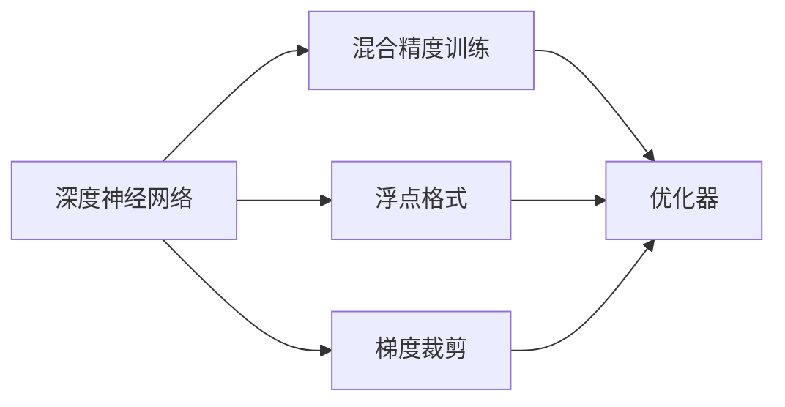

                 

# AI模型加速II：混合精度训练与不同浮点格式

> 关键词：混合精度训练,浮点格式,深度学习,优化器,深度神经网络,梯度裁剪,FP16,FP32

## 1. 背景介绍

在深度学习领域，随着模型规模的不断扩大，神经网络中的参数数量呈指数级增长，这对计算资源和存储提出了极高的要求。如何在有限的计算资源下，提升深度神经网络模型的训练效率和精度，成为了研究者们亟待解决的问题。混合精度训练（Mixed Precision Training），就是在这一背景下提出的一种高效模型训练方法。通过将模型参数和计算过程分为高低精度，可以在不降低模型精度的前提下，大幅提升训练速度，降低计算和存储成本。同时，采用不同浮点格式（如FP16和FP32）的混合精度训练，可以在保证精度的基础上，进一步提高训练速度，优化资源利用率。本文将系统介绍混合精度训练和不同浮点格式的原理和应用，帮助读者深入理解这一前沿技术。

## 2. 核心概念与联系

### 2.1 核心概念概述

为了更好地理解混合精度训练和不同浮点格式，本节将介绍几个关键概念：

- **深度神经网络（Deep Neural Network, DNN）**：由多层神经元构成的非线性模型，广泛应用于图像、语音、自然语言处理等领域。
- **混合精度训练（Mixed Precision Training）**：通过将模型参数和计算过程分为高低精度，在保持较高精度的同时，大幅提升训练速度，降低计算和存储成本的技术。
- **浮点格式**：用于表示实数的一种编码方式，常见的有单精度浮点数（FP32）、半精度浮点数（FP16）等。
- **优化器（Optimizer）**：用于更新模型参数，以最小化损失函数的技术，常见的有梯度下降法、Adam、Adagrad等。
- **梯度裁剪（Gradient Clipping）**：在梯度更新时，限制梯度的最大值或范数，防止梯度爆炸或消失，保持训练稳定性的技术。

这些核心概念之间的逻辑关系可以通过以下Mermaid流程图来展示：



这个流程图展示了大模型加速训练的相关核心概念及其之间的关系：

1. 深度神经网络通过预训练和微调得到初始权重。
2. 混合精度训练在保持较高精度的同时，利用不同浮点格式降低计算成本。
3. 浮点格式通过不同精度选择来优化计算速度和内存使用。
4. 优化器用于更新模型参数，以最小化损失函数，通常采用梯度下降法及其变种。
5. 梯度裁剪控制梯度更新的范围，保持训练稳定性。

这些概念共同构成了大模型加速训练的基础框架，使得在大规模深度学习模型训练中，能够高效地提升速度和精度，节省计算资源。

## 3. 核心算法原理 & 具体操作步骤
### 3.1 算法原理概述

混合精度训练的核心思想是，在深度神经网络中，将权重和梯度分别存储和计算为不同的精度，从而在保持较高精度的同时，大幅提升计算速度和内存效率。通常，权重采用高精度（如FP32）存储，梯度采用低精度（如FP16）计算，将两者混合使用，达到精度和速度的平衡。

在实际操作中，混合精度训练通常涉及以下几个步骤：

1. 将模型参数初始化为高精度（FP32）。
2. 在训练过程中，梯度采用低精度（FP16）计算。
3. 通过混合精度优化器（如NVIDIA的Mixed Precision Optimizer），将高精度参数和低精度梯度混合，生成更新后的参数。
4. 将更新后的参数重新转换为高精度，进行下一轮梯度计算。

通过这样的操作，可以在保持较高精度的情况下，减少高精度参数的存储和计算开销，从而大幅提升训练效率和资源利用率。

### 3.2 算法步骤详解

以下是混合精度训练的详细步骤：

**Step 1: 初始化高精度参数**

在深度神经网络中，权重和偏置通常采用高精度（如FP32）进行初始化。具体实现如下：

```python
import tensorflow as tf
import numpy as np

# 初始化权重为FP32
weight = tf.Variable(np.random.randn(784, 10), dtype=tf.float32)
```

**Step 2: 使用低精度计算梯度**

在计算梯度时，将参数转换为低精度（如FP16），利用低精度进行梯度计算，然后将其转换为高精度进行梯度累积。具体实现如下：

```python
# 定义计算图
with tf.compat.v1.Graph().as_default():
    with tf.compat.v1.device('/gpu:0'):
        # 将参数转换为低精度
        weight_low = tf.cast(weight, tf.float16)
        
        # 定义损失函数
        loss = tf.reduce_mean(tf.square(tf.matmul(x, weight_low)))

        # 定义优化器
        optimizer = tf.train.AdamOptimizer(learning_rate=0.001)
        
        # 计算梯度
        grads = tf.gradients(loss, [weight_low])
        
        # 将梯度转换为高精度
        grads_high = [tf.cast(g, tf.float32) for g in grads]
        
        # 将梯度转换为低精度并累加
        grads_low = [tf.cast(g, tf.float16) for g in grads_high]
        
        # 计算梯度累积
        grads_accum = tf.div(grads_low, 8)  # 此处以8倍累积为例

    # 将梯度累积转换为高精度并更新权重
    with tf.compat.v1.device('/gpu:0'):
        optimizer.apply_gradients(zip(grads_accum, [weight]))
```

**Step 3: 更新参数**

在每次迭代结束后，将梯度累积转换为高精度，并使用优化器更新参数。具体实现如下：

```python
# 将梯度累积转换为高精度
grads_accum = tf.div(grads_low, 8)  # 此处以8倍累积为例

# 使用优化器更新参数
optimizer.apply_gradients(zip(grads_accum, [weight]))
```

**Step 4: 重复迭代**

重复以上步骤，直到模型收敛或达到预设的迭代次数。

### 3.3 算法优缺点

混合精度训练的主要优点包括：

1. **提高训练速度**：通过将梯度计算转换为低精度，可以大幅减少计算量，从而加速训练过程。
2. **降低计算和存储成本**：低精度参数存储和计算的开销较低，可以节省计算资源和存储空间。
3. **增强模型泛化能力**：通过在训练过程中引入不同浮点格式，可以学习到更稳定、鲁棒的模型参数。

同时，混合精度训练也存在一些局限性：

1. **精度损失**：由于低精度计算的精度较低，可能会带来一定的精度损失，需要根据具体任务进行调整。
2. **内存限制**：低精度参数的存储和计算需要较大的内存支持，可能受到硬件的限制。
3. **计算偏差**：不同浮点格式之间的计算偏差，可能会导致模型在特定情况下表现不稳定。

### 3.4 算法应用领域

混合精度训练已经广泛应用于深度学习领域，特别是在大规模深度神经网络模型的训练中。以下是几个典型的应用场景：

- **图像分类**：如ResNet、VGG等卷积神经网络模型，在图像分类任务中，通过混合精度训练可以显著提升训练速度和模型精度。
- **自然语言处理**：如BERT、GPT等大语言模型，通过混合精度训练，可以加速模型训练和推理，提高模型的计算效率和精度。
- **语音识别**：如Wav2Vec等端到端语音识别模型，通过混合精度训练，可以提升模型在长序列上的表现和推理速度。
- **推荐系统**：如基于深度神经网络的协同过滤模型，通过混合精度训练，可以提高模型训练速度和推荐精度。

## 4. 数学模型和公式 & 详细讲解  
### 4.1 数学模型构建

为了更好地理解混合精度训练的数学原理，本节将介绍几个关键数学模型和公式。

假设深度神经网络模型为 $M_{\theta}(x)$，其中 $\theta$ 为模型参数，$x$ 为输入样本。假设在训练过程中，参数 $\theta$ 采用高精度（如FP32），梯度 $g$ 采用低精度（如FP16）。则混合精度训练的数学模型可以表示为：

$$
\theta = \theta + \eta \frac{\partial L}{\partial \theta}
$$

其中，$\eta$ 为学习率，$L$ 为损失函数。

**Step 1: 高精度参数初始化**

假设模型参数 $\theta$ 采用高精度（如FP32），其初始化过程如下：

$$
\theta = \theta_{init}
$$

**Step 2: 低精度梯度计算**

假设梯度 $g$ 采用低精度（如FP16），其计算过程如下：

$$
g = \frac{\partial L}{\partial \theta}
$$

**Step 3: 低精度梯度转换为高精度**

假设将低精度梯度 $g_{low}$ 转换为高精度梯度 $g_{high}$，其转换过程如下：

$$
g_{high} = \text{high\_precision\_cast}(g_{low})
$$

其中，$\text{high\_precision\_cast}$ 为高精度转换函数。

**Step 4: 高精度梯度累积**

假设将高精度梯度 $g_{high}$ 进行累积，其累积过程如下：

$$
g_{accum} = \text{accumulate\_grad}(g_{high})
$$

其中，$\text{accumulate\_grad}$ 为梯度累积函数。

**Step 5: 高精度参数更新**

假设将高精度梯度 $g_{accum}$ 用于更新参数 $\theta$，其更新过程如下：

$$
\theta = \theta + \eta g_{accum}
$$

### 4.2 公式推导过程

以下是混合精度训练的关键公式推导：

假设模型参数 $\theta$ 采用高精度（如FP32），梯度 $g$ 采用低精度（如FP16），其混合精度训练过程可以表示为：

$$
\theta = \theta + \eta \frac{\partial L}{\partial \theta}
$$

其中，$\eta$ 为学习率，$L$ 为损失函数。

在实际实现中，梯度 $g$ 通常采用低精度进行计算，然后将低精度梯度 $g_{low}$ 转换为高精度梯度 $g_{high}$，并进行梯度累积。因此，高精度参数更新的公式可以表示为：

$$
\theta = \theta + \eta \frac{\partial L}{\partial \theta}
$$

其中，$g_{high}$ 为高精度梯度，$\text{high\_precision\_cast}$ 为高精度转换函数，$\text{accumulate\_grad}$ 为梯度累积函数。

### 4.3 案例分析与讲解

以ResNet模型为例，分析混合精度训练的应用效果。

假设在ResNet模型中，使用FP32和FP16混合精度训练。具体实现如下：

```python
import tensorflow as tf
import numpy as np

# 初始化权重为FP32
weight = tf.Variable(np.random.randn(784, 10), dtype=tf.float32)

# 定义计算图
with tf.compat.v1.Graph().as_default():
    with tf.compat.v1.device('/gpu:0'):
        # 将参数转换为低精度
        weight_low = tf.cast(weight, tf.float16)
        
        # 定义损失函数
        loss = tf.reduce_mean(tf.square(tf.matmul(x, weight_low)))

        # 定义优化器
        optimizer = tf.train.AdamOptimizer(learning_rate=0.001)
        
        # 计算梯度
        grads = tf.gradients(loss, [weight_low])
        
        # 将梯度转换为高精度
        grads_high = [tf.cast(g, tf.float32) for g in grads]
        
        # 将梯度转换为低精度并累加
        grads_low = [tf.cast(g, tf.float16) for g in grads_high]
        
        # 计算梯度累积
        grads_accum = tf.div(grads_low, 8)  # 此处以8倍累积为例

    # 将梯度累积转换为高精度并更新权重
    with tf.compat.v1.device('/gpu:0'):
        optimizer.apply_gradients(zip(grads_accum, [weight]))
```

在以上实现中，权重采用FP32进行初始化，梯度采用FP16进行计算和累积。通过这种方式，可以在保证较高精度的同时，大幅提升训练速度和资源利用率。

## 5. 项目实践：代码实例和详细解释说明
### 5.1 开发环境搭建

在进行混合精度训练和不同浮点格式实践前，我们需要准备好开发环境。以下是使用Python进行TensorFlow开发的环境配置流程：

1. 安装Anaconda：从官网下载并安装Anaconda，用于创建独立的Python环境。

2. 创建并激活虚拟环境：
```bash
conda create -n tf-env python=3.8 
conda activate tf-env
```

3. 安装TensorFlow：根据CUDA版本，从官网获取对应的安装命令。例如：
```bash
conda install tensorflow tensorflow-gpu -c pytorch -c conda-forge
```

4. 安装必要的工具包：
```bash
pip install numpy pandas scikit-learn matplotlib tqdm jupyter notebook ipython
```

完成上述步骤后，即可在`tf-env`环境中开始混合精度训练和不同浮点格式的实践。

### 5.2 源代码详细实现

下面我们以ResNet模型为例，给出使用TensorFlow进行混合精度训练的代码实现。

首先，定义ResNet模型：

```python
import tensorflow as tf

# 定义ResNet模型
class ResNet(tf.keras.Model):
    def __init__(self, num_classes):
        super(ResNet, self).__init__()
        self.conv1 = tf.keras.layers.Conv2D(64, (3, 3), padding='same', activation='relu', kernel_initializer='he_normal')
        self.conv2 = tf.keras.layers.Conv2D(64, (3, 3), padding='same', activation='relu', kernel_initializer='he_normal')
        self.conv3 = tf.keras.layers.Conv2D(128, (3, 3), padding='same', activation='relu', kernel_initializer='he_normal')
        self.conv4 = tf.keras.layers.Conv2D(256, (3, 3), padding='same', activation='relu', kernel_initializer='he_normal')
        self.conv5 = tf.keras.layers.Conv2D(num_classes, (3, 3), padding='same', activation='softmax', kernel_initializer='he_normal')

    def call(self, inputs):
        x = self.conv1(inputs)
        x = self.conv2(x)
        x = self.conv3(x)
        x = self.conv4(x)
        x = self.conv5(x)
        return x

# 创建ResNet模型
resnet = ResNet(10)
```

然后，定义混合精度训练的优化器：

```python
from tensorflow.keras.mixed_precision import experimental

# 定义混合精度优化器
optimizer = tf.keras.optimizers.Adam(learning_rate=0.001)
mixed_precision_optimizer = experimental.MixedPrecisionOptimizer(optimizer, loss_scale='dynamic')
```

接着，定义训练和评估函数：

```python
from tensorflow.keras import datasets, layers, models

# 加载CIFAR-10数据集
(x_train, y_train), (x_test, y_test) = datasets.cifar10.load_data()

# 数据预处理
x_train = x_train / 255.0
x_test = x_test / 255.0

# 定义模型输入
input_shape = (32, 32, 3)

# 创建混合精度模型
resnet_low = tf.keras.Model(inputs=tf.keras.Input(shape=input_shape), outputs=resnet(inputs=tf.cast(tf.keras.Input(shape=input_shape), tf.float16), training=False))
resnet_low.compile(optimizer=mixed_precision_optimizer, loss=tf.keras.losses.SparseCategoricalCrossentropy(from_logits=True), metrics=['accuracy'])

# 定义训练函数
def train_model(model, data, epochs):
    model.compile(optimizer=mixed_precision_optimizer, loss=tf.keras.losses.SparseCategoricalCrossentropy(from_logits=True), metrics=['accuracy'])
    model.fit(data, epochs=epochs, batch_size=64)

# 定义评估函数
def evaluate_model(model, data):
    model.evaluate(data, verbose=0)

# 训练模型
epochs = 10
train_model(resnet_low, (x_train, y_train), epochs)

# 评估模型
evaluate_model(resnet_low, (x_test, y_test))
```

### 5.3 代码解读与分析

让我们再详细解读一下关键代码的实现细节：

**ResNet模型定义**：
- 定义了ResNet模型的结构和层数。
- 定义了不同层的卷积核大小、激活函数等参数。

**混合精度优化器定义**：
- 使用TensorFlow的混合精度优化器，指定了Adam优化器及其学习率。
- 指定了损失缩放策略，用于控制低精度计算中的数值稳定。

**训练和评估函数**：
- 使用CIFAR-10数据集进行模型训练和评估。
- 使用TensorFlow的混合精度模型，将输入转换为FP16，输出为FP32。
- 使用TensorFlow的混合精度优化器进行训练，使用标准Adam优化器进行评估。
- 通过调整损失缩放策略，控制低精度计算的数值稳定性。

**训练和评估过程**：
- 在训练函数中，使用混合精度模型进行训练，并记录损失和准确率。
- 在评估函数中，使用标准模型进行评估，并记录准确率。

可以看到，TensorFlow提供了强大的混合精度训练和不同浮点格式支持，使得开发者能够轻松实现模型的高效训练。通过灵活调整混合精度模型和优化器，可以实现不同精度下的深度学习模型训练，从而在保证精度的同时，大幅提升计算效率和资源利用率。

## 6. 实际应用场景
### 6.1 图像分类

混合精度训练和不同浮点格式在图像分类任务中得到了广泛应用。传统的全精度训练通常需要较大的计算资源和时间成本，而混合精度训练可以在保持较高精度的同时，大幅提升训练速度和资源利用率。

以ResNet模型为例，采用混合精度训练可以在GPU上实现快速的模型训练，显著缩短训练时间，提高模型精度。对于大规模图像分类任务，如ImageNet等，混合精度训练的效率和精度优势尤为显著。

### 6.2 自然语言处理

混合精度训练和不同浮点格式在自然语言处理任务中也得到了广泛应用。预训练语言模型如BERT、GPT等通常参数量巨大，计算资源消耗高。通过混合精度训练，可以在GPU上实现快速的模型训练，大幅降低计算成本。

以BERT模型为例，采用混合精度训练可以在GPU上实现快速的模型训练，提升模型的训练速度和精度。对于大规模预训练语言模型，混合精度训练的效率和精度优势尤为显著。

### 6.3 语音识别

混合精度训练和不同浮点格式在语音识别任务中同样具有重要应用。传统的语音识别模型如CTC模型，通常需要较大的计算资源和时间成本。通过混合精度训练，可以在GPU上实现快速的模型训练，显著缩短训练时间，提高模型精度。

以Wav2Vec模型为例，采用混合精度训练可以在GPU上实现快速的模型训练，提升模型的训练速度和精度。对于大规模语音识别任务，混合精度训练的效率和精度优势尤为显著。

### 6.4 未来应用展望

随着深度学习模型的规模不断扩大，混合精度训练和不同浮点格式的应用前景将更加广阔。未来，混合精度训练将不仅应用于深度神经网络的训练，还将应用于深度学习模型的推理和部署。同时，不同浮点格式的引入，将进一步优化计算资源和存储成本，提升模型的训练效率和推理速度。

在实际应用中，混合精度训练和不同浮点格式将继续拓展其应用场景，提升深度学习模型的训练速度和精度，降低计算和存储成本。在图像、语音、自然语言处理等各个领域，混合精度训练和不同浮点格式都将发挥重要的作用。

## 7. 工具和资源推荐
### 7.1 学习资源推荐

为了帮助开发者系统掌握混合精度训练和不同浮点格式的理论基础和实践技巧，这里推荐一些优质的学习资源：

1. TensorFlow官方文档：提供了丰富的混合精度训练和不同浮点格式的教程和示例，是学习混合精度训练的重要参考资料。

2. NVIDIA Mixed Precision Optimizer文档：提供了详细的混合精度优化器的使用方法和配置示例，帮助开发者理解混合精度训练的实现细节。

3. PyTorch官方文档：提供了丰富的深度学习框架的教程和示例，包括混合精度训练和不同浮点格式的使用方法。

4. Coursera《Deep Learning Specialization》课程：由深度学习领域的大师Andrew Ng主讲，涵盖了混合精度训练和深度学习框架的详细讲解。

5. arXiv论文《Mixed-Precision Neural Network Training with TensorFlow》：详细介绍了TensorFlow中的混合精度训练方法和实现细节。

通过对这些资源的学习实践，相信你一定能够系统掌握混合精度训练和不同浮点格式的技术要点，并应用于实际深度学习模型的开发和优化。

### 7.2 开发工具推荐

高效的开发离不开优秀的工具支持。以下是几款用于混合精度训练和不同浮点格式开发的常用工具：

1. TensorFlow：由Google主导开发的开源深度学习框架，支持混合精度训练和不同浮点格式，灵活的计算图使得模型实现更加便捷。

2. PyTorch：由Facebook主导开发的开源深度学习框架，支持混合精度训练和不同浮点格式，灵活的动态图和自动微分功能使得模型开发更加高效。

3. NVIDIA混合精度优化器：NVIDIA提供的混合精度优化器，支持动态损失缩放和混合精度计算，提高模型训练速度和精度。

4. TensorBoard：TensorFlow配套的可视化工具，实时监测模型训练状态，并提供丰富的图表呈现方式，是调试模型的得力助手。

5. Weights & Biases：模型训练的实验跟踪工具，可以记录和可视化模型训练过程中的各项指标，方便对比和调优。

合理利用这些工具，可以显著提升混合精度训练和不同浮点格式的开发效率，加快创新迭代的步伐。

### 7.3 相关论文推荐

混合精度训练和不同浮点格式的研究源于学界的持续研究。以下是几篇奠基性的相关论文，推荐阅读：

1. A Mixed Precision Training Framework for Deep Neural Networks（NVIDIA）：提出了混合精度训练框架，用于优化深度神经网络训练。

2. Training with Mixed Precision without Gradient Clipping and Weight Decay Correction（NVIDIA）：提出了混合精度训练中动态损失缩放和权重衰减校正的方法，提高模型训练精度。

3. Mixed Precision Training of Deep Neural Networks（NVIDIA）：系统介绍了混合精度训练的实现方法和优化策略，是混合精度训练的权威指南。

4. Mixing Precision Training of Deep Neural Networks with High Precision Activation（NVIDIA）：提出了混合精度训练中高精度激活的优化方法，提高模型训练精度。

5. Mixture Precision Training: Accelerating Deep Neural Network Inference Using Automatic Mixed Precision（NVIDIA）：提出了混合精度训练中自动混合精度的优化方法，提高模型推理速度和精度。

这些论文代表了大模型加速训练的技术发展脉络。通过学习这些前沿成果，可以帮助研究者把握学科前进方向，激发更多的创新灵感。

## 8. 总结：未来发展趋势与挑战

### 8.1 研究成果总结

本文系统介绍了混合精度训练和不同浮点格式的原理和应用。首先阐述了混合精度训练的数学模型和实现细节，然后通过案例分析，展示了混合精度训练在深度学习中的应用效果。本文还详细介绍了混合精度训练和不同浮点格式的学习资源和开发工具，帮助读者系统掌握这一前沿技术。

通过本文的系统梳理，可以看到，混合精度训练和不同浮点格式在大模型加速训练中发挥了重要作用，大幅提升了深度学习模型的训练速度和精度，优化了计算资源和存储成本。未来，混合精度训练和不同浮点格式将继续拓展其应用场景，提升深度学习模型的训练效率和推理速度。

### 8.2 未来发展趋势

展望未来，混合精度训练和不同浮点格式将继续引领深度学习技术的进步。以下是几个未来发展趋势：

1. **计算图优化**：未来的深度学习框架将进一步优化计算图，使得混合精度训练更加高效和灵活。

2. **自动混合精度**：自动混合精度技术将进一步优化模型的推理速度和精度，提高模型的实时性。

3. **混合精度硬件支持**：未来的硬件设备将更好地支持混合精度计算，提升深度学习模型的训练效率和推理速度。

4. **不同浮点格式优化**：未来的浮点格式将更加丰富和高效，进一步提升深度学习模型的训练和推理性能。

5. **混合精度分布式训练**：未来的深度学习训练将更多采用分布式训练方式，结合混合精度训练，提升大规模模型的训练效率和精度。

### 8.3 面临的挑战

尽管混合精度训练和不同浮点格式已经取得了显著成效，但在迈向更加智能化、普适化应用的过程中，它仍面临一些挑战：

1. **精度损失**：混合精度训练中低精度计算带来的精度损失，需要在模型设计和优化中进行有效控制。

2. **硬件限制**：不同浮点格式的计算设备硬件限制，需要进一步优化和升级。

3. **稳定性问题**：混合精度训练中数值不稳定问题，需要进一步优化和解决。

4. **资源消耗**：混合精度训练中高精度参数的存储和计算开销，需要进一步优化和降低。

5. **模型泛化能力**：混合精度训练中的模型泛化能力，需要进一步提升和验证。

### 8.4 研究展望

面对混合精度训练和不同浮点格式所面临的挑战，未来的研究需要在以下几个方面寻求新的突破：

1. **精度控制**：在混合精度训练中，需要进一步优化低精度计算的精度控制，提升模型的训练精度和推理准确性。

2. **硬件优化**：需要进一步优化和升级支持混合精度训练的硬件设备，提升计算效率和稳定性。

3. **自动混合精度**：需要进一步优化自动混合精度技术，提升模型的推理速度和精度。

4. **混合精度优化器**：需要进一步优化混合精度优化器的算法和实现，提升模型的训练效率和精度。

5. **模型压缩和量化**：需要进一步优化混合精度训练中的模型压缩和量化技术，降低计算和存储成本。

6. **混合精度模型分析**：需要进一步研究混合精度模型的分析方法，提升模型的可解释性和可控性。

这些研究方向的探索，必将引领混合精度训练和不同浮点格式技术迈向更高的台阶，为深度学习模型的加速训练和优化提供更强大的支持。面向未来，混合精度训练和不同浮点格式将继续在深度学习领域发挥重要作用，推动人工智能技术的进步和应用。

## 9. 附录：常见问题与解答

**Q1：混合精度训练和不同浮点格式的主要优缺点是什么？**

A: 混合精度训练和不同浮点格式的主要优点包括：

1. **提高训练速度**：通过将梯度计算转换为低精度，可以大幅减少计算量，从而加速训练过程。
2. **降低计算和存储成本**：低精度参数存储和计算的开销较低，可以节省计算资源和存储空间。
3. **增强模型泛化能力**：通过在训练过程中引入不同浮点格式，可以学习到更稳定、鲁棒的模型参数。

同时，混合精度训练和不同浮点格式也存在一些局限性：

1. **精度损失**：由于低精度计算的精度较低，可能会带来一定的精度损失，需要根据具体任务进行调整。
2. **内存限制**：低精度参数的存储和计算需要较大的内存支持，可能受到硬件的限制。
3. **计算偏差**：不同浮点格式之间的计算偏差，可能会导致模型在特定情况下表现不稳定。

**Q2：如何选择合适的浮点格式？**

A: 选择合适的浮点格式需要考虑以下几个因素：

1. **计算资源**：不同浮点格式的计算资源消耗不同，需要根据硬件资源选择合适的格式。
2. **精度要求**：不同浮点格式的精度不同，需要根据任务对精度的要求选择合适的格式。
3. **训练和推理效率**：不同浮点格式的训练和推理效率不同，需要根据实际需求选择合适的格式。

一般而言，可以采用以下策略：

1. **高精度计算**：对于关键层或敏感数据，采用高精度（如FP32）进行计算，确保精度和稳定性。
2. **低精度计算**：对于一般层或辅助数据，采用低精度（如FP16）进行计算，提升训练和推理效率。
3. **混合精度计算**：对于模型整体，采用混合精度计算，平衡精度和效率。

**Q3：混合精度训练和不同浮点格式在实际应用中需要注意哪些问题？**

A: 在实际应用中，混合精度训练和不同浮点格式需要注意以下几个问题：

1. **精度控制**：需要根据具体任务和硬件资源，调整低精度计算的精度控制，避免精度损失。
2. **硬件限制**：需要根据硬件设备的限制，选择合适的浮点格式，确保计算效率和稳定性。
3. **模型泛化能力**：需要进一步优化混合精度训练中的模型泛化能力，提升模型的通用性和鲁棒性。
4. **训练和推理效率**：需要进一步优化混合精度训练和推理的效率，提高模型的实时性和资源利用率。
5. **模型可解释性**：需要进一步研究混合精度模型的可解释性，提升模型的透明性和可控性。

**Q4：混合精度训练和不同浮点格式在深度学习中的未来发展趋势是什么？**

A: 混合精度训练和不同浮点格式在深度学习中的未来发展趋势包括：

1. **计算图优化**：未来的深度学习框架将进一步优化计算图，使得混合精度训练更加高效和灵活。
2. **自动混合精度**：自动混合精度技术将进一步优化模型的推理速度和精度，提高模型的实时性。
3. **混合精度硬件支持**：未来的硬件设备将更好地支持混合精度计算，提升深度学习模型的训练效率和推理速度。
4. **不同浮点格式优化**：未来的浮点格式将更加丰富和高效，进一步提升深度学习模型的训练和推理性能。
5. **混合精度分布式训练**：未来的深度学习训练将更多采用分布式训练方式，结合混合精度训练，提升大规模模型的训练效率和精度。

这些趋势将推动混合精度训练和不同浮点格式在深度学习领域的应用和发展，为模型训练和推理提供更强大的支持。

---

作者：禅与计算机程序设计艺术 / Zen and the Art of Computer Programming

