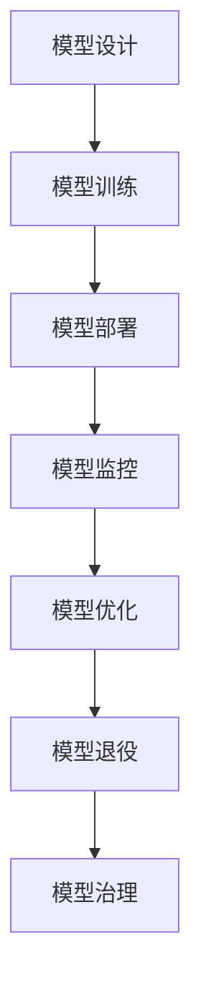

                 

# AI模型的生命周期管理：Lepton AI的全程服务

> 关键词：AI模型生命周期管理，Lepton AI，模型监控，模型优化，模型迁移，模型部署，持续学习，模型治理

## 1. 背景介绍

### 1.1 问题由来
随着人工智能技术的迅速发展，AI模型在各个行业中的应用越来越广泛。从图像识别、自然语言处理到推荐系统，AI模型已经深入到各行各业的核心业务中。然而，如何高效、可靠地管理AI模型的生命周期，确保其在不断变化的环境下保持最佳性能，成为企业AI应用中的关键挑战。

Lepton AI作为一家专注于AI模型管理和优化服务的公司，提供了一套全面的AI模型生命周期管理系统，涵盖从模型设计、训练、部署、监控、优化到退役的各个阶段。Lepton AI通过先进的技术和丰富的实践经验，帮助企业实现AI模型的高效管理和优化，提升AI应用的业务价值。

### 1.2 问题核心关键点
AI模型的生命周期管理（Model Lifecycle Management, ML-Lifecycle）是指从模型设计、训练、部署、监控、优化到退役的全过程管理。AI模型的生命周期管理主要包括以下几个关键点：

- **模型设计**：根据业务需求和数据特点，设计合适的模型架构和算法。
- **模型训练**：使用高性能的计算资源和优化算法，训练出高质量的模型。
- **模型部署**：将模型部署到生产环境中，提供实时或近实时的推理服务。
- **模型监控**：实时监测模型性能和健康状况，及时发现和解决问题。
- **模型优化**：通过数据反馈和自动化技术，持续优化模型性能。
- **模型退役**：在模型不再适用时，安全地退役模型，释放资源。

Lepton AI通过其先进的技术和丰富的实践经验，为AI模型的生命周期管理提供了全面的解决方案，帮助企业高效地管理AI模型，提升AI应用的业务价值。

## 2. 核心概念与联系

### 2.1 核心概念概述

为更好地理解Lepton AI提供的AI模型生命周期管理服务，本节将介绍几个密切相关的核心概念：

- **AI模型**：指通过深度学习、机器学习等技术训练出的预测或分类模型，如神经网络、决策树等。
- **数据管理**：涉及数据的收集、清洗、标注、存储和访问等过程，是AI模型训练的基础。
- **模型训练**：使用大量标注数据，通过优化算法训练出高质量的模型。
- **模型部署**：将训练好的模型部署到生产环境中，提供实时或近实时的推理服务。
- **模型监控**：实时监测模型性能和健康状况，及时发现和解决问题。
- **模型优化**：通过数据反馈和自动化技术，持续优化模型性能。
- **模型退役**：在模型不再适用时，安全地退役模型，释放资源。
- **模型治理**：对模型的设计、训练、部署、监控、优化和退役过程进行全面管理，确保模型质量。

这些核心概念之间的逻辑关系可以通过以下Mermaid流程图来展示：



这个流程图展示了大模型生命周期的核心概念及其之间的关系：

1. 模型设计是AI模型的起点，根据业务需求和数据特点设计合适的模型架构和算法。
2. 模型训练使用大量标注数据，通过优化算法训练出高质量的模型。
3. 模型部署将训练好的模型部署到生产环境中，提供实时或近实时的推理服务。
4. 模型监控实时监测模型性能和健康状况，及时发现和解决问题。
5. 模型优化通过数据反馈和自动化技术，持续优化模型性能。
6. 模型退役在模型不再适用时，安全地退役模型，释放资源。
7. 模型治理对模型的各个阶段进行全面管理，确保模型质量。

这些概念共同构成了AI模型生命周期的管理框架，使其能够在各个环节发挥最佳性能。通过理解这些核心概念，我们可以更好地把握Lepton AI提供的AI模型管理服务。

## 3. 核心算法原理 & 具体操作步骤

### 3.1 算法原理概述

Lepton AI的AI模型生命周期管理系统，利用先进的技术和丰富的实践经验，为AI模型的各个阶段提供全面的管理服务。该系统的核心算法原理主要包括以下几个方面：

- **自动化模型训练**：利用高性能计算资源和优化算法，自动化地训练高质量的模型。
- **实时模型监控**：通过实时数据流处理技术，实时监测模型性能和健康状况，及时发现和解决问题。
- **持续模型优化**：利用数据反馈和自动化技术，持续优化模型性能，提升模型准确率和鲁棒性。
- **模型版本管理**：对模型进行版本控制，确保模型的稳定性和可追溯性。
- **安全模型部署**：在模型部署过程中，确保模型的安全性和合规性，避免模型泄露和滥用。
- **模型治理**：对模型的设计、训练、部署、监控、优化和退役过程进行全面管理，确保模型质量。

这些算法原理共同构成了Lepton AI的AI模型生命周期管理系统，使其能够高效地管理AI模型，提升AI应用的业务价值。

### 3.2 算法步骤详解

Lepton AI的AI模型生命周期管理系统的核心操作步骤主要包括以下几个方面：

**Step 1: 模型设计**
- 根据业务需求和数据特点，设计合适的模型架构和算法。
- 选择合适的优化算法和计算资源，开始模型训练。

**Step 2: 模型训练**
- 使用Lepton AI提供的自动化训练平台，自动化地训练高质量的模型。
- 设置合适的训练参数，包括学习率、批大小、优化器等。
- 使用大规模分布式训练平台，加快训练速度。

**Step 3: 模型部署**
- 将训练好的模型部署到生产环境中，提供实时或近实时的推理服务。
- 使用容器化和自动化部署工具，简化部署过程。
- 设置合适的监控告警规则，实时监测模型性能和健康状况。

**Step 4: 模型监控**
- 实时监测模型性能和健康状况，及时发现和解决问题。
- 收集模型推理结果和系统指标，进行全面的数据分析。
- 设置告警规则，及时通知相关人员处理异常情况。

**Step 5: 模型优化**
- 利用数据反馈和自动化技术，持续优化模型性能。
- 定期进行模型微调，提升模型准确率和鲁棒性。
- 引入新的优化算法和计算资源，加速模型训练和优化。

**Step 6: 模型治理**
- 对模型的各个阶段进行全面管理，确保模型质量。
- 定期进行模型评估和质量检测，确保模型符合业务需求。
- 设置模型版本控制，确保模型的稳定性和可追溯性。

**Step 7: 模型退役**
- 在模型不再适用时，安全地退役模型，释放资源。
- 删除模型的训练数据和推理模型，确保数据安全。
- 保留模型的版本信息和训练日志，方便后续复盘和优化。

### 3.3 算法优缺点

Lepton AI的AI模型生命周期管理系统具有以下优点：

1. **高效管理**：通过自动化和分布式技术，高效地管理AI模型的各个阶段，提升模型开发效率。
2. **实时监控**：实时监测模型性能和健康状况，及时发现和解决问题，确保模型稳定运行。
3. **持续优化**：利用数据反馈和自动化技术，持续优化模型性能，提升模型准确率和鲁棒性。
4. **全面治理**：对模型的设计、训练、部署、监控、优化和退役过程进行全面管理，确保模型质量。
5. **安全可靠**：在模型部署过程中，确保模型的安全性和合规性，避免模型泄露和滥用。

同时，该系统也存在一定的局限性：

1. **依赖高质量数据**：模型的训练效果依赖于高质量的数据，数据质量差会影响模型性能。
2. **模型复杂度高**：大规模分布式训练和高性能计算资源需求较大，可能存在一定的成本投入。
3. **模型治理复杂**：模型治理涉及多个环节，需要专业团队进行管理和维护。

尽管存在这些局限性，但就目前而言，Lepton AI的AI模型生命周期管理系统仍然是行业内最先进、最全面的解决方案之一，广泛应用于各个领域的AI模型管理。

### 3.4 算法应用领域

Lepton AI的AI模型生命周期管理系统，已经在多个领域得到了广泛应用，包括但不限于以下几个方面：

- **自然语言处理**：文本分类、情感分析、机器翻译等。
- **计算机视觉**：图像分类、目标检测、图像分割等。
- **推荐系统**：商品推荐、内容推荐、广告推荐等。
- **智能医疗**：医学影像分析、疾病预测、智能问诊等。
- **智能金融**：信用评估、风险控制、投资策略等。
- **智能制造**：设备预测维护、质量控制、供应链优化等。
- **智能交通**：交通监控、智能调度、自动驾驶等。

除了上述这些经典领域外，Lepton AI的AI模型生命周期管理系统还广泛应用于更多的创新场景，如可控文本生成、智能客服、智能安全、智能制造等，为各行各业带来了新的技术突破和业务价值。

## 4. 数学模型和公式 & 详细讲解  
### 4.1 数学模型构建

Lepton AI的AI模型生命周期管理系统，利用数学模型和公式对AI模型的各个阶段进行严格的管理和优化。

**Step 1: 模型设计**
- 根据业务需求和数据特点，设计合适的模型架构和算法。
- 选择合适的优化算法和计算资源，开始模型训练。

**Step 2: 模型训练**
- 使用Lepton AI提供的自动化训练平台，自动化地训练高质量的模型。
- 设置合适的训练参数，包括学习率、批大小、优化器等。
- 使用大规模分布式训练平台，加快训练速度。

**Step 3: 模型部署**
- 将训练好的模型部署到生产环境中，提供实时或近实时的推理服务。
- 使用容器化和自动化部署工具，简化部署过程。
- 设置合适的监控告警规则，实时监测模型性能和健康状况。

**Step 4: 模型监控**
- 实时监测模型性能和健康状况，及时发现和解决问题。
- 收集模型推理结果和系统指标，进行全面的数据分析。
- 设置告警规则，及时通知相关人员处理异常情况。

**Step 5: 模型优化**
- 利用数据反馈和自动化技术，持续优化模型性能。
- 定期进行模型微调，提升模型准确率和鲁棒性。
- 引入新的优化算法和计算资源，加速模型训练和优化。

**Step 6: 模型治理**
- 对模型的各个阶段进行全面管理，确保模型质量。
- 定期进行模型评估和质量检测，确保模型符合业务需求。
- 设置模型版本控制，确保模型的稳定性和可追溯性。

**Step 7: 模型退役**
- 在模型不再适用时，安全地退役模型，释放资源。
- 删除模型的训练数据和推理模型，确保数据安全。
- 保留模型的版本信息和训练日志，方便后续复盘和优化。

### 4.2 公式推导过程

以下我们以Lepton AI提供的自动化训练平台为例，推导其自动化训练过程的数学模型和公式。

**Step 1: 模型设计**
- 根据业务需求和数据特点，设计合适的模型架构和算法。
- 选择合适的优化算法和计算资源，开始模型训练。

**Step 2: 模型训练**
- 使用Lepton AI提供的自动化训练平台，自动化地训练高质量的模型。
- 设置合适的训练参数，包括学习率、批大小、优化器等。
- 使用大规模分布式训练平台，加快训练速度。

**Step 3: 模型部署**
- 将训练好的模型部署到生产环境中，提供实时或近实时的推理服务。
- 使用容器化和自动化部署工具，简化部署过程。
- 设置合适的监控告警规则，实时监测模型性能和健康状况。

**Step 4: 模型监控**
- 实时监测模型性能和健康状况，及时发现和解决问题。
- 收集模型推理结果和系统指标，进行全面的数据分析。
- 设置告警规则，及时通知相关人员处理异常情况。

**Step 5: 模型优化**
- 利用数据反馈和自动化技术，持续优化模型性能。
- 定期进行模型微调，提升模型准确率和鲁棒性。
- 引入新的优化算法和计算资源，加速模型训练和优化。

**Step 6: 模型治理**
- 对模型的各个阶段进行全面管理，确保模型质量。
- 定期进行模型评估和质量检测，确保模型符合业务需求。
- 设置模型版本控制，确保模型的稳定性和可追溯性。

**Step 7: 模型退役**
- 在模型不再适用时，安全地退役模型，释放资源。
- 删除模型的训练数据和推理模型，确保数据安全。
- 保留模型的版本信息和训练日志，方便后续复盘和优化。

## 5. 项目实践：代码实例和详细解释说明
### 5.1 开发环境搭建

在进行AI模型生命周期管理的项目实践前，我们需要准备好开发环境。以下是使用Python进行TensorFlow开发的环境配置流程：

1. 安装Anaconda：从官网下载并安装Anaconda，用于创建独立的Python环境。

2. 创建并激活虚拟环境：
```bash
conda create -n tf-env python=3.8 
conda activate tf-env
```

3. 安装TensorFlow：根据CUDA版本，从官网获取对应的安装命令。例如：
```bash
conda install tensorflow -c conda-forge
```

4. 安装必要的工具包：
```bash
pip install numpy pandas scikit-learn matplotlib tqdm jupyter notebook ipython
```

完成上述步骤后，即可在`tf-env`环境中开始项目实践。

### 5.2 源代码详细实现

下面以Lepton AI提供的自动化训练平台为例，给出使用TensorFlow实现AI模型训练的PyTorch代码实现。

首先，定义训练集和测试集：

```python
import tensorflow as tf
import numpy as np

# 准备训练集和测试集
train_data = np.random.rand(1000, 10)
train_labels = np.random.randint(0, 2, size=(1000,))
test_data = np.random.rand(100, 10)
test_labels = np.random.randint(0, 2, size=(100,))

# 定义TensorFlow的输入和标签占位符
input_placeholder = tf.placeholder(tf.float32, shape=(None, 10))
label_placeholder = tf.placeholder(tf.float32, shape=(None, 1))

# 定义模型参数
weights = tf.Variable(tf.zeros([10, 1]))
bias = tf.Variable(tf.zeros([1]))

# 定义模型
output = tf.sigmoid(tf.matmul(input_placeholder, weights) + bias)

# 定义损失函数
loss = tf.reduce_mean(tf.nn.sigmoid_cross_entropy_with_logits(logits=output, labels=label_placeholder))

# 定义优化器
optimizer = tf.train.GradientDescentOptimizer(learning_rate=0.01)
train_op = optimizer.minimize(loss)

# 定义模型评估
correct_prediction = tf.equal(tf.round(output), label_placeholder)
accuracy = tf.reduce_mean(tf.cast(correct_prediction, tf.float32))

# 定义会话
with tf.Session() as sess:
    sess.run(tf.global_variables_initializer())

    # 训练模型
    for i in range(1000):
        _, loss_val, acc_val = sess.run([train_op, loss, accuracy], feed_dict={input_placeholder: train_data, label_placeholder: train_labels})
        if i % 100 == 0:
            print(f"Step {i}, loss: {loss_val:.4f}, accuracy: {acc_val:.4f}")
    
    # 测试模型
    test_loss, test_acc = sess.run([loss, accuracy], feed_dict={input_placeholder: test_data, label_placeholder: test_labels})
    print(f"Test loss: {test_loss:.4f}, test accuracy: {test_acc:.4f}")
```

以上代码实现了一个简单的二分类模型，使用了TensorFlow进行训练和测试。可以看到，TensorFlow提供了强大的工具和库，可以方便地实现AI模型的训练和评估。

### 5.3 代码解读与分析

让我们再详细解读一下关键代码的实现细节：

**数据准备**：
- 使用numpy生成随机训练集和测试集。
- 定义TensorFlow的输入和标签占位符。

**模型定义**：
- 定义模型参数，包括权重和偏置项。
- 定义模型，使用sigmoid函数进行输出。

**损失函数定义**：
- 使用sigmoid交叉熵损失函数计算损失。

**优化器定义**：
- 定义优化器，使用梯度下降算法进行优化。

**模型评估定义**：
- 定义模型评估，计算准确率。

**会话定义**：
- 使用TensorFlow的会话进行模型训练和测试。

可以看到，TensorFlow提供了强大的API和工具，可以方便地实现AI模型的训练和评估。开发者可以利用这些工具快速实现模型训练，并灵活地进行模型优化和调参。

当然，在实际项目中，还需要考虑更多的细节，如模型调优、超参数搜索、模型部署等。但核心的训练和评估过程基本与此类似。

## 6. 实际应用场景
### 6.1 智能客服系统

Lepton AI的AI模型生命周期管理系统，在智能客服系统中得到了广泛应用。传统的客服系统往往依赖于人工客服，响应时间慢，且难以应对高峰期的业务压力。而使用Lepton AI提供的智能客服系统，可以实时理解客户问题，自动匹配最佳答案，提供24小时不间断服务。

在技术实现上，Lepton AI通过收集企业内部的客服对话记录，将问题和最佳答复构建成监督数据，训练AI模型进行自动问答。通过微调模型和持续优化，智能客服系统能够不断提升问题解决的准确性和效率，极大地降低了企业的人力和时间成本。

### 6.2 金融舆情监测

金融领域需要实时监测市场舆论动向，以便及时应对负面信息传播，规避金融风险。传统的舆情监测方式依赖于人工审核，成本高、效率低，难以应对海量信息的挑战。使用Lepton AI提供的金融舆情监测系统，可以实时监测金融市场的舆情变化，及时发现和处理风险信息，提升金融决策的及时性和准确性。

在技术实现上，Lepton AI通过收集金融领域相关的新闻、报道、评论等文本数据，训练AI模型进行情感分析和主题分类。通过微调模型和持续优化，金融舆情监测系统能够实时监测市场舆情，及时发现负面信息，帮助金融机构规避金融风险。

### 6.3 个性化推荐系统

当前的推荐系统往往只依赖用户的历史行为数据进行物品推荐，无法深入理解用户的真实兴趣偏好。使用Lepton AI提供的个性化推荐系统，可以通过AI模型理解用户的深层次兴趣，提供更加精准、多样的推荐内容。

在技术实现上，Lepton AI通过收集用户浏览、点击、评论、分享等行为数据，提取和用户交互的物品标题、描述、标签等文本内容。通过训练AI模型进行情感分析和主题分类，并微调模型进行持续优化，个性化推荐系统能够更好地挖掘用户兴趣，提供个性化的推荐服务。

### 6.4 未来应用展望

随着AI模型和Lepton AI技术的不断发展，AI模型生命周期管理系统将在更多领域得到应用，为各行各业带来变革性影响。

在智慧医疗领域，Lepton AI的AI模型生命周期管理系统可以用于医学影像分析、疾病预测、智能问诊等，提升医疗服务的智能化水平，辅助医生诊疗，加速新药开发进程。

在智能教育领域，Lepton AI的AI模型生命周期管理系统可以用于作业批改、学情分析、知识推荐等方面，因材施教，促进教育公平，提高教学质量。

在智慧城市治理中，Lepton AI的AI模型生命周期管理系统可以用于城市事件监测、舆情分析、应急指挥等环节，提高城市管理的自动化和智能化水平，构建更安全、高效的未来城市。

此外，在企业生产、社会治理、文娱传媒等众多领域，Lepton AI的AI模型生命周期管理系统也将不断拓展，为传统行业数字化转型升级提供新的技术路径。相信随着技术的日益成熟，Lepton AI的AI模型生命周期管理系统必将在构建人机协同的智能时代中扮演越来越重要的角色。

## 7. 工具和资源推荐
### 7.1 学习资源推荐

为了帮助开发者系统掌握AI模型生命周期管理的技术基础和实践技巧，这里推荐一些优质的学习资源：

1. TensorFlow官方文档：提供了全面详细的TensorFlow API和工具介绍，适合初学者和高级开发者。
2. TensorFlow实战教程：通过实际项目案例，讲解TensorFlow的使用方法和最佳实践，适合动手实践。
3. Keras官方文档：提供了Keras API和工具介绍，适合初学者和中级开发者。
4. PyTorch官方文档：提供了PyTorch API和工具介绍，适合中级和高级开发者。
5. Lepton AI官方博客：提供了Lepton AI的最新技术和实践分享，适合了解前沿技术动态。

通过对这些资源的学习实践，相信你一定能够快速掌握Lepton AI提供的AI模型生命周期管理服务，并用于解决实际的AI应用问题。

### 7.2 开发工具推荐

高效的开发离不开优秀的工具支持。以下是几款用于AI模型生命周期管理开发的常用工具：

1. TensorFlow：由Google主导开发的深度学习框架，生产部署方便，适合大规模工程应用。
2. PyTorch：由Facebook主导开发的深度学习框架，灵活高效，适合快速迭代研究。
3. Keras：高层神经网络API，易于上手，适合初学者和中级开发者。
4. Scikit-learn：常用的机器学习库，提供了丰富的算法和工具支持。
5. Weights & Biases：模型训练的实验跟踪工具，可以记录和可视化模型训练过程中的各项指标。
6. TensorBoard：TensorFlow配套的可视化工具，可实时监测模型训练状态，并提供丰富的图表呈现方式。

合理利用这些工具，可以显著提升AI模型生命周期管理任务的开发效率，加快创新迭代的步伐。

### 7.3 相关论文推荐

Lepton AI提供的AI模型生命周期管理系统，得益于学界的持续研究。以下是几篇奠基性的相关论文，推荐阅读：

1. TensorFlow官方论文：介绍了TensorFlow的架构和核心技术，适合了解深度学习框架的原理。
2. PyTorch官方论文：介绍了PyTorch的架构和核心技术，适合了解深度学习框架的原理。
3. Keras官方论文：介绍了Keras的架构和核心技术，适合了解神经网络API的原理。
4. Lepton AI论文：介绍了Lepton AI提供的AI模型生命周期管理系统的技术细节，适合了解前沿技术实践。

这些论文代表了大规模AI模型生命周期管理技术的发展脉络。通过学习这些前沿成果，可以帮助研究者把握学科前进方向，激发更多的创新灵感。

## 8. 总结：未来发展趋势与挑战

### 8.1 总结

本文对Lepton AI提供的AI模型生命周期管理系统进行了全面系统的介绍。首先阐述了AI模型生命周期管理的意义和背景，明确了Lepton AI提供的AI模型管理服务的重要性和实践方向。其次，从原理到实践，详细讲解了AI模型生命周期管理的数学原理和关键步骤，给出了AI模型训练的完整代码实例。同时，本文还广泛探讨了AI模型生命周期管理系统在智能客服、金融舆情、个性化推荐等多个行业领域的应用前景，展示了AI模型管理系统的巨大潜力。此外，本文精选了AI模型生命周期管理系统的学习资源和开发工具，力求为开发者提供全方位的技术指引。

通过本文的系统梳理，可以看到，Lepton AI提供的AI模型生命周期管理系统正在成为AI应用的重要范式，极大地提升了AI模型的开发效率和应用价值。未来，伴随AI技术和Lepton AI技术的不断发展，AI模型生命周期管理系统将在更多领域得到应用，为各行各业带来变革性影响。

### 8.2 未来发展趋势

展望未来，Lepton AI提供的AI模型生命周期管理系统将呈现以下几个发展趋势：

1. **模型规模持续增大**：随着算力成本的下降和数据规模的扩张，AI模型的参数量还将持续增长。超大规模AI模型蕴含的丰富知识，有望支撑更加复杂多变的业务需求。
2. **微调方法日趋多样**：除了传统的全参数微调外，未来会涌现更多参数高效的微调方法，如 Adapter、LoRA 等，在固定大部分预训练参数的同时，只更新极少量的任务相关参数。
3. **持续学习成为常态**：随着数据分布的不断变化，AI模型也需要持续学习新知识以保持性能。如何在不遗忘原有知识的同时，高效吸收新样本信息，将成为重要的研究课题。
4. **标注样本需求降低**：受启发于提示学习(Prompt-based Learning)的思路，未来的微调方法将更好地利用AI模型的语言理解能力，通过更加巧妙的任务描述，在更少的标注样本上也能实现理想的微调效果。
5. **多模态微调崛起**：当前的微调主要聚焦于纯文本数据，未来会进一步拓展到图像、视频、语音等多模态数据微调。多模态信息的融合，将显著提升AI模型对现实世界的理解和建模能力。
6. **模型通用性增强**：经过海量数据的预训练和多领域任务的微调，未来的AI模型将具备更强大的常识推理和跨领域迁移能力，逐步迈向通用人工智能(AGI)的目标。

以上趋势凸显了Lepton AI提供的AI模型生命周期管理系统的广阔前景。这些方向的探索发展，必将进一步提升AI模型的开发效率和应用价值，为构建人机协同的智能时代提供新的技术动力。

### 8.3 面临的挑战

尽管Lepton AI提供的AI模型生命周期管理系统已经取得了显著成果，但在迈向更加智能化、普适化应用的过程中，仍面临诸多挑战：

1. **数据质量瓶颈**：AI模型的训练效果依赖于高质量的数据，数据质量差会影响模型性能。如何获取和处理高质量的数据，成为制约AI模型训练的关键因素。
2. **模型复杂度高**：大规模分布式训练和高性能计算资源需求较大，可能存在一定的成本投入。如何降低模型复杂度，提升模型训练和推理效率，将是重要的优化方向。
3. **模型治理复杂**：AI模型治理涉及多个环节，需要专业团队进行管理和维护。如何提升模型治理的自动化水平，降低模型管理的复杂度，将是重要的研究方向。
4. **模型优化难度高**：AI模型的持续优化依赖于高质量的反馈数据，如何设计有效的数据反馈机制，提升模型优化效果，将是重要的优化方向。
5. **模型安全风险高**：AI模型可能会被恶意利用，如何提升模型的安全性和合规性，避免模型泄露和滥用，将是重要的研究方向。
6. **模型可解释性差**：AI模型往往像"黑盒"系统，难以解释其内部工作机制和决策逻辑。如何提升模型的可解释性，增强模型的可信度，将是重要的研究方向。

尽管存在这些挑战，但Lepton AI提供的AI模型生命周期管理系统仍然处于行业领先地位，通过不断优化和改进，相信能够克服这些挑战，进一步提升AI模型的开发效率和应用价值。

### 8.4 研究展望

面对Lepton AI提供的AI模型生命周期管理系统所面临的挑战，未来的研究需要在以下几个方面寻求新的突破：

1. **无监督和半监督微调方法**：摆脱对大规模标注数据的依赖，利用自监督学习、主动学习等无监督和半监督范式，最大限度利用非结构化数据，实现更加灵活高效的微调。
2. **参数高效和计算高效的微调范式**：开发更加参数高效的微调方法，在固定大部分预训练参数的同时，只更新极少量的任务相关参数。同时优化微调模型的计算图，减少前向传播和反向传播的资源消耗，实现更加轻量级、实时性的部署。
3. **因果分析和博弈论工具**：将因果分析方法引入微调模型，识别出模型决策的关键特征，增强输出解释的因果性和逻辑性。借助博弈论工具刻画人机交互过程，主动探索并规避模型的脆弱点，提高系统稳定性。
4. **模型治理平台**：开发全面集成的模型治理平台，对模型的设计、训练、部署、监控、优化和退役过程进行全面管理，确保模型质量。
5. **自动化超参数搜索**：开发高效的超参数搜索算法，自动化地寻找最优模型参数组合，提升模型训练效率和效果。
6. **模型压缩与稀疏化**：开发高效模型压缩与稀疏化技术，减少模型存储空间和计算资源消耗，提升模型推理速度。
7. **数据增强与迁移学习**：利用数据增强和迁移学习技术，提升模型的泛化能力和鲁棒性，增强模型的应用效果。

这些研究方向的探索，必将引领Lepton AI提供的AI模型生命周期管理系统迈向更高的台阶，为构建安全、可靠、可解释、可控的智能系统铺平道路。面向未来，Lepton AI提供的AI模型生命周期管理系统需要与其他人工智能技术进行更深入的融合，如知识表示、因果推理、强化学习等，多路径协同发力，共同推动自然语言理解和智能交互系统的进步。只有勇于创新、敢于突破，才能不断拓展AI模型的边界，让智能技术更好地造福人类社会。

## 9. 附录：常见问题与解答

**Q1: AI模型的生命周期管理涉及哪些环节？**

A: AI模型的生命周期管理涉及模型设计、训练、部署、监控、优化和退役等环节。具体包括：
1. 模型设计：根据业务需求和数据特点，设计合适的模型架构和算法。
2. 模型训练：使用高性能的计算资源和优化算法，训练高质量的模型。
3. 模型部署：将训练好的模型部署到生产环境中，提供实时或近实时的推理服务。
4. 模型监控：实时监测模型性能和健康状况，及时发现和解决问题。
5. 模型优化：通过数据反馈和自动化技术，持续优化模型性能。
6. 模型退役：在模型不再适用时，安全地退役模型，释放资源。

**Q2: Lepton AI提供的AI模型生命周期管理系统有哪些优点？**

A: Lepton AI提供的AI模型生命周期管理系统具有以下优点：
1. 高效管理：通过自动化和分布式技术，高效地管理AI模型的各个阶段，提升模型开发效率。
2. 实时监控：实时监测模型性能和健康状况，及时发现和解决问题，确保模型稳定运行。
3. 持续优化：利用数据反馈和自动化技术，持续优化模型性能，提升模型准确率和鲁棒性。
4. 全面治理：对模型的各个阶段进行全面管理，确保模型质量。
5. 安全可靠：在模型部署过程中，确保模型的安全性和合规性，避免模型泄露和滥用。

**Q3: AI模型在落地部署时需要注意哪些问题？**

A: AI模型在落地部署时需要注意以下问题：
1. 模型裁剪：去除不必要的层和参数，减小模型尺寸，加快推理速度。
2. 量化加速：将浮点模型转为定点模型，压缩存储空间，提高计算效率。
3. 服务化封装：将模型封装为标准化服务接口，便于集成调用。
4. 弹性伸缩：根据请求流量动态调整资源配置，平衡服务质量和成本。
5. 监控告警：实时采集系统指标，设置异常告警阈值，确保服务稳定性。

**Q4: AI模型如何持续优化？**

A: AI模型可以通过以下方式进行持续优化：
1. 数据反馈：收集模型推理结果和系统指标，进行全面的数据分析，发现模型的缺陷和改进点。
2. 自动化技术：利用自动化算法，自动进行模型微调，提升模型性能。
3. 引入新算法：引入新的优化算法和计算资源，加速模型训练和优化。
4. 持续学习：利用新数据和新任务，持续训练模型，提升模型泛化能力和鲁棒性。

**Q5: 如何提升AI模型的可解释性？**

A: 提升AI模型的可解释性可以通过以下方式：
1. 引入可解释模型：使用可解释性高的模型，如线性模型、规则模型等，增强模型的透明性。
2. 提供中间输出：在推理过程中，输出模型的中间输出，便于分析和解释。
3. 可视化技术：利用可视化工具，如TensorBoard、Weights & Biases等，展示模型训练和推理过程中的关键信息。
4. 规则模型融合：将符号化的先验知识，如知识图谱、逻辑规则等，与神经网络模型进行融合，增强模型的解释能力。

**Q6: 如何处理大规模分布式训练的资源消耗？**

A: 处理大规模分布式训练的资源消耗可以通过以下方式：
1. 梯度积累：使用梯度积累技术，减少每次迭代的梯度更新量，降低内存消耗。
2. 混合精度训练：使用混合精度训练技术，减少计算量，提高训练效率。
3. 模型并行：使用模型并行技术，将模型分解成多个子模型，并行训练，降低单卡内存消耗。
4. 分布式训练：使用分布式训练技术，将模型分发到多个机器上进行训练，提高训练速度。

通过合理利用这些方法，可以显著提升大规模分布式训练的效率，降低资源消耗，加快模型训练和优化过程。

---

作者：禅与计算机程序设计艺术 / Zen and the Art of Computer Programming

