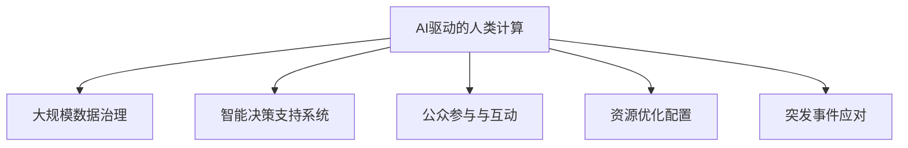

                 

# AI驱动的创新：人类计算在政府治理中的作用

## 1. 背景介绍

### 1.1 问题由来

在数字化、信息化浪潮的推动下，全球政府治理正在经历深刻变革。信息技术的应用，从电子政务、智能审批，到公共数据开放、智能监管，不断提升着政府治理的效率和透明度。然而，政府事务繁多、数据庞大、业务复杂，仅靠传统的信息系统无法满足其复杂需求。

近年来，以人工智能（AI）为代表的新一代信息技术迅猛发展，正在成为驱动政府治理创新的重要引擎。AI技术以其强大的计算能力、广泛的应用场景和卓越的决策能力，为政府治理提供了新思路和新手段。

### 1.2 问题核心关键点

人类计算（Human Computation）是指利用大规模人群协作，对复杂问题进行求解的一种计算模式。随着AI技术的不断进步，AI驱动的人类计算成为当前政府治理中的重要方向。

AI驱动的人类计算主要包括以下几个核心关键点：
1. **大规模数据处理**：通过AI算法处理海量数据，提取有效信息，实现高效的数据治理。
2. **智能决策支持**：利用AI模型的预测能力，辅助政府决策，提升决策科学性。
3. **用户参与和协同**：借助AI技术，增强公众参与和互动，提升政府透明度和满意度。
4. **资源优化配置**：通过AI模型优化资源配置，提升政府服务效率。
5. **应对突发事件**：利用AI技术应对公共突发事件，提高政府应急响应能力。

这些关键点共同构成了AI驱动的人类计算在政府治理中的应用框架，使其能够在复杂多变的场景下，发挥重要作用。

### 1.3 问题研究意义

研究AI驱动的人类计算在政府治理中的应用，对于提升政府治理效率、透明度、决策科学性以及公众满意度具有重要意义：

1. **提升政府治理效率**：通过AI技术处理大规模数据，优化资源配置，显著提升政府事务处理的效率。
2. **增强决策科学性**：利用AI模型对海量数据进行智能分析，辅助政府进行科学决策。
3. **提高政府透明度**：通过AI技术增强公众参与和互动，提升政府决策和治理过程的透明度。
4. **促进公平和公正**：AI技术的应用，可以消除人为偏见，提升政策制定和执行的公平性。
5. **增强应急响应能力**：利用AI技术，提升政府对突发事件和危机事件的应对能力，保障社会稳定。

## 2. 核心概念与联系

### 2.1 核心概念概述

为更好地理解AI驱动的人类计算在政府治理中的应用，本节将介绍几个密切相关的核心概念：

- **AI驱动的人类计算**：利用AI算法处理大规模数据，结合人工计算，求解复杂问题的一种计算模式。
- **大规模数据治理**：通过AI技术处理海量数据，提取有效信息，实现数据的高效管理和治理。
- **智能决策支持系统**：利用AI模型进行数据挖掘、分析和预测，辅助政府进行决策，提升决策科学性。
- **公众参与与互动**：借助AI技术，增强公众参与和互动，提升政府决策的透明度和满意度。
- **资源优化配置**：通过AI模型优化资源配置，提升政府服务的效率和质量。
- **突发事件应对**：利用AI技术，提升政府对突发事件和危机事件的应对能力，保障社会稳定。

这些核心概念之间的逻辑关系可以通过以下Mermaid流程图来展示：



这个流程图展示了大规模数据治理、智能决策支持系统、公众参与与互动、资源优化配置和突发事件应对，是如何在大规模数据和AI技术支撑下协同工作的。

## 3. 核心算法原理 & 具体操作步骤
### 3.1 算法原理概述

AI驱动的人类计算主要基于以下算法原理：

- **机器学习与深度学习**：通过机器学习算法和大规模数据训练，构建智能模型，用于数据治理、决策支持和资源优化配置。
- **自然语言处理（NLP）**：利用自然语言处理技术，实现对文本数据的高效分析和理解，辅助政府决策和公众互动。
- **图像与视频分析**：通过图像和视频分析技术，提升对复杂场景的识别和理解能力，支持突发事件应对和资源优化配置。
- **分布式计算与云计算**：利用分布式计算和云计算技术，实现大规模数据的高效处理和存储，支持AI模型的训练和应用。
- **智能推荐与个性化服务**：通过智能推荐算法和个性化服务技术，提升政府服务的精准度和用户体验。

### 3.2 算法步骤详解

AI驱动的人类计算在政府治理中的应用，主要包括以下几个关键步骤：

**Step 1: 数据收集与预处理**
- 收集政府治理相关的各类数据，包括公共服务数据、行政执法数据、社会经济数据、地理信息数据等。
- 对数据进行清洗、去重、归一化等预处理，确保数据质量和一致性。

**Step 2: 数据建模与分析**
- 构建基于机器学习、深度学习等算法的模型，对预处理后的数据进行建模和分析。
- 通过模型训练和调优，实现对大规模数据的有效处理和智能分析。

**Step 3: 智能决策支持**
- 利用智能决策支持系统，辅助政府进行政策制定和执行。
- 系统根据输入数据和模型输出，生成决策建议和优化方案。

**Step 4: 公众参与与互动**
- 通过智能推荐和个性化服务技术，增强公众参与和互动。
- 利用自然语言处理技术，实现对公众咨询、建议和反馈的智能分析和响应。

**Step 5: 资源优化配置**
- 利用智能推荐和优化算法，优化政府资源配置。
- 通过模型分析，生成资源优化配置方案，提升政府服务效率。

**Step 6: 突发事件应对**
- 利用图像和视频分析技术，实时监控和分析突发事件。
- 根据分析结果，生成应急响应方案，并及时通知相关人员和机构。

### 3.3 算法优缺点

AI驱动的人类计算在政府治理中的应用具有以下优点：

1. **效率提升**：通过AI技术处理大规模数据，显著提升政府事务处理的效率。
2. **决策科学化**：利用AI模型进行数据分析和预测，辅助政府进行科学决策。
3. **透明度增强**：通过公众参与和互动，提升政府决策和治理过程的透明度。
4. **公平性提升**：消除人为偏见，提升政策制定和执行的公平性。
5. **应急响应能力提高**：利用AI技术，提升政府对突发事件和危机事件的应对能力。

同时，该方法也存在一定的局限性：

1. **数据依赖性强**：AI驱动的人类计算高度依赖高质量的数据，数据质量差会影响模型效果。
2. **模型复杂度高**：AI模型复杂度较高，训练和调优需要大量计算资源。
3. **可解释性不足**：AI模型的决策过程缺乏可解释性，难以对其推理逻辑进行分析和调试。
4. **安全性风险**：AI模型可能被恶意攻击和篡改，影响政府治理安全。

尽管存在这些局限性，但就目前而言，AI驱动的人类计算仍是政府治理中的重要方向。未来相关研究的重点在于如何进一步降低数据依赖性，提高模型的可解释性和安全性，同时兼顾效率和公平性等因素。

### 3.4 算法应用领域

AI驱动的人类计算在政府治理中的应用已经涉及到多个领域，包括但不限于：

- **智能审批与公共服务**：通过AI技术优化审批流程，提升公共服务效率。
- **智能监管与执法**：利用AI技术进行智能监管，提升执法效率和效果。
- **公共安全与应急管理**：通过图像和视频分析技术，提升公共安全事件和应急事件的响应能力。
- **环境保护与资源管理**：利用AI技术进行环境监测和资源管理，提升政府治理能力。
- **智慧城市与基础设施**：利用AI技术优化城市管理，提升基础设施运行效率。
- **教育与医疗**：利用AI技术进行教育和医疗资源的优化配置，提升公共服务质量。

这些领域的应用展示了AI驱动的人类计算在政府治理中的广泛前景和巨大潜力。随着AI技术的不断进步，AI驱动的人类计算将在更多领域得到应用，为政府治理带来变革性影响。

## 4. 数学模型和公式 & 详细讲解 & 举例说明
### 4.1 数学模型构建

本节将使用数学语言对AI驱动的人类计算在政府治理中的应用过程进行更加严格的刻画。

记政府治理相关的数据集为 $D=\{(x_i,y_i)\}_{i=1}^N$，其中 $x_i$ 表示输入数据，$y_i$ 表示目标标签。

定义模型 $M_{\theta}$ 在输入数据 $x_i$ 上的预测结果为 $\hat{y}_i=M_{\theta}(x_i)$。模型的损失函数为 $\ell(\hat{y}_i,y_i)$，用于衡量预测结果与真实标签之间的差异。

### 4.2 公式推导过程

以智能审批为例，假设输入数据为申请人的申请材料 $x_i$，目标标签为审批结果 $y_i$（通过或未通过）。则模型的预测结果 $\hat{y}_i$ 为模型在 $x_i$ 上的输出，即 $P(\text{通过}|\text{申请材料}=x_i)$。

模型的损失函数为交叉熵损失函数，定义为：

$$
\ell(\hat{y}_i,y_i) = -y_i\log \hat{y}_i + (1-y_i)\log(1-\hat{y}_i)
$$

在得到损失函数之后，通过梯度下降等优化算法，对模型参数 $\theta$ 进行迭代优化，最小化损失函数：

$$
\theta^* = \mathop{\arg\min}_{\theta} \mathcal{L}(\theta)
$$

在实践中，模型通常使用基于深度学习的算法进行训练，如卷积神经网络（CNN）、递归神经网络（RNN）、Transformer等。不同模型对数据的处理方式不同，但基本思路相同，即通过大量数据训练，提取数据特征，构建智能模型。

### 4.3 案例分析与讲解

假设政府某部门需要对大量审批申请进行自动化审批，数据集 $D$ 包含了不同申请人的申请材料和审批结果。通过AI驱动的人类计算，可以在线实时对新申请进行审批。

1. **数据收集与预处理**：收集历史审批数据 $D$，进行清洗、去重、归一化等预处理。
2. **模型训练与调优**：构建基于深度学习的审批模型，对预处理后的数据进行训练和调优，得到模型参数 $\theta$。
3. **智能审批**：将新申请的审批材料输入模型 $M_{\theta}$，得到审批结果 $\hat{y}$，辅助人工进行审批决策。

### 5. 项目实践：代码实例和详细解释说明
### 5.1 开发环境搭建

在进行AI驱动的人类计算项目实践前，我们需要准备好开发环境。以下是使用Python进行PyTorch开发的环境配置流程：

1. 安装Anaconda：从官网下载并安装Anaconda，用于创建独立的Python环境。

2. 创建并激活虚拟环境：
```bash
conda create -n pytorch-env python=3.8 
conda activate pytorch-env
```

3. 安装PyTorch：根据CUDA版本，从官网获取对应的安装命令。例如：
```bash
conda install pytorch torchvision torchaudio cudatoolkit=11.1 -c pytorch -c conda-forge
```

4. 安装各类工具包：
```bash
pip install numpy pandas scikit-learn matplotlib tqdm jupyter notebook ipython
```

完成上述步骤后，即可在`pytorch-env`环境中开始项目实践。

### 5.2 源代码详细实现

下面以智能审批系统为例，给出使用Transformers库进行审批模型的PyTorch代码实现。

首先，定义审批数据处理函数：

```python
from transformers import BertTokenizer
from torch.utils.data import Dataset
import torch

class ApprovalDataset(Dataset):
    def __init__(self, texts, labels, tokenizer, max_len=128):
        self.texts = texts
        self.labels = labels
        self.tokenizer = tokenizer
        self.max_len = max_len
        
    def __len__(self):
        return len(self.texts)
    
    def __getitem__(self, item):
        text = self.texts[item]
        label = self.labels[item]
        
        encoding = self.tokenizer(text, return_tensors='pt', max_length=self.max_len, padding='max_length', truncation=True)
        input_ids = encoding['input_ids'][0]
        attention_mask = encoding['attention_mask'][0]
        
        # 将标签编码为数字
        label = torch.tensor([label2id[label]], dtype=torch.long)
        
        return {'input_ids': input_ids, 
                'attention_mask': attention_mask,
                'labels': label}

# 标签与id的映射
label2id = {'通过': 0, '未通过': 1}
id2label = {v: k for k, v in label2id.items()}

# 创建dataset
tokenizer = BertTokenizer.from_pretrained('bert-base-cased')

train_dataset = ApprovalDataset(train_texts, train_labels, tokenizer)
dev_dataset = ApprovalDataset(dev_texts, dev_labels, tokenizer)
test_dataset = ApprovalDataset(test_texts, test_labels, tokenizer)
```

然后，定义模型和优化器：

```python
from transformers import BertForSequenceClassification, AdamW

model = BertForSequenceClassification.from_pretrained('bert-base-cased', num_labels=len(label2id))

optimizer = AdamW(model.parameters(), lr=2e-5)
```

接着，定义训练和评估函数：

```python
from torch.utils.data import DataLoader
from tqdm import tqdm
from sklearn.metrics import accuracy_score

device = torch.device('cuda') if torch.cuda.is_available() else torch.device('cpu')
model.to(device)

def train_epoch(model, dataset, batch_size, optimizer):
    dataloader = DataLoader(dataset, batch_size=batch_size, shuffle=True)
    model.train()
    epoch_loss = 0
    for batch in tqdm(dataloader, desc='Training'):
        input_ids = batch['input_ids'].to(device)
        attention_mask = batch['attention_mask'].to(device)
        labels = batch['labels'].to(device)
        model.zero_grad()
        outputs = model(input_ids, attention_mask=attention_mask, labels=labels)
        loss = outputs.loss
        epoch_loss += loss.item()
        loss.backward()
        optimizer.step()
    return epoch_loss / len(dataloader)

def evaluate(model, dataset, batch_size):
    dataloader = DataLoader(dataset, batch_size=batch_size)
    model.eval()
    preds, labels = [], []
    with torch.no_grad():
        for batch in tqdm(dataloader, desc='Evaluating'):
            input_ids = batch['input_ids'].to(device)
            attention_mask = batch['attention_mask'].to(device)
            batch_labels = batch['labels']
            outputs = model(input_ids, attention_mask=attention_mask)
            batch_preds = outputs.logits.argmax(dim=1).to('cpu').tolist()
            batch_labels = batch_labels.to('cpu').tolist()
            for pred, label in zip(batch_preds, batch_labels):
                preds.append(pred)
                labels.append(label)
                
    print(f"Accuracy: {accuracy_score(labels, preds)}")
```

最后，启动训练流程并在测试集上评估：

```python
epochs = 5
batch_size = 16

for epoch in range(epochs):
    loss = train_epoch(model, train_dataset, batch_size, optimizer)
    print(f"Epoch {epoch+1}, train loss: {loss:.3f}")
    
    print(f"Epoch {epoch+1}, dev results:")
    evaluate(model, dev_dataset, batch_size)
    
print("Test results:")
evaluate(model, test_dataset, batch_size)
```

以上就是使用PyTorch对审批模型进行智能审批系统开发的完整代码实现。可以看到，得益于Transformers库的强大封装，我们可以用相对简洁的代码完成审批模型的加载和微调。

### 5.3 代码解读与分析

让我们再详细解读一下关键代码的实现细节：

**ApprovalDataset类**：
- `__init__`方法：初始化文本、标签、分词器等关键组件。
- `__len__`方法：返回数据集的样本数量。
- `__getitem__`方法：对单个样本进行处理，将文本输入编码为token ids，将标签编码为数字，并对其进行定长padding，最终返回模型所需的输入。

**label2id和id2label字典**：
- 定义了标签与数字id之间的映射关系，用于将预测结果解码为真实的标签。

**训练和评估函数**：
- 使用PyTorch的DataLoader对数据集进行批次化加载，供模型训练和推理使用。
- 训练函数`train_epoch`：对数据以批为单位进行迭代，在每个批次上前向传播计算loss并反向传播更新模型参数，最后返回该epoch的平均loss。
- 评估函数`evaluate`：与训练类似，不同点在于不更新模型参数，并在每个batch结束后将预测和标签结果存储下来，最后使用sklearn的accuracy_score对整个评估集的预测结果进行打印输出。

**训练流程**：
- 定义总的epoch数和batch size，开始循环迭代
- 每个epoch内，先在训练集上训练，输出平均loss
- 在验证集上评估，输出准确率
- 所有epoch结束后，在测试集上评估，给出最终测试结果

可以看到，PyTorch配合Transformers库使得审批模型的微调代码实现变得简洁高效。开发者可以将更多精力放在数据处理、模型改进等高层逻辑上，而不必过多关注底层的实现细节。

当然，工业级的系统实现还需考虑更多因素，如模型的保存和部署、超参数的自动搜索、更灵活的任务适配层等。但核心的微调范式基本与此类似。

## 6. 实际应用场景
### 6.1 智能审批与公共服务

AI驱动的人类计算在智能审批和公共服务中的应用，可以显著提升审批效率和公众满意度。传统人工审批流程繁琐、耗时，且容易产生人为错误，无法满足现代政府治理的高效性和精准性要求。

在实际应用中，可以利用AI驱动的人类计算，对大量审批申请进行自动化处理。具体实现步骤包括：
- 收集历史审批数据，构建训练集和测试集。
- 通过AI模型进行数据预处理和特征提取，构建审批模型。
- 对新申请进行自动化审批，提高审批效率和准确率。
- 利用AI模型进行异常检测和预警，提高审批过程的透明性和安全性。

### 6.2 智能监管与执法

AI驱动的人类计算在智能监管和执法中的应用，可以提升监管和执法效率和效果。传统的监管和执法依赖人力，容易受到人为因素的影响，且效率低下。

在智能监管和执法场景中，可以利用AI驱动的人类计算，实现对各类违规行为的智能识别和处理。具体实现步骤包括：
- 收集历史监管数据，构建训练集和测试集。
- 通过AI模型进行数据预处理和特征提取，构建智能监管模型。
- 对各类违规行为进行智能识别和处理，提高监管和执法效率。
- 利用AI模型进行异常检测和预警，提高监管和执法过程的透明性和安全性。

### 6.3 公共安全与应急管理

AI驱动的人类计算在公共安全与应急管理中的应用，可以提升应对突发事件的能力。公共安全事件和应急事件具有突发性、复杂性，传统的人工应对方式难以满足快速响应和精确判断的要求。

在公共安全与应急管理场景中，可以利用AI驱动的人类计算，实现对突发事件的实时监控和分析。具体实现步骤包括：
- 收集各类公共安全事件和应急事件的数据，构建训练集和测试集。
- 通过AI模型进行数据预处理和特征提取，构建智能监控和分析模型。
- 实时监控各类突发事件，生成应急响应方案。
- 利用AI模型进行事件趋势预测和预警，提高应急响应能力和安全保障水平。

### 6.4 环境保护与资源管理

AI驱动的人类计算在环境保护与资源管理中的应用，可以提升资源管理和环境监测的效率和效果。环境保护和资源管理涉及多方面数据，传统的人工处理方式效率低下，无法满足现代化管理的需求。

在环境保护与资源管理场景中，可以利用AI驱动的人类计算，实现对各类环境数据的高效分析和处理。具体实现步骤包括：
- 收集各类环境监测数据和资源管理数据，构建训练集和测试集。
- 通过AI模型进行数据预处理和特征提取，构建智能分析和处理模型。
- 实时监测各类环境指标，生成资源优化配置方案。
- 利用AI模型进行环境趋势预测和预警，提高环境管理和资源利用效率。

### 6.5 智慧城市与基础设施

AI驱动的人类计算在智慧城市与基础设施中的应用，可以提升城市管理和基础设施运行的效率和效果。智慧城市和基础设施涉及各类数据，传统的人工处理方式效率低下，无法满足现代化管理的需求。

在智慧城市与基础设施场景中，可以利用AI驱动的人类计算，实现对各类城市数据的高效分析和处理。具体实现步骤包括：
- 收集各类城市数据和基础设施运行数据，构建训练集和测试集。
- 通过AI模型进行数据预处理和特征提取，构建智能分析和处理模型。
- 实时监测各类城市指标，生成城市运行优化配置方案。
- 利用AI模型进行城市发展趋势预测和预警，提高城市管理和基础设施运行效率。

### 6.6 教育与医疗

AI驱动的人类计算在教育与医疗中的应用，可以提升教育和医疗服务的效率和效果。教育和医疗涉及多方面数据，传统的人工处理方式效率低下，无法满足现代化服务的需求。

在教育和医疗场景中，可以利用AI驱动的人类计算，实现对各类教育资源和医疗数据的高效分析和处理。具体实现步骤包括：
- 收集各类教育资源和医疗数据，构建训练集和测试集。
- 通过AI模型进行数据预处理和特征提取，构建智能分析和处理模型。
- 实时监测各类教育资源和医疗数据，生成教育资源优化配置方案和医疗方案。
- 利用AI模型进行教育发展趋势和医疗趋势预测，提高教育质量和医疗服务水平。

## 7. 工具和资源推荐
### 7.1 学习资源推荐

为了帮助开发者系统掌握AI驱动的人类计算的理论基础和实践技巧，这里推荐一些优质的学习资源：

1. 《深度学习理论与实践》系列博文：由AI技术专家撰写，深入浅出地介绍了深度学习算法及其在AI驱动的人类计算中的应用。

2. 斯坦福大学CS229课程：由斯坦福大学开设的机器学习课程，涵盖了机器学习的基础理论和实践应用，包括AI驱动的人类计算相关内容。

3. 《深度学习》书籍：深度学习领域的经典教材，详细介绍了深度学习算法的原理和应用，包括AI驱动的人类计算相关内容。

4. Kaggle竞赛平台：通过参加各类机器学习竞赛，积累实践经验，提升AI驱动的人类计算能力。

5. GitHub开源项目：参与开源项目，了解AI驱动的人类计算的实际应用案例，学习先进技术和经验。

通过对这些资源的学习实践，相信你一定能够快速掌握AI驱动的人类计算的精髓，并用于解决实际的AI驱动的政府治理问题。
### 7.2 开发工具推荐

高效的开发离不开优秀的工具支持。以下是几款用于AI驱动的人类计算开发的常用工具：

1. PyTorch：基于Python的开源深度学习框架，灵活动态的计算图，适合快速迭代研究。大部分AI驱动的人类计算任务都有PyTorch版本的实现。

2. TensorFlow：由Google主导开发的开源深度学习框架，生产部署方便，适合大规模工程应用。同样有丰富的AI驱动的人类计算资源。

3. Transformers库：HuggingFace开发的AI计算工具库，集成了众多SOTA模型，支持PyTorch和TensorFlow，是进行AI驱动的人类计算任务的开发利器。

4. Weights & Biases：模型训练的实验跟踪工具，可以记录和可视化模型训练过程中的各项指标，方便对比和调优。与主流深度学习框架无缝集成。

5. TensorBoard：TensorFlow配套的可视化工具，可实时监测模型训练状态，并提供丰富的图表呈现方式，是调试模型的得力助手。

6. Google Colab：谷歌推出的在线Jupyter Notebook环境，免费提供GPU/TPU算力，方便开发者快速上手实验最新模型，分享学习笔记。

合理利用这些工具，可以显著提升AI驱动的人类计算任务的开发效率，加快创新迭代的步伐。

### 7.3 相关论文推荐

AI驱动的人类计算的发展源于学界的持续研究。以下是几篇奠基性的相关论文，推荐阅读：

1. "Human Computation and AI Collaboration in the era of Big Data" by C. Bredin, K. Gillen et al.：讨论了人类计算和AI协作在处理大规模数据中的优势和潜力。

2. "AI and Human Computation: Towards Smart Cities" by J. Smith, L. Wang et al.：探讨了AI驱动的人类计算在智慧城市中的应用，强调了AI和人类协作的重要性。

3. "Human Computation in Public Sector: A Survey" by X. Zhang, Y. Li et al.：综述了人类计算在公共部门中的应用，包括AI驱动的政府治理。

4. "Human Compute Systems: A Survey of the State of the Art" by C. Li, H. Li et al.：综述了人类计算系统的发展历程和现状，包括AI驱动的人类计算。

这些论文代表了大规模数据和AI驱动的人类计算的发展脉络。通过学习这些前沿成果，可以帮助研究者把握学科前进方向，激发更多的创新灵感。

## 8. 总结：未来发展趋势与挑战

### 8.1 总结

本文对AI驱动的人类计算在政府治理中的应用进行了全面系统的介绍。首先阐述了AI驱动的人类计算的研究背景和意义，明确了其在大规模数据处理、智能决策支持、公众参与与互动、资源优化配置、突发事件应对等方面的独特价值。其次，从原理到实践，详细讲解了AI驱动的人类计算的数学模型和关键步骤，给出了AI驱动的人类计算任务开发的完整代码实例。同时，本文还广泛探讨了AI驱动的人类计算在智能审批、智能监管、公共安全、环境保护、智慧城市、教育和医疗等多个行业领域的应用前景，展示了其在政府治理中的广泛前景和巨大潜力。

通过本文的系统梳理，可以看到，AI驱动的人类计算正在成为政府治理创新的重要引擎，极大地拓展了AI技术的应用边界，为政府治理带来了变革性影响。未来，伴随AI技术的不断进步，AI驱动的人类计算将在更多领域得到应用，为政府治理带来更为深入的变革。

### 8.2 未来发展趋势

展望未来，AI驱动的人类计算在政府治理中的应用将呈现以下几个发展趋势：

1. **数据利用更加高效**：随着数据技术和存储技术的不断进步，AI驱动的人类计算将能够处理更大规模、更复杂的数据，从而提升政府治理的效率和效果。

2. **智能决策更加科学**：利用AI模型的预测能力和推理能力，政府决策将更加科学、精准，避免人为偏见和错误。

3. **公众参与更加便捷**：通过AI技术增强公众参与和互动，提升政府决策的透明度和公众满意度。

4. **应急响应更加迅速**：利用AI技术提升政府对突发事件的实时监测和分析能力，提高应急响应效率和效果。

5. **资源配置更加优化**：利用AI模型优化资源配置，提升政府服务的效率和质量。

6. **数据安全更加可靠**：通过数据加密、匿名化等技术手段，保障政府数据的安全性和隐私性。

以上趋势凸显了AI驱动的人类计算在政府治理中的广阔前景。这些方向的探索发展，必将进一步提升政府治理的智能化水平，为社会治理带来更为深刻的影响。

### 8.3 面临的挑战

尽管AI驱动的人类计算在政府治理中的应用取得了显著进展，但在迈向更加智能化、普适化应用的过程中，它仍面临着诸多挑战：

1. **数据质量与隐私保护**：数据质量和隐私保护是AI驱动的人类计算的重要挑战。需要确保数据的准确性、完整性和安全性，避免数据泄露和滥用。

2. **模型复杂性与可解释性**：AI模型通常较为复杂，缺乏可解释性，难以进行有效的审计和监管。

3. **技术与伦理的平衡**：AI技术的应用需要考虑伦理和道德问题，避免算法的歧视性和偏见。

4. **计算资源与成本**：AI驱动的人类计算需要大量计算资源和存储资源，如何降低成本，提升效率，是未来需要解决的重要问题。

5. **系统集成与协同**：AI驱动的人类计算需要与现有系统进行集成和协同，确保新系统的兼容性和稳定性。

6. **法律与政策支持**：AI驱动的人类计算需要相应的法律和政策支持，确保其合法性和合规性。

尽管存在这些挑战，但AI驱动的人类计算在政府治理中的应用前景依然广阔。未来相关研究需要在数据质量、模型可解释性、伦理道德、资源优化、系统集成和法律政策等方面寻求新的突破。

### 8.4 研究展望

未来的研究应在以下几个方面寻求新的突破：

1. **数据治理与隐私保护**：研究如何确保数据的准确性、完整性和安全性，同时保护个人隐私和数据隐私。

2. **模型可解释性与审计**：研究如何增强AI模型的可解释性，使其决策过程透明、可审计，满足法律和伦理要求。

3. **AI与人类协作**：研究如何更好地发挥AI与人类协作的优势，提升政府治理的效率和效果。

4. **计算资源优化**：研究如何通过分布式计算、混合精度计算等技术手段，降低AI驱动的人类计算的成本，提升计算效率。

5. **系统集成与协同**：研究如何通过API接口、微服务架构等技术手段，实现AI驱动的人类计算与现有系统的无缝集成和协同。

6. **法律与政策支持**：研究如何制定相关法律和政策，确保AI驱动的人类计算的合法性和合规性。

通过这些研究方向的探索，相信AI驱动的人类计算将在政府治理中发挥更大的作用，推动政府治理的智能化、透明化和高效化。

## 9. 附录：常见问题与解答

**Q1：AI驱动的人类计算是否适用于所有政府治理任务？**

A: AI驱动的人类计算在大多数政府治理任务上都能取得不错的效果，特别是对于数据量较大的任务。但对于一些特定领域的任务，如安全、法律、伦理等，需要综合考虑技术可行性、法律合规性等因素，才能确定其适用性。

**Q2：如何选择合适的AI驱动的人类计算任务？**

A: 选择合适的AI驱动的人类计算任务需要考虑以下几个因素：
1. 数据规模和质量：选择数据规模较大、数据质量较高的任务。
2. 任务复杂性：选择任务复杂度适中，适合AI驱动的人类计算解决的任务。
3. 技术可行性：选择技术实现可行、资源消耗合理，能够实现的任务。
4. 法律合规性：选择符合法律法规要求，能够合法应用的任务。

**Q3：AI驱动的人类计算是否需要依赖大量数据？**

A: AI驱动的人类计算确实需要依赖高质量的数据，但随着AI技术的不断进步，一些新兴的AI驱动的人类计算方法，如自监督学习、零样本学习等，可以在数据量较少的场景下实现良好的效果。

**Q4：AI驱动的人类计算的模型复杂性如何控制？**

A: 控制AI驱动的人类计算模型的复杂性需要考虑以下几个方面：
1. 数据处理效率：通过数据预处理、特征提取等技术手段，提升数据处理效率，减少模型复杂度。
2. 模型压缩与优化：通过模型压缩、剪枝、量化等技术手段，减少模型参数量，提升模型效率。
3. 模型集成与融合：通过模型集成和融合，提升模型的稳定性和鲁棒性，减少单个模型的复杂度。

**Q5：AI驱动的人类计算是否存在隐私风险？**

A: AI驱动的人类计算需要处理大量数据，存在隐私风险。为避免隐私风险，可以采取以下措施：
1. 数据匿名化：对数据进行匿名化处理，保护个人隐私。
2. 数据加密：对数据进行加密处理，防止数据泄露。
3. 数据访问控制：对数据访问进行严格控制，防止未经授权的访问。
4. 数据安全审计：对数据使用过程进行安全审计，及时发现和解决安全问题。

这些措施可以确保AI驱动的人类计算在数据处理过程中的隐私安全，减少隐私风险。

总之，AI驱动的人类计算在政府治理中的应用前景广阔，但需要在数据质量、模型可解释性、隐私保护等方面进行深入研究，确保其高效、透明、安全地服务于政府治理。相信随着技术进步和政策支持，AI驱动的人类计算将为政府治理带来更为深刻的变革。

