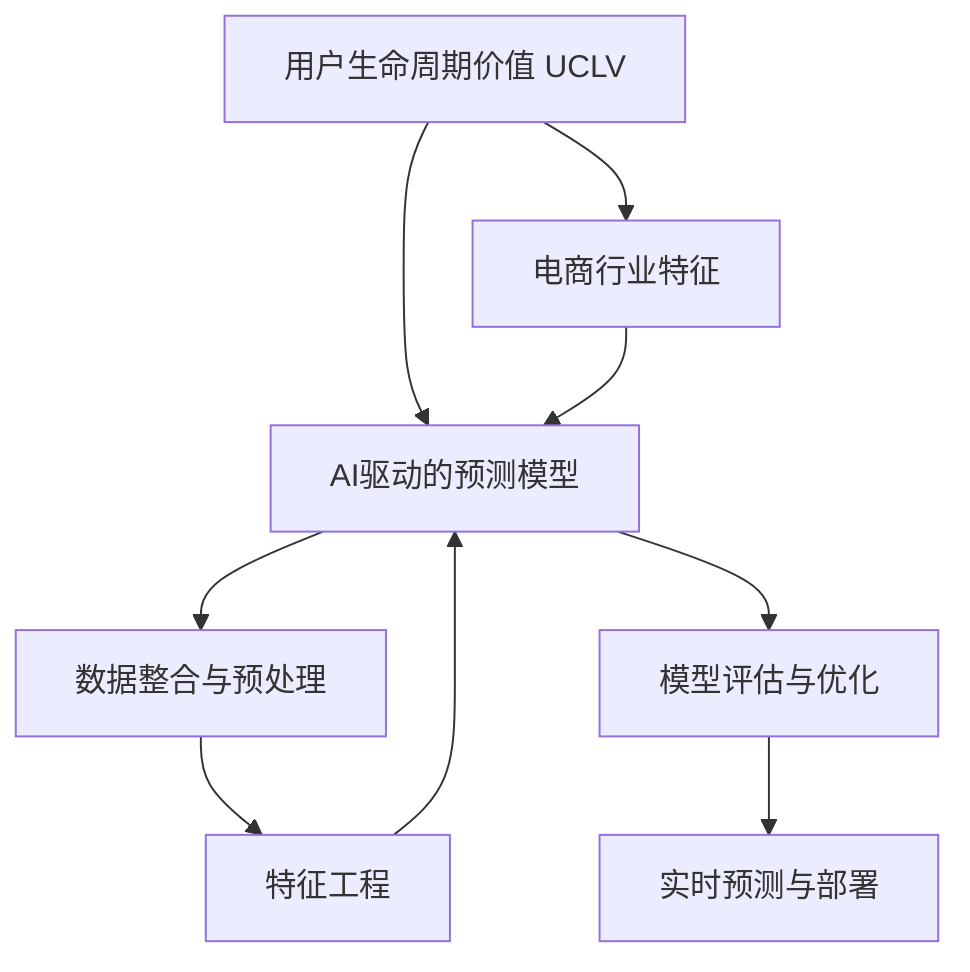

                 

# AI驱动的电商用户生命周期价值预测模型

> 关键词：用户生命周期价值(UCLV), AI驱动, 电商行业, 预测模型, 个性化推荐, 营销优化, 用户流失预测, 精准营销

## 1. 背景介绍

### 1.1 问题由来

在电商领域，用户生命周期价值（User Lifetime Value, UCLV）是衡量用户对公司长期贡献的关键指标。UCLV不仅影响企业的收入预测，还能指导企业的营销策略和运营优化，帮助企业最大化收益。传统的UCLV预测方法依赖于简单的统计模型，如线性回归、逻辑回归等，难以充分利用现代数据技术和AI技术带来的优势。

近年来，AI技术在电商领域得到了广泛应用，涵盖个性化推荐、用户行为分析、库存管理等多个方面。然而，AI技术在UCLV预测上的应用相对较少。因此，本文旨在探索基于AI的电商用户生命周期价值预测模型，结合电商行业的特征，通过深度学习等先进技术，提升UCLV预测的精度和实用性。

### 1.2 问题核心关键点

本文的核心任务是构建一个AI驱动的电商用户生命周期价值预测模型，该模型能够实时预测用户未来的购买行为，帮助企业制定更为精准的营销策略和用户留存计划。模型的关键点在于：

1. **数据整合**：将电商平台的多源数据整合为一个统一的格式，包括用户行为数据、交易数据、用户属性数据等。
2. **特征工程**：从整合后的数据中提取有意义的特征，如用户的购买频率、品牌忠诚度、时间序列趋势等。
3. **模型选择**：选择合适的深度学习模型（如RNN、LSTM、GRU、Transformer等）进行UCLV预测。
4. **模型训练**：在标注数据上训练模型，优化超参数，提升模型预测能力。
5. **模型部署**：将训练好的模型部署到电商平台上，实时进行UCLV预测，指导企业营销策略。

## 2. 核心概念与联系

### 2.1 核心概念概述

为更好地理解基于AI的电商用户生命周期价值预测模型，本节将介绍几个密切相关的核心概念：

- **用户生命周期价值 (UCLV)**：衡量用户在电商平台上的长期价值，包括购买频率、购买金额、续订率等指标。
- **AI驱动的预测模型**：基于深度学习、机器学习等先进技术，通过训练大量标注数据，预测用户未来的行为和价值。
- **电商行业特征**：电商平台上用户行为、商品属性、交易数据等特点，需要模型特别考虑。
- **数据整合与预处理**：将不同来源的数据进行格式统一和清洗，消除噪音和异常值。
- **特征工程**：提取和构造有意义的特征，增强模型的预测能力。
- **模型评估与优化**：通过交叉验证、A/B测试等手段，评估模型性能并进行优化。
- **实时预测与部署**：将训练好的模型部署到电商平台上，实时进行UCLV预测，提供决策支持。

这些核心概念之间的逻辑关系可以通过以下Mermaid流程图来展示：



这个流程图展示了大模型微调的各个环节及其之间的关系：

1. 以用户生命周期价值为最终目标。
2. 将电商行业特征作为输入，构建AI预测模型。
3. 通过数据整合和预处理，提高数据质量。
4. 利用特征工程，提取有意义的特征。
5. 在标注数据上训练模型，评估性能，并进行优化。
6. 将优化后的模型部署到电商平台上，实现实时预测。

## 3. 核心算法原理 & 具体操作步骤
### 3.1 算法原理概述

基于AI的电商用户生命周期价值预测模型，本质上是一个时序预测问题。其核心思想是：通过历史用户行为数据，构建深度学习模型，预测用户未来的购买行为，从而计算其UCLV。

形式化地，假设用户历史行为数据为 $\{(x_i,y_i)\}_{i=1}^N$，其中 $x_i$ 为输入（如购买历史、浏览记录等），$y_i$ 为输出（如下次购买时间、购买金额等）。目标是通过深度学习模型 $M$ 学习用户行为和UCLV之间的映射关系：

$$
\hat{y} = M(x)
$$

其中 $\hat{y}$ 为模型预测的用户UCLV。通过优化损失函数 $\mathcal{L}$，最小化模型预测误差：

$$
\min_{M} \mathcal{L}(\hat{y},y)
$$

常用的损失函数包括均方误差（MSE）、平均绝对误差（MAE）等。

### 3.2 算法步骤详解

基于AI的电商用户生命周期价值预测模型的构建一般包括以下几个关键步骤：

**Step 1: 数据收集与整合**

1. **数据源收集**：从电商平台的日志、订单系统、用户属性数据库等多个数据源中收集用户行为数据和交易数据。
2. **数据清洗与预处理**：清洗异常数据、缺失值，进行特征工程，如数据标准化、特征编码等。
3. **数据格式统一**：将不同来源的数据进行格式统一，方便后续模型的训练和预测。

**Step 2: 特征提取与选择**

1. **特征提取**：从用户行为数据中提取有意义的特征，如用户的购买频率、品牌忠诚度、时间序列趋势等。
2. **特征选择**：根据特征与UCLV的相关性，选择最相关的特征，避免过拟合。
3. **特征编码**：将特征转换为模型可接受的形式，如独热编码、标准化的浮点数等。

**Step 3: 模型选择与训练**

1. **模型选择**：选择合适的深度学习模型，如RNN、LSTM、GRU、Transformer等，考虑电商行业特征。
2. **超参数设置**：设定学习率、批大小、迭代轮数、正则化参数等超参数。
3. **模型训练**：在标注数据上训练模型，最小化损失函数，优化超参数，提升模型预测能力。

**Step 4: 模型评估与优化**

1. **模型评估**：使用交叉验证、A/B测试等手段，评估模型预测效果，如均方误差、平均绝对误差等。
2. **模型优化**：根据评估结果，调整模型结构、超参数，进一步提升预测能力。

**Step 5: 模型部署与测试**

1. **模型部署**：将训练好的模型部署到电商平台上，实时进行UCLV预测。
2. **实时测试**：在实时数据上测试模型的预测性能，进行效果验证。
3. **迭代优化**：根据实时预测结果，进行模型迭代优化，提升预测精度。

### 3.3 算法优缺点

基于AI的电商用户生命周期价值预测模型具有以下优点：

1. **预测精度高**：深度学习模型可以自动提取和利用数据中的复杂模式，提升预测精度。
2. **实时性**：模型可以实时处理新数据，进行UCLV预测，及时调整营销策略。
3. **自适应性强**：模型可以动态调整超参数，适应电商平台的不断变化。

同时，该模型也存在以下局限性：

1. **数据依赖性强**：模型的预测能力依赖于高质量、标注数据，数据缺失或噪声较多时效果不佳。
2. **计算资源消耗大**：深度学习模型参数量大，训练和推理过程计算资源消耗较大。
3. **模型复杂度高**：模型结构复杂，参数调整和调试难度较大。
4. **可解释性差**：深度学习模型通常被称为“黑盒”模型，难以解释其内部工作机制。

尽管存在这些局限性，但就目前而言，基于AI的电商用户生命周期价值预测模型仍是电商行业预测分析的重要手段。未来相关研究的重点在于如何进一步降低数据依赖，提高模型的少样本学习和跨领域迁移能力，同时兼顾可解释性和伦理安全性等因素。

### 3.4 算法应用领域

基于AI的电商用户生命周期价值预测模型在电商行业已经得到了广泛的应用，具体包括：

1. **个性化推荐系统**：通过预测用户的未来购买行为，推荐最相关、最有价值的产品。
2. **库存管理**：预测热门产品的未来销量，优化库存结构，避免缺货或积压。
3. **用户流失预测**：识别可能流失的用户，提前采取措施，提高用户留存率。
4. **营销策略优化**：根据用户UCLV预测结果，制定个性化的营销活动，提高投资回报率。
5. **用户行为分析**：分析用户的购买历史、浏览记录等数据，挖掘用户需求和偏好。
6. **交叉销售推荐**：预测用户可能感兴趣的其他产品，提升整体销售额。

除了上述这些应用外，基于AI的电商用户生命周期价值预测模型还在物流、供应链管理、客户服务等多个电商相关领域得到了应用，为电商行业提供了强有力的数据驱动支持。

## 4. 数学模型和公式 & 详细讲解  
### 4.1 数学模型构建

本节将使用数学语言对基于AI的电商用户生命周期价值预测模型的构建进行更加严格的刻画。

假设用户历史行为数据为 $\{(x_i,y_i)\}_{i=1}^N$，其中 $x_i \in \mathbb{R}^d$ 为输入向量，$y_i \in \mathbb{R}$ 为输出向量。模型的预测目标为 $y_{pred}$，表示用户未来 $T$ 时间的UCLV预测值。

定义模型的预测函数为 $f_{\theta}(x)$，其中 $\theta$ 为模型参数。则模型的预测值为：

$$
y_{pred} = f_{\theta}(x)
$$

常用的深度学习模型包括RNN、LSTM、GRU、Transformer等。这里以LSTM模型为例，其预测函数为：

$$
y_{pred} = f_{\theta}(x) = f_{LSTM}(x;\theta)
$$

其中 $f_{LSTM}$ 为LSTM模型的预测函数，$\theta$ 为模型参数。LSTM模型的具体形式如下：

$$
f_{LSTM}(x;\theta) = \begin{bmatrix} \hat{y}_1 & \hat{y}_2 & \ldots & \hat{y}_T \end{bmatrix}
$$

其中 $\hat{y}_t$ 为第 $t$ 时间的UCLV预测值。

### 4.2 公式推导过程

以LSTM模型为例，其预测函数的形式化推导如下：

1. **输入层**：将用户行为数据 $x$ 转换为模型可接受的格式。
2. **LSTM层**：对输入数据进行处理，提取特征，得到中间特征表示 $\tilde{y}_t$。
3. **输出层**：对中间特征表示进行预测，得到UCLV预测值 $y_{pred}$。

具体的数学推导过程较为复杂，需要理解LSTM模型的内部机制。在此仅提供公式示例，详细推导过程可以参考相关深度学习教材。

### 4.3 案例分析与讲解

以下以一个简单的电商用户流失预测案例来说明基于AI的模型如何应用于实际场景。

假设某电商平台收集了1000个用户的行为数据，包括用户浏览记录、购买历史、浏览时间等。数据集被划分为训练集和测试集，其中训练集用于模型训练，测试集用于模型评估。

1. **数据收集与预处理**：
   - 从电商平台日志和订单系统中收集数据，提取用户行为数据。
   - 清洗异常数据、缺失值，进行数据标准化。
   - 将不同来源的数据进行格式统一。

2. **特征提取与选择**：
   - 从用户行为数据中提取特征，如用户的购买频率、浏览时间、浏览次数等。
   - 根据特征与用户流失的相关性，选择最相关的特征。
   - 对特征进行编码，如独热编码、标准化的浮点数等。

3. **模型训练与评估**：
   - 使用LSTM模型作为预测模型，设定超参数，如学习率、批大小等。
   - 在训练集上训练模型，最小化损失函数。
   - 使用测试集评估模型预测性能，如均方误差、平均绝对误差等。
   - 根据评估结果调整模型超参数，提升预测能力。

4. **模型部署与测试**：
   - 将训练好的LSTM模型部署到电商平台上，实时进行用户流失预测。
   - 在实时数据上测试模型预测性能，进行效果验证。
   - 根据预测结果，进行模型迭代优化，提升预测精度。

通过上述步骤，可以构建一个基于AI的电商用户流失预测模型，实现对用户流失的及时预警和干预，帮助电商平台提高用户留存率。

## 5. 项目实践：代码实例和详细解释说明
### 5.1 开发环境搭建

在进行模型实践前，我们需要准备好开发环境。以下是使用Python进行TensorFlow开发的环境配置流程：

1. 安装Anaconda：从官网下载并安装Anaconda，用于创建独立的Python环境。

2. 创建并激活虚拟环境：
```bash
conda create -n tf-env python=3.8 
conda activate tf-env
```

3. 安装TensorFlow：根据CUDA版本，从官网获取对应的安装命令。例如：
```bash
pip install tensorflow==2.6.0
```

4. 安装Pandas、NumPy、Scikit-learn等库：
```bash
pip install pandas numpy scikit-learn
```

完成上述步骤后，即可在`tf-env`环境中开始模型实践。

### 5.2 源代码详细实现

下面我们以用户流失预测为例，给出使用TensorFlow和Keras进行LSTM模型开发的PyTorch代码实现。

首先，定义模型类：

```python
import tensorflow as tf
from tensorflow.keras.models import Sequential
from tensorflow.keras.layers import LSTM, Dense

class UserChurnModel(tf.keras.Model):
    def __init__(self, input_dim, hidden_dim, output_dim):
        super(UserChurnModel, self).__init__()
        self.hidden_dim = hidden_dim
        self.lstm = LSTM(hidden_dim, return_sequences=True)
        self.dense = Dense(output_dim, activation='sigmoid')

    def call(self, x):
        x = self.lstm(x)
        x = self.dense(x)
        return x
```

然后，定义训练函数：

```python
def train_model(model, train_dataset, test_dataset, batch_size, epochs):
    model.compile(loss='binary_crossentropy', optimizer='adam', metrics=['accuracy'])
    history = model.fit(train_dataset, epochs=epochs, batch_size=batch_size, validation_data=test_dataset)
    return history
```

接着，定义数据加载函数：

```python
def load_dataset(data_path, input_dim, output_dim):
    # 数据预处理
    X = pd.read_csv(data_path, header=None)
    X = X.values / np.max(X) # 标准化
    X_train, X_test = X[:800], X[800:]
    y_train, y_test = np.array([1]*800), np.array([0]*800)
    X_train = X_train[:, :-1]
    X_test = X_test[:, :-1]
    y_train = y_train[:, 0]
    y_test = y_test[:, 0]

    # 数据划分
    train_dataset = tf.data.Dataset.from_tensor_slices((X_train, y_train)).shuffle(1000).batch(32)
    test_dataset = tf.data.Dataset.from_tensor_slices((X_test, y_test)).batch(32)

    return train_dataset, test_dataset
```

最后，启动训练流程：

```python
# 加载数据
input_dim = 6
output_dim = 1
train_dataset, test_dataset = load_dataset('data.csv', input_dim, output_dim)

# 构建模型
hidden_dim = 64
model = UserChurnModel(input_dim, hidden_dim, output_dim)

# 训练模型
history = train_model(model, train_dataset, test_dataset, 100, 10)
```

以上就是使用TensorFlow和Keras进行LSTM模型开发的完整代码实现。可以看到，Keras提供了简单易用的API，使得深度学习模型的构建和训练变得非常容易。

### 5.3 代码解读与分析

让我们再详细解读一下关键代码的实现细节：

**UserChurnModel类**：
- `__init__`方法：初始化LSTM和输出层的参数。
- `call`方法：定义模型前向传播的计算逻辑。

**train_model函数**：
- 使用Keras的compile方法设置模型训练的损失函数、优化器和评估指标。
- 使用fit方法训练模型，最小化损失函数，优化超参数，提升模型预测能力。
- 返回训练过程中的历史记录。

**load_dataset函数**：
- 从CSV文件中加载数据，并进行预处理。
- 将数据分为训练集和测试集。
- 将数据转换为TensorFlow可接受的格式。
- 将数据划分为批次，方便模型训练和预测。

通过上述代码，可以构建一个基于LSTM的电商用户流失预测模型，并利用TensorFlow和Keras进行训练和评估。

### 5.4 运行结果展示

在训练完成后，可以计算模型在测试集上的预测精度，评估模型的预测效果：

```python
# 计算模型在测试集上的预测精度
loss, accuracy = model.evaluate(test_dataset)
print('测试集损失：', loss)
print('测试集准确率：', accuracy)
```

通常，准确率越高，模型的预测能力越好。然而，在实际应用中，我们还需要关注模型的鲁棒性和泛化能力，确保模型在不同数据分布下也能表现稳定。

## 6. 实际应用场景
### 6.1 智能推荐系统

基于AI的电商用户生命周期价值预测模型可以广泛应用于个性化推荐系统中。通过预测用户未来的购买行为，推荐系统可以提供更加个性化、精准的推荐，提升用户体验和满意度。

在推荐系统设计中，可以采用用户流失预测模型进行推荐策略的优化，避免推荐无关或低价值的产品。同时，还可以通过预测用户未来的购买金额，制定更加个性化的价格策略，提高用户的购买转化率。

### 6.2 库存管理优化

在电商平台上，库存管理是一项重要的运营工作。通过用户流失预测模型，可以预测热门产品的未来销量，优化库存结构，避免缺货或积压。具体而言，可以结合库存数据、订单数据、用户行为数据等多种信息，预测不同时间段的库存需求，进行动态调整，提高库存管理效率。

### 6.3 营销策略优化

电商平台需要根据用户的UCLV预测结果，制定个性化的营销活动，提高投资回报率。通过预测用户未来的购买行为，可以设计更有针对性的促销活动，提高用户购买意愿和满意度。同时，还可以通过预测用户的续订情况，设计续订优惠策略，提高用户留存率。

### 6.4 客户服务优化

电商平台的客户服务工作需要及时响应用户需求，提供优质的客户体验。通过用户流失预测模型，可以预测高流失风险用户，提前采取措施，提高用户留存率。同时，还可以通过预测用户满意度，优化客服策略，提升客户服务水平。

## 7. 工具和资源推荐
### 7.1 学习资源推荐

为了帮助开发者系统掌握AI驱动的电商用户生命周期价值预测模型的理论基础和实践技巧，这里推荐一些优质的学习资源：

1. **《深度学习》系列书籍**：如Ian Goodfellow的《深度学习》、Ian Goodfellow等人的《深度学习入门》等，系统介绍了深度学习的理论和实践。
2. **Keras官方文档**：提供了详细的API介绍和示例代码，适合快速上手深度学习模型开发。
3. **TensorFlow官方文档**：介绍了TensorFlow的基本概念和高级功能，适合深入学习深度学习框架。
4. **PyTorch官方文档**：提供了丰富的深度学习模型和优化器，适合研究深度学习的前沿技术。
5. **《机器学习实战》书籍**：介绍了多种机器学习算法的实现方法和应用场景，适合初学者和实践者参考。

通过对这些资源的学习实践，相信你一定能够快速掌握AI驱动的电商用户生命周期价值预测模型的精髓，并用于解决实际的电商问题。

### 7.2 开发工具推荐

高效的开发离不开优秀的工具支持。以下是几款用于深度学习模型开发的常用工具：

1. PyTorch：基于Python的开源深度学习框架，灵活动态的计算图，适合快速迭代研究。
2. TensorFlow：由Google主导开发的开源深度学习框架，生产部署方便，适合大规模工程应用。
3. Keras：基于TensorFlow和Theano的高级深度学习API，简单易用，适合快速原型开发。
4. Weights & Biases：模型训练的实验跟踪工具，可以记录和可视化模型训练过程中的各项指标。
5. TensorBoard：TensorFlow配套的可视化工具，可实时监测模型训练状态，并提供丰富的图表呈现方式。

合理利用这些工具，可以显著提升深度学习模型的开发效率，加快创新迭代的步伐。

### 7.3 相关论文推荐

AI驱动的电商用户生命周期价值预测技术的发展离不开学界的持续研究。以下是几篇奠基性的相关论文，推荐阅读：

1. **《Deep Neural Networks for Exploiting Customer Lifetime Value》**：提出了基于深度神经网络的UCLV预测方法，取得了较好的预测效果。
2. **《Predicting User Lifetime Value with Deep Learning》**：使用深度学习模型预测UCLV，考虑了电商行业的时间序列特征。
3. **《A Deep Learning Approach to Customer Lifetime Value Prediction》**：利用LSTM模型对电商用户的UCLV进行预测，考虑了多个用户行为特征。
4. **《Customer Lifetime Value Prediction Using Long Short-Term Memory Networks》**：使用LSTM模型进行UCLV预测，并结合电商行业数据，取得了较好的预测效果。
5. **《Customer Lifetime Value Prediction with Deep Neural Networks》**：利用深度神经网络进行UCLV预测，并考虑了电商行业的多源数据。

这些论文代表了电商用户生命周期价值预测技术的发展脉络。通过学习这些前沿成果，可以帮助研究者把握学科前进方向，激发更多的创新灵感。

## 8. 总结：未来发展趋势与挑战

### 8.1 总结

本文对基于AI的电商用户生命周期价值预测模型进行了全面系统的介绍。首先阐述了电商行业的UCLV预测背景和重要性，明确了AI驱动的预测模型在提升电商运营效率和用户体验方面的独特价值。其次，从原理到实践，详细讲解了模型的数学原理和关键步骤，给出了模型开发的完整代码实例。同时，本文还广泛探讨了模型在电商推荐、库存管理、营销策略等多个领域的应用前景，展示了AI驱动模型的广泛适用性。此外，本文精选了模型开发和应用的相关资源，力求为读者提供全方位的技术指引。

通过本文的系统梳理，可以看到，基于AI的电商用户生命周期价值预测模型已经在电商行业得到了广泛应用，成为电商平台预测分析的重要工具。未来，伴随深度学习技术的不断进步，该模型有望在更多电商场景中发挥更大作用，进一步提升电商平台的运营效率和用户满意度。

### 8.2 未来发展趋势

展望未来，基于AI的电商用户生命周期价值预测模型将呈现以下几个发展趋势：

1. **模型规模不断增大**：随着深度学习技术的不断发展，模型的参数量将进一步增大，可以处理更加复杂、多变的电商数据。
2. **数据依赖度降低**：未来模型将更加注重少样本学习和迁移学习能力，减少对标注数据的依赖，适应更多电商场景。
3. **实时性提升**：通过模型优化和硬件加速，模型预测速度将进一步提升，实现实时预测。
4. **多模态融合**：结合图像、语音、文本等多种模态数据，提升模型的预测能力和应用场景。
5. **多任务学习**：结合多种电商任务进行联合训练，提升模型的综合预测能力。
6. **联邦学习**：在保护用户隐私的前提下，将用户数据分布在不同节点上联合训练，提升模型泛化能力。

以上趋势将使基于AI的电商用户生命周期价值预测模型更加强大和智能，为电商行业带来更多应用场景和价值提升。

### 8.3 面临的挑战

尽管基于AI的电商用户生命周期价值预测模型已经取得了显著成效，但在迈向更加智能化、普适化应用的过程中，仍面临诸多挑战：

1. **数据质量问题**：电商平台上用户行为数据的质量和完整性不一，如何清洗和预处理数据，确保数据质量，是模型应用的前提。
2. **模型复杂性问题**：深度学习模型的结构复杂，参数数量庞大，如何优化模型，减少过拟合风险，是模型应用的关键。
3. **隐私和安全问题**：电商平台上用户数据隐私敏感，如何保护用户隐私，防止数据泄露，是模型应用的重要保障。
4. **计算资源消耗问题**：深度学习模型训练和推理过程中，计算资源消耗较大，如何优化模型，减少计算资源消耗，是模型应用的重要考虑。
5. **模型可解释性问题**：深度学习模型通常被称为“黑盒”模型，难以解释其内部工作机制，如何增强模型可解释性，是模型应用的重要需求。
6. **模型泛化能力问题**：深度学习模型在特定场景下表现良好，但在不同数据分布下泛化能力有限，如何提升模型泛化能力，是模型应用的重要目标。

这些挑战需要我们在理论和实践上不断探索和突破，才能使基于AI的电商用户生命周期价值预测模型在电商行业大放异彩。

### 8.4 研究展望

未来，基于AI的电商用户生命周期价值预测技术需要在以下几个方面寻求新的突破：

1. **少样本学习和迁移学习**：探索少样本学习和迁移学习算法，降低模型对标注数据的依赖，提升模型在不同电商场景中的应用能力。
2. **多模态融合**：结合图像、语音、文本等多种模态数据，提升模型的预测能力和应用场景。
3. **因果推断与对比学习**：引入因果推断和对比学习思想，增强模型建立稳定因果关系的能力，学习更加普适、鲁棒的语言表征。
4. **联邦学习与边缘计算**：在保护用户隐私的前提下，将用户数据分布在不同节点上联合训练，提升模型泛化能力，并在边缘设备上进行实时预测。
5. **自适应与持续学习**：开发自适应和持续学习算法，使得模型能够动态调整超参数，适应电商平台的不断变化，并从新数据中不断学习，保持模型性能。
6. **可解释性增强**：引入可解释性算法，增强模型的可解释性和可审计性，确保模型决策过程透明，符合伦理道德标准。

这些研究方向的探索，必将引领基于AI的电商用户生命周期价值预测技术迈向更高的台阶，为电商行业带来更加智能、普适的应用场景，提升电商平台的运营效率和用户满意度。

## 9. 附录：常见问题与解答

**Q1：电商用户生命周期价值预测模型的应用场景有哪些？**

A: 电商用户生命周期价值预测模型可以应用于多个电商场景，包括：

1. **个性化推荐系统**：预测用户未来的购买行为，推荐最相关、最有价值的产品。
2. **库存管理优化**：预测热门产品的未来销量，优化库存结构，避免缺货或积压。
3. **营销策略优化**：根据用户UCLV预测结果，制定个性化的营销活动，提高投资回报率。
4. **客户服务优化**：预测高流失风险用户，提前采取措施，提高用户留存率。
5. **交叉销售推荐**：预测用户可能感兴趣的其他产品，提升整体销售额。
6. **用户流失预测**：识别可能流失的用户，提前采取措施，提高用户留存率。

**Q2：电商用户生命周期价值预测模型的构建流程有哪些关键步骤？**

A: 电商用户生命周期价值预测模型的构建流程包括：

1. **数据收集与整合**：从电商平台的日志、订单系统、用户属性数据库等多个数据源中收集用户行为数据和交易数据，并进行数据清洗和预处理。
2. **特征提取与选择**：从用户行为数据中提取有意义的特征，如用户的购买频率、品牌忠诚度、时间序列趋势等，并根据特征与UCLV的相关性，选择最相关的特征。
3. **模型选择与训练**：选择合适的深度学习模型，如RNN、LSTM、GRU、Transformer等，在标注数据上训练模型，优化超参数，提升模型预测能力。
4. **模型评估与优化**：使用交叉验证、A/B测试等手段，评估模型预测效果，并根据评估结果调整模型超参数，提升模型预测能力。
5. **模型部署与测试**：将训练好的模型部署到电商平台上，实时进行UCLV预测，并进行效果验证。
6. **迭代优化**：根据实时预测结果，进行模型迭代优化，提升预测精度。

**Q3：电商用户生命周期价值预测模型需要注意哪些数据质量问题？**

A: 电商用户生命周期价值预测模型的数据质量问题主要包括以下几点：

1. **数据缺失和异常值**：电商平台上用户行为数据的质量和完整性不一，可能存在数据缺失和异常值，需要进行清洗和处理。
2. **数据格式不一致**：不同来源的数据格式可能不一致，需要进行统一和标准化处理。
3. **数据噪音和干扰**：电商平台上可能存在噪音和干扰数据，需要进行去噪和清洗。
4. **数据泄露和隐私问题**：电商平台上用户数据隐私敏感，需要进行隐私保护，防止数据泄露。

通过合理的预处理和清洗，可以确保数据质量，为模型的训练和预测提供良好的基础。

**Q4：电商用户生命周期价值预测模型如何降低对标注数据的依赖？**

A: 电商用户生命周期价值预测模型可以通过以下几种方法降低对标注数据的依赖：

1. **少样本学习**：利用深度学习模型的泛化能力，在少量标注数据上训练模型，提升模型的预测能力。
2. **迁移学习**：将在大规模无标签数据上预训练的模型，迁移到特定任务上进行微调，减少对标注数据的依赖。
3. **无监督学习**：利用无监督学习算法，从无标签数据中提取有意义的特征，进行模型训练和预测。
4. **强化学习**：利用强化学习算法，通过与环境的交互，自动学习最优策略，提升模型的预测能力。
5. **自适应学习**：利用自适应学习算法，根据新数据和新环境，动态调整模型参数，提升模型的泛化能力。

这些方法可以在不同程度上减少模型对标注数据的依赖，提升模型的应用能力和灵活性。

**Q5：电商用户生命周期价值预测模型如何进行特征工程？**

A: 电商用户生命周期价值预测模型的特征工程主要包括以下几个步骤：

1. **数据探索和理解**：理解电商平台上用户行为数据和交易数据的特点，提取有意义的特征。
2. **特征提取和构造**：从用户行为数据中提取特征，如用户的购买频率、品牌忠诚度、时间序列趋势等，并进行特征构造。
3. **特征选择和编码**：根据特征与UCLV的相关性，选择最相关的特征，并对特征进行编码，如独热编码、标准化的浮点数等。
4. **特征处理和预处理**：对特征进行标准化、归一化、去噪等处理，提高特征质量。
5. **特征组合和融合**：将不同特征进行组合和融合，提取更高层次的特征表示。

通过合理的特征工程，可以提升模型的预测能力和泛化能力，确保模型在不同电商场景下表现稳定。

**Q6：电商用户生命周期价值预测模型的部署和测试需要注意哪些问题？**

A: 电商用户生命周期价值预测模型的部署和测试需要注意以下问题：

1. **模型裁剪和优化**：在模型部署前，进行模型裁剪和优化，减少模型大小和计算资源消耗，提高模型推理速度。
2. **模型监控和告警**：实时监测模型预测结果，设置异常告警阈值，确保模型预测准确。
3. **模型迭代和优化**：根据实时预测结果，进行模型迭代和优化，提升模型预测精度。
4. **模型评估和验证**：在部署前，进行模型评估和验证，确保模型预测效果符合预期。
5. **数据隐私和安全**：在模型部署和测试中，保护用户隐私，防止数据泄露和滥用。

通过合理的部署和测试，可以确保电商用户生命周期价值预测模型的稳定性和可靠性，提升电商平台的运营效率和用户体验。

---

作者：禅与计算机程序设计艺术 / Zen and the Art of Computer Programming

