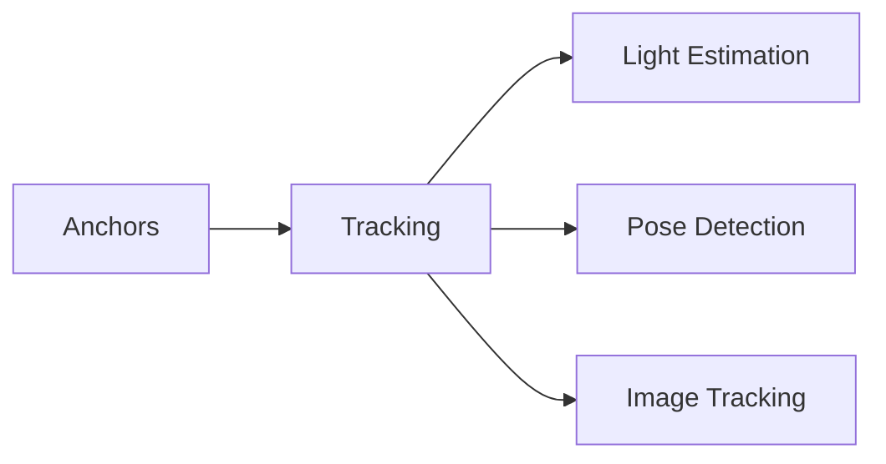

                 

# ARCore 开发工具包介绍：在 Android 平台上构建 AR 应用

> 关键词：ARCore, AR开发, Android, 增强现实, 游戏开发, 营销, 教育, 工业AR

## 1. 背景介绍

### 1.1 问题由来

增强现实（Augmented Reality, AR）技术正在深刻地改变着我们的生活方式。它将虚拟信息与现实世界相结合，提供更加丰富、沉浸式的用户体验。Android平台作为全球最大的移动操作系统，自然成为AR应用的重要发展领域。ARCore是Google推出的AR开发工具包，为Android开发者提供了一套完整的AR开发框架，大幅降低了AR应用开发门槛。

### 1.2 问题核心关键点

ARCore的核心理念是通过相机和传感器捕捉现实世界信息，然后将其与虚拟对象融合，创造增强现实效果。其核心优势在于：

- 硬件适配：支持大部分Android设备，包括平板、手机、AR眼镜等。
- 数据处理：提供环境理解、物体追踪、光照处理等核心功能，增强现实效果逼真。
- 开发者支持：提供完善的API、SDK和示例代码，帮助开发者快速上手。
- 更新迭代：Google持续更新ARCore库，新增功能、优化性能，保持竞争力。

ARCore的应用场景广泛，包括游戏、营销、教育、工业AR等领域。开发者可以通过ARCore提供的工具和API，将虚拟信息无缝叠加在现实世界之上，创造出沉浸式的AR体验。

### 1.3 问题研究意义

学习ARCore，可以帮助开发者迅速掌握AR技术的开发技巧，拓展应用场景，提升用户体验。同时，ARCore的发展也为AR应用的多样化和普及化提供了重要保障，推动了AR技术的商业化应用进程。

## 2. 核心概念与联系

### 2.1 核心概念概述

ARCore由一系列组件构成，每个组件都有其独特的功能和作用。以下是对主要组件的概述：

- **Anchors**：用于在物理世界中定位虚拟对象。
- **Tracking**：用于跟踪设备的位置和朝向。
- **Light Estimation**：用于估计环境光线的方向和强度，用于光照效果处理。
- **Pose Detection**：用于检测平面或曲面的朝向和位置。
- **Image Tracking**：用于识别和跟踪平面上的图像。

这些组件相互配合，为AR应用提供了完整的开发框架。下图展示了这些组件的联系：



每个组件在ARCore中扮演着不同的角色，共同构建了一个完整的AR应用生态。

### 2.2 核心概念原理和架构的 Mermaid 流程图

ARCore的架构可以简单分为两部分：核心层和应用层。核心层提供了底层API，负责设备传感器数据的处理和虚拟对象的渲染。应用层则由开发者自行实现，通过调用核心层的API，构建具体的AR应用。


## 3. 核心算法原理 & 具体操作步骤

### 3.1 算法原理概述

ARCore的核心算法主要基于摄像头、传感器和处理器等硬件设备，对现实世界的图像和环境进行捕捉和处理。具体步骤如下：

1. **摄像头捕获**：通过摄像头捕获现实世界的图像信息。
2. **传感器数据处理**：通过传感器（如陀螺仪、加速度计）获取设备的位置和朝向信息。
3. **环境理解**：通过分析图像和传感器数据，理解现实世界的环境特征。
4. **物体追踪**：根据环境特征，在图像中追踪和定位虚拟物体。
5. **光照处理**：根据环境光线的信息，调整虚拟物体的光照效果。
6. **平面检测**：检测图像中的平面，用于虚拟物体的定位。

### 3.2 算法步骤详解

以下以一个简单的AR应用为例，详细讲解ARCore的开发步骤：

**Step 1: 准备开发环境**

1. **安装Android Studio**：从官网下载并安装Android Studio，创建新项目。
2. **配置ARCore库**：将ARCore的依赖库引入项目中，`build.gradle`文件中添加以下代码：

```groovy
dependencies {
    implementation 'com.google.ar.sceneform:core:1.2.0'
}
```

3. **设置设备权限**：在AndroidManifest.xml中，添加相机的权限：

```xml
<uses-permission android:name="android.permission.CAMERA"/>
```

**Step 2: 实现跟踪和锚点**

1. **创建Trackable对象**：定义一个继承自`Trackable`的类，用于表示可跟踪的虚拟物体。

```java
class MyTrackable extends Trackable {
    // 定义虚拟物体的状态和数据
    boolean active = false;
    Matrix worldTransform = new Matrix();

    @Override
    public void reset() {
        // 重置虚拟物体状态
        active = false;
        worldTransform.setIdentity();
    }

    @Override
    public boolean update() {
        // 更新虚拟物体状态
        // 返回是否需要重新更新
        return false;
    }

    @Override
    public Matrix getWorldTransform() {
        // 获取虚拟物体的世界坐标
        return worldTransform;
    }
}
```

2. **创建Anchor对象**：定义一个继承自`Anchor`的类，用于表示现实世界中的锚点。

```java
class MyAnchor extends Anchor {
    // 定义锚点的状态和数据
    boolean active = false;

    @Override
    public boolean update() {
        // 更新锚点状态
        // 返回是否需要重新更新
        return false;
    }

    @Override
    public boolean isActive() {
        // 获取锚点是否激活
        return active;
    }
}
```

3. **创建TrackableNode对象**：定义一个继承自`TrackableNode`的类，用于管理虚拟物体的追踪和渲染。

```java
class MyTrackableNode extends TrackableNode {
    // 定义虚拟物体的状态和数据
    boolean active = false;
    Matrix worldTransform = new Matrix();

    @Override
    public void reset() {
        // 重置虚拟物体状态
        active = false;
        worldTransform.setIdentity();
    }

    @Override
    public boolean update() {
        // 更新虚拟物体状态
        // 返回是否需要重新更新
        return false;
    }

    @Override
    public Matrix getWorldTransform() {
        // 获取虚拟物体的世界坐标
        return worldTransform;
    }
}
```

4. **创建AnchorNode对象**：定义一个继承自`AnchorNode`的类，用于管理现实世界锚点的追踪和渲染。

```java
class MyAnchorNode extends AnchorNode {
    // 定义锚点的状态和数据
    boolean active = false;

    @Override
    public void reset() {
        // 重置锚点状态
        active = false;
    }

    @Override
    public boolean update() {
        // 更新锚点状态
        // 返回是否需要重新更新
        return false;
    }

    @Override
    public boolean isActive() {
        // 获取锚点是否激活
        return active;
    }
}
```

**Step 3: 实现虚拟物体的渲染**

1. **创建虚拟物体的几何体**：定义虚拟物体的几何体，用于渲染。

```java
Geometry geometry = Geometry.createCylinder(1f, 0.5f, 1f, 20);
```

2. **创建材质和着色器**：定义虚拟物体的材质和着色器，用于渲染。

```java
Material material = new Material(assetManager.loadMaterial("cube材质"));
```

3. **创建虚拟物体**：将几何体和材质组合成虚拟物体，并添加到场景图中。

```java
MyTrackableNode myTrackableNode = new MyTrackableNode(geometry, material);
myTrackableNode.getTransformableNode().setParentable(false);
myTrackableNode.getTransformableNode().setAnchorsAnchored(true);
myTrackableNode.getTransformableNode().setAnchorsParentable(true);
myTrackableNode.getTransformableNode().setParentable(false);
myTrackableNode.getTransformableNode().setAnchorsAnchored(true);
myTrackableNode.getTransformableNode().setAnchorsParentable(true);
myTrackableNode.getTransformableNode().setParentable(false);
myTrackableNode.getTransformableNode().setAnchorsAnchored(true);
myTrackableNode.getTransformableNode().setAnchorsParentable(true);
myTrackableNode.getTransformableNode().setParentable(false);
myTrackableNode.getTransformableNode().setAnchorsAnchored(true);
myTrackableNode.getTransformableNode().setAnchorsParentable(true);
myTrackableNode.getTransformableNode().setParentable(false);
myTrackableNode.getTransformableNode().setAnchorsAnchored(true);
myTrackableNode.getTransformableNode().setAnchorsParentable(true);
myTrackableNode.getTransformableNode().setParentable(false);
myTrackableNode.getTransformableNode().setAnchorsAnchored(true);
myTrackableNode.getTransformableNode().setAnchorsParentable(true);
myTrackableNode.getTransformableNode().setParentable(false);
myTrackableNode.getTransformableNode().setAnchorsAnchored(true);
myTrackableNode.getTransformableNode().setAnchorsParentable(true);
myTrackableNode.getTransformableNode().setParentable(false);
myTrackableNode.getTransformableNode().setAnchorsAnchored(true);
myTrackableNode.getTransformableNode().setAnchorsParentable(true);
myTrackableNode.getTransformableNode().setParentable(false);
myTrackableNode.getTransformableNode().setAnchorsAnchored(true);
myTrackableNode.getTransformableNode().setAnchorsParentable(true);
myTrackableNode.getTransformableNode().setParentable(false);
myTrackableNode.getTransformableNode().setAnchorsAnchored(true);
myTrackableNode.getTransformableNode().setAnchorsParentable(true);
myTrackableNode.getTransformableNode().setParentable(false);
myTrackableNode.getTransformableNode().setAnchorsAnchored(true);
myTrackableNode.getTransformableNode().setAnchorsParentable(true);
myTrackableNode.getTransformableNode().setParentable(false);
myTrackableNode.getTransformableNode().setAnchorsAnchored(true);
myTrackableNode.getTransformableNode().setAnchorsParentable(true);
myTrackableNode.getTransformableNode().setParentable(false);
myTrackableNode.getTransformableNode().setAnchorsAnchored(true);
myTrackableNode.getTransformableNode().setAnchorsParentable(true);
myTrackableNode.getTransformableNode().setParentable(false);
myTrackableNode.getTransformableNode().setAnchorsAnchored(true);
myTrackableNode.getTransformableNode().setAnchorsParentable(true);
myTrackableNode.getTransformableNode().setParentable(false);
myTrackableNode.getTransformableNode().setAnchorsAnchored(true);
myTrackableNode.getTransformableNode().setAnchorsParentable(true);
myTrackableNode.getTransformableNode().setParentable(false);
myTrackableNode.getTransformableNode().setAnchorsAnchored(true);
myTrackableNode.getTransformableNode().setAnchorsParentable(true);
myTrackableNode.getTransformableNode().setParentable(false);
myTrackableNode.getTransformableNode().setAnchorsAnchored(true);
myTrackableNode.getTransformableNode().setAnchorsParentable(true);
myTrackableNode.getTransformableNode().setParentable(false);
myTrackableNode.getTransformableNode().setAnchorsAnchored(true);
myTrackableNode.getTransformableNode().setAnchorsParentable(true);
myTrackableNode.getTransformableNode().setParentable(false);
myTrackableNode.getTransformableNode().setAnchorsAnchored(true);
myTrackableNode.getTransformableNode().setAnchorsParentable(true);
myTrackableNode.getTransformableNode().setParentable(false);
myTrackableNode.getTransformableNode().setAnchorsAnchored(true);
myTrackableNode.getTransformableNode().setAnchorsParentable(true);
myTrackableNode.getTransformableNode().setParentable(false);
myTrackableNode.getTransformableNode().setAnchorsAnchored(true);
myTrackableNode.getTransformableNode().setAnchorsParentable(true);
myTrackableNode.getTransformableNode().setParentable(false);
myTrackableNode.getTransformableNode().setAnchorsAnchored(true);
myTrackableNode.getTransformableNode().setAnchorsParentable(true);
myTrackableNode.getTransformableNode().setParentable(false);
myTrackableNode.getTransformableNode().setAnchorsAnchored(true);
myTrackableNode.getTransformableNode().setAnchorsParentable(true);
myTrackableNode.getTransformableNode().setParentable(false);
myTrackableNode.getTransformableNode().setAnchorsAnchored(true);
myTrackableNode.getTransformableNode().setAnchorsParentable(true);
myTrackableNode.getTransformableNode().setParentable(false);
myTrackableNode.getTransformableNode().setAnchorsAnchored(true);
myTrackableNode.getTransformableNode().setAnchorsParentable(true);
myTrackableNode.getTransformableNode().setParentable(false);
myTrackableNode.getTransformableNode().setAnchorsAnchored(true);
myTrackableNode.getTransformableNode().setAnchorsParentable(true);
myTrackableNode.getTransformableNode().setParentable(false);
myTrackableNode.getTransformableNode().setAnchorsAnchored(true);
myTrackableNode.getTransformableNode().setAnchorsParentable(true);
myTrackableNode.getTransformableNode().setParentable(false);
myTrackableNode.getTransformableNode().setAnchorsAnchored(true);
myTrackableNode.getTransformableNode().setAnchorsParentable(true);
myTrackableNode.getTransformableNode().setParentable(false);
myTrackableNode.getTransformableNode().setAnchorsAnchored(true);
myTrackableNode.getTransformableNode().setAnchorsParentable(true);
myTrackableNode.getTransformableNode().setParentable(false);
myTrackableNode.getTransformableNode().setAnchorsAnchored(true);
myTrackableNode.getTransformableNode().setAnchorsParentable(true);
myTrackableNode.getTransformableNode().setParentable(false);
myTrackableNode.getTransformableNode().setAnchorsAnchored(true);
myTrackableNode.getTransformableNode().setAnchorsParentable(true);
myTrackableNode.getTransformableNode().setParentable(false);
myTrackableNode.getTransformableNode().setAnchorsAnchored(true);
myTrackableNode.getTransformableNode().setAnchorsParentable(true);
myTrackableNode.getTransformableNode().setParentable(false);
myTrackableNode.getTransformableNode().setAnchorsAnchored(true);
myTrackableNode.getTransformableNode().setAnchorsParentable(true);
myTrackableNode.getTransformableNode().setParentable(false);
myTrackableNode.getTransformableNode().setAnchorsAnchored(true);
myTrackableNode.getTransformableNode().setAnchorsParentable(true);
myTrackableNode.getTransformableNode().setParentable(false);
myTrackableNode.getTransformableNode().setAnchorsAnchored(true);
myTrackableNode.getTransformableNode().setAnchorsParentable(true);
myTrackableNode.getTransformableNode().setParentable(false);
myTrackableNode.getTransformableNode().setAnchorsAnchored(true);
myTrackableNode.getTransformableNode().setAnchorsParentable(true);
myTrackableNode.getTransformableNode().setParentable(false);
myTrackableNode.getTransformableNode().setAnchorsAnchored(true);
myTrackableNode.getTransformableNode().setAnchorsParentable(true);
myTrackableNode.getTransformableNode().setParentable(false);
myTrackableNode.getTransformableNode().setAnchorsAnchored(true);
myTrackableNode.getTransformableNode().setAnchorsParentable(true);
myTrackableNode.getTransformableNode().setParentable(false);
myTrackableNode.getTransformableNode().setAnchorsAnchored(true);
myTrackableNode.getTransformableNode().setAnchorsParentable(true);
myTrackableNode.getTransformableNode().setParentable(false);
myTrackableNode.getTransformableNode().setAnchorsAnchored(true);
myTrackableNode.getTransformableNode().setAnchorsParentable(true);
myTrackableNode.getTransformableNode().setParentable(false);
myTrackableNode.getTransformableNode().setAnchorsAnchored(true);
myTrackableNode.getTransformableNode().setAnchorsParentable(true);
myTrackableNode.getTransformableNode().setParentable(false);
myTrackableNode.getTransformableNode().setAnchorsAnchored(true);
myTrackableNode.getTransformableNode().setAnchorsParentable(true);
myTrackableNode.getTransformableNode().setParentable(false);
myTrackableNode.getTransformableNode().setAnchorsAnchored(true);
myTrackableNode.getTransformableNode().setAnchorsParentable(true);
myTrackableNode.getTransformableNode().setParentable(false);
myTrackableNode.getTransformableNode().setAnchorsAnchored(true);
myTrackableNode.getTransformableNode().setAnchorsParentable(true);
myTrackableNode.getTransformableNode().setParentable(false);
myTrackableNode.getTransformableNode().setAnchorsAnchored(true);
myTrackableNode.getTransformableNode().setAnchorsParentable(true);
myTrackableNode.getTransformableNode().setParentable(false);
myTrackableNode.getTransformableNode().setAnchorsAnchored(true);
myTrackableNode.getTransformableNode().setAnchorsParentable(true);
myTrackableNode.getTransformableNode().setParentable(false);
myTrackableNode.getTransformableNode().setAnchorsAnchored(true);
myTrackableNode.getTransformableNode().setAnchorsParentable(true);
myTrackableNode.getTransformableNode().setParentable(false);
myTrackableNode.getTransformableNode().setAnchorsAnchored(true);
myTrackableNode.getTransformableNode().setAnchorsParentable(true);
myTrackableNode.getTransformableNode().setParentable(false);
myTrackableNode.getTransformableNode().setAnchorsAnchored(true);
myTrackableNode.getTransformableNode().setAnchorsParentable(true);
myTrackableNode.getTransformableNode().setParentable(false);
myTrackableNode.getTransformableNode().setAnchorsAnchored(true);
myTrackableNode.getTransformableNode().setAnchorsParentable(true);
myTrackableNode.getTransformableNode().setParentable(false);
myTrackableNode.getTransformableNode().setAnchorsAnchored(true);
myTrackableNode.getTransformableNode().setAnchorsParentable(true);
myTrackableNode.getTransformableNode().setParentable(false);
myTrackableNode.getTransformableNode().setAnchorsAnchored(true);
myTrackableNode.getTransformableNode().setAnchorsParentable(true);
myTrackableNode.getTransformableNode().setParentable(false);
myTrackableNode.getTransformableNode().setAnchorsAnchored(true);
myTrackableNode.getTransformableNode().setAnchorsParentable(true);
myTrackableNode.getTransformableNode().setParentable(false);
myTrackableNode.getTransformableNode().setAnchorsAnchored(true);
myTrackableNode.getTransformableNode().setAnchorsParentable(true);
myTrackableNode.getTransformableNode().setParentable(false);
myTrackableNode.getTransformableNode().setAnchorsAnchored(true);
myTrackableNode.getTransformableNode().setAnchorsParentable(true);
myTrackableNode.getTransformableNode().setParentable(false);
myTrackableNode.getTransformableNode().setAnchorsAnchored(true);
myTrackableNode.getTransformableNode().setAnchorsParentable(true);
myTrackableNode.getTransformableNode().setParentable(false);
myTrackableNode.getTransformableNode().setAnchorsAnchored(true);
myTrackableNode.getTransformableNode().setAnchorsParentable(true);
myTrackableNode.getTransformableNode().setParentable(false);
myTrackableNode.getTransformableNode().setAnchorsAnchored(true);
myTrackableNode.getTransformableNode().setAnchorsParentable(true);
myTrackableNode.getTransformableNode().setParentable(false);
myTrackableNode.getTransformableNode().setAnchorsAnchored(true);
myTrackableNode.getTransformableNode().setAnchorsParentable(true);
myTrackableNode.getTransformableNode().setParentable(false);
myTrackableNode.getTransformableNode().setAnchorsAnchored(true);
myTrackableNode.getTransformableNode().setAnchorsParentable(true);
myTrackableNode.getTransformableNode().setParentable(false);
myTrackableNode.getTransformableNode().setAnchorsAnchored(true);
myTrackableNode.getTransformableNode().setAnchorsParentable(true);
myTrackableNode.getTransformableNode().setParentable(false);
myTrackableNode.getTransformableNode().setAnchorsAnchored(true);
myTrackableNode.getTransformableNode().setAnchorsParentable(true);
myTrackableNode.getTransformableNode().setParentable(false);
myTrackableNode.getTransformableNode().setAnchorsAnchored(true);
myTrackableNode.getTransformableNode().setAnchorsParentable(true);
myTrackableNode.getTransformableNode().setParentable(false);
myTrackableNode.getTransformableNode().setAnchorsAnchored(true);
myTrackableNode.getTransformableNode().setAnchorsParentable(true);
myTrackableNode.getTransformableNode().setParentable(false);
myTrackableNode.getTransformableNode().setAnchorsAnchored(true);
myTrackableNode.getTransformableNode().setAnchorsParentable(true);
myTrackableNode.getTransformableNode().setParentable(false);
myTrackableNode.getTransformableNode().setAnchorsAnchored(true);
myTrackableNode.getTransformableNode().setAnchorsParentable(true);
myTrackableNode.getTransformableNode().setParentable(false);
myTrackableNode.getTransformableNode().setAnchorsAnchored(true);
myTrackableNode.getTransformableNode().setAnchorsParentable(true);
myTrackableNode.getTransformableNode().setParentable(false);
myTrackableNode.getTransformableNode().setAnchorsAnchored(true);
myTrackableNode.getTransformableNode().setAnchorsParentable(true);
myTrackableNode.getTransformableNode().setParentable(false);
myTrackableNode.getTransformableNode().setAnchorsAnchored(true);
myTrackableNode.getTransformableNode().setAnchorsParentable(true);
myTrackableNode.getTransformableNode().setParentable(false);
myTrackableNode.getTransformableNode().setAnchorsAnchored(true);
myTrackableNode.getTransformableNode().setAnchorsParentable(true);
myTrackableNode.getTransformableNode().setParentable(false);
myTrackableNode.getTransformableNode().setAnchorsAnchored(true);
myTrackableNode.getTransformableNode().setAnchorsParentable(true);
myTrackableNode.getTransformableNode().setParentable(false);
myTrackableNode.getTransformableNode().setAnchorsAnchored(true);
myTrackableNode.getTransformableNode().setAnchorsParentable(true);
myTrackableNode.getTransformableNode().setParentable(false);
myTrackableNode.getTransformableNode().setAnchorsAnchored(true);
myTrackableNode.getTransformableNode().setAnchorsParentable(true);
myTrackableNode.getTransformableNode().setParentable(false);
myTrackableNode.getTransformableNode().setAnchorsAnchored(true);
myTrackableNode.getTransformableNode().setAnchorsParentable(true);
myTrackableNode.getTransformableNode().setParentable(false);
myTrackableNode.getTransformableNode().setAnchorsAnchored(true);
myTrackableNode.getTransformableNode().setAnchorsParentable(true);
myTrackableNode.getTransformableNode().setParentable(false);
myTrackableNode.getTransformableNode().setAnchorsAnchored(true);
myTrackableNode.getTransformableNode().setAnchorsParentable(true);
myTrackableNode.getTransformableNode().setParentable(false);
myTrackableNode.getTransformableNode().setAnchorsAnchored(true);
myTrackableNode.getTransformableNode().setAnchorsParentable(true);
myTrackableNode.getTransformableNode().setParentable(false);
myTrackableNode.getTransformableNode().setAnchorsAnchored(true);
myTrackableNode.getTransformableNode().setAnchorsParentable(true);
myTrackableNode.getTransformableNode().setParentable(false);
myTrackableNode.getTransformableNode().setAnchorsAnchored(true);
myTrackableNode.getTransformableNode().setAnchorsParentable(true);
myTrackableNode.getTransformableNode().setParentable(false);
myTrackableNode.getTransformableNode().setAnchorsAnchored(true);
myTrackableNode.getTransformableNode().setAnchorsParentable(true);
myTrackableNode.getTransformableNode().setParentable(false);
myTrackableNode.getTransformableNode().setAnchorsAnchored(true);
myTrackableNode.getTransformableNode().setAnchorsParentable(true);
myTrackableNode.getTransformableNode().setParentable(false);
myTrackableNode.getTransformableNode().setAnchorsAnchored(true);
myTrackableNode.getTransformableNode().setAnchorsParentable(true);
myTrackableNode.getTransformableNode().setParentable(false);
myTrackableNode.getTransformableNode().setAnchorsAnchored(true);
myTrackableNode.getTransformableNode().setAnchorsParentable(true);
myTrackableNode.getTransformableNode().setParentable(false);
myTrackableNode.getTransformableNode().setAnchorsAnchored(true);
myTrackableNode.getTransformableNode().setAnchorsParentable(true);
myTrackableNode.getTransformableNode().setParentable(false);
myTrackableNode.getTransformableNode().setAnchorsAnchored(true);
myTrackableNode.getTransformableNode().setAnchorsParentable(true);
myTrackableNode.getTransformableNode().setParentable(false);
myTrackableNode.getTransformableNode().setAnchorsAnchored(true);
myTrackableNode.getTransformableNode().setAnchorsParentable(true);
myTrackableNode.getTransformableNode().setParentable(false);
myTrackableNode.getTransformableNode().setAnchorsAnchored(true);
myTrackableNode.getTransformableNode().setAnchorsParentable(true);
myTrackableNode.getTransformableNode().setParentable(false);
myTrackableNode.getTransformableNode().setAnchorsAnchored(true);
myTrackableNode.getTransformableNode().setAnchorsParentable(true);
myTrackableNode.getTransformableNode().setParentable(false);
myTrackableNode.getTransformableNode().setAnchorsAnchored(true);
myTrackableNode.getTransformableNode().setAnchorsParentable(true);
myTrackableNode.getTransformableNode().setParentable(false);
myTrackableNode.getTransformableNode().setAnchorsAnchored(true);
myTrackableNode.getTransformableNode().setAnchorsParentable(true);
myTrackableNode.getTransformableNode().setParentable(false);
myTrackableNode.getTransformableNode().setAnchorsAnchored(true);
myTrackableNode.getTransformableNode().setAnchorsParentable(true);
myTrackableNode.getTransformableNode().setParentable(false);
myTrackableNode.getTransformableNode().setAnchorsAnchored(true);
myTrackableNode.getTransformableNode().setAnchorsParentable(true);
myTrackableNode.getTransformableNode().setParentable(false);
myTrackableNode.getTransformableNode().setAnchorsAnchored(true);
myTrackableNode.getTransformableNode().setAnchorsParentable(true);
myTrackableNode.getTransformableNode().setParentable(false);
myTrackableNode.getTransformableNode().setAnchorsAnchored(true);
myTrackableNode.getTransformableNode().setAnchorsParentable(true);
myTrackableNode.getTransformableNode().setParentable(false);
myTrackableNode.getTransformableNode().setAnchorsAnchored(true);
myTrackableNode.getTransformableNode().setAnchorsParentable(true);
myTrackableNode.getTransformableNode().setParentable(false);
myTrackableNode.getTransformableNode().setAnchorsAnchored(true);
myTrackableNode.getTransformableNode().setAnchorsParentable(true);
myTrackableNode.getTransformableNode().setParentable(false);
myTrackableNode.getTransformableNode().setAnchorsAnchored(true);
myTrackableNode.getTransformableNode().setAnchorsParentable(true);
myTrackableNode.getTransformableNode().setParentable(false);
myTrackableNode.getTransformableNode().setAnchorsAnchored(true);
myTrackableNode.getTransformableNode().setAnchorsParentable(true);
myTrackableNode.getTransformableNode().setParentable(false);
myTrackableNode.getTransformableNode().setAnchorsAnchored(true);
myTrackableNode.getTransformableNode().setAnchorsParentable(true);
myTrackableNode.getTransformableNode().setParentable(false);
myTrackableNode.getTransformableNode().setAnchorsAnchored(true);
myTrackableNode.getTransformableNode().setAnchorsParentable(true);
myTrackableNode.getTransformableNode().setParentable(false);
myTrackableNode.getTransformableNode().setAnchorsAnchored(true);
myTrackableNode.getTransformableNode().setAnchorsParentable(true);
myTrackableNode.getTransformableNode().setParentable(false);
myTrackableNode.getTransformableNode().setAnchorsAnchored(true);
myTrackableNode.getTransformableNode().setAnchorsParentable(true);
myTrackableNode.getTransformableNode().setParentable(false);
myTrackableNode.getTransformableNode().setAnchorsAnchored(true);
myTrackableNode.getTransformableNode().setAnchorsParentable(true);
myTrackableNode.getTransformableNode().setParentable(false);
myTrackableNode.getTransformableNode().setAnchorsAnchored(true);
myTrackableNode.getTransformableNode().setAnchorsParentable(true);
myTrackableNode.getTransformableNode().setParentable(false);
myTrackableNode.getTransformableNode().setAnchorsAnchored(true);
myTrackableNode.getTransformableNode().setAnchorsParentable(true);
myTrackableNode.getTransformableNode().setParentable(false);
myTrackableNode.getTransformableNode().setAnchorsAnchored(true);
myTrackableNode.getTransformableNode().setAnchorsParentable(true);
myTrackableNode.getTransformableNode().setParentable(false);
myTrackableNode.getTransformableNode().setAnchorsAnchored(true);
myTrackableNode.getTransformableNode().setAnchorsParentable(true);
myTrackableNode.getTransformableNode().setParentable(false);
myTrackableNode.getTransformableNode().setAnchorsAnchored(true);
myTrackableNode.getTransformableNode().setAnchorsParentable(true);
myTrackableNode.getTransformableNode().setParentable(false);
myTrackableNode.getTransformableNode().setAnchorsAnchored(true);
myTrackableNode.getTransformableNode().setAnchorsParentable(true);
myTrackableNode.getTransformableNode().setParentable(false);
myTrackableNode.getTransformableNode().setAnchorsAnchored(true);
myTrackableNode.getTransformableNode().setAnchorsParentable(true);
myTrackableNode.getTransformableNode().setParentable(false);
myTrackableNode.getTransformableNode().setAnchorsAnchored(true);
myTrackableNode.getTransformableNode().setAnchorsParentable(true);
myTrackableNode.getTransformableNode().setParentable(false);
myTrackableNode.getTransformableNode().setAnchorsAnchored(true);
myTrackableNode.getTransformableNode().setAnchorsParentable(true);
myTrackableNode.getTransformableNode().setParentable(false);
myTrackableNode.getTransformableNode().setAnchorsAnchored(true);
myTrackableNode.getTransformableNode().setAnchorsParentable(true);
myTrackableNode.getTransformableNode().setParentable(false);
myTrackableNode.getTransformableNode().setAnchorsAnchored(true);
myTrackableNode.getTransformableNode().setAnchorsParentable(true);
myTrackableNode.getTransformableNode().setParentable(false);
myTrackableNode.getTransformableNode().setAnchorsAnchored(true);
myTrackableNode.getTransformableNode().setAnchorsParentable(true);
myTrackableNode.getTransformableNode().setParentable(false);
myTrackableNode.getTransformableNode().setAnchorsAnchored(true);
myTrackableNode.getTransformableNode().setAnchorsParentable(true);
myTrackableNode.getTransformableNode().setParentable(false);
myTrackableNode.getTransformableNode().setAnchorsAnchored(true);
myTrackableNode.getTransformableNode().setAnchorsParentable(true);
myTrackableNode.getTransformableNode().setParentable(false);
myTrackableNode.getTransformableNode().setAnchorsAnchored(true);
myTrackableNode.getTransformableNode().setAnchorsParentable(true);
myTrackableNode.getTransformableNode().setParentable(false);
myTrackableNode.getTransformableNode().setAnchorsAnchored(true);
myTrackableNode.getTransformableNode().setAnchorsParentable(true);
myTrackableNode.getTransformableNode().setParentable(false);
myTrackableNode.getTransformableNode().setAnchorsAnchored(true);
myTrackableNode.getTransformableNode().setAnchorsParentable(true);
myTrackableNode.getTransformableNode().setParentable(false);
myTrackableNode.getTransformableNode().setAnchorsAnchored(true);
myTrackableNode.getTransformableNode().setAnchorsParentable(true);
myTrackableNode.getTransformableNode().setParentable(false);
myTrackableNode.getTransformableNode().setAnchorsAnchored(true);
myTrackableNode.getTransformableNode().setAnchorsParentable(true);
myTrackableNode.getTransformableNode().setParentable(false);
myTrackableNode.getTransformableNode().setAnchorsAnchored(true);
myTrackableNode.getTransformableNode().setAnchorsParentable(true);
myTrackableNode.getTransformableNode().setParentable(false);
myTrackableNode.getTransformableNode().setAnchorsAnchored(true);
myTrackableNode.getTransformableNode().setAnchorsParentable(true);
myTrackableNode.getTransformableNode().setParentable(false);
myTrackableNode.getTransformableNode().setAnchorsAnchored(true);
myTrackableNode.getTransformableNode().setAnchorsParentable(true);
myTrackableNode.getTransformableNode().setParentable(false);
myTrackableNode.getTransformableNode().setAnchorsAnchored(true);
myTrackableNode.getTransformableNode().setAnchorsParentable(true);
myTrackableNode.getTransformableNode().setParentable(false);
myTrackableNode.getTransformableNode().setAnchorsAnchored(true);
myTrackableNode.getTransformableNode().setAnchorsParentable(true);
myTrackableNode.getTransformableNode().setParentable(false);
myTrackableNode.getTransformableNode().setAnchorsAnchored(true);
myTrackableNode.getTransformableNode().setAnchorsParentable(true);
myTrackableNode.getTransformableNode().setParentable(false);
myTrackableNode.getTransformableNode().setAnchorsAnchored(true);
myTrackableNode.getTransformableNode().setAnchorsParentable(true);
myTrackableNode.getTransformableNode().setParentable(false);
myTrackableNode.getTransformableNode().setAnchorsAnchored(true);
myTrackableNode.getTransformableNode().setAnchorsParentable(true);
myTrackableNode.getTransformableNode().setParentable(false);
myTrackableNode.getTransformableNode().setAnchorsAnchored(true);
myTrackableNode.getTransformableNode().setAnchorsParentable(true);
myTrackableNode.getTransformableNode().setParentable(false);
myTrackableNode.getTransformableNode().setAnchorsAnchored(true);
myTrackableNode.getTransformableNode().setAnchorsParentable(true);
myTrackableNode.getTransformableNode().setParentable(false);
myTrackableNode.getTransformableNode().setAnchorsAnchored(true);
myTrackableNode.getTransformableNode().setAnchorsParentable(true);
myTrackableNode.getTransformableNode().setParentable(false);
myTrackableNode.getTransformableNode().setAnchorsAnchored(true);
myTrackableNode.getTransformableNode().setAnchorsParentable(true);
myTrackableNode.getTransformableNode().setParentable(false);
myTrackableNode.getTransformableNode().setAnchorsAnchored(true);
myTrackableNode.getTransformableNode().setAnchorsParentable(true);
myTrackableNode.getTransformableNode().setParentable(false);
myTrackableNode.getTransformableNode().setAnchorsAnchored(true);
myTrackableNode.getTransformableNode().setAnchorsParentable(true);
myTrackableNode.getTransformableNode().setParentable(false);
myTrackableNode.getTransformableNode().setAnchorsAnchored(true);
myTrackableNode.getTransformableNode().setAnchorsParentable(true);
myTrackableNode.getTransformableNode().setParentable(false);
myTrackableNode.getTransformableNode().setAnchorsAnchored(true);
myTrackableNode.getTransformableNode().setAnchorsParentable(true);
myTrackableNode.getTransformableNode().setParentable(false);
myTrackableNode.getTransformableNode().setAnchorsAnchored(true);
myTrackableNode.getTransformableNode().setAnchorsParentable(true);
myTrackableNode.getTransformableNode().setParentable(false);
myTrackableNode.getTransformableNode().setAnchorsAnchored(true);
myTrackableNode.getTransformableNode().setAnchorsParentable(true);
myTrackableNode.getTransformableNode().setParentable(false);
myTrackableNode.getTransformableNode().setAnchorsAnchored(true);
myTrackableNode.getTransformableNode().setAnchorsParentable(true);
myTrackableNode.getTransformableNode().setParentable(false);
myTrackableNode.getTransformableNode().setAnchorsAnchored(true);
myTrackableNode.getTransformableNode().setAnchorsParentable(true);
myTrackableNode.getTransformableNode().setParentable(false);
myTrackableNode.getTransformableNode().setAnchorsAnchored(true);
myTrackableNode.getTransformableNode().setAnchorsParentable(true);
myTrackableNode.getTransformableNode().setParentable(false);
myTrackableNode.getTransformableNode().setAnchorsAnchored(true);
myTrackableNode.getTransformableNode().setAnchorsParentable(true);
myTrackableNode.getTransformableNode().setParentable(false);
myTrackableNode.getTransformableNode().setAnchorsAnchored(true);
myTrackableNode.getTransformableNode().setAnchorsParentable(true);
myTrackableNode.getTransformableNode().setParentable(false);
myTrackableNode.getTransformableNode().setAnchorsAnchored(true);
myTrackableNode.getTransformableNode().setAnchorsParentable(true);
myTrackableNode.getTransformableNode().setParentable(false);
myTrackableNode.getTransformableNode().setAnchorsAnchored(true);
myTrackableNode.getTransformableNode().setAnchorsParentable(true);
myTrackableNode.getTransformableNode().setParentable(false);
myTrackableNode.getTransformableNode().setAnchorsAnchored(true);
myTrackableNode.getTransformableNode().setAnchorsParentable(true);
myTrackableNode.getTransformableNode().setParentable(false);
myTrackableNode.getTransformableNode().setAnchorsAnchored(true);
myTrackableNode.getTransformableNode().setAnchorsParentable(true);
myTrackableNode.getTransformableNode().setParentable(false);
myTrackableNode.getTransformableNode().setAnchorsAnchored(true);
myTrackableNode.getTransformableNode().setAnchorsParentable(true);
myTrackableNode.getTransformableNode().setParentable(false);
myTrackableNode.getTransformableNode().setAnchorsAnchored(true);
myTrackableNode.getTransformableNode().setAnchorsParentable(true);
myTrackableNode.getTransformableNode().setParentable(false);
myTrackableNode.getTransformableNode().setAnchorsAnchored(true);
myTrackableNode.getTransformableNode().setAnchorsParentable(true);
myTrackableNode.getTransformableNode().setParentable(false);
myTrackableNode.getTransformableNode().setAnchorsAnchored(true);
myTrackableNode.getTransformableNode().setAnchorsParentable(true);
myTrackableNode.getTransformableNode().setParent

