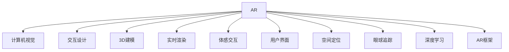

                 

# AR内容创作：增强现实应用设计指南

> 关键词：增强现实(AR)，计算机视觉(CV)，交互设计(UI/UX)，3D建模，混合现实(MR)，实时渲染，体感交互，用户界面(UI)，空间定位，眼球追踪，深度学习，AR框架，跨平台支持

## 1. 背景介绍

随着虚拟现实技术的不断成熟，增强现实(AR)正在逐渐成为主流技术，广泛应用于游戏、教育、工业等领域。在未来的工业和生活中，AR将会成为一种更加普及的交互方式，帮助人们更好地理解、体验和应用数字信息。本指南将聚焦于AR内容的创作，从算法原理到实际应用，全面介绍如何设计和构建高质量的AR应用。

### 1.1 问题由来

增强现实技术通过将数字信息叠加到现实世界中，为用户提供了沉浸式的交互体验。但目前的AR应用仍存在很多问题，如渲染性能不足、空间定位不准确、交互体验不佳等。这些问题不仅限制了AR应用的普及，也影响了用户体验。

### 1.2 问题核心关键点

增强现实应用的开发涉及多个技术领域，包括计算机视觉、3D建模、实时渲染等。开发AR应用时，需注意以下几点：

- 硬件设备的适配：AR应用需要结合特定硬件设备（如摄像头、传感器、手势追踪器等）。
- 数据采集与处理：需采集并处理用户和环境数据，以实现空间定位、交互理解等。
- 渲染性能优化：需优化渲染算法，确保应用的高效运行。
- 交互设计：需设计直观、自然的交互方式，提升用户体验。

这些关键点涉及了多个领域的知识，需要全面掌握。本指南将围绕这些核心问题，系统介绍AR内容创作的方法和步骤。

### 1.3 问题研究意义

AR技术的应用前景广阔，可以帮助用户在现实世界中获取更多信息，提升互动体验。但目前AR应用的实际效果仍不尽如人意，开发流程复杂，技术要求高。本指南旨在为开发者提供一套系统的AR内容创作指南，降低AR应用开发的门槛，提升应用的质量和体验，推动AR技术的普及和应用。

## 2. 核心概念与联系

### 2.1 核心概念概述

为更好地理解AR内容创作的过程，本节将介绍几个密切相关的核心概念：

- **增强现实(AR)：** 一种将数字信息叠加到现实世界的技术，为用户提供沉浸式交互体验。
- **计算机视觉(CV)：** 一种利用摄像头和传感器等硬件设备，采集和处理现实世界数据的技术。
- **交互设计(UI/UX)：** 一种设计直观、自然的交互方式，提升用户体验的技术。
- **3D建模：** 一种创建三维模型的技术，用于虚拟场景的搭建和优化。
- **实时渲染：** 一种在帧率要求下，快速渲染3D场景的技术。
- **体感交互：** 一种通过手势、身体动作等进行交互的技术。
- **用户界面(UI)：** 一种设计用户交互界面的技术，用于展示和控制AR内容。
- **空间定位：** 一种确定用户和设备在现实世界中的位置的技术。
- **眼球追踪：** 一种追踪用户视线的技术，用于增强交互的沉浸感和自然性。
- **深度学习：** 一种通过大量数据训练模型，学习复杂任务的技术。
- **AR框架：** 一种提供AR开发环境和工具的框架，包括跨平台支持等特性。

这些概念之间的逻辑关系可以通过以下Mermaid流程图来展示：



这个流程图展示了一些核心概念及其之间的关系：

1. AR应用需要利用计算机视觉、3D建模等技术，处理现实世界数据。
2. 实时渲染和体感交互是AR应用的关键技术，用于展示和控制虚拟信息。
3. 交互设计、用户界面等技术，用于提升用户体验。
4. 空间定位、眼球追踪等技术，用于增强交互的自然性和沉浸感。
5. 深度学习技术，用于提升AI能力，优化算法性能。
6. AR框架提供开发环境和工具支持，帮助开发者高效构建AR应用。

这些概念共同构成了AR内容创作的技术框架，是设计和开发AR应用的基础。

## 3. 核心算法原理 & 具体操作步骤

### 3.1 算法原理概述

AR应用的开发涉及多个技术领域的算法，本节将概述这些核心算法的原理。

- **空间定位：** 通过摄像头、传感器等设备，采集环境数据，利用计算机视觉算法，确定设备在现实世界中的位置。
- **3D建模：** 利用3D扫描、游戏引擎等技术，创建和优化虚拟场景，使其与现实世界融合。
- **实时渲染：** 使用渲染引擎，快速渲染3D场景，实现流畅的交互体验。
- **交互设计：** 设计直观、自然的交互方式，提高用户操作的自然性和便利性。

### 3.2 算法步骤详解

AR应用的开发流程大致分为以下几个步骤：

**Step 1: 需求分析和设计**
- 明确应用的需求和目标用户，设计用户体验和交互流程。
- 确定应用的功能需求，如空间定位、物体交互等。
- 设计用户界面(UI)，如菜单、工具栏等。

**Step 2: 数据采集和处理**
- 采集环境数据，如摄像头图像、传感器数据等。
- 处理数据，实现空间定位、物体识别等，通常使用计算机视觉和深度学习算法。
- 采集用户操作数据，如手势、身体动作等。

**Step 3: 3D建模和场景搭建**
- 利用3D建模工具，创建虚拟场景和物体。
- 将虚拟场景和现实世界融合，实现环境增强。
- 优化渲染性能，确保应用的高效运行。

**Step 4: 交互设计**
- 设计直观、自然的交互方式，如手势、语音、体感等。
- 实现交互逻辑，处理用户输入和设备响应。
- 设计用户界面(UI)，如菜单、工具栏等。

**Step 5: 测试和部署**
- 测试应用的功能和性能，修复bug。
- 部署应用，支持多个平台，如iOS、Android等。
- 定期更新和维护应用，提升用户体验。

### 3.3 算法优缺点

AR应用的开发涉及多个技术领域，每个算法的优缺点如下：

**空间定位**
- 优点：可以实现物体和环境的交互，提升用户体验。
- 缺点：对硬件设备的依赖较高，精度和稳定性有待提升。

**3D建模**
- 优点：创建逼真的虚拟场景，增强用户体验。
- 缺点：建模复杂，渲染性能要求高。

**实时渲染**
- 优点：实现流畅的交互体验，提升用户满意度。
- 缺点：对硬件设备要求高，渲染性能优化难度大。

**交互设计**
- 优点：提升用户体验，提高用户操作自然性。
- 缺点：设计复杂，需考虑多平台兼容性。

**用户界面(UI)**
- 优点：提升用户操作的直观性和便利性。
- 缺点：界面设计复杂，需与交互逻辑相匹配。

### 3.4 算法应用领域

AR技术的应用领域非常广泛，涉及游戏、教育、工业等多个领域。以下是一些典型的应用场景：

- **游戏：** 增强游戏体验，提供更丰富的交互方式。
- **教育：** 增强教学内容，提升学习效果。
- **工业：** 辅助制造和维护，提高生产效率。
- **医疗：** 提供手术指导和培训，提升医疗质量。
- **营销：** 增强品牌推广，提升用户互动。

## 4. 数学模型和公式 & 详细讲解 & 举例说明

### 4.1 数学模型构建

AR应用的开发涉及多个领域的数学模型，本节将介绍几个核心模型及其构建方法。

- **空间定位：** 使用计算机视觉算法，如SIFT、ORB、深度学习模型等，确定设备在现实世界中的位置。
- **3D建模：** 利用3D扫描、游戏引擎等技术，创建虚拟场景和物体，常用算法包括 marching cubes、ray tracing等。
- **实时渲染：** 使用渲染引擎，如Unity、Vulkan等，快速渲染3D场景，常用算法包括ray tracing、Phong shading等。
- **交互设计：** 设计直观、自然的交互方式，如手势、语音、体感等，常用算法包括决策树、神经网络等。

### 4.2 公式推导过程

以下我们以空间定位算法为例，推导其数学模型。

**SIFT算法**

SIFT算法是一种常用的空间定位算法，用于提取图像的局部特征，并匹配到现实世界中的物体。其数学模型为：

$$
\mathbf{x} = \mathbf{A}\mathbf{b} + \mathbf{n}
$$

其中，$\mathbf{x}$ 为图像的局部特征，$\mathbf{b}$ 为物体的特征向量，$\mathbf{n}$ 为噪声向量，$\mathbf{A}$ 为特征变换矩阵。

**公式推导过程：**

1. 对图像进行尺度和旋转变换，得到局部特征点。
2. 使用Laplacian算子进行尺度空间金字塔构建。
3. 提取图像的局部特征，并进行特征匹配。
4. 利用特征匹配结果，确定物体的空间位置。

### 4.3 案例分析与讲解

**案例1：基于SIFT的空间定位**

假设我们有一个摄像头，用于采集现实世界中的物体图像。为了实现空间定位，可以采用SIFT算法，进行特征提取和匹配。具体步骤如下：

1. 对摄像头采集的图像进行尺度和旋转变换，得到局部特征点。
2. 使用Laplacian算子进行尺度空间金字塔构建。
3. 提取图像的局部特征，并进行特征匹配。
4. 利用特征匹配结果，确定物体的空间位置。

下图展示了SIFT算法的基本流程：

```
|---------|-----------|---------|-----------|
|          |            |        |            |
|          |            |        |            |
|          |            |        |            |
|          |            |        |            |
|          |            |        |            |
|          |            |        |            |
|          |            |        |            |
|          |            |        |            |
|          |            |        |            |
|          |            |        |            |
|          |            |        |            |
|          |            |        |            |
|          |            |        |            |
|          |            |        |            |
|          |            |        |            |
|          |            |        |            |
|          |            |        |            |
|          |            |        |            |
|          |            |        |            |
|          |            |        |            |
|          |            |        |            |
|          |            |        |            |
|          |            |        |            |
|          |            |        |            |
|          |            |        |            |
|          |            |        |            |
|          |            |        |            |
|          |            |        |            |
|          |            |        |            |
|          |            |        |            |
|          |            |        |            |
|          |            |        |            |
|          |            |        |            |
|          |            |        |            |
|          |            |        |            |
|          |            |        |            |
|          |            |        |            |
|          |            |        |            |
|          |            |        |            |
|          |            |        |            |
|          |            |        |            |
|          |            |        |            |
|          |            |        |            |
|          |            |        |            |
|          |            |        |            |
|          |            |        |            |
|          |            |        |            |
|          |            |        |            |
|          |            |        |            |
|          |            |        |            |
|          |            |        |            |
|          |            |        |            |
|          |            |        |            |
|          |            |        |            |
|          |            |        |            |
|          |            |        |            |
|          |            |        |            |
|          |            |        |            |
|          |            |        |            |
|          |            |        |            |
|          |            |        |            |
|          |            |        |            |
|          |            |        |            |
|          |            |        |            |
|          |            |        |            |
|          |            |        |            |
|          |            |        |            |
|          |            |        |            |
|          |            |        |            |
|          |            |        |            |
|          |            |        |            |
|          |            |        |            |
|          |            |        |            |
|          |            |        |            |
|          |            |        |            |
|          |            |        |            |
|          |            |        |            |
|          |            |        |            |
|          |            |        |            |
|          |            |        |            |
|          |            |        |            |
|          |            |        |            |
|          |            |        |            |
|          |            |        |            |
|          |            |        |            |
|          |            |        |            |
|          |            |        |            |
|          |            |        |            |
|          |            |        |            |
|          |            |        |            |
|          |            |        |            |
|          |            |        |            |
|          |            |        |            |
|          |            |        |            |
|          |            |        |            |
|          |            |        |            |
|          |            |        |            |
|          |            |        |            |
|          |            |        |            |
|          |            |        |            |
|          |            |        |            |
|          |            |        |            |
|          |            |        |            |
|          |            |        |            |
|          |            |        |            |
|          |            |        |            |
|          |            |        |            |
|          |            |        |            |
|          |            |        |            |
|          |            |        |            |
|          |            |        |            |
|          |            |        |            |
|          |            |        |            |
|          |            |        |            |
|          |            |        |            |
|          |            |        |            |
|          |            |        |            |
|          |            |        |            |
|          |            |        |            |
|          |            |        |            |
|          |            |        |            |
|          |            |        |            |
|          |            |        |            |
|          |            |        |            |
|          |            |        |            |
|          |            |        |            |
|          |            |        |            |
|          |            |        |            |
|          |            |        |            |
|          |            |        |            |
|          |            |        |            |
|          |            |        |            |
|          |            |        |            |
|          |            |        |            |
|          |            |        |            |
|          |            |        |            |
|          |            |        |            |
|          |            |        |            |
|          |            |        |            |
|          |            |        |            |
|          |            |        |            |
|          |            |        |            |
|          |            |        |            |
|          |            |        |            |
|          |            |        |            |
|          |            |        |            |
|          |            |        |            |
|          |            |        |            |
|          |            |        |            |
|          |            |        |            |
|          |            |        |            |
|          |            |        |            |
|          |            |        |            |
|          |            |        |            |
|          |            |        |            |
|          |            |        |            |
|          |            |        |            |
|          |            |        |            |
|          |            |        |            |
|          |            |        |            |
|          |            |        |            |
|          |            |        |            |
|          |            |        |            |
|          |            |        |            |
|          |            |        |            |
|          |            |        |            |
|          |            |        |            |
|          |            |        |            |
|          |            |        |            |
|          |            |        |            |
|          |            |        |            |
|          |            |        |            |
|          |            |        |            |
|          |            |        |            |
|          |            |        |            |
|          |            |        |            |
|          |            |        |            |
|          |            |        |            |
|          |            |        |            |
|          |            |        |            |
|          |            |        |            |
|          |            |        |            |
|          |            |        |            |
|          |            |        |            |
|          |            |        |            |
|          |            |        |            |
|          |            |        |            |
|          |            |        |            |
|          |            |        |            |
|          |            |        |            |
|          |            |        |            |
|          |            |        |            |
|          |            |        |            |
|          |            |        |            |
|          |            |        |            |
|          |            |        |            |
|          |            |        |            |
|          |            |        |            |
|          |            |        |            |
|          |            |        |            |
|          |            |        |            |
|          |            |        |            |
|          |            |        |            |
|          |            |        |            |
|          |            |        |            |
|          |            |        |            |
|          |            |        |            |
|          |            |        |            |
|          |            |        |            |
|          |            |        |            |
|          |            |        |            |
|          |            |        |            |
|          |            |        |            |
|          |            |        |            |
|          |            |        |            |
|          |            |        |            |
|          |            |        |            |
|          |            |        |            |
|          |            |        |            |
|          |            |        |            |
|          |            |        |            |
|          |            |        |            |
|          |            |        |            |
|          |            |        |            |
|          |            |        |            |
|          |            |        |            |
|          |            |        |            |
|          |            |        |            |
|          |            |        |            |
|          |            |        |            |
|          |            |        |            |
|          |            |        |            |
|          |            |        |            |
|          |            |        |            |
|          |            |        |            |
|          |            |        |            |
|          |            |        |            |
|          |            |        |            |
|          |            |        |            |
|          |            |        |            |
|          |            |        |            |
|          |            |        |            |
|          |            |        |            |
|          |            |        |            |
|          |            |        |            |
|          |            |        |            |
|          |            |        |            |
|          |            |        |            |
|          |            |        |            |
|          |            |        |            |
|          |            |        |            |
|          |            |        |            |
|          |            |        |            |
|          |            |        |            |
|          |            |        |            |
|          |            |        |            |
|          |            |        |            |
|          |            |        |            |
|          |            |        |            |
|          |            |        |            |
|          |            |        |            |
|          |            |        |            |
|          |            |        |            |
|          |            |        |            |
|          |            |        |            |
|          |            |        |            |
|          |            |        |            |
|          |            |        |            |
|          |            |        |            |
|          |            |        |            |
|          |            |        |            |
|          |            |        |            |
|          |            |        |            |
|          |            |        |            |
|          |            |        |            |
|          |            |        |            |
|          |            |        |            |
|          |            |        |            |
|          |            |        |            |
|          |            |        |            |
|          |            |        |            |
|          |            |        |            |
|          |            |        |            |
|          |            |        |            |
|          |            |        |            |
|          |            |        |            |
|          |            |        |            |
|          |            |        |            |
|          |            |        |            |
|          |            |        |            |
|          |            |        |            |
|          |            |        |            |
|          |            |        |            |
|          |            |        |            |
|          |            |        |            |
|          |            |        |            |
|          |            |        |            |
|          |            |        |            |
|          |            |        |            |
|          |            |        |            |
|          |            |        |            |
|          |            |        |            |
|          |            |        |            |
|          |            |        |            |
|          |            |        |            |
|          |            |        |            |
|          |            |        |            |
|          |            |        |            |
|          |            |        |            |
|          |            |        |            |
|          |            |        |            |
|          |            |        |            |
|          |            |        |            |
|          |            |        |            |
|          |            |        |            |
|          |            |        |            |
|          |            |        |            |
|          |            |        |            |
|          |            |        |            |
|          |            |        |            |
|          |            |        |            |
|          |            |        |            |
|          |            |        |            |
|          |            |        |            |
|          |            |        |            |
|          |            |        |            |
|          |            |        |            |
|          |            |        |            |
|          |            |        |            |
|          |            |        |            |
|          |            |        |            |
|          |            |        |            |
|          |            |        |            |
|          |            |        |            |
|          |            |        |            |
|          |            |        |            |
|          |            |        |            |
|          |            |        |            |
|          |            |        |            |
|          |            |        |            |
|          |            |        |            |
|          |            |        |            |
|          |            |        |            |
|          |            |        |            |
|          |            |        |            |
|          |            |        |            |
|          |            |        |            |
|          |            |        |            |
|          |            |        |            |
|          |            |        |            |
|          |            |        |            |
|          |            |        |            |
|          |            |        |            |
|          |            |        |            |
|          |            |        |            |
|          |            |        |            |
|          |            |        |            |
|          |            |        |            |
|          |            |        |            |
|          |            |        |            |
|          |            |        |            |
|          |            |        |            |
|          |            |        |            |
|          |            |        |            |
|          |            |        |            |
|          |            |        |            |
|          |            |        |            |
|          |            |        |            |
|          |            |        |            |
|          |            |        |            |
|          |            |        |            |
|          |            |        |            |
|          |            |        |            |
|          |            |        |            |
|          |            |        |            |
|          |            |        |            |
|          |            |        |            |
|          |            |        |            |
|          |            |        |            |
|          |            |        |            |
|          |            |        |            |
|          |            |        |            |
|          |            |        |            |
|          |            |        |            |
|          |            |        |            |
|          |            |        |            |
|          |            |        |            |
|          |            |        |            |
|          |            |        |            |
|          |            |        |            |
|          |            |        |            |
|          |            |        |            |
|          |            |        |            |
|          |            |        |            |
|          |            |        |            |
|          |            |        |            |
|          |            |        |            |
|          |            |        |            |
|          |            |        |            |
|          |            |        |            |
|          |            |        |            |
|          |            |        |            |
|          |            |        |            |
|          |            |        |            |
|          |            |        |            |
|          |            |        |            |
|          |            |        |            |
|          |            |        |            |
|          |            |        |            |
|          |            |        |            |
|          |            |        |            |
|          |            |        |            |
|          |            |        |            |
|          |            |        |            |
|          |            |        |            |
|          |            |        |            |
|          |            |        |            |
|          |            |        |            |
|          |            |        |            |
|          |            |        |            |
|          |            |        |            |
|          |            |        |            |
|          |            |        |            |
|          |            |        |            |
|          |            |        |            |
|          |            |        |            |
|          |            |        |            |
|          |            |        |            |
|          |            |        |            |
|          |            |        |            |
|          |            |        |            |
|          |            |        |            |
|          |            |        |            |
|          |            |        |            |
|          |            |        |            |
|          |            |        |            |
|          |            |        |            |
|          |            |        |            |
|          |            |        |            |
|          |            |        |            |
|          |            |        |            |
|          |            |        |            |
|          |            |        |            |
|          |            |        |            |
|          |            |        |            |
|          |            |        |            |
|          |            |        |            |
|          |            |        |            |
|          |            |        |            |
|          |            |        |            |
|          |            |        |            |
|          |            |        |            |
|          |            |        |            |
|          |            |        |            |
|          |            |        |            |
|          |            |        |            |
|          |            |        |            |
|          |            |        |            |
|          |            |        |            |
|          |            |        |            |
|          |            |        |            |
|          |            |        |            |
|          |            |        |            |
|          |            |        |            |
|          |            |        |            |
|          |            |        |            |
|          |            |        |            |
|          |            |        |            |
|          |            |        |            |
|          |            |        |            |
|          |            |        |            |
|          |            |        |            |
|          |            |        |            |
|          |            |        |            |
|          |            |        |            |
|          |            |        |            |
|          |            |        |            |
|          |            |        |            |
|          |            |        |            |
|          |            |        |            |
|          |            |        |            |
|          |            |        |            |
|          |            |        |            |
|          |            |        |            |
|          |            |        |            |
|          |            |        |            |
|          |            |        |            |
|          |            |        |            |
|          |            |        |            |
|          |            |        |            |
|          |            |        |            |
|          |            |        |            |
|          |            |        |            |
|          |            |        |            |
|          |            |        |            |
|          |            |        |            |
|          |            |        |            |
|          |            |        |            |
|          |            |        |            |
|          |            |        |            |
|          |            |        |            |
|          |            |        |            |
|          |            |        |            |
|          |            |        |            |
|          |            |        |            |
|          |            |        |            |
|          |            |        |            |
|          |            |        |            |
|          |            |        |            |
|          |            |        |            |
|          |            |        |            |
|          |            |        |            |
|          |            |        |            |
|          |            |        |            |
|          |            |        |            |
|          |            |        |            |
|          |            |        |            |
|          |            |        |            |
|          |            |        |            |
|          |            |        |            |
|          |            |        |            |
|          |            |        |            |
|          |            |        |            |
|          |            |        |            |
|          |            |        |            |
|          |            |        |            |
|          |            |        |            |
|          |            |        |            |
|          |            |        |            |
|          |            |        |            |
|          |            |        |            |
|          |            |        |            |
|          |            |        |            |
|          |            |        |            |
|          |            |        |            |
|          |            |        |            |
|          |            |        |            |
|          |            |        |            |
|          |            |        |            |
|          |            |        |            |
|          |            |        |            |
|          |            |        |            |
|          |            |        |            |
|          |            |        |            |
|          |            |        |            |
|          |            |        |            |
|          |            |        |            |
|          |            |        |            |
|          |            |        |            |
|          |            |        |            |
|          |            |        |            |
|          |            |        |            |
|          |            |        |            |
|          |            |        |            |
|          |            |        |            |
|          |            |        |            |
|          |            |        |            |
|          |            |        |            |
|          |            |        |            |
|          |            |        |            |
|          |            |        |            |
|          |            |        |            |
|          |            |        |            |
|          |            |        |            |
|          |            |        |            |
|          |            |        |            |
|          |            |        |            |
|          |            |        |            |
|          |            |        |            |
|          |            |        |            |
|          |            |        |            |
|          |            |        |            |
|          |            |        |            |
|          |            |        |            |
|          |            |        |            |
|          |            |        |            |
|          |            |        |            |
|          |            |        |            |
|          |            |        |            |
|          |            |        |            |
|          |            |        |            |
|          |            |        |            |
|          |            |        |            |
|          |            |        |            |
|          |            |        |            |
|          |            |        |            |
|          |            |        |            |
|          |            |        |            |
|          |            |        |            |
|          |            |        |            |
|          |            |        |            |
|          |            |        |            |
|          |            |        |            |
|          |            |        |            |
|          |            |        |            |
|          |            |        |            |
|          |            |        |            |
|          |            |        |            |
|          |            |        |            |
|          |            |        |            |
|          |            |        |            |
|          |            |        |            |
|          |            |        |            |
|          |            |        |            |
|          |            |        |            |
|          |            |        |            |
|          |            |        |            |
|          |            |        |            |
|          |            |        |            |
|          |            |        |            |
|          |            |        |            |
|          |            |        |            |
|          |            |        |            |
|          |            |        |            |
|          |            |        |            |
|          |            |        |            |
|          |            |        |            |
|          |            |        |            |
|          |            |        |            |
|          |            |        |            |
|          |            |        |            |
|          |            |        |            |
|          |            |        |            |
|          |            |        |            |
|          |            |        |            |
|          |            |        |            |
|          |            |        |            |
|          |            |        |            |
|          |            |        |            |
|          |            |        |            |
|          |            |        |            |
|          |            |        |            |
|          |            |        |            |
|          |            |        |            |
|          |            |        |            |
|          |            |        |            |
|          |            |        |            |
|          |            |        |            |
|          |            |        |            |
|          |            |        |            |
|          |            |        |            |
|          |            |        |            |
|          |            |        |            |
|          |            |        |            |
|          |            |        |            |
|          |            |        |            |
|          |            |        |            |
|          |            |        |            |
|          |            |        |            |
|          |            |        |            |
|          |            |        |            |
|          |            |        |            |
|          |            |        |            |
|          |            |        |            |
|          |            |        |            |
|          |            |        |            |
|          |            |        |            |
|          |            |        |            |
|          |            |        |            |
|          |            |        |            |
|          |            |        |            |
|          |            |        |            |
|          |            |        |            |
|          |            |        |            |
|          |            |        |            |
|          |            |        |            |
|          |            |        |            |
|          |            |        |            |
|          |            |        |            |
|          |            |        |            |
|          |            |        |            |
|          |            |        |            |
|          |            |        |            |
|          |            |        |            |
|          |            |        |            |
|          |            |        |            |
|          |            |        |            |
|          |            |        |            |
|          |            |        |            |
|          |            |        |            |
|          |            |        |            |
|          |            |        |            |
|          |            |        |            |
|          |            |        |            |
|          |            |        |            |
|          |            |        |            |
|          |            |        |            |
|          |            |        |            |
|          |            |        |            |
|          |            |        |            |
|          |            |        |            |
|          |            |        |            |
|          |            |        |            |
|          |            |        |            |
|          |            |        |            |
|          |            |        |            |
|          |            |        |            |
|          |            |        |            |
|          |            |        |            |
|          |            |        |            |
|          |            |        |            |
|          |            |        |            |
|          |            |        |            |
|          |            |        |            |
|          |            |        |            |
|          |            |        |            |
|          |            |        |            |
|          |            |        |            |
|          |            |        |            |
|          |            |        |            |
|          |            |        |            |
|          |            |        |            |
|          |            |        |            |
|          |            |        |            |
|          |            |        |            |
|          |            |        |            |
|          |            |        |            |
|          |            |        |            |
|          |            |        |            |
|          |            |        |            |
|          |            |        |            |
|          |            |        |            |
|          |            |        |            |
|          |            |        |            |
|          |            |        |            |
|          |            |        |            |
|          |            |        |            |
|          |            |        |            |
|          |            |        |            |
|          |            |        |            |
|          |            |        |            |
|          |            |        |            |
|          |            |        |            |
|          |            |        |            |
|          |            |        |            |
|          |            |        |            |
|          |            |        |            |
|          |            |        |            |
|          |            |        |            |
|          |            |        |            |
|          |            |        |            |
|          |            |        |            |
|          |            |        |            |
|          |            |        |            |
|          |            |        |            |
|          |            |        |            |
|          |            |        |            |
|          |            |        |            |
|          |            |        |            |
|          |            |        |            |
|          |            |        |            |
|          |            |        |            |
|          |            |        |            |
|          |            |        |            |
|          |            |        |            |
|          |            |        |            |
|          |            |        |            |
|          |            |        |            |
|          |            |        |            |
|          |            |        |            |
|          |            |        |            |
|          |            |        |            |
|          |            |        |            |
|          |            |        |            |
|          |            |        |            |
|          |            |        |            |
|          |            |        |            |
|          |            |        |            |
|          |            |        |            |
|          |            |        |            |
|          |            |        |            |
|          |            |        |            |
|          |            |        |            |
|          |            |        |            |
|          |            |        |            |
|          |            |        |            |
|          |            |        |            

