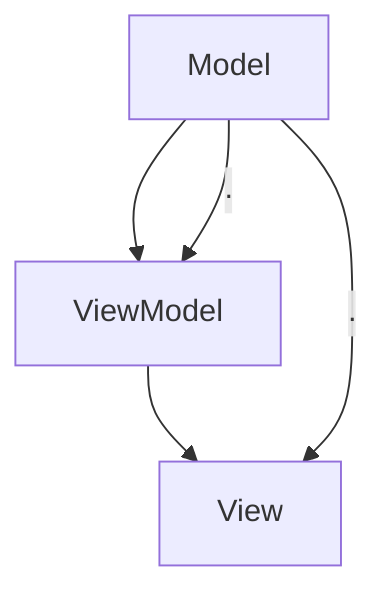

                 

# Angular 入门：Google 的 MVW 框架

> 关键词：Angular, MVW框架, 组件驱动, 依赖注入, TypeScript, 路由

## 1. 背景介绍

### 1.1 问题由来

在 Web 开发领域，随着前端技术栈的日益成熟和复杂化，对于组件化和模块化的需求也日渐增长。为了满足这种需求，Google 于 2010 年推出了 AngularJS，它是一个基于 MVC（Model-View-Controller）架构的 JavaScript 框架，旨在提升前端开发的效率和灵活性。然而，AngularJS 在 2016 年被 Angular 取代，后者采用了更为现代化的 MVW（Model-View-ViewModel）架构，进一步简化了开发流程，增强了组件化和模块化的能力。

本博客将带你深入了解 Angular 的 MVW 框架，讲解其核心概念、原理、实践以及应用场景，帮助你快速上手 Angular，提升 Web 开发能力。

## 2. 核心概念与联系

### 2.1 核心概念概述

在 Angular 中，MVW 架构将应用程序分为三个核心组件：Model（模型）、View（视图）和 ViewModel（视图层面模型）。这种架构方式简洁明了，强调组件的独立性和可重用性，使得开发人员能够更加专注于业务逻辑的实现。

以下是 Angular 中常见的核心概念及其关联：

- **Model**：负责处理业务数据和逻辑，是应用程序的数据源。Model 对象通常存储在服务中，并通过接口暴露给 View 层。
- **View**：负责呈现用户界面，是应用程序的展示层。View 通过指令（Directives）和组件（Components）实现数据绑定和交互。
- **ViewModel**：介于 Model 和 View 之间，负责数据的转换和逻辑处理。ViewModel 将 Model 的数据转换为 View 展示的数据，并通过指令和组件实现数据的双向绑定。

这些组件通过依赖注入（Dependency Injection）机制进行解耦，使得应用程序的可维护性和可扩展性得到极大提升。依赖注入使得开发人员能够灵活地替换和扩展组件，提高了代码的可测试性和复用性。

### 2.2 核心概念原理和架构的 Mermaid 流程图



此流程图展示了 Angular MVW 架构的基本关系和数据流向。其中，Model 直接连接 View 层，而 ViewModel 作为中间层，负责数据的处理和逻辑实现，实现了 Model 和 View 的解耦。

## 3. 核心算法原理 & 具体操作步骤

### 3.1 算法原理概述

Angular 的 MVW 框架采用了依赖注入（DI）机制，使得组件间的数据传递和通信变得简单高效。DI 机制通过服务（Service）和组件（Component）的解耦，实现了组件的独立性和可复用性。

在 Angular 中，DI 机制的实现基于 TypeScript 的依赖注入特性，即通过构造函数参数、属性、方法参数等方式注入依赖对象。这种注入方式不仅灵活，而且能够避免硬编码，增强代码的可维护性和可测试性。

### 3.2 算法步骤详解

以下是以 MVW 架构为基础的 Angular 核心算法步骤详解：

1. **组件定义**：通过 @Component 装饰器定义 Angular 组件，指定组件的 HTML 模板、样式和行为逻辑。

2. **数据绑定**：通过双括号语法或属性绑定语法实现 Model 和 View 的数据双向绑定。

3. **服务注入**：在组件中通过构造函数、属性、方法参数等方式注入服务，用于处理 Model 数据和逻辑。

4. **指令使用**：通过指令实现 View 层的功能扩展，如表单验证、事件绑定等。

5. **组件生命周期钩子**：通过定义不同生命周期钩子方法，如 OnInit、OnDestroy 等，实现组件的初始化、销毁等行为逻辑。

### 3.3 算法优缺点

Angular 的 MVW 框架具有以下优点：

- **组件化**：组件是 Angular 的核心，使得应用程序更加模块化和可复用。
- **依赖注入**：通过 DI 机制实现组件间解耦，提高了代码的可维护性和可测试性。
- **数据绑定**：实现了 Model 和 View 的双向绑定，简化了开发流程。
- **指令和管道**：扩展了 View 层的功能，提供了丰富的视图操作能力。

同时，Angular 也存在一些缺点：

- **学习曲线陡峭**：由于框架的复杂性，初学者可能难以快速上手。
- **性能开销较大**：Angular 的模板编译和渲染开销较大，影响应用性能。
- **TypeScript 依赖**：由于 Angular 大量依赖 TypeScript，新手需先学习 TypeScript。

### 3.4 算法应用领域

Angular 的 MVW 架构适用于各种 Web 开发场景，特别是对于大型应用、复杂的用户界面和丰富的交互功能需求，Angular 提供了良好的解决方案。以下是一些常见的应用领域：

- **Web 应用开发**：构建响应式的单页应用，支持复杂的用户界面和交互逻辑。
- **桌面应用**：通过 Electron 等技术，将 Angular 应用转化为跨平台的桌面应用。
- **移动应用**：通过 Ionic 等框架，将 Angular 应用转化为移动应用。
- **企业级应用**：构建复杂的业务系统，支持大型企业的业务需求。

## 4. 数学模型和公式 & 详细讲解 & 举例说明

### 4.1 数学模型构建

在 Angular 中，数学模型的构建主要涉及数据模型的设计和实现。Model 通常包括一个或多个数据属性，用于存储应用程序的数据。以下是 Angular 中 Model 的构建示例：

```typescript
export class User {
    id: number;
    name: string;
    email: string;
}
```

### 4.2 公式推导过程

在 Angular 中，数据的双向绑定是通过指令实现的。指令通过属性绑定或事件绑定实现数据的流向和处理。以下是 Angular 中指令的使用示例：

```typescript
import { Component, OnInit } from '@angular/core';

@Component({
  selector: 'app-form',
  template: `
    <form (submit)="submitForm()">
      <input type="text" [(ngModel)]="user.name" name="name" required>
      <input type="email" [(ngModel)]="user.email" name="email" required>
      <button type="submit">Submit</button>
    </form>
  `
})
export class FormComponent implements OnInit {
  user = new User();

  submitForm() {
    console.log(this.user);
  }

  constructor() { }
  
  ngOnInit(): void {
  }
}
```

### 4.3 案例分析与讲解

以表单验证为例，Angular 提供了内置的表单验证指令，用于实现表单输入的校验和提示。以下是 Angular 中表单验证的示例代码：

```typescript
import { Component, OnInit } from '@angular/core';

@Component({
  selector: 'app-form',
  template: `
    <form (submit)="submitForm()">
      <input type="text" [(ngModel)]="user.name" name="name" required>
      <input type="email" [(ngModel)]="user.email" name="email" required>
      <button type="submit">Submit</button>
    </form>
  `
})
export class FormComponent implements OnInit {
  user = new User();

  submitForm() {
    console.log(this.user);
  }

  constructor() { }
  
  ngOnInit(): void {
  }
}
```

在上述代码中，[(ngModel)] 属性绑定将表单输入绑定到用户对象的属性上。通过使用 required 属性，可以强制输入必填字段。当表单提交时，用户对象会被打印输出，以便进行后续处理。

## 5. 项目实践：代码实例和详细解释说明

### 5.1 开发环境搭建

要搭建 Angular 开发环境，需要进行以下步骤：

1. 安装 Node.js 和 npm，用于运行 TypeScript 编译器和 Angular CLI。
2. 安装 Angular CLI，使用以下命令进行安装：

```bash
npm install -g @angular/cli
```

3. 创建新的 Angular 项目，使用以下命令：

```bash
ng new my-app
cd my-app
```

4. 进入项目目录，使用以下命令启动 Angular 开发服务器：

```bash
ng serve
```

### 5.2 源代码详细实现

以下是一个简单的 Angular 组件示例，展示如何实现双向绑定和表单验证：

```typescript
import { Component, OnInit } from '@angular/core';

@Component({
  selector: 'app-form',
  template: `
    <form (submit)="submitForm()">
      <input type="text" [(ngModel)]="user.name" name="name" required>
      <input type="email" [(ngModel)]="user.email" name="email" required>
      <button type="submit">Submit</button>
    </form>
  `
})
export class FormComponent implements OnInit {
  user = new User();

  submitForm() {
    console.log(this.user);
  }

  constructor() { }
  
  ngOnInit(): void {
  }
}
```

### 5.3 代码解读与分析

在上述代码中，@Component 装饰器定义了一个 Angular 组件，指定了组件的 selector、template 和行为逻辑。使用 [(ngModel)] 属性绑定实现了用户对象的属性和表单元素的双向绑定。通过 submitForm 方法，打印输出用户对象，进行后续处理。

### 5.4 运行结果展示

启动 Angular 开发服务器后，在浏览器中访问 http://localhost:4200/form，即可看到组件的运行效果。输入用户信息后，点击提交按钮，即可在控制台输出用户对象。

## 6. 实际应用场景

### 6.1 企业级应用

Angular 的 MVW 架构适用于构建企业级应用，支持复杂的业务逻辑和丰富的交互功能。以下是一个简单的企业级应用示例，展示如何实现数据管理和权限控制：

```typescript
import { Component, OnInit } from '@angular/core';

@Component({
  selector: 'app-dashboard',
  template: `
    <h2>Dashboard</h2>
    <table>
      <tr>
        <th>Name</th>
        <th>Email</th>
        <th>Role</th>
        <th>Action</th>
      </tr>
      <tr *ngFor="let user of users">
        <td>{{ user.name }}</td>
        <td>{{ user.email }}</td>
        <td>{{ user.role }}</td>
        <td>
          <button (click)="editUser(user)">Edit</button>
          <button (click)="deleteUser(user)">Delete</button>
        </td>
      </tr>
    </table>
  `
})
export class DashboardComponent implements OnInit {
  users = [
    { name: 'Alice', email: 'alice@example.com', role: 'Manager' },
    { name: 'Bob', email: 'bob@example.com', role: 'Developer' }
  ];

  editUser(user: User) {
    console.log('Editing user:', user);
  }

  deleteUser(user: User) {
    console.log('Deleting user:', user);
  }

  constructor() { }
  
  ngOnInit(): void {
  }
}
```

在上述代码中，DashboardComponent 组件展示了一个简单的企业级应用界面，包括用户列表、编辑和删除按钮等。通过 *ngFor 指令循环展示用户数据，并使用用户对象的属性作为模板内容。

### 6.2 移动应用

Angular 可以通过 Ionic 等框架将应用转化为移动应用。以下是一个简单的 Ionic 应用示例，展示如何在移动应用中使用 Angular 组件：

```typescript
import { Component } from '@angular/core';

@Component({
  selector: 'app-my-component',
  template: `
    <h1>Hello, Angular!</h1>
    <p>This is my component.</p>
  `
})
export class MyComponent {
  constructor() { }
}
```

在上述代码中，通过 @Component 装饰器定义了一个 Angular 组件，并指定了 selector 和 template。将该组件嵌入到 Ionic 应用中，即可实现移动应用界面展示。

## 7. 工具和资源推荐

### 7.1 学习资源推荐

以下是一些学习 Angular 的推荐资源：

- Angular 官方文档：https://angular.io/docs
- Angular 中文社区：https://www.angular.cn
- Angular 入门教程：https://angular.io/guide/getting-started
- Angular 实战教程：https://www.jianshu.com/p/7852c41f0846

### 7.2 开发工具推荐

Angular 开发过程中常用的开发工具包括：

- Visual Studio Code：轻量级代码编辑器，支持 TypeScript 编译和调试。
- Angular CLI：用于创建、构建和发布 Angular 应用的工具。
- Git：版本控制工具，用于管理代码版本和协作开发。
- npm：Node.js 的包管理器，用于安装和管理依赖包。

### 7.3 相关论文推荐

以下是一些与 Angular 相关的论文和文章：

- "Component-Based Web Development: A Practical Approach to Web Components"：2013 年发表在 IEEE 的论文，介绍组件化 Web 开发的方法和实践。
- "Angular 2, Rethinking Web Components"：2015 年发表在 Angular 官方博客的文章，介绍 Angular 2 的组件化设计理念和实现方式。
- "Angular 2 Developer's Guide"：Angular 2 的官方开发者指南，详细介绍了 Angular 2 的核心概念和实践。

## 8. 总结：未来发展趋势与挑战

### 8.1 研究成果总结

Angular 的 MVW 架构为 Web 开发提供了全新的思路和工具。通过组件化、依赖注入和数据绑定等技术，Angular 使得 Web 开发更加模块化、可复用和可测试。此外，Angular 的 TypeScript 特性和 RxJS 支持，也为其高性能和灵活性提供了保障。

### 8.2 未来发展趋势

未来，Angular 将继续在 Web 开发领域发挥重要作用。以下是 Angular 未来可能的发展趋势：

- **TypeScript 的普及**：随着 TypeScript 的流行和普及，Angular 将进一步提升代码的可维护性和可测试性。
- **响应式编程**：随着 RxJS 的广泛应用，Angular 将提供更强大的响应式编程支持。
- **工具和生态的完善**：随着 Angular CLI 的不断更新和扩展，Angular 的开发工具和生态将更加完善和高效。
- **移动应用的扩展**：随着 Ionic 等框架的发展，Angular 将更广泛地应用到移动应用开发中。

### 8.3 面临的挑战

Angular 在发展过程中也面临一些挑战：

- **学习曲线陡峭**：Angular 的复杂性使得初学者需要一定的时间进行学习和适应。
- **性能问题**：Angular 的模板编译和渲染开销较大，影响应用性能。
- **社区生态**：Angular 社区生态相对复杂，开发者需要不断跟进最新的开发和部署工具。

### 8.4 研究展望

未来的研究可以从以下几个方向进行：

- **简化框架**：通过简化框架结构，降低学习难度，提高开发效率。
- **提升性能**：优化模板编译和渲染流程，提升应用性能。
- **增强生态**：完善 Angular 的生态系统，提供更多的开发工具和资源支持。
- **扩展应用场景**：将 Angular 应用扩展到更多领域和场景中，提升其应用价值和影响力。

## 9. 附录：常见问题与解答

### Q1: Angular 是否支持 SSR（Server Side Rendering）？

A: Angular 本身不支持 SSR，但可以通过 Angular Universal 组件来实现服务器端渲染。Angular Universal 是一个独立的库，可以与 Angular 应用一起使用，实现服务端渲染功能。

### Q2: 如何优化 Angular 应用的性能？

A: 优化 Angular 应用性能可以从以下几个方面进行：

- **懒加载模块**：使用 ngModuleFactory 将模块懒加载，减少初始加载时间。
- **缓存模板**：通过缓存模板，减少模板编译和渲染的次数。
- **异步加载数据**：使用 HttpClient 异步加载数据，避免阻塞页面渲染。
- **代码分割**：使用 code splitting 技术，减少 JavaScript 文件的体积。

### Q3: 如何在 Angular 应用中使用响应式编程？

A: Angular 提供了 RxJS 支持，可以使用 RxJS 实现响应式编程。例如，使用 Observable 对象和管道操作，实现数据流和状态管理。

---

作者：禅与计算机程序设计艺术 / Zen and the Art of Computer Programming

