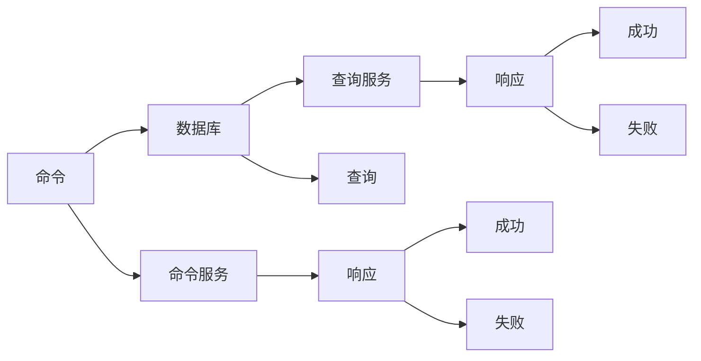

                 

## 1. 背景介绍

### 1.1 问题由来

随着Web应用的不断发展，系统复杂性不断提升，传统的单体架构难以满足高性能、高可伸缩性、高可维护性的需求。数据库读写分离(CQRS)是针对这些问题提出的一种重要设计模式，通过将系统拆分成两个部分，分别处理读写操作，有效提升系统性能和可扩展性。

CQRS（Command Query Responsibility Segregation）全称为命令查询责任分离，由Eric Evans在2010年提出，其核心理念是将系统的读写操作分开，分别由不同的模块负责处理。Command（命令）负责处理系统状态的变化，Query（查询）负责读取系统状态。读写分离的设计能带来显著的性能提升和代码可维护性改善，被广泛应用于高流量、高并发的Web应用中。

### 1.2 问题核心关键点

CQRS模式的核心在于将系统的命令和查询分离处理，实现读写分离。其关键点包括：

- 命令与查询分离：命令负责修改数据，查询只读取数据。
- 独立的数据库：命令和查询使用不同的数据库进行数据操作。
- 独立的服务处理：命令和查询分别由不同的服务进行处理。
- 事务一致性保证：保证命令和查询的数据一致性，确保系统状态的正确性。

## 2. 核心概念与联系

### 2.1 核心概念概述

为更好地理解CQRS模式，我们首先介绍几个核心概念：

- 命令(Command)：用于修改数据的操作，通常包括创建、更新、删除等。
- 查询(Query)：用于读取数据的操作，如获取某个实体的详细信息。
- 数据库(Datastore)：存储命令和查询的数据，保证数据的持久化。
- 服务(Services)：处理命令和查询的服务，包括命令服务、查询服务。
- 事务(Transaction)：保证命令和查询的数据一致性，确保操作原子性。

这些核心概念通过CQRS模式的设计被巧妙地组合在一起，形成了一种高效、可扩展的系统架构。

### 2.2 核心概念原理和架构的 Mermaid 流程图



这个流程图展示了CQRS模式的核心组件和操作流程：

1. 命令(白色框)：从应用层接收命令请求，处理后通过命令服务发送到数据库。
2. 命令服务(绿色框)：负责将命令转化为数据库操作，通过数据传输层发送到数据库。
3. 数据库(橙色框)：执行命令服务发送的数据库操作，保证数据持久化。
4. 查询(红色框)：从应用层接收查询请求，处理后通过查询服务发送到数据库。
5. 查询服务(蓝色框)：负责将查询转化为数据库操作，通过数据传输层发送到数据库。
6. 响应(黑色框)：查询服务返回查询结果，应用层根据结果生成响应。

通过这个流程，CQRS模式将读写操作分离，提高了系统的性能和可维护性。

## 3. 核心算法原理 & 具体操作步骤

### 3.1 算法原理概述

CQRS模式的核心算法原理是读写分离，通过命令服务处理命令请求，更新数据库中的数据；通过查询服务处理查询请求，读取数据库中的数据。为保证数据一致性，命令服务必须保证操作的原子性，而查询服务只负责读取，不修改数据。

CQRS模式通过将命令和查询分离处理，减少了数据库操作的频率，提高了系统的性能和可扩展性。同时，分离后的服务更加独立，提高了代码的可维护性和可测试性。

### 3.2 算法步骤详解

CQRS模式的核心步骤如下：

1. **分离命令和查询**：将系统中的命令和查询操作分离，由不同的模块处理。
2. **使用不同的数据库**：命令使用写入型数据库，查询使用读取型数据库。
3. **命令服务处理命令**：命令服务将命令转化为数据库操作，并发送至写入型数据库。
4. **查询服务处理查询**：查询服务将查询转化为数据库操作，并发送至读取型数据库。
5. **保证事务一致性**：命令服务使用事务机制，保证操作的原子性，确保命令和查询的数据一致性。

### 3.3 算法优缺点

CQRS模式有以下优点：

- **性能提升**：通过分离读写操作，减少了数据库操作的频率，提高了系统的性能。
- **可扩展性**：命令和查询分别由不同的服务处理，使得系统更加灵活可扩展。
- **可维护性**：命令和查询分别由不同的模块维护，提高了代码的可维护性。

但CQRS模式也存在一些缺点：

- **复杂性增加**：系统需要设计并实现两个不同的服务，增加了系统的复杂性。
- **开发成本增加**：分离读写操作需要更多的开发工作，增加了开发成本。
- **数据一致性保证困难**：需要复杂的机制来保证命令和查询的数据一致性。

### 3.4 算法应用领域

CQRS模式广泛应用于高流量、高并发的Web应用中，如电商系统、社交网络、在线论坛等。通过将命令和查询分离处理，CQRS模式能有效提升系统的性能和可扩展性，被广泛应用于这些高并发场景。

## 4. 数学模型和公式 & 详细讲解 & 举例说明

### 4.1 数学模型构建

CQRS模式的核心数学模型包括：

- 命令模型：描述命令操作的数学模型，包括命令类型、参数、返回值等。
- 查询模型：描述查询操作的数学模型，包括查询类型、参数、返回值等。
- 数据库模型：描述数据库中的数据结构，包括实体、关系、属性等。

这些模型通过CQRS模式的设计被巧妙地组合在一起，形成了一种高效、可扩展的系统架构。

### 4.2 公式推导过程

以电商系统中的一条订单命令和查询为例，进行公式推导：

**命令模型**：

- 命令类型：`createOrder`
- 参数：`{productID, quantity, customerID}`
- 返回值：`{orderId}`

**查询模型**：

- 查询类型：`getOrder`
- 参数：`{orderId}`
- 返回值：`{order}`

**数据库模型**：

- 实体：`Order`
- 属性：`orderId, productID, quantity, customerID, status`

命令服务将`createOrder`命令转化为数据库操作，更新订单状态。查询服务将`getOrder`查询转化为数据库操作，读取订单信息。

### 4.3 案例分析与讲解

假设电商系统中有一条`createOrder`命令，其参数为`{productID: 1001, quantity: 2, customerID: 1000}`。命令服务将这条命令转化为数据库操作，更新订单状态。查询服务将这条命令的返回值作为查询参数，返回订单信息。

## 5. 项目实践：代码实例和详细解释说明

### 5.1 开发环境搭建

在项目实践中，我们需要搭建一个包含命令服务和查询服务的环境。以下是一个基于Spring Boot的CQRS系统搭建示例：

1. 安装Java开发环境（JDK 8及以上）。
2. 安装Spring Boot和Spring Data。
3. 创建命令服务模块和查询服务模块。

### 5.2 源代码详细实现

**命令服务模块**：

```java
@Service
public class OrderCommandService {

    @Autowired
    private OrderRepository orderRepository;

    public Order createOrder(String productId, int quantity, String customerId) {
        // 创建订单
        Order order = new Order();
        order.setProductId(productId);
        order.setQuantity(quantity);
        order.setCustomerId(customerId);
        order.setStatus("CREATED");
        orderRepository.save(order);
        // 返回订单ID
        return order;
    }
}
```

**查询服务模块**：

```java
@Service
public class OrderQueryService {

    @Autowired
    private OrderRepository orderRepository;

    public Order getOrder(String orderId) {
        // 获取订单信息
        return orderRepository.findById(orderId).orElse(null);
    }
}
```

### 5.3 代码解读与分析

命令服务模块处理`createOrder`命令，将其转化为数据库操作，并更新订单状态。查询服务模块处理`getOrder`查询，读取订单信息并返回。

### 5.4 运行结果展示

运行以上代码后，命令服务模块会创建一条订单，并返回订单ID。查询服务模块根据订单ID获取订单信息，并返回订单详情。

## 6. 实际应用场景

### 6.1 电商系统

CQRS模式在电商系统中得到广泛应用，能有效提升系统的性能和可扩展性。电商系统中，订单和库存管理需要频繁读写数据，使用CQRS模式可以将订单和库存管理分离，提高系统的性能和稳定性。

**订单模块**：

- 命令服务：处理`createOrder`命令，更新订单状态。
- 查询服务：获取订单详情。

**库存模块**：

- 命令服务：处理`updateInventory`命令，更新库存状态。
- 查询服务：获取库存详情。

通过分离读写操作，电商系统能有效应对高并发流量，提升用户体验。

### 6.2 社交网络

社交网络系统中，用户动态和关系管理需要频繁读写数据，使用CQRS模式可以将用户动态和关系管理分离，提高系统的性能和可扩展性。

**用户动态模块**：

- 命令服务：处理`postStatus`命令，更新用户动态。
- 查询服务：获取用户动态详情。

**关系模块**：

- 命令服务：处理`followUser`命令，更新用户关系。
- 查询服务：获取用户关系详情。

通过分离读写操作，社交网络系统能有效应对高并发流量，提升用户体验。

### 6.3 在线论坛

在线论坛系统中，帖子管理和评论管理需要频繁读写数据，使用CQRS模式可以将帖子管理和评论管理分离，提高系统的性能和可扩展性。

**帖子模块**：

- 命令服务：处理`createPost`命令，更新帖子状态。
- 查询服务：获取帖子详情。

**评论模块**：

- 命令服务：处理`addComment`命令，更新评论状态。
- 查询服务：获取评论详情。

通过分离读写操作，在线论坛系统能有效应对高并发流量，提升用户体验。

### 6.4 未来应用展望

随着Web应用的发展，CQRS模式的适用场景将不断扩大。未来，CQRS模式将在更多高流量、高并发的系统中得到应用，如物联网、金融交易等。

## 7. 工具和资源推荐

### 7.1 学习资源推荐

为了帮助开发者系统掌握CQRS模式，我们推荐以下学习资源：

1. **《CQRS - Command Query Responsibility Segregation》**：Eric Evans撰写的经典书籍，系统介绍了CQRS模式的设计理念和实践方法。
2. **《Spring Boot + Redis + CQRS架构实战》**：通过实战案例，详细讲解了CQRS模式在Spring Boot环境下的应用。
3. **《CQRS模式在电商系统中的应用》**：介绍了CQRS模式在电商系统中的具体应用，帮助开发者更好地理解CQRS模式。

### 7.2 开发工具推荐

CQRS模式的开发离不开优秀的开发工具，以下是几款常用的开发工具：

1. **Spring Boot**：基于Spring框架的轻量级开发框架，简单易用，适合快速开发高并发的Web应用。
2. **Spring Data**：基于Spring框架的数据访问层解决方案，提供便捷的数据操作接口。
3. **Redis**：高性能的内存数据库，适合存储命令和查询结果。
4. **MyBatis**：轻量级的数据访问层解决方案，支持多数据库的映射。

### 7.3 相关论文推荐

CQRS模式的发展离不开学界的持续研究。以下是几篇经典的CQRS相关论文，推荐阅读：

1. **《CQRS - Command Query Responsibility Segregation》**：Eric Evans撰写的经典论文，介绍了CQRS模式的设计理念和实践方法。
2. **《CQRS Patterns》**：介绍CQRS模式在实际项目中的具体应用。
3. **《Spring Boot + Redis + CQRS架构实战》**：通过实战案例，详细讲解了CQRS模式在Spring Boot环境下的应用。

## 8. 总结：未来发展趋势与挑战

### 8.1 总结

本文系统介绍了CQRS模式的设计理念和实践方法，通过理论分析与代码实现，展示了CQRS模式在实际应用中的效果。通过本文的学习，开发者可以更好地理解CQRS模式的原理和实现方法，提升系统性能和可扩展性。

### 8.2 未来发展趋势

CQRS模式的未来发展趋势如下：

1. **云原生化**：随着云原生技术的不断发展，CQRS模式将更好地融入云原生架构中，实现更高效、更灵活的系统设计。
2. **微服务化**：CQRS模式与微服务架构相结合，通过服务细粒度拆分，提升系统的可扩展性和可维护性。
3. **数据湖化**：CQRS模式与数据湖技术结合，实现数据的统一管理和多数据源的整合，提升数据的价值。
4. **智能自动化**：通过引入AI技术，自动化处理命令和查询请求，提升系统的智能化水平。

### 8.3 面临的挑战

CQRS模式在实际应用中也面临一些挑战，需要不断优化和改进：

1. **复杂性增加**：分离读写操作增加了系统的复杂性，需要更多的开发工作。
2. **数据一致性保证困难**：需要复杂的机制来保证命令和查询的数据一致性。
3. **开发成本增加**：分离读写操作需要更多的开发工作，增加了开发成本。

### 8.4 研究展望

未来，CQRS模式的研究方向将包括：

1. **简化架构设计**：通过优化设计，降低CQRS模式的复杂性，提升系统的可维护性。
2. **提高一致性保证**：探索更高效的数据一致性保证机制，提高系统的可靠性和稳定性。
3. **引入AI技术**：通过引入AI技术，自动化处理命令和查询请求，提升系统的智能化水平。
4. **优化性能**：优化命令服务和查询服务的性能，提高系统的响应速度和吞吐量。

## 9. 附录：常见问题与解答

**Q1：CQRS模式是否适用于所有Web应用？**

A: CQRS模式适用于高流量、高并发的Web应用，如电商系统、社交网络、在线论坛等。但对于一些简单的应用，分离读写操作可能反而增加复杂性，不适合使用CQRS模式。

**Q2：如何设计CQRS模式的命令和查询？**

A: 设计CQRS模式的命令和查询需要考虑应用的业务场景和数据结构。通常情况下，命令用于修改数据，查询用于读取数据。命令和查询的类型、参数、返回值需要根据具体应用场景进行设计。

**Q3：如何保证CQRS模式的数据一致性？**

A: 通过事务机制，命令服务可以保证操作的原子性，确保命令和查询的数据一致性。同时，可以通过数据库的乐观锁或悲观锁机制，进一步提高数据一致性。

**Q4：CQRS模式在微服务架构中的应用**

A: CQRS模式与微服务架构相结合，通过服务细粒度拆分，提升系统的可扩展性和可维护性。微服务架构通过服务治理，使得CQRS模式更加灵活、可扩展。

---

作者：禅与计算机程序设计艺术 / Zen and the Art of Computer Programming

