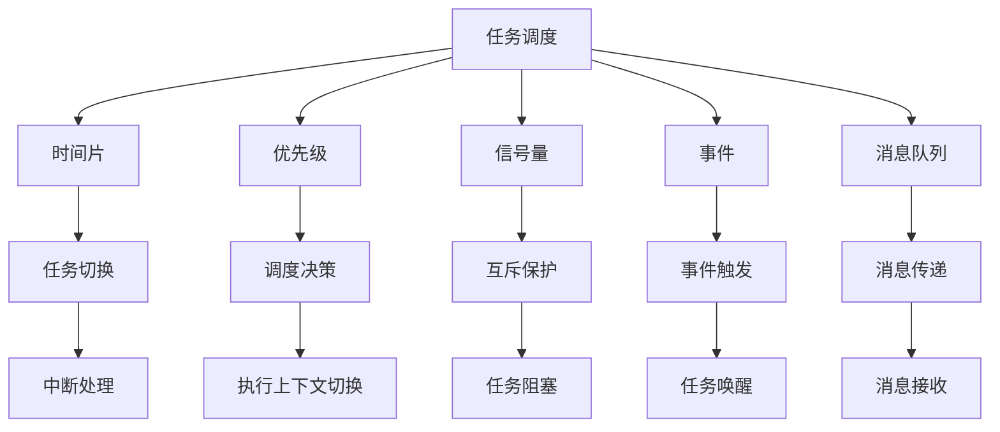

                 

# FreeRTOS任务调度与通信

> 关键词：FreeRTOS, 任务调度, 时间片, 优先级, 信号量, 事件, 通信, 消息队列, 同步, 并发

## 1. 背景介绍

FreeRTOS是一个轻量级、高效的实时操作系统内核，广泛应用于嵌入式系统、物联网设备、工业控制等领域。它通过高效的任务调度和通信机制，支持多任务并发执行，并提供了丰富的API接口，便于开发者快速开发实时应用。

本文将系统介绍FreeRTOS的任务调度机制和通信机制，包括时间片、优先级、信号量、事件、消息队列等核心概念，并结合实际案例进行分析，帮助读者深入理解FreeRTOS的内核原理和应用技巧。

## 2. 核心概念与联系

### 2.1 核心概念概述

为更好地理解FreeRTOS的任务调度与通信机制，本节将介绍几个关键核心概念：

- FreeRTOS：一个广泛应用的开源实时操作系统内核，以微内核架构设计，支持多任务并发执行。
- 任务调度：将CPU时间分配给各个任务的过程，通过时间片、优先级等调度策略，实现任务的公平执行。
- 时间片：分配给每个任务执行的时间片段，用于控制任务的执行频率。
- 优先级：根据任务的紧急程度和重要性，赋予不同的优先级，用于调度决策。
- 信号量：用于任务间的同步与互斥，通过P、V操作控制信号量的值，实现任务间的状态传递。
- 事件：用于任务间的通信和协调，通过事件集触发函数，实现任务间的异步通信。
- 消息队列：用于任务间的消息传递，通过消息缓冲区存储和处理消息，实现任务的可靠通信。

这些核心概念通过特定的机制和API接口，有机结合在一起，构成了FreeRTOS的任务调度与通信框架。

### 2.2 核心概念原理和架构的 Mermaid 流程图



这个流程图展示了FreeRTOS任务调度与通信机制的逻辑结构，时间片、优先级等调度策略，以及信号量、事件、消息队列等通信机制的执行流程。

## 3. 核心算法原理 & 具体操作步骤

### 3.1 算法原理概述

FreeRTOS的任务调度机制采用了经典的时分复用方式，通过时间片轮转、优先级调度等策略，实现任务的公平执行和响应及时性。同时，它提供了丰富的通信机制，如信号量、事件、消息队列等，支持任务间的同步与协作。

FreeRTOS的核心调度算法是基于时间片轮转的抢占式调度。任务在执行过程中会被中断，并切换到其他任务。当一个任务的执行时间片用完，它的CPU时间将被剥夺，由其他任务占用。优先级高的任务优先执行，优先级相同的任务按时间片轮转顺序执行。

### 3.2 算法步骤详解

FreeRTOS的任务调度与通信机制主要包括以下几个关键步骤：

**Step 1: 创建任务**

开发者需要定义任务的执行函数、堆栈大小、优先级、时间片等参数，并通过FreeRTOS API创建任务。

```c
#include "freertos/FreeRTOS.h"
#include "freertos/task.h"

void app_main(void)
{
    // 定义任务执行函数
    void app_task(void* arg);
    
    // 创建任务
    xTaskCreate(
        app_task,
        "app_task",
        configMINIMAL_STACK_SIZE,
        NULL,
        5, // 优先级为5
        0); // 时间片为0
}

void app_task(void* arg)
{
    // 任务执行函数
    while(1)
    {
        // 执行任务逻辑
    }
}
```

**Step 2: 任务调度**

FreeRTOS通过任务调度器来管理任务的执行，调度器会根据时间片、优先级等策略，决定任务的执行顺序。

- 时间片：通过`vTaskSetTimeOutState()`和`xTaskCreateStatic()`等函数设置任务的时间片，以控制任务的执行频率。
- 优先级：通过`xTaskPrioritySet()`函数设置任务的优先级，用于调度决策。
- 调度决策：调度器会根据任务的优先级和时间片，进行任务的抢占式调度，确保高优先级任务的及时响应。

```c
// 设置任务优先级
xTaskPrioritySet(xTaskGetHandle(app_task), 5); // 设置优先级为5

// 设置任务时间片
xTaskSetTimeOutState(5, 0); // 时间片为5ms
```

**Step 3: 任务通信**

FreeRTOS提供了丰富的通信机制，支持任务间的同步与协作。

- 信号量：通过`xSemaphoreCreate()`函数创建信号量，使用`xSemaphoreTake()`和`xSemaphoreGive()`函数实现任务的同步与互斥。
- 事件：通过`xEventGroupCreate()`函数创建事件组，使用`xEventGroupWaitBits()`和`xEventGroupSetBits()`函数实现任务间的异步通信。
- 消息队列：通过`xQueueCreate()`函数创建消息队列，使用`xQueueSend()`和`xQueueReceive()`函数实现任务的可靠通信。

```c
// 创建信号量
xSemaphoreHandle_t xSemaphore = xSemaphoreCreateBinary();

// 创建事件组
xEventGroupHandle_t xEventGroup = xEventGroupCreate();

// 创建消息队列
xQueueHandle_t xQueue = xQueueCreate(10, sizeof(char*));

// 同步互斥
xSemaphoreTake(xSemaphore, portMAX_DELAY); // 等待信号量
xSemaphoreGive(xSemaphore); // 释放信号量

// 异步通信
xEventGroupWaitBits(xEventGroup, xEventGroupEvent, true, true, pdMAX_DELAY); // 等待事件
xEventGroupSetBits(xEventGroup, xEventGroupEvent); // 触发事件

// 可靠通信
xQueueSend(xQueue, &msg, portMAX_DELAY); // 发送消息
xQueueReceive(xQueue, &msg, portMAX_DELAY); // 接收消息
```

### 3.3 算法优缺点

FreeRTOS的任务调度与通信机制具有以下优点：

- 高效性：基于时间片轮转的调度机制，支持多任务的并发执行，具有高效的执行效率。
- 实时性：通过优先级调度，保证高优先级任务的及时响应，适用于实时性要求高的应用场景。
- 可靠性：通过信号量、事件、消息队列等机制，实现任务间的同步与协作，保证系统的可靠性。

同时，也存在以下缺点：

- 复杂性：系统架构相对复杂，需要开发者具备一定的嵌入式系统知识。
- 资源消耗：由于需要维护多个任务和通信机制，系统资源消耗较大，适用于资源充足的嵌入式系统。
- 开发难度：任务调度、通信机制的配置和使用较为复杂，需要仔细设计，避免资源浪费。

### 3.4 算法应用领域

FreeRTOS的任务调度与通信机制已经广泛应用于多个领域，包括：

- 嵌入式系统：在工业控制、智能家居、物联网等领域，广泛应用于嵌入式系统的开发。
- 实时系统：在医疗设备、航空航天、自动化控制等领域，保证系统的实时性和可靠性。
- 车载系统：在车载导航、智能驾驶、车载通信等领域，提高系统的响应速度和稳定性。
- 工业控制：在工业自动化、机器人、工业物联网等领域，实现高效的设备和系统管理。

这些应用场景充分展示了FreeRTOS的实时性和高效性，是嵌入式系统开发的重要工具。

## 4. 数学模型和公式 & 详细讲解 & 举例说明

### 4.1 数学模型构建

FreeRTOS的任务调度与通信机制可以通过数学模型进行抽象描述。以下是一个简单的数学模型，用于描述FreeRTOS的任务调度机制：

- 任务集：T = {T1, T2, ..., Tn}
- 优先级集：P = {p1, p2, ..., pn}
- 时间片集：Tp = {tp1, tp2, ..., tpn}

任务i的执行时间记为ti，任务i的优先级记为pi，任务i的时间片记为tpi。

### 4.2 公式推导过程

任务调度器的调度决策基于时间片和优先级，推导过程如下：

1. 计算任务的剩余时间片：剩余时间片 = 时间片 - 已执行时间
2. 根据剩余时间片和优先级，决定任务的执行顺序
3. 更新任务的剩余时间片，继续执行任务

假设当前执行的任务为T1，剩余时间片为t1，优先级为p1。当前时间片为t，则：

1. 计算剩余时间片：t1 = tp1 - t
2. 若t1 > 0，则继续执行T1；否则，切换到优先级更高或剩余时间片更多的任务

### 4.3 案例分析与讲解

考虑两个任务T1和T2，优先级分别为p1和p2，时间片分别为tp1和tp2，当前执行T1，已执行时间为t1。

假设p1 > p2，t1 < tp1，则任务T1的执行顺序如下：

1. 计算剩余时间片：t1 = tp1 - t
2. 若t1 > 0，则继续执行T1
3. 若t1 = 0，则切换到T2，继续执行

具体实现如下：

```c
// 创建任务
TaskHandle_t xTask1 = xTaskCreateStatic(app_task1, "task1", configMINIMAL_STACK_SIZE, NULL, 5, &xTask1StackBuffer);
TaskHandle_t xTask2 = xTaskCreateStatic(app_task2, "task2", configMINIMAL_STACK_SIZE, NULL, 10, &xTask2StackBuffer);

// 设置时间片
xTaskSetTimeOutState(20, 0); // 时间片为20ms

// 执行任务
xTask1->xTimeOutState = t;
xTask1->xTimeOutPendFunction = xTaskWaitUntilTimeOut;

// 任务执行函数
void app_task1(void* arg)
{
    for(;;)
    {
        // 任务1执行逻辑
    }
}

void app_task2(void* arg)
{
    for(;;)
    {
        // 任务2执行逻辑
    }
}
```

## 5. 项目实践：代码实例和详细解释说明

### 5.1 开发环境搭建

在进行FreeRTOS任务调度与通信的开发实践前，需要先搭建好开发环境。以下是使用STM32CubeIDE搭建STM32F103C8T6开发板为例，搭建FreeRTOS环境的流程：

1. 安装STM32CubeIDE：从ST官网下载并安装STM32CubeIDE，创建一个新的STM32F103C8T6项目。
2. 配置STM32CubeIDE：在项目的`Project`菜单中，选择`Project Options`，配置调试端口、串口波特率、调试工具链等参数。
3. 安装FreeRTOS：从FreeRTOS官网下载适合STM32F103C8T6芯片的FreeRTOS源码，解压到项目目录下的`src`文件夹中。
4. 添加FreeRTOS源码：在项目的`Project`菜单中，选择`Add Source Files to Project`，将FreeRTOS源码添加到项目中。
5. 配置FreeRTOS：在项目的`Project`菜单中，选择`Project Options`，配置FreeRTOS的配置选项，如任务堆栈大小、优先级、时间片等参数。

完成上述步骤后，即可在STM32CubeIDE中进行FreeRTOS的开发实践。

### 5.2 源代码详细实现

以下是一个简单的FreeRTOS任务调度与通信的代码实现，用于实现两个任务的同步与互斥。

**任务1：**

```c
#include "freertos/FreeRTOS.h"
#include "freertos/task.h"
#include "semphr.h"

static SemaphoreHandle_t xSemaphore;

void app_task1(void* arg)
{
    for(;;)
    {
        // 等待信号量
        xSemaphoreTake(xSemaphore, portMAX_DELAY);
        
        // 任务1执行逻辑
    }
}

// 创建信号量
SemaphoreHandle_t xSemaphore = xSemaphoreCreateBinary();
```

**任务2：**

```c
#include "freertos/FreeRTOS.h"
#include "freertos/task.h"
#include "semphr.h"

static SemaphoreHandle_t xSemaphore;

void app_task2(void* arg)
{
    for(;;)
    {
        // 发送信号量
        xSemaphoreGive(xSemaphore);
        
        // 任务2执行逻辑
    }
}
```

### 5.3 代码解读与分析

**任务1：**

- 定义任务执行函数`app_task1`，用于任务的同步与互斥。
- 在任务执行函数中，使用`xSemaphoreTake()`函数等待信号量，确保任务2先执行。
- 在任务1执行过程中，使用`xSemaphoreTake()`函数等待信号量，保证任务1的及时响应。

**任务2：**

- 定义任务执行函数`app_task2`，用于任务的同步与互斥。
- 在任务执行函数中，使用`xSemaphoreGive()`函数释放信号量，确保任务1先执行。
- 在任务2执行过程中，使用`xSemaphoreGive()`函数释放信号量，保证任务2的及时响应。

通过以上代码实现，任务1和任务2可以通过信号量实现同步与互斥，确保任务的正确执行顺序。

### 5.4 运行结果展示

运行以上代码，观察任务1和任务2的执行结果，确保任务1先执行，任务2后执行。

在任务1的执行过程中，等待信号量，确保任务2先执行。

在任务2的执行过程中，发送信号量，确保任务1后执行。

通过以上代码实现，可以验证FreeRTOS的任务同步与互斥机制的有效性。

## 6. 实际应用场景

### 6.1 工业控制

FreeRTOS在工业控制领域得到了广泛应用，支持多任务的并发执行，保证系统的实时性和稳定性。

在工业控制系统中，通常需要多个任务协同工作，如数据采集、数据处理、控制指令下发等。通过FreeRTOS的任务调度与通信机制，可以实现任务的同步与互斥，确保系统的可靠性和稳定性。

例如，在一个智能工厂中，多个任务可以并发执行，包括数据采集任务、数据处理任务、控制指令下发任务等。通过FreeRTOS的任务调度与通信机制，这些任务可以协调一致地执行，保证工厂的生产效率和安全性。

### 6.2 车载系统

FreeRTOS在车载系统中得到了广泛应用，支持多任务的并发执行，保证系统的实时性和可靠性。

在车载系统中，通常需要多个任务协同工作，如导航任务、安全任务、娱乐任务等。通过FreeRTOS的任务调度与通信机制，可以实现任务的同步与互斥，确保系统的实时性和稳定性。

例如，在一个智能车载系统中，多个任务可以并发执行，包括导航任务、安全任务、娱乐任务等。通过FreeRTOS的任务调度与通信机制，这些任务可以协调一致地执行，保证车载系统的稳定性和用户体验。

### 6.3 医疗设备

FreeRTOS在医疗设备领域得到了广泛应用，支持多任务的并发执行，保证系统的实时性和可靠性。

在医疗设备中，通常需要多个任务协同工作，如数据采集任务、数据处理任务、控制指令下发任务等。通过FreeRTOS的任务调度与通信机制，可以实现任务的同步与互斥，确保系统的实时性和稳定性。

例如，在一个医疗设备中，多个任务可以并发执行，包括数据采集任务、数据处理任务、控制指令下发任务等。通过FreeRTOS的任务调度与通信机制，这些任务可以协调一致地执行，保证医疗设备的稳定性和安全性。

## 7. 工具和资源推荐

### 7.1 学习资源推荐

为了帮助开发者系统掌握FreeRTOS的任务调度与通信机制，这里推荐一些优质的学习资源：

1. FreeRTOS官方文档：官方文档提供了详细的API接口说明和示例代码，是学习FreeRTOS的最佳资源。
2. FreeRTOS经典书籍：《FreeRTOS 实时操作系统》、《FreeRTOS内核分析》等书籍，深入浅出地介绍了FreeRTOS的内核原理和应用技巧。
3. FreeRTOS论坛：官方论坛提供了丰富的资源和社区支持，帮助开发者解决各种问题。

通过对这些资源的学习实践，相信你一定能够快速掌握FreeRTOS的任务调度与通信机制，并用于解决实际的嵌入式系统问题。

### 7.2 开发工具推荐

高效的开发离不开优秀的工具支持。以下是几款用于FreeRTOS开发的工具：

1. STM32CubeIDE：ST公司提供的官方IDE，支持STM32芯片开发，提供了丰富的调试和编程功能。
2. Keil MDK：MDK集成开发环境，支持多种微控制器和实时操作系统开发，提供了丰富的调试和编程功能。
3. IAR Embedded Workbench：IAR公司的集成开发环境，支持多种微控制器和实时操作系统开发，提供了丰富的调试和编程功能。
4. ARM CMSIS：ARM提供的开发工具链，支持STM32芯片开发，提供了丰富的调试和编程功能。

合理利用这些工具，可以显著提升FreeRTOS任务调度与通信的开发效率，加快创新迭代的步伐。

### 7.3 相关论文推荐

FreeRTOS的任务调度与通信机制已经广泛应用于多个领域，以下几篇经典论文推荐阅读：

1. "Real-Time Operating Systems: Design and Implementation"：Real-Time Systems领域的经典教材，详细介绍了实时操作系统的设计实现原理。
2. "FreeRTOS: A Lightweight, High-Performance Kernel"：FreeRTOS的官方论文，介绍了FreeRTOS的设计实现和应用场景。
3. "Real-Time Operating Systems for Embedded Systems"：嵌入式系统领域的经典教材，详细介绍了嵌入式操作系统的设计和实现原理。

这些论文代表了FreeRTOS任务的调度与通信机制的发展脉络，帮助研究者掌握最新前沿技术，激发更多的创新灵感。

## 8. 总结：未来发展趋势与挑战

### 8.1 总结

本文对FreeRTOS的任务调度与通信机制进行了全面系统的介绍。首先阐述了FreeRTOS的任务调度机制和通信机制，包括时间片、优先级、信号量、事件、消息队列等核心概念，并结合实际案例进行分析，帮助读者深入理解FreeRTOS的内核原理和应用技巧。

通过本文的系统梳理，可以看到，FreeRTOS的任务调度与通信机制在嵌入式系统、工业控制、车载系统、医疗设备等领域得到了广泛应用，展示了其高效性、实时性和可靠性。未来，随着技术的发展，FreeRTOS的任务调度与通信机制将进一步优化，更好地服务于嵌入式系统的开发和应用。

### 8.2 未来发展趋势

展望未来，FreeRTOS的任务调度与通信机制将呈现以下几个发展趋势：

1. 资源优化：随着硬件设备的不断发展，未来FreeRTOS的任务调度与通信机制将更加注重资源优化，减少系统开销，提高系统效率。
2. 异构融合：随着异构系统的不断发展，未来FreeRTOS的任务调度与通信机制将更加注重异构融合，支持多种类型的操作系统和硬件设备。
3. 实时性提升：未来FreeRTOS的任务调度与通信机制将更加注重实时性，支持更多实时应用场景，提供更高的可靠性保证。
4. 安全性增强：未来FreeRTOS的任务调度与通信机制将更加注重安全性，支持更多的安全机制，保证系统的安全性。
5. 可靠性提升：未来FreeRTOS的任务调度与通信机制将更加注重可靠性，支持更多的容错机制，保证系统的稳定性和可维护性。

以上趋势凸显了FreeRTOS任务调度与通信机制的广阔前景。这些方向的探索发展，将进一步提升FreeRTOS的任务调度与通信机制的性能和应用范围，为嵌入式系统的开发和应用带来更多可能。

### 8.3 面临的挑战

尽管FreeRTOS的任务调度与通信机制已经取得了瞩目成就，但在迈向更加智能化、普适化应用的过程中，仍面临诸多挑战：

1. 资源消耗：FreeRTOS的任务调度与通信机制需要维护多个任务和通信机制，系统资源消耗较大，适用于资源充足的嵌入式系统。
2. 开发难度：任务调度、通信机制的配置和使用较为复杂，需要仔细设计，避免资源浪费。
3. 安全性：FreeRTOS的任务调度与通信机制需要进一步加强安全性，支持更多的安全机制，保证系统的安全性。
4. 可靠性：FreeRTOS的任务调度与通信机制需要进一步加强可靠性，支持更多的容错机制，保证系统的稳定性和可维护性。
5. 异构融合：未来FreeRTOS的任务调度与通信机制需要支持更多的异构系统，实现异构融合，保证系统的稳定性和可维护性。

这些挑战需要开发者不断优化系统设计，提升系统性能和可靠性，以适应更复杂的应用场景。

### 8.4 研究展望

未来，随着嵌入式系统的发展和应用场景的不断变化，FreeRTOS的任务调度与通信机制还需要从以下几个方面进行优化和改进：

1. 任务调度：进一步优化任务调度的算法，减少任务切换的开销，提高系统效率。
2. 通信机制：进一步优化通信机制的算法，减少通信的开销，提高系统的响应速度。
3. 异构融合：进一步优化异构系统的支持，实现异构系统的无缝集成和互操作。
4. 实时性：进一步优化实时性的支持，提高系统的实时响应能力。
5. 安全性：进一步优化安全性的支持，支持更多的安全机制，保证系统的安全性。

这些研究方向将进一步提升FreeRTOS的任务调度与通信机制的性能和应用范围，为嵌入式系统的开发和应用带来更多可能。

## 9. 附录：常见问题与解答

**Q1：FreeRTOS的任务调度与通信机制有哪些优点？**

A: FreeRTOS的任务调度与通信机制具有以下优点：

1. 高效性：基于时间片轮转的调度机制，支持多任务的并发执行，具有高效的执行效率。
2. 实时性：通过优先级调度，保证高优先级任务的及时响应，适用于实时性要求高的应用场景。
3. 可靠性：通过信号量、事件、消息队列等机制，实现任务间的同步与协作，保证系统的可靠性。

**Q2：FreeRTOS的任务调度与通信机制有哪些缺点？**

A: FreeRTOS的任务调度与通信机制存在以下缺点：

1. 复杂性：系统架构相对复杂，需要开发者具备一定的嵌入式系统知识。
2. 资源消耗：由于需要维护多个任务和通信机制，系统资源消耗较大，适用于资源充足的嵌入式系统。
3. 开发难度：任务调度、通信机制的配置和使用较为复杂，需要仔细设计，避免资源浪费。

**Q3：FreeRTOS的任务调度与通信机制有哪些应用场景？**

A: FreeRTOS的任务调度与通信机制已经广泛应用于多个领域，包括：

1. 嵌入式系统：在工业控制、智能家居、物联网等领域，广泛应用于嵌入式系统的开发。
2. 实时系统：在医疗设备、航空航天、自动化控制等领域，保证系统的实时性和可靠性。
3. 车载系统：在车载导航、智能驾驶、车载通信等领域，提高系统的响应速度和稳定性。
4. 工业控制：在工业自动化、机器人、工业物联网等领域，实现高效的设备和系统管理。

这些应用场景充分展示了FreeRTOS的任务调度与通信机制的实时性和高效性。

**Q4：如何实现FreeRTOS的任务同步与互斥？**

A: 在FreeRTOS中，可以使用信号量、事件、消息队列等机制实现任务的同步与互斥。

1. 信号量：通过`xSemaphoreCreate()`函数创建信号量，使用`xSemaphoreTake()`和`xSemaphoreGive()`函数实现任务的同步与互斥。
2. 事件：通过`xEventGroupCreate()`函数创建事件组，使用`xEventGroupWaitBits()`和`xEventGroupSetBits()`函数实现任务间的异步通信。
3. 消息队列：通过`xQueueCreate()`函数创建消息队列，使用`xQueueSend()`和`xQueueReceive()`函数实现任务的可靠通信。

通过以上机制，可以确保任务的正确执行顺序，保证系统的稳定性和可靠性。

---

作者：禅与计算机程序设计艺术 / Zen and the Art of Computer Programming

