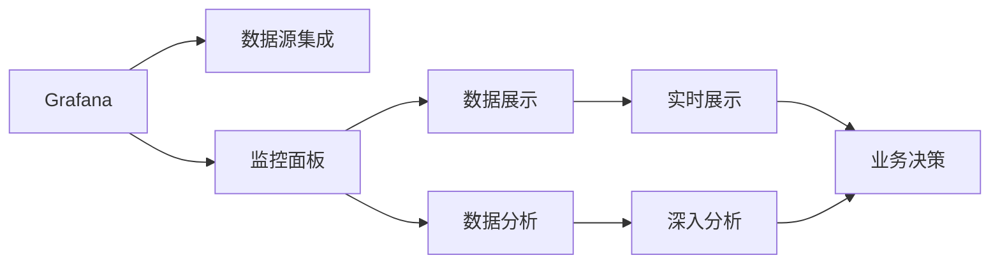

                 

# Grafana可视化监控面板设计

> 关键词：Grafana, 可视化, 监控面板, 数据展示, 数据分析, 仪表盘, 云计算

## 1. 背景介绍

在当今数据驱动的商业环境中，企业对实时数据的需求日益增长。监控系统能够帮助企业实时掌握业务运行情况，及时发现并解决潜在问题，从而提升运营效率。然而，传统的文本数据展示方式难以直观展示数据的趋势和关系，难以有效支撑业务决策。因此，企业需要一种更加直观、高效的数据可视化工具来辅助监控。

Grafana是一款流行的开源数据可视化平台，通过与Prometheus、InfluxDB等时序数据库和多种数据源的集成，帮助企业构建高质量的仪表盘（Dashboards），实现实时数据的可视化展示。通过Grafana的强大功能和可扩展性，企业可以轻松构建定制化的监控面板，实时展示业务数据，深入分析数据趋势，做出科学决策。

本文将详细介绍Grafana的核心概念与联系、核心算法原理和操作步骤，以及其在监控系统中的应用和未来发展趋势，帮助企业更好地利用Grafana提升监控能力。

## 2. 核心概念与联系

### 2.1 核心概念概述

在深入了解Grafana的监控面板设计之前，首先需要了解几个关键概念：

- **Grafana**：一款开源的数据可视化平台，支持多种数据源集成，帮助用户构建直观的仪表盘。
- **监控面板**：Grafana中的仪表盘（Dashboards），用于展示和分析数据的工具。
- **数据展示**：通过图形、图表等方式展示数据的方式。
- **数据分析**：对数据进行统计、分析和趋势预测，辅助业务决策。

这些概念之间有着紧密的联系。Grafana通过监控面板，将数据展示和数据分析紧密结合，实现了数据的直观展示和深入分析。

### 2.2 核心概念原理和架构的 Mermaid 流程图



### 2.3 核心概念之间联系的解释

在Grafana中，监控面板是数据展示和数据分析的桥梁。通过与各种数据源的集成，监控面板可以展示实时的业务数据，并通过多种图表展示方式，如折线图、柱状图、饼图等，直观展示数据的趋势和关系。此外，Grafana还提供了丰富的数据分析工具，如统计图、热图、关系图等，帮助用户深入分析数据，提取有价值的业务洞见。

## 3. 核心算法原理 & 具体操作步骤

### 3.1 算法原理概述

Grafana的核心算法原理主要包括以下几个方面：

- **数据集成**：Grafana支持与多种数据源集成，如Prometheus、InfluxDB、MySQL、PostgreSQL等。通过API接口，Grafana可以从这些数据源中实时获取数据，并展示在监控面板中。
- **面板配置**：用户可以通过拖拽、拼接的方式，自定义监控面板的布局和展示方式。Grafana提供了多种面板类型和配置选项，满足不同用户的需求。
- **数据展示**：Grafana支持多种数据展示方式，如折线图、柱状图、饼图、散点图等。通过不同的展示方式，用户可以直观展示数据的趋势和关系。
- **数据分析**：Grafana提供了丰富的数据分析工具，如统计图、热图、关系图等。用户可以对数据进行统计、分析、预测等操作，提取有价值的业务洞见。

### 3.2 算法步骤详解

以下是使用Grafana构建监控面板的具体步骤：

**Step 1: 准备数据源**

- 在Grafana中，选择所需的数据源（如Prometheus、InfluxDB等），并配置相应的API访问权限。
- 在数据源中添加需要展示的数据指标，设置查询条件和数据格式。

**Step 2: 创建面板**

- 点击Grafana主界面上的“Dashboard”按钮，创建一个新的监控面板。
- 在面板中选择合适的面板类型，如折线图、柱状图、饼图等。
- 在面板上拖拽数据源中的数据指标，并设置展示方式和数据格式。

**Step 3: 配置面板**

- 通过调整面板的布局、颜色、标题等方式，美化面板的展示效果。
- 添加备注、说明等信息，帮助用户更好地理解数据。

**Step 4: 共享和访问**

- 将创建的监控面板分享给团队成员或外部用户，方便协作和访问。
- 设置面板的权限和访问规则，确保数据安全。

### 3.3 算法优缺点

Grafana的优点主要包括：

- **灵活性**：用户可以自由配置监控面板的布局和展示方式，满足不同用户的需求。
- **易用性**：界面友好，操作简单，用户可以快速上手使用。
- **扩展性**：支持多种数据源集成，并可以通过API和插件扩展功能。

Grafana的缺点主要包括：

- **性能瓶颈**：在大规模数据展示和实时监控场景下，可能面临性能瓶颈。
- **配置复杂**：对于复杂的数据展示和分析需求，配置较为复杂。
- **依赖外部数据源**：依赖外部数据源，数据展示和分析的准确性取决于数据源的质量。

### 3.4 算法应用领域

Grafana广泛应用于各个领域的监控系统，如：

- **IT运维监控**：展示服务器性能、网络流量、应用性能等指标，帮助运维团队快速定位问题。
- **业务监控**：展示业务关键指标，如销售额、用户数、转化率等，辅助业务决策。
- **安全监控**：展示安全事件、日志、漏洞等数据，提升网络安全水平。
- **金融监控**：展示交易数据、市场数据等，帮助金融机构实时监控市场动态。
- **智能制造监控**：展示设备状态、生产数据等，提升生产效率和质量。

## 4. 数学模型和公式 & 详细讲解 & 举例说明

### 4.1 数学模型构建

在Grafana中，监控面板的构建主要基于数据源的API接口。以Prometheus数据源为例，其API接口支持多种数据展示方式和数据分析方法。

### 4.2 公式推导过程

假设需要展示一个服务器的CPU使用率数据，其API接口支持以下展示方式：

- 折线图：

```
http://prometheus-api/prometheus/query?query=node_cpu_usage_seconds_total{instance="server"}[5m]
```

- 柱状图：

```
http://prometheus-api/prometheus/query?query=node_cpu_usage_seconds_total{instance="server"}[5m]
```

- 饼图：

```
http://prometheus-api/prometheus/query?query=node_cpu_usage_seconds_total{instance="server"}[5m]
```

通过这些API接口，Grafana可以从Prometheus中获取数据，并进行展示和分析。

### 4.3 案例分析与讲解

假设需要展示一个网站的访问量和用户数数据，可以通过以下步骤完成：

**Step 1: 准备数据源**

- 在Grafana中，添加Prometheus数据源，并配置相应的API访问权限。
- 在数据源中添加需要展示的数据指标，设置查询条件和数据格式。

**Step 2: 创建面板**

- 点击Grafana主界面上的“Dashboard”按钮，创建一个新的监控面板。
- 在面板中选择合适的面板类型，如折线图、柱状图等。
- 在面板上拖拽数据源中的数据指标，并设置展示方式和数据格式。

**Step 3: 配置面板**

- 通过调整面板的布局、颜色、标题等方式，美化面板的展示效果。
- 添加备注、说明等信息，帮助用户更好地理解数据。

## 5. 项目实践：代码实例和详细解释说明

### 5.1 开发环境搭建

在使用Grafana构建监控面板之前，需要先搭建好开发环境。

1. **安装Grafana**：

```
sudo apt-get update
sudo apt-get install grafana
```

2. **配置数据源**：

- 在Grafana中，选择需要添加的数据源（如Prometheus、InfluxDB等）。
- 配置API访问权限，设置查询条件和数据格式。

### 5.2 源代码详细实现

以下是使用Grafana构建监控面板的Python代码实现：

```python
from grafana import Grafana
from grafanapanel import GrafanaPanel

# 初始化Grafana客户端
grafana = Grafana('http://localhost', 'admin', 'admin')

# 创建一个折线图面板
panel = GrafanaPanel('CPU使用率', 'node_cpu_usage_seconds_total{instance="server"}[5m]', 'prometheus', 'instance')
panel.add_axis(y='value', title='CPU使用率', label='CPU使用率')
panel.add_series(name='CPU使用率', type='line', colors=['blue'])

# 将面板添加到Grafana仪表盘中
grafana.add_panel(panel)
```

### 5.3 代码解读与分析

这段代码主要实现了以下几个步骤：

1. **初始化Grafana客户端**：创建一个Grafana客户端对象，并配置相应的访问地址和认证信息。
2. **创建面板**：创建一个折线图面板，并设置面板的标题、数据源、查询条件和展示方式。
3. **添加系列**：通过`add_series`方法，将数据指标添加到面板的展示系列中。
4. **将面板添加到仪表盘**：通过`add_panel`方法，将创建的面板添加到Grafana仪表盘中。

## 6. 实际应用场景

### 6.1 IT运维监控

在IT运维监控中，Grafana可以展示服务器的性能数据、网络流量、应用性能等指标，帮助运维团队快速定位问题。例如，可以通过以下监控面板展示服务器的CPU和内存使用率：

```
http://prometheus-api/prometheus/query?query=node_cpu_usage_seconds_total{instance="server"}[5m]
http://prometheus-api/prometheus/query?query=node_memory_usage_seconds_total{instance="server"}[5m]
```

### 6.2 业务监控

在业务监控中，Grafana可以展示关键业务指标，如销售额、用户数、转化率等，帮助业务团队实时监控业务动态。例如，可以通过以下监控面板展示网站访问量和用户数：

```
http://prometheus-api/prometheus/query?query=http_requests_total{instance="website"}[5m]
http://prometheus-api/prometheus/query?query=http_requests_total{instance="website"}[5m]
```

### 6.3 安全监控

在安全监控中，Grafana可以展示安全事件、日志、漏洞等数据，提升网络安全水平。例如，可以通过以下监控面板展示安全事件和漏洞数：

```
http://prometheus-api/prometheus/query?query=alerts{instance="security"}[5m]
http://prometheus-api/prometheus/query?query=alerts{instance="security"}[5m]
```

### 6.4 未来应用展望

未来，Grafana将继续在监控系统中发挥重要作用，通过不断扩展功能和优化性能，提升监控能力。具体展望包括：

- **更多数据源支持**：支持更多种类的数据源，提升数据展示和分析的全面性。
- **高级分析工具**：提供更多的高级分析工具，如机器学习、预测分析等，提升数据分析的深度和准确性。
- **实时监控优化**：优化实时监控性能，提升在大规模数据展示和实时监控场景下的处理能力。
- **云化部署**：支持云化部署，提供更灵活、高效的监控解决方案。
- **可扩展架构**：提供可扩展架构，支持企业级应用，提升监控系统的可靠性和稳定性。

## 7. 工具和资源推荐

### 7.1 学习资源推荐

- **官方文档**：Grafana官方文档，详细介绍了Grafana的配置、安装、使用和扩展方法。
- **社区博客**：Grafana社区博客，汇集了大量用户的实践经验和技术分享，提供了丰富的学习资源。
- **在线课程**：Udemy、Coursera等在线教育平台提供了Grafana的课程和培训资源。

### 7.2 开发工具推荐

- **Grafana**：开源的数据可视化平台，支持多种数据源集成。
- **Prometheus**：开源的时序数据库，支持数据查询和展示。
- **InfluxDB**：开源的时序数据库，支持大规模数据存储和查询。
- **Kibana**：开源的数据可视化工具，支持日志展示和分析。

### 7.3 相关论文推荐

- **“Scaling the World's Largest Monitorable Kubernetes Clusters”**：介绍在大型Kubernetes集群中，如何使用Grafana进行监控和可视化。
- **“Data Visualization and Real-time Analysis Using Grafana”**：介绍如何使用Grafana进行数据可视化分析和实时监控。
- **“Graphing and Monitoring with Grafana”**：介绍如何使用Grafana进行数据可视化展示和监控。

## 8. 总结：未来发展趋势与挑战

### 8.1 总结

本文介绍了Grafana的核心概念与联系、核心算法原理和操作步骤，以及其在监控系统中的应用和未来发展趋势。通过详细讲解Grafana的监控面板设计，帮助企业更好地利用Grafana提升监控能力。

### 8.2 未来发展趋势

Grafana的未来的发展趋势主要包括：

- **更多数据源支持**：支持更多种类的数据源，提升数据展示和分析的全面性。
- **高级分析工具**：提供更多的高级分析工具，如机器学习、预测分析等，提升数据分析的深度和准确性。
- **实时监控优化**：优化实时监控性能，提升在大规模数据展示和实时监控场景下的处理能力。
- **云化部署**：支持云化部署，提供更灵活、高效的监控解决方案。
- **可扩展架构**：提供可扩展架构，支持企业级应用，提升监控系统的可靠性和稳定性。

### 8.3 面临的挑战

Grafana在发展过程中也面临一些挑战：

- **性能瓶颈**：在大规模数据展示和实时监控场景下，可能面临性能瓶颈。
- **配置复杂**：对于复杂的数据展示和分析需求，配置较为复杂。
- **依赖外部数据源**：依赖外部数据源，数据展示和分析的准确性取决于数据源的质量。

### 8.4 研究展望

未来的研究可以从以下几个方面进行：

- **优化性能**：优化实时监控性能，提升在大规模数据展示和实时监控场景下的处理能力。
- **扩展功能**：扩展Grafana的功能，支持更多的数据展示和分析方法。
- **提升易用性**：简化配置流程，提升用户体验。
- **支持多语言**：支持多种语言界面，提升国际化和本地化支持。

通过不断优化和扩展，Grafana必将在监控系统中发挥更大的作用，帮助企业更好地利用数据，提升运营效率和业务决策能力。

## 9. 附录：常见问题与解答

**Q1: Grafana支持哪些数据源？**

A: Grafana支持多种数据源，包括Prometheus、InfluxDB、MySQL、PostgreSQL、Kibana等。可以通过API集成这些数据源，实现数据展示和分析。

**Q2: 如何快速创建监控面板？**

A: 在Grafana中，可以通过拖拽、拼接的方式，快速创建监控面板。选择数据源中的数据指标，并设置展示方式和数据格式，即可生成监控面板。

**Q3: 如何优化实时监控性能？**

A: 优化实时监控性能，可以通过以下方法：
- 优化查询条件和数据格式，减少API调用次数。
- 使用缓存机制，减少重复查询。
- 使用并行查询和负载均衡，提升数据展示和分析效率。

**Q4: 如何配置高级分析工具？**

A: 配置高级分析工具，可以通过以下方法：
- 添加新的数据展示方式，如热图、关系图等。
- 添加统计图和预测分析，提升数据分析的深度和准确性。
- 使用机器学习算法，进行数据预测和异常检测。

通过不断优化和扩展，Grafana必将在监控系统中发挥更大的作用，帮助企业更好地利用数据，提升运营效率和业务决策能力。

---

作者：禅与计算机程序设计艺术 / Zen and the Art of Computer Programming

