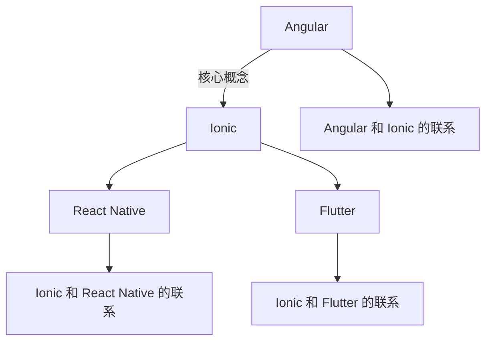

                 

# Ionic 框架优势：基于 Angular 的移动应用开发

> 关键词：Ionic, Angular, Web 开发, 移动应用, 跨平台开发, React Native, Flutter, Progressive Web Apps

## 1. 背景介绍

在 Web 和移动应用的开发领域，出现了众多框架和库，其中不乏一些非常流行的框架，如 React Native、Flutter、Ionic 等。这些框架的出现极大地提升了开发者效率，使开发者可以在不同的平台下快速构建高质量的移动应用。但不同的框架有着不同的设计理念和优势，本文将重点介绍基于 Angular 的移动应用开发框架 Ionic，并探讨其与 React Native、Flutter 等主流框架的优劣。

## 2. 核心概念与联系

### 2.1 核心概念概述

#### 2.1.1 Angular
Angular 是一个由 Google 推出的前端框架，它具有强大的模板引擎、组件化设计、依赖注入等功能。Angular 的使用可以帮助开发者构建出可维护、可扩展的前端应用。

#### 2.1.2 Ionic
Ionic 是基于 Angular 构建的跨平台移动应用开发框架，它允许开发者使用 Web 技术（如 HTML、CSS、JavaScript）来构建原生级别的移动应用。Ionic 的设计理念是“前端即服务”，即开发者使用 Web 技术来构建跨平台的应用。

#### 2.1.3 React Native 和 Flutter
React Native 是 Facebook 开发的一个框架，它允许开发者使用 JavaScript 和 React 构建原生移动应用。而 Flutter 是由 Google 推出的移动开发框架，它允许开发者使用 Dart 语言构建原生的 iOS 和 Android 应用。

### 2.2 核心概念原理和架构的 Mermaid 流程图



### 2.3 核心概念原理和架构的详细说明

#### 2.3.1 Angular
Angular 的核心架构包含以下几个关键组件：
- 组件和模板：Angular 通过组件化设计来组织应用的逻辑和视图。组件是一个具有状态的函数式组件，它能够根据输入参数进行渲染。模板则提供了一个声明式的语法来定义组件的视图。
- 依赖注入：Angular 通过依赖注入实现了组件之间的解耦合。依赖注入允许组件自动获取所需的依赖项，而无需显式声明。
- TypeScript：Angular 使用 TypeScript 作为其语言。TypeScript 提供了静态类型检查和强类型系统，使代码更加安全、可维护。

#### 2.3.2 Ionic
Ionic 构建于 Angular 之上，它提供了以下关键功能：
- 移动组件库：Ionic 提供了大量的移动组件，如导航栏、列表、对话框等，这些组件可以帮助开发者快速构建出美观、响应式的移动应用。
- 跨平台支持：Ionic 通过 Web 技术构建跨平台应用，开发者只需要编写一次代码，就可以生成 iOS 和 Android 的原生应用。
- 前端即服务：Ionic 强调前端即服务的理念，这意味着开发者可以完全使用 Web 技术来构建应用，无需考虑任何平台特定的代码。

#### 2.3.3 React Native 和 Flutter
React Native 和 Flutter 的核心架构也包含以下几个关键组件：
- 组件和布局：React Native 和 Flutter 通过组件来组织应用的逻辑和视图。组件是一个具有状态的函数式组件，它能够根据输入参数进行渲染。布局则提供了一种声明式的语法来定义组件的布局。
- 热重载：React Native 和 Flutter 都支持热重载，这意味着开发者可以实时预览应用的更改，无需每次都进行完整的构建和编译。
- 原生模块：React Native 和 Flutter 通过原生模块来调用设备的功能，如相机、地理位置等。这些模块可以帮助开发者实现更多复杂的原生功能。

## 3. 核心算法原理 & 具体操作步骤

### 3.1 算法原理概述

#### 3.1.1 算法概述
Ionic 框架的核心算法是基于 Angular 的组件化设计和 Web 技术构建跨平台应用。其核心算法包括以下几个关键步骤：
- 组件化设计：Ionic 将应用分解为多个组件，每个组件都是一个具有状态的函数式组件。通过组件化设计，开发者可以将应用的逻辑和视图分离，提升代码的可维护性。
- Web 技术构建应用：Ionic 使用 Web 技术（如 HTML、CSS、JavaScript）来构建跨平台应用。这意味着开发者可以使用熟悉的 Web 技术来构建原生级别的应用。
- 跨平台支持：Ionic 提供了丰富的移动组件库和跨平台支持功能，帮助开发者快速构建出美观、响应式的移动应用。

#### 3.1.2 算法步骤详解
- 第一步：准备开发环境。开发者需要安装 Node.js、Angular CLI、Ionic CLI 等工具。
- 第二步：创建 Ionic 项目。使用 Ionic CLI 创建新的 Ionic 项目。
- 第三步：选择组件。开发者可以在 Ionic 组件库中选择合适的组件，并将其添加到应用中。
- 第四步：编写代码。开发者使用 Web 技术（如 HTML、CSS、JavaScript）来编写应用代码。
- 第五步：构建应用。使用 Ionic CLI 构建应用，生成 iOS 和 Android 的原生应用。

#### 3.1.3 算法优缺点
Ionic 框架的优点包括：
- 可维护性好：组件化设计和 Web 技术使得代码更加可维护。
- 开发效率高：使用 Web 技术构建跨平台应用，可以大幅度提升开发效率。
- 跨平台支持：Ionic 提供了丰富的移动组件库和跨平台支持功能，帮助开发者快速构建出美观、响应式的移动应用。

Ionic 框架的缺点包括：
- 性能较低：由于使用了 Web 技术，Ionic 应用的性能可能不如原生应用。
- 功能受限：Ionic 提供的移动组件库可能无法满足所有需求。
- 学习成本高：开发者需要同时掌握 Angular 和 Ionic 知识。

#### 3.1.4 算法应用领域
Ionic 框架广泛应用于以下领域：
- 企业级应用：Ionic 可以帮助企业快速构建跨平台的企业级应用。
- 移动应用：Ionic 可以用于构建各种类型的移动应用，如电商、社交、游戏等。
- Progressive Web Apps：Ionic 也可以用于构建渐进式 Web 应用，使 Web 应用具备原生应用的特性。

## 4. 数学模型和公式 & 详细讲解 & 举例说明

### 4.1 数学模型构建
Ionic 框架的数学模型构建主要包括以下几个关键步骤：
- 组件化设计：Ionic 将应用分解为多个组件，每个组件都是一个具有状态的函数式组件。
- Web 技术构建应用：Ionic 使用 Web 技术（如 HTML、CSS、JavaScript）来构建跨平台应用。
- 跨平台支持：Ionic 提供了丰富的移动组件库和跨平台支持功能，帮助开发者快速构建出美观、响应式的移动应用。

### 4.2 公式推导过程
由于 Ionic 框架主要关注于组件化设计和 Web 技术构建跨平台应用，因此其数学模型构建并不复杂。其核心数学模型主要涉及组件的创建、组件的调用、组件的渲染等方面。

### 4.3 案例分析与讲解
下面以 Ionic 框架中的导航栏为例，讲解其数学模型和公式推导过程。

导航栏是 Ionic 中一个常用的组件，它可以帮助开发者实现应用的导航功能。导航栏的数学模型可以表示为：
- 导航栏是一个组件，它包含一个标题和一个菜单项列表。
- 导航栏的标题和菜单项列表通过 Web 技术（如 HTML、CSS、JavaScript）来实现。

导航栏的数学模型公式可以表示为：
- 导航栏 = 标题 + 菜单项列表

导航栏的渲染过程如下：
- 开发者在 HTML 中定义导航栏的元素结构。
- 使用 CSS 定义导航栏的样式。
- 使用 JavaScript 定义导航栏的行为逻辑。
- 导航栏渲染后，展示在页面上。

## 5. 项目实践：代码实例和详细解释说明

### 5.1 开发环境搭建
开发者需要安装以下工具：
- Node.js：用于运行 JavaScript 代码。
- Angular CLI：用于创建 Angular 项目。
- Ionic CLI：用于创建 Ionic 项目。
- 搭建开发环境：开发者需要在本地搭建开发环境，包括安装 Node.js、Angular CLI、Ionic CLI 等工具。

### 5.2 源代码详细实现
以下是一个简单的 Ionic 项目的源代码实现：

```javascript
import { Component } from '@angular/core';
import { HttpClient } from '@angular/common/http';
import { List } from '../list';

@Component({
  selector: 'app-home',
  template: `
    <h1>Ionic App</h1>
    <ion-content>
      <ion-list>
        <ion-item *ngFor="let item of list">
          {{ item.name }}
        </ion-item>
      </ion-list>
    </ion-content>
  `,
  styles: []
})
export class HomeComponent {
  list: List[] = [];

  constructor(private http: HttpClient) {}

  ngOnInit() {
    this.http.get<List[]>('https://example.com/api/list')
      .subscribe(data => this.list = data);
  }
}
```

### 5.3 代码解读与分析
在上述代码中，我们使用了 Ionic 框架中的 `ion-content` 和 `ion-list` 组件来构建应用的视图。同时，我们使用了 `http` 模块来进行数据请求，并使用 `List` 类来表示数据结构。

### 5.4 运行结果展示
运行上述代码后，会在应用的页面中展示一个列表，其中包含了从远程服务器获取的数据。

## 6. 实际应用场景

### 6.1 企业级应用
Ionic 框架可以用于构建企业级应用。例如，一个企业可以使用 Ionic 框架构建一个内部的企业管理系统，该系统可以帮助员工进行任务管理、项目管理、考勤管理等。

### 6.2 移动应用
Ionic 框架可以用于构建各种类型的移动应用。例如，一个电商企业可以使用 Ionic 框架构建一个移动应用，该应用可以帮助客户进行商品浏览、购物车管理、订单查询等。

### 6.3 Progressive Web Apps
Ionic 框架也可以用于构建渐进式 Web 应用。例如，一个新闻网站可以使用 Ionic 框架构建一个渐进式 Web 应用，该应用可以在网页上实现原生级别的功能，提升用户体验。

## 7. 工具和资源推荐

### 7.1 学习资源推荐
- Angular 官方文档：Angular 的官方文档是学习 Angular 的最佳资源。
- Ionic 官方文档：Ionic 的官方文档提供了详细的 API 文档和开发指南。
- Ionic 社区：Ionic 社区提供了大量的开发资源和社区支持。

### 7.2 开发工具推荐
- Visual Studio Code：Visual Studio Code 是开发者常用的编辑器，支持 Ionic 开发。
- IntelliJ IDEA：IntelliJ IDEA 是开发者常用的 IDE，支持 Ionic 开发。

### 7.3 相关论文推荐
- Angular 和 Ionic 的开发实践：探讨 Angular 和 Ionic 的开发实践，提供丰富的开发资源和最佳实践。
- Ionic 框架的优势与劣势：分析 Ionic 框架的优势与劣势，帮助开发者选择最适合的开发框架。

## 8. 总结：未来发展趋势与挑战

### 8.1 研究成果总结
Ionic 框架是基于 Angular 构建的跨平台移动应用开发框架，其核心算法涉及组件化设计和 Web 技术构建应用。Ionic 框架的优点包括可维护性好、开发效率高、跨平台支持等。Ionic 框架的缺点包括性能较低、功能受限、学习成本高等。

### 8.2 未来发展趋势
Ionic 框架未来的发展趋势包括：
- 性能提升：Ionic 框架将继续优化性能，提升应用的响应速度和流畅度。
- 功能增强：Ionic 框架将增加更多的组件和功能，满足更多的需求。
- 社区支持：Ionic 社区将提供更多的开发资源和支持，帮助开发者更好地使用 Ionic 框架。

### 8.3 面临的挑战
Ionic 框架面临的挑战包括：
- 性能问题：Ionic 框架需要优化性能，提升应用的响应速度和流畅度。
- 组件库更新：Ionic 框架需要及时更新组件库，以满足更多的需求。
- 学习成本：Ionic 框架需要降低学习成本，使开发者更容易上手。

### 8.4 研究展望
Ionic 框架未来的研究展望包括：
- 性能优化：优化性能，提升应用的响应速度和流畅度。
- 组件增强：增加更多的组件和功能，满足更多的需求。
- 社区建设：建设更强大的社区支持，提供更多的开发资源和支持。

## 9. 附录：常见问题与解答

**Q1: Angular 和 Ionic 的区别是什么？**

A: Angular 是一个前端框架，主要用于构建 Web 应用。Ionic 是一个基于 Angular 的跨平台移动应用开发框架，用于构建移动应用。

**Q2: Ionic 的优势是什么？**

A: Ionic 的优势包括：
- 可维护性好：组件化设计和 Web 技术使得代码更加可维护。
- 开发效率高：使用 Web 技术构建跨平台应用，可以大幅度提升开发效率。
- 跨平台支持：Ionic 提供了丰富的移动组件库和跨平台支持功能，帮助开发者快速构建出美观、响应式的移动应用。

**Q3: Ionic 的缺点是什么？**

A: Ionic 的缺点包括：
- 性能较低：由于使用了 Web 技术，Ionic 应用的性能可能不如原生应用。
- 功能受限：Ionic 提供的移动组件库可能无法满足所有需求。
- 学习成本高：开发者需要同时掌握 Angular 和 Ionic 知识。

**Q4: 如何优化 Ionic 应用的性能？**

A: 优化 Ionic 应用的性能可以采取以下措施：
- 使用 Webpack 优化代码：使用 Webpack 工具对代码进行压缩和优化，提升应用的加载速度。
- 使用懒加载：使用懒加载技术，只加载当前页面所需的组件和资源，提升应用的响应速度。
- 使用缓存：使用缓存技术，缓存应用的静态资源，提升应用的加载速度。

**Q5: 如何学习 Ionic 框架？**

A: 学习 Ionic 框架可以采取以下措施：
- 阅读 Ionic 官方文档：Ionic 的官方文档提供了详细的 API 文档和开发指南。
- 参考示例代码：参考 Ionic 社区提供的示例代码，学习 Ionic 框架的使用。
- 加入 Ionic 社区：加入 Ionic 社区，获取更多的开发资源和支持。

---

作者：禅与计算机程序设计艺术 / Zen and the Art of Computer Programming

