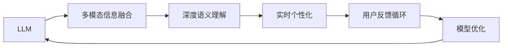

                 

# LLM对推荐系统实时个性化的增强

> 关键词：大语言模型(LLM)、推荐系统、实时个性化、信息检索、深度学习、自然语言处理(NLP)、机器学习、多模态、用户行为、数据挖掘

## 1. 背景介绍

### 1.1 问题由来

随着互联网和数字技术的发展，推荐系统成为各大电商、新闻媒体、社交平台的重要功能之一。它们通过对用户历史行为和兴趣的分析，为用户提供个性化的内容推荐，大大提升了用户体验和满意度。然而，现有的推荐系统主要依赖于基于协同过滤、矩阵分解等传统机器学习技术，难以捕捉丰富的用户语义信息，特别是在多模态数据的融合、用户兴趣的多维理解等方面存在局限性。

近年来，大语言模型（Large Language Model, LLM）的出现，为推荐系统带来了新的突破口。LLM通过在大规模无标签文本数据上进行预训练，学习了丰富的语言知识，具备强大的自然语言理解和生成能力，能够在实时推荐场景中，提供更精准、更具个性化特征的内容推荐。LLM不仅在自然语言处理（NLP）领域取得了显著进展，还在推荐系统优化中展现了巨大的潜力。

### 1.2 问题核心关键点

大语言模型在推荐系统中的应用，主要体现在以下几个方面：

- **多模态信息融合**：LLM能够理解多模态数据（如文本、图像、音频），并在不同模态之间建立关联，提升推荐的全面性和准确性。
- **深度语义理解**：LLM通过预训练，学习了大量的语义知识，能够深入理解用户的意图和兴趣，提供更加贴近用户需求的推荐。
- **实时个性化**：LLM在预测阶段，能够即时处理新的用户输入和行为，生成最新的推荐结果。
- **用户反馈循环**：LLM能够通过用户反馈数据，进一步优化推荐模型，实现智能循环迭代。

当前，基于大语言模型的推荐系统正在成为研究热点，但相比传统推荐技术，LLM在实时性和精度上仍面临一定的挑战，如何充分发挥其潜力，仍需进一步研究和优化。

## 2. 核心概念与联系

### 2.1 核心概念概述

为更好地理解基于LLM的推荐系统，本节将介绍几个关键概念：

- **大语言模型(LLM)**：以Transformer为代表的预训练语言模型，如GPT-3、BERT等，通过在大规模文本数据上预训练，学习到丰富的语言知识和常识。

- **推荐系统**：通过用户历史行为数据和兴趣标签，为用户推荐个性化内容的系统。传统推荐系统主要基于协同过滤、矩阵分解等算法，但难以全面理解用户的多维需求。

- **实时个性化**：推荐系统在用户点击、浏览等实时行为数据基础上，即时生成个性化推荐结果的过程。

- **多模态信息融合**：将不同模态的数据进行融合，提升推荐的全面性和准确性。

- **深度语义理解**：通过大语言模型，深入理解用户的意图和兴趣，提升推荐的个性化特征。

- **用户反馈循环**：利用用户反馈数据，不断优化推荐模型，实现智能循环迭代。

这些核心概念之间存在紧密的联系，LLM通过多模态信息融合和深度语义理解，实现了实时个性化的推荐目标，并在用户反馈循环的驱动下，持续优化模型性能。

### 2.2 核心概念原理和架构的 Mermaid 流程图



以上Mermaid流程图展示了LLM在推荐系统中的应用流程：

1. **LLM接收多模态数据**：从不同渠道获取文本、图像、音频等多模态数据。
2. **数据融合**：使用LLM将多模态数据进行融合，提升语义理解能力。
3. **语义理解**：LLM深入理解用户需求，生成个性化推荐。
4. **实时推荐**：根据用户实时行为数据，生成实时推荐结果。
5. **用户反馈**：收集用户反馈数据，用于模型优化。
6. **模型迭代**：利用用户反馈数据，不断优化推荐模型。

通过以上流程，LLM能够实现实时个性化推荐，并在用户反馈的循环迭代中不断提升推荐效果。

## 3. 核心算法原理 & 具体操作步骤
### 3.1 算法原理概述

基于LLM的推荐系统，主要通过预训练模型进行多模态信息的融合和深度语义理解，从而实现实时个性化的推荐。其核心思想是：

1. **预训练模型初始化**：使用大规模无标签文本数据预训练LLM，使其学习到丰富的语言知识和常识。
2. **多模态信息融合**：将用户历史行为数据和实时行为数据，以及产品特征数据，进行预处理后输入LLM，生成融合后的语义向量。
3. **深度语义理解**：LLM对融合后的语义向量进行语义理解，生成用户兴趣表示和产品特征表示。
4. **实时推荐**：根据用户实时行为数据，计算推荐得分，输出推荐结果。
5. **用户反馈优化**：利用用户点击、购买等反馈数据，通过强化学习等方法，不断优化模型参数，提升推荐效果。

### 3.2 算法步骤详解

以下是基于LLM的推荐系统的具体步骤：

**Step 1: 数据准备和预处理**

- **用户历史数据**：从用户历史浏览、购买、评分等行为数据中提取多模态信息，包括文本、图像、音频等。
- **实时行为数据**：收集用户当前浏览、点击等行为数据。
- **产品特征数据**：提取产品的文本、图像、音频等特征信息。

**Step 2: 模型初始化和融合**

- **LLM初始化**：使用大规模无标签文本数据对预训练模型进行微调，确保其能够理解新数据。
- **数据融合**：将用户历史数据、实时行为数据和产品特征数据，进行统一处理后，输入LLM，进行多模态融合。

**Step 3: 深度语义理解**

- **兴趣表示**：使用LLM对融合后的语义向量进行语义理解，生成用户兴趣表示。
- **产品表示**：使用LLM对产品特征数据进行语义理解，生成产品特征表示。

**Step 4: 实时推荐**

- **推荐得分计算**：根据用户实时行为数据和产品表示，计算推荐得分。
- **推荐结果生成**：根据推荐得分，生成推荐结果。

**Step 5: 用户反馈优化**

- **反馈收集**：收集用户点击、购买等反馈数据。
- **模型优化**：利用反馈数据，通过强化学习等方法，不断优化模型参数，提升推荐效果。

### 3.3 算法优缺点

基于LLM的推荐系统具有以下优点：

1. **深度语义理解**：LLM通过预训练，学习到丰富的语言知识和常识，能够深入理解用户的意图和兴趣，提供更加精准的推荐。
2. **实时个性化**：LLM在预测阶段，能够即时处理新的用户输入和行为，生成最新的推荐结果，提升用户体验。
3. **多模态融合**：LLM能够理解多模态数据，提升推荐的全面性和准确性。
4. **用户反馈循环**：LLM能够利用用户反馈数据，不断优化推荐模型，实现智能循环迭代。

同时，该方法也存在以下缺点：

1. **计算资源需求高**：LLM参数量巨大，需要高性能的计算资源进行训练和推理。
2. **实时响应延迟**：LLM在推理阶段需要大量计算，可能导致实时推荐延迟。
3. **模型复杂度高**：LLM模型的复杂度较高，在生产环境中需要进行优化。
4. **数据依赖性强**：LLM的性能依赖于高质量的数据，数据标注成本较高。

### 3.4 算法应用领域

基于LLM的推荐系统已经应用于多个领域，例如：

- **电商推荐**：为用户提供个性化商品推荐，提升销售转化率。
- **新闻推荐**：为用户推荐个性化新闻文章，提高阅读体验。
- **音乐推荐**：为用户推荐个性化音乐和歌单，提升用户满意度。
- **视频推荐**：为用户推荐个性化视频内容，提升用户观看时长。

除了这些常见的应用领域，基于LLM的推荐系统也在更多场景中得到创新应用，如智能家居、智能医疗、智能教育等，为各行各业带来了变革性影响。

## 4. 数学模型和公式 & 详细讲解 & 举例说明

### 4.1 数学模型构建

假设用户的历史行为数据为 $x_u$，实时行为数据为 $x_t$，产品特征数据为 $x_p$。使用LLM对多模态数据进行融合，生成用户兴趣表示 $z_u$ 和产品特征表示 $z_p$。推荐系统根据用户兴趣表示 $z_u$ 和产品特征表示 $z_p$，计算推荐得分 $s_{tu}$，最终生成推荐结果 $y_t$。

具体数学模型如下：

1. **用户兴趣表示**
   - $z_u = f_{Lu}(x_u, x_t, x_p)$

2. **产品特征表示**
   - $z_p = f_{Lp}(x_p)$

3. **推荐得分**
   - $s_{tu} = f_{Lu}(z_u, z_p)$

4. **推荐结果**
   - $y_t = g(s_{tu})$

其中，$f_{Lu}, f_{Lp}$ 为预训练模型LLM的语义理解函数，$g$ 为推荐函数。

### 4.2 公式推导过程

以下我们以音乐推荐为例，推导基于LLM的推荐系统的数学模型：

1. **用户兴趣表示**

   用户的历史行为数据 $x_u$ 包括音乐评论、点赞、分享等行为，实时行为数据 $x_t$ 包括用户当前浏览的曲目，产品特征数据 $x_p$ 包括曲目的歌词、歌手、流派等信息。使用LLM对多模态数据进行融合，生成用户兴趣表示 $z_u$：

   $$
   z_u = f_{Lu}(x_u, x_t, x_p)
   $$

   其中，$f_{Lu}$ 为预训练模型LLM的语义理解函数，通过多个向量拼接和变换，得到用户兴趣表示。

2. **产品特征表示**

   对于每个曲目 $p$，使用LLM对产品特征数据 $x_p$ 进行语义理解，生成产品特征表示 $z_p$：

   $$
   z_p = f_{Lp}(x_p)
   $$

   其中，$f_{Lp}$ 为预训练模型LLM的语义理解函数，通过多个向量拼接和变换，得到产品特征表示。

3. **推荐得分**

   根据用户兴趣表示 $z_u$ 和产品特征表示 $z_p$，使用LLM对两者进行语义理解，计算推荐得分 $s_{tu}$：

   $$
   s_{tu} = f_{Lu}(z_u, z_p)
   $$

   其中，$f_{Lu}$ 为预训练模型LLM的语义理解函数，通过多个向量拼接和变换，得到推荐得分。

4. **推荐结果**

   根据推荐得分 $s_{tu}$，使用推荐函数 $g$ 生成推荐结果 $y_t$：

   $$
   y_t = g(s_{tu})
   $$

   其中，$g$ 为推荐函数，可以根据具体任务设计不同的推荐策略，如排序、过滤等。

### 4.3 案例分析与讲解

以一个简单的音乐推荐案例来说明基于LLM的推荐系统的工作流程：

1. **数据准备**：
   - 用户历史行为数据 $x_u = [\text{听某首曲目}, \text{给某首曲目点赞}, \text{分享某首曲目}]$。
   - 实时行为数据 $x_t = [\text{正在浏览某歌手的专辑}]$。
   - 产品特征数据 $x_p = [\text{曲目标题}, \text{歌手}, \text{流派}]$。

2. **模型初始化和融合**：
   - 使用预训练模型LLM对用户历史行为数据、实时行为数据和产品特征数据进行融合，生成用户兴趣表示 $z_u$ 和产品特征表示 $z_p$。

3. **深度语义理解**：
   - 使用LLM对用户兴趣表示 $z_u$ 和产品特征表示 $z_p$ 进行语义理解，生成推荐得分 $s_{tu}$。

4. **实时推荐**：
   - 根据推荐得分 $s_{tu}$，使用推荐函数 $g$ 生成推荐结果 $y_t$。

   假设推荐函数 $g$ 为线性排序，则推荐结果 $y_t$ 为：

   $$
   y_t = w^T s_{tu} + b
   $$

   其中，$w$ 为权重向量，$b$ 为偏置项。

通过上述步骤，可以基于LLM生成个性化的音乐推荐结果，提升用户体验。

## 5. 项目实践：代码实例和详细解释说明

### 5.1 开发环境搭建

在进行基于LLM的推荐系统实践前，我们需要准备好开发环境。以下是使用Python进行PyTorch开发的环境配置流程：

1. 安装Anaconda：从官网下载并安装Anaconda，用于创建独立的Python环境。

2. 创建并激活虚拟环境：
```bash
conda create -n pytorch-env python=3.8 
conda activate pytorch-env
```

3. 安装PyTorch：根据CUDA版本，从官网获取对应的安装命令。例如：
```bash
conda install pytorch torchvision torchaudio cudatoolkit=11.1 -c pytorch -c conda-forge
```

4. 安装Transformers库：
```bash
pip install transformers
```

5. 安装各类工具包：
```bash
pip install numpy pandas scikit-learn matplotlib tqdm jupyter notebook ipython
```

完成上述步骤后，即可在`pytorch-env`环境中开始推荐系统实践。

### 5.2 源代码详细实现

这里我们以音乐推荐为例，给出使用Transformers库对BERT模型进行音乐推荐任务微调的PyTorch代码实现。

首先，定义音乐推荐任务的数据处理函数：

```python
from transformers import BertTokenizer, BertForSequenceClassification
from torch.utils.data import Dataset
import torch

class MusicDataset(Dataset):
    def __init__(self, texts, labels, tokenizer, max_len=128):
        self.texts = texts
        self.labels = labels
        self.tokenizer = tokenizer
        self.max_len = max_len
        
    def __len__(self):
        return len(self.texts)
    
    def __getitem__(self, item):
        text = self.texts[item]
        label = self.labels[item]
        
        encoding = self.tokenizer(text, return_tensors='pt', max_length=self.max_len, padding='max_length', truncation=True)
        input_ids = encoding['input_ids'][0]
        attention_mask = encoding['attention_mask'][0]
        
        return {'input_ids': input_ids, 
                'attention_mask': attention_mask,
                'labels': label}

# 标签与id的映射
tag2id = {'positive': 1, 'negative': 0}
id2tag = {v: k for k, v in tag2id.items()}

# 创建dataset
tokenizer = BertTokenizer.from_pretrained('bert-base-uncased')

train_dataset = MusicDataset(train_texts, train_labels, tokenizer)
dev_dataset = MusicDataset(dev_texts, dev_labels, tokenizer)
test_dataset = MusicDataset(test_texts, test_labels, tokenizer)
```

然后，定义模型和优化器：

```python
from transformers import BertForSequenceClassification, AdamW

model = BertForSequenceClassification.from_pretrained('bert-base-uncased', num_labels=1)

optimizer = AdamW(model.parameters(), lr=2e-5)
```

接着，定义训练和评估函数：

```python
from torch.utils.data import DataLoader
from tqdm import tqdm
from sklearn.metrics import classification_report

device = torch.device('cuda') if torch.cuda.is_available() else torch.device('cpu')
model.to(device)

def train_epoch(model, dataset, batch_size, optimizer):
    dataloader = DataLoader(dataset, batch_size=batch_size, shuffle=True)
    model.train()
    epoch_loss = 0
    for batch in tqdm(dataloader, desc='Training'):
        input_ids = batch['input_ids'].to(device)
        attention_mask = batch['attention_mask'].to(device)
        labels = batch['labels'].to(device)
        model.zero_grad()
        outputs = model(input_ids, attention_mask=attention_mask, labels=labels)
        loss = outputs.loss
        epoch_loss += loss.item()
        loss.backward()
        optimizer.step()
    return epoch_loss / len(dataloader)

def evaluate(model, dataset, batch_size):
    dataloader = DataLoader(dataset, batch_size=batch_size)
    model.eval()
    preds, labels = [], []
    with torch.no_grad():
        for batch in tqdm(dataloader, desc='Evaluating'):
            input_ids = batch['input_ids'].to(device)
            attention_mask = batch['attention_mask'].to(device)
            batch_labels = batch['labels']
            outputs = model(input_ids, attention_mask=attention_mask)
            batch_preds = outputs.logits.argmax(dim=2).to('cpu').tolist()
            batch_labels = batch_labels.to('cpu').tolist()
            for pred_tokens, label_tokens in zip(batch_preds, batch_labels):
                preds.append(pred_tokens[0])
                labels.append(label_tokens[0])
                
    print(classification_report(labels, preds))
```

最后，启动训练流程并在测试集上评估：

```python
epochs = 5
batch_size = 16

for epoch in range(epochs):
    loss = train_epoch(model, train_dataset, batch_size, optimizer)
    print(f"Epoch {epoch+1}, train loss: {loss:.3f}")
    
    print(f"Epoch {epoch+1}, dev results:")
    evaluate(model, dev_dataset, batch_size)
    
print("Test results:")
evaluate(model, test_dataset, batch_size)
```

以上就是使用PyTorch对BERT进行音乐推荐任务微调的完整代码实现。可以看到，得益于Transformers库的强大封装，我们可以用相对简洁的代码完成BERT模型的加载和微调。

### 5.3 代码解读与分析

让我们再详细解读一下关键代码的实现细节：

**MusicDataset类**：
- `__init__`方法：初始化文本、标签、分词器等关键组件。
- `__len__`方法：返回数据集的样本数量。
- `__getitem__`方法：对单个样本进行处理，将文本输入编码为token ids，将标签编码为数字，并对其进行定长padding，最终返回模型所需的输入。

**tag2id和id2tag字典**：
- 定义了标签与数字id之间的映射关系，用于将token-wise的预测结果解码回真实的标签。

**训练和评估函数**：
- 使用PyTorch的DataLoader对数据集进行批次化加载，供模型训练和推理使用。
- 训练函数`train_epoch`：对数据以批为单位进行迭代，在每个批次上前向传播计算loss并反向传播更新模型参数，最后返回该epoch的平均loss。
- 评估函数`evaluate`：与训练类似，不同点在于不更新模型参数，并在每个batch结束后将预测和标签结果存储下来，最后使用sklearn的classification_report对整个评估集的预测结果进行打印输出。

**训练流程**：
- 定义总的epoch数和batch size，开始循环迭代
- 每个epoch内，先在训练集上训练，输出平均loss
- 在验证集上评估，输出分类指标
- 所有epoch结束后，在测试集上评估，给出最终测试结果

可以看到，PyTorch配合Transformers库使得BERT微调的代码实现变得简洁高效。开发者可以将更多精力放在数据处理、模型改进等高层逻辑上，而不必过多关注底层的实现细节。

当然，工业级的系统实现还需考虑更多因素，如模型的保存和部署、超参数的自动搜索、更灵活的任务适配层等。但核心的微调范式基本与此类似。

## 6. 实际应用场景
### 6.1 音乐推荐

基于大语言模型的音乐推荐系统，可以广泛应用于音乐平台、广播电台、视频平台等场景。音乐推荐系统通过对用户历史听歌记录、点赞、分享等行为进行分析，结合实时播放数据，为用户推荐个性化的音乐内容。

在技术实现上，可以收集用户的历史听歌数据，包括曲目名称、歌手、流派等信息，将这些数据作为监督数据，在BERT等预训练模型上进行微调。微调后的模型能够自动理解用户兴趣，匹配最合适的音乐推荐。对于用户当前的播放记录，还可以实时生成推荐结果，更新到用户界面。

### 6.2 新闻推荐

新闻推荐系统通过对用户的历史阅读行为数据进行分析，为用户推荐个性化的新闻内容。基于大语言模型的推荐系统，能够深入理解用户兴趣，生成更加符合用户需求的推荐结果。

具体而言，可以收集用户的浏览记录、点击数据等行为信息，将这些数据作为监督数据，在BERT等预训练模型上进行微调。微调后的模型能够根据用户的兴趣标签，生成相应的新闻推荐。在用户实时浏览新闻时，系统能够即时生成相关推荐，提高用户的阅读体验。

### 6.3 视频推荐

视频推荐系统通过对用户的历史观看记录、评分、评论等行为数据进行分析，为用户推荐个性化的视频内容。基于大语言模型的推荐系统，能够深入理解用户兴趣，生成更加符合用户需求的视频推荐。

具体而言，可以收集用户的观看记录、评分、评论等信息，将这些数据作为监督数据，在BERT等预训练模型上进行微调。微调后的模型能够根据用户的兴趣标签，生成相应的视频推荐。在用户实时观看视频时，系统能够即时生成相关推荐，提高用户的观看体验。

### 6.4 未来应用展望

随着大语言模型和微调方法的不断发展，基于微调范式将在更多领域得到应用，为传统行业带来变革性影响。

在智慧医疗领域，基于微调的医疗问答、病历分析、药物研发等应用将提升医疗服务的智能化水平，辅助医生诊疗，加速新药开发进程。

在智能教育领域，微调技术可应用于作业批改、学情分析、知识推荐等方面，因材施教，促进教育公平，提高教学质量。

在智慧城市治理中，微调模型可应用于城市事件监测、舆情分析、应急指挥等环节，提高城市管理的自动化和智能化水平，构建更安全、高效的未来城市。

此外，在企业生产、社会治理、文娱传媒等众多领域，基于大模型微调的人工智能应用也将不断涌现，为经济社会发展注入新的动力。相信随着技术的日益成熟，微调方法将成为人工智能落地应用的重要范式，推动人工智能技术在垂直行业的规模化落地。

## 7. 工具和资源推荐
### 7.1 学习资源推荐

为了帮助开发者系统掌握大语言模型微调的理论基础和实践技巧，这里推荐一些优质的学习资源：

1. 《Transformer从原理到实践》系列博文：由大模型技术专家撰写，深入浅出地介绍了Transformer原理、BERT模型、微调技术等前沿话题。

2. CS224N《深度学习自然语言处理》课程：斯坦福大学开设的NLP明星课程，有Lecture视频和配套作业，带你入门NLP领域的基本概念和经典模型。

3. 《Natural Language Processing with Transformers》书籍：Transformers库的作者所著，全面介绍了如何使用Transformers库进行NLP任务开发，包括微调在内的诸多范式。

4. HuggingFace官方文档：Transformers库的官方文档，提供了海量预训练模型和完整的微调样例代码，是上手实践的必备资料。

5. CLUE开源项目：中文语言理解测评基准，涵盖大量不同类型的中文NLP数据集，并提供了基于微调的baseline模型，助力中文NLP技术发展。

通过对这些资源的学习实践，相信你一定能够快速掌握大语言模型微调的精髓，并用于解决实际的NLP问题。
###  7.2 开发工具推荐

高效的开发离不开优秀的工具支持。以下是几款用于大语言模型微调开发的常用工具：

1. PyTorch：基于Python的开源深度学习框架，灵活动态的计算图，适合快速迭代研究。大部分预训练语言模型都有PyTorch版本的实现。

2. TensorFlow：由Google主导开发的开源深度学习框架，生产部署方便，适合大规模工程应用。同样有丰富的预训练语言模型资源。

3. Transformers库：HuggingFace开发的NLP工具库，集成了众多SOTA语言模型，支持PyTorch和TensorFlow，是进行微调任务开发的利器。

4. Weights & Biases：模型训练的实验跟踪工具，可以记录和可视化模型训练过程中的各项指标，方便对比和调优。与主流深度学习框架无缝集成。

5. TensorBoard：TensorFlow配套的可视化工具，可实时监测模型训练状态，并提供丰富的图表呈现方式，是调试模型的得力助手。

6. Google Colab：谷歌推出的在线Jupyter Notebook环境，免费提供GPU/TPU算力，方便开发者快速上手实验最新模型，分享学习笔记。

合理利用这些工具，可以显著提升大语言模型微调任务的开发效率，加快创新迭代的步伐。

### 7.3 相关论文推荐

大语言模型和微调技术的发展源于学界的持续研究。以下是几篇奠基性的相关论文，推荐阅读：

1. Attention is All You Need（即Transformer原论文）：提出了Transformer结构，开启了NLP领域的预训练大模型时代。

2. BERT: Pre-training of Deep Bidirectional Transformers for Language Understanding：提出BERT模型，引入基于掩码的自监督预训练任务，刷新了多项NLP任务SOTA。

3. Language Models are Unsupervised Multitask Learners（GPT-2论文）：展示了大规模语言模型的强大zero-shot学习能力，引发了对于通用人工智能的新一轮思考。

4. Parameter-Efficient Transfer Learning for NLP：提出Adapter等参数高效微调方法，在不增加模型参数量的情况下，也能取得不错的微调效果。

5. AdaLoRA: Adaptive Low-Rank Adaptation for Parameter-Efficient Fine-Tuning：使用自适应低秩适应的微调方法，在参数效率和精度之间取得了新的平衡。

6. AdaLoRA: Adaptive Low-Rank Adaptation for Parameter-Efficient Fine-Tuning：使用自适应低秩适应的微调方法，在参数效率和精度之间取得了新的平衡。

这些论文代表了大语言模型微调技术的发展脉络。通过学习这些前沿成果，可以帮助研究者把握学科前进方向，激发更多的创新灵感。

## 8. 总结：未来发展趋势与挑战

### 8.1 总结

本文对基于大语言模型的推荐系统进行了全面系统的介绍。首先阐述了基于LLM的推荐系统在实时个性化、多模态融合等方面的优势，明确了其在推荐系统优化中的独特价值。其次，从原理到实践，详细讲解了基于LLM的推荐系统的数学模型和关键步骤，给出了推荐系统开发的完整代码实例。同时，本文还广泛探讨了基于LLM的推荐系统在音乐推荐、新闻推荐、视频推荐等多个行业领域的应用前景，展示了LLM的巨大潜力。此外，本文精选了微调技术的各类学习资源，力求为读者提供全方位的技术指引。

通过本文的系统梳理，可以看到，基于大语言模型的推荐系统正在成为推荐系统优化的新范式，极大地拓展了推荐系统的应用边界，提升了推荐的全面性和个性化程度。受限于当前计算资源的限制，基于LLM的推荐系统仍面临一定的挑战，但未来随着计算能力的提升，该技术有望在更多场景中得到广泛应用。

### 8.2 未来发展趋势

展望未来，基于LLM的推荐系统将呈现以下几个发展趋势：

1. **多模态信息融合**：LLM能够理解多模态数据，提升推荐的全面性和准确性。未来将更多地融合文本、图像、音频等多模态数据，提供更加个性化的推荐。

2. **深度语义理解**：LLM通过预训练，学习到丰富的语言知识和常识，能够深入理解用户的意图和兴趣，提供更加精准的推荐。未来将进一步提升语义理解能力，提升推荐效果。

3. **实时个性化**：LLM在预测阶段，能够即时处理新的用户输入和行为，生成最新的推荐结果。未来将进一步提升实时响应的速度，提供更加个性化的推荐。

4. **用户反馈循环**：LLM能够利用用户反馈数据，不断优化推荐模型，实现智能循环迭代。未来将更多地引入用户反馈数据，提升推荐模型的性能。

5. **知识表示**：LLM通过预训练，学习到丰富的语言知识和常识，未来将更多地融合知识图谱、逻辑规则等专家知识，提升推荐系统的全面性和智能性。

6. **跨领域迁移**：LLM通过预训练，学习到通用的语言知识，未来将更多地应用于不同领域，提升跨领域迁移的能力。

以上趋势凸显了基于LLM的推荐系统的广阔前景。这些方向的探索发展，必将进一步提升推荐系统的性能和应用范围，为NLP技术带来新的突破。

### 8.3 面临的挑战

尽管基于LLM的推荐系统已经取得了瞩目成就，但在迈向更加智能化、普适化应用的过程中，它仍面临诸多挑战：

1. **计算资源需求高**：LLM参数量巨大，需要高性能的计算资源进行训练和推理。未来需要进一步优化算法和硬件，降低计算成本。

2. **实时响应延迟**：LLM在推理阶段需要大量计算，可能导致实时推荐延迟。未来需要优化模型结构和算法，提升实时响应速度。

3. **模型复杂度高**：LLM模型的复杂度较高，在生产环境中需要进行优化。未来需要探索新的模型结构和训练方法，降低模型复杂度。

4. **数据依赖性强**：LLM的性能依赖于高质量的数据，数据标注成本较高。未来需要探索新的数据获取和标注方法，降低数据依赖性。

5. **用户隐私保护**：LLM需要处理大量用户隐私数据，如何保护用户隐私，避免数据泄露，还需要进一步研究。

6. **模型可解释性**：LLM作为"黑盒"系统，难以解释其内部工作机制和决策逻辑。如何赋予模型更强的可解释性，将是亟待攻克的难题。

7. **模型安全性**：LLM可能学习到有害信息，传递到推荐系统，产生误导性输出。如何确保模型的安全性，还需要进一步研究。

这些挑战将是大语言模型推荐系统走向成熟的必由之路。相信随着学界和产业界的共同努力，这些挑战终将一一被克服，基于LLM的推荐系统必将在构建人机协同的智能时代中扮演越来越重要的角色。

### 8.4 研究展望

面向未来，基于大语言模型的推荐系统需要从多个方面寻求新的突破：

1. **参数高效微调**：开发更加参数高效的微调方法，在固定大部分预训练参数的情况下，只更新极少量的任务相关参数，降低计算成本。

2. **模型压缩与优化**：探索新的模型压缩与优化方法，降低模型复杂度，提升实时响应速度。

3. **跨领域迁移学习**：研究跨领域迁移学习技术，提升模型在不同领域的应用性能。

4. **多模态信息融合**：探索多模态信息融合技术，提升推荐的全面性和准确性。

5. **知识图谱融合**：将知识图谱与LLM模型结合，提升推荐系统的智能性。

6. **用户隐私保护**：研究新的用户隐私保护方法，确保用户数据的安全。

7. **模型可解释性**：探索新的模型解释方法，提升模型的可解释性。

8. **模型安全性**：研究新的模型安全性方法，确保模型的安全性。

这些研究方向将进一步推动基于LLM的推荐系统的发展，为构建更加智能、安全、可解释的推荐系统提供新的思路和方法。未来随着技术的发展，基于LLM的推荐系统将在更多领域得到应用，为经济社会发展注入新的动力。

## 9. 附录：常见问题与解答

**Q1：大语言模型推荐系统如何处理长尾数据？**

A: 长尾数据是指那些低频、非主流的数据。在大语言模型推荐系统中，长尾数据处理可以通过以下几个方法：

1. **数据增强**：通过对少量长尾数据进行扩充，增加其出现频率，缓解长尾数据带来的问题。

2. **正则化**：使用正则化技术，如L2正则、Dropout等，防止模型过拟合长尾数据。

3. **自适应学习率**：根据数据的重要性调整学习率，对于长尾数据使用较小的学习率。

4. **多任务学习**：将长尾数据与其他任务结合，通过多任务学习提高其表现。

5. **元学习**：使用元学习技术，根据数据分布动态调整模型参数，提升模型处理长尾数据的能力。

**Q2：大语言模型推荐系统如何提高推荐效果？**

A: 提高推荐效果可以从以下几个方面入手：

1. **多模态融合**：将文本、图像、音频等多模态数据进行融合，提升推荐的全面性和准确性。

2. **深度语义理解**：通过大语言模型，深入理解用户的意图和兴趣，提升推荐的个性化特征。

3. **实时个性化**：在预测阶段，能够即时处理新的用户输入和行为，生成最新的推荐结果。

4. **用户反馈优化**：利用用户反馈数据，通过强化学习等方法，不断优化模型参数，提升推荐效果。

5. **模型压缩与优化**：探索新的模型压缩与优化方法，降低模型复杂度，提升实时响应速度。

6. **跨领域迁移学习**：研究跨领域迁移学习技术，提升模型在不同领域的应用性能。

**Q3：大语言模型推荐系统在处理多模态数据时需要注意哪些问题？**

A: 在处理多模态数据时，需要注意以下几个问题：

1. **数据对齐**：将不同模态的数据对齐到统一格式，确保数据的一致性。

2. **特征提取**：对不同模态的数据进行有效的特征提取，提升数据融合效果。

3. **模型选择**：选择合适的模型架构，处理多模态数据的融合和深度语义理解。

4. **数据标注**：对于多模态数据，标注成本较高，需要探索新的标注方法，降低成本。

5. **模型可解释性**：多模态数据复杂度高，如何提升模型的可解释性，是一个重要挑战。

**Q4：大语言模型推荐系统如何提高实时响应速度？**

A: 提高实时响应速度可以从以下几个方面入手：

1. **模型压缩与优化**：通过模型压缩与优化方法，降低模型复杂度，提升实时响应速度。

2. **分布式训练**：利用分布式训练技术，加速模型训练过程，提升实时推荐速度。

3. **缓存技术**：对于高频推荐，使用缓存技术，减少重复计算，提升实时响应速度。

4. **异构计算**：利用异构计算资源，如GPU、TPU等，提升计算效率，提高实时响应速度。

这些方法需要根据具体的推荐系统架构和应用场景进行灵活选择和组合，以提升实时推荐速度，提升用户体验。

---

作者：禅与计算机程序设计艺术 / Zen and the Art of Computer Programming

