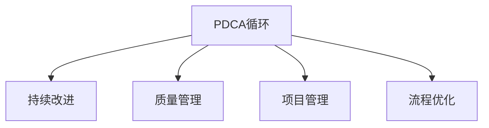

                 

# PDCA循环:从理论到实践的管理工具

> 关键词：PDCA循环,质量管理,项目管理,流程优化,持续改进

## 1. 背景介绍

### 1.1 问题由来
在快速变化和高度竞争的现代商业环境中，企业面临着无数的挑战。从市场动态的瞬息万变，到技术迭代的速度日益加快，再到消费者需求的多样化，企业需要不断调整和优化其经营策略，以保持竞争优势。为了有效应对这些挑战，质量管理（Quality Management）应运而生，它提供了一套系统化的工具和方法，帮助企业通过持续改进（Continuous Improvement）实现质量提升。

质量管理的基础是PDCA（Plan-Do-Check-Act）循环，也被称为戴明环（Deming Cycle）。这个循环由统计学大师W. Edwards Deming在20世纪50年代首次提出，旨在通过系统化和循环性的步骤，不断优化企业运营，提高产品和服务的质量。PDCA循环不仅是质量管理的基本框架，也是项目管理、流程优化等领域的重要工具。

### 1.2 问题核心关键点
PDCA循环的基本思想是通过四个阶段（Plan-执行-检查-行动），不断迭代改进，最终实现质量提升。其核心关键点包括：

1. **计划（Plan）**：定义目标，识别问题，设计解决方案，制定行动计划。
2. **执行（Do）**：按照计划执行行动，并收集数据。
3. **检查（Check）**：对执行结果进行检查，评估解决方案的有效性。
4. **行动（Act）**：根据检查结果决定是否继续实施，或者对计划进行调整。

通过PDCA循环，企业能够系统性地识别并解决问题，不断提升产品和服务质量，最终实现卓越的运营效率和客户满意度。

## 2. 核心概念与联系

### 2.1 核心概念概述

为更好地理解PDCA循环，本节将介绍几个密切相关的核心概念：

- **PDCA循环**：PDCA循环是质量管理的基本框架，旨在通过系统化和循环性的步骤，不断优化企业运营，提高产品和服务的质量。
- **持续改进**：持续改进是指不断寻找并实施改进措施，以提高流程和产品性能。
- **质量管理**：质量管理是指通过一系列方法和工具，确保产品或服务满足客户需求，同时符合规定的质量标准。
- **项目管理**：项目管理是指通过规划、执行、监控和收尾，确保项目目标的实现。
- **流程优化**：流程优化是指通过改善流程设计，提高流程效率，降低成本，提升质量。

这些核心概念之间的逻辑关系可以通过以下Mermaid流程图来展示：



这个流程图展示了这个核心概念的相互关系：

1. PDCA循环是质量管理、项目管理和流程优化的基础。
2. 持续改进是PDCA循环的核心目标。
3. 质量管理、项目管理、流程优化都旨在通过PDCA循环实现持续改进。

## 3. 核心算法原理 & 具体操作步骤

### 3.1 算法原理概述

PDCA循环是一种系统化、循环性的质量管理方法。其核心原理是：通过计划（Plan）、执行（Do）、检查（Check）和行动（Act）四个阶段，不断识别和解决问题，持续改进流程和产品性能。

在PDCA循环中，每个阶段都依赖于前一个阶段的结果，形成一个闭环的系统。通过不断地迭代和优化，PDCA循环能够逐步提高产品和服务的质量，实现持续改进的目标。

### 3.2 算法步骤详解

PDCA循环由四个基本步骤组成，每个步骤都有其特定的任务和目标：

**Step 1: 计划（Plan）**

在计划阶段，需要明确目标、识别问题和设计解决方案。具体步骤如下：

1. **确定目标**：根据客户需求和业务目标，定义明确的改进目标。
2. **识别问题**：通过数据收集和分析，识别当前流程或产品存在的问题和缺陷。
3. **制定解决方案**：设计具体的改进措施和实施计划，包括时间表、责任人和资源分配。

**Step 2: 执行（Do）**

在执行阶段，需要按照计划执行行动，并收集相关数据。具体步骤如下：

1. **实施改进措施**：按照计划执行改进措施，并在实际操作中收集数据。
2. **监控过程**：跟踪改进措施的实施情况，确保按计划执行。
3. **记录数据**：收集改进措施实施过程中的关键数据，包括时间、资源、成本等。

**Step 3: 检查（Check）**

在检查阶段，需要对执行结果进行检查，评估解决方案的有效性。具体步骤如下：

1. **数据评估**：对收集到的数据进行分析，评估改进措施的实际效果。
2. **问题识别**：识别实施过程中出现的新问题和挑战。
3. **调整计划**：根据检查结果，对计划进行调整和优化，确保改进措施的有效性。

**Step 4: 行动（Act）**

在行动阶段，需要根据检查结果决定是否继续实施，或者对计划进行调整。具体步骤如下：

1. **决定实施**：如果改进措施有效，则继续实施，并进一步优化改进措施。
2. **决定调整**：如果改进措施无效或产生新问题，则需要调整计划，重新设计解决方案。
3. **记录经验**：总结实施过程中的经验和教训，为未来的改进提供参考。

通过PDCA循环的四个阶段，企业可以系统性地识别和解决问题，实现持续改进的目标。

### 3.3 算法优缺点

PDCA循环作为质量管理的基本方法，具有以下优点：

1. **系统化**：PDCA循环通过计划、执行、检查和行动四个步骤，形成了一个闭环的系统，能够系统性地识别和解决问题。
2. **持续改进**：PDCA循环的循环性质，使得企业可以不断寻找和实施改进措施，持续优化流程和产品性能。
3. **灵活性**：PDCA循环可以根据实际情况进行调整，适用于各种规模和类型的企业。

同时，PDCA循环也存在一些局限性：

1. **复杂性**：PDCA循环的步骤较多，实施过程中需要投入大量的时间和资源。
2. **灵活性不足**：PDCA循环的四个阶段顺序固定，可能在某些情况下不够灵活。
3. **难以量化**：PDCA循环的效果评估和改进措施的实施效果，有时难以量化和量化。

尽管存在这些局限性，PDCA循环仍然是质量管理的基础方法，具有广泛的适用性和实用价值。

### 3.4 算法应用领域

PDCA循环作为一种通用的管理方法，广泛应用于质量管理、项目管理、流程优化等各个领域：

- **质量管理**：PDCA循环是质量管理的基础工具，用于持续改进产品和服务的质量。
- **项目管理**：PDCA循环用于项目计划、执行、监控和收尾，确保项目目标的实现。
- **流程优化**：PDCA循环用于流程设计、执行、检查和优化，提高流程效率，降低成本。
- **运营管理**：PDCA循环用于运营流程的持续改进，提高运营效率和客户满意度。
- **供应链管理**：PDCA循环用于供应链管理的各个环节，确保供应链的高效运行。

## 4. 数学模型和公式 & 详细讲解 & 举例说明

### 4.1 数学模型构建

PDCA循环的数学模型构建，主要是为了建立数据收集、分析、评估和改进的闭环系统。假设企业希望改进某个流程，需要收集和分析以下数据：

- $X$：流程的输入变量。
- $Y$：流程的输出变量。
- $U$：影响流程的不可控因素。
- $V$：改进措施的实施情况。

其中，$X$、$Y$和$U$是流程的基本要素，$V$是改进措施的实施情况。

### 4.2 公式推导过程

在PDCA循环中，每个阶段都需要通过数学模型进行分析和优化。以流程的输出变量$Y$为例，其数学模型可以表示为：

$$ Y = f(X, V) + \epsilon $$

其中，$f$表示流程函数，$V$表示改进措施的实施情况，$\epsilon$表示随机误差。

通过这个数学模型，可以建立流程的输入-输出关系，并根据$X$和$V$的变化，预测$Y$的变化趋势。

### 4.3 案例分析与讲解

假设企业希望改进一个产品的生产流程，提高生产效率。根据PDCA循环的步骤，可以进行如下分析：

**Step 1: 计划（Plan）**

- 目标：提高生产效率，减少生产时间。
- 问题：生产线上存在瓶颈，部分设备效率低下。
- 解决方案：升级部分设备，引入自动化生产系统。

**Step 2: 执行（Do）**

- 实施措施：升级设备，引入自动化系统。
- 监控过程：跟踪设备运行情况，收集生产数据。

**Step 3: 检查（Check）**

- 数据评估：分析生产数据，评估设备升级的效果。
- 问题识别：识别设备升级后的新问题和挑战。
- 调整计划：根据数据评估结果，调整改进措施。

**Step 4: 行动（Act）**

- 决定实施：如果设备升级有效，则继续实施，并进一步优化生产系统。
- 决定调整：如果设备升级无效，则重新设计改进措施。

通过这个案例，可以看到PDCA循环的系统性和循环性，以及其对流程改进的指导作用。

## 5. 项目实践：代码实例和详细解释说明

### 5.1 开发环境搭建

在进行PDCA循环的项目实践前，我们需要准备好开发环境。以下是使用Python进行PyCharm开发的环境配置流程：

1. 安装Anaconda：从官网下载并安装Anaconda，用于创建独立的Python环境。
2. 创建并激活虚拟环境：
```bash
conda create -n pdca-env python=3.8 
conda activate pdca-env
```

3. 安装PyCharm：从官网下载并安装PyCharm IDE，设置PyCharm与Anaconda环境联动。
4. 安装所需的Python库：
```bash
pip install pandas numpy matplotlib plotly
```

完成上述步骤后，即可在`pdca-env`环境中开始项目实践。

### 5.2 源代码详细实现

下面是一个简单的PDCA循环项目，用于模拟一个生产流程的持续改进：

```python
import pandas as pd
import numpy as np
import matplotlib.pyplot as plt

# 模拟生产数据
def generate_data(num_products, num_days):
    data = pd.DataFrame({
        'date': pd.date_range(start='2022-01-01', periods=num_days, freq='D'),
        'output': np.random.randint(1000, 2000, size=num_days)
    })
    data['input'] = np.random.randint(100, 200, size=num_days)
    data['efficiency'] = np.random.randint(0.8, 1.2, size=num_days)
    return data

# 数据分析
def analyze_data(data):
    avg_output = data['output'].mean()
    avg_input = data['input'].mean()
    avg_efficiency = data['efficiency'].mean()
    return avg_output, avg_input, avg_efficiency

# 模拟改进措施
def improve_process(data, improvement):
    new_data = data.copy()
    new_data['input'] = new_data['input'] * improvement
    return new_data

# 模拟PDCA循环
def pdca_cycle(data, improvement, num_rounds):
    for round in range(num_rounds):
        avg_output, avg_input, avg_efficiency = analyze_data(data)
        print(f"Round {round+1}: Average Output = {avg_output}, Average Input = {avg_input}, Average Efficiency = {avg_efficiency}")
        data = improve_process(data, improvement)
        avg_output, avg_input, avg_efficiency = analyze_data(data)
        print(f"After Improvement: Average Output = {avg_output}, Average Input = {avg_input}, Average Efficiency = {avg_efficiency}")
    return data

# 运行PDCA循环
num_products = 1000
num_days = 365
num_rounds = 5
data = generate_data(num_products, num_days)
improvement = 1.1
result = pdca_cycle(data, improvement, num_rounds)

# 绘制改进效果
plt.plot(result['date'], result['output'], label='Output')
plt.plot(result['date'], result['input'], label='Input')
plt.plot(result['date'], result['efficiency'], label='Efficiency')
plt.xlabel('Date')
plt.ylabel('Value')
plt.legend()
plt.show()
```

这个代码实现了一个简单的PDCA循环模拟，用于分析生产流程的改进效果。

### 5.3 代码解读与分析

让我们再详细解读一下关键代码的实现细节：

**generate_data函数**：
- 生成模拟的生产数据，包括日期、输出、输入和效率等变量。

**analyze_data函数**：
- 分析生产数据，计算平均输出、平均输入和平均效率等关键指标。

**improve_process函数**：
- 根据改进措施（如设备升级）模拟生产流程的改进。

**pdca_cycle函数**：
- 模拟PDCA循环的四个阶段，进行计划、执行、检查和行动。
- 每个循环结束时，输出改进后的生产数据，并绘制改进效果图。

**运行PDCA循环**：
- 生成生产数据，设置改进措施，运行PDCA循环，输出改进效果。

可以看到，通过这个简单的代码实现，我们可以系统性地模拟PDCA循环的执行过程，并通过图表展示改进效果。

## 6. 实际应用场景

### 6.1 质量管理

在质量管理领域，PDCA循环被广泛应用，用于持续改进产品和服务的质量。例如，一家制造企业可以通过PDCA循环不断优化其产品质量，提高客户满意度。具体应用步骤如下：

1. **计划阶段**：明确产品质量目标，识别影响产品质量的关键因素。
2. **执行阶段**：根据计划实施质量改进措施，并监控质量数据。
3. **检查阶段**：对改进措施的效果进行评估，识别新问题。
4. **行动阶段**：根据检查结果，决定是否继续实施改进措施，或者调整计划。

通过PDCA循环，制造企业可以系统性地识别和解决产品质量问题，实现持续改进。

### 6.2 项目管理

在项目管理中，PDCA循环用于指导项目计划、执行、监控和收尾，确保项目目标的实现。例如，一家软件开发企业可以应用PDCA循环，优化软件开发流程，提升项目交付质量。具体应用步骤如下：

1. **计划阶段**：定义项目目标，制定详细项目计划。
2. **执行阶段**：按照计划执行项目任务，并监控项目进展。
3. **检查阶段**：评估项目进展，识别项目问题。
4. **行动阶段**：根据评估结果，调整项目计划，确保项目目标的实现。

通过PDCA循环，企业可以系统性地管理项目，提高项目交付质量，实现项目目标。

### 6.3 流程优化

在流程优化中，PDCA循环用于持续改进业务流程，提高流程效率。例如，一家银行可以应用PDCA循环，优化客户服务流程，提升客户体验。具体应用步骤如下：

1. **计划阶段**：识别影响客户服务流程的关键因素，设计改进措施。
2. **执行阶段**：实施改进措施，并监控流程数据。
3. **检查阶段**：评估改进措施的效果，识别新问题。
4. **行动阶段**：根据评估结果，决定是否继续实施改进措施，或者调整计划。

通过PDCA循环，银行可以系统性地优化客户服务流程，提高客户体验，实现持续改进。

### 6.4 未来应用展望

随着PDCA循环的持续演进，其在各个领域的应用前景将更加广阔。未来，PDCA循环可能会在更多场景下得到应用，例如：

1. **智能制造**：在智能制造领域，PDCA循环可以用于优化生产流程，提高生产效率和产品质量。
2. **智慧医疗**：在智慧医疗领域，PDCA循环可以用于优化医疗流程，提高医疗服务质量。
3. **智能交通**：在智能交通领域，PDCA循环可以用于优化交通管理，提高交通效率和安全性。
4. **智慧城市**：在智慧城市领域，PDCA循环可以用于优化城市管理，提高城市管理效率。
5. **金融科技**：在金融科技领域，PDCA循环可以用于优化金融服务，提高金融服务质量。

## 7. 工具和资源推荐

### 7.1 学习资源推荐

为了帮助开发者系统掌握PDCA循环的理论基础和实践技巧，这里推荐一些优质的学习资源：

1. 《PDCA循环：从理论到实践》系列博文：由质量管理专家撰写，深入浅出地介绍了PDCA循环的基本概念和应用方法。

2. 《PDCA循环：质量管理之道》书籍：详细阐述了PDCA循环的基本原理和实际应用案例，帮助读者系统理解PDCA循环。

3. 《PDCA循环：项目管理与持续改进》在线课程：由项目管理专家开设的在线课程，深入讲解PDCA循环在项目管理中的应用。

4. 《PDCA循环：流程优化与质量管理》研讨会：由质量管理专家主持的线上研讨会，深入探讨PDCA循环在流程优化中的应用。

通过对这些资源的学习实践，相信你一定能够快速掌握PDCA循环的精髓，并用于解决实际的流程和产品改进问题。

### 7.2 开发工具推荐

高效的开发离不开优秀的工具支持。以下是几款用于PDCA循环开发的常用工具：

1. Excel：简单易用的电子表格软件，适合对数据进行初步分析和可视化。
2. Tableau：强大的数据可视化工具，适合对复杂数据进行高级分析和展示。
3. Python：灵活强大的编程语言，适合进行数据分析和模拟。
4. Jira：流行的项目管理工具，适合规划、执行和管理项目任务。
5. Trello：简单易用的项目管理工具，适合进行流程跟踪和任务管理。
6. Slack：流行的团队沟通工具，适合团队协作和任务协调。

合理利用这些工具，可以显著提升PDCA循环的开发效率，加快创新迭代的步伐。

### 7.3 相关论文推荐

PDCA循环作为一种经典的质量管理方法，其研究与应用在质量管理领域已有广泛的基础。以下是几篇奠基性的相关论文，推荐阅读：

1. Deming, W. Edwards. "On the Profound Wisdom of Process Control." American Society for Quality, 1986.

2. Ishikawa, Kaoru. "Quality Control, The Stratification Method." Toyota Motor Corporation, 1969.

3. Deming, W. Edwards. "Quality Management, with Special Reference to Product Service." American Society for Quality, 1961.

4. Juran, Joseph M., and William B. Malhotra. "Quality Control and Improvement: A Systems Approach." McGraw-Hill Companies, 1990.

5. Scherer, Ron. "The Deming Cycle: Implementing Plan-Do-Check-Act." Quality Improvement, 2013.

这些论文代表了大质量管理领域的研究进展，通过学习这些前沿成果，可以帮助研究者把握学科前进方向，激发更多的创新灵感。

## 8. 总结：未来发展趋势与挑战

### 8.1 总结

本文对PDCA循环进行了全面系统的介绍。首先阐述了PDCA循环的基本原理和应用背景，明确了其在质量管理、项目管理、流程优化等领域的重要价值。其次，从理论到实践，详细讲解了PDCA循环的四个步骤及其具体操作，给出了PDCA循环项目开发的完整代码实例。同时，本文还广泛探讨了PDCA循环在多个行业领域的应用前景，展示了其在实际应用中的强大功能。

通过本文的系统梳理，可以看到，PDCA循环作为一种经典的质量管理方法，具有系统化、循环性的特点，能够帮助企业通过持续改进，实现质量提升和流程优化。未来，随着企业运营环境的不断变化，PDCA循环在各领域的广泛应用，将进一步推动企业转型升级，实现高质量发展。

### 8.2 未来发展趋势

展望未来，PDCA循环将呈现以下几个发展趋势：

1. **数字化转型**：随着数字化转型的深入，PDCA循环将更多地结合信息技术，实现数据的实时监控和分析，提高改进效率。
2. **人工智能应用**：在人工智能的推动下，PDCA循环将更多地应用机器学习、数据挖掘等技术，提升改进措施的精准性和效果。
3. **多学科融合**：PDCA循环将更多地与其他学科融合，如心理学、社会学、经济学等，形成多学科协同的改进方法。
4. **跨组织协作**：PDCA循环将更多地应用于跨组织协作，通过企业间的合作，实现供应链、生态系统的整体优化。
5. **全球化应用**：随着全球化进程的加快，PDCA循环将更多地应用于国际市场，实现全球范围内的质量提升和流程优化。

以上趋势凸显了PDCA循环的广泛应用前景。这些方向的探索发展，必将进一步推动PDCA循环在各领域的应用，为企业的质量管理、项目管理、流程优化等提供更强大的工具和方法。

### 8.3 面临的挑战

尽管PDCA循环已经取得了显著成效，但在迈向更加智能化、普适化应用的过程中，仍面临诸多挑战：

1. **数据质量问题**：在数据驱动的改进过程中，数据质量的高低直接影响改进的效果。数据不完整、不准确等问题，可能导致改进措施的失效。
2. **复杂性管理**：在复杂多变的运营环境中，PDCA循环需要不断调整和优化，以适应新的变化和挑战。
3. **资源限制**：PDCA循环的实施需要投入大量的时间和资源，如何高效利用资源，提高改进效率，是亟待解决的问题。
4. **人员培训**：PDCA循环的实施需要全员参与，如何提高员工的意识和技能，是保证PDCA循环顺利实施的关键。
5. **文化变革**：PDCA循环的实施需要组织文化的支持，如何改变员工的工作习惯和思维方式，是实现持续改进的重要保障。

正视PDCA循环面临的这些挑战，积极应对并寻求突破，将是大质量管理方法走向成熟的必由之路。相信随着企业运营环境的不断变化，PDCA循环将在各领域得到更广泛的应用，为企业的质量管理、项目管理、流程优化等提供更强大的工具和方法。

### 8.4 研究展望

面对PDCA循环所面临的种种挑战，未来的研究需要在以下几个方面寻求新的突破：

1. **大数据应用**：通过大数据分析，提高数据质量，优化改进措施，提升改进效果。
2. **人工智能整合**：将人工智能技术整合到PDCA循环中，实现数据的实时监控和分析，提高改进效率。
3. **多学科融合**：将心理学、社会学、经济学等学科知识与PDCA循环相结合，形成多学科协同的改进方法。
4. **跨组织协作**：通过供应链、生态系统的整体优化，实现PDCA循环的跨组织应用。
5. **文化变革**：通过组织文化的变革，改变员工的工作习惯和思维方式，实现持续改进。

这些研究方向将推动PDCA循环的持续演进，为企业的质量管理、项目管理、流程优化等提供更强大的工具和方法。面向未来，PDCA循环需要在数字化、人工智能、多学科融合、跨组织协作等方面进行更多的探索和实践，才能真正实现企业的持续改进和高质量发展。

## 9. 附录：常见问题与解答

**Q1: PDCA循环适用于所有企业吗？**

A: PDCA循环是一种通用的质量管理方法，适用于各种规模和类型的企业。但是，不同类型的企业可能需要根据自身特点进行调整和优化，才能达到最佳效果。

**Q2: PDCA循环的四个阶段是否可以颠倒？**

A: PDCA循环的四个阶段（计划、执行、检查、行动）是有顺序的，不能颠倒。每个阶段都依赖于前一个阶段的结果，形成一个闭环的系统。颠倒顺序可能导致改进措施的失效。

**Q3: PDCA循环的实施需要全员参与吗？**

A: 是的。PDCA循环的实施需要全员参与，只有全体员工理解和支持，才能真正实现持续改进。

**Q4: PDCA循环需要多久完成一次？**

A: PDCA循环的实施周期可以根据具体情况进行调整。一般来说，一个循环的时间周期为1-3个月。但具体周期应根据改进目标、数据收集频率等因素进行调整。

**Q5: PDCA循环可以与其他质量管理方法结合使用吗？**

A: 是的。PDCA循环可以与其他质量管理方法（如6 Sigma、ISO质量管理体系等）结合使用，形成多层次、多维度的质量管理框架。

通过这些常见问题的解答，可以更好地理解PDCA循环的实施要求和实际应用，为企业的质量管理、项目管理、流程优化等提供更全面的指导。

---

作者：禅与计算机程序设计艺术 / Zen and the Art of Computer Programming

