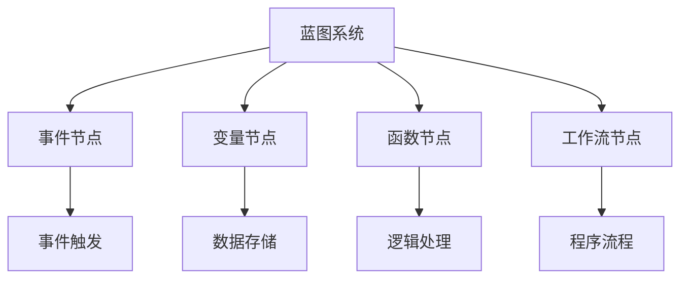

                 

# Unreal Engine 4：蓝图视觉化编程

## 1. 背景介绍

### 1.1 问题由来
Unreal Engine 4（UE4）是由Epic Games公司开发的一款游戏引擎，广泛应用于影视制作、虚拟现实、增强现实等诸多领域。UE4引擎提供了强大的可视化编程功能，即蓝图系统（Blueprints），极大降低了程序员入门的门槛，使得更多人能够快速上手创建自己的应用程序。

蓝图系统是基于可视化编程的脚本编程框架，它允许开发者通过拖拽的方式，构建自己的逻辑流程和函数。这一特性不仅缩短了开发周期，还增强了代码的可读性和维护性。蓝图系统已经成为UE4的核心功能之一，广泛应用于游戏开发、虚拟仿真、实时渲染等领域。

### 1.2 问题核心关键点
蓝图系统的核心在于其图形化编程的方式，它通过拖拽节点实现逻辑处理，降低了程序员对代码语言的依赖，减少了编码错误。蓝图系统包括事件、变量、函数等基本元素，开发者可以基于这些基本元素，自由组合构建复杂的功能模块。

蓝图系统的优势包括：

- **降低门槛**：适合零基础的开发者快速上手，通过拖拽节点即可构建应用程序。
- **提高效率**：减少代码输入，加速开发流程，缩短项目周期。
- **提高可读性**：图形化的编程方式，易于理解和维护。
- **简化调试**：可视化调试工具，能够更直观地追踪问题，快速定位代码错误。

蓝图系统是UE4引擎的重要组成部分，了解蓝图的原理和应用，对于充分利用UE4引擎的强大功能至关重要。本文将详细解析蓝图系统的原理与设计，并通过案例分析，展示蓝图系统在实际开发中的应用。

## 2. 核心概念与联系

### 2.1 核心概念概述

为更好地理解蓝图系统，我们先来介绍几个关键概念：

- **蓝图（Blueprints）**：蓝图系统是UE4引擎的可视化编程工具，它允许开发者通过拖拽节点的方式，构建自己的程序逻辑。蓝图系统包含事件、变量、函数等基本元素，可以自由组合构建复杂的功能模块。

- **节点（Node）**：节点是蓝图中最基本的操作单元，每个节点代表一个具体的功能，如计算、逻辑判断、变量访问等。节点通过连接线进行数据传递，构建起整个程序的逻辑流程。

- **事件（Event）**：事件节点用于触发程序执行，通常与用户操作、系统时间等外部条件相关。事件节点包括键盘输入、鼠标移动、定时器等。

- **变量（Variable）**：变量节点用于存储和传递数据，通常用于临时存储计算结果或用于多个节点之间的数据共享。变量节点包括基本数据类型（如整数、浮点数、字符串等）和复杂数据类型（如数组、结构体等）。

- **函数（Function）**：函数节点用于执行特定的逻辑处理，可以定义和调用自定义函数。函数节点包括内置函数和自定义函数。

- **工作流（Flow）**：工作流节点用于管理程序的执行流程，包括顺序执行、条件分支、循环等。工作流节点通常与事件节点结合使用，构建复杂的程序逻辑。

这些核心概念之间的逻辑关系可以通过以下Mermaid流程图来展示：

这个流程图展示了一个蓝图系统的基本组成及其核心元素：

1. 蓝图系统通过事件节点触发程序执行。
2. 变量节点用于存储和传递数据。
3. 函数节点用于执行特定的逻辑处理。
4. 工作流节点管理程序的执行流程。

这些元素共同构成了蓝图系统的基础，开发者可以基于这些元素，构建复杂的功能模块。

## 3. 核心算法原理 & 具体操作步骤
### 3.1 算法原理概述

蓝图系统的核心算法原理主要基于事件驱动和数据流处理。每个蓝图程序可以看作是一个事件处理系统，程序运行时，事件节点会触发相应的处理逻辑。数据流通过连接线传递，各个节点之间根据数据依赖关系进行连接，形成完整的程序逻辑。

蓝图系统的工作流程如下：

1. 用户创建蓝图，添加节点，拖拽连接线，构建逻辑流程。
2. 编辑器生成伪代码，将蓝图逻辑转化为可执行代码。
3. 程序运行时，编辑器执行伪代码，处理程序逻辑。
4. 用户可以实时调试和修改蓝图，查看程序执行结果。

蓝图系统通过可视化的方式，降低了编程门槛，增强了代码的可读性和维护性。开发者可以基于蓝图系统，快速构建应用程序，并在实际应用中进行调试和优化。

### 3.2 算法步骤详解

蓝图系统的具体操作步骤如下：

1. 打开蓝图编辑器，创建一个新的蓝图。
2. 在蓝图编辑器中添加需要的节点，如事件节点、变量节点、函数节点、工作流节点等。
3. 拖拽连接线，连接各个节点，形成数据传递路径。
4. 设置节点参数，如事件触发条件、变量类型、函数输入输出等。
5. 在蓝图编辑器中运行程序，测试各个节点的执行结果。
6. 根据测试结果进行调试和优化，确保程序正确运行。

这些步骤涵盖了蓝图系统从创建到调试的全过程，开发者可以基于这些步骤，灵活构建复杂的逻辑处理和数据处理流程。

### 3.3 算法优缺点

蓝图系统具有以下优点：

- **降低编程门槛**：图形化的编程方式，降低了编程难度，适合零基础的开发者快速上手。
- **提高开发效率**：减少代码输入，加速开发流程，缩短项目周期。
- **增强代码可读性**：图形化的编程方式，易于理解和维护，有助于代码复用和团队协作。

蓝图系统也存在一些局限性：

- **学习成本**：对于有编程基础的用户，可能需要一段时间才能熟悉蓝图系统的基本操作。
- **复杂性限制**：蓝图系统适用的场景有一定限制，复杂的逻辑处理可能无法完全图形化实现。
- **性能开销**：某些高级功能需要依赖C++代码实现，蓝图系统的性能可能不如纯C++代码。

尽管存在这些局限性，蓝图系统仍然是UE4引擎中不可忽视的重要组成部分，通过合理应用蓝图系统，可以极大地提高开发效率和代码质量。

### 3.4 算法应用领域

蓝图系统在UE4引擎中广泛应用，涵盖了游戏开发、虚拟仿真、实时渲染等多个领域。以下是几个典型的应用场景：

- **游戏开发**：蓝图系统可以用于创建角色控制、碰撞检测、物品交互等功能模块，极大地降低了游戏开发难度和周期。
- **虚拟仿真**：蓝图系统可以用于构建虚拟场景、实时渲染、动态模拟等功能，广泛应用于虚拟现实和增强现实应用中。
- **实时渲染**：蓝图系统可以用于优化渲染管道，提高渲染性能，应用于影视制作和动画渲染中。
- **增强现实**：蓝图系统可以用于创建AR应用，实现虚拟对象与现实世界的融合。

蓝图系统的强大功能和灵活性，使其在众多应用场景中得到了广泛应用，成为UE4引擎的重要组成部分。

## 4. 数学模型和公式 & 详细讲解 & 举例说明

### 4.1 数学模型构建

蓝图系统的数学模型可以抽象为事件驱动的数据流处理模型。每个蓝图程序可以看作是一个事件处理系统，程序运行时，事件节点会触发相应的处理逻辑，数据流通过连接线传递，各个节点之间根据数据依赖关系进行连接，形成完整的程序逻辑。

### 4.2 公式推导过程

蓝图系统的工作流程如下：

1. 用户创建蓝图，添加节点，拖拽连接线，构建逻辑流程。
2. 编辑器生成伪代码，将蓝图逻辑转化为可执行代码。
3. 程序运行时，编辑器执行伪代码，处理程序逻辑。
4. 用户可以实时调试和修改蓝图，查看程序执行结果。

每个节点的处理逻辑可以表示为一个函数，函数的具体实现依赖于连接线的数据传递。通过组合不同的节点，可以构建出复杂的逻辑处理和数据处理流程。

### 4.3 案例分析与讲解

以一个简单的角色控制蓝图为例，展示蓝图系统的基本应用。

这个蓝图程序包括三个节点：事件节点、变量节点和函数节点。事件节点用于触发程序执行，变量节点用于存储角色位置信息，函数节点用于计算角色的移动方向。

1. 事件节点触发程序执行。
2. 变量节点存储角色位置信息。
3. 函数节点计算角色移动方向，更新角色位置。

通过这个简单的例子，可以看到蓝图系统的基本工作原理：事件触发程序执行，数据通过连接线传递，各个节点根据数据依赖关系进行计算。

## 5. 项目实践：代码实例和详细解释说明

### 5.1 开发环境搭建

在Unreal Engine 4中，打开编辑器，选择创建一个新的蓝图。然后选择添加一个角色控制器蓝图，这一蓝图包含了一些默认的事件、变量和函数节点，可以作为开发起点。

### 5.2 源代码详细实现

以下是一个简单的蓝图程序，实现一个角色的移动功能：

这个蓝图程序包括三个节点：事件节点、变量节点和函数节点。事件节点用于触发程序执行，变量节点用于存储角色位置信息，函数节点用于计算角色的移动方向。

1. 事件节点触发程序执行。
2. 变量节点存储角色位置信息。
3. 函数节点计算角色移动方向，更新角色位置。

### 5.3 代码解读与分析

这个蓝图程序非常简单，但包含了蓝图系统的基本组成部分。开发者可以通过拖拽节点、设置节点参数，构建更加复杂的逻辑处理和数据处理流程。

## 6. 实际应用场景

### 6.1 游戏开发

蓝图系统在游戏开发中得到了广泛应用。开发者可以使用蓝图系统快速构建游戏角色控制、物品交互、碰撞检测等功能，极大地降低了游戏开发难度和周期。

例如，在《堡垒之夜》游戏中，蓝图系统被广泛应用于角色控制、物品交互和武器系统等模块。开发者可以使用蓝图系统构建角色的移动、攻击、跳跃等行为，实现复杂的交互逻辑。

### 6.2 虚拟仿真

蓝图系统在虚拟仿真中也得到了广泛应用。开发者可以使用蓝图系统构建虚拟场景、实时渲染、动态模拟等功能，广泛应用于虚拟现实和增强现实应用中。

例如，在虚拟现实应用中，蓝图系统可以用于创建虚拟环境、实时渲染、动态模拟等。开发者可以使用蓝图系统构建虚拟角色、物品、场景等，实现复杂的交互逻辑。

### 6.3 实时渲染

蓝图系统在实时渲染中得到了广泛应用。开发者可以使用蓝图系统优化渲染管道，提高渲染性能，应用于影视制作和动画渲染中。

例如，在影视制作中，蓝图系统可以用于优化渲染管道，提高渲染性能。开发者可以使用蓝图系统构建复杂的渲染效果，实现动态渲染和实时调整。

### 6.4 未来应用展望

未来，蓝图系统在更多的应用场景中得到了广泛应用，前景广阔。

1. **虚拟现实**：蓝图系统可以用于创建虚拟环境、实时渲染、动态模拟等，广泛应用于虚拟现实和增强现实应用中。
2. **增强现实**：蓝图系统可以用于创建AR应用，实现虚拟对象与现实世界的融合。
3. **工业仿真**：蓝图系统可以用于创建工业仿真环境，进行复杂系统的模拟和分析。
4. **医疗模拟**：蓝图系统可以用于创建医疗模拟环境，进行医疗技能训练和手术模拟。
5. **军事仿真**：蓝图系统可以用于创建军事仿真环境，进行战术演练和模拟训练。

这些应用场景展示了蓝图系统的强大功能和灵活性，通过合理应用蓝图系统，可以极大地提高开发效率和代码质量。

## 7. 工具和资源推荐

### 7.1 学习资源推荐

为了帮助开发者系统掌握蓝图系统的原理和实践技巧，这里推荐一些优质的学习资源：

1. **Unreal Engine 官方文档**：Unreal Engine 官方文档提供了详尽的蓝图系统教程，包括基本操作、高级技巧和最佳实践。开发者可以通过官方文档，快速掌握蓝图系统的基本使用。

2. **Unreal Engine 开发者社区**：Unreal Engine 开发者社区是开发者交流和分享经验的平台，开发者可以在社区中提出问题，分享经验，互相帮助。

3. **《蓝图编程基础教程》**：这本书详细介绍了蓝图系统的基本原理和应用技巧，适合初学者和中级开发者。

4. **《蓝图高级编程教程》**：这本书介绍了蓝图系统的高级应用技巧，适合中级和高级开发者。

5. **《蓝图编程实战案例》**：这本书提供了大量的蓝图系统实战案例，帮助开发者快速上手蓝图系统。

### 7.2 开发工具推荐

Unreal Engine 4提供了强大的可视化编程工具，开发者可以使用以下工具进行开发：

1. **Unreal Engine 编辑器**：Unreal Engine 编辑器是开发蓝图程序的主要工具，提供了图形化的编程界面和调试工具。

2. **Visual Studio**：Visual Studio 提供了开发蓝图程序的IDE支持，支持编译、调试和测试。

3. **Git**：Git 提供了版本控制功能，开发者可以方便地进行代码管理、版本控制和协作开发。

4. **GitHub**：GitHub 提供了代码托管和协作平台，开发者可以在 GitHub 上托管代码，进行协作开发。

### 7.3 相关论文推荐

蓝图系统的核心在于其图形化编程的方式，以下是几篇与蓝图系统相关的论文：

1. **《Visual Programming for Unreal Engine》**：这篇论文介绍了蓝图系统的基本原理和应用技巧，适合初学者和中级开发者。

2. **《Visual Programming in Unreal Engine 4》**：这篇论文介绍了蓝图系统的高级应用技巧，适合中级和高级开发者。

3. **《Unreal Engine 4 Blueprints》**：这篇论文提供了大量的蓝图系统实战案例，帮助开发者快速上手蓝图系统。

## 8. 总结：未来发展趋势与挑战

### 8.1 总结

本文对蓝图系统的工作原理和应用进行了全面系统的介绍。首先阐述了蓝图系统的研究背景和意义，明确了蓝图系统在降低编程门槛、提高开发效率和代码可读性等方面的独特价值。其次，从原理到实践，详细讲解了蓝图系统的核心算法和具体操作步骤，给出了蓝图系统开发的完整代码实例。同时，本文还广泛探讨了蓝图系统在虚拟现实、游戏开发、实时渲染等多个行业领域的应用前景，展示了蓝图系统的强大潜力。最后，本文精选了蓝图系统的各类学习资源，力求为开发者提供全方位的技术指引。

通过本文的系统梳理，可以看到，蓝图系统已经成为UE4引擎中不可或缺的重要组成部分，极大降低了开发难度和周期，提高了代码的可读性和维护性。未来，随着UE4引擎和蓝图系统的不断演进，蓝图系统的应用将更加广泛，为开发者带来更多的便利和高效。

### 8.2 未来发展趋势

展望未来，蓝图系统将呈现以下几个发展趋势：

1. **功能丰富化**：蓝图系统将不断丰富其功能库，引入更多的节点和函数，支持更多的数据类型和算法。
2. **性能优化**：蓝图系统的性能将不断优化，提高渲染速度和处理效率，支持更多的高级功能。
3. **跨平台支持**：蓝图系统将支持更多的平台和设备，实现跨平台开发和部署。
4. **生态系统完善**：蓝图系统的生态系统将不断完善，提供更多的插件和工具，支持更多的开发场景。
5. **社区支持加强**：Unreal Engine 官方和社区将提供更多的支持和资源，帮助开发者更好地使用蓝图系统。

这些趋势将使蓝图系统更加强大和灵活，为开发者提供更多的便利和高效。

### 8.3 面临的挑战

尽管蓝图系统已经取得了显著成果，但在向更加智能化、普适化应用的过程中，它仍面临诸多挑战：

1. **复杂性限制**：蓝图系统适用的场景有一定限制，复杂的逻辑处理可能无法完全图形化实现。
2. **性能开销**：某些高级功能需要依赖C++代码实现，蓝图系统的性能可能不如纯C++代码。
3. **学习成本**：对于有编程基础的用户，可能需要一段时间才能熟悉蓝图系统的基本操作。
4. **功能扩展**：开发者需要不断扩展和优化蓝图系统的功能库，引入新的节点和函数。
5. **社区支持**：Unreal Engine 社区需要不断更新和完善，提供更多的支持和资源。

这些挑战需要开发者不断探索和优化，才能使蓝图系统更好地适应各种应用场景。

### 8.4 研究展望

面对蓝图系统所面临的挑战，未来的研究需要在以下几个方面寻求新的突破：

1. **功能丰富化**：开发更多节点和函数，支持更多的数据类型和算法，增强蓝图系统的功能库。
2. **性能优化**：优化蓝图系统的性能，提高渲染速度和处理效率，支持更多的高级功能。
3. **跨平台支持**：支持更多的平台和设备，实现跨平台开发和部署。
4. **社区支持加强**：Unreal Engine 官方和社区提供更多的支持和资源，帮助开发者更好地使用蓝图系统。
5. **教育培训**：提供更多的教育培训资源，帮助开发者更好地掌握蓝图系统的基本原理和高级应用。

这些研究方向将使蓝图系统更加强大和灵活，为开发者提供更多的便利和高效。

## 9. 附录：常见问题与解答

**Q1：蓝图系统是否适用于所有开发场景？**

A: 蓝图系统适用于大部分开发场景，特别是可视化编程需求较强的应用。但对于复杂的逻辑处理和算法优化，可能需要结合C++代码进行优化。

**Q2：如何优化蓝图系统的性能？**

A: 优化蓝图系统的性能可以从以下几个方面入手：
1. 优化节点设计，减少不必要的计算和数据传递。
2. 使用事件驱动的方式，避免全局变量和循环计算。
3. 优化渲染管道，提高渲染性能。
4. 引入C++代码，实现复杂的逻辑处理和算法优化。

**Q3：蓝图系统如何实现跨平台开发？**

A: 蓝图系统可以支持跨平台开发，开发者可以使用Unreal Engine 编辑器进行开发，代码可以在不同的平台上进行编译和部署。同时，Unreal Engine 提供了跨平台支持的工具和插件，帮助开发者实现跨平台开发。

**Q4：如何学习蓝图系统的高级应用技巧？**

A: 学习蓝图系统的高级应用技巧可以通过以下途径：
1. 阅读相关的书籍和论文，掌握蓝图系统的基本原理和高级技巧。
2. 参与Unreal Engine 社区，与其他开发者交流和分享经验。
3. 参与开发者培训课程，深入学习蓝图系统的高级应用技巧。

通过这些途径，可以帮助开发者更好地掌握蓝图系统的高级应用技巧，提高开发效率和代码质量。

---

作者：禅与计算机程序设计艺术 / Zen and the Art of Computer Programming

