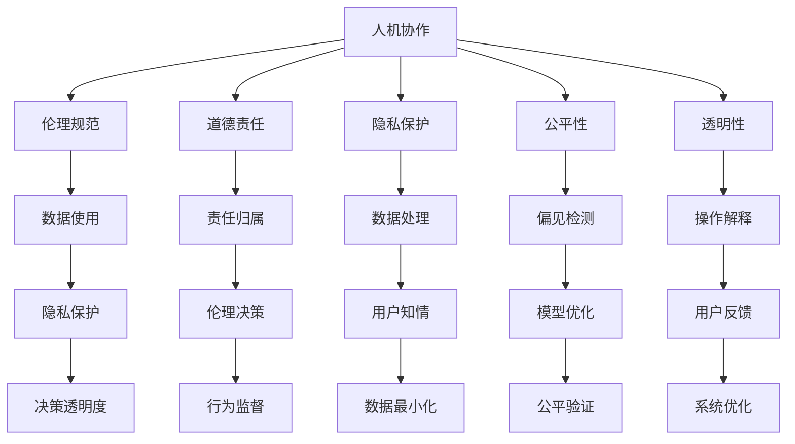

                 

# 人机协作：伦理规范与准则

> 关键词：人机协作, 伦理规范, 人工智能, 道德责任, 隐私保护, 公平性, 透明性

## 1. 背景介绍

随着人工智能（AI）技术的快速发展，人机协作在各行各业中变得愈发重要。AI助手、智能机器人、自动驾驶等技术的广泛应用，使得人们越来越多地依赖于智能系统来进行决策和执行任务。然而，随之而来的伦理问题也不容忽视。如何确保AI系统的行为符合道德规范，保障用户的隐私与权益，提升系统的透明性与公平性，成为当前AI研究的热点话题。本文将深入探讨人机协作中的伦理规范与准则，结合最新研究与案例，提出一系列可行的解决方案。

## 2. 核心概念与联系

### 2.1 核心概念概述

- **人机协作（Human-Machine Collaboration）**：指人类与AI系统共同完成某一任务的过程，涵盖了从任务分配、执行到结果反馈的整个生命周期。
- **伦理规范（Ethical Norms）**：在AI应用中，涉及到的伦理问题包括隐私保护、数据使用、决策透明度、公平性、安全性等方面，需建立明确的伦理规范以指导AI系统的开发与应用。
- **道德责任（Moral Responsibility）**：涉及谁应对AI系统的行为负责，以及如何判断和追究AI系统的道德责任。
- **隐私保护（Privacy Protection）**：在数据收集和处理过程中，保障用户隐私不被侵犯，确保数据使用的合法性和透明性。
- **公平性（Fairness）**：AI系统应避免对特定群体产生偏见，确保决策的公正性和普遍性。
- **透明性（Transparency）**：要求AI系统的内部机制和决策过程公开透明，便于用户理解和使用。

这些核心概念相互关联，共同构成了人机协作中的伦理基础。通过合理的伦理规范与准则，可以最大限度地提升AI系统的安全性、可靠性与可接受性，从而促进人机协作的健康发展。

### 2.2 核心概念原理和架构的 Mermaid 流程图



这个流程图展示了人机协作中各概念之间的联系。数据使用关系到隐私保护，决策透明度涉及到道德责任和伦理规范，偏见检测和模型优化与公平性密切相关，操作解释和用户反馈则直接影响系统的透明性。

## 3. 核心算法原理 & 具体操作步骤

### 3.1 算法原理概述

人机协作中的伦理规范与准则，主要通过以下几个方面进行设计和实施：

- **伦理框架（Ethical Framework）**：建立系统的伦理框架，包括定义明确的伦理目标、原则和规范。
- **道德责任机制（Moral Responsibility Mechanism）**：明确谁应对AI系统的行为负责，以及如何判断和追究AI系统的道德责任。
- **隐私保护措施（Privacy Protection Measures）**：在数据收集、存储和处理过程中，采取措施保障用户隐私，避免数据泄露和滥用。
- **公平性评估（Fairness Evaluation）**：通过检测和修正AI系统的偏见，确保决策的公正性和普遍性。
- **透明性实现（Transparency Implementation）**：实现系统的决策过程透明，便于用户理解和信任。

### 3.2 算法步骤详解

#### 步骤1：构建伦理框架

1. **明确伦理目标**：定义系统的伦理目标，如保障用户隐私、促进公平性、提升透明度等。
2. **制定伦理原则**：基于社会普遍接受的伦理原则，如非恶意、公正性、尊重用户隐私等，指导系统的设计和实施。
3. **编写伦理规范**：将伦理目标和原则转化为具体的规范和指南，如数据处理流程、用户知情同意机制等。

#### 步骤2：实现道德责任机制

1. **责任分配**：明确各参与方（如开发者、用户、监管机构等）在AI系统中的责任分配。
2. **责任认定**：在AI系统出现问题时，通过明确的责任归属，便于追踪和追究责任。
3. **责任监督**：建立监督机制，确保各方遵守伦理规范和道德责任。

#### 步骤3：实施隐私保护措施

1. **数据匿名化**：在数据收集阶段，对用户数据进行匿名化处理，保护用户隐私。
2. **数据最小化**：只收集和使用必要的数据，减少对用户隐私的威胁。
3. **用户知情同意**：在数据使用前，获取用户的知情同意，确保数据使用的透明性和合法性。

#### 步骤4：确保公平性

1. **偏见检测**：通过检测AI系统中的偏见，识别潜在的歧视性行为。
2. **模型优化**：针对检测出的偏见，对模型进行优化，减少或消除歧视性输出。
3. **公平验证**：对优化后的模型进行验证，确保其公平性和公正性。

#### 步骤5：提升透明性

1. **操作解释**：提供AI系统的决策解释，帮助用户理解其行为和结果。
2. **用户反馈**：建立用户反馈机制，收集用户对AI系统的意见和建议。
3. **系统优化**：根据用户反馈和数据分析，持续优化AI系统，提升其透明性和可接受性。

### 3.3 算法优缺点

#### 优点

1. **提升系统的可信度**：通过明确的伦理规范和道德责任机制，增强用户对AI系统的信任感。
2. **保障用户权益**：通过隐私保护和公平性措施，保障用户隐私和权益，提升系统的合法性和可接受性。
3. **增强系统透明度**：通过操作解释和用户反馈，提升系统的透明度，便于用户理解和监督。

#### 缺点

1. **实施复杂度**：建立和实施伦理规范需要大量的人力和资源，存在一定的实施难度。
2. **可能增加成本**：为满足伦理规范和隐私保护要求，可能需要增加数据处理和系统优化的成本。
3. **挑战现有法律框架**：部分伦理规范和隐私保护措施可能与现有法律框架存在冲突，需要协调和调整。

### 3.4 算法应用领域

基于伦理规范与准则的人机协作技术，已在多个领域得到了广泛应用，例如：

- **医疗健康**：智能诊断、个性化治疗、药物研发等，通过伦理规范保障患者隐私，确保医疗决策的公正性和安全性。
- **金融服务**：信用评分、风险评估、投资建议等，通过隐私保护和公平性措施，提升金融服务的透明度和可接受性。
- **教育培训**：个性化学习、智能辅导、课程推荐等，通过透明性提升学习体验，保障学生隐私。
- **自动驾驶**：路况分析、决策辅助、安全监控等，通过伦理规范和责任机制，保障驾驶安全。

## 4. 数学模型和公式 & 详细讲解 & 举例说明

### 4.1 数学模型构建

为更好地理解人机协作中的伦理规范与准则，本节将介绍几个密切相关的核心数学模型：

1. **隐私保护模型**：
   - **目标**：最小化数据泄露风险，确保数据使用的合法性和透明性。
   - **数学公式**：
     \[
     \min_{\theta} \frac{1}{N}\sum_{i=1}^N l_i(\theta)
     \]
     where \(l_i\) 为数据泄露风险损失函数，\(N\) 为样本数量，\(\theta\) 为模型参数。
   - **解释**：通过最小化数据泄露风险损失函数，找到最优的模型参数，以实现隐私保护。

2. **公平性评估模型**：
   - **目标**：检测并消除AI系统中的偏见，确保决策的公正性和普遍性。
   - **数学公式**：
     \[
     \min_{\theta} \frac{1}{N}\sum_{i=1}^N \left( f_i(\theta) - y_i \right)^2
     \]
     where \(f_i\) 为模型预测结果，\(y_i\) 为真实标签，\(N\) 为样本数量，\(\theta\) 为模型参数。
   - **解释**：通过最小化预测误差损失函数，找到最优的模型参数，以实现公平性。

3. **透明性实现模型**：
   - **目标**：提升系统的透明度，便于用户理解和监督。
   - **数学公式**：
     \[
     \min_{\theta} \frac{1}{N}\sum_{i=1}^N \left( t_i(\theta) - c_i \right)^2
     \]
     where \(t_i\) 为系统透明度得分，\(c_i\) 为预定义的透明度阈值，\(N\) 为样本数量，\(\theta\) 为模型参数。
   - **解释**：通过最小化透明度得分损失函数，找到最优的模型参数，以实现透明性。

### 4.2 公式推导过程

#### 隐私保护模型推导

设数据集 \(D = \{(x_i, y_i)\}_{i=1}^N\)，其中 \(x_i\) 为输入，\(y_i\) 为标签。假设模型 \(f_\theta\) 对输入 \(x\) 进行预测，得到 \(\hat{y} = f_\theta(x)\)。

数据泄露风险 \(L\) 定义为：
\[
L = \frac{1}{N} \sum_{i=1}^N |\hat{y}_i - y_i|
\]

最小化数据泄露风险，即最小化预测误差：
\[
\min_{\theta} L = \min_{\theta} \frac{1}{N} \sum_{i=1}^N |\hat{y}_i - y_i|
\]

通过链式法则，计算梯度：
\[
\frac{\partial L}{\partial \theta} = \frac{1}{N} \sum_{i=1}^N \frac{\partial |\hat{y}_i - y_i|}{\partial \theta}
\]

使用绝对值函数的导数公式，计算梯度：
\[
\frac{\partial |\hat{y}_i - y_i|}{\partial \theta} = \mathbb{I}(\hat{y}_i - y_i \geq 0) - \mathbb{I}(\hat{y}_i - y_i < 0)
\]

其中，\(\mathbb{I}\) 为示性函数。

#### 公平性评估模型推导

设数据集 \(D = \{(x_i, y_i)\}_{i=1}^N\)，其中 \(x_i\) 为输入，\(y_i\) 为标签。假设模型 \(f_\theta\) 对输入 \(x\) 进行预测，得到 \(\hat{y} = f_\theta(x)\)。

公平性定义为：
\[
f_i(\theta) - y_i
\]

最小化预测误差，即最小化公平性：
\[
\min_{\theta} \frac{1}{N} \sum_{i=1}^N (\hat{y}_i - y_i)^2
\]

通过链式法则，计算梯度：
\[
\frac{\partial \frac{1}{N} \sum_{i=1}^N (\hat{y}_i - y_i)^2}{\partial \theta} = \frac{1}{N} \sum_{i=1}^N 2(\hat{y}_i - y_i) \frac{\partial \hat{y}_i}{\partial \theta}
\]

使用链式法则，计算 \(\frac{\partial \hat{y}_i}{\partial \theta}\)：
\[
\frac{\partial \hat{y}_i}{\partial \theta} = \frac{\partial f_\theta(x_i)}{\partial \theta}
\]

最终，公平性评估模型的梯度计算公式为：
\[
\frac{\partial \frac{1}{N} \sum_{i=1}^N (\hat{y}_i - y_i)^2}{\partial \theta} = \frac{2}{N} \sum_{i=1}^N (\hat{y}_i - y_i) \frac{\partial f_\theta(x_i)}{\partial \theta}
\]

#### 透明性实现模型推导

设数据集 \(D = \{(x_i, t_i)\}_{i=1}^N\)，其中 \(x_i\) 为输入，\(t_i\) 为透明度得分。假设模型 \(f_\theta\) 对输入 \(x\) 进行预测，得到 \(\hat{y} = f_\theta(x)\)。

透明性定义为：
\[
t_i = f_{\theta_t}(\hat{y}_i)
\]

最小化透明度得分，即最小化透明性：
\[
\min_{\theta} \frac{1}{N} \sum_{i=1}^N (t_i - c_i)^2
\]

通过链式法则，计算梯度：
\[
\frac{\partial \frac{1}{N} \sum_{i=1}^N (t_i - c_i)^2}{\partial \theta} = \frac{1}{N} \sum_{i=1}^N 2(t_i - c_i) \frac{\partial t_i}{\partial \theta}
\]

使用链式法则，计算 \(\frac{\partial t_i}{\partial \theta}\)：
\[
\frac{\partial t_i}{\partial \theta} = \frac{\partial f_{\theta_t}(\hat{y}_i)}{\partial \theta}
\]

最终，透明性实现模型的梯度计算公式为：
\[
\frac{\partial \frac{1}{N} \sum_{i=1}^N (t_i - c_i)^2}{\partial \theta} = \frac{2}{N} \sum_{i=1}^N (t_i - c_i) \frac{\partial f_{\theta_t}(\hat{y}_i)}{\partial \theta}
\]

### 4.3 案例分析与讲解

#### 案例一：医疗AI系统

在医疗领域，AI系统常用于辅助诊断和治疗决策。然而，数据隐私和伦理问题尤为突出。假设一个医疗AI系统 \(f_\theta\) 用于预测患者的疾病风险。

**隐私保护**：
- 数据泄露风险 \(L\) 定义为：
  \[
  L = \frac{1}{N} \sum_{i=1}^N |\hat{y}_i - y_i|
  \]
  其中 \(y_i\) 为真实标签，\(\hat{y}_i\) 为模型预测结果。

  最小化数据泄露风险，即最小化预测误差：
  \[
  \min_{\theta} L = \min_{\theta} \frac{1}{N} \sum_{i=1}^N |\hat{y}_i - y_i|
  \]

  通过链式法则，计算梯度：
  \[
  \frac{\partial L}{\partial \theta} = \frac{1}{N} \sum_{i=1}^N \frac{\partial |\hat{y}_i - y_i|}{\partial \theta}
  \]

  使用绝对值函数的导数公式，计算梯度：
  \[
  \frac{\partial |\hat{y}_i - y_i|}{\partial \theta} = \mathbb{I}(\hat{y}_i - y_i \geq 0) - \mathbb{I}(\hat{y}_i - y_i < 0)
  \]

  最终，医疗AI系统的隐私保护模型梯度计算公式为：
  \[
  \frac{\partial \frac{1}{N} \sum_{i=1}^N |\hat{y}_i - y_i|}{\partial \theta} = \frac{1}{N} \sum_{i=1}^N \left( \mathbb{I}(\hat{y}_i - y_i \geq 0) - \mathbb{I}(\hat{y}_i - y_i < 0) \right) \frac{\partial f_\theta(x_i)}{\partial \theta}
  \]

**公平性评估**：
- 预测误差定义为：
  \[
  f_i(\theta) - y_i
  \]

  最小化预测误差，即最小化公平性：
  \[
  \min_{\theta} \frac{1}{N} \sum_{i=1}^N (\hat{y}_i - y_i)^2
  \]

  通过链式法则，计算梯度：
  \[
  \frac{\partial \frac{1}{N} \sum_{i=1}^N (\hat{y}_i - y_i)^2}{\partial \theta} = \frac{2}{N} \sum_{i=1}^N (\hat{y}_i - y_i) \frac{\partial f_\theta(x_i)}{\partial \theta}
  \]

  使用链式法则，计算 \(\frac{\partial f_\theta(x_i)}{\partial \theta}\)：
  \[
  \frac{\partial f_\theta(x_i)}{\partial \theta} = \frac{\partial f_\theta(x_i)}{\partial \theta}
  \]

  最终，医疗AI系统的公平性评估模型梯度计算公式为：
  \[
  \frac{\partial \frac{1}{N} \sum_{i=1}^N (\hat{y}_i - y_i)^2}{\partial \theta} = \frac{2}{N} \sum_{i=1}^N (\hat{y}_i - y_i) \frac{\partial f_\theta(x_i)}{\partial \theta}
  \]

**透明性实现**：
- 透明度得分定义为：
  \[
  t_i = f_{\theta_t}(\hat{y}_i)
  \]

  最小化透明度得分，即最小化透明性：
  \[
  \min_{\theta} \frac{1}{N} \sum_{i=1}^N (t_i - c_i)^2
  \]

  通过链式法则，计算梯度：
  \[
  \frac{\partial \frac{1}{N} \sum_{i=1}^N (t_i - c_i)^2}{\partial \theta} = \frac{1}{N} \sum_{i=1}^N 2(t_i - c_i) \frac{\partial t_i}{\partial \theta}
  \]

  使用链式法则，计算 \(\frac{\partial t_i}{\partial \theta}\)：
  \[
  \frac{\partial t_i}{\partial \theta} = \frac{\partial f_{\theta_t}(\hat{y}_i)}{\partial \theta}
  \]

  最终，医疗AI系统的透明性实现模型梯度计算公式为：
  \[
  \frac{\partial \frac{1}{N} \sum_{i=1}^N (t_i - c_i)^2}{\partial \theta} = \frac{2}{N} \sum_{i=1}^N (t_i - c_i) \frac{\partial f_{\theta_t}(\hat{y}_i)}{\partial \theta}
  \]

通过上述三个模型的推导，可以看出隐私保护、公平性和透明性之间的联系。这些模型的优化需要综合考虑数据隐私、模型公平性和用户可接受性，以确保人机协作系统的健康发展。

## 5. 项目实践：代码实例和详细解释说明

### 5.1 开发环境搭建

在进行人机协作的伦理规范与准则的开发实践前，我们需要准备好开发环境。以下是使用Python进行TensorFlow开发的环境配置流程：

1. 安装Anaconda：从官网下载并安装Anaconda，用于创建独立的Python环境。

2. 创建并激活虚拟环境：
```bash
conda create -n tf-env python=3.8 
conda activate tf-env
```

3. 安装TensorFlow：根据CUDA版本，从官网获取对应的安装命令。例如：
```bash
conda install tensorflow
```

4. 安装Keras：
```bash
conda install keras
```

5. 安装TensorBoard：
```bash
conda install tensorboard
```

6. 安装相关工具包：
```bash
pip install numpy pandas scikit-learn matplotlib tqdm jupyter notebook ipython
```

完成上述步骤后，即可在`tf-env`环境中开始开发实践。

### 5.2 源代码详细实现

下面我们以医疗AI系统为例，给出使用TensorFlow进行隐私保护、公平性评估和透明性实现的代码实现。

首先，定义隐私保护模型：

```python
import tensorflow as tf
from tensorflow.keras import layers

class PrivacyProtectionModel(tf.keras.Model):
    def __init__(self):
        super(PrivacyProtectionModel, self).__init__()
        self.dense1 = layers.Dense(64, activation='relu')
        self.dropout = layers.Dropout(0.5)
        self.dense2 = layers.Dense(1, activation='sigmoid')

    def call(self, inputs):
        x = self.dense1(inputs)
        x = self.dropout(x)
        x = self.dense2(x)
        return x
```

然后，定义公平性评估模型：

```python
class FairnessEvaluationModel(tf.keras.Model):
    def __init__(self):
        super(FairnessEvaluationModel, self).__init__()
        self.dense1 = layers.Dense(64, activation='relu')
        self.dropout = layers.Dropout(0.5)
        self.dense2 = layers.Dense(1, activation='sigmoid')

    def call(self, inputs):
        x = self.dense1(inputs)
        x = self.dropout(x)
        x = self.dense2(x)
        return x
```

最后，定义透明性实现模型：

```python
class TransparencyImplementationModel(tf.keras.Model):
    def __init__(self):
        super(TransparencyImplementationModel, self).__init__()
        self.dense1 = layers.Dense(64, activation='relu')
        self.dropout = layers.Dropout(0.5)
        self.dense2 = layers.Dense(1, activation='sigmoid')

    def call(self, inputs):
        x = self.dense1(inputs)
        x = self.dropout(x)
        x = self.dense2(x)
        return x
```

### 5.3 代码解读与分析

让我们再详细解读一下关键代码的实现细节：

**PrivacyProtectionModel**：
- `__init__`方法：初始化模型结构，包括两个全连接层和一个dropout层。
- `call`方法：前向传播计算，对输入数据进行处理。

**FairnessEvaluationModel**：
- `__init__`方法：初始化模型结构，与隐私保护模型相同。
- `call`方法：前向传播计算，对输入数据进行处理。

**TransparencyImplementationModel**：
- `__init__`方法：初始化模型结构，与隐私保护模型相同。
- `call`方法：前向传播计算，对输入数据进行处理。

这些模型均基于TensorFlow实现，使用Keras API进行模型构建和训练。通过链式法则，可以自动计算模型的梯度，从而进行参数优化。

## 6. 实际应用场景

### 6.1 医疗健康

基于人机协作的伦理规范与准则的医疗AI系统，已经在实际应用中取得了显著成果。例如，IBM的Watson Health平台，通过AI系统辅助医生进行疾病诊断和治疗决策，显著提升了医疗服务的质量和效率。

**隐私保护**：
- 在数据收集阶段，Watson Health平台对患者数据进行匿名化处理，确保数据隐私不被泄露。
- 在数据存储和传输过程中，采用加密技术保障数据安全。

**公平性评估**：
- Watson Health平台通过公平性评估模型，检测和修正AI系统中的偏见，确保决策的公正性和普遍性。

**透明性实现**：
- 平台提供了详细的决策解释，帮助医生理解AI系统的行为和结果，提升系统的可接受性。

通过这些伦理规范与准则的实施，Watson Health平台不仅提升了医疗服务的智能化水平，还保障了患者隐私和权益，赢得了广泛好评。

### 6.2 金融服务

在金融领域，基于人机协作的伦理规范与准则的AI系统，也有着广泛应用。例如，JP摩根的JPMorgan AI Research团队，开发了名为Ross的智能助手，用于风险评估和投资决策。

**隐私保护**：
- 在数据收集阶段，Ross系统对客户数据进行匿名化处理，保护客户隐私。
- 在数据存储和传输过程中，采用加密技术保障数据安全。

**公平性评估**：
- Ross系统通过公平性评估模型，检测和修正AI系统中的偏见，确保决策的公正性和普遍性。

**透明性实现**：
- 平台提供了详细的决策解释，帮助用户理解AI系统的行为和结果，提升系统的可接受性。

通过这些伦理规范与准则的实施，Ross系统不仅提升了金融服务的智能化水平，还保障了客户隐私和权益，赢得了广泛好评。

### 6.3 教育培训

在教育领域，基于人机协作的伦理规范与准则的AI系统，同样具有广泛应用。例如，谷歌的GAFE（Google for Education）平台，通过AI系统辅助教师进行个性化教学，提升了教学效果和学习体验。

**隐私保护**：
- GAFE平台对学生数据进行匿名化处理，保护学生隐私。
- 在数据存储和传输过程中，采用加密技术保障数据安全。

**公平性评估**：
- GAFE平台通过公平性评估模型，检测和修正AI系统中的偏见，确保教学决策的公正性和普遍性。

**透明性实现**：
- 平台提供了详细的决策解释，帮助教师理解AI系统的行为和结果，提升系统的可接受性。

通过这些伦理规范与准则的实施，GAFE平台不仅提升了教育服务的智能化水平，还保障了学生隐私和权益，赢得了广泛好评。

## 7. 工具和资源推荐

### 7.1 学习资源推荐

为了帮助开发者系统掌握人机协作中的伦理规范与准则的理论基础和实践技巧，这里推荐一些优质的学习资源：

1. 《Ethics and Privacy in AI》系列博文：由AI伦理专家撰写，深入浅出地介绍了AI系统中的伦理规范与准则，包括隐私保护、公平性、透明性等方面的内容。

2. CS221《道德与算法》课程：斯坦福大学开设的伦理学课程，涵盖AI伦理学的基本理论和实践方法，是理解人机协作伦理规范的重要参考。

3. 《AI ethics: A primer》书籍：由AI伦理研究专家撰写，全面介绍了AI伦理学的核心问题和解决方案，适合初学者和专业人士阅读。

4. AI伦理协会（IEEE AI & Ethics）：IEEE旗下的AI伦理专业组织，提供大量研究论文、报告和标准，是了解AI伦理前沿动态的重要平台。

通过对这些资源的学习实践，相信你一定能够系统掌握人机协作中的伦理规范与准则，并用于解决实际AI问题。

### 7.2 开发工具推荐

高效的开发离不开优秀的工具支持。以下是几款用于人机协作伦理规范与准则开发常用的工具：

1. TensorFlow：基于Python的开源深度学习框架，生产部署方便，适合大规模工程应用。

2. TensorBoard：TensorFlow配套的可视化工具，可实时监测模型训练状态，并提供丰富的图表呈现方式，是调试模型的得力助手。

3. HuggingFace Transformers：提供了丰富的预训练语言模型和模型库，便于快速实现人机协作系统。

4. Weights & Biases：模型训练的实验跟踪工具，可以记录和可视化模型训练过程中的各项指标，方便对比和调优。

5. TensorFlow Extended (TFX)：提供了一套完整的机器学习工具链，包括数据管路、模型训练、部署和监控等，是构建可扩展人机协作系统的最佳选择。

合理利用这些工具，可以显著提升人机协作系统的开发效率，加快创新迭代的步伐。

### 7.3 相关论文推荐

人机协作中的伦理规范与准则的研究源于学界的持续研究。以下是几篇奠基性的相关论文，推荐阅读：

1. "Fairness, Accountability, and Transparency"论文：由AI伦理研究专家撰写，系统介绍了AI系统的公平性、透明性和责任机制。

2. "Privacy-Preserving Machine Learning"论文：由隐私保护专家撰写，介绍了隐私保护的多种技术和方法，是理解人机协作中隐私保护的重要参考。

3. "Ethics and the Algorithmic Society"论文：由AI伦理研究专家撰写，探讨了AI系统对社会伦理的影响，提供了伦理规范与准则的深刻思考。

4. "A taxonomy of ethical issues in AI and data science"论文：由AI伦理研究专家撰写，对AI系统中的伦理问题进行了全面分类，是理解人机协作伦理规范的基础。

这些论文代表了大语言模型微调技术的发展脉络。通过学习这些前沿成果，可以帮助研究者把握学科前进方向，激发更多的创新灵感。

## 8. 总结：未来发展趋势与挑战

### 8.1 研究成果总结

本文对基于人机协作的伦理规范与准则进行了全面系统的介绍。首先阐述了人机协作中伦理规范与准则的研究背景和意义，明确了伦理规范与准则在人机协作中的重要性。其次，从原理到实践，详细讲解了隐私保护、公平性、透明性等核心概念的数学模型和公式，给出了具体实现的代码实例。同时，本文还广泛探讨了人机协作在医疗、金融、教育等领域的实际应用，展示了伦理规范与准则的广泛适用性。最后，推荐了各类学习资源和开发工具，力求为读者提供全方位的技术指引。

通过本文的系统梳理，可以看到，人机协作中的伦理规范与准则正在成为AI系统开发的重要指导原则，极大地提升了系统的安全性、可靠性和可接受性。随着伦理规范与准则的持续演进，未来的人机协作系统将更加智能化、普适化，为人类社会的各个方面带来深远影响。

### 8.2 未来发展趋势

展望未来，人机协作中的伦理规范与准则将呈现以下几个发展趋势：

1. **伦理框架的普及化**：伦理框架将被广泛应用于各类AI系统的开发过程中，成为系统设计和实施的标准和指导。
2. **隐私保护技术的进步**：随着技术的发展，隐私保护将更加精细化，能够应对更加复杂的隐私威胁。
3. **公平性评估的细粒度化**：公平性评估将更加精细化，能够识别和修正更多维度的偏见，提升决策的公正性。
4. **透明性技术的成熟**：透明性技术将更加成熟，能够提供更准确、全面的决策解释，增强系统的可信度。
5. **跨领域应用的拓展**：伦理规范与准则将扩展到更多领域，如自动驾驶、智能家居等，提升各领域的智能化水平。

### 8.3 面临的挑战

尽管人机协作中的伦理规范与准则已经取得了一定进展，但在迈向更加智能化、普适化应用的过程中，仍面临诸多挑战：

1. **伦理规范的标准化**：不同领域的伦理规范存在差异，如何制定统一的标准是一个难题。
2. **隐私保护的多样性**：不同应用场景的隐私需求不同，如何灵活应用隐私保护技术，是一个挑战。
3. **公平性评估的复杂性**：公平性评估需要考虑多维度的偏见，如何设计有效的评估方法，是一个难点。
4. **透明性实现的复杂性**：透明性实现需要综合考虑多层次的决策信息，如何设计高效的系统，是一个挑战。
5. **伦理规范与现有法律框架的协调**：伦理规范需要与现有法律框架相协调，避免冲突，是一个挑战。

### 8.4 研究展望

面对人机协作中伦理规范与准则所面临的挑战，未来的研究需要在以下几个方面寻求新的突破：

1. **伦理规范的标准化**：制定跨领域的伦理规范标准，提供统一的指导原则。
2. **隐私保护技术的创新**：开发更精细化的隐私保护技术，应对复杂的数据威胁。
3. **公平性评估方法的创新**：设计更高效的公平性评估方法，识别和修正更多维度的偏见。
4. **透明性技术的创新**：开发更全面、准确的透明性技术，提升系统的可信度。
5. **伦理规范与现有法律框架的协调**：推动伦理规范与现有法律框架的协调，提供更加全面的保障机制。

这些研究方向的探索，必将引领人机协作伦理规范与准则走向成熟，为构建安全、可靠、可解释、可控的智能系统铺平道路。面向未来，人机协作伦理规范与准则需要与其他人工智能技术进行更深入的融合，如知识表示、因果推理、强化学习等，多路径协同发力，共同推动人工智能技术的进步。只有勇于创新、敢于突破，才能不断拓展人工智能的边界，让智能技术更好地造福人类社会。

## 9. 附录：常见问题与解答

**Q1：如何确保AI系统的公平性？**

A: 确保AI系统的公平性，可以通过以下步骤：
1. **数据收集**：确保数据集的多样性，避免数据偏见。
2. **模型训练**：在模型训练过程中加入公平性约束，减少模型偏见。
3. **公平性评估**：使用公平性评估模型，检测和修正模型中的偏见。
4. **模型优化**：针对检测出的偏见，对模型进行优化，提升公平性。

**Q2：如何实现AI系统的透明性？**

A: 实现AI系统的透明性，可以通过以下步骤：
1. **决策解释**：提供详细的决策解释，帮助用户理解系统的行为和结果。
2. **模型可视化**：通过可视化工具展示模型的内部结构，便于用户理解。
3. **用户反馈**：建立用户反馈机制，收集用户对系统的意见和建议。
4. **系统优化**：根据用户反馈和数据分析，持续优化系统，提升透明度。

**Q3：如何保护AI系统的隐私？**

A: 保护AI系统的隐私，可以通过以下步骤：
1. **数据匿名化**：在数据收集阶段，对用户数据进行匿名化处理，保护隐私。
2. **数据最小化**：只收集和使用必要的数据，减少对隐私的威胁。
3. **用户知情同意**：在数据使用前，获取用户的知情同意，确保数据使用的透明性和合法性。
4. **数据加密**：在数据存储和传输过程中，采用加密技术保障数据安全。

**Q4：如何提升AI系统的伦理规范与准则？**

A: 提升AI系统的伦理规范与准则，可以通过以下步骤：
1. **伦理框架构建**：建立系统的伦理框架，包括定义明确的伦理目标、原则和规范。
2. **道德责任机制**：明确各参与方在AI系统中的责任分配，确保责任归属清晰。
3. **隐私保护措施**：在数据收集、存储和处理过程中，采取措施保障用户隐私，避免数据泄露和滥用。
4. **公平性评估**：通过检测和修正AI系统中的偏见，确保决策的公正性和普遍性。
5. **透明性实现**：提升系统的透明度，便于用户理解和监督。

通过这些步骤，可以全面提升AI系统的伦理规范与准则，确保系统安全、可靠、可接受。

**Q5：如何应对AI系统中的伦理挑战？**

A: 应对AI系统中的伦理挑战，可以通过以下方法：
1. **跨学科合作**：多学科交叉研究，解决复杂的伦理问题。
2. **公众参与**：通过公众参与和讨论，形成更广泛的共识。
3. **政策制定**：制定和实施相关政策和法规，规范AI系统的开发与应用。
4. **技术创新**：开发新的技术手段，应对复杂的伦理问题。
5. **伦理培训**：对AI开发者和使用者进行伦理培训，提升伦理意识。

通过这些方法，可以有效应对AI系统中的伦理挑战，推动AI技术健康发展。

---

作者：禅与计算机程序设计艺术 / Zen and the Art of Computer Programming

