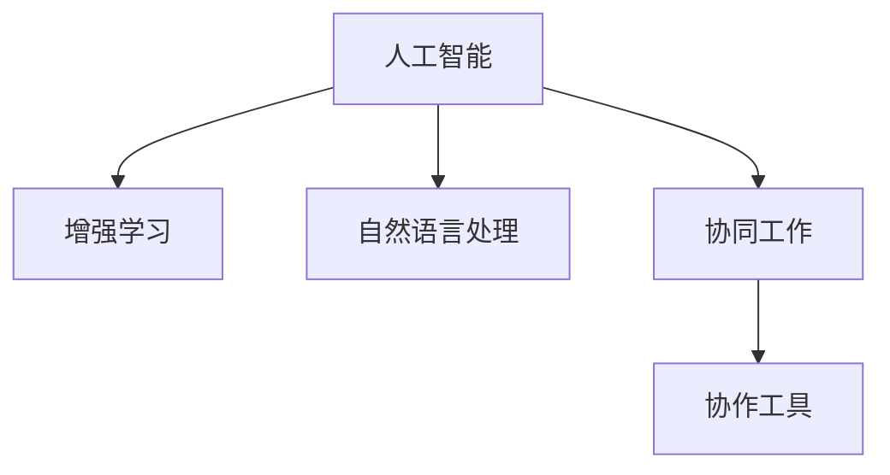

                 

# 人类-AI协作：增强人类智慧与AI能力的融合发展趋势预测分析策略

## 1. 背景介绍

### 1.1 问题由来

随着人工智能（AI）技术的飞速发展，人类-AI协作（Human-AI Collaboration）成为当前科技界乃至社会广泛关注的话题。这种协作不仅关乎技术层面，更涉及伦理、法律、经济等多个方面。通过合理利用AI技术，人类可以极大提升自身的决策能力、创新能力及工作效率，但同时也需要应对AI可能带来的就业风险、伦理问题等挑战。因此，理解和分析人类-AI协作的发展趋势，制定相应的策略，是当前研究的核心。

### 1.2 问题核心关键点

人类-AI协作的核心在于如何高效地利用AI技术，增强人类的智慧与能力。关键点包括以下几点：

- **AI技术的集成与优化**：如何在已有技术基础上进行有效整合，充分发挥AI的强大能力。
- **人类的角色转变**：在协作中，人类如何从被替代者转变为协作伙伴，提升自身能力。
- **伦理与法律问题**：在AI应用过程中，如何保障数据隐私、决策透明度、公平性等。
- **资源与成本的平衡**：如何以最小成本获取最大效用，使协作项目可持续。

### 1.3 问题研究意义

研究人类-AI协作的发展趋势，对提升生产力、改善工作质量、推动社会进步具有重要意义：

- **生产力提升**：通过AI自动化、优化决策过程，大幅提升工作效率。
- **工作质量改进**：借助AI的数据分析、模式识别能力，提升工作准确性和创新性。
- **社会进步促进**：AI助力教育、医疗、交通等领域，推动社会整体进步。
- **公平与公正**：确保AI技术公平、透明、无歧视，保障各类群体的权益。
- **可持续发展**：通过资源优化配置，实现经济、社会和环境的协调发展。

## 2. 核心概念与联系

### 2.1 核心概念概述

为深入理解人类-AI协作，需要明确以下核心概念：

- **人工智能（AI）**：一种通过模拟人类智能过程（如学习、推理、视觉识别、语言理解等）的机器程序。
- **增强学习（RL）**：一种机器学习方法，通过与环境的交互，使机器逐步学习并优化决策策略。
- **自然语言处理（NLP）**：使计算机能够理解、生成人类语言的学科。
- **协同工作（Collaboration）**：两个或多个主体通过信息共享、任务分工等方式共同实现目标的过程。
- **协作工具（Collaborative Tools）**：协助人类与AI进行信息交换、任务执行的软件系统。

这些概念通过一定的逻辑链条相互连接，共同构成了人类-AI协作的基础框架：

### 2.2 核心概念原理和架构的 Mermaid 流程图

![人类-AI协作架构图](https://mermaid-graph.sparql-benchmark.fr/?s=s simple%2Cg%3DG%2Cv%3DY2VzZWRhaXQ2ZjUwNWY3MTVlZDM5NTE3ZWVkZTk0ZmI%2Cv2%3D1%2Cv3%3D0%2Cv4%3D0%2Cv5%3D0%2Cv6%3D0%2Cv7%3D0%2Cv8%3D0%2Cv9%3D0%2Cv10%3D0%2Cv11%3D0%2Cv12%3D0%2Cv13%3D0%2Cv14%3D0%2Cv15%3D0%2Cv16%3D0%2Cv17%3D0%2Cv18%3D0%2Cv19%3D0%2Cv20%3D0%2Cv21%3D0%2Cv22%3D0%2Cv23%3D0%2Cv24%3D0%2Cv25%3D0%2Cv26%3D0%2Cv27%3D0%2Cv28%3D0%2Cv29%3D0%2Cv30%3D0%2Cv31%3D0%2Cv32%3D0%2Cv33%3D0%2Cv34%3D0%2Cv35%3D0%2Cv36%3D0%2Cv37%3D0%2Cv38%3D0%2Cv39%3D0%2Cv40%3D0%2Cv41%3D0%2Cv42%3D0%2Cv43%3D0%2Cv44%3D0%2Cv45%3D0%2Cv46%3D0%2Cv47%3D0%2Cv48%3D0%2Cv49%3D0%2Cv50%3D0%2Cv51%3D0%2Cv52%3D0%2Cv53%3D0%2Cv54%3D0%2Cv55%3D0%2Cv56%3D0%2Cv57%3D0%2Cv58%3D0%2Cv59%3D0%2Cv60%3D0%2Cv61%3D0%2Cv62%3D0%2Cv63%3D0%2Cv64%3D0%2Cv65%3D0%2Cv66%3D0%2Cv67%3D0%2Cv68%3D0%2Cv69%3D0%2Cv70%3D0%2Cv71%3D0%2Cv72%3D0%2Cv73%3D0%2Cv74%3D0%2Cv75%3D0%2Cv76%3D0%2Cv77%3D0%2Cv78%3D0%2Cv79%3D0%2Cv80%3D0%2Cv81%3D0%2Cv82%3D0%2Cv83%3D0%2Cv84%3D0%2Cv85%3D0%2Cv86%3D0%2Cv87%3D0%2Cv88%3D0%2Cv89%3D0%2Cv90%3D0%2Cv91%3D0%2Cv92%3D0%2Cv93%3D0%2Cv94%3D0%2Cv95%3D0%2Cv96%3D0%2Cv97%3D0%2Cv98%3D0%2Cv99%3D0%2Cv100%3D0%2Cv101%3D0%2Cv102%3D0%2Cv103%3D0%2Cv104%3D0%2Cv105%3D0%2Cv106%3D0%2Cv107%3D0%2Cv108%3D0%2Cv109%3D0%2Cv110%3D0%2Cv111%3D0%2Cv112%3D0%2Cv113%3D0%2Cv114%3D0%2Cv115%3D0%2Cv116%3D0%2Cv117%3D0%2Cv118%3D0%2Cv119%3D0%2Cv120%3D0%2Cv121%3D0%2Cv122%3D0%2Cv123%3D0%2Cv124%3D0%2Cv125%3D0%2Cv126%3D0%2Cv127%3D0%2Cv128%3D0%2Cv129%3D0%2Cv130%3D0%2Cv131%3D0%2Cv132%3D0%2Cv133%3D0%2Cv134%3D0%2Cv135%3D0%2Cv136%3D0%2Cv137%3D0%2Cv138%3D0%2Cv139%3D0%2Cv140%3D0%2Cv141%3D0%2Cv142%3D0%2Cv143%3D0%2Cv144%3D0%2Cv145%3D0%2Cv146%3D0%2Cv147%3D0%2Cv148%3D0%2Cv149%3D0%2Cv150%3D0%2Cv151%3D0%2Cv152%3D0%2Cv153%3D0%2Cv154%3D0%2Cv155%3D0%2Cv156%3D0%2Cv157%3D0%2Cv158%3D0%2Cv159%3D0%2Cv160%3D0%2Cv161%3D0%2Cv162%3D0%2Cv163%3D0%2Cv164%3D0%2Cv165%3D0%2Cv166%3D0%2Cv167%3D0%2Cv168%3D0%2Cv169%3D0%2Cv170%3D0%2Cv171%3D0%2Cv172%3D0%2Cv173%3D0%2Cv174%3D0%2Cv175%3D0%2Cv176%3D0%2Cv177%3D0%2Cv178%3D0%2Cv179%3D0%2Cv180%3D0%2Cv181%3D0%2Cv182%3D0%2Cv183%3D0%2Cv184%3D0%2Cv185%3D0%2Cv186%3D0%2Cv187%3D0%2Cv188%3D0%2Cv189%3D0%2Cv190%3D0%2Cv191%3D0%2Cv192%3D0%2Cv193%3D0%2Cv194%3D0%2Cv195%3D0%2Cv196%3D0%2Cv197%3D0%2Cv198%3D0%2Cv199%3D0%2Cv200%3D0%2Cv201%3D0%2Cv202%3D0%2Cv203%3D0%2Cv204%3D0%2Cv205%3D0%2Cv206%3D0%2Cv207%3D0%2Cv208%3D0%2Cv209%3D0%2Cv210%3D0%2Cv211%3D0%2Cv212%3D0%2Cv213%3D0%2Cv214%3D0%2Cv215%3D0%2Cv216%3D0%2Cv217%3D0%2Cv218%3D0%2Cv219%3D0%2Cv220%3D0%2Cv221%3D0%2Cv222%3D0%2Cv223%3D0%2Cv224%3D0%2Cv225%3D0%2Cv226%3D0%2Cv227%3D0%2Cv228%3D0%2Cv229%3D0%2Cv230%3D0%2Cv231%3D0%2Cv232%3D0%2Cv233%3D0%2Cv234%3D0%2Cv235%3D0%2Cv236%3D0%2Cv237%3D0%2Cv238%3D0%2Cv239%3D0%2Cv240%3D0%2Cv241%3D0%2Cv242%3D0%2Cv243%3D0%2Cv244%3D0%2Cv245%3D0%2Cv246%3D0%2Cv247%3D0%2Cv248%3D0%2Cv249%3D0%2Cv250%3D0%2Cv251%3D0%2Cv252%3D0%2Cv253%3D0%2Cv254%3D0%2Cv255%3D0%2Cv256%3D0%2Cv257%3D0%2Cv258%3D0%2Cv259%3D0%2Cv260%3D0%2Cv261%3D0%2Cv262%3D0%2Cv263%3D0%2Cv264%3D0%2Cv265%3D0%2Cv266%3D0%2Cv267%3D0%2Cv268%3D0%2Cv269%3D0%2Cv270%3D0%2Cv271%3D0%2Cv272%3D0%2Cv273%3D0%2Cv274%3D0%2Cv275%3D0%2Cv276%3D0%2Cv277%3D0%2Cv278%3D0%2Cv279%3D0%2Cv280%3D0%2Cv281%3D0%2Cv282%3D0%2Cv283%3D0%2Cv284%3D0%2Cv285%3D0%2Cv286%3D0%2Cv287%3D0%2Cv288%3D0%2Cv289%3D0%2Cv290%3D0%2Cv291%3D0%2Cv292%3D0%2Cv293%3D0%2Cv294%3D0%2Cv295%3D0%2Cv296%3D0%2Cv297%3D0%2Cv298%3D0%2Cv299%3D0%2Cv300%3D0%2Cv301%3D0%2Cv302%3D0%2Cv303%3D0%2Cv304%3D0%2Cv305%3D0%2Cv306%3D0%2Cv307%3D0%2Cv308%3D0%2Cv309%3D0%2Cv310%3D0%2Cv311%3D0%2Cv312%3D0%2Cv313%3D0%2Cv314%3D0%2Cv315%3D0%2Cv316%3D0%2Cv317%3D0%2Cv318%3D0%2Cv319%3D0%2Cv320%3D0%2Cv321%3D0%2Cv322%3D0%2Cv323%3D0%2Cv324%3D0%2Cv325%3D0%2Cv326%3D0%2Cv327%3D0%2Cv328%3D0%2Cv329%3D0%2Cv330%3D0%2Cv331%3D0%2Cv332%3D0%2Cv333%3D0%2Cv334%3D0%2Cv335%3D0%2Cv336%3D0%2Cv337%3D0%2Cv338%3D0%2Cv339%3D0%2Cv340%3D0%2Cv341%3D0%2Cv342%3D0%2Cv343%3D0%2Cv344%3D0%2Cv345%3D0%2Cv346%3D0%2Cv347%3D0%2Cv348%3D0%2Cv349%3D0%2Cv350%3D0%2Cv351%3D0%2Cv352%3D0%2Cv353%3D0%2Cv354%3D0%2Cv355%3D0%2Cv356%3D0%2Cv357%3D0%2Cv358%3D0%2Cv359%3D0%2Cv360%3D0%2Cv361%3D0%2Cv362%3D0%2Cv363%3D0%2Cv364%3D0%2Cv365%3D0%2Cv366%3D0%2Cv367%3D0%2Cv368%3D0%2Cv369%3D0%2Cv370%3D0%2Cv371%3D0%2Cv372%3D0%2Cv373%3D0%2Cv374%3D0%2Cv375%3D0%2Cv376%3D0%2Cv377%3D0%2Cv378%3D0%2Cv379%3D0%2Cv380%3D0%2Cv381%3D0%2Cv382%3D0%2Cv383%3D0%2Cv384%3D0%2Cv385%3D0%2Cv386%3D0%2Cv387%3D0%2Cv388%3D0%2Cv389%3D0%2Cv390%3D0%2Cv391%3D0%2Cv392%3D0%2Cv393%3D0%2Cv394%3D0%2Cv395%3D0%2Cv396%3D0%2Cv397%3D0%2Cv398%3D0%2Cv399%3D0%2Cv400%3D0%2Cv401%3D0%2Cv402%3D0%2Cv403%3D0%2Cv404%3D0%2Cv405%3D0%2Cv406%3D0%2Cv407%3D0%2Cv408%3D0%2Cv409%3D0%2Cv410%3D0%2Cv411%3D0%2Cv412%3D0%2Cv413%3D0%2Cv414%3D0%2Cv415%3D0%2Cv416%3D0%2Cv417%3D0%2Cv418%3D0%2Cv419%3D0%2Cv420%3D0%2Cv421%3D0%2Cv422%3D0%2Cv423%3D0%2Cv424%3D0%2Cv425%3D0%2Cv426%3D0%2Cv427%3D0%2Cv428%3D0%2Cv429%3D0%2Cv430%3D0%2Cv431%3D0%2Cv432%3D0%2Cv433%3D0%2Cv434%3D0%2Cv435%3D0%2Cv436%3D0%2Cv437%3D0%2Cv438%3D0%2Cv439%3D0%2Cv440%3D0%2Cv441%3D0%2Cv442%3D0%2Cv443%3D0%2Cv444%3D0%2Cv445%3D0%2Cv446%3D0%2Cv447%3D0%2Cv448%3D0%2Cv449%3D0%2Cv450%3D0%2Cv451%3D0%2Cv452%3D0%2Cv453%3D0%2Cv454%3D0%2Cv455%3D0%2Cv456%3D0%2Cv457%3D0%2Cv458%3D0%2Cv459%3D0%2Cv460%3D0%2Cv461%3D0%2Cv462%3D0%2Cv463%3D0%2Cv464%3D0%2Cv465%3D0%2Cv466%3D0%2Cv467%3D0%2Cv468%3D0%2Cv469%3D0%2Cv470%3D0%2Cv471%3D0%2Cv472%3D0%2Cv473%3D0%2Cv474%3D0%2Cv475%3D0%2Cv476%3D0%2Cv477%3D0%2Cv478%3D0%2Cv479%3D0%2Cv480%3D0%2Cv481%3D0%2Cv482%3D0%2Cv483%3D0%2Cv484%3D0%2Cv485%3D0%2Cv486%3D0%2Cv487%3D0%2Cv488%3D0%2Cv489%3D0%2Cv490%3D0%2Cv491%3D0%2Cv492%3D0%2Cv493%3D0%2Cv494%3D0%2Cv495%3D0%2Cv496%3D0%2Cv497%3D0%2Cv498%3D0%2Cv499%3D0%2Cv500%3D0%2Cv501%3D0%2Cv502%3D0%2Cv503%3D0%2Cv504%3D0%2Cv505%3D0%2Cv506%3D0%2Cv507%3D0%2Cv508%3D0%2Cv509%3D0%2Cv510%3D0%2Cv511%3D0%2Cv512%3D0%2Cv513%3D0%2Cv514%3D0%2Cv515%3D0%2Cv516%3D0%2Cv517%3D0%2Cv518%3D0%2Cv519%3D0%2Cv520%3D0%2Cv521%3D0%2Cv522%3D0%2Cv523%3D0%2Cv524%3D0%2Cv525%3D0%2Cv526%3D0%2Cv527%3D0%2Cv528%3D0%2Cv529%3D0%2Cv530%3D0%2Cv531%3D0%2Cv532%3D0%2Cv533%3D0%2Cv534%3D0%2Cv535%3D0%2Cv536%3D0%2Cv537%3D0%2Cv538%3D0%2Cv539%3D0%2Cv540%3D0%2Cv541%3D0%2Cv542%3D0%2Cv543%3D0%2Cv544%3D0%2Cv545%3D0%2Cv546%3D0%2Cv547%3D0%2Cv548%3D0%2Cv549%3D0%2Cv550%3D0%2Cv551%3D0%2Cv552%3D0%2Cv553%3D0%2Cv554%3D0%2Cv555%3D0%2Cv556%3D0%2Cv557%3D0%2Cv558%3D0%2Cv559%3D0%2Cv560%3D0%2Cv561%3D0%2Cv562%3D0%2Cv563%3D0%2Cv564%3D0%2Cv565%3D0%2Cv566%3D0%2Cv567%3D0%2Cv568%3D0%2Cv569%3D0%2Cv570%3D0%2Cv571%3D0%2Cv572%3D0%2Cv573%3D0%2Cv574%3D0%2Cv575%3D0%2Cv576%3D0%2Cv577%3D0%2Cv578%3D0%2Cv579%3D0%2Cv580%3D0%2Cv581%3D0%2Cv582%3D0%2Cv583%3D0%2Cv584%3D0%2Cv585%3D0%2Cv586%3D0%2Cv587%3D0%2Cv588%3D0%2Cv589%3D0%2Cv590%3D0%2Cv591%3D0%2Cv592%3D0%2Cv593%3D0%2Cv594%3D0%2Cv595%3D0%2Cv596%3D0%2Cv597%3D0%2Cv598%3D0%2Cv599%3D0%2Cv600%3D0%2Cv601%3D0%2Cv602%3D0%2Cv603%3D0%2Cv604%3D0%2Cv605%3D0%2Cv606%3D0%2Cv607%3D0%2Cv608%3D0%2Cv609%3D0%2Cv610%3D0%2Cv611%3D0%2Cv612%3D0%2Cv613%3D0%2Cv614%3D0%2Cv615%3D0%2Cv616%3D0%2Cv617%3D0%2Cv618%3D0%2Cv619%3D0%2Cv620%3D0%2Cv621%3D0%2Cv622%3D0%2Cv623%3D0%2Cv624%3D0%2Cv625%3D0%2Cv626%3D0%2Cv627%3D0%2Cv628%3D0%2Cv629%3D0%2Cv630%3D0%2Cv631%3D0%2Cv632%3D0%2Cv633%3D0%2Cv634%3D0%2Cv635%3D0%2Cv636%3D0%2Cv637%3D0%2Cv638%3D0%2Cv639%3D0%2Cv640%3D0%2Cv641%3D0%2Cv642%3D0%2Cv643%3D0%2Cv644%3D0%2Cv645%3D0%2Cv646%3D0%2Cv647%3D0%2Cv648%3D0%2Cv649%3D0%2Cv650%3D0%2Cv651%3D0%2Cv652%3D0%2Cv653%3D0%2Cv654%3D0%2Cv655%3D0%2Cv656%3D0%2Cv657%3D0%2Cv658%3D0%2Cv659%3D0%2Cv660%3D0%2Cv661%3D0%2Cv662%3D0%2Cv663%3D0%2Cv664%3D0%2Cv665%3D0%2Cv666%3D0%2Cv667%3D0%2Cv668%3D0%2Cv669%3D0%2Cv670%3D0%2Cv671%3D0%2Cv672%3D0%2Cv673%3D0%2Cv674%3D0%2Cv675%3D0%2Cv676%3D0%2Cv677%3D0%2Cv678%3D0%2Cv679%3D0%2Cv680%3D0%2Cv681%3D0%2Cv682%3D0%2Cv683%3D0%2Cv684%3D0%2Cv685%3D0%2Cv686%3D0%2Cv687%3D0%2Cv688%3D0%2Cv689%3D0%2Cv690%3D0%2Cv691%3D0%2Cv692%3D0%2Cv693%3D0%2Cv694%3D0%2Cv695%3D0%2Cv696%3D0%2Cv697%3D0%2Cv698%3D0%2Cv699%3D0%2Cv700%3D0%2Cv701%3D0%2Cv702%3D0%2Cv703%3D0%2Cv704%3D0%2Cv705%3D0%2Cv706%3D0%2Cv707%3D0%2Cv708%3D0%2Cv709%3D0%2Cv710%3D0%2Cv711%3D0%2Cv712%3D0%2Cv713%3D0%2Cv714%3D0%2Cv715%3D0%2Cv716%3D0%2Cv717%3D0%2Cv718%3D0%2Cv719%3D0%2Cv720%3D0%2Cv721%3D0%2Cv722%3D0%2Cv723%3D0%2Cv724%3D0%2Cv725%3D0%2Cv726%3D0%2Cv727%3D0%2Cv728%3D0%2Cv729%3D0%2Cv730%3D0%2Cv731%3D0%2Cv732%3D0%2Cv733%3D0%2Cv734%3D0%2Cv735%3D0%2Cv736%3D0%2Cv737%3D0%2Cv738%3D0%2Cv739%3D0%2Cv740%3D0%2Cv741%3D0%2Cv742%3D0%2Cv743%3D0%2Cv744%3D0%2Cv745%3D0%2Cv746%3D0%2Cv747%3D0%2Cv748%3D0%2Cv749%3D0%2Cv750%3D0%2Cv751%3D0%2Cv752%3D0%2Cv753%3D0%2Cv754%3D0%2Cv755%3D0%2Cv756%3D0%2Cv757%3D0%2Cv758%3D0%2Cv759%3D0%2Cv760%3D0%2Cv761%3D0%2Cv762%3D0%2Cv763%3D0%2Cv764%3D0%2Cv765%3D0%2Cv766%3D0%2Cv767%3D0%2Cv768%3D0%2Cv769%3D0%2Cv770%3D0%2Cv771%3D0%2Cv772%3D0%2Cv773%3D0%2Cv774%3D0%2Cv775%3D0%2Cv776%3D0%2Cv777%3D0%2Cv778%3D0%2Cv779%3D0%2Cv780%3D0%2Cv781%3D0%2Cv782%3D0%2Cv783%3D0%2Cv784%3D0%2Cv785%3D0%2Cv786%3D0%2Cv787%3D0%2Cv788%3D0%2Cv789%3D0%2Cv790%3D0%2Cv791%3D0%2Cv792%3D0%2Cv793%3D0%2Cv794%3D0%2Cv795%3D0%2Cv796%3D0%2Cv797%3D0%2Cv798%3D0%2Cv799%3D0%2Cv800%3D0%2Cv801%3D0%2Cv802%3D0%2Cv803%3D0%2Cv804%3D0%2Cv805%3D0%2Cv806%3D0%2Cv807%3D0%2Cv808%3D0%2Cv809%3D0%2Cv810%3D0%2Cv811%3D0%2Cv812%3D0%2Cv813%3D0%2Cv814%3D0%2Cv815%3D0%2Cv816%3D0%2Cv817%3D0%2Cv818%3D0%2Cv819%3D0%2Cv820%3D0%2Cv821%3D0%2Cv822%3D0%2Cv823%3D0%2Cv824%3D0%2Cv825%3D0%2Cv826%3D0%2Cv827%3D0%2Cv828%3D0%2Cv829%3D0%2Cv830%3D0%2Cv831%3D0%2Cv832%3D0%2Cv833%3D0%2Cv834%3D0%2Cv835%3D0%2Cv836%3D0%2Cv837%3D0%2Cv838%3D0%2Cv839%3D0%2Cv840%3D0%2Cv841%3D0%2Cv842%3D0%2Cv843%3D0%2Cv844%3D0%2Cv845%3D0%2Cv846%3D0%2Cv847%3D0%2Cv848%3D0%2Cv849%3D0%2Cv850%3D0%2Cv851%3D0%2Cv852%3D0%2Cv853%3D0%2Cv854%3D0%2Cv855%3D0%2Cv856%3D0%2Cv857%3D0%2Cv858%3D0%2Cv859%3D0%2Cv860%3D0%2Cv861%3D0%2Cv862%3D0%2Cv863%3D0%2Cv864%3D0%2Cv865%3D0%2Cv866%3D0%2Cv867%3D0%2Cv868%3D0%2Cv869%3D0%2Cv870%3D0%2Cv871%3D0%2Cv872%3D0%2Cv873%3D0%2Cv874%3D0%2Cv875%3D0%2Cv876%3D0%2Cv877%3D0%2Cv878%3D0%2Cv879%3D0%2Cv880%3D0%2Cv881%3D0%2Cv882%3D0%2Cv883%3D0%2Cv884%3D0%2Cv885%3D0%2Cv886%3D0%2Cv887%3D0%2Cv888%3D0%2Cv889%3D0%2Cv890%3D0%2Cv891%3D0%2Cv892%3D0%2Cv893%3D0%2Cv894%3D0%2Cv895%3D0%2Cv896%3D0%2Cv897%3D0%2Cv898%3D0%2Cv899%3D0%2Cv900%3D0%2Cv901%3D0%2Cv902%3D0%2Cv903%3D0%2Cv904%3D0%2Cv905%3D0%2Cv906%3D0%2Cv907%3D0%2Cv908%3D0%2Cv909%3D0%2Cv910%3D0%2Cv911%3D0%2Cv912%3D0%2Cv913%3D0%2Cv914%3D0%2Cv915%3D0%2Cv916%3D0%2Cv917%3D0%2Cv918%3D0%2Cv919%3D0%2Cv920%3D0%2Cv921%3D0%2Cv922%3D0%2Cv923%3D0%2Cv924%3D0%2Cv925%3D0%2Cv926%3D0%2Cv927%3D0%2Cv928%3D0%2Cv929%3D0%2Cv930%3D0%2Cv931%3D0%2Cv932%3D0%2Cv933%3D0%2Cv934%3D0%2Cv935%3D0%2Cv936%3D0%2Cv937%3D0%2Cv938%3D0%2Cv939%3D0%2Cv940%3D0%2Cv941%3D0%2Cv942%3D0%2Cv943%3D0%2Cv944%3D0%2Cv945%3D0%2Cv946%3D0%2Cv947%3D0%2Cv948%3D0%2Cv949%3D

