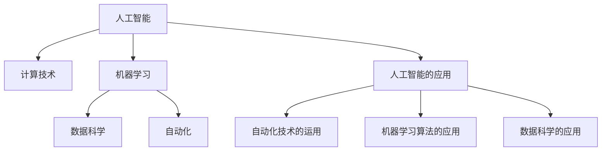

                 

# 人类计算的未来：趋势、机遇与挑战并存

> 关键词：人工智能,计算技术,机器学习,数据科学,自动化

## 1. 背景介绍

### 1.1 问题由来
随着科技的飞速发展，人类社会的方方面面都开始依赖于计算技术。从工业自动化到医疗诊断，从金融交易到社交网络，计算已经渗透到了人类生活的各个角落。然而，传统的计算范式面临着诸多挑战，如效率低下、成本高昂、易出错等问题。如何构建更加高效、灵活、智能的计算体系，成为了当下的一个热门话题。

### 1.2 问题核心关键点
本文将重点探讨计算技术未来的发展趋势、机遇与挑战，主要关注以下几个方面：
- 人工智能在计算中的应用及其前景
- 机器学习算法的发展与未来方向
- 数据科学的重要性与挑战
- 自动化技术对计算的影响与挑战

## 2. 核心概念与联系

### 2.1 核心概念概述

为更好地理解计算技术未来的发展方向，本节将介绍几个密切相关的核心概念：

- 人工智能(Artificial Intelligence, AI)：通过计算机模拟人的智能行为，包括感知、学习、推理、决策等能力。
- 计算技术(Computational Technology)：使用计算机和相关技术，解决实际问题的过程。
- 机器学习(Machine Learning, ML)：让计算机通过数据和算法，自动地从经验中学习规律，并应用到新数据中。
- 数据科学(Data Science)：一门结合统计学、计算机科学和数学，从数据中提取知识和洞察的学科。
- 自动化(Automation)：使用计算机技术，自动执行重复性任务，提高效率和准确性。

这些核心概念之间的逻辑关系可以通过以下Mermaid流程图来展示：



这个流程图展示了一系列的计算技术及其应用领域，从人工智能到自动化技术，相互之间构成了紧密的联系和依赖。

## 3. 核心算法原理 & 具体操作步骤
### 3.1 算法原理概述

计算技术的发展离不开各种算法原理的支持。以下是几个核心算法的原理概述：

- 深度学习算法：通过多层神经网络，模拟人脑的神经元工作机制，自动提取数据特征，用于图像识别、语音识别、自然语言处理等任务。
- 优化算法：如梯度下降、Adam、Adagrad等，通过不断调整参数，最小化损失函数，优化模型性能。
- 聚类算法：如K-means、层次聚类等，将数据分组，发现数据的内在结构。
- 决策树算法：通过构建树形结构，进行分类和回归任务。

### 3.2 算法步骤详解

计算技术的具体操作流程包括以下几个关键步骤：

**Step 1: 数据预处理**
- 清洗数据：去除噪声、处理缺失值、标准化数据等。
- 特征提取：选择或生成能够代表数据特征的变量。
- 数据分割：将数据分为训练集、验证集和测试集，用于模型评估和优化。

**Step 2: 模型训练**
- 选择合适的算法和模型：根据任务类型和数据特征，选择适合的算法和模型。
- 模型参数初始化：设置模型参数的初始值，如权重、偏置等。
- 训练模型：使用训练集数据，不断调整模型参数，最小化损失函数，直到收敛。

**Step 3: 模型评估**
- 使用验证集评估模型性能：计算准确率、召回率、F1值等指标，评估模型泛化能力。
- 调整模型参数：根据评估结果，调整模型参数，如学习率、正则化系数等。

**Step 4: 模型应用**
- 部署模型：将训练好的模型部署到实际应用系统中，如Web服务、移动应用等。
- 数据处理：对新数据进行预处理，确保数据格式一致。
- 模型推理：将新数据输入模型，输出预测结果。

### 3.3 算法优缺点

计算技术的发展带来了诸多好处，但也存在一些局限性：

**优点：**
- 自动化程度高：解放了人工，提高了效率和准确性。
- 可扩展性强：能够处理大规模数据，适用于各种应用场景。
- 精度高：通过不断优化算法和模型，可以提高计算的准确性。

**缺点：**
- 依赖数据质量：数据质量不高会导致模型性能下降。
- 算法复杂度高：一些复杂算法需要大量计算资源。
- 易受攻击：模型容易受到对抗样本的攻击。

### 3.4 算法应用领域

计算技术的应用领域广泛，包括但不限于以下几个方面：

- 工业自动化：通过机器人和自动化设备，提高生产效率和质量。
- 医疗诊断：使用数据分析和图像处理技术，辅助医生进行诊断。
- 金融交易：使用算法进行高频交易和风险控制。
- 智能交通：通过数据分析和机器学习，优化交通流量和提高安全。
- 智慧城市：使用传感器和数据分析技术，提升城市管理水平。

这些应用领域展示了计算技术的强大潜力和广阔前景。

## 4. 数学模型和公式 & 详细讲解 & 举例说明

### 4.1 数学模型构建

计算技术中的许多算法依赖于数学模型和公式，以下是几个常见模型的构建：

- 线性回归模型：用于建立变量之间的线性关系，公式为：$y = \beta_0 + \beta_1x_1 + \cdots + \beta_nx_n + \epsilon$。
- 逻辑回归模型：用于二分类问题，公式为：$\log \frac{p(y=1|x)}{p(y=0|x)} = \beta_0 + \beta_1x_1 + \cdots + \beta_nx_n$。
- 决策树模型：用于分类和回归，构建树形结构，公式为：$y = f(x) = g_k\left(x\right)$，其中$g_k$为决策树的分支函数。

### 4.2 公式推导过程

以线性回归模型为例，推导其最小二乘法的公式。设训练集为$(x_i, y_i)$，其中$x_i \in \mathbb{R}^n$，$y_i \in \mathbb{R}$。模型的损失函数为均方误差损失：

$$
L(\beta) = \frac{1}{N}\sum_{i=1}^N (y_i - f_{\beta}(x_i))^2
$$

其中$f_{\beta}(x) = \beta_0 + \beta_1x_1 + \cdots + \beta_nx_n$为线性回归模型。

求导得：

$$
\frac{\partial L(\beta)}{\partial \beta_j} = \frac{2}{N}\sum_{i=1}^N (y_i - f_{\beta}(x_i))x_{ij}
$$

令导数等于0，解得$\beta$：

$$
\beta = (X^TX)^{-1}X^Ty
$$

其中$X = \begin{bmatrix}1 & x_{11} & \cdots & x_{1n} \\ 1 & x_{21} & \cdots & x_{2n} \\ \vdots & \vdots & \ddots & \vdots \\ 1 & x_{N1} & \cdots & x_{Nn}\end{bmatrix}$，$y = \begin{bmatrix}y_1 \\ y_2 \\ \vdots \\ y_N\end{bmatrix}$。

### 4.3 案例分析与讲解

以图像分类任务为例，展示机器学习算法的应用。使用卷积神经网络(Convolutional Neural Network, CNN)进行图像分类。

- 数据预处理：将图像转化为灰度图，并进行归一化。
- 模型构建：选择卷积层、池化层、全连接层等构建CNN模型。
- 模型训练：使用随机梯度下降(SGD)算法，最小化交叉熵损失函数。
- 模型评估：在验证集上评估模型性能，调整超参数。
- 模型应用：将新图像输入模型，输出分类结果。

## 5. 项目实践：代码实例和详细解释说明
### 5.1 开发环境搭建

在进行计算技术项目开发前，需要先搭建好开发环境。以下是使用Python进行TensorFlow开发的常见环境配置流程：

1. 安装Anaconda：从官网下载并安装Anaconda，用于创建独立的Python环境。
2. 创建并激活虚拟环境：
```bash
conda create -n tf-env python=3.8 
conda activate tf-env
```

3. 安装TensorFlow：根据CUDA版本，从官网获取对应的安装命令。例如：
```bash
conda install tensorflow -c pytorch -c conda-forge
```

4. 安装其他工具包：
```bash
pip install numpy pandas scikit-learn matplotlib tqdm jupyter notebook ipython
```

完成上述步骤后，即可在`tf-env`环境中开始计算技术项目开发。

### 5.2 源代码详细实现

这里以图像分类任务为例，展示使用TensorFlow构建卷积神经网络(CNN)的代码实现。

```python
import tensorflow as tf
from tensorflow.keras import layers

# 定义CNN模型
model = tf.keras.Sequential([
    layers.Conv2D(32, (3, 3), activation='relu', input_shape=(28, 28, 1)),
    layers.MaxPooling2D((2, 2)),
    layers.Flatten(),
    layers.Dense(10, activation='softmax')
])

# 编译模型
model.compile(optimizer='adam', loss='sparse_categorical_crossentropy', metrics=['accuracy'])

# 加载数据集
mnist = tf.keras.datasets.mnist
(x_train, y_train), (x_test, y_test) = mnist.load_data()
x_train, x_test = x_train / 255.0, x_test / 255.0

# 训练模型
model.fit(x_train, y_train, epochs=10, validation_data=(x_test, y_test))

# 评估模型
model.evaluate(x_test, y_test)
```

可以看到，TensorFlow提供了丰富的API和工具，可以方便地构建和训练计算模型。开发者可以专注于算法设计和数据处理，而不必过多关注底层实现。

### 5.3 代码解读与分析

让我们再详细解读一下关键代码的实现细节：

**定义CNN模型**：
- `tf.keras.Sequential`：使用Keras API构建序列模型，支持添加各种层次和激活函数。
- `layers.Conv2D`：添加卷积层，用于特征提取。
- `layers.MaxPooling2D`：添加池化层，减小特征图尺寸，防止过拟合。
- `layers.Flatten`：将二维特征图展开成一维向量，用于全连接层。
- `layers.Dense`：添加全连接层，进行分类。

**模型编译**：
- `model.compile`：配置模型优化器、损失函数和评估指标。
- `optimizer`：选择优化算法，如Adam优化器。
- `loss`：选择损失函数，如交叉熵损失。
- `metrics`：选择评估指标，如准确率。

**数据加载**：
- `tf.keras.datasets.mnist.load_data()`：加载MNIST数据集。
- `x_train, x_test = x_train / 255.0, x_test / 255.0`：对图像进行归一化处理。

**模型训练**：
- `model.fit`：对模型进行训练，传入训练数据和标签。
- `epochs`：设置训练轮数。
- `validation_data`：指定验证集数据和标签。

**模型评估**：
- `model.evaluate`：评估模型在测试集上的表现，输出准确率等指标。

可以看到，TensorFlow的API设计简洁明了，大大降低了深度学习模型的开发门槛。开发者可以快速构建和训练模型，专注于算法优化和模型评估。

## 6. 实际应用场景
### 6.1 智能医疗

计算技术在医疗领域的应用越来越广泛。智能医疗系统通过数据分析和机器学习技术，辅助医生进行诊断和治疗，提高医疗服务的质量和效率。

例如，使用计算技术对患者历史数据进行分析，预测其疾病发展趋势，提前进行干预和治疗。同时，计算技术可以辅助医生进行影像识别，快速定位病变区域，提供精准治疗方案。

### 6.2 金融风险管理

计算技术在金融领域的应用也非常重要。通过数据分析和机器学习，金融公司可以预测市场趋势，控制风险，优化投资组合。

例如，使用计算技术对海量交易数据进行分析，识别出潜在的欺诈行为，保护投资者利益。同时，计算技术可以预测股票价格走势，提供投资建议，优化资产配置。

### 6.3 智能交通

计算技术在交通领域的应用正在逐步普及。智能交通系统通过数据分析和机器学习，优化交通流量，提高道路使用效率，减少交通事故。

例如，使用计算技术对实时交通数据进行分析，预测交通拥堵情况，提供最优路线建议。同时，计算技术可以辅助交通管理部门进行交通控制，减少交通堵塞和事故。

### 6.4 智慧城市

计算技术在城市管理中的应用正在不断拓展。智慧城市系统通过数据分析和机器学习，提升城市管理水平，改善居民生活品质。

例如，使用计算技术对城市能源数据进行分析，预测能源消耗趋势，优化能源配置。同时，计算技术可以辅助城市管理部门进行垃圾分类和回收，提升垃圾处理效率。

### 6.5 未来应用展望

计算技术的应用领域将不断拓展，未来可能会在更多领域发挥重要作用。以下是几个可能的未来应用场景：

- 智能家居：通过数据分析和机器学习，提升家居智能化水平，提供个性化的生活服务。
- 智能制造：通过数据分析和机器学习，优化生产流程，提高生产效率和产品质量。
- 智能农业：通过数据分析和机器学习，优化农业生产，提高农作物产量和质量。
- 智能教育：通过数据分析和机器学习，提供个性化的教育方案，提升教学质量。

这些应用场景展示了计算技术的广阔前景和巨大潜力。

## 7. 工具和资源推荐
### 7.1 学习资源推荐

为了帮助开发者系统掌握计算技术的基础知识和前沿技术，这里推荐一些优质的学习资源：

1. 《深度学习》书籍：Ian Goodfellow等著，全面介绍了深度学习的基本概念和算法。
2. 《TensorFlow实战》书籍：Chollet著，介绍了TensorFlow的API和应用场景。
3. Coursera《机器学习》课程：Andrew Ng主讲，涵盖机器学习的基本概念和算法。
4. edX《深度学习》课程：Ian Goodfellow等主讲，涵盖深度学习的基本概念和算法。
5. Kaggle：数据科学竞赛平台，提供了丰富的数据集和竞赛机会，帮助开发者提升实战能力。

通过对这些资源的学习实践，相信你一定能够快速掌握计算技术的基础知识和前沿技术，并用于解决实际的计算问题。

### 7.2 开发工具推荐

高效的开发离不开优秀的工具支持。以下是几款用于计算技术开发的常用工具：

1. TensorFlow：由Google主导开发的开源深度学习框架，生产部署方便，适合大规模工程应用。
2. PyTorch：基于Python的开源深度学习框架，灵活方便，适合研究开发。
3. Scikit-learn：用于数据预处理、特征提取和模型训练的Python库。
4. Jupyter Notebook：交互式的笔记本环境，方便开发者进行代码调试和实时计算。
5. Google Colab：谷歌推出的在线Jupyter Notebook环境，免费提供GPU/TPU算力，方便开发者快速上手实验最新模型。

合理利用这些工具，可以显著提升计算技术项目的开发效率，加快创新迭代的步伐。

### 7.3 相关论文推荐

计算技术的发展离不开学界的持续研究。以下是几篇奠基性的相关论文，推荐阅读：

1. AlphaGo论文：DeepMind公司发表的AlphaGo战胜围棋世界冠军的论文，展示了深度学习在复杂决策问题中的应用。
2. ImageNet论文：AlexNet在ImageNet图像分类竞赛中取得优异的成绩，展示了卷积神经网络在图像识别中的强大能力。
3. GAN论文：Goodfellow等发表的生成对抗网络论文，展示了生成模型在图像生成和数据增强中的应用。
4. Hessian论文：Jordan等发表的Hessian矩阵和梯度下降的论文，为深度学习算法提供了重要的数学基础。
5. YOLO论文：Redmon等发表的目标检测论文，展示了卷积神经网络在目标检测中的应用。

这些论文代表了大数据、深度学习技术的发展脉络。通过学习这些前沿成果，可以帮助研究者把握学科前进方向，激发更多的创新灵感。

## 8. 总结：未来发展趋势与挑战

### 8.1 总结

本文对计算技术未来的发展趋势、机遇与挑战进行了全面系统的介绍。首先阐述了计算技术在各个领域的应用前景和重要性，明确了计算技术对人类社会的影响。其次，从算法原理到项目实践，详细讲解了计算技术的应用流程和关键步骤，提供了完整的代码实现和解读。同时，本文还广泛探讨了计算技术在多个行业领域的应用场景，展示了计算技术的强大潜力和广阔前景。

通过本文的系统梳理，可以看到，计算技术在各个领域的应用前景广阔，涵盖了工业、医疗、金融、交通、城市管理等多个方向。受益于大数据、深度学习技术的不断演进，计算技术的应用将越来越广泛，为人类社会带来深远的影响。

### 8.2 未来发展趋势

展望未来，计算技术的发展将呈现以下几个趋势：

1. 算法复杂度提升：随着算法的不断优化，计算模型的复杂度将不断提升，解决更复杂的计算问题。
2. 数据规模扩大：随着数据采集技术的进步，数据规模将不断扩大，为计算技术提供更多的训练数据。
3. 自动化程度提高：自动化技术将不断成熟，解放人工，提高计算效率和准确性。
4. 应用场景拓展：计算技术将在更多领域发挥作用，提升各行各业的生产效率和质量。
5. 智能算法涌现：智能算法将不断涌现，如自适应学习、强化学习等，提升计算模型的智能水平。

这些趋势展示了计算技术的广阔前景和巨大潜力。

### 8.3 面临的挑战

尽管计算技术的发展前景广阔，但在迈向更加智能化、普适化应用的过程中，它仍面临诸多挑战：

1. 数据质量问题：数据质量不高会导致模型性能下降，需要更多的数据清洗和预处理。
2. 计算资源瓶颈：大规模深度学习模型的计算需求高，需要高性能的计算设备和网络环境。
3. 算法复杂度高：复杂的算法需要更多的时间和计算资源，需要优化算法和模型结构。
4. 模型可解释性不足：深度学习模型往往是"黑盒"系统，难以解释其内部工作机制和决策逻辑。
5. 应用场景限制：计算技术在某些特殊场景下可能难以应用，需要更多的研究和探索。

这些挑战需要学界和产业界的共同努力，不断创新和改进，才能进一步推动计算技术的发展。

### 8.4 研究展望

面对计算技术面临的挑战，未来的研究需要在以下几个方面寻求新的突破：

1. 数据质量提升：研究更高效的数据清洗和预处理技术，提升数据质量。
2. 计算资源优化：优化计算算法和模型结构，减少计算资源消耗。
3. 模型可解释性：开发可解释性更强的算法和模型，提高计算模型的透明度和可信度。
4. 应用场景拓展：探索计算技术在更多领域的应用场景，推动技术普及。
5. 人工智能融合：将人工智能技术与计算技术融合，提升计算模型的智能水平。

这些研究方向的探索，必将引领计算技术迈向更高的台阶，为构建安全、可靠、智能的计算系统铺平道路。

## 9. 附录：常见问题与解答

**Q1：计算技术的应用范围有哪些？**

A: 计算技术的应用范围非常广泛，涵盖工业、医疗、金融、交通、城市管理等多个领域。例如，工业自动化、医疗诊断、金融交易、智能交通、智慧城市等。

**Q2：如何提升计算模型的性能？**

A: 提升计算模型的性能可以从以下几个方面入手：
1. 数据预处理：清洗数据，进行特征提取和数据增强。
2. 算法优化：选择合适的算法和模型，进行超参数调优。
3. 模型集成：使用集成学习技术，组合多个模型的预测结果。
4. 硬件升级：使用高性能的计算设备和网络环境。
5. 技术创新：探索新的算法和模型，如生成对抗网络、自适应学习等。

**Q3：计算技术面临的挑战有哪些？**

A: 计算技术面临的挑战主要包括以下几个方面：
1. 数据质量问题：数据质量不高会导致模型性能下降。
2. 计算资源瓶颈：大规模深度学习模型的计算需求高，需要高性能的计算设备和网络环境。
3. 算法复杂度高：复杂的算法需要更多的时间和计算资源。
4. 模型可解释性不足：深度学习模型往往是"黑盒"系统，难以解释其内部工作机制和决策逻辑。
5. 应用场景限制：计算技术在某些特殊场景下可能难以应用。

**Q4：未来计算技术的趋势是什么？**

A: 未来计算技术的趋势主要包括：
1. 算法复杂度提升：随着算法的不断优化，计算模型的复杂度将不断提升，解决更复杂的计算问题。
2. 数据规模扩大：随着数据采集技术的进步，数据规模将不断扩大，为计算技术提供更多的训练数据。
3. 自动化程度提高：自动化技术将不断成熟，解放人工，提高计算效率和准确性。
4. 应用场景拓展：计算技术将在更多领域发挥作用，提升各行各业的生产效率和质量。
5. 智能算法涌现：智能算法将不断涌现，如自适应学习、强化学习等，提升计算模型的智能水平。

**Q5：如何应对计算技术面临的挑战？**

A: 应对计算技术面临的挑战需要从以下几个方面入手：
1. 数据质量提升：研究更高效的数据清洗和预处理技术，提升数据质量。
2. 计算资源优化：优化计算算法和模型结构，减少计算资源消耗。
3. 模型可解释性：开发可解释性更强的算法和模型，提高计算模型的透明度和可信度。
4. 应用场景拓展：探索计算技术在更多领域的应用场景，推动技术普及。
5. 人工智能融合：将人工智能技术与计算技术融合，提升计算模型的智能水平。

这些挑战需要学界和产业界的共同努力，不断创新和改进，才能进一步推动计算技术的发展。

