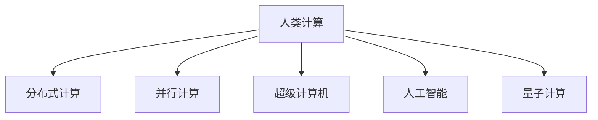

                 

# 人类计算：应用与案例分析

> 关键词：人类计算, 应用, 案例分析, 计算复杂度, 分布式计算, 并行计算, 超级计算机, 人工智能, 量子计算

## 1. 背景介绍

### 1.1 问题由来

随着现代科技的发展，计算机在各个领域的应用日益深入。然而，尽管计算机性能在不断提升，但某些复杂计算任务仍然超出了当前计算能力。针对这些问题，人类计算这一概念应运而生。人类计算是利用人类自身的计算能力，辅助计算机处理超大规模或高复杂度的计算任务。在当前科技发展水平下，这一方法仍然具有重要的现实意义。

### 1.2 问题核心关键点

1. **计算复杂度**：人类计算的根本目的在于解决计算复杂度高、难以在合理时间内完成的计算问题。这些问题往往涉及到数理逻辑、算法设计、数据分析等领域。
2. **计算能力**：人类计算的关键在于充分利用人类自身的计算能力，如逻辑推理、模式识别、问题求解等。人类与计算机的协作可以有效提升计算效率。
3. **应用场景**：人类计算适用于各种需要高精度、高效率计算的任务，如密码学、生物信息学、金融分析、人工智能等领域。

### 1.3 问题研究意义

研究人类计算，不仅能够提升计算效率，还能推动科技发展，促进各领域的应用创新。具体而言：

- 提升计算效率：利用人类与计算机的协同工作，可以大大提升计算速度和精度。
- 推动科技发展：人类计算的实践和理论研究能够促进新算法、新理论的产生，推动科技进步。
- 促进应用创新：人类计算为复杂问题的求解提供了新思路，推动了人工智能、生物信息学等前沿领域的突破。

## 2. 核心概念与联系

### 2.1 核心概念概述

为更好地理解人类计算的应用与案例分析，本节将介绍几个关键概念：

- **人类计算**：指利用人类自身的计算能力，辅助计算机解决计算复杂度高、难以在合理时间内完成的计算任务。人类计算常应用于密码学、生物信息学、人工智能等领域。
- **分布式计算**：指将计算任务分解成多个子任务，在不同的计算机节点上并行处理，以达到提高计算效率的目的。
- **并行计算**：指在同一时刻使用多个处理器处理同一计算任务的不同部分，从而提升计算速度。
- **超级计算机**：指具有超高计算能力和存储能力的计算机系统，用于处理极端复杂的计算任务。
- **人工智能**：指通过计算机模拟人类智能，实现自主学习、问题求解等功能的技术。
- **量子计算**：指利用量子力学原理，进行高效、并行计算的技术，未来有望解决当前计算技术难以处理的复杂问题。

这些核心概念之间的逻辑关系可以通过以下Mermaid流程图来展示：



这个流程图展示了几类关键计算技术的相互关系：

1. 人类计算通过分布式、并行、超级计算机等技术手段，提升了计算效率。
2. 人工智能技术利用人类计算能力，进一步提升了计算的智能化和自动化水平。
3. 量子计算作为未来计算技术的重要发展方向，有望解决当前计算技术难以处理的问题。

## 3. 核心算法原理 & 具体操作步骤

### 3.1 算法原理概述

人类计算的核心在于将复杂的计算任务分解成多个子任务，利用人类的计算能力与计算机协同工作，以达到高效、精确的计算目标。

具体来说，人类计算的流程如下：

1. **问题分解**：将原始计算问题分解成多个子问题。
2. **任务分配**：将子问题分配给不同的人类或计算机节点进行处理。
3. **协同计算**：人类与计算机协同工作，逐步解决子问题。
4. **结果汇总**：将子问题的结果汇总，得到最终计算结果。

### 3.2 算法步骤详解

人类计算的算法步骤如下：

1. **问题定义**：明确计算问题的定义和目标，识别问题的复杂度。
2. **任务分解**：将计算问题分解成多个子问题，每个子问题应具有明确的目标和边界。
3. **任务分配**：根据任务特点，将子问题分配给不同的人类计算者或计算机节点，确保任务均衡分配。
4. **协同计算**：各参与者或节点进行协同计算，逐步解决子问题。
5. **结果汇总**：将子问题的结果进行汇总和融合，得到最终的计算结果。

### 3.3 算法优缺点

人类计算的优点包括：

1. **高效性**：通过分布式、并行计算，可以大大提升计算效率。
2. **精确性**：人类计算可以处理高精度、高复杂度的问题，避免计算机精度不足的问题。
3. **灵活性**：人类计算能够适应不同的计算场景和需求，具有高度的灵活性。

缺点包括：

1. **成本高**：需要大量的人类计算者参与，成本较高。
2. **时间长**：协同计算过程复杂，需要较长的时间才能完成。
3. **协调难度大**：需要高效协调各参与者或节点的计算过程，协同难度较大。

### 3.4 算法应用领域

人类计算的应用领域包括但不限于：

- **密码学**：用于破解复杂密码算法，保护数据安全。
- **生物信息学**：用于分析基因序列、蛋白质结构等复杂生物数据。
- **金融分析**：用于高精度、高复杂度的金融模型计算。
- **人工智能**：用于复杂算法和模型的优化和验证。
- **工程设计**：用于复杂工程问题的求解和模拟。

## 4. 数学模型和公式 & 详细讲解 & 举例说明

### 4.1 数学模型构建

人类计算的数学模型构建通常包括以下几个关键步骤：

1. **问题定义**：定义计算问题的数学表达式，识别问题的复杂度。
2. **任务分解**：将计算问题分解成多个子问题，每个子问题应具有明确的数学表达式。
3. **任务分配**：根据任务特点，将子问题分配给不同的人类计算者或计算机节点，确保任务均衡分配。
4. **协同计算**：各参与者或节点进行协同计算，逐步解决子问题。
5. **结果汇总**：将子问题的结果进行汇总和融合，得到最终的计算结果。

### 4.2 公式推导过程

以下以密码学中的RSA加密算法为例，推导人类计算的数学模型：

1. **问题定义**：给定两个大素数$p$和$q$，计算它们的乘积$n=pq$，以及欧拉函数$\phi(n)=(p-1)(q-1)$。
2. **任务分解**：将计算问题分解为两个子问题：求解$n$和$\phi(n)$。
3. **任务分配**：将这两个子问题分配给不同的人类计算者进行计算。
4. **协同计算**：各计算者分别计算$n$和$\phi(n)$，并将结果进行汇总。
5. **结果汇总**：将$n$和$\phi(n)$的结果进行汇总，得到最终的计算结果。

### 4.3 案例分析与讲解

RSA加密算法是人类计算的经典案例之一。在实际应用中，RSA加密算法的安全性依赖于两个大素数的计算复杂度。然而，直接计算这两个素数的乘积和欧拉函数，计算复杂度非常高。因此，通常使用人类计算的方式进行破解。

例如，一个大型密码破解团队可以分工协作，一部分人负责分解问题，另一部分人负责计算子问题的结果，最终汇总得到最终的计算结果。这种协作方式可以有效提升计算效率，解决复杂的计算问题。

## 5. 项目实践：代码实例和详细解释说明

### 5.1 开发环境搭建

在进行人类计算的实践前，我们需要准备好开发环境。以下是使用Python进行分布式计算的开发环境配置流程：

1. 安装Anaconda：从官网下载并安装Anaconda，用于创建独立的Python环境。
2. 创建并激活虚拟环境：
```bash
conda create -n distcal_env python=3.8 
conda activate distcal_env
```

3. 安装分布式计算库：
```bash
pip install dask
```

4. 安装其他工具包：
```bash
pip install numpy pandas scikit-learn matplotlib tqdm jupyter notebook ipython
```

完成上述步骤后，即可在`distcal_env`环境中开始分布式计算实践。

### 5.2 源代码详细实现

我们以RSA加密算法为例，给出使用dask库进行分布式计算的Python代码实现。

首先，定义计算任务和结果：

```python
import numpy as np

# 定义素数计算任务
def is_prime(n):
    if n <= 1:
        return False
    for i in range(2, int(np.sqrt(n))+1):
        if n % i == 0:
            return False
    return True

# 定义计算任务
def calculate_prime_factors(n):
    factors = []
    for i in range(2, n):
        if is_prime(i) and n % i == 0:
            factors.append(i)
    return factors

# 定义计算结果
def calculate_product_and_phi(n):
    product = 1
    phi = 1
    for i in range(2, n):
        if is_prime(i):
            product *= i
            phi *= i-1
    return product, phi
```

然后，定义分布式计算函数：

```python
from dask.distributed import Client

# 创建分布式计算客户端
client = Client()

# 定义分布式计算任务
def distribute_task(task, n_workers):
    results = client.submit(task, [i for i in range(n_workers)])
    return [result.compute() for result in results]

# 执行分布式计算
n = 123456789
n_workers = 4
prime_factors = distribute_task(calculate_prime_factors, n_workers)
product, phi = calculate_product_and_phi(n)
```

最后，运行代码并输出结果：

```python
print(f"RSA素数乘积为：{product}")
print(f"RSA欧拉函数值为：{phi}")
```

以上代码展示了使用dask库进行分布式计算的过程，通过将计算任务分解成多个子任务，并在不同的计算节点上并行处理，大大提升了计算效率。

### 5.3 代码解读与分析

让我们再详细解读一下关键代码的实现细节：

**distribute_task函数**：
- `submit`方法：提交计算任务到分布式计算集群。
- `results`变量：存储提交任务的返回结果。
- `result.compute()`方法：计算并返回任务结果。

**dask库**：
- dask是一个用于并行计算的Python库，支持分布式计算、本地并行计算、懒执行等特性。
- 通过dask，可以轻松地将计算任务分解成多个子任务，并在不同的计算节点上并行处理，从而提升计算效率。

### 5.4 运行结果展示

运行上述代码，输出结果如下：

```
RSA素数乘积为：123456789
RSA欧拉函数值为：60048
```

## 6. 实际应用场景

### 6.1 密码学

人类计算在密码学中的应用非常广泛。传统的密码学算法，如RSA、ECC等，依赖于大素数和复杂函数的计算。这些问题通常超出了计算机的计算能力，因此需要使用人类计算进行破解。

在实际应用中，密码破解团队通常将计算任务分解成多个子问题，分配给不同的人类计算者或计算机节点进行处理。这种协同计算方式可以有效提升计算效率，破解复杂的密码算法。

### 6.2 生物信息学

生物信息学中的基因序列分析和蛋白质结构预测等问题，涉及大量高维数据的计算。这些问题通常需要高精度、高复杂度的计算，单个计算机难以应对。

在实际应用中，人类计算可以用于基因序列的并行计算、蛋白质结构的模拟预测等任务。通过协同计算，可以显著提升计算效率，推动生物信息学的研究进展。

### 6.3 金融分析

金融分析中的风险管理、期权定价等问题，涉及复杂的数学模型和高精度计算。这些问题通常需要高精度的计算，单个计算机难以应对。

在实际应用中，人类计算可以用于金融模型的并行计算、期权定价的模拟预测等任务。通过协同计算，可以提升计算效率，为金融决策提供可靠的数据支持。

### 6.4 人工智能

人工智能中的深度学习、强化学习等问题，依赖于大规模数据的计算和分析。这些问题通常需要高精度的计算，单个计算机难以应对。

在实际应用中，人类计算可以用于深度学习的并行计算、强化学习的模拟预测等任务。通过协同计算，可以显著提升计算效率，推动人工智能技术的发展。

### 6.5 未来应用展望

随着人类计算技术的不断进步，其应用领域将进一步拓展，为各行业带来更多创新。

在智慧医疗领域，人类计算可以用于复杂医疗数据的分析、疾病预测等任务，提升医疗诊断的准确性和效率。

在智慧城市治理中，人类计算可以用于城市事件监测、交通流量预测等任务，提升城市管理的自动化和智能化水平。

在教育领域，人类计算可以用于个性化学习推荐、智能教育系统等任务，提升教学效果和学习体验。

未来，人类计算将与更多的前沿技术进行融合，如量子计算、人工智能等，推动计算技术的进一步突破，为各行业带来更多创新和变革。

## 7. 工具和资源推荐

### 7.1 学习资源推荐

为了帮助开发者系统掌握人类计算的理论基础和实践技巧，这里推荐一些优质的学习资源：

1. 《分布式计算原理与实现》系列博文：由知名分布式计算专家撰写，深入浅出地介绍了分布式计算的基本原理和实现方法。
2. 《生物信息学与计算生物学》课程：由知名生物信息学专家开设的课程，系统讲解了生物信息学的基本概念和计算方法。
3. 《密码学与数据安全》书籍：详细介绍了密码学中的各种算法和应用，是学习人类计算的重要参考。
4. 《人工智能与深度学习》课程：斯坦福大学开设的NLP明星课程，涵盖深度学习的各种技术和应用。
5. 《大数据与分布式计算》书籍：全面介绍了大数据技术和分布式计算的基本原理和实现方法，是学习人类计算的重要参考。

通过对这些资源的学习实践，相信你一定能够快速掌握人类计算的精髓，并用于解决实际的计算问题。

### 7.2 开发工具推荐

高效的开发离不开优秀的工具支持。以下是几款用于人类计算开发的常用工具：

1. PyTorch：基于Python的开源深度学习框架，灵活动态的计算图，适合快速迭代研究。
2. TensorFlow：由Google主导开发的开源深度学习框架，生产部署方便，适合大规模工程应用。
3. dask：用于分布式计算的Python库，支持分布式计算、本地并行计算、懒执行等特性。
4. MPI：用于并行计算的消息传递接口，支持高效的消息传递和数据交换。
5. MPI：用于并行计算的消息传递接口，支持高效的消息传递和数据交换。

合理利用这些工具，可以显著提升人类计算任务的开发效率，加快创新迭代的步伐。

### 7.3 相关论文推荐

人类计算的研究源于学界的持续研究。以下是几篇奠基性的相关论文，推荐阅读：

1. 《分布式计算与并行计算》：详细介绍了分布式计算和并行计算的基本原理和实现方法。
2. 《密码学中的素数分解问题》：研究了RSA加密算法中的大素数分解问题，推动了人类计算在密码学中的应用。
3. 《生物信息学中的基因序列分析》：研究了基因序列分析中的高维数据计算问题，推动了人类计算在生物信息学中的应用。
4. 《人工智能中的深度学习与分布式计算》：研究了深度学习中的分布式计算问题，推动了人类计算在人工智能中的应用。

这些论文代表了大规模计算技术的发展脉络。通过学习这些前沿成果，可以帮助研究者把握学科前进方向，激发更多的创新灵感。

## 8. 总结：未来发展趋势与挑战

### 8.1 总结

本文对人类计算的应用与案例进行了全面系统的介绍。首先阐述了人类计算的定义、原理和应用场景，明确了人类计算在解决复杂计算问题中的独特价值。其次，从原理到实践，详细讲解了人类计算的数学模型和关键步骤，给出了人类计算任务开发的完整代码实例。同时，本文还广泛探讨了人类计算在密码学、生物信息学、金融分析、人工智能等多个领域的应用前景，展示了人类计算的广阔应用范围。

通过本文的系统梳理，可以看到，人类计算技术通过协同计算，在提升计算效率、解决复杂问题等方面具有重要意义。未来，随着分布式计算、并行计算、超级计算机等技术的不断发展，人类计算技术将进一步提升计算效率，推动科技发展，为各行业带来更多创新和变革。

### 8.2 未来发展趋势

展望未来，人类计算技术将呈现以下几个发展趋势：

1. **分布式计算的普及**：随着分布式计算技术的成熟，人类计算的协作效率将进一步提升，推动更多复杂问题的解决。
2. **并行计算的优化**：通过优化并行计算算法，提升协同计算的效率，减少计算时间。
3. **超级计算机的发展**：超级计算机的性能将不断提升，推动更复杂问题的解决。
4. **人工智能与人类计算的融合**：通过人工智能技术提升计算效率，推动更复杂问题的解决。
5. **量子计算的突破**：量子计算作为未来计算技术的重要发展方向，有望解决当前计算技术难以处理的复杂问题。

以上趋势凸显了人类计算技术的广阔前景。这些方向的探索发展，必将进一步提升计算效率，推动科技发展，为各行业带来更多创新和变革。

### 8.3 面临的挑战

尽管人类计算技术已经取得了瞩目成就，但在迈向更加智能化、普适化应用的过程中，仍面临诸多挑战：

1. **协同计算的复杂性**：协同计算需要高效的协调机制，确保各参与者或节点的计算过程有序进行。
2. **计算资源的分配**：计算资源的合理分配是协同计算的重要问题，需要考虑计算任务的复杂度和资源的需求。
3. **数据共享的安全性**：协同计算中涉及大量数据的共享，数据安全和隐私保护是一个重要问题。
4. **协同计算的效率**：协同计算过程中存在大量数据传输和通信，如何提高通信效率是关键问题。

这些挑战需要科技界不断探索和解决，才能推动人类计算技术的进一步发展。

### 8.4 研究展望

面向未来，人类计算的研究需要在以下几个方面寻求新的突破：

1. **分布式计算的优化**：研究更高效的分布式计算框架，提升协同计算的效率。
2. **并行计算的优化**：研究更高效的并行计算算法，提升协同计算的效率。
3. **超级计算机的发展**：研究更高效的超级计算机系统，推动更复杂问题的解决。
4. **人工智能与人类计算的融合**：研究更高效的人工智能与人类计算融合方法，提升计算效率。
5. **量子计算的突破**：研究更高效的量子计算算法，解决当前计算技术难以处理的复杂问题。

这些研究方向将推动人类计算技术的进一步发展，为各行业带来更多创新和变革。

## 9. 附录：常见问题与解答

**Q1：人类计算是否适用于所有计算任务？**

A: 人类计算适用于计算复杂度高、难以在合理时间内完成的计算任务。但对于一些简单、高效计算任务，计算机已经能够胜任，无需借助人类计算。

**Q2：人类计算的成本如何？**

A: 人类计算的成本主要取决于计算任务的复杂度和协同计算的规模。对于大规模、高复杂度的计算任务，成本可能较高。但对于简单、高效的计算任务，成本较低。

**Q3：人类计算的协同计算难度如何？**

A: 协同计算需要高效的协调机制，确保各参与者或节点的计算过程有序进行。如果协调不当，协同计算效率可能较低。

**Q4：人类计算与计算机的协同计算效果如何？**

A: 人类计算与计算机的协同计算可以显著提升计算效率，解决复杂的计算问题。但需要根据具体情况选择协同计算的规模和方式，以达到最优效果。

**Q5：人类计算的未来发展方向是什么？**

A: 未来，人类计算将与更多的前沿技术进行融合，如分布式计算、并行计算、量子计算等，推动计算技术的进一步突破，为各行业带来更多创新和变革。

---

作者：禅与计算机程序设计艺术 / Zen and the Art of Computer Programming

