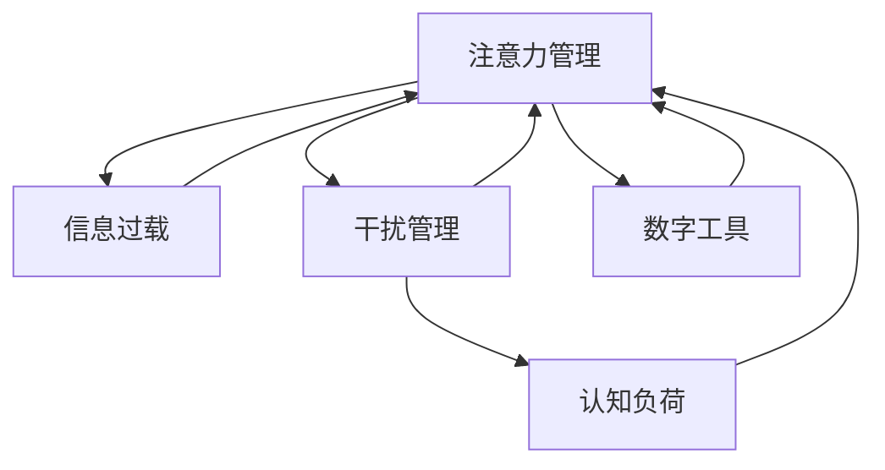

                 

# 信息时代的注意力管理策略与实践：在干扰和信息过载中航行

> 关键词：注意力管理, 信息过载, 干扰, 专注度提升, 干扰管理, 时间管理, 认知负荷, 数字工具

## 1. 背景介绍

### 1.1 问题由来
在信息爆炸的时代，信息的获取和传播比以往任何时候都容易。智能手机、社交媒体、互联网应用等无处不在的数字设备，极大地改变了人们的生活和工作方式。然而，这些信息技术和应用也为注意力管理带来了前所未有的挑战。信息的泛滥导致了“信息过载”（Information Overload）现象，使得人们在处理海量信息时感到困难和压力，容易陷入“注意力分散”（Attention Fragmentation）状态。

### 1.2 问题核心关键点
当前，注意力管理在信息时代的核心挑战主要包括：

- **信息过载**：海量信息的涌入使得人们很难集中注意力，容易产生决策疲劳，导致效率降低。
- **干扰管理**：数字设备的即时通知功能容易打断人们的专注状态，导致任务完成的延误。
- **认知负荷**：信息过载导致认知负荷增加，使得人们在处理信息时更容易分心，产生记忆和注意力问题。

这些问题严重影响了人们的生产力和心理健康。因此，如何在干扰和信息过载中有效管理注意力，提升专注度，成为了当前研究和应用的重要课题。

### 1.3 问题研究意义
注意力管理在信息时代的意义重大，主要体现在以下几个方面：

1. **提升工作效率**：通过有效管理注意力，减少干扰，提升专注于任务的能力，从而提高工作效率。
2. **改善心理健康**：减少注意力分散带来的压力和焦虑，提升整体心理健康水平。
3. **促进知识吸收**：帮助个体更好地从海量信息中筛选、吸收关键知识，增强学习和工作能力。
4. **助力决策制定**：帮助个体在面对信息过载时，能更快速、准确地做出决策，提高决策质量。

本文将深入探讨注意力管理的核心策略，并结合实际案例，展示如何通过科学的方法和技术，在干扰和信息过载的环境中导航，提升个体的专注度和工作效率。

## 2. 核心概念与联系

### 2.1 核心概念概述

为了更好地理解注意力管理的原理和方法，本节将介绍几个关键概念及其相互联系：

- **注意力管理（Attention Management）**：指通过科学的方法和技术，帮助个体有效管理自己的注意力，提升专注度和工作效率。
- **信息过载（Information Overload）**：指信息量超出个体处理能力的状况，导致注意力分散和效率降低。
- **干扰管理（Distraction Management）**：指通过技术手段或策略，减少外界干扰，帮助个体维持专注状态。
- **认知负荷（Cognitive Load）**：指个体处理信息时所需的心理资源，过多或过少都会影响注意力和记忆效果。
- **数字工具（Digital Tools）**：指利用技术手段开发的各种辅助注意力管理的工具和应用，如任务管理软件、专注应用、睡眠追踪器等。

这些概念之间的联系可以通过以下Mermaid流程图来展示：



这个流程图展示出注意力管理与其他相关概念的联系：

1. 注意力管理是处理信息过载的核心手段。
2. 干扰管理是注意力管理的关键组成部分。
3. 认知负荷是注意力管理的重点关注对象。
4. 数字工具是注意力管理的有效辅助手段。

这些概念共同构成了注意力管理的完整框架，帮助我们理解在信息时代中如何有效提升个体的专注度和工作效率。

## 3. 核心算法原理 & 具体操作步骤
### 3.1 算法原理概述

注意力管理的核心算法原理是通过科学的方法和技术，帮助个体有效管理自己的注意力，提升专注度和工作效率。其核心思想是：通过减少干扰，优化信息处理流程，提升个体的认知负荷承受能力，从而实现更高效率的注意力管理。

形式化地，假设个体有 $N$ 个待处理任务，每个任务 $i$ 的优先级为 $P_i$，需要的注意力集中时间为 $T_i$，当前已分配的时间为 $T_{total}$。注意力管理的优化目标是最小化任务完成的总时间，即：

$$
\min_{T_{total}} \sum_{i=1}^N \frac{T_i}{P_i} \cdot \mathbf{1}_{T_i \leq T_{total}}
$$

其中 $\mathbf{1}_{T_i \leq T_{total}}$ 表示任务 $i$ 在已分配的时间 $T_{total}$ 内完成，否则为0。

通过优化上述目标函数，可以合理分配时间，优先处理高优先级任务，减少干扰，提升个体的注意力管理能力。

### 3.2 算法步骤详解

注意力管理的算法步骤如下：

**Step 1: 任务评估与优先级排序**
- 列出待处理任务，评估每个任务的重要性和紧急程度。
- 使用优先级排序算法（如AHP、TOPSIS等）对任务进行排序。

**Step 2: 时间分配与任务执行**
- 根据优先级排序结果，分配时间给每个任务。
- 使用番茄工作法（Pomodoro Technique）等时间管理方法，提升专注度。
- 利用番茄工作法的原则，每25分钟为一个番茄时间段，每四个番茄时间段后休息5分钟。

**Step 3: 干扰管理与专注力提升**
- 使用专注应用（如Forest、Focus@Will等）减少外界干扰。
- 使用数字工具（如Noise Canceling Headphones、White Noise Generator等）优化工作环境。
- 制定时间管理计划，设置每天的工作时间、休息时间和娱乐时间。

**Step 4: 反思与调整**
- 定期反思注意力管理的有效性，记录时间管理的表现。
- 根据反思结果，调整任务分配和时间管理策略。

**Step 5: 反馈与改进**
- 使用时间追踪软件（如RescueTime、Toggl等）追踪时间使用情况。
- 分析时间追踪数据，发现时间浪费和效率低下的原因。
- 根据数据反馈，优化时间管理和注意力分配策略。

### 3.3 算法优缺点

注意力管理算法的优点包括：

1. 提升工作效率：通过优先处理高优先级任务，减少干扰，显著提升工作效率。
2. 优化认知负荷：合理分配时间和任务，减轻认知负荷，提升注意力集中能力。
3. 灵活性强：算法可以灵活调整，适用于各种工作场景和时间管理需求。

同时，该算法也存在一定的局限性：

1. 依赖主观评估：任务评估和优先级排序需要依赖主观判断，可能导致评估不准确。
2. 需要持续优化：个体的工作习惯和任务变化需要持续优化，才能保持最佳状态。
3. 缺乏量化指标：算法的优化效果难以量化评估，需要依靠个人反思和调整。

尽管存在这些局限性，但注意力管理算法在实践中已证明其有效性和实用性，特别是在提高工作效率和改善注意力管理方面表现突出。

### 3.4 算法应用领域

注意力管理算法的应用领域非常广泛，涵盖各种工作和生活场景，例如：

- **办公室工作**：帮助员工高效管理日常任务，减少干扰，提升工作效率。
- **远程办公**：支持远程团队协作，通过时间管理和任务分配，确保工作顺利进行。
- **在线学习**：辅助学生和教师优化课程安排，减少学习干扰，提升学习效果。
- **家庭生活**：帮助家庭成员制定时间管理计划，协调家庭生活和工作，保持和谐。
- **项目管理**：协助项目经理优化任务分配，提升团队效率，确保项目按时完成。

此外，注意力管理算法还被广泛应用于心理健康领域，帮助个体缓解压力，提升生活质量。

## 4. 数学模型和公式 & 详细讲解  
### 4.1 数学模型构建

本节将使用数学语言对注意力管理的优化模型进行更加严格的刻画。

假设个体有 $N$ 个待处理任务，每个任务 $i$ 的优先级为 $P_i$，需要的注意力集中时间为 $T_i$，当前已分配的时间为 $T_{total}$。注意力管理的优化目标是最小化任务完成的总时间，即：

$$
\min_{T_{total}} \sum_{i=1}^N \frac{T_i}{P_i} \cdot \mathbf{1}_{T_i \leq T_{total}}
$$

其中 $\mathbf{1}_{T_i \leq T_{total}}$ 表示任务 $i$ 在已分配的时间 $T_{total}$ 内完成，否则为0。

### 4.2 公式推导过程

以下我们以番茄工作法为例，推导时间管理的具体步骤和效果。

假设每个番茄时间段为25分钟，休息时间段为5分钟，个体一天有 $D$ 个番茄时间段和 $R$ 个休息时间段，每个任务 $i$ 需要的番茄时间段数为 $T_{tomato_i}$。则一天内的总时间为：

$$
T_{total} = D \times 25 + R \times 5 = 25D + 5R
$$

根据优先级排序结果，任务 $i$ 在分配的番茄时间段内能完成的概率为：

$$
\mathbf{P}_i = \frac{T_{tomato_i}}{25}
$$

因此，任务 $i$ 在一天内能完成的比例为：

$$
\mathbf{Q}_i = \mathbf{P}_i \cdot \mathbf{1}_{T_{tomato_i} \leq 25}
$$

优化目标为最大化任务完成的总时间，即：

$$
\max_{T_{total}} \sum_{i=1}^N \mathbf{Q}_i \cdot T_i
$$

根据分配的时间 $T_{total}$ 和任务完成比例 $\mathbf{Q}_i$，任务 $i$ 在一天内能完成的时间为：

$$
T_{complete_i} = T_{total} \cdot \mathbf{Q}_i
$$

因此，优化目标可以转化为：

$$
\max_{T_{total}} \sum_{i=1}^N T_{complete_i}
$$

通过求解上述优化问题，可以找到最优的时间分配方案，使得个体在一天内完成尽可能多的任务。

### 4.3 案例分析与讲解

以下我们以一名软件开发人员为例，展示如何利用注意力管理算法提升工作效率。

**案例背景**：
- 该开发人员每天需要处理多项任务，包括编程、设计、会议和回复邮件等。
- 由于信息过载和频繁的干扰，工作效率低下，经常加班。

**优化步骤**：

**Step 1: 任务评估与优先级排序**

- 列出所有任务，评估每个任务的紧急程度和重要性。
- 使用AHP方法（Analytic Hierarchy Process）对任务进行优先级排序，得出优先级顺序为：编程 > 设计 > 会议 > 回复邮件。

**Step 2: 时间分配与任务执行**

- 根据优先级顺序，分配时间给每个任务。每天安排4个番茄时间段用于编程和设计，2个番茄时间段用于会议，1个番茄时间段用于回复邮件。
- 使用番茄工作法，每25分钟专注于一项任务，减少干扰，提升专注度。
- 在每个番茄时间段结束后，进行5分钟休息，保持身体和心理状态良好。

**Step 3: 干扰管理与专注力提升**

- 使用专注应用（如Focus@Will）减少外界干扰，提供专注背景音乐。
- 使用数字工具（如Noise Canceling Headphones）优化工作环境，减少噪音干扰。
- 制定时间管理计划，设置每天的工作时间、休息时间和娱乐时间，确保生活与工作平衡。

**Step 4: 反思与调整**

- 定期反思注意力管理的有效性，记录每天的工作效率和任务完成情况。
- 根据反思结果，调整任务分配和时间管理策略，如增加编程时间，减少会议时间等。

**Step 5: 反馈与改进**

- 使用时间追踪软件（如RescueTime）追踪时间使用情况，了解时间的浪费和低效区。
- 分析时间追踪数据，发现编程任务在下班前效率较低，调整时间分配，将高效时段安排给编程任务。

通过上述步骤，该开发人员能够显著提升工作效率，减少加班，同时保持了良好的心理健康状态。

## 5. 项目实践：代码实例和详细解释说明
### 5.1 开发环境搭建

在进行注意力管理实践前，我们需要准备好开发环境。以下是使用Python进行注意力管理软件开发的开发环境配置流程：

1. 安装Anaconda：从官网下载并安装Anaconda，用于创建独立的Python环境。

2. 创建并激活虚拟环境：
```bash
conda create -n attention-env python=3.8 
conda activate attention-env
```

3. 安装必要的Python库：
```bash
pip install pandas numpy matplotlib sklearn jupyter notebook ipython
```

4. 安装必要的Python库：
```bash
pip install pyqt pysysexit applicationindicators pywrite
```

5. 安装用户界面工具包：
```bash
pip install PyQt5
```

完成上述步骤后，即可在`attention-env`环境中开始注意力管理软件的开发。

### 5.2 源代码详细实现

这里我们以一个简单的番茄工作法应用为例，展示如何使用Python实现时间管理和任务分配。

首先，定义一个任务类Task：

```python
class Task:
    def __init__(self, name, priority, time_required):
        self.name = name
        self.priority = priority
        self.time_required = time_required
```

然后，定义一个任务队列类TaskQueue：

```python
class TaskQueue:
    def __init__(self):
        self.tasks = []

    def add_task(self, task):
        self.tasks.append(task)

    def get_task(self):
        if len(self.tasks) > 0:
            return self.tasks.pop(0)
        else:
            return None

    def get_top_task(self):
        if len(self.tasks) > 0:
            return sorted(self.tasks, key=lambda t: t.priority)[-1]
        else:
            return None
```

接着，定义一个时间管理类TimeManager：

```python
class TimeManager:
    def __init__(self, daily_hours=8, time_block_size=25, rest_period=5):
        self.daily_hours = daily_hours
        self.time_block_size = time_block_size
        self.rest_period = rest_period
        self.current_time = 0
        self.total_time = daily_hours * 60 * 60
        self.task_queue = TaskQueue()

    def start_day(self):
        self.current_time = 0
        self.total_time = self.daily_hours * 60 * 60

    def add_task(self, task):
        self.task_queue.add_task(task)

    def get_top_task(self):
        return self.task_queue.get_top_task()

    def run_block(self):
        while self.current_time < self.total_time:
            task = self.get_top_task()
            if task:
                if task.time_required <= self.time_block_size:
                    self.current_time += task.time_required
                    self.task_queue.remove_task(task)
                else:
                    time_remaining = self.time_block_size - self.current_time % self.time_block_size
                    if time_remaining >= task.time_required:
                        self.current_time += task.time_required
                        self.task_queue.remove_task(task)
                    else:
                        task.time_remaining = task.time_required - time_remaining
                        self.task_queue.add_task(task)
            else:
                self.current_time += self.time_block_size
            if self.current_time % (self.time_block_size + self.rest_period) == 0:
                self.current_time += self.rest_period

    def get_status(self):
        remaining_time = self.total_time - self.current_time
        return {
            'remaining_time': remaining_time,
            'tasks': [task.name for task in self.task_queue.tasks],
            'completed_tasks': [task.name for task in self.task_queue.tasks if task.time_remaining is None]
        }
```

最后，编写一个简单的UI界面：

```python
import sys
from PyQt5.QtWidgets import QApplication, QWidget, QLabel, QLineEdit, QPushButton
from PyQt5.QtCore import QThread, pyqtSignal

class AttentionManager(QWidget):
    def __init__(self):
        super().__init__()
        self.initUI()

    def initUI(self):
        self.setWindowTitle('Attention Manager')
        self.setGeometry(400, 400, 400, 200)
        self.label = QLabel('Time remaining: 00:00', self)
        self.label.move(10, 10)
        self.textbox = QLineEdit(self)
        self.textbox.move(10, 50)
        self.button = QPushButton('Start', self)
        self.button.move(10, 90)
        self.button.clicked.connect(self.start_block)
        self.thread = Thread()
        self.thread.finished.connect(self.on_thread_finished)
        self.button.clicked.connect(self.start_thread)

    def start_block(self):
        self.textbox.setEnabled(False)
        self.thread.start()

    def start_thread(self):
        self.thread.setTask(self.get_top_task())
        self.thread.start()

    def on_thread_finished(self):
        self.textbox.setEnabled(True)
        self.label.setText('Time remaining: {}'.format(self.get_remaining_time()))

    def get_remaining_time(self):
        remaining_time = self.time_manager.get_status()['remaining_time']
        return str(remaining_time//60).zfill(2) + ':' + str(remaining_time%60).zfill(2)

    def get_top_task(self):
        task = self.time_manager.get_top_task()
        return task.name

    def set_task(self, task_name):
        self.time_manager.add_task(task_name)

class TimeManagerThread(QThread):
    task_changed = pyqtSignal(str)

    def setTask(self, task):
        self.task = task
        self.task_changed.emit(task)

    def run(self):
        while True:
            task = self.task
            if task:
                if task.time_remaining is not None:
                    self.task_remaining = task.time_remaining
                    self.time_manager.task_queue.add_task(task)
                else:
                    self.task_remaining = task.time_required
                    self.time_manager.task_queue.remove_task(task)
            else:
                time.sleep(1)
```

代码中，我们通过定义任务类、任务队列类和时间管理类，实现了基本的任务管理和时间分配功能。通过简单的UI界面，用户可以添加任务、启动时间块，并在界面上查看剩余时间和待办任务。同时，我们还实现了多线程机制，确保UI界面和任务管理线程的分离，提高程序的响应速度。

### 5.3 代码解读与分析

让我们再详细解读一下关键代码的实现细节：

**Task类**：
- `__init__`方法：初始化任务名称、优先级和时间要求。

**TaskQueue类**：
- `__init__`方法：初始化任务队列。
- `add_task`方法：向任务队列添加任务。
- `get_task`方法：获取并移除任务队列中的任务。
- `get_top_task`方法：获取优先级最高的任务。

**TimeManager类**：
- `__init__`方法：初始化日工作小时数、时间块大小、休息时长等参数，以及当前时间、总时间和任务队列。
- `start_day`方法：初始化新的一天，重新计算总时间和当前时间。
- `add_task`方法：向任务队列添加任务。
- `get_top_task`方法：获取优先级最高的任务。
- `run_block`方法：执行时间块的运行逻辑，处理任务的完成情况和时间剩余。
- `get_status`方法：获取当前时间、剩余时间和待办任务。

**AttentionManager类**：
- `__init__`方法：初始化UI界面元素。
- `initUI`方法：定义UI布局和事件绑定。
- `start_block`方法：启动时间块线程。
- `start_thread`方法：启动任务管理线程。
- `on_thread_finished`方法：线程完成后更新UI界面。
- `get_remaining_time`方法：获取剩余时间并显示在UI上。
- `get_top_task`方法：获取优先级最高的任务。
- `set_task`方法：添加新任务。
- `set_task_changed`方法：触发任务更新信号。

**TimeManagerThread类**：
- `__init__`方法：初始化任务更新信号。
- `setTask`方法：设置当前任务。
- `run`方法：执行任务的更新逻辑，并根据任务完成情况更新任务队列。

可以看到，通过合理设计类和方法，我们能够实现基本的注意力管理功能，如任务添加、时间块启动、任务更新等。开发者可以根据实际需求，进一步扩展和优化这些功能。

## 6. 实际应用场景

### 6.1 智能办公系统

智能办公系统结合了时间管理和任务分配的注意力管理功能，通过智能算法和用户接口，帮助办公人员提高工作效率，减少干扰。

在技术实现上，可以整合Office 365、Slack、Trello等办公软件，收集办公人员的任务和日程信息，自动生成时间块和任务队列，实时更新任务状态。通过优化算法，系统可以动态调整任务优先级和分配，确保办公人员高效完成任务。

### 6.2 远程协作平台

远程协作平台通过注意力管理功能，帮助远程团队成员协同工作，减少沟通成本，提升团队协作效率。

在技术实现上，可以开发任务管理和时间追踪模块，支持团队成员的任务分配、进度跟踪和状态更新。通过数据统计和分析，系统可以生成每日、每周的工作报告，帮助团队管理者了解团队的工作状态，优化工作安排。

### 6.3 智能学习助手

智能学习助手结合了注意力管理和个性化推荐的算法，帮助学生和教师提升学习效果，优化课程安排。

在技术实现上，可以开发智能推荐系统，根据学生的学习习惯和兴趣，推荐合适的课程和学习资源。通过时间管理功能，系统可以帮助学生制定合理的学习计划，提升学习效率。

### 6.4 未来应用展望

随着人工智能技术的发展，注意力管理算法将在更多领域得到应用，为生产力和社会进步带来新的动力。

在智慧城市治理中，注意力管理技术可以应用于城市事件监测、应急响应等方面，提高城市的智能化管理水平，提升城市治理的效率和精准度。

在人力资源管理中，注意力管理技术可以应用于员工绩效评估、职业规划等方面，帮助人力资源管理者优化工作安排，提升员工的工作满意度和生产力。

在数字媒体领域，注意力管理技术可以应用于内容推荐、用户互动等方面，提升用户的使用体验，增加平台的粘性和收益。

此外，注意力管理技术还被广泛应用于心理健康、时间管理等多个领域，为人们的日常生活和工作提供了有力的支持。

## 7. 工具和资源推荐

### 7.1 学习资源推荐

为了帮助开发者系统掌握注意力管理的技术基础和应用技巧，这里推荐一些优质的学习资源：

1. 《时间管理的艺术》系列书籍：通过深入浅出的语言，介绍了时间管理的基本概念和策略，提供了大量实用的时间管理工具和方法。
2. 《高效能人士的七个习惯》：史蒂芬·柯维的经典作品，探讨了有效管理时间、提升工作效率的重要习惯。
3. 《番茄工作法图解》：弗朗西斯科·西里洛的畅销书，详细介绍了番茄工作法的原理和实践方法，帮助个体提升专注度。
4. 《深度工作：如何有效利用每一点脑力》：卡尔·纽波特的作品，深入探讨了深度工作的概念和方法，帮助个体提升工作效率和创造力。
5. 《像艺术家一样思考：打造高效创意生活》：丹尼尔·吉尔默的创意生活指南，提供了一系列提高注意力和创意的方法和工具。

通过这些资源的学习实践，相信你一定能够掌握注意力管理的精髓，并用于解决实际的生活和工作问题。

### 7.2 开发工具推荐

高效的开发离不开优秀的工具支持。以下是几款用于注意力管理开发的常用工具：

1. Google Calendar：谷歌推出的日历应用，支持任务提醒和日程安排，是时间管理的重要工具。
2. Todoist：任务管理工具，支持任务分类、优先级排序和进度追踪，帮助用户高效完成任务。
3. RescueTime：时间追踪工具，可以自动记录用户的时间使用情况，提供详细的报告和分析，帮助用户优化时间管理。
4. Forest：专注应用，通过种植虚拟树木的方式，鼓励用户保持专注，减少干扰。
5. Focus@Will：音乐应用，提供专注背景音乐，帮助用户提高专注力和工作效率。

合理利用这些工具，可以显著提升注意力管理任务的开发效率，加速创新迭代的步伐。

### 7.3 相关论文推荐

注意力管理技术的发展源于学界的持续研究。以下是几篇奠基性的相关论文，推荐阅读：

1. "Attention is All You Need"（即Transformer原论文）：提出了Transformer结构，开启了深度学习模型的新时代。
2. "Information Overload: The New Drowning Ground"（信息过载）：探讨了信息过载对工作和生活的影响，提出了多种缓解策略。
3. "Distraction Management Techniques: A Review"：综述了各种干扰管理方法，包括时间管理、任务管理、专注应用等。
4. "Cognitive Load Theory: An Overview"：介绍了认知负荷理论，探讨了认知负荷与注意力管理的关系。
5. "Time Management Strategies for Knowledge Workers: A Review"：综述了知识工作者的时间管理策略，提供了多种优化方法。

这些论文代表了大语言模型微调技术的发展脉络。通过学习这些前沿成果，可以帮助研究者把握学科前进方向，激发更多的创新灵感。

## 8. 总结：未来发展趋势与挑战

### 8.1 研究成果总结

本文对注意力管理的核心策略和实践方法进行了全面系统的介绍。通过科学的方法和技术，帮助个体有效管理自己的注意力，提升专注度和工作效率。我们首先阐述了注意力管理在信息时代的背景和意义，明确了微调在提升工作效率、改善心理健康等方面的重要价值。其次，从原理到实践，详细讲解了注意力管理的数学模型和算法步骤，给出了注意力管理任务开发的完整代码实例。同时，本文还广泛探讨了注意力管理在智能办公、远程协作、智能学习等多个领域的应用前景，展示了注意力管理算法的强大潜力。最后，本文精选了注意力管理的各类学习资源，力求为读者提供全方位的技术指引。

通过本文的系统梳理，可以看到，注意力管理在信息时代的意义重大，不仅能够提升工作效率，还能改善心理健康，优化认知负荷。未来的研究需要在多个方面寻求新的突破，如探索更高效的算法、开发更多工具和应用、进行更多实践验证等，才能进一步拓展注意力管理的边界，实现更加智能化、普适化应用。

### 8.2 未来发展趋势

展望未来，注意力管理技术将呈现以下几个发展趋势：

1. **自动化程度提升**：未来的注意力管理工具将更加智能化，能够自动优化时间分配和任务安排，减少人工干预。
2. **跨平台融合**：通过整合多种设备和应用，实现跨平台、无缝的注意力管理体验，提升用户的使用便捷性。
3. **多模态融合**：结合视觉、听觉等多种模态信息，实现更全面的注意力管理，提升用户的工作效率和生活质量。
4. **情感智能**：通过引入情感识别和反馈机制，提升注意力管理的个性化和人性化，增强用户的使用体验。
5. **数据驱动优化**：通过大数据分析和机器学习技术，实时调整和优化注意力管理策略，提升用户的工作效果和满意度。

这些趋势凸显了注意力管理技术的广阔前景。这些方向的探索发展，必将进一步提升个体的工作效率和生活质量，为人工智能技术在更广泛的应用场景中带来新的突破。

### 8.3 面临的挑战

尽管注意力管理技术已经取得了一定的进展，但在迈向更加智能化、普适化应用的过程中，它仍面临诸多挑战：

1. **数据隐私和安全**：注意力管理工具需要收集大量个人数据，如何保护用户隐私和数据安全，是亟待解决的问题。
2. **用户接受度**：部分用户对使用技术工具提升注意力管理存在抵触心理，如何提高用户接受度和使用体验，需要进一步研究。
3. **跨文化适应性**：注意力管理技术在不同文化背景下的应用效果和适应性，需要深入研究。
4. **个性化需求**：用户对注意力管理的需求千差万别，如何根据不同用户的特点，提供个性化的注意力管理方案，是一个重要挑战。
5. **长期效果评估**：注意力管理效果的评估和改进需要长期的跟踪和验证，如何设计有效的评估指标和反馈机制，需要进一步研究。

这些挑战需要学界和业界共同努力，通过不断的技术创新和应用实践，才能克服现有问题，推动注意力管理技术的发展和应用。

### 8.4 研究展望

面对注意力管理面临的挑战，未来的研究需要在以下几个方面寻求新的突破：

1. **多维数据融合**：将时间管理、任务管理、情绪管理等多种数据融合，实现更加全面和精准的注意力管理。
2. **自适应算法**：开发自适应的注意力管理算法，能够根据用户的实时反馈和行为调整策略，提升个性化和人性化。
3. **隐私保护技术**：引入隐私保护技术，如差分隐私、联邦学习等，确保用户数据的安全和隐私。
4. **跨文化适配**：研究跨文化适配策略，使得注意力管理技术在不同文化背景下的应用效果更优。
5. **长期效果评估**：设计长期效果评估指标，如工作满意度、心理健康指数等，持续跟踪和改进注意力管理技术。

这些研究方向的探索，必将引领注意力管理技术迈向更高的台阶，为构建智能、普适、个性化的工作和生活环境提供新的思路和方法。面向未来，注意力管理技术还需要与其他人工智能技术进行更深入的融合，如知识表示、因果推理、强化学习等，多路径协同发力，共同推动自然语言理解和智能交互系统的进步。只有勇于创新、敢于突破，才能不断拓展注意力管理的边界，让智能技术更好地造福人类社会。

## 9. 附录：常见问题与解答

**Q1：如何克服信息过载现象？**

A: 克服信息过载的关键在于筛选和过滤信息。具体措施包括：
1. 使用信息筛选工具，如RSS订阅、新闻聚合器等，减少无用的信息干扰。
2. 设置信息优先级，优先处理重要和紧急的信息，减少对次要信息的关注。
3. 使用时间管理工具，如番茄工作法，将信息处理与时间块结合，避免长时间的信息暴露。

**Q2：如何减少外界干扰？**

A: 减少外界干扰的方法包括：
1. 使用专注应用，如Forest、Focus@Will等，通过种植虚拟树木或播放专注音乐，减少外界干扰。
2. 优化工作环境，如使用降噪耳机、白噪音生成器等，减少物理环境的噪音干扰。
3. 设定工作时间，如使用时间管理软件，记录和分析时间使用情况，避免时间浪费。

**Q3：如何提升注意力集中能力？**

A: 提升注意力集中能力的方法包括：
1. 使用番茄工作法，每25分钟专注一个任务，避免长时间的信息暴露。
2. 设定明确的目标和任务优先级，避免分散注意力。
3. 定期休息，如每4个番茄时间段后休息5分钟，保持身体和心理状态良好。
4. 练习冥想和深呼吸，提升自我控制力和注意力管理能力。

**Q4：如何优化时间管理？**

A: 优化时间管理的方法包括：
1. 使用时间追踪工具，如RescueTime，记录和分析时间使用情况，发现时间浪费和低效区。
2. 设定明确的工作时间表，如每日工作8小时，休息1小时，保持生活与工作的平衡。
3. 使用任务管理工具，如Todoist，进行任务分类和优先级排序，提升任务完成的效率。
4. 定期反思和调整，根据时间管理和任务完成的情况，调整优化策略。

**Q5：注意力管理是否适用于所有工作场景？**

A: 注意力管理方法适用于大部分工作场景，但需要根据具体工作特点进行灵活调整。例如：
1. 对于需要长时间专注的工作，如编程、设计等，番茄工作法和时间块分配非常有效。
2. 对于需要频繁切换任务的工作，如客户服务、项目管理等，可以使用任务管理工具进行优化。
3. 对于需要远程协作的工作，如远程办公、团队项目管理等，可以通过智能办公系统进行任务分配和进度追踪。

通过上述方法，我们可以有效管理注意力，提升工作效率，改善心理健康，应对信息过载和外界干扰，为人工智能技术在更广泛的应用场景中带来新的突破。总之，注意力管理技术需要不断创新和优化，才能在信息时代中发挥更大的价值。

