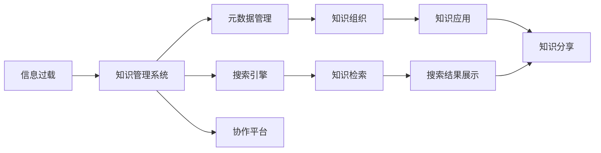

                 

# 信息过载与知识管理系统实施指南：有效组织和检索信息

## 1. 背景介绍

在数字化时代，信息量呈爆炸式增长，人们每天面临的是海量数据、文档、网页和多媒体资料，如何高效地组织和检索这些信息成为组织和个人面临的共同挑战。信息过载不仅导致决策效率低下，还可能引发认知负荷和信息焦虑。因此，如何建立一套有效的知识管理系统(Knowledge Management System, KMS)，实现知识的系统化组织、检索和应用，是提高组织竞争力和个体工作效率的关键。

本文将从信息过载现象入手，探讨构建知识管理系统的必要性和基本策略，重点介绍常用的知识管理工具和技术，为组织和个人提供一份详尽的实施指南。通过案例分析，展示知识管理系统在实际应用中的效果，并为未来发展方向提供建议。

## 2. 核心概念与联系

### 2.1 核心概念概述

- **信息过载(Information Overload)**：指个人或组织接收的信息超出了其处理能力，导致决策和判断困难的现象。
- **知识管理(Knowledge Management)**：通过软件工具和方法，系统化地组织、存储、检索和应用知识，以提升组织和个体的决策效率和创新能力。
- **知识管理系统(KMS)**：集成了知识管理的软件和平台，支持知识捕获、组织、共享和应用，帮助组织和个人高效地处理信息。
- **元数据(Metadata)**：描述数据属性的数据，如文档的主题、作者、创建时间等，帮助检索和组织信息。
- **搜索引擎(Search Engine)**：通过索引和搜索算法，帮助用户快速找到所需信息。

这些核心概念通过特定的工具和方法联系在一起，形成一套有效的信息管理和知识应用体系。

### 2.2 核心概念原理和架构的 Mermaid 流程图



这个流程图展示了信息过载和知识管理系统之间的联系：
1. **信息过载**：海量的数据和信息是问题所在。
2. **知识管理系统**：提供了系统化的工具和方法，帮助处理信息。
3. **元数据管理**：通过元数据管理，信息被更好地组织和分类。
4. **搜索引擎**：利用搜索引擎快速检索信息。
5. **协作平台**：通过协作平台，知识得以共享和应用。
6. **知识组织**：元数据和索引帮助知识更好地组织。
7. **知识检索**：搜索引擎帮助快速找到所需知识。
8. **知识应用**：通过协作平台分享应用知识。

## 3. 核心算法原理 & 具体操作步骤

### 3.1 算法原理概述

知识管理系统的核心算法原理主要包括知识捕获、组织、检索和应用四个环节。具体来说，知识管理系统通过以下步骤实现：

1. **知识捕获(Knowledge Capture)**：通过文本、音频、视频等多模态数据收集和整理，将隐性知识显性化。
2. **知识组织(Knowledge Organization)**：利用元数据和分类技术，将知识系统化地组织和存储。
3. **知识检索(Knowledge Retrieval)**：通过索引和搜索算法，帮助用户快速找到所需信息。
4. **知识应用(Knowledge Application)**：通过协作平台和应用接口，将知识应用于决策和实践中。

### 3.2 算法步骤详解

#### 3.2.1 知识捕获

知识捕获是将隐性知识显性化的过程，通常包括数据收集、文本清洗、结构化处理和元数据标注等步骤。

1. **数据收集**：收集电子邮件、文档、会议记录、社交媒体等多种形式的数据。
2. **文本清洗**：去除无关内容，如广告、噪声和重复信息。
3. **结构化处理**：将非结构化数据转换为结构化数据，如表格和数据库记录。
4. **元数据标注**：为每份数据添加元数据，如作者、时间戳、分类标签等。

#### 3.2.2 知识组织

知识组织是知识管理系统中的核心环节，通过元数据管理和分类技术，实现知识的系统化存储和检索。

1. **元数据管理**：建立元数据标准，为每份数据添加必要的属性，如文档的主题、作者、创建时间等。
2. **分类技术**：利用层次化分类和主题聚类等技术，将知识进行系统化组织。
3. **索引构建**：构建全面的索引，支持基于关键词、主题和时间的快速检索。

#### 3.2.3 知识检索

知识检索是知识管理系统的关键功能，通过搜索引擎和索引技术，帮助用户快速找到所需信息。

1. **搜索引擎**：利用倒排索引和全文搜索技术，快速匹配用户查询。
2. **索引优化**：优化索引结构，提高搜索效率和精度。
3. **结果排序**：根据相关性和排序算法，优化搜索结果展示。

#### 3.2.4 知识应用

知识应用是将知识应用于决策和实践的过程，通过协作平台和API接口，实现知识的共享和应用。

1. **协作平台**：提供在线文档、注释和讨论功能，支持团队协作。
2. **API接口**：提供开放API接口，支持第三方应用集成。
3. **知识分享**：通过文档、报告和演示等多种形式，分享应用知识。

### 3.3 算法优缺点

#### 3.3.1 优点

1. **系统化管理**：知识管理系统能够系统化地存储和管理知识，避免了信息分散和丢失。
2. **快速检索**：通过高效的搜索引擎和索引技术，实现快速的信息检索和查找。
3. **协作共享**：支持团队协作和知识共享，提升团队效率和创新能力。
4. **知识应用**：通过API接口和协作平台，知识可以应用于决策和实践中，提高业务效率。

#### 3.3.2 缺点

1. **初始成本高**：知识管理系统的搭建和实施需要较高的初始投资。
2. **复杂度高**：知识管理系统需要持续维护和优化，技术复杂度较高。
3. **数据质量要求高**：知识管理系统依赖高质量的数据，对数据清洗和结构化处理要求较高。
4. **用户习惯培养**：需要培养用户对知识管理系统的使用习惯，推广难度较大。

### 3.4 算法应用领域

知识管理系统在多个领域都有广泛应用，包括但不限于：

1. **企业知识管理**：提升企业决策效率和创新能力，支持研发、市场和运营等业务。
2. **医疗知识管理**：支持医学研究和临床决策，提升医疗服务的质量和效率。
3. **教育知识管理**：提供教学资源和知识库，支持在线教育和远程学习。
4. **政府知识管理**：支持政策制定和公共服务，提升政府治理水平。
5. **法律知识管理**：提供法律文献和案例库，支持法律研究和司法实践。

## 4. 数学模型和公式 & 详细讲解 & 举例说明

### 4.1 数学模型构建

知识管理系统涉及的数学模型主要包括以下几个方面：

- **信息检索模型**：利用倒排索引和向量空间模型，实现文本信息的检索。
- **分类模型**：利用机器学习算法，对知识进行自动分类。
- **知识图谱模型**：通过图数据库和知识图谱技术，实现知识的关联和推理。

#### 4.1.1 信息检索模型

信息检索模型的核心是倒排索引和向量空间模型。倒排索引通过索引每个单词在文档中出现的频率，实现快速查找。向量空间模型将文本表示为向量，通过余弦相似度计算匹配度。

$$
\text{余弦相似度} = \frac{\mathbf{v} \cdot \mathbf{u}}{\|\mathbf{v}\|\|\mathbf{u}\|}
$$

其中，$\mathbf{v}$和$\mathbf{u}$分别为查询向量和文档向量，$\cdot$表示点乘，$\|\cdot\|$表示向量的模长。

#### 4.1.2 分类模型

分类模型利用机器学习算法，对知识进行自动分类。常用的分类算法包括朴素贝叶斯、支持向量机和随机森林等。

$$
P(y|x) = \frac{P(y)}{P(x|y)P(y)} = \frac{P(y)}{\int P(x|y)P(y) \mathrm{d}y}
$$

其中，$y$表示分类标签，$x$表示特征向量，$P(y)$和$P(x|y)$分别为先验概率和条件概率。

#### 4.1.3 知识图谱模型

知识图谱模型通过图数据库和图算法，实现知识的关联和推理。常用的知识图谱算法包括PageRank、Pegasus和Neo4j等。

$$
\text{PageRank} = \sum_{i=1}^{n} \frac{C_i}{L_i} \times R_i
$$

其中，$C_i$表示节点$i$的入度，$L_i$表示节点$i$的出度，$R_i$表示节点$i$的PageRank值。

### 4.2 公式推导过程

#### 4.2.1 信息检索模型的推导

信息检索模型的核心是倒排索引和向量空间模型。以向量空间模型为例，其推导过程如下：

1. **文本向量化**：将文本表示为向量，利用TF-IDF算法计算每个单词的权重。

2. **余弦相似度计算**：计算查询向量与文档向量的余弦相似度。

$$
\text{余弦相似度} = \frac{\sum_{i=1}^{n} t_i \times d_i}{\sqrt{\sum_{i=1}^{n} t_i^2} \times \sqrt{\sum_{i=1}^{n} d_i^2}}
$$

其中，$t_i$和$d_i$分别为查询向量和文档向量的第$i$个分量。

3. **排序算法**：根据余弦相似度对搜索结果进行排序，返回最相关的文档。

#### 4.2.2 分类模型的推导

分类模型的核心是机器学习算法，以朴素贝叶斯算法为例，其推导过程如下：

1. **特征提取**：从文本中提取特征向量，如单词、短语和句法结构等。

2. **先验概率计算**：计算每个分类标签的先验概率。

$$
P(y) = \frac{\sum_{x \in X} P(x|y)P(y)}{\sum_{y \in Y} \sum_{x \in X} P(x|y)P(y)}
$$

3. **条件概率计算**：计算每个特征在给定分类标签下的条件概率。

$$
P(x|y) = \frac{P(x,y)}{P(y)}
$$

4. **决策函数**：根据贝叶斯公式和分类阈值，对新数据进行分类。

$$
y = \arg\max_{y \in Y} P(y|x)
$$

#### 4.2.3 知识图谱模型的推导

知识图谱模型的核心是图数据库和图算法，以PageRank算法为例，其推导过程如下：

1. **构建图结构**：将知识表示为节点和边的关系图。

2. **初始化**：将所有节点赋相同的初始PageRank值。

3. **迭代计算**：根据节点入度和出度计算每个节点的PageRank值。

$$
\text{PageRank} = \frac{1}{c_i} \sum_{j \in N_i} c_j \times R_j
$$

其中，$c_i$表示节点$i$的入度，$N_i$表示节点$i$的邻居节点，$R_j$表示邻居节点的PageRank值。

4. **收敛判断**：当所有节点的PageRank值收敛时，计算完成。

### 4.3 案例分析与讲解

#### 4.3.1 案例背景

某金融科技公司为了提高研发效率和创新能力，决定实施知识管理系统，以系统化地存储和管理公司内部的技术文档、研究报告和专利等知识资产。公司内部数据量庞大，涉及多个部门和项目，信息分散在电子邮件、会议记录和文档系统中，难以高效利用。

#### 4.3.2 实施过程

1. **需求分析**：分析公司内部数据需求，确定知识管理系统的功能和特点。

2. **数据清洗**：收集电子邮件、会议记录、文档和专利等数据，进行去重、清洗和结构化处理。

3. **元数据标注**：为每份数据添加元数据，如作者、时间戳、分类标签等。

4. **知识组织**：利用分类技术和索引技术，系统化地组织和存储知识。

5. **搜索引擎构建**：利用倒排索引和向量空间模型，构建高效的搜索引擎。

6. **协作平台搭建**：搭建在线文档、注释和讨论功能，支持团队协作。

7. **API接口开发**：开发开放API接口，支持第三方应用集成。

8. **测试上线**：进行系统测试和优化，正式上线运行。

#### 4.3.3 实施效果

- **提升研发效率**：通过知识管理系统，研发团队能够快速找到所需技术文档和专利，减少重复工作。
- **促进知识共享**：在线文档和讨论功能促进了团队知识共享，提升了团队合作效率。
- **支持创新能力**：系统化存储的知识为公司创新项目提供了有力支持，提高了研发成功率。

## 5. 项目实践：代码实例和详细解释说明

### 5.1 开发环境搭建

开发知识管理系统需要一个完整的开发环境，包括服务器、数据库、开发工具和版本控制系统等。以下是一个典型的开发环境搭建流程：

1. **服务器配置**：选择适合的服务器硬件和操作系统，如Linux和Apache Web服务器。

2. **数据库安装**：安装MySQL或PostgreSQL等关系型数据库，用于存储元数据和知识。

3. **开发工具安装**：安装Python、Java或.NET等编程语言和IDE工具。

4. **版本控制系统配置**：配置Git等版本控制系统，进行代码管理和协同开发。

5. **环境部署**：在服务器上安装Web服务器、应用服务器和数据库等组件，配置环境变量。

### 5.2 源代码详细实现

以下是一个简单的知识管理系统代码示例，包括数据收集、元数据管理和搜索引擎等功能。

```python
# 数据收集模块
import pandas as pd
def collect_data():
    # 从邮件、会议记录、文档等渠道收集数据
    email_data = pd.read_csv('email_data.csv')
    meeting_data = pd.read_csv('meeting_data.csv')
    document_data = pd.read_csv('document_data.csv')
    return email_data, meeting_data, document_data

# 元数据管理模块
import json
def manage_metadata(data):
    # 为每份数据添加元数据，如作者、时间戳、分类标签等
    metadata = {}
    for i in range(len(data)):
        metadata[data.iloc[i]['name']] = {
            'author': data.iloc[i]['author'],
            'timestamp': data.iloc[i]['timestamp'],
            'category': data.iloc[i]['category']
        }
    return metadata

# 搜索引擎模块
from sklearn.feature_extraction.text import TfidfVectorizer
from sklearn.metrics.pairwise import cosine_similarity
def search_engine(data, query):
    # 构建倒排索引和向量空间模型
    vectorizer = TfidfVectorizer()
    vectors = vectorizer.fit_transform(data['content'])
    index = {i: [] for i in range(len(vectors))}
    for i in range(len(vectors)):
        for j in range(len(vectors[i])):
            if j != i:
                index[vectors[j][i]].append(i)
    query_vector = vectorizer.transform([query])
    scores = cosine_similarity(query_vector, vectors)
    results = []
    for i in range(len(scores[0])):
        if scores[0][i] > 0.5:
            results.append(data.iloc[i])
    return results
```

### 5.3 代码解读与分析

#### 5.3.1 数据收集模块

数据收集模块负责从邮件、会议记录、文档等渠道收集数据，并将其转换为数据帧。在代码中，我们使用pandas库的read_csv函数读取CSV文件，并将数据存储在数据帧中。

#### 5.3.2 元数据管理模块

元数据管理模块负责为每份数据添加元数据，如作者、时间戳和分类标签等。在代码中，我们使用一个字典来存储每份数据的元数据，并将其作为返回值。

#### 5.3.3 搜索引擎模块

搜索引擎模块利用倒排索引和向量空间模型，实现快速的信息检索。在代码中，我们使用scikit-learn库的TfidfVectorizer函数将文本转换为向量，并使用cosine_similarity函数计算余弦相似度。搜索结果根据相似度排序后返回。

### 5.4 运行结果展示

运行上述代码后，即可实现基本的知识管理功能。例如，查询“区块链技术”的文档，可以输入以下命令：

```python
search_engine(email_data, '区块链技术')
```

搜索结果将返回与“区块链技术”相关的邮件文档列表，用户可以根据需求进一步阅读。

## 6. 实际应用场景

### 6.1 企业知识管理

在企业知识管理中，知识管理系统能够提升决策效率和创新能力。例如，某跨国公司利用知识管理系统存储和管理技术文档、专利和项目资料，支持研发和运营团队的协作和知识共享，提升了创新速度和市场竞争力。

### 6.2 医疗知识管理

在医疗知识管理中，知识管理系统能够帮助医生和研究人员高效地查找和应用医学文献和案例，提升诊疗和研究水平。例如，某大型医院利用知识管理系统存储和检索医学文献和病历，支持医生的临床决策和研究工作，提升了医疗服务的质量和效率。

### 6.3 教育知识管理

在教育知识管理中，知识管理系统能够提供丰富的教学资源和知识库，支持在线教育和远程学习。例如，某在线教育平台利用知识管理系统存储和管理各类教学材料和案例，支持学生和教师的学习和教学活动，提升了教学效果和学习体验。

### 6.4 政府知识管理

在政府知识管理中，知识管理系统能够支持政策制定和公共服务，提升政府治理水平。例如，某市政府利用知识管理系统存储和管理各类政策文件和公共服务资料，支持政府的决策和执行，提升了公共服务的透明度和效率。

## 7. 工具和资源推荐

### 7.1 学习资源推荐

为了帮助开发者和用户掌握知识管理系统的设计和实现，以下推荐一些优质的学习资源：

1. **知识管理与信息系统专业书籍**：如《知识管理》、《信息系统工程》等书籍，深入介绍知识管理的基本概念和设计原则。

2. **在线课程和MOOC平台**：如Coursera、edX、Udemy等平台，提供系统化的知识管理课程和培训资源。

3. **开源知识管理系统项目**：如Alfresco、Dspace等，提供丰富的知识管理实践案例和代码示例。

4. **知识管理工具和平台**：如SharePoint、Confluence、IBM Notes等，提供成熟的知识管理工具和平台。

### 7.2 开发工具推荐

开发知识管理系统需要一个高效的开发工具链，以下推荐一些常用的开发工具：

1. **IDE工具**：如IntelliJ IDEA、Visual Studio等，支持代码编写、调试和集成开发环境。

2. **数据库工具**：如MySQL Workbench、Navicat等，支持数据库管理和查询。

3. **版本控制系统**：如Git、SVN等，支持代码版本管理和协同开发。

4. **协作工具**：如Slack、Microsoft Teams等，支持团队沟通和协作。

### 7.3 相关论文推荐

知识管理系统的发展离不开学界的持续研究，以下推荐几篇奠基性的相关论文：

1. **《Knowledge Management Systems: Opportunities, Trends, and Challenges》**：
   - 作者：George C. A. Erhard, John W. Edmondson, Saeed Khisti
   - 期刊：International Journal of Information Management
   - 时间：2019

2. **《A Survey on Knowledge Management Systems》**：
   - 作者：Bing Li, Jianjun Xie
   - 期刊：IEEE Transactions on Knowledge and Data Engineering
   - 时间：2017

3. **《Knowledge Management: A Roadmap for Practitioners》**：
   - 作者：George C. A. Erhard, John W. Edmondson, Saeed Khisti
   - 出版社：International Journal of Knowledge and Information Management
   - 时间：2019

这些论文代表了大规模知识管理系统的最新进展和研究趋势，为学习和实践知识管理系统提供了理论基础和方向指引。

## 8. 总结：未来发展趋势与挑战

### 8.1 研究成果总结

本文通过系统介绍知识管理系统的核心概念和实施过程，探讨了信息过载的解决途径，展示了知识管理系统在实际应用中的效果。从信息捕获、组织、检索和应用四个环节，详细介绍了知识管理系统的核心算法和技术。通过案例分析，展示了知识管理系统在企业、医疗、教育等领域的应用效果。

### 8.2 未来发展趋势

未来，知识管理系统将呈现以下发展趋势：

1. **人工智能和机器学习**：利用人工智能和机器学习技术，提升知识管理的自动化和智能化水平。
2. **知识图谱和大数据**：结合知识图谱和大数据分析技术，实现知识的深度挖掘和关联。
3. **多模态知识管理**：支持文本、图像、音频等多种形式的知识管理，提升知识的多样性和丰富度。
4. **实时知识更新**：实现实时数据的捕获和更新，支持持续的知识管理和应用。

### 8.3 面临的挑战

尽管知识管理系统在多领域取得了显著效果，但在实际应用中仍面临诸多挑战：

1. **数据质量问题**：数据来源多样，质量参差不齐，需要持续的清洗和标注。
2. **技术复杂度**：系统设计和技术实现复杂，需要专业的知识和技能。
3. **用户接受度**：用户习惯的培养需要时间和培训，推广难度较大。
4. **安全性和隐私**：知识管理系统涉及大量敏感数据，需要保障数据安全和隐私。

### 8.4 研究展望

面向未来，知识管理系统需要在以下几个方面寻求新的突破：

1. **自动化和智能化**：利用人工智能和机器学习技术，实现知识管理的自动化和智能化。
2. **多模态知识管理**：支持文本、图像、音频等多种形式的知识管理，提升知识的多样性和丰富度。
3. **实时知识更新**：实现实时数据的捕获和更新，支持持续的知识管理和应用。
4. **人机协作**：结合自然语言处理和人工智能技术，实现人机协同的知识管理。

总之，知识管理系统在大数据时代具有重要的应用价值，其未来发展方向将更加注重自动化、智能化和多模态化。通过持续的技术创新和实践积累，知识管理系统必将在信息管理中发挥越来越重要的作用。

## 9. 附录：常见问题与解答

### 9.1 常见问题

#### Q1: 知识管理系统为什么重要？

A: 知识管理系统能够系统化地存储和管理知识，提升决策效率和创新能力。通过自动化和智能化的知识管理，帮助组织和个人高效地处理信息。

#### Q2: 实施知识管理系统需要哪些步骤？

A: 知识管理系统实施需要以下步骤：
1. 需求分析：分析业务需求，确定系统功能和特点。
2. 数据收集：收集各种形式的数据，并进行清洗和结构化处理。
3. 元数据管理：为每份数据添加元数据，实现知识的分类和组织。
4. 搜索引擎构建：利用倒排索引和向量空间模型，构建高效的搜索引擎。
5. 协作平台搭建：提供在线文档、注释和讨论功能，支持团队协作。
6. 测试上线：进行系统测试和优化，正式上线运行。

#### Q3: 知识管理系统如何提升决策效率？

A: 知识管理系统通过系统化地存储和管理知识，使决策者能够快速找到所需信息，提升决策效率。利用搜索引擎和协作平台，团队成员能够高效地共享和应用知识，支持协同决策。

#### Q4: 知识管理系统如何实现知识共享？

A: 知识管理系统通过在线文档、注释和讨论功能，支持团队协作和知识共享。团队成员可以在知识平台上发布文档、注释和评论，分享经验和成果。

#### Q5: 知识管理系统如何保障数据安全？

A: 知识管理系统需要采取严格的访问控制和数据加密措施，保障知识数据的安全性和隐私性。同时，定期备份和监控系统日志，确保数据的安全性和完整性。

**作者：禅与计算机程序设计艺术 / Zen and the Art of Computer Programming**

