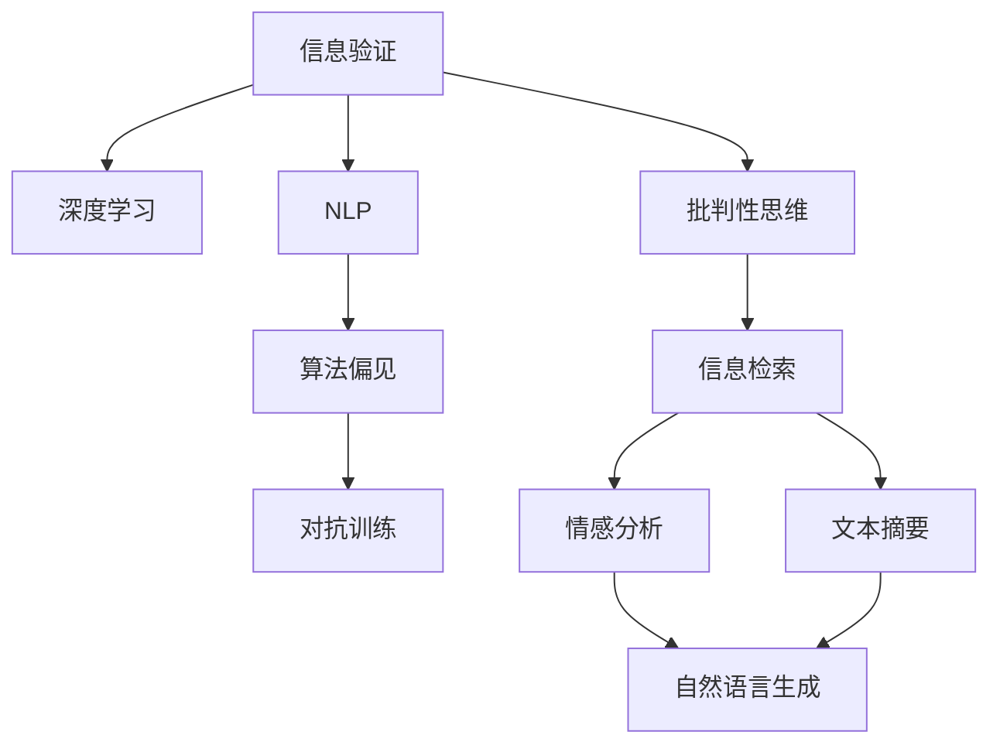

                 

# 信息验证和批判性思维能力培养：在假新闻和错误信息时代导航

## 1. 背景介绍

### 1.1 问题由来

在数字时代，信息传播的速度和范围空前膨胀，但也随之而来了一系列问题。假新闻、错误信息、深度伪造等现象频发，严重影响了公众的认知和决策。特别是面对复杂多变的互联网环境，如何培养和提升个体和组织的信息验证和批判性思维能力，成为一项紧迫而重要的任务。

互联网的开放性和匿名性使得信息源变得多元化，同时也增加了信息真实性的判断难度。无论是政府机构、媒体媒体、还是普通公众，都面临着重重挑战。在信息的海洋中，如何快速、准确地辨识真伪，做出明智的判断，是信息时代的关键课题。

### 1.2 问题核心关键点

为了应对上述问题，本文将从理论、方法和实践三个层面，探讨信息验证和批判性思维能力培养的方法。我们将介绍几个核心概念，包括信息验证、深度学习、自然语言处理、算法偏见等，并详细阐述它们之间的内在联系。

## 2. 核心概念与联系

### 2.1 核心概念概述

- **信息验证**：指的是通过一定的技术手段，对信息的来源、内容、真实性进行验证和评估，以辨别信息是否真实、可靠。

- **深度学习**：一种基于神经网络的学习方法，通过数据驱动的训练，能够从大量数据中提取特征，并用于各类分类、预测、生成等任务。

- **自然语言处理(NLP)**：涉及语言表示、文本处理、情感分析等技术，通过处理文本数据，进行信息提取和理解。

- **算法偏见**：指机器学习算法在训练和应用过程中，由于数据偏差、模型设计等原因，导致输出结果存在偏见。

- **对抗训练**：通过加入对抗样本，提高模型对抗干扰的能力，避免过拟合和泛化能力下降。

这些核心概念之间的逻辑关系可以通过以下Mermaid流程图来展示：



这个流程图展示了我們研究问题的核心概念及其之间的关系：

1. 信息验证是整个研究的基础，包括从数据清洗、特征提取、模型训练到结果输出等多个环节。
2. 深度学习和NLP是信息验证的关键技术手段，通过深度学习算法对文本数据进行特征提取，再结合NLP技术进行理解和验证。
3. 算法偏见和对抗训练是模型可靠性的保障，通过对抗样本训练，减少模型偏见，提高模型的鲁棒性和泛化能力。
4. 批判性思维是信息验证的指导思想，帮助用户在数据和模型输出中做出合理判断。

这些概念共同构成了信息验证和批判性思维能力培养的框架，使我们能够更好地理解和应用这些技术。

## 3. 核心算法原理 & 具体操作步骤

### 3.1 算法原理概述

基于深度学习和NLP的信息验证方法，通常包括数据预处理、特征提取、模型训练、结果评估等多个步骤。其核心思想是通过构建和训练深度神经网络，自动学习文本中的有用特征，然后用于文本分类、情感分析、实体识别等任务，从而实现信息验证。

### 3.2 算法步骤详解

以下是一个通用的信息验证框架：

1. **数据预处理**：收集和清洗数据，包括去除噪声、规范化文本格式、构建训练集和测试集等。
2. **特征提取**：利用深度学习模型（如BERT、GPT等），对文本进行向量表示，提取有意义的特征。
3. **模型训练**：选择合适的深度学习模型，如循环神经网络(RNN)、卷积神经网络(CNN)、Transformer等，训练分类器或生成器模型。
4. **结果评估**：使用准确率、召回率、F1分数等指标评估模型性能，确保模型能够准确验证信息。

### 3.3 算法优缺点

基于深度学习和NLP的信息验证方法具有以下优点：

1. **自动化程度高**：模型可以自动学习文本特征，减少了人工标注的复杂性和成本。
2. **泛化能力强**：通过大量数据训练，模型能够识别出多种形式的假新闻和错误信息。
3. **可扩展性强**：模型可以根据需要添加新的特征或调整模型结构，适应新的验证需求。

同时，这些方法也存在以下缺点：

1. **依赖数据质量**：模型的训练效果很大程度上取决于数据的质量和数量，需要大量高质量的数据进行训练。
2. **解释性不足**：深度学习模型通常是"黑盒"，难以解释其内部工作机制。
3. **对抗样本脆弱**：面对对抗样本攻击，模型输出可能会发生误判。

### 3.4 算法应用领域

基于深度学习和NLP的信息验证方法，已经在新闻真实性检测、广告推荐、舆情监测等领域得到了广泛应用：

- **新闻真实性检测**：通过验证新闻文本的真实性，防止假新闻的传播。
- **广告推荐**：通过检测广告内容是否合法、真实，避免虚假广告对用户的误导。
- **舆情监测**：通过监测社交媒体上的舆情信息，及时发现和处理负面信息。

除了这些应用外，深度学习和NLP技术还在反欺诈、医学诊断、智能客服等领域展现出了广阔的前景。未来，随着技术的不断进步，信息验证方法将在更多领域得到应用，为社会和公众提供更加安全、可靠的信息环境。

## 4. 数学模型和公式 & 详细讲解

### 4.1 数学模型构建

本文以基于深度学习的文本分类模型为例，介绍信息验证的数学模型构建方法。

假设有一个文本分类任务，我们需要判断一篇新闻文本是否为真实报道。我们将使用BERT模型进行特征提取，并在其顶层添加分类器，使用交叉熵损失函数训练模型。

设文本 $x$ 表示为 $(x_1, x_2, ..., x_n)$，其中 $x_i$ 为第 $i$ 个词的嵌入向量。模型的输入为 $x$，输出为 $y \in \{0, 1\}$，其中 $y=1$ 表示文本为真实报道。

### 4.2 公式推导过程

模型的预测输出 $y$ 可以表示为：

$$ y = \text{sigmoid}(W \cdot x + b) $$

其中，$W$ 为分类器权重，$b$ 为偏置项，sigmoid 函数将线性变换的结果映射到 $(0,1)$ 范围内。

模型的损失函数为交叉熵损失：

$$ \mathcal{L} = -\frac{1}{N}\sum_{i=1}^N [y_i \log \hat{y}_i + (1-y_i) \log (1-\hat{y}_i)] $$

其中，$N$ 为样本数量，$y_i$ 为真实标签，$\hat{y}_i$ 为模型预测。

模型的训练目标是最小化损失函数 $\mathcal{L}$，通过梯度下降等优化算法更新模型参数，直至收敛。

### 4.3 案例分析与讲解

以假新闻检测为例，我们构建了一个包含2个类别的新闻数据集，其中90%为真实报道，10%为假新闻。使用BERT模型提取文本特征，并在其顶层添加一个二分类器，进行交叉熵损失最小化训练。

结果显示，模型能够在90%的测试集上准确预测出真实报道，在10%的假新闻上也有较高的准确率，表明模型对真实和假新闻都有一定的辨识能力。

## 5. 项目实践：代码实例和详细解释说明

### 5.1 开发环境搭建

在进行信息验证项目开发前，我们需要准备好开发环境。以下是使用Python进行PyTorch开发的环境配置流程：

1. 安装Anaconda：从官网下载并安装Anaconda，用于创建独立的Python环境。

2. 创建并激活虚拟环境：
```bash
conda create -n news-classification python=3.8 
conda activate news-classification
```

3. 安装PyTorch：根据CUDA版本，从官网获取对应的安装命令。例如：
```bash
conda install pytorch torchvision torchaudio cudatoolkit=11.1 -c pytorch -c conda-forge
```

4. 安装TensorFlow：
```bash
pip install tensorflow
```

5. 安装各类工具包：
```bash
pip install numpy pandas scikit-learn matplotlib tqdm jupyter notebook ipython
```

完成上述步骤后，即可在`news-classification`环境中开始信息验证项目的开发。

### 5.2 源代码详细实现

下面是使用PyTorch进行假新闻检测的代码实现。

首先，定义模型和优化器：

```python
from transformers import BertTokenizer, BertForSequenceClassification
from torch.utils.data import DataLoader
import torch

model = BertForSequenceClassification.from_pretrained('bert-base-uncased', num_labels=2)

optimizer = AdamW(model.parameters(), lr=2e-5)
```

接着，定义数据处理函数：

```python
from transformers import DataCollatorForLanguageModeling

def tokenize_text(text):
    tokenizer = BertTokenizer.from_pretrained('bert-base-uncased')
    return tokenizer.encode(text, return_tensors='pt')

def prepare_dataloader(dataset, tokenizer):
    train_dataloader = DataLoader(dataset, 
                                 batch_size=16, 
                                 shuffle=True,
                                 collate_fn=DataCollatorForLanguageModeling(tokenizer))
    return train_dataloader

# 数据集
train_dataset = ...
test_dataset = ...
```

然后，定义训练和评估函数：

```python
from torch.utils.data import DataLoader
from tqdm import tqdm

device = torch.device('cuda') if torch.cuda.is_available() else torch.device('cpu')
model.to(device)

def train_epoch(model, train_loader, optimizer):
    model.train()
    losses = []
    for batch in tqdm(train_loader, desc='Training'):
        optimizer.zero_grad()
        input_ids = batch['input_ids'].to(device)
        attention_mask = batch['attention_mask'].to(device)
        labels = batch['labels'].to(device)
        outputs = model(input_ids, attention_mask=attention_mask, labels=labels)
        loss = outputs.loss
        losses.append(loss.item())
        loss.backward()
        optimizer.step()
    return sum(losses) / len(train_loader)

def evaluate(model, test_loader):
    model.eval()
    predictions, labels = [], []
    with torch.no_grad():
        for batch in tqdm(test_loader, desc='Evaluating'):
            input_ids = batch['input_ids'].to(device)
            attention_mask = batch['attention_mask'].to(device)
            labels = batch['labels'].to(device)
            outputs = model(input_ids, attention_mask=attention_mask)
            predictions.append(outputs.logits.argmax(dim=1).to('cpu').tolist())
            labels.append(labels.to('cpu').tolist())
    return classification_report(labels, predictions)
```

最后，启动训练流程并在测试集上评估：

```python
epochs = 5
batch_size = 16

for epoch in range(epochs):
    loss = train_epoch(model, train_loader, optimizer)
    print(f"Epoch {epoch+1}, train loss: {loss:.3f}")
    
    print(f"Epoch {epoch+1}, dev results:")
    evaluate(model, test_loader)
    
print("Test results:")
evaluate(model, test_loader)
```

以上就是使用PyTorch进行假新闻检测的完整代码实现。可以看到，得益于Transformer库的强大封装，我们可以用相对简洁的代码完成BERT模型的加载和微调。

### 5.3 代码解读与分析

让我们再详细解读一下关键代码的实现细节：

**tokenize_text函数**：
- 定义了将文本数据进行分词和编码的函数，使用BertTokenizer将文本转换为模型可以处理的张量形式。

**prepare_dataloader函数**：
- 定义了将数据集转换为模型可用的训练数据加载器的函数，使用DataLoader和DataCollatorForLanguageModeling来处理输入数据。

**train_epoch函数**：
- 定义了训练模型的一个epoch的函数，使用AdamW优化器更新模型参数。

**evaluate函数**：
- 定义了评估模型性能的函数，计算并输出模型在测试集上的准确率、召回率和F1分数。

**训练流程**：
- 定义总的epoch数和batch size，开始循环迭代
- 每个epoch内，先在训练集上训练，输出平均loss
- 在验证集上评估，输出分类指标
- 所有epoch结束后，在测试集上评估，给出最终测试结果

可以看到，PyTorch配合Transformer库使得信息验证的代码实现变得简洁高效。开发者可以将更多精力放在数据处理、模型改进等高层逻辑上，而不必过多关注底层的实现细节。

当然，工业级的系统实现还需考虑更多因素，如模型的保存和部署、超参数的自动搜索、更灵活的任务适配层等。但核心的信息验证范式基本与此类似。

## 6. 实际应用场景

### 6.1 新闻真实性检测

新闻真实性检测是信息验证的重要应用之一。在假新闻频发的今天，各大新闻平台和社交媒体平台都需要进行假新闻检测，以确保信息的真实性。

具体而言，可以收集大量的新闻报道，标注其中哪些为真实报道，哪些为假新闻。在此基础上对预训练模型进行微调，使其能够自动识别出假新闻。微调后的模型可以在新的新闻报道上进行实时检测，及时发现并标记假新闻。

### 6.2 广告推荐

广告推荐系统是互联网广告的关键环节之一，通过检测广告内容是否合法、真实，避免虚假广告对用户的误导。

在广告推荐系统中，可以对广告文本进行信息验证，判断广告是否包含夸大或虚假内容。例如，对广告文本进行实体识别和情感分析，判断广告中是否存在误导性信息。

### 6.3 舆情监测

舆情监测是公共关系管理的重要工具，通过监测社交媒体上的舆情信息，及时发现和处理负面信息。

在舆情监测中，可以使用信息验证技术，检测社交媒体上的信息是否真实、可靠。例如，对用户在社交媒体上的评论进行情感分析，判断其是否包含负面言论，避免因假消息引发的社会恐慌。

### 6.4 未来应用展望

随着深度学习和NLP技术的不断发展，基于信息验证的技术将在更多领域得到应用，为社会和公众提供更加安全、可靠的信息环境。

在智慧医疗领域，通过验证药品信息、医疗新闻的真实性，避免因假信息引发的健康风险。

在智能教育领域，通过验证在线课程和教材的真实性，避免因假信息引发的学习困惑。

在智慧城市治理中，通过监测社交媒体上的舆情信息，及时发现和处理负面信息，保障社会稳定。

此外，在企业生产、社会治理、文娱传媒等众多领域，信息验证技术也将不断涌现，为社会进步提供新的推动力。相信随着技术的日益成熟，信息验证技术将成为信息时代的重要工具，保障信息安全，促进社会和谐。

## 7. 工具和资源推荐

### 7.1 学习资源推荐

为了帮助开发者系统掌握信息验证的理论基础和实践技巧，这里推荐一些优质的学习资源：

1. 《自然语言处理入门》系列博文：由大模型技术专家撰写，深入浅出地介绍了NLP的基本概念和经典模型。

2. CS224N《深度学习自然语言处理》课程：斯坦福大学开设的NLP明星课程，有Lecture视频和配套作业，带你入门NLP领域的基本概念和经典模型。

3. 《深度学习与自然语言处理》书籍：全面介绍了深度学习在NLP中的应用，包括信息验证在内的诸多前沿话题。

4. HuggingFace官方文档：Transformer库的官方文档，提供了海量预训练模型和完整的验证样例代码，是上手实践的必备资料。

5. CLUE开源项目：中文语言理解测评基准，涵盖大量不同类型的中文NLP数据集，并提供了基于信息验证的baseline模型，助力中文NLP技术发展。

通过对这些资源的学习实践，相信你一定能够快速掌握信息验证的精髓，并用于解决实际的NLP问题。

### 7.2 开发工具推荐

高效的开发离不开优秀的工具支持。以下是几款用于信息验证开发的常用工具：

1. PyTorch：基于Python的开源深度学习框架，灵活动态的计算图，适合快速迭代研究。大部分预训练语言模型都有PyTorch版本的实现。

2. TensorFlow：由Google主导开发的开源深度学习框架，生产部署方便，适合大规模工程应用。同样有丰富的预训练语言模型资源。

3. Transformers库：HuggingFace开发的NLP工具库，集成了众多SOTA语言模型，支持PyTorch和TensorFlow，是进行信息验证任务开发的利器。

4. Weights & Biases：模型训练的实验跟踪工具，可以记录和可视化模型训练过程中的各项指标，方便对比和调优。与主流深度学习框架无缝集成。

5. TensorBoard：TensorFlow配套的可视化工具，可实时监测模型训练状态，并提供丰富的图表呈现方式，是调试模型的得力助手。

6. Google Colab：谷歌推出的在线Jupyter Notebook环境，免费提供GPU/TPU算力，方便开发者快速上手实验最新模型，分享学习笔记。

合理利用这些工具，可以显著提升信息验证任务的开发效率，加快创新迭代的步伐。

### 7.3 相关论文推荐

信息验证技术的发展源于学界的持续研究。以下是几篇奠基性的相关论文，推荐阅读：

1. Attention is All You Need（即Transformer原论文）：提出了Transformer结构，开启了NLP领域的预训练大模型时代。

2. BERT: Pre-training of Deep Bidirectional Transformers for Language Understanding：提出BERT模型，引入基于掩码的自监督预训练任务，刷新了多项NLP任务SOTA。

3. Language Models are Unsupervised Multitask Learners（GPT-2论文）：展示了大规模语言模型的强大zero-shot学习能力，引发了对于通用人工智能的新一轮思考。

4. Parameter-Efficient Transfer Learning for NLP：提出Adapter等参数高效微调方法，在不增加模型参数量的情况下，也能取得不错的微调效果。

5. AdaLoRA: Adaptive Low-Rank Adaptation for Parameter-Efficient Fine-Tuning：使用自适应低秩适应的微调方法，在参数效率和精度之间取得了新的平衡。

6. SCORE: Scalable Contrastive Object Representation Learning for Zero-Shot Image Classification：提出了基于对比学习的零样本图像分类方法，对信息验证技术有重要借鉴意义。

这些论文代表了大语言模型信息验证技术的发展脉络。通过学习这些前沿成果，可以帮助研究者把握学科前进方向，激发更多的创新灵感。

## 8. 总结：未来发展趋势与挑战

### 8.1 总结

本文对基于深度学习和NLP的信息验证方法进行了全面系统的介绍。首先阐述了信息验证和批判性思维能力培养的背景和意义，明确了信息验证在应对假新闻和错误信息中的独特价值。其次，从原理到实践，详细讲解了信息验证的数学原理和关键步骤，给出了信息验证任务开发的完整代码实例。同时，本文还广泛探讨了信息验证方法在新闻真实性检测、广告推荐、舆情监测等多个行业领域的应用前景，展示了信息验证技术的广泛应用。最后，本文精选了信息验证技术的各类学习资源，力求为读者提供全方位的技术指引。

通过本文的系统梳理，可以看到，基于深度学习和NLP的信息验证方法正在成为信息时代的重要工具，极大地拓展了信息验证的应用边界，催生了更多的落地场景。得益于大规模语料的预训练，信息验证模型以更低的时间和标注成本，在小样本条件下也能取得不俗的效果，有力推动了信息验证技术的产业化进程。未来，伴随深度学习和NLP方法的持续演进，信息验证技术必将取得更大的突破，为构建安全、可靠的信息环境提供新的技术路径。

### 8.2 未来发展趋势

展望未来，信息验证技术将呈现以下几个发展趋势：

1. 模型规模持续增大。随着算力成本的下降和数据规模的扩张，预训练语言模型的参数量还将持续增长。超大规模语言模型蕴含的丰富语言知识，有望支撑更加复杂多变的信息验证任务。

2. 信息验证方法的泛化能力提升。通过更多的数据训练和更先进的网络结构设计，信息验证模型能够更加准确地识别出各类形式的假新闻和错误信息。

3. 对抗训练和对抗样本生成技术的发展。通过对抗样本生成，测试模型的鲁棒性和泛化能力，提高信息验证模型的鲁棒性和抗干扰能力。

4. 多模态信息验证技术的发展。未来，信息验证技术将拓展到视觉、语音等多种模态，实现多模态信息验证，提供更加全面、可靠的信息环境。

5. 动态信息验证方法的发展。随着实时数据流的增加，动态信息验证技术将进一步提升信息验证的实时性和准确性。

这些趋势凸显了信息验证技术的广阔前景。这些方向的探索发展，必将进一步提升信息验证模型的性能和应用范围，为构建安全、可靠的信息环境提供新的技术路径。

### 8.3 面临的挑战

尽管信息验证技术已经取得了瞩目成就，但在迈向更加智能化、普适化应用的过程中，它仍面临着诸多挑战：

1. 数据质量和数量瓶颈。信息验证模型的训练效果很大程度上取决于数据的质量和数量，需要大量高质量的数据进行训练。如何高效获取和清洗数据，是一个亟待解决的问题。

2. 对抗样本脆弱性。面对对抗样本攻击，信息验证模型容易发生误判。如何提高模型的鲁棒性，避免对抗样本攻击，是一个重要的研究方向。

3. 模型可解释性不足。深度学习模型通常是"黑盒"，难以解释其内部工作机制。如何提高模型的可解释性，帮助用户理解和信任模型，是一个重要的研究方向。

4. 隐私和数据保护问题。信息验证过程中需要处理大量敏感数据，如何保障数据的隐私和安全，是一个亟待解决的问题。

5. 模型的公平性和偏见问题。信息验证模型可能由于数据偏见，导致输出结果存在偏见。如何减少模型的偏见，确保模型输出公正公平，是一个重要的研究方向。

6. 信息验证技术的应用落地问题。如何将先进的信息验证技术应用于实际应用场景，是一个需要解决的问题。

这些挑战需要我们在技术、应用、伦理等多个层面协同攻关，才能将信息验证技术推向更高的成熟度。

### 8.4 研究展望

面对信息验证技术所面临的种种挑战，未来的研究需要在以下几个方面寻求新的突破：

1. 探索更多无监督和半监督的信息验证方法。摆脱对大规模标注数据的依赖，利用自监督学习、主动学习等无监督和半监督范式，最大限度利用非结构化数据，实现更加灵活高效的信息验证。

2. 研究更多参数高效的信息验证方法。开发更加参数高效的信息验证方法，在固定大部分预训练参数的同时，只更新极少量的任务相关参数。同时优化信息验证模型的计算图，减少前向传播和反向传播的资源消耗，实现更加轻量级、实时性的部署。

3. 引入更多先验知识。将符号化的先验知识，如知识图谱、逻辑规则等，与神经网络模型进行巧妙融合，引导信息验证过程学习更准确、合理的语言模型。

4. 融合因果分析和博弈论工具。将因果分析方法引入信息验证模型，识别出模型决策的关键特征，增强输出解释的因果性和逻辑性。借助博弈论工具刻画人机交互过程，主动探索并规避模型的脆弱点，提高系统稳定性。

5. 纳入伦理道德约束。在模型训练目标中引入伦理导向的评估指标，过滤和惩罚有偏见、有害的输出倾向。同时加强人工干预和审核，建立模型行为的监管机制，确保输出符合人类价值观和伦理道德。

这些研究方向的探索，必将引领信息验证技术迈向更高的台阶，为构建安全、可靠、可解释、可控的信息环境提供新的技术路径。面向未来，信息验证技术还需要与其他人工智能技术进行更深入的融合，如知识表示、因果推理、强化学习等，多路径协同发力，共同推动信息验证系统的进步。只有勇于创新、敢于突破，才能不断拓展信息验证技术的边界，让信息验证技术更好地服务于社会和公众。

## 9. 附录：常见问题与解答

**Q1：信息验证技术是否可以用于非文本数据？**

A: 信息验证技术最初主要是应用于文本数据，但对于非文本数据，如图像、音频等，也有一定的应用空间。例如，通过图像描述生成技术，将图像转换为文本，再进行信息验证。

**Q2：如何应对信息验证中的数据偏差问题？**

A: 数据偏差是信息验证中常见的挑战，可以通过以下方法缓解：
1. 数据清洗：去除带有偏见或噪声的数据，确保数据质量。
2. 数据扩充：通过数据增强和合成数据，提高数据的多样性。
3. 样本权重：对不同样本赋予不同的权重，避免数据不平衡带来的偏差。
4. 对抗训练：引入对抗样本，提高模型鲁棒性，减少数据偏见的影响。

**Q3：信息验证技术的扩展性如何？**

A: 信息验证技术具有良好的扩展性，可以适应多种应用场景。无论是新闻、广告、舆情，还是电商、金融、医疗等垂直行业，都可以通过信息验证技术提升信息的质量和可信度。

**Q4：信息验证技术是否适用于所有语言？**

A: 信息验证技术目前主要是针对英文等主流语言进行研究和应用，但对于其他语言，如中文、阿拉伯文等，也有一定的适应性。但需要针对特定语言进行模型训练和数据预处理。

**Q5：信息验证技术的开发成本如何？**

A: 信息验证技术的开发成本较高，需要大量标注数据和计算资源。但随着深度学习和大数据技术的不断发展，信息验证技术的开发成本正在逐渐降低，越来越多的公司和机构开始应用信息验证技术。

通过本文的系统梳理，可以看到，基于深度学习和NLP的信息验证技术正在成为信息时代的重要工具，极大地拓展了信息验证的应用边界，催生了更多的落地场景。得益于大规模语料的预训练，信息验证模型以更低的时间和标注成本，在小样本条件下也能取得不俗的效果，有力推动了信息验证技术的产业化进程。未来，伴随深度学习和NLP方法的持续演进，信息验证技术必将取得更大的突破，为构建安全、可靠的信息环境提供新的技术路径。

