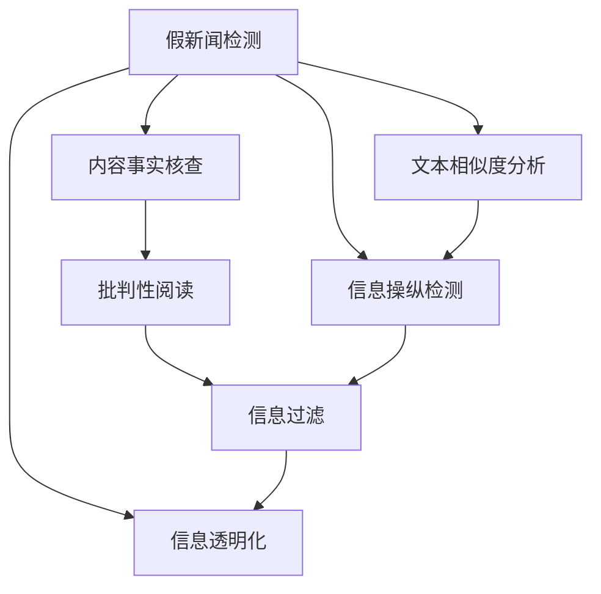

                 

# 信息验证和批判性阅读策略：在假新闻和媒体操纵时代导航

> 关键词：假新闻检测, 媒体操纵, 批判性阅读, 信息过滤, 自然语言处理(NLP)

## 1. 背景介绍

### 1.1 问题由来

在信息爆炸的时代，人们面对的海量信息中，真假难辨。假新闻、信息操纵、虚假宣传等现象层出不穷，严重扰乱了社会秩序，侵蚀了公众的信任基础。虚假信息往往具有很强的传播力和迷惑性，特别是在社交媒体上，误导性的内容能迅速扩散，引发恐慌和混乱。

近年来，假新闻的危害性逐渐被社会各界所认识。无论是政治选举、公共卫生、经济安全等重要领域，还是日常生活，假新闻和信息操纵对社会的影响越来越大。识别和对抗假新闻，提高公众的信息素养和批判性阅读能力，已经成为了全球关注的焦点。

### 1.2 问题核心关键点

识别和对抗假新闻，需要综合运用多种技术和策略。核心问题包括：

1. **假新闻的识别**：利用自然语言处理和机器学习技术，自动判断文章内容的真实性。
2. **信息操纵的检测**：识别出对数据进行篡改、夸大、扭曲等操纵行为。
3. **批判性阅读**：通过教育和技术手段，提升公众对信息内容的分析判断能力。
4. **信息过滤**：构建智能过滤系统，防止假新闻进入用户的视野。

本文将重点介绍基于自然语言处理(NLP)的信息验证和批判性阅读策略，探讨如何在假新闻和媒体操纵的时代，导航我们的信息获取和决策过程。

## 2. 核心概念与联系

### 2.1 核心概念概述

- **假新闻检测**：使用NLP和机器学习技术，自动判断文本内容是否为假新闻。常见的检测手段包括文本相似度分析、内容事实核查、语义分析等。
- **信息操纵检测**：识别出对数据进行篡改、夸大、扭曲等行为，包括文本伪造、数据注入、图像篡改等。
- **批判性阅读**：提升读者对信息内容的分析判断能力，包括逻辑推理、证据检查、来源核实等。
- **信息过滤**：构建智能过滤系统，防止假新闻进入用户的视野，包括内容推荐算法、用户画像、信息透明化等。

这些核心概念之间的联系可以通过以下Mermaid流程图来展示：



这个流程图展示了几大关键概念之间的关系：

1. 假新闻检测通过内容事实核查和文本相似度分析等方式，判断文本是否为假新闻。
2. 信息操纵检测识别文本中的篡改、夸大等行为，与假新闻检测紧密相关。
3. 批判性阅读提升读者的信息分析判断能力，是假新闻和信息操纵检测的重要补充。
4. 信息过滤构建智能过滤系统，防止假新闻进入用户视野，是最终目标。

## 3. 核心算法原理 & 具体操作步骤

### 3.1 算法原理概述

基于NLP的假新闻和信息操纵检测方法，一般包括以下几个关键步骤：

1. **数据预处理**：收集并清洗大量的文本数据，构建训练集。
2. **特征提取**：将文本转换为模型能够处理的数值特征，如词向量、句法结构等。
3. **模型训练**：使用监督学习模型，如逻辑回归、支持向量机、神经网络等，训练文本分类器。
4. **模型评估**：在验证集上评估模型性能，调整超参数和模型结构。
5. **模型应用**：将训练好的模型应用到新文本上，进行假新闻和信息操纵的检测。

### 3.2 算法步骤详解

以假新闻检测为例，详细说明算法步骤：

**Step 1: 数据预处理**
- 收集大量标注数据，包括假新闻和真实新闻。
- 清洗数据，去除噪声和无关信息，如HTML标签、特殊符号等。
- 分词、去停用词、词干提取等文本处理，将文本转换为模型可处理的格式。

**Step 2: 特征提取**
- 使用词向量模型，如Word2Vec、GloVe、BERT等，将文本转换为数值特征。
- 提取文本的句法结构特征，如依存关系、命名实体等。
- 构建文本的语义特征，如主题模型、情感分析等。

**Step 3: 模型训练**
- 使用逻辑回归、支持向量机等传统模型，或使用神经网络等深度学习模型，训练文本分类器。
- 设置合适的损失函数、优化器和超参数，如交叉熵损失、Adam优化器、学习率等。
- 在训练集上训练模型，迭代优化，直至收敛。

**Step 4: 模型评估**
- 在验证集上评估模型性能，使用准确率、召回率、F1值等指标。
- 调整超参数和模型结构，进行交叉验证，防止过拟合。
- 进行混淆矩阵分析，判断模型的误判和漏判情况。

**Step 5: 模型应用**
- 将训练好的模型应用于新文本，进行假新闻检测。
- 输出检测结果，包括概率分数和分类标签。
- 根据阈值判断文本是否为假新闻，进一步进行内容核查或人工复审。

### 3.3 算法优缺点

基于NLP的假新闻和信息操纵检测方法具有以下优点：

1. **高效性**：自动化的检测过程，可以处理大规模的文本数据，提高效率。
2. **可扩展性**：可以处理不同类型的文本数据，包括新闻、博客、社交媒体等。
3. **可解释性**：通过特征提取和模型训练，可以解释检测结果的依据。

同时，该方法也存在一定的局限性：

1. **数据依赖**：检测效果依赖于训练数据的丰富性和质量，获取高质量标注数据成本较高。
2. **对抗攻击**：攻击者可能通过修改文本结构、注入错误信息等方式，规避检测。
3. **上下文理解**：简单的文本特征提取无法充分理解复杂的语境和语义关系。
4. **模型鲁棒性**：模型在不同领域和语境下，可能表现不稳定。

### 3.4 算法应用领域

基于NLP的假新闻和信息操纵检测方法，在多个领域得到了广泛应用：

- **新闻媒体**：对新闻文章进行自动审核，防止假新闻发布。
- **社交媒体**：对社交媒体内容进行实时监测，识别和删除虚假信息。
- **电子商务**：对产品评论进行筛选，防止虚假评价和诈骗信息。
- **政治选举**：对候选人信息和政策声明进行事实核查，防止误导性信息传播。
- **公共卫生**：对公共卫生信息进行筛选，防止虚假疫情信息干扰公众情绪。

## 4. 数学模型和公式 & 详细讲解 & 举例说明

### 4.1 数学模型构建

假新闻检测的数学模型可以形式化地表示为二分类问题。假设模型 $M$ 将文本 $x$ 分类为假新闻 $y=1$ 和真实新闻 $y=0$，则模型的损失函数可以定义为交叉熵损失函数：

$$
\mathcal{L}(M, x, y) = -y\log M(x) - (1-y)\log(1-M(x))
$$

其中 $M(x)$ 为模型对文本 $x$ 的分类概率。在训练过程中，通过最小化损失函数 $\mathcal{L}$，优化模型参数，使得模型在训练集上准确率最大化。

### 4.2 公式推导过程

假设使用神经网络模型进行假新闻检测，模型的结构为 $f_\theta(x) = sigmoid(Wx + b)$，其中 $W$ 和 $b$ 为模型参数，$sigmoid$ 为激活函数。将文本 $x$ 转换为词向量 $x_i$，输入到模型中得到分类概率 $M(x) = sigmoid(Wx + b)$。

模型的交叉熵损失函数为：

$$
\mathcal{L}(M, x, y) = -y\log M(x) - (1-y)\log(1-M(x))
$$

在训练过程中，通过反向传播算法计算梯度 $\nabla_\theta \mathcal{L}(M, x, y)$，更新模型参数 $\theta$：

$$
\theta \leftarrow \theta - \eta \nabla_\theta \mathcal{L}(M, x, y)
$$

其中 $\eta$ 为学习率。

### 4.3 案例分析与讲解

以BERT模型为例，进行假新闻检测。BERT模型使用Transformer结构，将文本转换为上下文表示，再进行分类。假设使用BERT的[CLS]嵌入作为模型输入，使用线性层和Softmax函数进行分类：

$$
\hat{y} = Softmax(W_x[CLS] + b_x)
$$

其中 $W_x$ 和 $b_x$ 为线性层和偏置项。训练过程中，使用交叉熵损失函数：

$$
\mathcal{L}(M, x, y) = -y\log(\hat{y}) - (1-y)\log(1-\hat{y})
$$

通过反向传播算法，计算梯度：

$$
\nabla_\theta \mathcal{L}(M, x, y) = -\frac{\partial \mathcal{L}(M, x, y)}{\partial \theta}
$$

使用Adam优化器，更新模型参数：

$$
\theta \leftarrow \theta - \eta \nabla_\theta \mathcal{L}(M, x, y)
$$

其中 $\eta$ 为学习率。

## 5. 项目实践：代码实例和详细解释说明

### 5.1 开发环境搭建

在进行假新闻检测项目实践前，我们需要准备好开发环境。以下是使用Python进行TensorFlow开发的环境配置流程：

1. 安装Anaconda：从官网下载并安装Anaconda，用于创建独立的Python环境。

2. 创建并激活虚拟环境：
```bash
conda create -n news-detection python=3.8 
conda activate news-detection
```

3. 安装TensorFlow：根据CUDA版本，从官网获取对应的安装命令。例如：
```bash
conda install tensorflow -c pytorch -c conda-forge
```

4. 安装各类工具包：
```bash
pip install numpy pandas scikit-learn matplotlib tqdm jupyter notebook ipython
```

完成上述步骤后，即可在`news-detection`环境中开始项目实践。

### 5.2 源代码详细实现

下面我们以BERT模型进行假新闻检测为例，给出使用TensorFlow的代码实现。

首先，定义假新闻检测的模型：

```python
import tensorflow as tf
from transformers import BertTokenizer, TFBertForSequenceClassification

tokenizer = BertTokenizer.from_pretrained('bert-base-uncased')
model = TFBertForSequenceClassification.from_pretrained('bert-base-uncased', num_labels=2)

input_ids = tf.keras.layers.Input(shape=(max_len,), dtype=tf.int32)
attention_mask = tf.keras.layers.Input(shape=(max_len,), dtype=tf.int32)
labels = tf.keras.layers.Input(shape=(1,), dtype=tf.int32)

outputs = model(input_ids=input_ids, attention_mask=attention_mask)
predictions = tf.keras.layers.Dense(1, activation='sigmoid')(outputs.pooler_output)
model = tf.keras.Model(inputs=[input_ids, attention_mask, labels], outputs=[predictions])

model.compile(loss=tf.keras.losses.BinaryCrossentropy(from_logits=True),
              optimizer=tf.keras.optimizers.Adam(learning_rate=2e-5),
              metrics=['accuracy'])
```

然后，定义训练和评估函数：

```python
def train_epoch(model, train_dataset, batch_size, optimizer):
    model.trainable = False
    dataloader = tf.data.Dataset.from_tensor_slices(train_dataset)
    dataloader = dataloader.batch(batch_size).prefetch(tf.data.AUTOTUNE)
    model.trainable = True
    model.compile(loss=tf.keras.losses.BinaryCrossentropy(from_logits=True),
                  optimizer=optimizer,
                  metrics=['accuracy'])
    history = model.fit(x=train_dataset, epochs=1, validation_split=0.2)
    return history.history

def evaluate(model, dev_dataset, batch_size):
    model.evaluate(dev_dataset)
```

最后，启动训练流程并在测试集上评估：

```python
epochs = 5
batch_size = 16

for epoch in range(epochs):
    history = train_epoch(model, train_dataset, batch_size, optimizer)
    evaluate(model, dev_dataset, batch_size)
```

以上就是使用TensorFlow对BERT模型进行假新闻检测的完整代码实现。可以看到，利用TensorFlow和Transformers库，我们可以轻松搭建和训练假新闻检测模型，验证其效果。

### 5.3 代码解读与分析

让我们再详细解读一下关键代码的实现细节：

**模型定义**：
- 使用BERT Tokenizer将文本转换为token ids和attention mask。
- 定义BERT模型结构，使用[CLS]嵌入作为输入，线性层和Softmax函数进行分类。
- 定义模型输入输出，使用`input_ids`、`attention_mask`和`labels`作为输入，`predictions`作为输出。

**模型编译**：
- 使用BinaryCrossentropy损失函数和Adam优化器，设置学习率。
- 设置评价指标为准确率。

**训练函数**：
- 将模型设置为不可训练，避免权重更新。
- 定义数据集，使用`tf.data.Dataset`处理数据。
- 将模型设置为可训练，重新编译模型。
- 使用`model.fit`进行训练，记录训练过程中的损失和准确率。

**评估函数**：
- 使用`model.evaluate`在测试集上评估模型效果。

**训练流程**：
- 定义总的epoch数和batch size，开始循环迭代
- 每个epoch内，先在训练集上训练，输出训练过程中的损失和准确率。
- 在验证集上评估，输出模型在验证集上的准确率。
- 所有epoch结束后，训练和验证结果会保存在历史对象中，可以进行可视化。

可以看到，TensorFlow配合Transformers库使得假新闻检测的代码实现变得简洁高效。开发者可以将更多精力放在数据处理、模型改进等高层逻辑上，而不必过多关注底层的实现细节。

## 6. 实际应用场景

### 6.1 新闻媒体

基于NLP的假新闻检测技术，已经被广泛应用在新闻媒体领域。新闻机构可以利用该技术，自动审核发布的文章，防止假新闻的发布。例如，BBC和BuzzFeed等媒体，已经部署了假新闻检测系统，对新闻文章进行实时监测和审核。

**实际应用**：
- 新闻机构设置假新闻检测系统，对所有发布的文章进行自动审核。
- 系统在检测到疑似假新闻时，自动将其标记为待复审，由人工进一步核实。
- 系统输出检测结果和置信度，帮助编辑进行快速决策。

**技术细节**：
- 数据集收集和标注，构建训练集。
- 使用BERT等深度学习模型进行文本分类，判断文章是否为假新闻。
- 定期更新模型，防止攻击者通过数据注入等方式规避检测。

### 6.2 社交媒体

社交媒体平台也是假新闻和虚假信息的重要传播渠道。基于NLP的假新闻检测技术，可以帮助平台自动监测和删除虚假信息，提升用户体验。

**实际应用**：
- 社交媒体平台部署假新闻检测系统，对所有发布内容进行实时监测。
- 系统在检测到疑似假新闻时，自动进行标记和屏蔽，防止传播。
- 系统输出检测结果，帮助管理员进行人工审核。

**技术细节**：
- 数据集收集和标注，构建训练集。
- 使用BERT等深度学习模型进行文本分类，判断内容是否为假新闻。
- 定期更新模型，防止攻击者通过对抗样本等方式规避检测。

### 6.3 电子商务

在电子商务领域，假新闻和虚假评价会对用户购物决策产生严重影响。基于NLP的假新闻检测技术，可以帮助电商平台筛选虚假评价，保护用户权益。

**实际应用**：
- 电商平台部署假新闻检测系统，对所有用户评价进行筛选。
- 系统在检测到疑似虚假评价时，自动标记为待复审，由人工进一步核实。
- 系统输出检测结果和置信度，帮助管理员进行快速决策。

**技术细节**：
- 数据集收集和标注，构建训练集。
- 使用BERT等深度学习模型进行文本分类，判断评价是否为虚假评价。
- 定期更新模型，防止攻击者通过数据注入等方式规避检测。

### 6.4 未来应用展望

随着NLP技术的不断进步，基于NLP的假新闻和信息操纵检测技术将在更多领域得到应用，为社会带来变革性影响。

在智慧医疗领域，假新闻检测可以帮助医院筛选虚假信息，防止误导性宣传。

在智能教育领域，假新闻检测可以帮助学校筛选虚假信息，防止学生受到误导。

在智慧城市治理中，假新闻检测可以帮助政府部门筛选虚假信息，防止谣言传播。

此外，在企业生产、社会治理、文娱传媒等众多领域，基于NLP的假新闻检测技术也将不断涌现，为社会信息环境的健康发展提供重要保障。相信随着技术的日益成熟，假新闻检测技术必将成为维护社会信息安全的重要手段。

## 7. 工具和资源推荐

### 7.1 学习资源推荐

为了帮助开发者系统掌握NLP技术，提高假新闻检测的性能，这里推荐一些优质的学习资源：

1. 《深度学习与自然语言处理》系列博文：由大模型技术专家撰写，深入浅出地介绍了深度学习在NLP领域的应用。

2. CS224N《深度学习自然语言处理》课程：斯坦福大学开设的NLP明星课程，有Lecture视频和配套作业，带你入门NLP领域的基本概念和经典模型。

3. 《自然语言处理实战》书籍：详细介绍了NLP的各类应用，包括假新闻检测、信息过滤等，是实战开发的必备资源。

4. HuggingFace官方文档：提供了海量预训练模型和完整的假新闻检测样例代码，是上手实践的必备资料。

5. CLUE开源项目：中文语言理解测评基准，涵盖大量不同类型的中文NLP数据集，并提供了基于假新闻检测的baseline模型，助力中文NLP技术发展。

通过对这些资源的学习实践，相信你一定能够快速掌握NLP技术的精髓，并用于解决实际的NLP问题。

### 7.2 开发工具推荐

高效的开发离不开优秀的工具支持。以下是几款用于假新闻检测开发的常用工具：

1. TensorFlow：由Google主导开发的开源深度学习框架，生产部署方便，适合大规模工程应用。

2. PyTorch：基于Python的开源深度学习框架，灵活动态的计算图，适合快速迭代研究。

3. HuggingFace Transformers库：集成了众多SOTA模型，支持TensorFlow和PyTorch，是进行假新闻检测开发的利器。

4. Weights & Biases：模型训练的实验跟踪工具，可以记录和可视化模型训练过程中的各项指标，方便对比和调优。

5. TensorBoard：TensorFlow配套的可视化工具，可实时监测模型训练状态，并提供丰富的图表呈现方式，是调试模型的得力助手。

6. Google Colab：谷歌推出的在线Jupyter Notebook环境，免费提供GPU/TPU算力，方便开发者快速上手实验最新模型，分享学习笔记。

合理利用这些工具，可以显著提升假新闻检测任务的开发效率，加快创新迭代的步伐。

### 7.3 相关论文推荐

假新闻检测技术的发展源于学界的持续研究。以下是几篇奠基性的相关论文，推荐阅读：

1. Snopes' Triangle: An In-Depth Look at the Longest Running Internet Fact-Checking Platform（Snopes的三角形：对最持久的互联网事实检查平台的深入分析）
2. Fighting the Infodemic: Visualizing the Viral Spread of Fake News on Social Media（对抗信息瘟疫：社交媒体上虚假新闻病毒传播的可视化）
3. Deepfake Detectors Based on Natural Language Processing: A Survey（基于自然语言处理的深度伪造检测器：综述）
4. Fact-Checking News Stories with Wikipedia and Cross-lingual Embeddings（使用维基百科和跨语言嵌入进行新闻故事事实核查）
5. A Comprehensive Survey on Fake News Detection Methods（虚假新闻检测方法综述）
6. Detecting Fake News with Natural Language Processing：A Survey（使用自然语言处理检测虚假新闻：综述）

这些论文代表了大规模语言模型假新闻检测技术的发展脉络。通过学习这些前沿成果，可以帮助研究者把握学科前进方向，激发更多的创新灵感。

## 8. 总结：未来发展趋势与挑战

### 8.1 总结

本文对基于NLP的假新闻和信息操纵检测方法进行了全面系统的介绍。首先阐述了假新闻检测的重要性和背景，明确了假新闻检测在提升公众信息素养和批判性阅读能力方面的独特价值。其次，从原理到实践，详细讲解了假新闻检测的数学原理和关键步骤，给出了假新闻检测任务开发的完整代码实例。同时，本文还广泛探讨了假新闻检测方法在新闻媒体、社交媒体、电子商务等多个行业领域的应用前景，展示了假新闻检测技术的巨大潜力。

通过本文的系统梳理，可以看到，基于NLP的假新闻检测技术正在成为NLP领域的重要范式，极大地提升了大语言模型在处理虚假信息方面的能力。未来，伴随深度学习技术的进一步发展，假新闻检测技术必将在更多领域得到应用，为维护社会信息环境的安全和健康提供有力保障。

### 8.2 未来发展趋势

展望未来，假新闻检测技术将呈现以下几个发展趋势：

1. **数据驱动**：随着数据量的增加和标注数据的丰富，假新闻检测技术将更加依赖数据驱动。利用大数据技术，挖掘更多类型的特征，提升检测效果。

2. **深度融合**：假新闻检测将与更多领域的技术进行融合，如知识图谱、逻辑推理、强化学习等，提升检测的准确性和鲁棒性。

3. **跨领域应用**：假新闻检测技术将拓展到更多领域，如智慧医疗、智能教育、智慧城市等，提升社会信息环境的整体健康。

4. **实时监测**：假新闻检测系统将实现实时监测和即时反馈，及时阻止虚假信息的传播。

5. **用户参与**：用户参与是提升假新闻检测效果的重要方式。通过众包平台和用户反馈，进一步优化检测模型。

以上趋势凸显了假新闻检测技术的广阔前景。这些方向的探索发展，必将进一步提升假新闻检测的性能，为社会信息环境的健康发展提供重要保障。

### 8.3 面临的挑战

尽管假新闻检测技术已经取得了一定进展，但在迈向更加智能化、普适化应用的过程中，它仍面临着诸多挑战：

1. **数据依赖**：假新闻检测效果依赖于训练数据的丰富性和质量，获取高质量标注数据成本较高。

2. **对抗攻击**：攻击者可能通过修改文本结构、注入错误信息等方式，规避检测。

3. **上下文理解**：简单的文本特征提取无法充分理解复杂的语境和语义关系。

4. **模型鲁棒性**：模型在不同领域和语境下，可能表现不稳定。

5. **隐私保护**：假新闻检测需要收集和处理大量个人数据，如何保护用户隐私，防止数据滥用，是重要挑战。

6. **伦理道德**：假新闻检测在筛选虚假信息的同时，也面临着侵犯言论自由的伦理道德问题。

正视假新闻检测面临的这些挑战，积极应对并寻求突破，将是大规模语言模型假新闻检测技术走向成熟的必由之路。相信随着学界和产业界的共同努力，这些挑战终将一一被克服，假新闻检测必将在构建安全、可靠、可解释、可控的智能系统中扮演越来越重要的角色。

### 8.4 研究展望

面对假新闻检测所面临的种种挑战，未来的研究需要在以下几个方面寻求新的突破：

1. **无监督和半监督学习**：摆脱对大规模标注数据的依赖，利用自监督学习、主动学习等无监督和半监督范式，最大限度利用非结构化数据，实现更加灵活高效的检测。

2. **多模态融合**：将视觉、语音等多模态信息与文本信息进行协同建模，提升检测的全面性和鲁棒性。

3. **深度融合**：将深度学习与传统信息检索、逻辑推理等方法进行融合，提升检测的准确性和可解释性。

4. **隐私保护**：在假新闻检测过程中，如何保护用户隐私，防止数据滥用，是重要的研究方向。

5. **伦理道德**：在假新闻检测过程中，如何平衡言论自由和虚假信息传播，避免滥用技术导致的信息审查和言论控制，是重要的伦理道德课题。

这些研究方向的探索，必将引领假新闻检测技术迈向更高的台阶，为构建安全、可靠、可解释、可控的智能系统铺平道路。面向未来，假新闻检测技术还需要与其他人工智能技术进行更深入的融合，如知识表示、因果推理、强化学习等，多路径协同发力，共同推动自然语言理解和智能交互系统的进步。只有勇于创新、敢于突破，才能不断拓展假新闻检测的边界，让智能技术更好地造福人类社会。

## 9. 附录：常见问题与解答

**Q1：假新闻检测是否适用于所有文本数据？**

A: 假新闻检测方法对文本数据的适应性有一定的要求。对于语料质量高、标注数据丰富的文本数据，假新闻检测效果较好。但对于语料质量差、标注数据稀缺的文本数据，检测效果可能不理想。

**Q2：如何缓解假新闻检测过程中的对抗攻击？**

A: 对抗攻击是假新闻检测面临的重要挑战。常见的对抗攻击包括词义替换、语序调整、拼写错误等。缓解对抗攻击的方法包括：
1. 引入上下文信息，使用语义嵌入进行文本相似度分析。
2. 使用对抗样本生成技术，生成对抗样本进行训练。
3. 使用多模型融合，降低对抗攻击的影响。

**Q3：假新闻检测过程中如何保护用户隐私？**

A: 假新闻检测需要收集和处理大量个人数据，隐私保护是一个重要问题。常见的方法包括：
1. 数据匿名化处理，去除个人信息。
2. 数据去标识化处理，降低个人信息的风险。
3. 引入差分隐私技术，保护用户隐私。

**Q4：假新闻检测技术是否需要用户参与？**

A: 用户参与是提升假新闻检测效果的重要方式。用户可以通过反馈、标注等方式，帮助模型进行优化。但用户参与也带来了数据获取和用户管理等新的挑战，需要谨慎设计和实施。

**Q5：假新闻检测技术是否适用于社交媒体？**

A: 社交媒体是假新闻和虚假信息的重要传播渠道。假新闻检测技术可以在社交媒体平台上进行实时监测和屏蔽，防止虚假信息的传播。但社交媒体平台也需要考虑用户言论自由和信息审查的平衡，避免滥用技术导致的信息审查和言论控制。

通过本文的系统梳理，可以看到，基于NLP的假新闻和信息操纵检测技术正在成为NLP领域的重要范式，极大地提升了大语言模型在处理虚假信息方面的能力。未来，伴随深度学习技术的进一步发展，假新闻检测技术必将在更多领域得到应用，为社会信息环境的健康发展提供重要保障。相信随着学界和产业界的共同努力，这些挑战终将一一被克服，假新闻检测必将在构建安全、可靠、可解释、可控的智能系统中扮演越来越重要的角色。

---

作者：禅与计算机程序设计艺术 / Zen and the Art of Computer Programming

