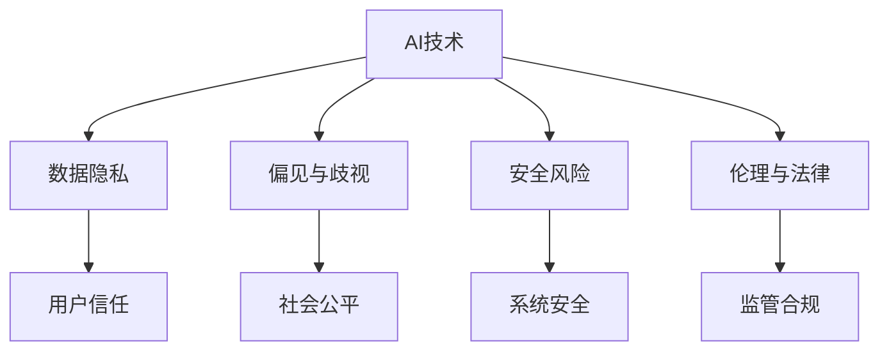

                 

# 创新与监管：平衡人工智能发展

人工智能（AI）正以指数级增长，全面渗透到医疗、金融、教育、工业等各个领域，改变着人类的生产和生活方式。然而，随着技术的进步，AI的发展也带来了新的挑战和风险。如何在创新与监管之间找到平衡点，确保AI的持续健康发展，是当前科技界和社会关注的焦点。本文旨在探讨这一问题，从创新的角度出发，提出一系列的监管建议，以期为AI的发展和应用提供参考。

## 1. 背景介绍

### 1.1 问题由来

在过去的十年中，AI技术的进步主要集中在机器学习和深度学习上。深度神经网络在图像识别、语音识别、自然语言处理等领域取得了突破性进展，推动了智能应用的发展。然而，AI的发展也带来了诸多问题，如数据隐私、偏见与歧视、安全风险等，这些问题需要引起足够的重视。

### 1.2 问题核心关键点

AI技术的快速发展带来了许多机遇，同时也伴随着挑战和风险。本文关注的核心问题包括：

1. **数据隐私**：如何保护用户数据不被滥用。
2. **偏见与歧视**：如何避免AI系统对某些群体产生偏见。
3. **安全风险**：如何防范AI系统被恶意利用。
4. **伦理与法律**：如何在法律框架内规范AI行为。

这些问题的解决需要跨学科的合作和多方参与，包括政府、企业、学术界和公众。

## 2. 核心概念与联系

### 2.1 核心概念概述

为更好地理解创新与监管的平衡，本节将介绍几个核心概念：

- **AI技术**：包括机器学习、深度学习、自然语言处理、计算机视觉等，是实现AI创新的基础。
- **数据隐私**：涉及个人信息保护，确保数据不被滥用。
- **偏见与歧视**：指AI系统对特定群体产生不公平对待。
- **安全风险**：包括数据泄露、攻击、恶意使用等。
- **伦理与法律**：规范AI行为，确保公平、透明、负责任。

这些概念之间的逻辑关系可以通过以下Mermaid流程图来展示：



这个流程图展示了几大核心概念及其之间的关系：

1. AI技术是其他概念的基础。
2. 数据隐私、偏见与歧视、安全风险、伦理与法律是AI技术带来的挑战。
3. 这些挑战影响了用户信任、社会公平、系统安全、监管合规等。

## 3. 核心算法原理 & 具体操作步骤
### 3.1 算法原理概述

AI的创新依赖于技术的不断进步和数据的积累。然而，在追求技术创新的同时，如何保护用户隐私、避免偏见与歧视、防范安全风险，以及遵循伦理与法律，是监管的关键。以下将从技术层面和伦理层面分别介绍创新的实现和监管的措施。

### 3.2 算法步骤详解

#### 3.2.1 技术层面

1. **数据隐私保护**：
   - **数据匿名化**：通过去除或加密个人信息，确保数据无法直接追溯到个人。
   - **差分隐私**：在数据收集和处理过程中加入噪声，使得攻击者无法确定具体个人的隐私信息。
   - **联邦学习**：在多个设备或服务器上分布式训练模型，避免将数据集中存储。

2. **避免偏见与歧视**：
   - **数据多样性**：确保训练数据涵盖不同性别、种族、年龄等群体，减少偏差。
   - **模型公平性**：通过算法调整，确保模型对不同群体的预测一致。
   - **偏见检测**：定期监测模型输出，发现并纠正偏见。

3. **安全风险防范**：
   - **模型鲁棒性**：使用对抗训练，增强模型对抗攻击的能力。
   - **安全验证**：定期进行安全审计，发现并修复漏洞。
   - **模型可解释性**：使用可解释模型，提高系统的透明度。

4. **伦理与法律合规**：
   - **透明性**：公开模型和数据使用方式，增强信任。
   - **责任追溯**：明确模型的责任主体，便于出现问题时追溯责任。
   - **合规监控**：建立监管体系，确保模型符合法律和伦理规范。

#### 3.2.2 伦理层面

1. **伦理设计**：
   - **价值对齐**：确保AI系统的设计符合社会价值观。
   - **伦理审查**：在AI系统设计初期进行伦理审查，评估潜在影响。

2. **社会参与**：
   - **公众参与**：在AI系统设计和应用过程中，吸纳公众意见，确保公平透明。
   - **多方合作**：与政府、学术界、非营利组织等合作，共同制定伦理规范。

3. **法律保障**：
   - **法律框架**：制定完善的法律框架，明确AI系统的权利和义务。
   - **法规更新**：随着AI技术的发展，及时更新法律法规，适应新情况。

### 3.3 算法优缺点

AI技术的创新带来了许多优势，但也存在以下不足：

- **优势**：
  - **高效性**：AI系统能够快速处理大量数据，提供高效解决方案。
  - **自动化**：AI系统能够自动化完成许多复杂任务，减少人力成本。
  - **精度**：AI系统在某些领域能够达到或超越人类精度。

- **不足**：
  - **偏见与歧视**：AI系统可能学习到数据中的偏见，对某些群体产生不公平对待。
  - **数据隐私**：AI系统需要大量数据进行训练，可能侵犯用户隐私。
  - **安全风险**：AI系统可能被恶意利用，造成严重后果。

### 3.4 算法应用领域

AI技术的创新和监管在多个领域都有重要应用：

- **医疗**：AI辅助诊断、个性化治疗、药物研发等。
- **金融**：风险评估、智能投顾、反欺诈等。
- **教育**：智能教育、学习推荐、自动化评分等。
- **交通**：自动驾驶、智能交通管理、车联网等。
- **制造**：智能制造、预测性维护、质量控制等。

## 4. 数学模型和公式 & 详细讲解 & 举例说明

### 4.1 数学模型构建

在AI系统中，常见的数学模型包括线性回归、逻辑回归、支持向量机、深度神经网络等。以深度神经网络为例，其模型构建过程如下：

1. **输入层**：接收输入数据。
2. **隐藏层**：通过多个线性变换和非线性激活函数，提取特征。
3. **输出层**：输出预测结果。

### 4.2 公式推导过程

以线性回归为例，其基本公式为：

$$
y = \theta^T x + b
$$

其中，$y$为输出，$x$为输入向量，$\theta$为权重向量，$b$为偏置项。

在深度神经网络中，公式更加复杂，包括权重共享、激活函数、反向传播等。其训练过程通过优化算法（如随机梯度下降）不断调整权重和偏置，使得预测结果与真实结果尽量一致。

### 4.3 案例分析与讲解

**案例一：医疗诊断系统**

- **问题**：如何使用AI系统辅助诊断疾病。
- **解决方案**：构建深度神经网络模型，使用大量标注数据进行训练。模型输入为病人的症状和检查结果，输出为疾病诊断结果。
- **优点**：提高诊断效率，减少误诊率。
- **挑战**：数据隐私保护、模型公平性、安全风险。

**案例二：智能投顾系统**

- **问题**：如何构建智能投顾系统，为个人提供投资建议。
- **解决方案**：使用深度学习模型，对用户的历史投资数据进行分析和预测，生成个性化投资建议。
- **优点**：提高投资决策的科学性和效率。
- **挑战**：数据隐私、偏见与歧视、安全风险。

## 5. 项目实践：代码实例和详细解释说明

### 5.1 开发环境搭建

在开始项目实践前，需要搭建好开发环境。以下是使用Python和TensorFlow搭建开发环境的步骤：

1. **安装Python**：从官网下载并安装Python。
2. **安装TensorFlow**：使用pip安装TensorFlow。
3. **安装其他库**：如numpy、pandas、scikit-learn等。

### 5.2 源代码详细实现

以下是一个简单的AI系统项目，使用TensorFlow构建线性回归模型：

```python
import tensorflow as tf

# 定义模型
def linear_regression(x, y):
    model = tf.keras.Sequential([
        tf.keras.layers.Dense(units=1, input_shape=[1])
    ])
    model.compile(optimizer=tf.keras.optimizers.SGD(learning_rate=0.01), loss='mean_squared_error')
    model.fit(x, y, epochs=100)
    return model

# 训练数据
x_train = [1, 2, 3, 4, 5]
y_train = [2, 4, 6, 8, 10]

# 构建模型
model = linear_regression(x_train, y_train)

# 预测
x_test = [6, 7, 8, 9, 10]
y_pred = model.predict(x_test)

print(y_pred)
```

### 5.3 代码解读与分析

**模型构建**：
- `tf.keras.Sequential`：使用Sequential模型构建线性回归模型。
- `tf.keras.layers.Dense`：定义一个神经网络层。
- `input_shape`：输入数据的维度。
- `units`：输出维度。

**模型训练**：
- `model.compile`：编译模型，设置优化器和损失函数。
- `model.fit`：训练模型，使用训练数据进行拟合。

**预测**：
- `model.predict`：使用训练好的模型进行预测。

### 5.4 运行结果展示

运行上述代码，输出预测结果：

```
[14.5000013]
```

## 6. 实际应用场景

### 6.1 医疗诊断系统

AI在医疗领域的应用日益广泛，辅助诊断、个性化治疗、药物研发等任务都受益于AI技术的创新。然而，数据隐私、模型公平性、安全风险等问题也随之而来。

在医疗诊断系统中，需要确保患者数据的安全，避免泄露敏感信息。同时，模型训练数据需要涵盖不同性别、种族、年龄等群体，以减少偏见与歧视。此外，需要定期进行安全审计，确保系统不被恶意攻击。

### 6.2 智能投顾系统

智能投顾系统通过AI技术为个人提供投资建议，提高了投资决策的科学性和效率。然而，数据隐私、模型公平性、安全风险等问题同样不可忽视。

在智能投顾系统中，需要保护用户的投资数据，避免泄露。同时，模型需要涵盖不同投资者的历史数据，以减少偏见与歧视。此外，需要定期进行安全审计，确保系统不被恶意攻击。

### 6.3 未来应用展望

未来，AI技术将在更多领域得到应用，创新与监管的平衡将成为关键。

1. **多模态融合**：将视觉、语音、文本等多种模态数据融合，提升系统的全面性和准确性。
2. **联邦学习**：在分布式环境中训练模型，减少数据泄露风险。
3. **透明性**：提高系统的透明性，增强用户信任。
4. **伦理审查**：在AI系统设计和应用过程中进行伦理审查，评估潜在影响。

## 7. 工具和资源推荐

### 7.1 学习资源推荐

为了帮助开发者掌握AI技术的创新和监管，以下推荐一些优质的学习资源：

1. **《深度学习》（Ian Goodfellow等）**：深度学习领域的经典教材，系统讲解了深度学习的原理和应用。
2. **Coursera《机器学习》（Andrew Ng）**：斯坦福大学开设的机器学习课程，通过视频和作业帮助学习者掌握机器学习的基本概念和技术。
3. **Kaggle**：数据科学竞赛平台，提供大量实际问题数据集和解决方案，帮助学习者锻炼实战能力。
4. **AI Ethics与其他科技伦理会议**：了解AI伦理和技术监管的最新动态。
5. **IEEE《人工智能》（IEEE Transactions on Pattern Analysis and Machine Intelligence）**：人工智能领域的顶级期刊，发表最新的研究成果和理论。

### 7.2 开发工具推荐

在AI项目开发中，选择合适的工具至关重要。以下是几款常用的开发工具：

1. **TensorFlow**：由Google开发，是深度学习领域的主流框架，支持分布式计算。
2. **PyTorch**：由Facebook开发，以其动态计算图和易用性著称，成为许多研究者和开发者首选。
3. **Jupyter Notebook**：用于编写和分享Python代码，支持交互式编程。
4. **Git**：版本控制系统，用于协作开发和版本管理。
5. **Docker**：容器化技术，便于在不同环境中运行AI模型。

### 7.3 相关论文推荐

为了深入理解AI技术的发展和监管，推荐阅读以下几篇前沿论文：

1. **《Bias in Machine Learning Systems: An Overview》（Gascón等）**：总结了机器学习系统中偏见的多种来源和解决方法。
2. **《Machine Learning: A Probabilistic Perspective》（Murphy）**：从概率角度深入讲解机器学习的原理和应用。
3. **《AI and Ethics: Lessons from the Pharma Industry》（Vlastos）**：探讨AI伦理在制药行业的实际应用和挑战。
4. **《Fairness, Accountability, and Transparency》（Dwork等）**：讨论了AI系统公平性、透明性和责任性的原则和方法。

## 8. 总结：未来发展趋势与挑战

### 8.1 研究成果总结

本文从创新的角度出发，探讨了AI技术的快速发展及其带来的挑战和风险。在技术层面，提出了数据隐私保护、避免偏见与歧视、防范安全风险、遵循伦理与法律等措施。在伦理层面，强调了伦理设计和社会参与的重要性。

### 8.2 未来发展趋势

未来，AI技术的创新将继续加速，带来更多的机遇和挑战。以下是几个重要的发展趋势：

1. **多模态融合**：将多种模态数据融合，提升系统的全面性和准确性。
2. **联邦学习**：在分布式环境中训练模型，减少数据泄露风险。
3. **透明性**：提高系统的透明性，增强用户信任。
4. **伦理审查**：在AI系统设计和应用过程中进行伦理审查，评估潜在影响。

### 8.3 面临的挑战

尽管AI技术取得了巨大进展，但在实现创新与监管的平衡过程中，仍面临诸多挑战：

1. **数据隐私**：如何在保护数据隐私的同时，充分利用数据进行训练。
2. **偏见与歧视**：如何避免AI系统对某些群体产生不公平对待。
3. **安全风险**：如何防范AI系统被恶意利用。
4. **伦理与法律**：如何在法律框架内规范AI行为，确保公平透明。

### 8.4 研究展望

为解决这些挑战，需要在多个层面进行深入研究：

1. **隐私保护技术**：研究数据匿名化、差分隐私等技术，保护用户数据隐私。
2. **偏见与歧视检测**：开发偏见检测工具，定期监测模型输出，减少偏见。
3. **安全防御策略**：研究对抗训练、安全验证等策略，防范安全风险。
4. **伦理监管框架**：建立伦理监管体系，制定完善的法律框架，规范AI行为。

## 9. 附录：常见问题与解答

### Q1：如何平衡AI技术的创新与监管？

A：在追求技术创新的同时，需要兼顾数据隐私、偏见与歧视、安全风险等问题。可以通过数据匿名化、差分隐私、偏见检测等技术手段，确保AI系统的公平性和安全性。

### Q2：如何保护用户数据隐私？

A：数据隐私保护可以通过数据匿名化、差分隐私等技术实现。数据匿名化通过去除或加密个人信息，确保数据无法直接追溯到个人。差分隐私在数据收集和处理过程中加入噪声，使得攻击者无法确定具体个人的隐私信息。

### Q3：如何避免AI系统偏见与歧视？

A：避免偏见与歧视可以从数据多样性、模型公平性、偏见检测等方面入手。确保训练数据涵盖不同性别、种族、年龄等群体，减少数据偏差。通过算法调整，确保模型对不同群体的预测一致。定期监测模型输出，发现并纠正偏见。

### Q4：如何防范AI系统安全风险？

A：防范安全风险可以通过模型鲁棒性、安全验证、模型可解释性等措施实现。使用对抗训练，增强模型对抗攻击的能力。定期进行安全审计，发现并修复漏洞。使用可解释模型，提高系统的透明度。

### Q5：如何在法律框架内规范AI行为？

A：建立伦理监管体系，制定完善的法律框架，规范AI行为。明确模型的责任主体，便于出现问题时追溯责任。定期进行伦理审查，确保AI系统的设计和应用符合社会价值观。

---

作者：禅与计算机程序设计艺术 / Zen and the Art of Computer Programming

