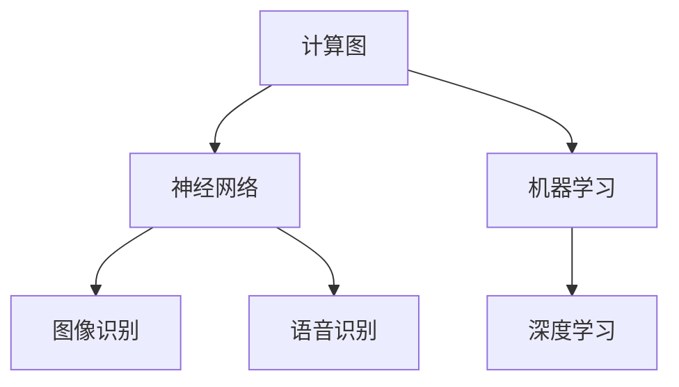

                 

# 创造更美好的明天：人类计算的积极作用

> 关键词：
- 人类计算
- 人工智能
- 计算图
- 深度学习
- 机器学习
- 神经网络
- 自然语言处理

## 1. 背景介绍

### 1.1 问题由来

当前，计算机技术已经成为推动社会进步的重要力量。无论是个人生活、企业运营，还是政府决策，都离不开计算技术的支撑。在过去几十年里，计算技术的不断进步，不仅改变了我们的工作和生活方式，也为解决复杂的科学问题和社会挑战提供了新的视角和工具。

### 1.2 问题核心关键点

计算机技术的进步，尤其是人工智能和深度学习技术的快速发展，为人类计算带来了新的机遇与挑战。本文将从计算图、神经网络、机器学习等核心概念出发，探讨其对人类计算的影响，并展望未来发展的趋势和面临的挑战。

### 1.3 问题研究意义

通过深入研究计算图、神经网络和机器学习等核心概念及其在人类计算中的应用，本文旨在揭示计算技术如何变革我们的工作和生活方式，并探索其对社会进步的积极作用。具体而言，本文将从以下几个方面进行探讨：

- 计算图和神经网络在人工智能中的应用
- 机器学习算法在解决实际问题中的作用
- 计算技术对人类社会进步的影响
- 未来计算技术的趋势和挑战

## 2. 核心概念与联系

### 2.1 核心概念概述

在人类计算中，计算图、神经网络、机器学习等核心概念扮演着关键角色。理解这些概念的原理和架构，对于掌握人类计算技术至关重要。

- **计算图**：一种图形表示，用于描述计算过程中的数据流动和操作，是深度学习模型的基础。
- **神经网络**：一种模拟人脑神经元网络的计算模型，用于处理非线性问题，广泛应用于图像识别、语音识别等领域。
- **机器学习**：一种通过数据驱动的算法，用于从数据中学习和提取规律，广泛应用于预测、分类等任务。

### 2.2 核心概念原理和架构的 Mermaid 流程图(Mermaid 流程节点中不要有括号、逗号等特殊字符)



这个流程图展示了计算图、神经网络和机器学习之间的关系及其应用领域。

## 3. 核心算法原理 & 具体操作步骤

### 3.1 算法原理概述

计算图和神经网络是深度学习模型的基础，其核心思想是通过数据驱动的算法，学习数据的潜在表示，从而实现复杂的计算和推理任务。机器学习则是从数据中提取规律，用于预测、分类等任务。

### 3.2 算法步骤详解

以下是使用计算图和神经网络进行图像识别的具体操作步骤：

1. **数据准备**：收集并标注图像数据，将其分为训练集和测试集。
2. **构建计算图**：使用计算图描述模型结构，包括输入、输出和中间层的连接关系。
3. **模型训练**：使用训练集数据，通过反向传播算法更新模型参数，最小化损失函数。
4. **模型测试**：使用测试集数据评估模型性能，输出预测结果。

### 3.3 算法优缺点

计算图和神经网络的优点在于强大的表达能力和灵活性，可以处理复杂的非线性问题。缺点是模型训练需要大量数据和计算资源，且存在过拟合风险。

### 3.4 算法应用领域

计算图和神经网络广泛应用于图像识别、语音识别、自然语言处理等领域。机器学习算法则广泛应用于预测、分类、聚类等任务，例如金融风险预测、健康诊断、推荐系统等。

## 4. 数学模型和公式 & 详细讲解 & 举例说明（备注：数学公式请使用latex格式，latex嵌入文中独立段落使用 $$，段落内使用 $)

### 4.1 数学模型构建

假设我们使用卷积神经网络(CNN)进行图像识别任务。CNN由卷积层、池化层和全连接层组成，其数学模型可以表示为：

$$
\begin{aligned}
\boldsymbol{y} &= f(\boldsymbol{W} \boldsymbol{x} + \boldsymbol{b}) \\
&= \sigma(\boldsymbol{W} (\boldsymbol{g}(\boldsymbol{x})) + \boldsymbol{b})
\end{aligned}
$$

其中，$\boldsymbol{x}$ 为输入图像，$\boldsymbol{y}$ 为输出结果，$\boldsymbol{W}$ 和 $\boldsymbol{b}$ 为网络参数，$\sigma$ 为激活函数，$\boldsymbol{g}$ 为卷积或池化操作。

### 4.2 公式推导过程

以图像分类为例，假设我们有一个包含 $n$ 类别的分类任务。模型通过训练数据学习得到网络参数 $\boldsymbol{W}$ 和 $\boldsymbol{b}$，然后将输入图像 $\boldsymbol{x}$ 经过一系列卷积、池化操作后，通过全连接层输出结果 $\boldsymbol{y}$。在训练过程中，模型最小化交叉熵损失函数：

$$
\mathcal{L} = -\frac{1}{N} \sum_{i=1}^N \sum_{j=1}^C \mathbf{y}_i^j \log \mathbf{\hat{y}}_i^j
$$

其中，$\mathbf{y}_i^j$ 为第 $i$ 个样本属于第 $j$ 类的真实标签，$\mathbf{\hat{y}}_i^j$ 为模型预测的第 $i$ 个样本属于第 $j$ 类的概率。

### 4.3 案例分析与讲解

以图像识别中的MNIST数据集为例，我们通过卷积神经网络训练一个手写数字识别模型。使用训练集数据对模型进行训练，最小化交叉熵损失函数，得到最优参数 $\boldsymbol{W}$ 和 $\boldsymbol{b}$。最后，使用测试集数据评估模型性能，输出预测结果。

## 5. 项目实践：代码实例和详细解释说明

### 5.1 开发环境搭建

以下是使用TensorFlow进行卷积神经网络图像识别的环境配置流程：

1. 安装Anaconda：从官网下载并安装Anaconda，用于创建独立的Python环境。
2. 创建并激活虚拟环境：
```bash
conda create -n tf-env python=3.8 
conda activate tf-env
```

3. 安装TensorFlow：根据CUDA版本，从官网获取对应的安装命令。例如：
```bash
pip install tensorflow
```

4. 安装各类工具包：
```bash
pip install numpy pandas scikit-learn matplotlib tqdm jupyter notebook ipython
```

完成上述步骤后，即可在`tf-env`环境中开始项目实践。

### 5.2 源代码详细实现

```python
import tensorflow as tf
from tensorflow import keras

# 定义卷积神经网络
model = keras.Sequential([
    keras.layers.Conv2D(32, (3, 3), activation='relu', input_shape=(28, 28, 1)),
    keras.layers.MaxPooling2D((2, 2)),
    keras.layers.Flatten(),
    keras.layers.Dense(10, activation='softmax')
])

# 编译模型
model.compile(optimizer='adam',
              loss='sparse_categorical_crossentropy',
              metrics=['accuracy'])

# 加载数据集
mnist = keras.datasets.mnist
(x_train, y_train), (x_test, y_test) = mnist.load_data()

# 数据预处理
x_train = x_train.reshape(x_train.shape[0], 28, 28, 1).astype('float32') / 255
x_test = x_test.reshape(x_test.shape[0], 28, 28, 1).astype('float32') / 255

# 模型训练
model.fit(x_train, y_train, epochs=5, validation_data=(x_test, y_test))

# 模型测试
model.evaluate(x_test, y_test)
```

### 5.3 代码解读与分析

**Sequential模型**：
- `Sequential` 模型是Keras中的一种模型结构，用于顺序地添加多个层，适用于线性堆叠的模型。
- 在上述代码中，我们首先定义了一个包含两个卷积层、一个池化层和一个全连接层的卷积神经网络模型。
- 使用 `model.compile` 方法编译模型，设置优化器、损失函数和评估指标。
- 加载MNIST数据集，并进行数据预处理，包括将数据归一化和重塑。
- 使用 `model.fit` 方法对模型进行训练，设置训练轮数和验证集。
- 最后，使用 `model.evaluate` 方法评估模型在测试集上的性能。

## 6. 实际应用场景

### 6.1 智能推荐系统

智能推荐系统是计算技术的重要应用之一。通过分析用户的历史行为数据，推荐系统能够为用户推荐符合其兴趣的商品或内容。

具体而言，智能推荐系统使用机器学习算法，如协同过滤、矩阵分解等，从用户行为数据中提取用户偏好，预测用户可能感兴趣的商品或内容，并实时推荐给用户。这不仅提高了用户的购物体验，也增加了商家的销售额。

### 6.2 健康医疗

计算技术在健康医疗领域也得到了广泛应用。通过分析患者的医疗数据，计算技术可以用于疾病预测、个性化治疗方案推荐等。

具体而言，机器学习算法可以从患者的历史数据中提取特征，建立预测模型，用于预测患者的疾病风险。此外，计算技术还可以用于优化治疗方案，为患者提供个性化的治疗建议，提高治疗效果。

### 6.3 金融风险管理

金融风险管理是计算技术的另一个重要应用领域。通过分析市场数据和用户行为数据，计算技术可以用于预测金融市场的波动，识别潜在的风险。

具体而言，计算技术可以使用机器学习算法，如回归分析、分类算法等，从历史数据中提取市场特征，建立预测模型，用于预测市场的走势。此外，计算技术还可以用于识别异常交易，防范金融风险。

## 7. 工具和资源推荐

### 7.1 学习资源推荐

为了帮助开发者系统掌握计算图、神经网络和机器学习等核心概念，这里推荐一些优质的学习资源：

1. 《深度学习》系列书籍：由Ian Goodfellow、Yoshua Bengio和Aaron Courville合著，详细介绍了深度学习的原理和算法。
2. CS231n《卷积神经网络》课程：斯坦福大学开设的计算机视觉课程，涵盖卷积神经网络的理论和实践。
3. 《机器学习》书籍：由Tom Mitchell所著，系统介绍了机器学习的原理和算法。
4. TensorFlow官方文档：TensorFlow的官方文档，提供了详细的API文档和开发指南。
5. Keras官方文档：Keras的官方文档，提供了简单易用的API，适合初学者快速上手。

通过对这些资源的学习实践，相信你一定能够快速掌握计算图、神经网络和机器学习的精髓，并用于解决实际的计算问题。

### 7.2 开发工具推荐

高效的开发离不开优秀的工具支持。以下是几款用于计算图、神经网络和机器学习开发的常用工具：

1. TensorFlow：由Google主导开发的开源深度学习框架，支持CPU和GPU计算，广泛应用于机器学习应用开发。
2. Keras：基于TensorFlow和Theano等框架开发的高级神经网络API，适合快速原型设计和模型部署。
3. PyTorch：由Facebook开发的开源深度学习框架，具有灵活的计算图和高效的动态图特性，适合研究和原型开发。
4. Weights & Biases：模型训练的实验跟踪工具，可以记录和可视化模型训练过程中的各项指标，方便对比和调优。
5. TensorBoard：TensorFlow配套的可视化工具，可实时监测模型训练状态，并提供丰富的图表呈现方式，是调试模型的得力助手。

合理利用这些工具，可以显著提升计算图、神经网络和机器学习的开发效率，加快创新迭代的步伐。

### 7.3 相关论文推荐

计算图、神经网络和机器学习的发展源于学界的持续研究。以下是几篇奠基性的相关论文，推荐阅读：

1. 《深度学习》（Goodfellow等）：详细介绍了深度学习的原理和算法，是深度学习领域的经典教材。
2. 《卷积神经网络》（LeCun等）：介绍了卷积神经网络的结构和应用，是计算机视觉领域的重要参考资料。
3. 《机器学习》（Tom Mitchell）：系统介绍了机器学习的原理和算法，是机器学习领域的经典教材。
4. 《人类计算的未来》（Bengio等）：探讨了计算技术在人类计算中的应用前景，展望了未来发展方向。

这些论文代表了大计算技术的演变历程，通过学习这些前沿成果，可以帮助研究者把握学科前进方向，激发更多的创新灵感。

## 8. 总结：未来发展趋势与挑战

### 8.1 总结

本文对计算图、神经网络和机器学习等核心概念及其在人类计算中的应用进行了全面系统的介绍。首先阐述了计算图、神经网络和机器学习在人工智能中的应用，明确了其在图像识别、推荐系统、金融风险管理等领域的重要作用。其次，从原理到实践，详细讲解了计算图和神经网络的数学模型和算法步骤，给出了计算图和神经网络的代码实现。同时，本文还探讨了计算技术对人类社会进步的积极作用，展示了其在智能推荐、健康医疗、金融风险管理等多个领域的应用前景。

通过本文的系统梳理，可以看到，计算图、神经网络和机器学习在推动社会进步、提升生活质量方面发挥了重要作用。随着计算技术的不断发展，其在各个领域的应用也将越来越广泛，为人类社会带来更多可能性和挑战。

### 8.2 未来发展趋势

展望未来，计算图、神经网络和机器学习的发展趋势将呈现以下几个方面：

1. **深度学习的发展**：深度学习技术将继续快速发展，模型参数量将不断增大，模型结构和优化算法也将不断创新。
2. **计算图和神经网络的多模态融合**：计算图和神经网络将更多地应用于多模态数据融合，如视觉、语音、文本等数据的协同处理。
3. **机器学习算法的优化**：机器学习算法将不断优化，提高预测精度和模型泛化能力，应用于更多实际问题。
4. **计算技术的普及应用**：计算技术将更多地应用于日常生产生活中，提高工作效率和生活质量。

### 8.3 面临的挑战

尽管计算图、神经网络和机器学习在各个领域都取得了显著进展，但在未来发展过程中仍面临诸多挑战：

1. **数据量的不足**：大规模数据是深度学习和机器学习的基础，但数据获取和标注的成本较高，数据量不足成为制约计算技术发展的重要因素。
2. **模型的复杂性**：深度学习模型的复杂性不断增加，计算资源和训练时间的消耗也在不断增长。
3. **模型的可解释性**：计算技术的“黑盒”特性使得模型的可解释性不足，缺乏对模型决策过程的解释。
4. **数据安全和隐私保护**：计算技术在处理大量数据时，数据安全和隐私保护问题显得尤为重要。

### 8.4 研究展望

为了应对这些挑战，未来的研究需要在以下几个方面寻求新的突破：

1. **数据增强和生成**：利用数据增强和生成技术，扩大数据量，降低数据标注成本。
2. **模型压缩和优化**：开发更高效的模型压缩和优化算法，减少计算资源消耗，提高模型性能。
3. **模型解释和可解释性**：引入可解释性模型和解释方法，提高模型的可解释性。
4. **数据安全保护**：研究数据安全和隐私保护技术，确保计算技术在处理数据时能够保护数据安全和隐私。

这些研究方向的探索，将进一步推动计算图、神经网络和机器学习技术的进步，为构建智能社会提供更加可靠和高效的技术支持。面向未来，计算技术必将为人类的生产和生活带来更多可能性和美好愿景。

## 9. 附录：常见问题与解答

**Q1：计算图和神经网络有哪些应用场景？**

A: 计算图和神经网络在图像识别、语音识别、自然语言处理等领域得到了广泛应用。例如，图像识别中的卷积神经网络、语音识别中的循环神经网络、自然语言处理中的Transformer模型等。

**Q2：机器学习算法有哪些优点？**

A: 机器学习算法的优点包括：
- 自动从数据中学习规律，避免手动特征工程。
- 能够处理大量复杂数据，发现数据中的隐含模式。
- 模型具有通用性，可以应用于不同领域和任务。

**Q3：计算技术如何提高生活质量？**

A: 计算技术在医疗、金融、教育、交通等多个领域的应用，极大地提高了生产效率和服务质量。例如，智能推荐系统提高了用户的购物体验，金融风险管理减少了金融风险，医疗诊断提高了诊断准确率等。

**Q4：未来计算技术的发展趋势是什么？**

A: 未来计算技术的发展趋势包括：
- 深度学习技术的进一步发展，模型参数量将不断增大。
- 计算图和神经网络的多模态融合，应用于更多领域。
- 机器学习算法的优化，提高模型泛化能力和预测精度。
- 计算技术的普及应用，带来更多可能性和美好愿景。

这些趋势展示了计算技术在未来的广泛应用和深远影响，为构建智能社会提供了坚实的基础。

---

作者：禅与计算机程序设计艺术 / Zen and the Art of Computer Programming

