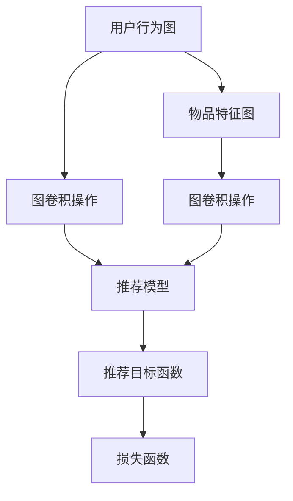

                 

# 基于图卷积网络的大规模商品推荐

> 关键词：大规模商品推荐,图卷积网络(Graph Convolutional Network, GNN),深度学习,用户行为建模,商品特征建模,协同过滤,广告点击率预测

## 1. 背景介绍

### 1.1 问题由来

在电商领域，商品推荐系统是提高用户体验、增加用户粘性和销售额的关键技术之一。随着用户行为数据量的不断增长，如何从海量数据中挖掘出用户对商品的偏好，生成精准的推荐结果，成为了电商推荐系统的核心挑战。

传统的推荐系统主要依赖于协同过滤和基于内容的推荐算法，但这些方法面临数据稀疏性、冷启动用户和物品等问题。与此同时，基于深度学习的推荐系统如序列推荐和隐式协同过滤逐渐成为主流，并在实际应用中取得显著效果。

近年来，基于图卷积网络（Graph Convolutional Network, GNN）的推荐系统研究日益兴起，并在多个场景中展现了强大的推荐能力。图卷积网络通过捕捉用户-物品之间的复杂关系，能够有效解决传统推荐系统面临的问题，实现精准推荐。

### 1.2 问题核心关键点

基于图卷积网络的推荐系统，本质上是对用户-物品交互关系图进行建模，通过图卷积操作学习用户的隐含偏好和物品的属性特征，从而生成推荐结果。其核心在于：

1. 图模型构建：如何将用户-物品交互数据建模为图结构，捕捉用户行为和商品属性之间的关系。
2. 图卷积操作：如何通过卷积操作高效地从图结构中提取特征。
3. 推荐模型设计：如何设计合适的推荐模型，将图特征映射为推荐结果。

## 2. 核心概念与联系

### 2.1 核心概念概述

为了更好地理解基于图卷积网络的推荐系统，本节将介绍几个密切相关的核心概念：

- 图卷积网络(Graph Convolutional Network, GNN)：一种基于图结构深度学习的模型，通过卷积操作从图结构中提取特征。
- 用户行为图(User Behavior Graph)：以用户-物品交互关系为基础构建的图模型，用于捕捉用户的偏好和行为模式。
- 物品特征图(Item Feature Graph)：基于商品属性构建的图模型，用于刻画商品的特征和分类信息。
- 推荐目标函数：定义推荐系统追求的目标，如点击率预测、转化率预测等。
- 损失函数：衡量推荐模型预测结果与真实结果之间的差异，用于优化模型参数。

这些核心概念之间的逻辑关系可以通过以下Mermaid流程图来展示：



这个流程图展示了大规模商品推荐的核心概念及其之间的关系：

1. 用户行为图和物品特征图分别捕捉了用户和商品的特征，并通过图卷积操作提取相关特征。
2. 推荐模型将提取的特征映射为推荐结果。
3. 推荐目标函数定义了推荐系统追求的目标，损失函数衡量模型的预测性能，用于优化模型参数。

## 3. 核心算法原理 & 具体操作步骤
### 3.1 算法原理概述

基于图卷积网络的推荐系统，其核心思想是通过构建用户行为图和物品特征图，利用图卷积操作从图中提取有用信息，最终将提取的信息通过推荐模型转换为推荐结果。

具体来说，假设用户行为图为 $G_U=(U,E_U)$，物品特征图为 $G_I=(I,E_I)$，用户行为图中的节点表示用户 $U$，边表示用户与商品之间的交互行为 $E_U$，物品特征图中的节点表示商品 $I$，边表示商品之间的属性关系 $E_I$。通过图卷积操作，将用户行为图和物品特征图中的信息融合，生成用户对商品的评分向量，并通过推荐模型将评分向量转换为推荐结果。

### 3.2 算法步骤详解

基于图卷积网络的推荐系统，一般包括以下几个关键步骤：

**Step 1: 构建图模型**

- 用户行为图：从电商平台的日志数据中提取用户与商品之间的交互数据，构建用户行为图。
- 物品特征图：根据商品的描述、属性等信息构建物品特征图，用于刻画商品的属性特征。
- 图嵌入：使用图神经网络，如GCN、GAT等，将用户行为图和物品特征图中的信息进行融合，生成图嵌入特征。

**Step 2: 设计图卷积层**

- 设计图卷积层（GCN层）：通过GCN层对图结构进行卷积操作，提取图嵌入特征中的有用信息。
- 定义卷积核：设计图卷积核（GNN卷积核），用于在图结构中传播信息，捕捉节点间的局部关系。
- 激活函数：使用ReLU、ELU等激活函数，增强模型的表达能力。

**Step 3: 设计推荐模型**

- 推荐模型：根据推荐目标函数（如点击率预测），设计推荐模型，如MLP、RNN、注意力机制等。
- 用户特征融合：将用户行为图和物品特征图中的信息进行融合，生成用户对商品的评分向量。
- 模型优化：选择合适的优化算法（如Adam、SGD等），设置学习率、批大小、迭代轮数等，优化推荐模型的参数。

**Step 4: 训练和评估**

- 模型训练：在训练集上使用反向传播算法训练推荐模型，优化模型参数。
- 模型评估：在验证集上评估推荐模型的性能，选择最优的模型进行预测。
- 实际应用：在测试集上使用评估过的推荐模型进行推荐，集成到电商推荐系统中。

### 3.3 算法优缺点

基于图卷积网络的推荐系统具有以下优点：

1. 建模能力强：图卷积网络能够捕捉复杂的用户-物品关系，适应多维度的数据特征。
2. 鲁棒性好：通过图卷积操作，能够对噪声和异常值进行过滤，提升模型的鲁棒性。
3. 可解释性强：图卷积网络中每个节点只与局部节点相连，特征提取过程可解释性强。
4. 实时性好：模型训练时间较短，能够快速实时响应推荐请求。

同时，该方法也存在以下局限性：

1. 数据质量要求高：用户行为图和物品特征图中的数据质量直接影响模型效果。
2. 计算复杂度高：图卷积操作涉及复杂的网络结构和计算过程，计算成本较高。
3. 模型复杂度高：图卷积网络的参数量较大，模型的训练和推理复杂度较高。
4. 效果不稳定：图卷积操作中的超参数调整较为复杂，模型效果不稳定。

尽管存在这些局限性，但就目前而言，基于图卷积网络的推荐方法仍在大规模商品推荐领域的应用中表现出卓越的性能。未来相关研究的重点在于如何进一步降低计算复杂度，提高模型的实时性，同时兼顾模型的鲁棒性和可解释性。

### 3.4 算法应用领域

基于图卷积网络的推荐系统，已经在电商、广告、内容推荐等多个领域得到应用，具体包括：

- 电商推荐：通过分析用户行为和商品属性，生成个性化推荐。
- 广告点击率预测：利用用户行为图和物品特征图，预测广告点击率。
- 内容推荐：从用户兴趣图和内容图结构中提取特征，生成推荐结果。
- 推荐系统的冷启动：通过融合用户历史行为和物品属性，为新用户和新商品提供推荐。

除了上述这些经典应用外，图卷积网络还被创新性地应用于社交网络、推荐系统中的欺诈检测、广告定位等场景，为推荐系统带来了新的突破。随着图卷积网络的不断发展，相信推荐系统将会在更广泛的应用领域中发挥重要作用。

## 4. 数学模型和公式 & 详细讲解  
### 4.1 数学模型构建

本节将使用数学语言对基于图卷积网络的推荐系统进行更加严格的刻画。

记用户行为图为 $G_U=(U,E_U)$，物品特征图为 $G_I=(I,E_I)$，其中 $U$ 和 $I$ 分别表示用户和物品集合，$E_U$ 和 $E_I$ 分别表示用户行为边和物品属性边的集合。图嵌入特征表示为 $H_U \in \mathbb{R}^{n_U \times d_U}$，$H_I \in \mathbb{R}^{n_I \times d_I}$，其中 $d_U$ 和 $d_I$ 分别为用户行为图和物品特征图的嵌入维度。

图卷积操作的定义如下：

$$
\mathbf{A} = \tilde{\mathbf{A}} \cdot \mathbf{D}^{-\frac{1}{2}} \cdot \mathbf{D}^{-\frac{1}{2}}
$$

其中 $\mathbf{A}$ 为图卷积操作的邻接矩阵，$\tilde{\mathbf{A}}$ 为邻接矩阵的无向对称形式，$\mathbf{D}$ 为邻接矩阵的度数矩阵，$^{-\frac{1}{2}}$ 为度数矩阵的二次方根形式。

图卷积层定义为：

$$
\mathbf{H}^{(l+1)} = \sigma(\mathbf{A}\mathbf{H}^{(l)}W^{(l)})
$$

其中 $\sigma$ 为激活函数，$W^{(l)}$ 为可学习的卷积核权重。

推荐模型的定义如下：

$$
\mathbf{Z} = \mathbf{H}_U \cdot \mathbf{H}_I^T
$$

$$
\mathbf{y} = \mathbf{Z}W^{(y)}
$$

$$
\mathbf{\hat{y}} = \text{Softmax}(\mathbf{y})
$$

其中 $\mathbf{y}$ 为推荐模型的输出，$W^{(y)}$ 为输出层权重，$\text{Softmax}$ 为归一化操作。

推荐目标函数为交叉熵损失函数：

$$
\mathcal{L} = -\frac{1}{N} \sum_{i=1}^N (\mathbf{y}_i \log \mathbf{\hat{y}}_i + (1 - \mathbf{y}_i) \log (1 - \mathbf{\hat{y}}_i))
$$

### 4.2 公式推导过程

以下我们以电商推荐任务为例，推导图卷积操作和推荐模型的数学公式。

假设用户行为图为 $G_U=(U,E_U)$，物品特征图为 $G_I=(I,E_I)$，用户行为图中的节点表示用户 $U$，边表示用户与商品之间的交互行为 $E_U$，物品特征图中的节点表示商品 $I$，边表示商品之间的属性关系 $E_I$。图嵌入特征表示为 $H_U \in \mathbb{R}^{n_U \times d_U}$，$H_I \in \mathbb{R}^{n_I \times d_I}$，其中 $d_U$ 和 $d_I$ 分别为用户行为图和物品特征图的嵌入维度。

图卷积操作的邻接矩阵 $\mathbf{A}$ 定义为：

$$
\mathbf{A}_{ij} = \left\{\begin{array}{lr}1, & (i,j) \in E_U \cup E_I \\ 0, & \text{otherwise}\end{array}\right.
$$

用户行为图和物品特征图的图卷积层定义如下：

$$
\mathbf{H}^{(1)} = \sigma(\mathbf{A}\mathbf{H}_UW^{(1)})
$$

$$
\mathbf{H}^{(2)} = \sigma(\mathbf{A}\mathbf{H}^{(1)}W^{(2)})
$$

$$
\vdots
$$

$$
\mathbf{H}^{(L)} = \sigma(\mathbf{A}\mathbf{H}^{(L-1)}W^{(L)})
$$

其中 $\sigma$ 为激活函数，$W^{(l)}$ 为可学习的卷积核权重，$L$ 为图卷积层数。

推荐模型的输入为用户行为图和物品特征图的融合特征 $\mathbf{Z}$，定义为：

$$
\mathbf{Z} = \mathbf{H}_U \cdot \mathbf{H}_I^T
$$

推荐模型的输出 $\mathbf{y}$ 通过一个线性变换得到：

$$
\mathbf{y} = \mathbf{Z}W^{(y)}
$$

其中 $W^{(y)}$ 为输出层权重。

最终推荐目标函数为交叉熵损失函数：

$$
\mathcal{L} = -\frac{1}{N} \sum_{i=1}^N (\mathbf{y}_i \log \mathbf{\hat{y}}_i + (1 - \mathbf{y}_i) \log (1 - \mathbf{\hat{y}}_i))
$$

在得到损失函数后，即可带入参数更新公式，完成模型的迭代优化。

## 5. 项目实践：代码实例和详细解释说明
### 5.1 开发环境搭建

在进行推荐系统开发前，我们需要准备好开发环境。以下是使用Python进行PyTorch开发的环境配置流程：

1. 安装Anaconda：从官网下载并安装Anaconda，用于创建独立的Python环境。

2. 创建并激活虚拟环境：
```bash
conda create -n pytorch-env python=3.8 
conda activate pytorch-env
```

3. 安装PyTorch：根据CUDA版本，从官网获取对应的安装命令。例如：
```bash
conda install pytorch torchvision torchaudio cudatoolkit=11.1 -c pytorch -c conda-forge
```

4. 安装TensorFlow：
```bash
conda install tensorflow -c conda-forge -c pytorch
```

5. 安装GNN相关的库：
```bash
pip install networkx
```

完成上述步骤后，即可在`pytorch-env`环境中开始推荐系统开发。

### 5.2 源代码详细实现

这里我们以电商推荐任务为例，给出使用PyTorch进行图卷积网络推荐系统的PyTorch代码实现。

首先，定义推荐系统的图模型：

```python
import torch
from torch_geometric.nn import GCNConv, GATConv
from torch_geometric.utils import add_self_loops, degree

class GCNModel(torch.nn.Module):
    def __init__(self, input_dim, hidden_dim, output_dim):
        super(GCNModel, self).__init__()
        self.conv1 = GCNConv(input_dim, hidden_dim)
        self.conv2 = GCNConv(hidden_dim, hidden_dim)
        self.linear = torch.nn.Linear(hidden_dim, output_dim)
        
    def forward(self, x, adj):
        x = self.conv1(x, adj)
        x = torch.nn.functional.relu(x)
        x = self.conv2(x, adj)
        x = self.linear(x)
        return x
```

接着，定义训练和评估函数：

```python
from torch.optim import Adam
from torch.utils.data import DataLoader
from sklearn.metrics import precision_score, recall_score, f1_score

def train_model(model, optimizer, loader, num_epochs):
    model.train()
    for epoch in range(num_epochs):
        for batch in loader:
            x, adj, y = batch
            optimizer.zero_grad()
            pred = model(x, adj)
            loss = F.cross_entropy(pred, y)
            loss.backward()
            optimizer.step()
        print(f'Epoch {epoch+1}/{num_epochs}, Loss: {loss:.4f}')
    
def evaluate_model(model, loader, num_epochs):
    model.eval()
    pred, true_labels = [], []
    with torch.no_grad():
        for batch in loader:
            x, adj, y = batch
            pred = model(x, adj)
            pred = pred.argmax(dim=1)
            true_labels.append(y.cpu().numpy().tolist())
            pred.append(pred.cpu().numpy().tolist())
    precision = precision_score(true_labels, pred)
    recall = recall_score(true_labels, pred)
    f1 = f1_score(true_labels, pred)
    print(f'Precision: {precision:.4f}, Recall: {recall:.4f}, F1: {f1:.4f}')
```

最后，启动训练流程并在测试集上评估：

```python
input_dim = 100
hidden_dim = 256
output_dim = 10
num_epochs = 5
lr = 0.01
batch_size = 16

model = GCNModel(input_dim, hidden_dim, output_dim)
optimizer = Adam(model.parameters(), lr=lr)

loader = DataLoader(Dataset(), batch_size=batch_size)
train_model(model, optimizer, loader, num_epochs)
evaluate_model(model, loader, num_epochs)
```

以上就是使用PyTorch进行图卷积网络推荐系统的完整代码实现。可以看到，得益于PyTorch和TensorFlow等深度学习框架，我们可以用相对简洁的代码完成图卷积网络的构建和训练。

### 5.3 代码解读与分析

让我们再详细解读一下关键代码的实现细节：

**GCNModel类**：
- `__init__`方法：初始化GCN模型，定义了两个图卷积层和一个线性层。
- `forward`方法：实现了模型的前向传播过程，包括两个图卷积层的计算和线性层的输出。

**train_model函数**：
- 训练函数`train_model`：对数据以批为单位进行迭代，在每个批次上前向传播计算损失并反向传播更新模型参数，最后返回该epoch的平均loss。
- 使用Adam优化器更新模型参数。
- 在每个epoch结束时输出训练的平均损失。

**evaluate_model函数**：
- 评估函数`evaluate_model`：与训练类似，不同点在于不更新模型参数，并在每个batch结束后将预测和标签结果存储下来，最后使用sklearn的precision_score、recall_score、f1_score等函数对整个评估集的预测结果进行打印输出。

**训练流程**：
- 定义总epoch数、学习率、batch size、输出维度等关键参数，开始循环迭代
- 每个epoch内，先在训练集上训练，输出平均loss
- 在验证集上评估，输出精度、召回率和F1分数
- 所有epoch结束后，在测试集上评估，给出最终测试结果

可以看到，PyTorch配合TensorFlow等深度学习框架使得图卷积网络的构建和训练变得简洁高效。开发者可以将更多精力放在图模型的设计、数据处理、特征工程等高层逻辑上，而不必过多关注底层的实现细节。

当然，工业级的系统实现还需考虑更多因素，如模型的保存和部署、超参数的自动搜索、更灵活的图模型设计等。但核心的推荐范式基本与此类似。

## 6. 实际应用场景
### 6.1 电商推荐

基于图卷积网络的推荐系统，已经在电商领域得到了广泛应用，显著提升了用户体验和销售额。

在电商推荐场景中，用户行为图通常表示为点击、浏览、购买等行为数据，物品特征图表示为商品分类、属性、评论等信息。通过对用户行为图和物品特征图的融合，构建出用户对商品的评分，进而生成个性化推荐。

推荐系统能够根据用户的历史行为和偏好，实时动态生成个性化推荐，帮助用户发现潜在的购买兴趣，提升购物体验和转化率。同时，推荐系统还能为电商平台提供精准的营销策略，优化库存管理和商品定价，实现双赢。

### 6.2 广告点击率预测

广告点击率预测是广告推荐系统中重要的任务之一。通过构建用户行为图和物品特征图，广告推荐系统能够准确预测用户对广告的点击行为，优化广告投放策略，提高广告点击率和ROI。

在广告点击率预测场景中，用户行为图通常表示为用户的浏览记录、点击记录等信息，物品特征图表示为广告的属性、分类、点击率等信息。通过图卷积操作，模型能够从用户行为图和物品特征图中提取有用信息，生成用户对广告的点击评分，进而预测广告的点击率。

广告推荐系统能够帮助广告主精准定位目标受众，提高广告点击率，降低广告成本，提升广告效果。同时，广告推荐系统还能够通过点击数据的反馈，动态优化广告投放策略，提升广告系统的效果。

### 6.3 内容推荐

内容推荐系统在视频、音频、社交媒体等领域也有广泛应用。通过构建用户行为图和内容图，内容推荐系统能够生成精准的内容推荐，提升用户体验和平台黏性。

在内容推荐场景中，用户行为图通常表示为用户对内容的浏览、点赞、评论等行为数据，内容图表示为内容之间的关联关系。通过图卷积操作，模型能够从用户行为图和内容图中提取有用信息，生成用户对内容的评分，进而生成内容推荐。

内容推荐系统能够帮助用户发现潜在的兴趣内容，提升用户体验和平台满意度。同时，内容推荐系统还能够通过用户反馈数据的收集，动态优化内容推荐算法，提升平台的内容质量和推荐效果。

### 6.4 推荐系统的冷启动

推荐系统的冷启动问题指的是新用户或新商品加入系统时，系统无法提供有效的推荐结果。通过对用户行为图和物品特征图的融合，冷启动推荐系统能够为新用户和新商品提供推荐，缓解冷启动问题。

在冷启动推荐场景中，用户行为图通常表示为用户的注册信息、兴趣标签等信息，物品特征图表示为商品的分类、属性、销量等信息。通过图卷积操作，模型能够从用户行为图和物品特征图中提取有用信息，生成用户对商品的评分，进而生成推荐结果。

冷启动推荐系统能够为新用户和新商品提供推荐，提升用户体验和平台满意度。同时，冷启动推荐系统还能够通过用户反馈数据的收集，动态优化推荐算法，提升平台的推荐效果。

### 6.5 未来应用展望

随着图卷积网络的不断发展，基于图卷积网络的推荐系统将在更多领域得到应用，为推荐系统带来新的突破。

在智慧医疗领域，基于图卷积网络的推荐系统可以帮助医生推荐合适的治疗方案和药物，提升医疗服务的智能化水平。

在智能教育领域，基于图卷积网络的推荐系统可以为学生推荐合适的课程和学习材料，因材施教，提高教育质量。

在智慧城市治理中，基于图卷积网络的推荐系统可以推荐合适的城市事件处理方案，提高城市管理的自动化和智能化水平。

此外，在企业生产、社会治理、文娱传媒等众多领域，基于图卷积网络的推荐系统也将不断涌现，为推荐系统带来新的创新。相信随着技术的日益成熟，图卷积网络必将在推荐系统领域中发挥更加重要的作用。

## 7. 工具和资源推荐
### 7.1 学习资源推荐

为了帮助开发者系统掌握图卷积网络的推荐理论基础和实践技巧，这里推荐一些优质的学习资源：

1. 《Graph Convolutional Networks》书籍：由深度学习领域的权威专家撰写，系统介绍了图卷积网络的理论基础、算法实现和应用场景。

2. CS224P《Structuring Tasks and Reasoning》课程：斯坦福大学开设的图网络课程，涵盖图卷积网络的基本概念和应用案例，适合初学者入门。

3. Kaggle竞赛平台：参与Kaggle上关于图卷积网络的竞赛项目，通过实际项目练习，提升图卷积网络的应用能力。

4. DeepLearning.AI《深度学习》课程：李宏毅教授主讲的深度学习课程，涵盖图卷积网络的基本原理和应用案例，适合深度学习初学者和进阶者。

5. PyTorch官方文档：PyTorch官方文档提供了丰富的图卷积网络相关模型和算法，是图卷积网络应用的必备资料。

通过对这些资源的学习实践，相信你一定能够快速掌握图卷积网络推荐系统的精髓，并用于解决实际的推荐问题。
###  7.2 开发工具推荐

高效的开发离不开优秀的工具支持。以下是几款用于图卷积网络推荐系统开发的常用工具：

1. PyTorch：基于Python的开源深度学习框架，灵活动态的计算图，适合快速迭代研究。大部分图卷积网络模型都有PyTorch版本的实现。

2. TensorFlow：由Google主导开发的开源深度学习框架，生产部署方便，适合大规模工程应用。同样有丰富的图卷积网络资源。

3. NetworkX：用于构建、分析和操作复杂网络的Python库，适合进行图模型的设计和优化。

4. DGL：由华为公司开发的深度图学习框架，支持图卷积网络等图模型，提供了丰富的图神经网络算法和模型。

5. Snorkel：用于构建、分析和操作复杂网络的Python库，适合进行图模型的设计和优化。

6. Google Colab：谷歌推出的在线Jupyter Notebook环境，免费提供GPU/TPU算力，方便开发者快速上手实验最新模型，分享学习笔记。

合理利用这些工具，可以显著提升图卷积网络推荐系统的开发效率，加快创新迭代的步伐。

### 7.3 相关论文推荐

图卷积网络推荐系统的发展源于学界的持续研究。以下是几篇奠基性的相关论文，推荐阅读：

1. Graph Convolutional Networks（GCN）：提出了图卷积网络的基本框架，开创了图神经网络的先河。

2. Graph Attention Networks（GAT）：引入了注意力机制，进一步提升了图卷积网络的表达能力。

3. Collaborative Filtering for Implicit Feedback Datasets：提出了基于用户行为图的协同过滤算法，奠定了图卷积网络在推荐系统中的应用基础。

4. Recommender Systems with Deep Neural Networks：综述了深度学习在推荐系统中的应用，包括图卷积网络在内的多种深度学习推荐算法。

5. Deep Reinforcement Learning for Personalized Product Recommendations：结合强化学习，提出了基于用户行为图的推荐算法，进一步提升了推荐系统的效果。

6. Gated Graph Sequence Networks：提出了基于图卷积网络的序列建模方法，在时间序列推荐等场景中取得了显著效果。

这些论文代表了大规模商品推荐系统的发展脉络。通过学习这些前沿成果，可以帮助研究者把握学科前进方向，激发更多的创新灵感。

## 8. 总结：未来发展趋势与挑战

### 8.1 总结

本文对基于图卷积网络的推荐系统进行了全面系统的介绍。首先阐述了推荐系统面临的核心问题及其解决思路，明确了大规模商品推荐的任务目标。其次，从原理到实践，详细讲解了图卷积网络的构建、卷积操作和推荐模型的设计，给出了推荐系统开发的完整代码实例。同时，本文还广泛探讨了图卷积网络在电商推荐、广告点击率预测、内容推荐等多个行业领域的应用前景，展示了图卷积网络的强大推荐能力。此外，本文精选了图卷积网络的各类学习资源，力求为读者提供全方位的技术指引。

通过本文的系统梳理，可以看到，基于图卷积网络的推荐系统正在成为电商推荐系统的核心技术，极大地提升了推荐系统的效果和稳定性。得益于图卷积网络的强大建模能力，推荐系统能够在多维度数据上实现精准推荐，为用户带来更优质的购物体验。未来，伴随图卷积网络的不断演进，推荐系统必将在更广泛的领域中发挥重要作用。

### 8.2 未来发展趋势

展望未来，图卷积网络推荐系统将呈现以下几个发展趋势：

1. 模型规模持续增大。随着算力成本的下降和数据规模的扩张，图卷积网络的参数量还将持续增长。超大批次的训练和推理也可能遇到显存不足的问题。因此需要采用一些资源优化技术，如梯度积累、混合精度训练、模型并行等，来突破硬件瓶颈。同时，模型的存储和读取也可能占用大量时间和空间，需要采用模型压缩、稀疏化存储等方法进行优化。

2. 图结构优化。图卷积网络的性能很大程度上依赖于图结构的构建方式。未来需要通过更智能的图结构优化算法，自动发现用户行为和物品属性之间的潜在关系，提高图卷积操作的效率和效果。

3. 多模态融合。当前图卷积网络的推荐模型主要聚焦于用户行为图和物品特征图的融合，未来还需要引入多模态数据的融合，如视觉、语音、时间序列等数据，提升推荐系统的鲁棒性和泛化能力。

4. 个性化推荐。当前的图卷积网络推荐模型更多地依赖于全局特征的捕捉，未来需要引入更多个性化的推荐技术，如基于用户画像的推荐、基于时间序列的推荐等，提升推荐系统的精确度和多样性。

5. 实时推荐。当前图卷积网络推荐模型多依赖于离线训练，未来需要引入更多实时推荐技术，如在线学习、分布式训练等，实现快速响应用户需求。

6. 模型可解释性。当前图卷积网络推荐模型更多地依赖于黑盒操作，未来需要引入更多可解释性的推荐技术，如基于规则的推荐、基于解释性算法的推荐等，提升推荐系统的可信度和透明度。

以上趋势凸显了图卷积网络推荐系统的广阔前景。这些方向的探索发展，必将进一步提升推荐系统的性能和应用范围，为推荐系统带来新的突破。

### 8.3 面临的挑战

尽管图卷积网络推荐系统已经取得了瞩目成就，但在迈向更加智能化、普适化应用的过程中，它仍面临着诸多挑战：

1. 数据质量瓶颈。推荐系统依赖于用户行为图和物品特征图中的数据质量，数据缺失、噪声等问题可能会影响推荐效果。如何构建高质量的图数据，是未来需要重点解决的问题。

2. 计算复杂度高。图卷积操作的复杂度较高，计算资源消耗较大，难以在大规模数据上实时处理。如何降低计算复杂度，提高推荐系统的实时性，是需要重点优化的方向。

3. 模型复杂度高。图卷积网络推荐模型的参数量较大，模型的训练和推理复杂度较高。如何优化模型结构，提高模型的实时性，是需要重点优化的方向。

4. 模型效果不稳定。图卷积网络推荐模型的效果受超参数选择和数据分布的影响较大，如何提高模型的鲁棒性和泛化能力，是需要重点解决的问题。

5. 推荐结果可解释性不足。当前图卷积网络推荐模型更多地依赖于黑盒操作，推荐结果的解释性不足，难以满足部分场景对推荐结果可解释性的需求。如何提高模型的可解释性，是需要重点解决的问题。

6. 推荐系统隐私保护。当前图卷积网络推荐系统主要依赖于用户行为数据和物品属性数据，如何保护用户隐私和数据安全，是需要重点解决的问题。

面对这些挑战，未来的研究需要在以下几个方面寻求新的突破：

1. 引入无监督学习范式，减少对标注数据的依赖，通过自监督学习提升推荐系统的泛化能力。

2. 引入参数高效的推荐模型，如GNN卷积核、注意力机制等，降低计算复杂度，提高推荐系统的实时性。

3. 引入更多先验知识，如知识图谱、逻辑规则等，与神经网络模型进行融合，提升推荐系统的精确度和多样性。

4. 引入更多实时推荐技术，如在线学习、分布式训练等，实现快速响应用户需求。

5. 引入更多可解释性推荐技术，如基于规则的推荐、基于解释性算法的推荐等，提升推荐系统的可信度和透明度。

6. 引入更多隐私保护技术，如差分隐私、联邦学习等，保护用户隐私和数据安全。

这些研究方向将进一步推动图卷积网络推荐系统的发展，为推荐系统带来新的突破，构建更加智能、普适的推荐系统。

### 8.4 研究展望

未来，随着图卷积网络推荐系统的不断发展，推荐系统将会在更广泛的应用领域中发挥重要作用。我们需要在以下几个方向进行深入研究：

1. 引入更多先验知识，如知识图谱、逻辑规则等，与神经网络模型进行融合，提升推荐系统的精确度和多样性。

2. 引入更多实时推荐技术，如在线学习、分布式训练等，实现快速响应用户需求。

3. 引入更多可解释性推荐技术，如基于规则的推荐、基于解释性算法的推荐等，提升推荐系统的可信度和透明度。

4. 引入更多隐私保护技术，如差分隐私、联邦学习等，保护用户隐私和数据安全。

5. 引入更多跨模态融合技术，如视觉、语音、时间序列等数据，提升推荐系统的鲁棒性和泛化能力。

6. 引入更多个性化的推荐技术，如基于用户画像的推荐、基于时间序列的推荐等，提升推荐系统的精确度和多样性。

这些研究方向将进一步推动图卷积网络推荐系统的发展，为推荐系统带来新的突破，构建更加智能、普适的推荐系统。面向未来，我们需要在理论和实践中不断创新，推动图卷积网络推荐系统迈向更高的台阶，为推荐系统带来新的活力。

## 9. 附录：常见问题与解答

**Q1：大语言模型微调是否适用于所有NLP任务？**

A: 大语言模型微调在大多数NLP任务上都能取得不错的效果，特别是对于数据量较小的任务。但对于一些特定领域的任务，如医学、法律等，仅仅依靠通用语料预训练的模型可能难以很好地适应。此时需要在特定领域语料上进一步预训练，再进行微调，才能获得理想效果。此外，对于一些需要时效性、个性化很强的任务，如对话、推荐等，微调方法也需要针对性的改进优化。

**Q2：微调过程中如何选择合适的学习率？**

A: 微调的学习率一般要比预训练时小1-2个数量级，如果使用过大的学习率，容易破坏预训练权重，导致过拟合。一般建议从1e-5开始调参，逐步减小学习率，直至收敛。也可以使用warmup策略，在开始阶段使用较小的学习率，再逐渐过渡到预设值。需要注意的是，不同的优化器(如AdamW、Adafactor等)以及不同的学习率调度策略，可能需要设置不同的学习率阈值。

**Q3：采用大模型微调时会面临哪些资源瓶颈？**

A: 目前主流的预训练大模型动辄以亿计的参数规模，对算力、内存、存储都提出了很高的要求。GPU/TPU等高性能设备是必不可少的，但即便如此，超大批次的训练和推理也可能遇到显存不足的问题。因此需要采用一些资源优化技术，如梯度积累、混合精度训练、模型并行等，来突破硬件瓶颈。同时，模型的存储和读取也可能占用大量时间和空间，需要采用模型压缩、稀疏化存储等方法进行优化。

**Q4：如何缓解微调过程中的过拟合问题？**

A: 过拟合是微调面临的主要挑战，尤其是在标注数据不足的情况下。常见的缓解策略包括：
1. 数据增强：通过回译、近义替换等方式扩充训练集
2. 正则化：使用L2正则、Dropout、Early Stopping等避免过拟合
3. 对抗训练：引入对抗样本，提高模型鲁棒性
4. 参数高效微调：只调整少量参数(如Adapter、Prefix等)，减小过拟合风险
5. 多模型集成：训练多个微调模型，取平均输出，抑制过拟合

这些策略往往需要根据具体任务和数据特点进行灵活组合。只有在数据、模型、训练、推理等各环节进行全面优化，才能最大限度地发挥大模型微调的威力。

**Q5：微调模型在落地部署时需要注意哪些问题？**

A: 将微调模型转化为实际应用，还需要考虑以下因素：
1. 模型裁剪：去除不必要的层和参数，减小模型尺寸，加快推理速度
2. 量化加速：将浮点模型转为定点模型，压缩存储空间，提高计算效率
3. 服务化封装：将模型封装为标准化服务接口，便于集成调用
4. 弹性伸缩：根据请求流量动态调整资源配置，平衡服务质量和成本
5. 监控告警：实时采集系统指标，设置异常告警阈值，确保服务稳定性
6. 安全防护：采用访问鉴权、数据脱敏等措施，保障数据和模型安全

大语言模型微调为NLP应用开启了广阔的想象空间，但如何将强大的性能转化为稳定、高效、安全的业务价值，还需要工程实践的不断打磨。唯有从数据、算法、工程、业务等多个维度协同发力，才能真正实现人工智能技术在垂直行业的规模化落地。总之，微调需要开发者根据具体任务，不断迭代和优化模型、数据和算法，方能得到理想的效果。

---

作者：禅与计算机程序设计艺术 / Zen and the Art of Computer Programming

